### AYS Daily Digest 27/05/2018: Nine teenage refugees attacked at secondary school in Serbia

_Another death in camp Nador in Morocco // 536 people were rescued over the weekend by Salvamento Maritimo // News from Greece // Calls for state of emergency to be extended in Macedonia // News from Italy, Austria, Belgium, France and more_

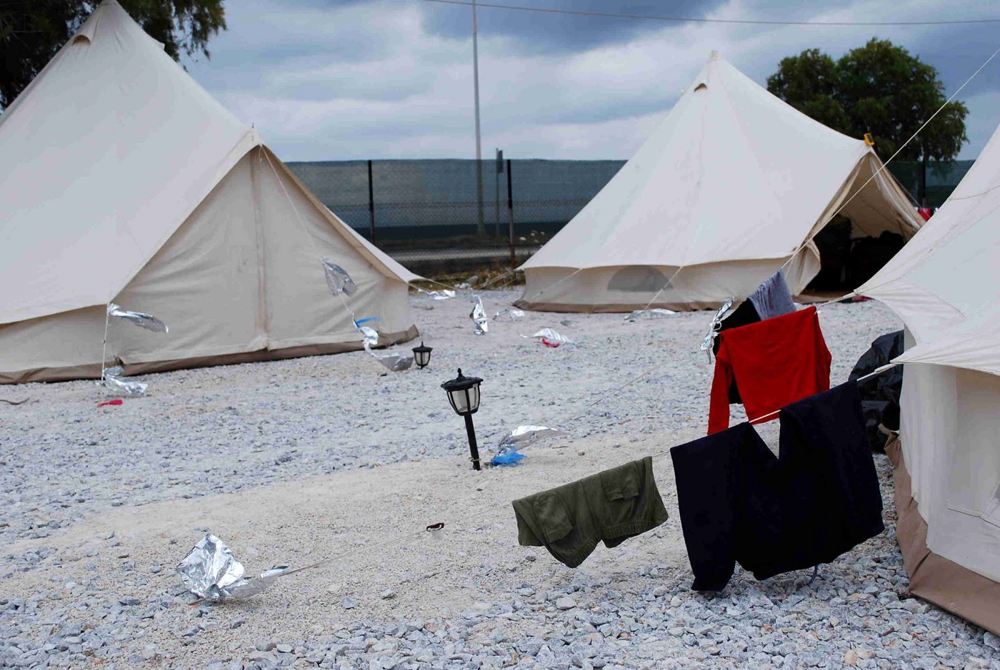

Source: Lesvos Solidarity Pipka
### Feature: Nine refugees attending secondary school were beaten and taken to hospital

Yesterday a group of nine refugees between the ages of 14 and 15 attending the secondary school Branko Pesić in Zemun, were beaten by a group of young men in front of the school\.

The children suffered injuries and were taken to the emergency centre\. During the attack the group of nine did not resist in any way\. As soon as the school administration became aware of the attack they reacted by calling for emergency assistance\. The attackers fled the scene\.

One person was seriously injured in the attack while the other 8 suffered minor injuries\. All were released from hospital last night\. The identity of the attackers remains unknown, however unofficial reports state that the attackers were not pupils of the school\.
### Sea:
#### Big Weekend of rescues by [Salvamento Marítimo](https://www.facebook.com/salvamentomaritimo.es/?hc_ref=ARSA76TIwfAkI4ZNFqFNjk3kumMHZiDZGmdFjKAtuHhpZOfOBN-BzxCN9sCh7EYPUAU&fref=nf)

293 people were rescued on Saturday from 9 boats and 243 people were rescued on Sunday from 8 boats\.

Over the weekend 536 people were rescued from sea\.

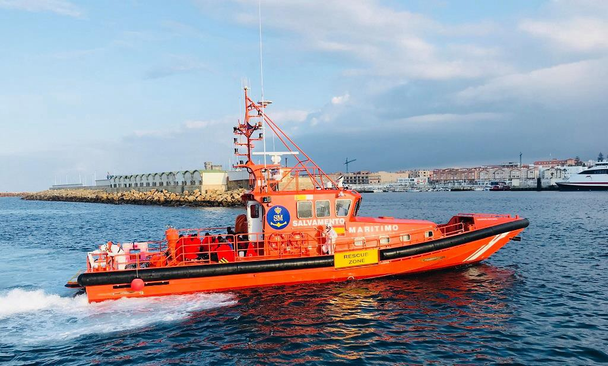

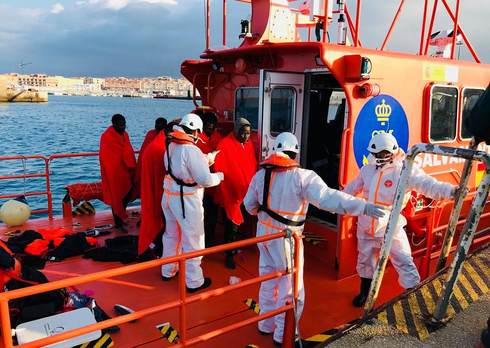

#### [Sea\-Eye](https://www.facebook.com/seaeyeorg/?hc_ref=ARQUSEGAwEUUJmZi_MiBSvMW7fGa5FHAsAxMyExS4RuQ4PaJTH4iC403gJFwLYZHWjI&fref=nf) update

The Sea\-Eye boat rescued 138 people including two injured\. They are currently awaiting instruction from MRCC Rome on how to proceed\.
### Greece:
#### Arrivals:

16 new refugees arrived on Agia Marina beach, in eastern Rhodes\.

One boat was picked up outside Farmakonisi 01\.30\.
Report say 25 people\.
Numbers not confirmed, no breakdown\.
#### People displaced a second time on Lesvos

In the last 48 hours following the break out of fights in the Moria Hotspot, 368 people have fled the camp out of fear for their safety\.

> “Tonight we house approximately 368 people… Mostly families a lot of elderly and even more children\.” 

> “We are in an emergency situation and together with the other organizations in the island we are trying to help everyone in need for a safe place to stay\. We need your help to be able to continue providing water, food, emergency equipment and transportation to all people\.” 

> Whilst the world was watching the UEFA Championship League another European football pitch was being used in a very different way … it became home for 368 refugees\. 

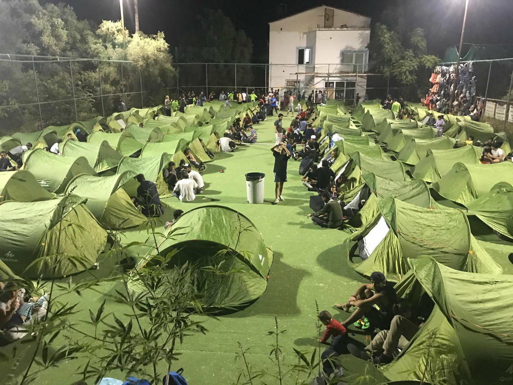

Source: Atikka Warehouse
#### Wifi along with power banks have been installed at Lesvos Solidarity Pikpa

Wifi, along with a power bank created by our volunteers today, allows everybody to keep in touch with their beloveds\.

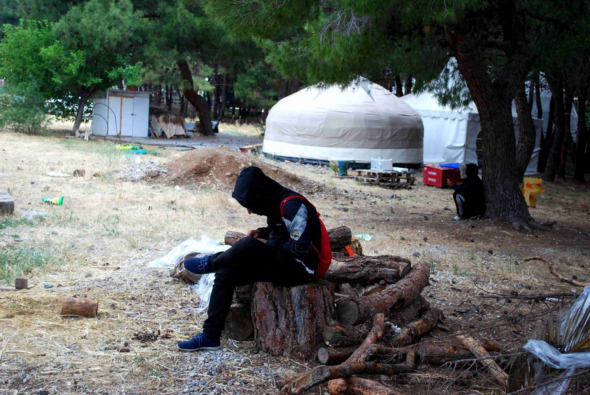

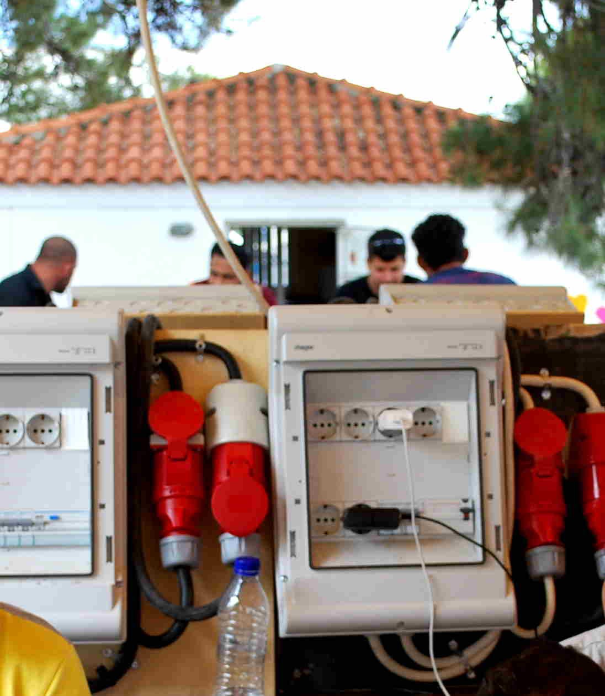

#### Pikpa is in need of support as more people continue to arrive

Since yesterday 360 people have arrived\. In order to provide support Pikpa is reliant on donations\. To find out more about how you can help please [follow this link\.](https://lesvossolidarity.org/…/donate-en/financial-donations)
#### [The Unmentionables Resource Center](https://www.facebook.com/The-Unmentionables-Resource-Center-168868790543031/) weekly schedule 29th of May — 1st of June

Please note that they will be closed on Monday

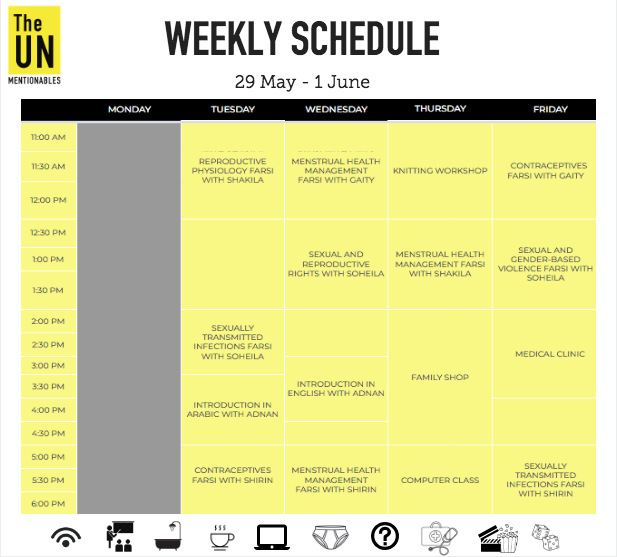

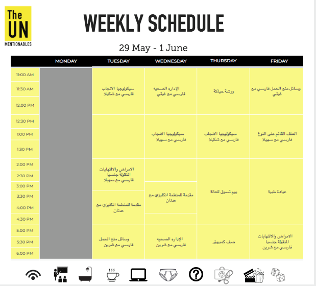

#### [Zaatar — non\-profit organization](https://www.facebook.com/zaatarngo/?hc_ref=ARRb85pLrm1jQWZvQr2HNPmBr9iF5ebCklS9q9Xs6B8RKBPvpQSHm40vufKQlMS_WQE&fref=nf) weekly schedule

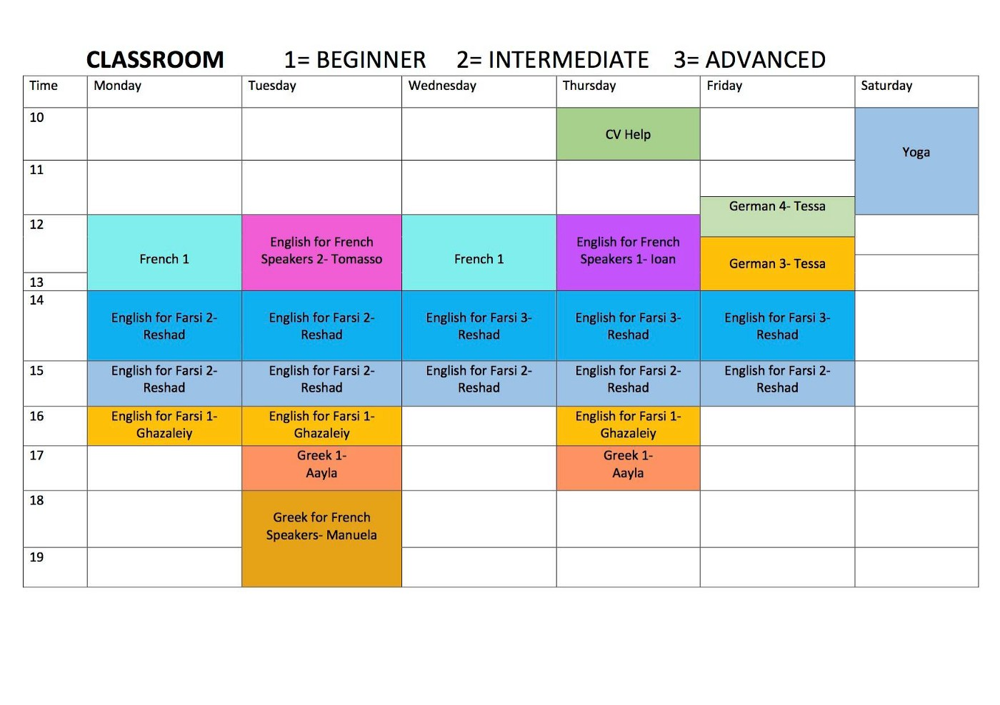

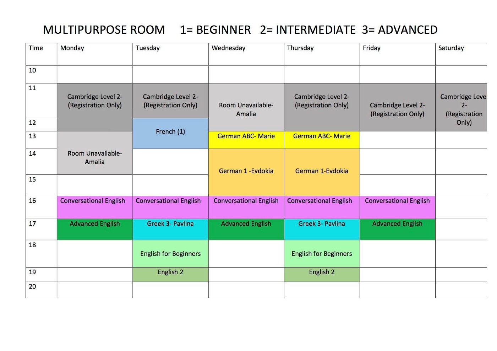

### Macedonia:
#### The government submitted a bill to the Parliament to [extend the state of emergency in Macedonia until December 2018](http://legis.mk/news/2585/emergency-state-to-be-extended-due-to-migrants)

The NGO Legis reports that irregular migration exists and therefore it is necessary to extend the state of emergency at the Northern and Southern borders of the country\.

> Refugees and migrants transiting through Macedonia on their way to western EU countries are faced with challenges, some of them are victims of smugglers and therefore need institutional protection, activist Jasmin Redjepi from Legis says, commenting on the Government’s bill to extend the state of emergency due to the situation with the refugees and migrants\. 

Legis reports that since August 2016 approximately 5000 people have travelled through Macedonia from Greece into Serbia\.
### Italy:

No Name Kitchen continues to provide aid to people on the move in the Baobab camp in Rome\. They warn that as the temperatures continue to increase, the distribution of water is essential\.

Since there is no running water in the camp, No Name Kitchen distribute 600 litres of water per day\.

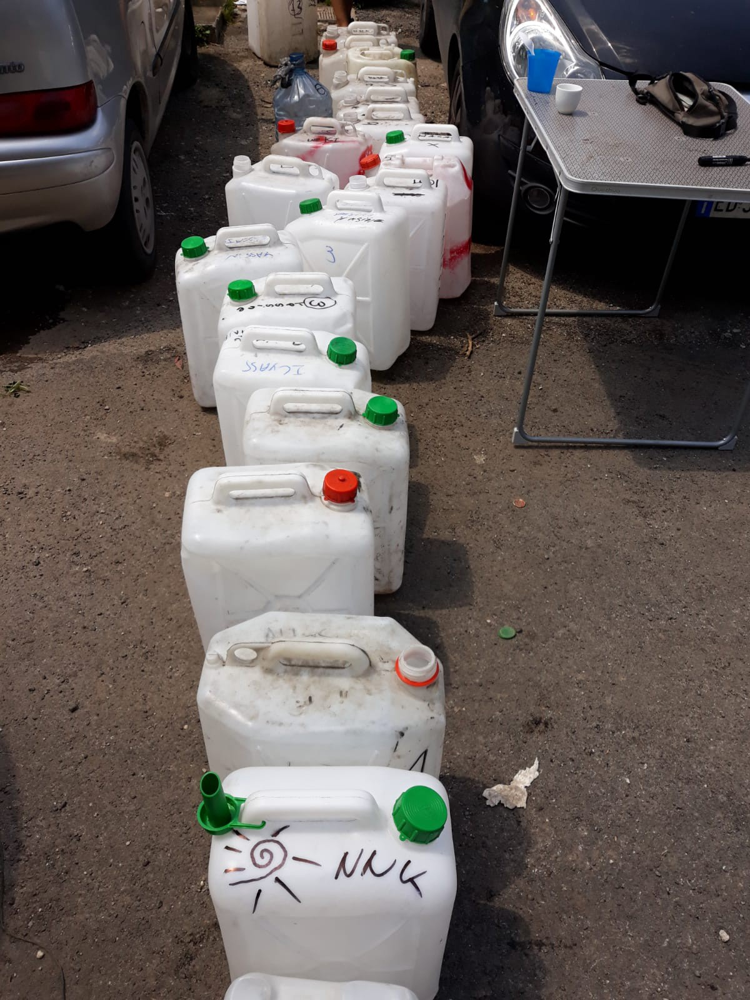

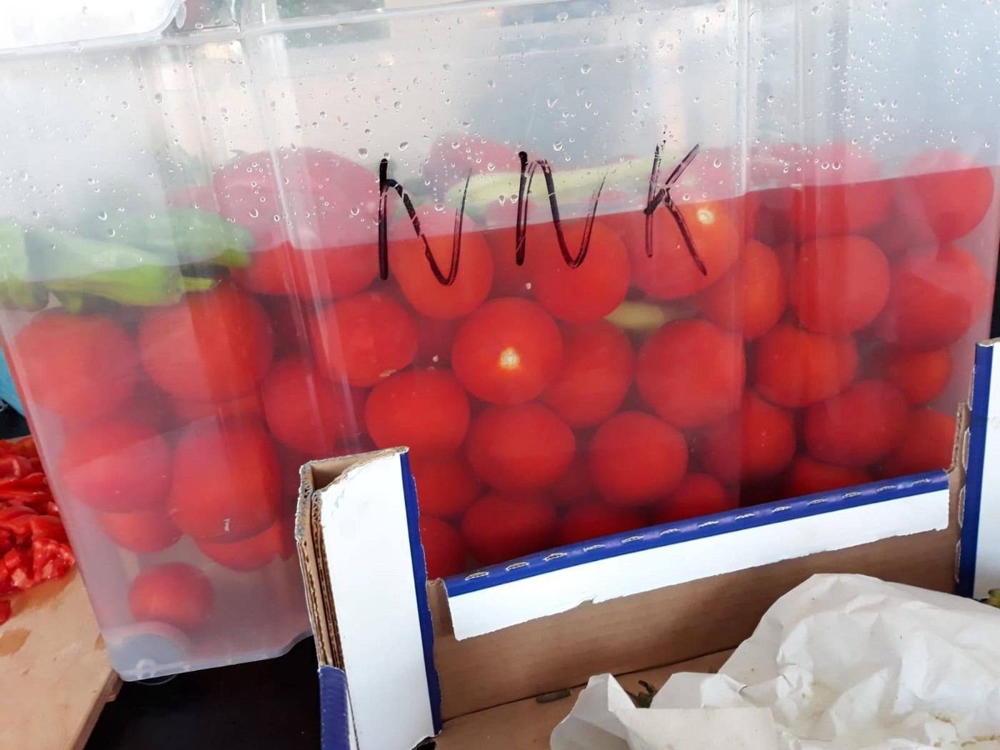

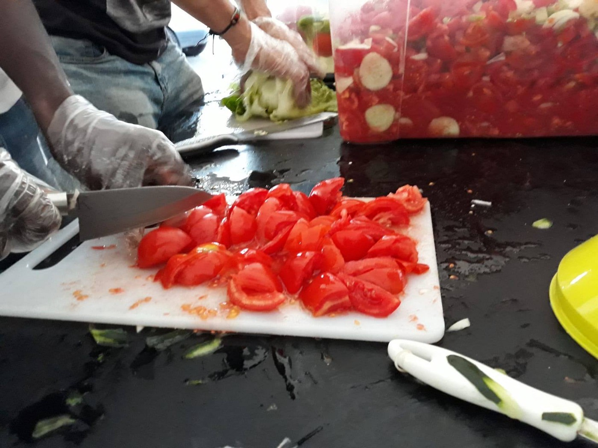

### Austria:

In July, Austria will take over the European Council’s rotating presidency for 6 months, from Bulgaria\. It will be able to set the agenda of EU summits and push EU legislation\. Austria’s chancellor has stated that EU border guards should be allowed to patrol parts of North Africa in an attempt to prevent refugees and migrants from attempting to cross the Mediterranean sea into Europe\.

> Sebastian Kurz told German weekly _Welt am Sonntag_ that the EU’s border protection agency, [Frontex](https://www.independent.co.uk/topic/frontex) , should should have a mandate “to act in third countries, with the permission of their governments, to end smugglers’ dirty business model and prevent smugglers’ boats setting off on the dangerous route across the Mediterranean”\. 

Currently Frontex is restricted to only patrolling the borders of the Schengen area\. Furthermore the European Commission announced in May that it planned to employ an extra 10,000 Frontex border guards by the year 2027\.
#### Austria’s Interior Minister Herbert Kikk announces [plans to make borders impenetratable](https://usn.co.ba/globus/eu/austrija-moguce-zatvaranje-granica-zbog-balkanske-rute/113172/) to migration

In a statement to the APA agency, Kikkol has said that a border and police unit will be established which will be able to urgently respond and make borders impenetrable to ‘illegal’ migration\.

The minister has stressed that he does not want to see a repeat of the flow of migration that was seen in 2015 and 2016\.

The police unit seeks to be made up of between 500 and 600 people, who will be able to act at any moment to close borders for illegal migrants\.
### Belgium:

The parents of Mawda, the two year old girl who was killed by a bullet fired by the police on the 16th of May [have applied for permanent residency in Belgium\.](http://--- http://deredactie.be/cm/vrtnieuws.francais/Politique/1.3204040 ---)

The secretary of State for Asylum and Migration, Theo Francken, stressed that he would not decide alone on the decision to grant permanent residency, and that the government would have a say\. The decision will not be made immediately as the request will not read by administration for some time\.

The family will not however be returned to Germany, where they first applied for asylum, while the investigation continues\.
### France:
#### [Dunkirk / Dunkerque Refugee Women’s Centre](https://www.facebook.com/refugeewomenscentre/) reports on the impact that Mawda’s death has had on her community

> 3 days after the gym closed and all the families in it were split around northern France, we remember the effect Mawda’s death had on her community\. Children had a friend ripped away, families remained traumatised by their experiences of that night\. For everyone who has been in the position of Mawda’s parents, stuck on the border between Britain and France, this was a brutal reminder of the precariousness of their position\. 

They warn that families who are housed in state accommodation centres face an uncertain future with plenty of instability\. As contracts come to an end families are preparing to be kicked out\. They anticipate that many families will return to the new jungle site in Dunkirk\.

\*What can you do?\*

> Welcome and support those that are still living in precarious situations\. Those not welcome by our governments\. The show of support to Mawda’s family from individuals and collectives has sustained them up until now\. Seek out local groups, maintain pressure on governments to support those in transition, and show refugees the same love and kindness you have shown for Mawda\. 

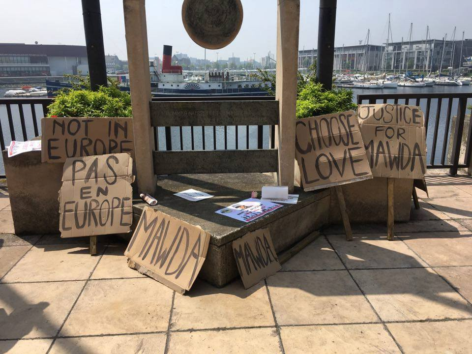

#### [Collectif Solidarité Refugees Paris\-Suburbs](https://www.facebook.com/CSRParisBanlieue/) have organised a protest on June 2nd against the asylum immigration bill\.

The ‘Asylum\-Immigration” bill presented by Gerard Collomb will arrive in the Senate early in June to be considered by the committee\. For the bill to be adopted it must be voted in by the Senate in June\.

> This is one of the last chances to mobilize against this dangerous bill\. 

> It is necessary to impose the withdrawal of this racist and liberticidal law which legitimizes even more the hunt for foreigners, the police controls,the confinement measures, including for children, and the ideas of the National Front\. 

The groups of sans\-papiers in the Paris region are calling on the entire social movement to demonstrate alongside them on Saturday, June 2, from the Place de la République in the Senate\.

They call for Freedom of Movement, and end to Dublin \(neither detention nor expulsion\) and regularization of all undocumented migrants\.
#### Mobile Refugee Support have Moved to a New Location

[Mobile Refugee Support](https://www.facebook.com/MobileRefugeeSupport/?hc_ref=ARQNCXnveEmaWk0O1NhxcAc9tcRGRAeDbv8gsh40GtduaFgIwmeJe1KVU1Z5JsSgK1I&fref=nf) have successfully moved to a new location which allows them to continue providing valuable support\. This came after French authorities evicted people from Dunkirk and have continued to clear tents and shelters in the previous areas of the woodland\.

> This week has shown incredible dedication and persistance from all the organisations and volunteers operating here\. Together we will continue to find solutions to the problems we are faced with\. [DROP solidarité](https://www.facebook.com/solidarite.drop/?fref=mentions) , [Refugee Community Kitchen](https://www.facebook.com/refugeeCkitchen/?fref=mentions) , [Emmaüs France](https://www.facebook.com/emmausfrance/?fref=mentions) \. 

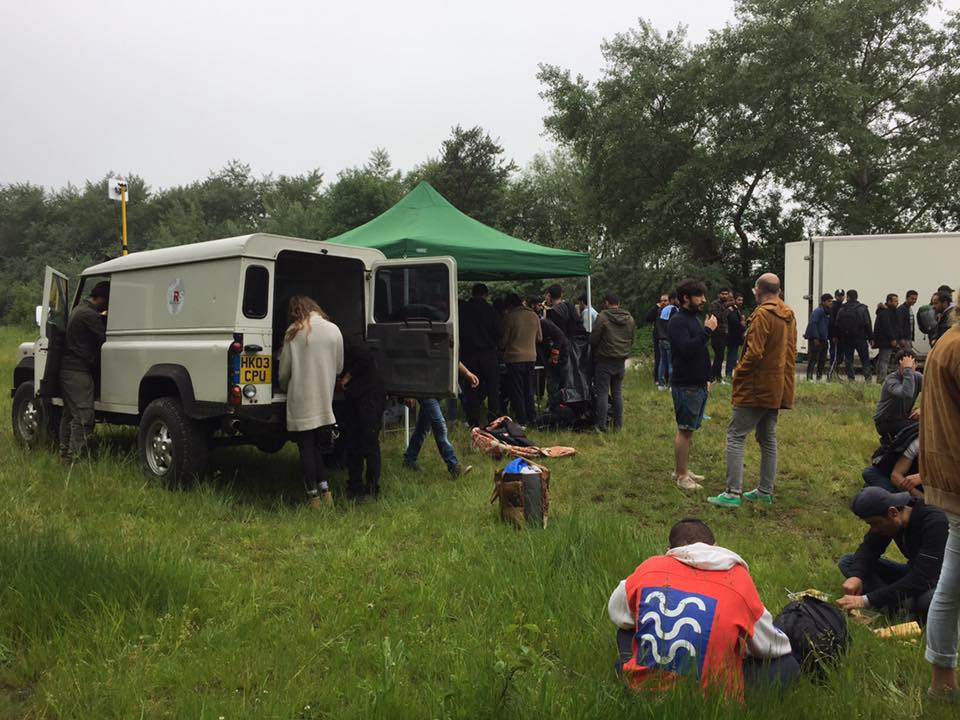

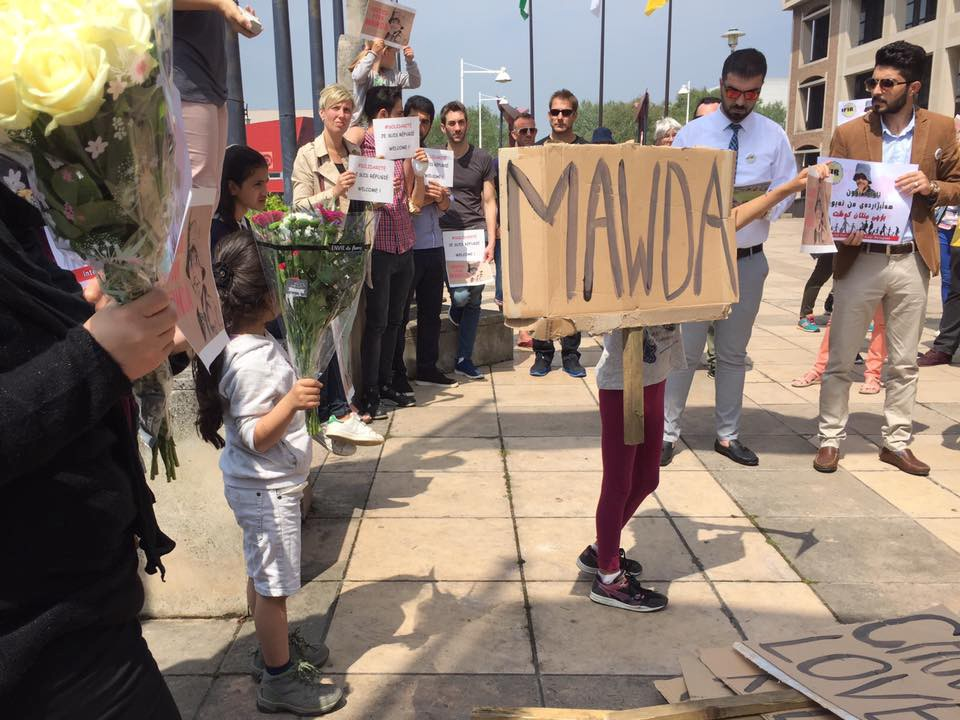

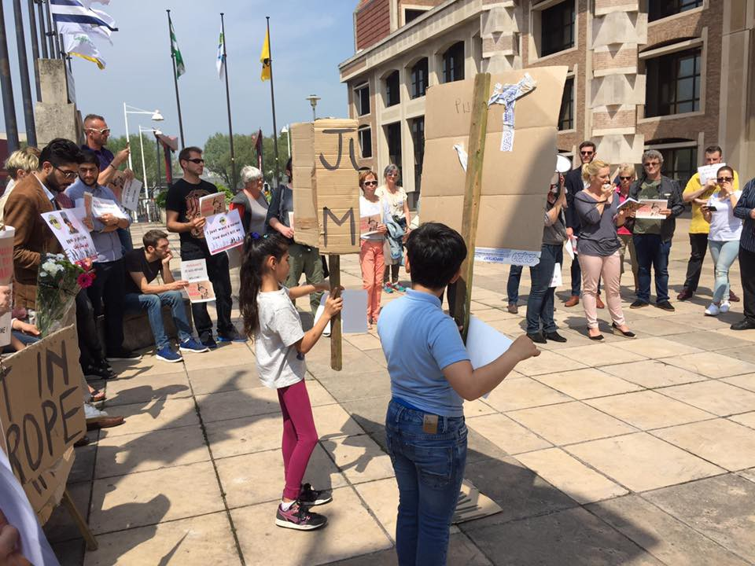

### Morocco
#### Another death has occurred in camp Nador\.

At 5pm yesterday a young man from Guinea was found dead in his bunker by a friend\. Cause of death remains unclear but reports from his friends state that the deceased suffered from a sickness which was aggravated by the difficult living conditions he faced\.

[Association Marocaine des Droits Humains — Section Nador](https://www.facebook.com/AmdhNador/) report that camp Nador is the worst camp in the area\.

They warn that people who reside there are completely neglected by NGOs who have funding to assist\. There is no medical care, food or hygiene in the camp\.

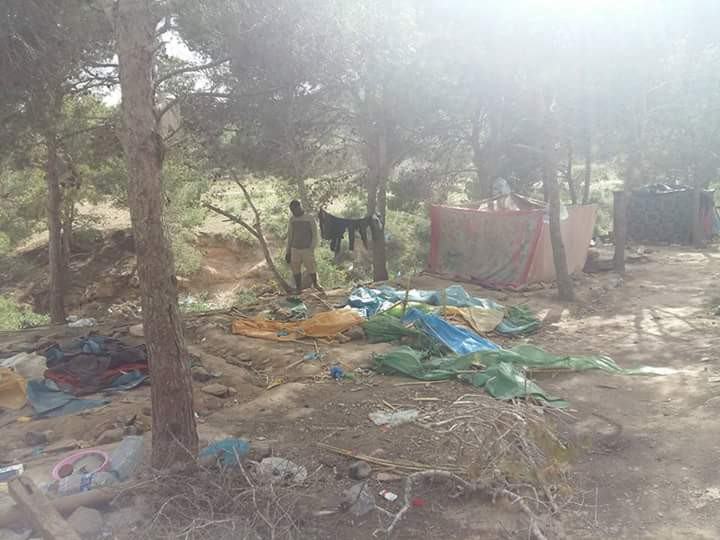

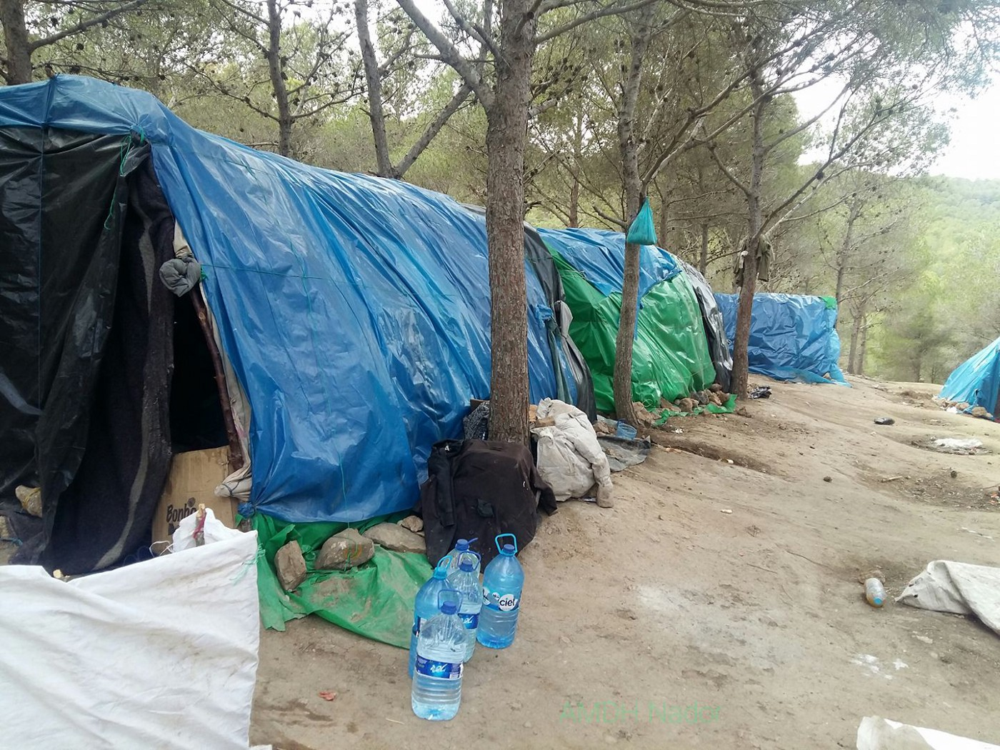

### **We strive to echo correct news from the ground through collaboration and fairness\.**

**Every effort has been made to credit organizations and individuals with regard to the supply of information, video, and photo material \(in cases where the source wanted to be accredited\) \. Please notify us regarding corrections\.**

**If there’s anything you want to share or comment, contact us through Facebook or write to: areyousyrious@gmail\.com**

_Converted [Medium Post](https://medium.com/are-you-syrious/ays-daily-digest-27-05-2018-nine-teenage-refugees-attacked-at-elementary-school-in-serbia-fb80ae26f8c1) by [ZMediumToMarkdown](https://github.com/ZhgChgLi/ZMediumToMarkdown)._
