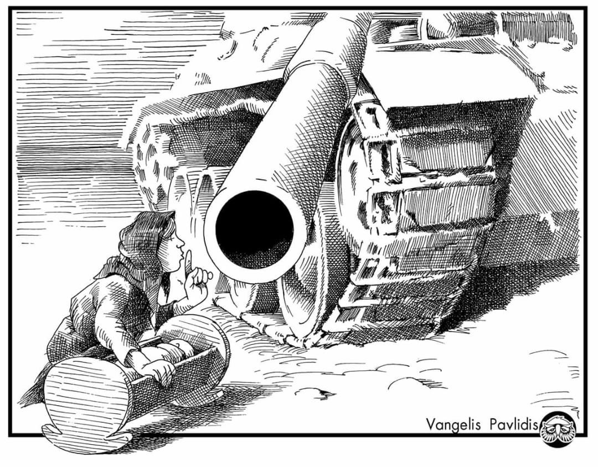
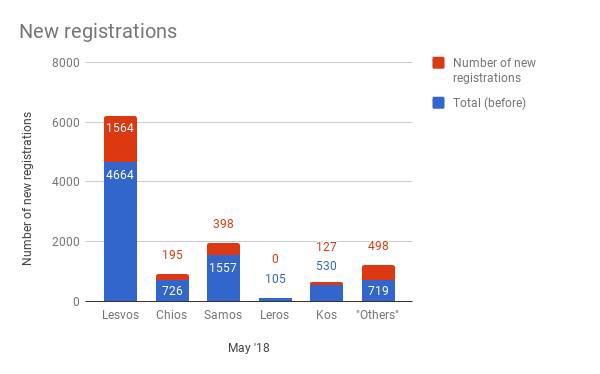
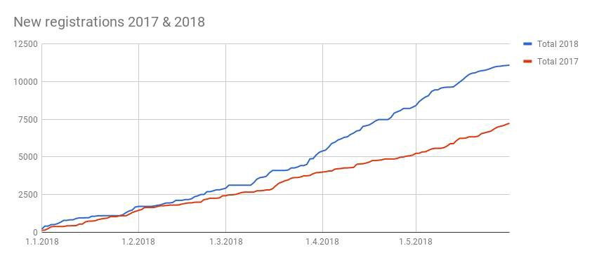
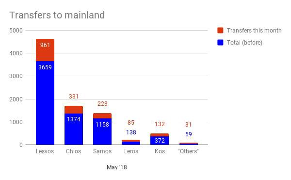
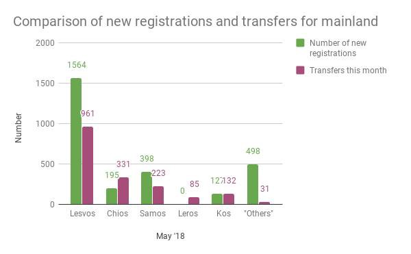
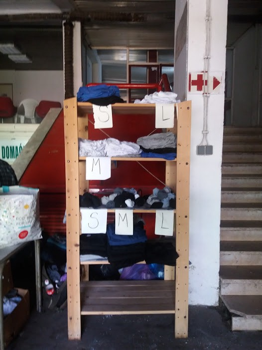
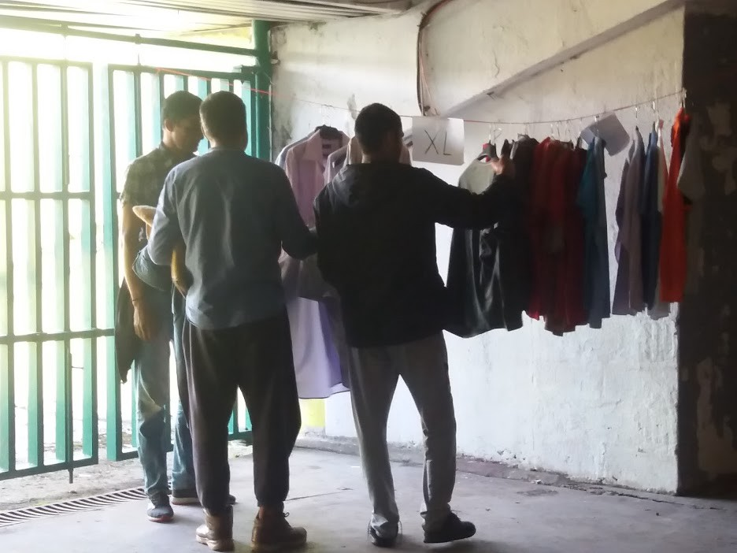
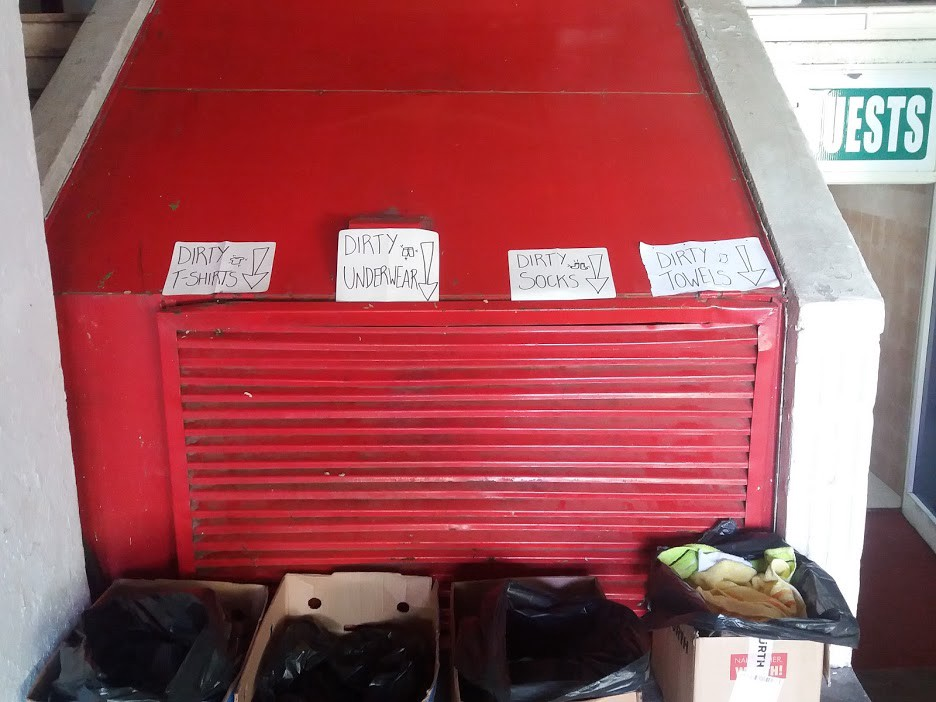
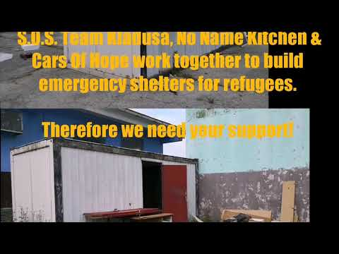
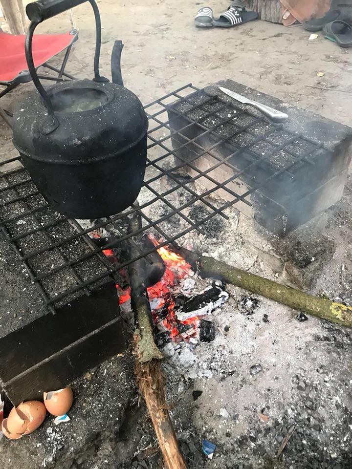

### AYS DAILY DIGEST 1/6/2018: Who is responsible for the horror we are living in?

State’s Attorney Office of Croatia decided no one is responsible for the death of little Madina // Thousands of people on the move arrived in Europe this year seeking shleter and safety // Those who are trying to help them in Greece, Italy, Spain, Bosnia… need help

By Vagelis Pavlidis
### Feature

Her name was Madina Hussiny\. On a cold November night in 2017, she entered Croatia from Serbia with her family, asking for asylum\. However, as had happened before and would happen again, they were stopped by the police and pushed back\.

Following orders, Croatian police officers forced the family to follow the train tracks back to Serbian territory\. No asylum for you, they probably said, like so many times before\.

Madina was hit by a train and died minutes after the push\-back\.

On Friday, the State Attorney’s Office of the Republic of Croatia decided no one was responsible for the death of little Madina\.

The decision was made after seven members of her family, on December 21st, 2017, filed a criminal complaint against the police\. The complaint states that unknown police officers from the Interior Ministry caused Madina’s death because of negligence, that they grossly violated the rights of the child, abused their position and power and caused, by inhuman treatment, severe mental pain and suffering to the family\.

Since then, Madina’s family has tried several times to enter Croatia and express their intention to seek asylum\. At the end of March, they managed to do that, but were put in detention, where they are still being held\. Their application for asylum has been rejected on the grounds of Serbia being a safe country\.

The day before the decision was published, on Thursday, [Croatian police officers](ays-daily-digest-31-05-2018-two-refugee-children-shot-by-croatian-police-5c3c811e0f07) shot two refugee children, both 12 years old\. They were trying to enter the country from Bosnia, in a van with 28 people\.

It seems that no one will be charged for this misdeed, either\.

How many children have to be killed or wounded before someone is held accountable for the violence on Croatian borders?

How many people will come back after yet another attempt, robbed and badly beaten up by the Croatian police?

This has to stop, and the European Union finally has to do something in this case, as in the case of Hungary, Romania, Bulgaria but also other memebr states who are refusing to respect people’s basic human rights\.
### Syria

In their [lates report](http://sn4hr.org/blog/2018/05/31/52253/) , the Syrian Network for Human Rights \(SNHR\) claims that the years of conflict in Syria have left almost three million homes completely or almost completely destroyed, and the regime has caused about 90 per cent of the damage\.

According to the report, “the regime used extensive destruction as a war tool against all who opposed it, and aimed to end and destroy all forms of opposition to the regime, and to completely destroy society\.”
### Afghanistan

European countries continue to ignore the facts, which show how unsafe life is in Afghanistan, and to [deport people](https://www.ecre.org/return-continues-to-afghanistan-in-crisis/) \.

The European Commission has confirmed that 23 charter flights were carried out from December 2016 to December 2017, coordinated and financed by the European Border and Coast Guard Agency from Austria, Denmark, Finland, Germany, Hungary and Sweden\. **A total of 358 third\-country nationals were returned to Afghanistan on the flights at a cost of EUR 5 479 694\.95, just over EUR 15,000 per person\.**

At the same time, people continue leaving this country and coming to Europe, constituting the third biggest group of arrivals in the EU from January to March 2018\.

IOM estimates that 30 per cent of returnees are in need of life\-saving humanitarian assistance, but available funding only covers seven per cent\.
### Sea

This year, 32,080 people crossed the sea to come to Europe\. Out of this number, about 42 per cent arrived in Italy, 34 per cent in Greece, and 24 per cent in Spain\.

On Friday, Marina Hamal rescued 89 people from two boats \(37 \+ 52\) around the island of Alboran\.

■■■■■■■■■■■■■■ 
> **[SALVAMENTO MARÍTIMO](https://twitter.com/salvamentogob) @ Twitter Says:** 

> > Salvamar Hamal ha rescatado 89 personas de 2 pateras (37+52) en los alrededores de la isla de Alborán. Avistadas por avión Cóndor II Indalo. Van a Motril donde llegan a las 13:30h. Coordina CCS Almería https://t.co/PEUoMKOiJk 

> **Tweeted at [2018-06-01 11:29:39](https://twitter.com/salvamentogob/status/1002512494093586434).** 

■■■■■■■■■■■■■■ 

At the same time, the rescue center of Frontex coordinated the rescue of 107 people\.

■■■■■■■■■■■■■■ 
> **[SALVAMENTO MARÍTIMO](https://twitter.com/salvamentogob) @ Twitter Says:** 

> > El Centro de Salvamento de #Tarifa ha coordinado hoy el rescate de 107 personas (59 + 8 + 40 ) de 3 pateras localizadas en El Estrecho. Los rescates los han realizado las embarcaciones: Guardamar Concepción Arenal, S/Atria y S/Gadir. También participó un helicóptero de @[Frontex](https://twitter.com/Frontex) https://t.co/6BjuaGNFiK 

> **Tweeted at [2018-06-01 09:47:14](https://twitter.com/salvamentogob/status/1002486720993153025).** 

■■■■■■■■■■■■■■ 

The Guardamar Concepción Arenal rescued 36 men, 20 women and 3 babies in Barbate\. And at 8\.30 h, the Marina Atria rescued 8 people near Tarifa\.

■■■■■■■■■■■■■■ 
> **[SALVAMENTO MARÍTIMO](https://twitter.com/salvamentogob) @ Twitter Says:** 

> > A las 6.40h, la Guardamar Concepción Arenal rescató a 36 hombres, 20 mujeres y 3 bebés de una patera localizada 18mn S #Barbate. Acaban de ser desembarcados en Barbate. Y a las 8.30h,la Salvamar Atria rescataba a 8 varones subsaharianos de otra patera localizada 18mn SW de Tarifa https://t.co/QJxcljlteo 

> **Tweeted at [2018-06-01 06:58:28](https://twitter.com/salvamentogob/status/1002444249688952832).** 

■■■■■■■■■■■■■■ 

### Greece

More than 24,300 people on the move come to Europe by sea and land since January this year, most of them coming from Syria and Iraq\.

Most of the people who arrived to Greece since the beginning of this year were from Syria, and 37 per cent of them are families with children\.

In total, 2,782 people arrived \(1,763 transferred to the mainland\) in May, and 11,083 \(8,523\) since the beginning of the year\.

Additionally, there were five deportations under the EU\-Turkey deal with a total of 29 deported people, among them nine Syrians\.

By AYS

By AYS

The Turkish Coast Guard \(TCG\) prevented a total of 101 boats from reaching the Greek islands in May 2018, with a total of 4,907 people on board\.

So far this year TCG/Police have stopped 342 boats, with a total of 14,816 people\.

The total official number on the Greek islands is 16,689 people\.

By AYS

According to the European Commission, nearly 34,690 peope have been relocated from Greece and Italy as of 30 April 2018, including nearly 22,000 from Greece \(out of 66,400 originally foreseen, 33 per cent of the total\) and 12,690 from Italy \(out of 39,600 originally foreseen, 32 per cent of the total\) \.

The transfer of asylum\-seekers from Greece to other EU Member States under the relocation scheme has now been concluded\.
### Albania

In the first four months of 2018, over 1,500 arrivals were recorded in Albania, which is an 146 per cent increase in comparison to the whole of 2017\. The number could be much higher, since most of the people who are passing through this country are not registered at all\.
### Montenegro

Officially, some 800 people have arrived in Montenegro this year, but as is the case in Albania, the number could be much higher having in mind those who did not register\.
### Bosnia

The number of people who entered the country is over 5,000 and is increasing daily, despite stronger border control\. Out of this number, at least 70 per cent have not found accommodation in Bosnia but are forced to sleep rough in parks, streets, and forests, and a number are being hosted by locals in the Sarajevo, Bihac and Velika Kladusa areas\.

After civil society, the media and even the Council of Europe High Commissioner noticed a number of issues faced by people on the move in Bosnia, even the UNHCR came up with a report stating some of these issues and saying that access to asylum procedures remains an issue that has to be dealt with, as well as accommodation\. Due to these two issues, only about 30 per cent of the people have managed to formally submit an asylum application\.

The situation is worst for unaccompanied and separated children\. Officially, there are 51 boys and two girls registered in Bosnia, but many claim they are older then they are because they are afraid they will be sent to closed facilities\. According to UNHCR data, only six children have been appointed a guardian in BiH\.

The number of people who have been exposed to beatings, robberies and sequestering during their journey to BiH or at the border with Croatia while trying to reach the EU is hard to establish\.

Access to health care, mental health care, and sexual and reproductive health care is a major concern, compounded by a lack of personal hygiene often connected with protracted travel in difficult circumstances\.

Infants, babies, and pregnant women are exposed to particular health risks due to incomplete/inadequate levels of immunization and limited access to maternity care\. From January to March, 12 pregnant women were identified, according to the [UNHCR data](https://data2.unhcr.org/en/documents/download/63869) \.

A large number of individuals have experienced traumatizing events during their journey and show signs of depression, post\-traumatic stress disorder \(PTSD\) and other mental health issues\.

Instead of the state or agencies whose responsibility it is to help people on the move, citizens of Bosnia and Herzegovina and individual donors from all around the world continue to provide food, accommodation, clothes, shoes…

On Friday, about 80 single men who are living rough in Sarajevo had a chance to finally shower\. This was possible due to people in one of the public sports facilities\.

Photo by AYS\.

The local charity [Pomozi\.ba](https://www.facebook.com/pomozi.ba/posts/1285791644886432) currently provides about 1,000 meals in Sarajevo\. The food is distributed and consumed in the streets, and people are forced to sit and eat in parking lots and parks\.

If you can help, and if you are in Bosnia, you can call 17002 to donate 2KM \(1 euro\) \. Or, you can donate via their PayPal: [paypal1@pomozi\.ba](mailto:paypal1@pomozi.ba) or their bank account if in Bosnia

Intesa Sanpaolo Banka BiH

154–180–20085330–48

_If outside Bosnia_

Bank name: Intesa Sanpaolo Banka BiH

SWIFT CODE:UPBKBA22

IBAN: BA39 1541802008533048

_If in Austria_

ERSTE BANK

IBAN: AT64 2011182266475400

BIC: GIBAATWWXXX

Wien, Oestereich

Name: hilfhelfen\-pomozi\.ba

Verwendungszweck: Pomoć za migrante

Recipient Udruženje “Pomozi\.ba”,

Address: dr\. Fetaha Bećirbegovića br\. 8

71000 Sarajevo

Purpose: Help for refugees and migrants

The [Eidomeni Refugee Support](https://www.facebook.com/groups/eidomeni.refugee.support/?hc_ref=ARTQZcqFs67cL6qkniMUYPg9dhUCyGMnUZgM2fnp_oojxGkSNlxMn6gihFY782hAcGU) group is in Kladusa, a border area with Croatia, where about 600 people are staying at the moment\. Together with S\.O\.S\. Team Kladuša, No Name Kitchen and some locals, volunteers and refugees, they are building emergency shelters for at least some families, wounded or elderly people\.

If you can help, donate by bank transfer, on their crowdfunding campaign or by PayPal\.

Volksbank im Bergischen Land

Account holder: Hopetal e\.V\.

Description: Cars of Hope

IBAN: DE51 3406 0094 0002 9450 87

BIC: VBRSDE33XXX

Crowdfunding campaign:

[https://social\.fund/kfifpt/](https://social.fund/kfifpt/)

PayPal:

[piksi\.sos@gmail\.com](mailto:piksi.sos@gmail.com)
### Serbia

There are about 3,041 people in Serbia at the moment, according to the [official figures](https://data2.unhcr.org/en/documents/details/63819) \.

The UNHCR in this country records illegal push\-backs from neighbouring countries\. Last month, 409 cases were recorded, up from 362 during the preceding two weeks\. Out of this number, 229 people were pushed back from Croatia, 106 from Hungary, 46 from Bosnia and Herzegovina and 28 from Romania\.
### Hungary

[Amnesty International](https://www.amnesty.org/en/latest/news/2018/05/hungary-laws-are-cruel-attempt-to-criminalize-those-helping-asylum-seekers/) and [Human Rights Watch](https://www.hrw.org/.../hungary-bill-makes-aiding...) harshly criticized the Hungarian government for criminalizing assistance to people on the move and prohibiting civil society organizations, branded as “foreign agents”, from working with them\.

The measures, which introduce a new crime punishable by up to a year in jail, will be before the parliament next week\.

“This cruel plan to hermetically seal their borders would criminalize legitimate activities such as offering information and providing legal advice to asylum seekers\. This could result in paralysis for organizations and leave already vulnerable people in an ever more precarious situation”, said Amnesty International’s Europe Director, Gauri van Gulik\.

“Hungary’s government should withdraw this bill, honor the country’s duty to refugees, and end its odious campaign against rights defenders,” said Benjamin Ward, deputy Europe and Central Asia director at Human Rights Watch who adds that the European Commission needs to activate Article 7 of the European Union treaty, which is designed to deal with governments that put the Union’s values at risk\.”
### France

[Care4Calais](https://www.facebook.com/care4calais/?hc_ref=ARQOgRotDKj-ZX6dYUNGrOvfXsIBxdJ5QG9BiIOSWq6n8M4N5chSBQIr98B-77pOI4I&fref=nf)

“Today I met a man who wouldn’t let me take his photo\. He seemed very shy but was quite adamant\. He was very friendly so I decided to push a little harder\. Reluctantly he said it was because his parents would be devastated if they knew how he lived: in a canvas shack in a patch of woodland\. He had told them he lived in s hotel and was doing fine\. He was heartbroken to disappoint his mother and wanted his father to be proud of him\. Back home they follow Facebook so he thought they would see it, it was a real fear\.

As a mother myself, I know how his mother would feel watching the world destroy her son and his hopes and dreams\. I would feel so helpless, he can’t go home to likely death or imprisonment and he can’t go forward because of politics and people’s irrational fear of refugees\.

What would you want if this were your son?”

[**Urgent appeal\! \! \! \!**](https://freedomnews.org.uk/calais-border-update/)

Two Refugee Camps \(Porte D ‘ Aubervilliers and canal saint Martin in jaurès\) will be dismantled on Monday\. The breakfast group is organising a collection of backpacks so that the migrants who are to be “sheltered” can gather together and transport their business\. This collection will take place throughout the weekend at point Ephémère, 200 Quai De Valmy 75010 Paris, Métro Metro \(at the opening hours of the bar from 12 pm to 2 PM\) \.
### Germany

The European Union will give Germany some €4\.5 billion from 2021 to 2027 as “compensation for the financial burden of taking in some 1\.7 million refugees since 2013”, a [German media](http://www.dw.com/en/germany-to-receive-compensation-payments-for-refugees-report/a-44038746) reported on Friday\.

The Frankfurter Allgemeine Zeitung said in its exclusive report that the EU would pay out €2,800 for every non\-EU citizen who had come to Germany as a refugee and stayed\.

The money is to come from the structural fund that the EU uses to support economically fragile regions, the report said\.

**We strive to echo correct news from the ground through collaboration and fairness\.**

**Every effort has been made to credit organizations and individuals with regard to the supply of information, video, and photo material \(in cases where the source wanted to be accredited\) \. Please notify us regarding corrections\.**

**If there’s anything you want to share or comment, contact us through Facebook or write to: areyousyrious@gmail\.com**

_Converted [Medium Post](https://medium.com/are-you-syrious/ays-daily-digest-1-6-2018-who-is-responsible-for-the-horrow-we-are-living-in-85ee87c1c3a7) by [ZMediumToMarkdown](https://github.com/ZhgChgLi/ZMediumToMarkdown)._
