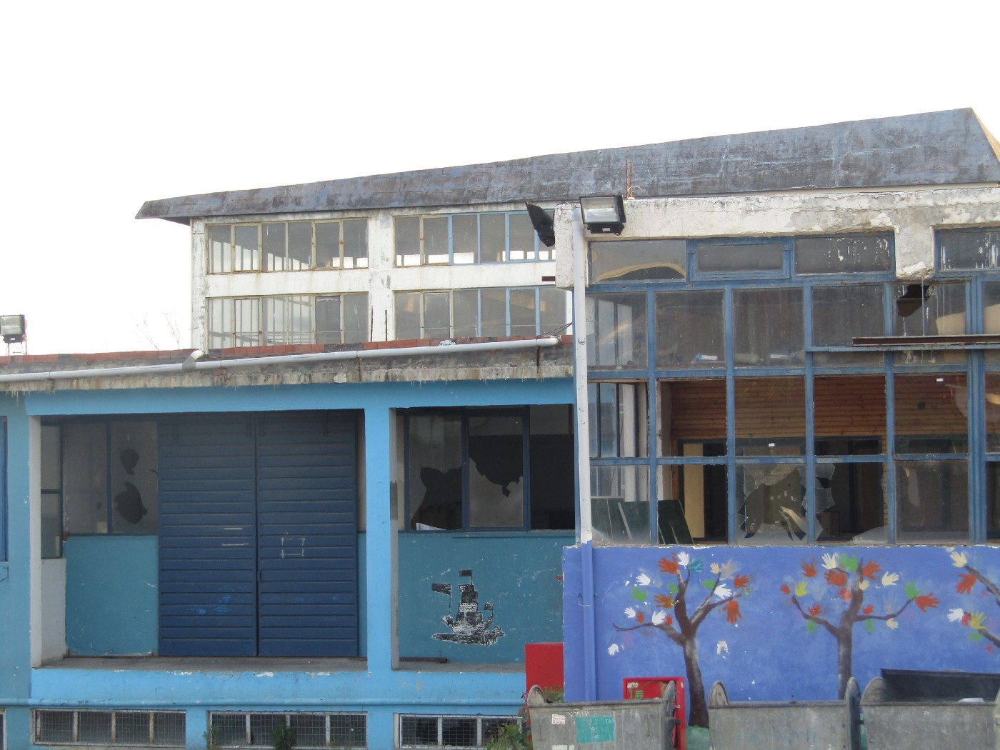
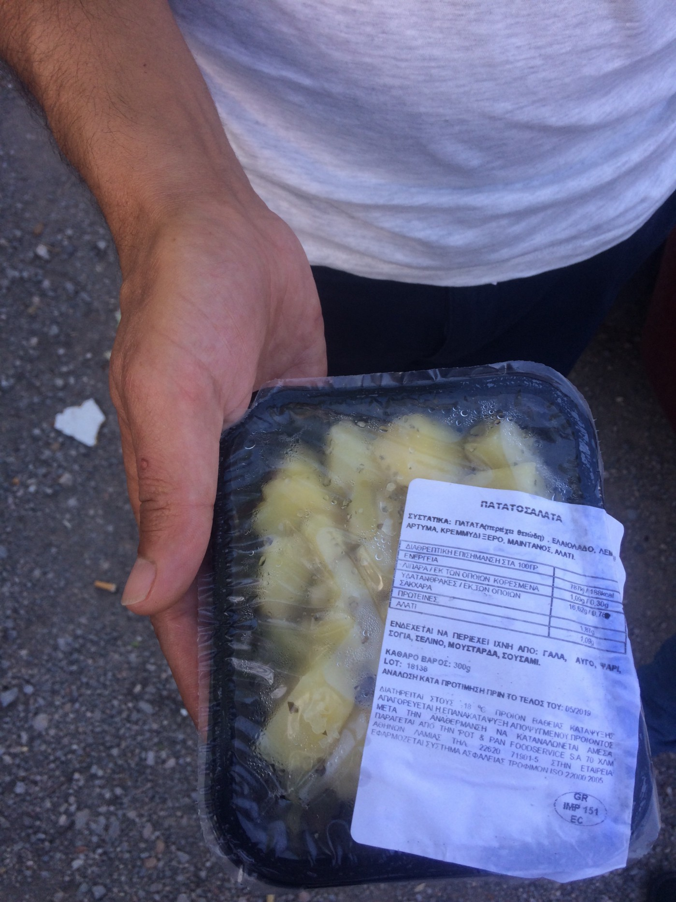
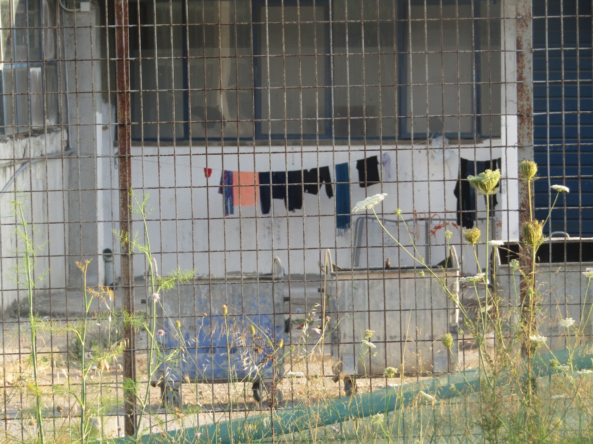
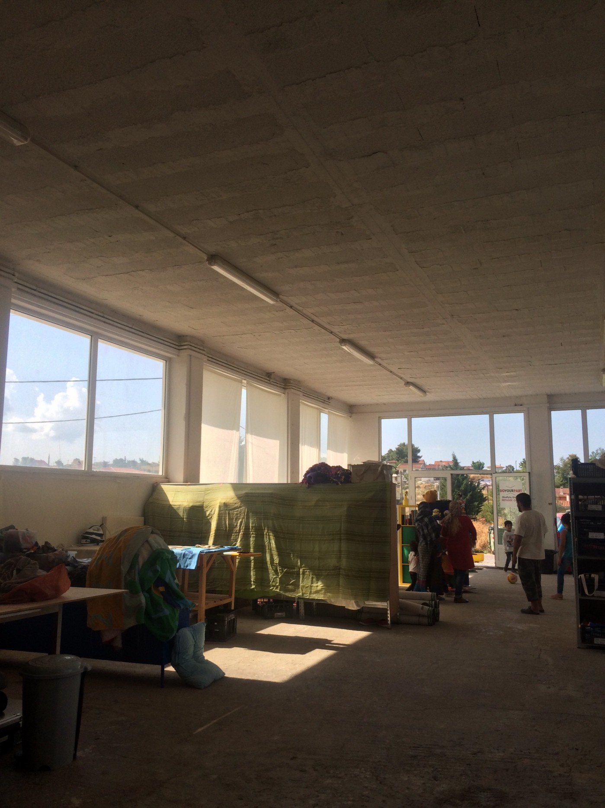
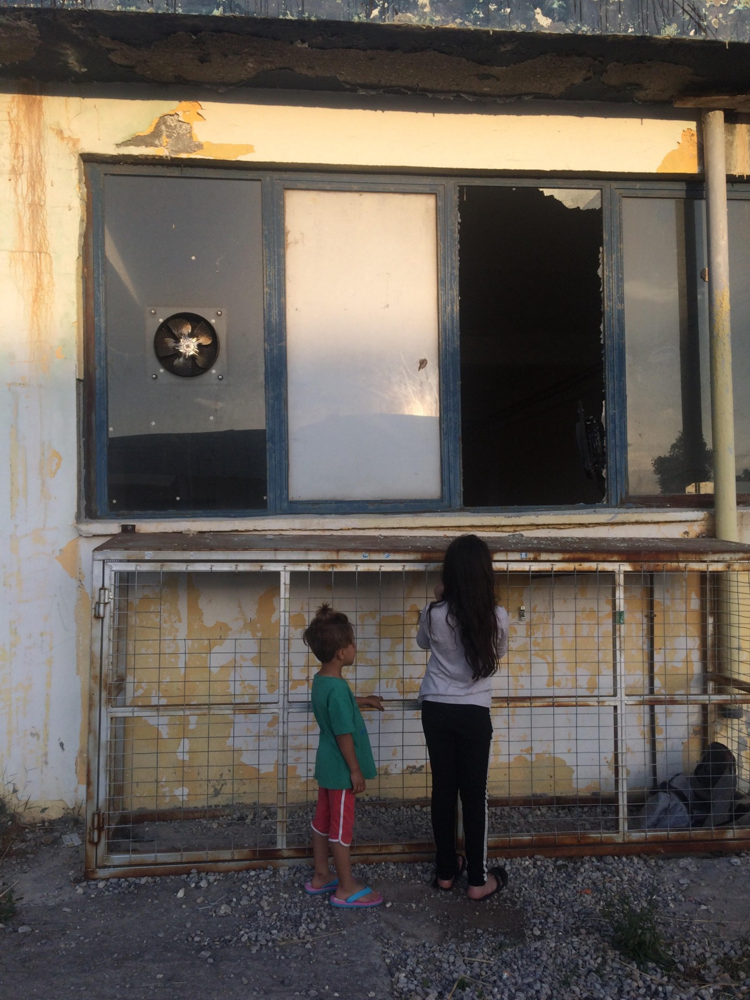
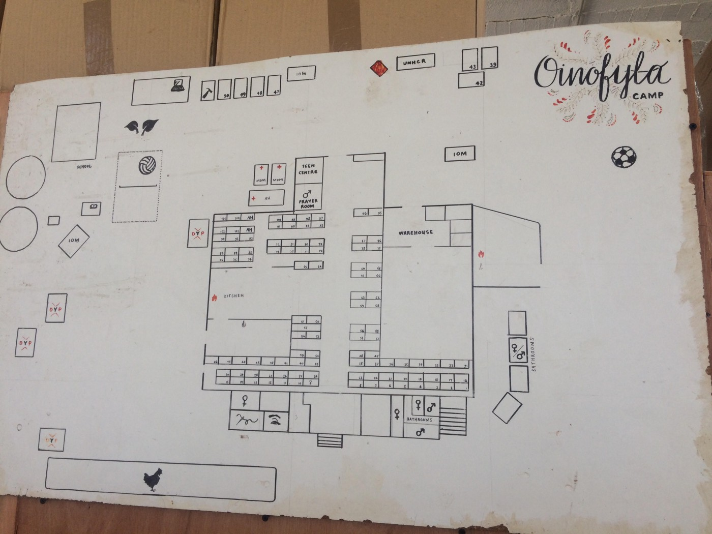
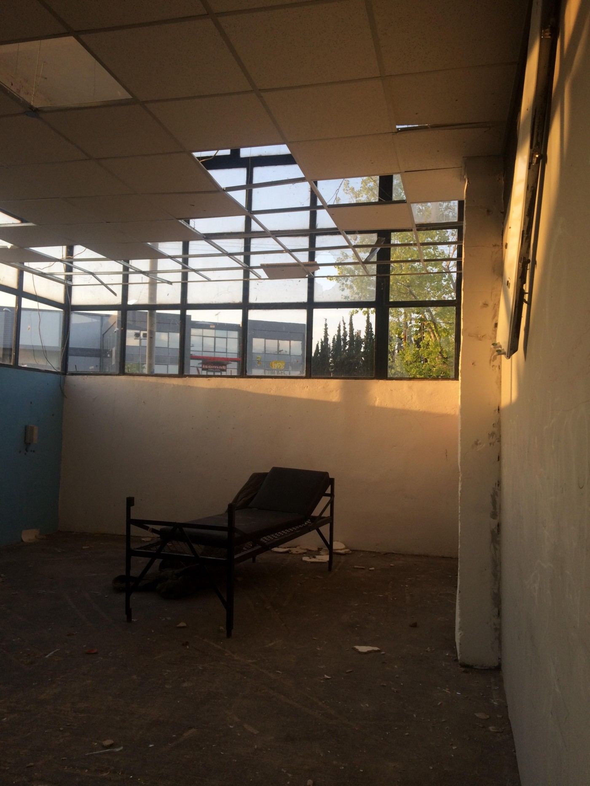
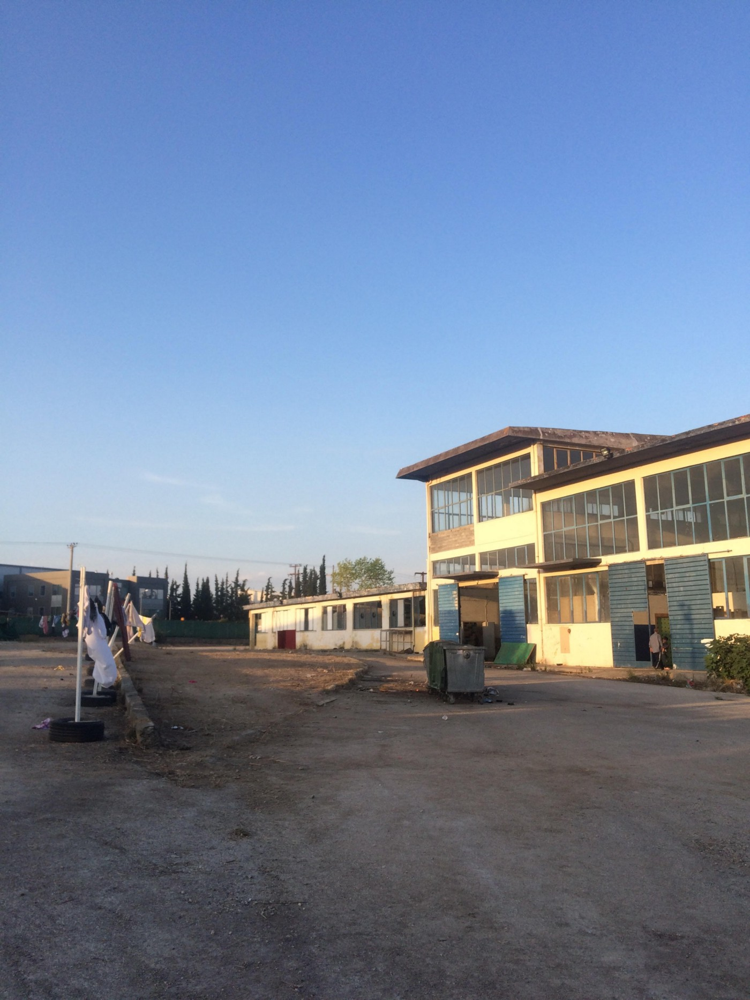

### **AYS SPECIAL — Oinofyta Camp:** The overwhelming sense of nothingness

_Camp Oinofyta was closed in November 2017 because it didn’t meet the standards of the European Commission department in charge of humanitarian aid\. On March 26, Oinofyta was reopened to accommodate people who arrived to Greece recently, as well as vulnerable transfers from the islands\. AYS visited the camp in late May and spoke with residents who are saying that the place is worse than Moria\._

_Camp Oinofyta\. Photo by Samim Azimy\._

When we arrive, just before sunset, the army catering truck has pulled up to the front gates of Oinofyta Camp, and a number of young men have climbed into the back and are tossing out small black plastic cartons of food to the people gathered below them\. There’s no one in charge of distribution and I can’t even see a driver; it’s almost as though the truck had materialized here at the edge of this refugee camp of 500 souls in the middle of nowhere\.

Ibra, my translator, excuses himself to clamber into the truck and emerges moments later with his dinner: sliced and boiled potatoes with “essence of chicken” sprinkled over them, all in a container barely bigger than his palm\. He holds it up for me to inspect: “I have been eating this since 13 December 2016\.”

“Do you want to eat this?” Photo by AYS

After a moment, a Greek man shows up, standing with a clipboard at a safe remove\. It’s his job to inspect and sign off on the food, says Lisa Campbell, the director of [Do Your Part](http://www.doyourpart.org/) \[DYP\], the only solidarity organization still operational in Oinofyta\. Ibra starts needling him, calling over at him: “Hi, how are you doing\! Can you take some of this and give it to your babies ?” The man smiles awkwardly, tight\-lipped, and Ibra says again, with an edge to his voice, “No, seriously man, take it home to your wife, to your children\. See what they say to you\.”

The light is the same as it is in Athens, golden and forgiving\. The whole scene is bizarrely calm, like how after the apocalypse is over and the dust has settled, the sun still rises in the morning and goes down at night\. As Ibra and I leave the distribution to walk into the gloom of Oinofyta’s interior, I turn around for a moment and see individual figures standing illuminated against the slope of the road out\. The sun setting on the last people on earth\.

Photo by Samim Azimy\.

Constructed inside a repossessed warehouse 58 kilometers to the north of Athens, Oinofyta is home, though it feels perverse to use that word, to some of Greece’s most vulnerable asylum seekers\. The overwhelming majority of residents fall into one of two categories: Syrian Kurds who have just arrived from Greece’s northern border, freshly traumatized from the destruction in Afrin **,** or people of various nationalities who were transferred more speedily from the island hotspots because they were deemed vulnerable\.

When I visit on a Friday afternoon in late May, I meet elderly men and women, including one who needs a wheelchair; women traveling alone; people with serious, untreated medical and psychological issues; survivors of torture; pregnant women; children \(there are around 130 in the camp\); and one single father\. There are also a lot of single men \(108, according to Lisa\), a demographic group vulnerable in specific and underreported ways, and one that often mixes poorly with families and small children\.

The Do Your Part Community Center\. Photo by AYS

Most refugee camps, however horrid their conditions, have services: doctors, psychologists, a space for minors, even makeshift shops\. Here, there’s nothing at all\. No lawyers or psychological support, and no outside services save a team of doctors from KEELPNO who come once a week\. No school for the children; no way for people to prepare their own food\. And absolutely no straight information about just how long its residents will have to endure their current reality\.

When I first arrive at Oinofyta, people surround me and start to pepper me with questions\. _How do I get registered? Is there any other option for housing? How can I get my medication? My husband has an operation in Athens tomorrow, how am I going to see him? I have been calling Skype for a month and they don’t answer\. Why?_

Over and over, their answers to my questions, when I get around to asking them, are the same\. _What do you do all day?_ I ask an Afghan woman named Faroozan\. “Nothing,” she replies, “just sitting in the room\. There’s nothing to do\.”

“Crying, sleeping\. Nothing,” says Roula, a Syrian Kurdish woman who came to Greece alone\.

When I ask Baloo, a political refugee from Iran who has worked with Lisa and DYP for the past 2 years, to describe Oinofyta, he says simply: “There is nothing there\. No doctor, no nothing\.” _So what do people do there?_ “Nothing\. Either live or die\.”

So who’s in charge here?

Besides Lisa, a few employees of the International Organization for Migration \(IOM\) are the only westerners who come into the camp on a regular basis\. IOM has a supervisory role in the camp; they can’t officially register people as asylum seekers \(the Minister of Migration is responsible for that\), or directly register them for financial assistance \(the UNHCR’s domain\), or do much of anything, it seems, according to everyone I talk to\. \(As of June 3, IOM has not responded to a request for comment\) \. Their website needs updating; the only mention of Oinofyta dates from before the camp’s initial closure in November 2017\.

Photo by AYS

In fact, for the three days before I visit, the residents of Oinofyta have not allowed IOM inside the camp \(they have since been allowed back in\) \.

“The people won’t let IOM in… they say they are not doing anything,” Baloo explains\. Later, Lisa tells me that for the first two mornings of the barricade, the IOM employees hung about the entrance of the camp for a while before going to a coffeeshop in town for the remaining hours of their shift\. The day I visit, she says, they didn’t show up at all\.

Oinofyta wasn’t always like this\. It was always isolated, and the accommodation itself was never good, but at [one](ays-special-report-302a851e584a) point, the camp felt much more livable than it is now\.

“People wanted to come to Oinofyta,” Lisa tells me at the Do Your Part community center, about a 10\-minute drive from camp\. “It was never about the accommodation\.”

Do Your Part’s map of the old camp\. Photo by AYS\.

She shows me a map of the camp as it formerly was, pointing out the various doctors’ quarters, sports and relaxation areas, workshops, and classrooms\. Later, Baloo points at the same map, as if to prove that it really _was_ different, back then\.

“Before in Oinofyta we had a school,” he says\. “We had 2 doctors, 24 hours a day\. We had computer classes, a shop…We had chickens, over 200\.” He pauses\. “They destroyed everything\.”

The camp was closed in November 2017 because didn’t meet the standards of ECHO, the European Commission department in charge of humanitarian aid, which can both provide and withhold funding for refugee camps\. Lisa and the rest of DYP were notified only four days before the camp’s closure; they were given two days to dismantle everything that they had worked to build during the camp’s existence\.

Now, as of March 26, Oinofyta is back open in order to meet the demand from Afrin, as well as accommodate vulnerable transfers from the islands, who were previously put up in hotels until ECHO deemed that configuration too expensive\. There have been no improvements made to the camp, and I’m pretty sure that if it didn’t meet ECHO standards before, it definitely doesn’t now; in any case, ECHO wasn’t notified of the camp’s reopening\. It’s currently classified as a “Temporary Transitional Camp,” which means that there has been no final decision about its future; as such, the government refuses to bring more permanent services in or attempt to recreate the structure that existed before\.

What modicum of self\-determination people had in the old Oinofyta has also been totally taken away\. **“** They treat us like animals,” says Roula, “Animals wouldn’t even eat the food they give us\.’

The “medical clinic\.” Photo by AYS

Once people could cook for themselves using fresh vegetables and bulk goods that DYP brought in; now they are forced to eat whatever rations the Greek Army serves up\. The school is empty, and even the volleyball courts have been torn down\.

This overwhelming sense of nothingness precludes even the sort of structures and relationships that people create for themselves amidst so much stasis and uncertainty — ones that once existed at Oinofyta\. Talking with everyone who remember the camp as it was before, I sense not just anger, but a deep sense of nostalgia\.

“It’s like we were one family and they made us separate,” Baloo says of the camp’s closure\.

“It was a community,” Lisa tells me\. “People participated\. And when it was closed that completely broke down\.”

In response to the closure of Oinofyta, Lisa reopened the camp’s sewing center in a nearby town; it has since expanded into a full\-on community center\. There is no public transport in the area; she brings people back and forth in her rental car\. At the community center, people can continue working on their sewing projects, or just sit, have a cup of coffee, and relax\. There are learning spaces for both children and adults, and a space just for women\.

“At Oinofyta the rooms are just walls\. Here it’s a little fresh,” says Faroozan, who’s never been to the center before but asks Lisa when she can come back as we all pack up to go back to the camp\.

“We intend to stay here,” Lisa tells me\. “We’ll still do whatever distribution we can, and we’ll keep contact with people in the camp, but we won’t go back in\.” For one thing, she doesn’t have the funding \(the camp was shuttered in November 2017, so it was not included in the DYP budget for 2018\) — or the supplies, which she was forced to hastily remove and donate\. For another, it’s too painful\.

“I also can’t stand to try to go back when there’s nothing that existed before,” she adds, shaking her head\.

Photo by AYS\.

But most of the people in the camp don’t know what it was like before\. To those transferred from the islands because of vulnerability, Oinofyta was supposed to be just a brief stopgap before the UNHCR placed them in apartments\. Roula, who arrived in Greece via Samos, tells me that the UNHCR initially promised her, “‘We will send you to Athens, you’ll be in a house next to the hospital\.’”

According to an anonymous source who was present at a recent UNHCR meeting in Athens, a representative from the organization maintains that the UNHCR never promised people on the islands that they would be transferred to apartments\. With so much conflicting information, it’s impossible to know exactly how people in Oinofyta got the impression that they would be put into apartments\. What’s incontrovertible is that they have been told, a number of times, by various employees of IOM, the UNHCR, and the Ministry of Migration, and as recently as May 31, that Oinofyta was not their final destination in Greece\.

“When we arrived at Oinofyta \(instead\), they said we’d be here maximum 20 days,” Roula’s best friend and only confidant here, Ahad, tells me\. She and Roula talk over each other and finish each other’s sentences, trying to explain to me the reality of the situation they’re in\. At one point Roula looks me straight in the eye and presses me: “Let me ask you one question\. Could you live here?”

They both say they’d rather be back on the islands, and Ibra agrees\. “I think Moria is better than here,” he says — Moria being the largest refugee camp on Lesvos, which has [become](https://www.theguardian.com/world/2017/dec/22/this-isnt-europe-life-greece-worst-refugee-camps) [notorious](https://euobserver.com/opinion/141363) for its overcrowding, constant unrest, and shockingly bad conditions\.

About three minutes after we first arrive at Oinofyta, I see a familiar face: Khadija, a Kurdish woman who used to frequent the women’s center I worked at on Chios\. She spoke good Arabic, and would help us translate for her friends, who only spoke Kurmanji\. One of them is here, too, smiling with recognition, though we’ve never been able to have an actual conversation\.

The sight of them standing with their faces pressed to the bars of Oinofyta’s entrance gate sends knives twisting through my stomach\. I would have never thought that the women I knew on Chios could end up somewhere worse than Vial, the island’s main camp\. I remember, with retroactive nausea **,** how we celebrated together whenever the center’s regulars found out they were going to be transferred to Athens\.

It’s Khadija’s first day in Oinofyta, and she’s angry and confused\. ‘What is going on?’ she asks me from the other side of the gate\. Later, I talk to her again in the yard, and as we walk away from each other, she turns and calls back at me\. ‘I don’t want to be here, I want to go back to Vial\!’

For those asylum seekers who have only just arrived in Greece, the situation is similarly disorienting\. Many have arrived with outstanding medical issues, little understanding of the complications of the asylum process here, and only the possessions they were able to carry with them\.

Even though they are living in an official refugee camp, many of Oinofyta’s residents who arrived from the northern border have had difficulty getting registered, which precludes access almost every other service in Greece: medical insurance, school, legal employment, the “cash card” that disburses a small allotment of euros to asylum seekers every month — and, technically, accommodation\. Without a white card \(official documentation of your asylum claim\) you effectively don’t have [the right to have rights](https://www.newyorker.com/news/our-columnists/the-right-to-have-rights-and-the-plight-of-the-stateless) in the first place\.

In early May, a large group of recently arrived families staged a protest in Athens’ Syntagma Square to protest this catch\-22 — especially the lack of official accommodation for asylum seekers\. I [interviewed](ays-special-sleeples-in-athens-a09468ec52cc) Nasliyeh while she and her family were sleeping rough that night; hers is another face I’m not happy to be seeing again in this context\. She tells me that there are around 30 people in Oinofyta who were transferred here after that protest\. They have beds, now, but it’s not exactly what they were hoping for when they went to Syntagma that night\.

Nasliyeh is so desperate to see a doctor that she pulls out a massive envelope filled with x\-rays as soon as she sees me\. Her family has been registered, in keeping with the promises of government officials who wanted people out of the square, but they have not been able to access the critical medical care they need\. Athens is far away, and the suburban railway \(itself a dangerous 15\- to 20\-minute walk from the camp\) costs about seven euro for the round trip journey, which is prohibitive if you don’t have any source of income or easy access to cash\.

Actually, one of the only things that Oinofyta Camp is close to is an airfield, where the sound of the planes is indelibly associated with air raids for many people suffering from untreated PTSD\. To me, the airfield’s proximity is a pretty tidy metaphor for the larger absurdity of the European Union’s response to the refugee crisis in the first place\. People leave their homes, risk their lives, and travel thousands of kilometers only to find themselves stuck in a country that lacks the resources and infrastructure to properly care for them — but unable to leave because the borders are closed\. Instead, the EU pumps over 800 million dollars into the Greek response to the refugee crisis, but vulnerable asylum seekers still end up in an abandoned warehouse, next to a place that serves as a daily reminder of the violence they fled\.

A man named Khuder tells me that every morning when the planes go overhead, his child wets himself\. Ibra, translating for him, nods his head\. “Many mornings the airplanes come over and my wife starts screaming in her sleep\. ‘They are bombing us, they are bombing us\!’ And I say, ‘No, no, shhh, we are in Greece now\. We are in Greece\.”

**_\(Piper French, AYS and Khora Community Center volunteer\)_**

> **We strive to echo correct news from the ground through collaboration and fairness\.** 

> **Every effort has been made to credit organizations and individuals with regard to the supply of information, video, and photo material \(in cases where the source wanted to be accredited\) \. Please notify us regarding corrections\.** 

> **If there’s anything you want to share or comment, contact us through Facebook or write to: areyousyrious@gmail\.com** 

_Converted [Medium Post](https://medium.com/are-you-syrious/ays-special-oinofyta-camp-the-overwhelming-sense-of-nothingness-c37d4037a65) by [ZMediumToMarkdown](https://github.com/ZhgChgLi/ZMediumToMarkdown)._
