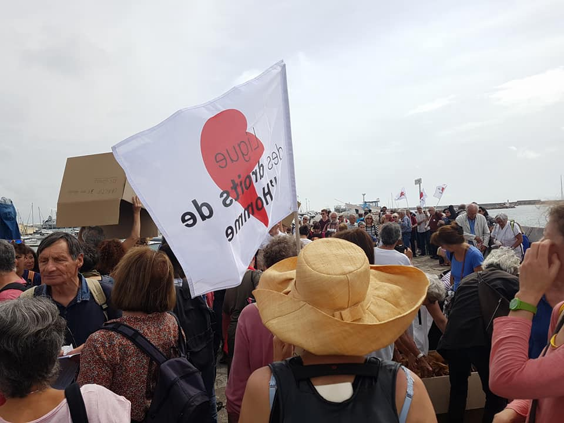

### AYS Daily Digest 03/06/2018: And dozens more lives are lost at sea\. \. \.

At least 48 people drowned off Tunisian Coast // 9 others drowned off Turkish coast // Over 200 people rescued off Spanish coast over the weekend // News from Greece // Somalian refugee killed in racist attack in Italy // News from Bosnia // Slovenia // France and more…

](assets/3c246f30f68/1*_ha1NuVSWaOPcPUFw7xjyQ.jpeg)

Source: [SOS Refugiados](https://www.facebook.com/sosrefugiados/)
### Feature:

On Sunday at least 48 people have drowned off the coast of Tunisia, and another 9 have drowned off the coast of Turkey, while hundreds of people trying to reach Spain were rescued over the weekend\.

The flow of people seeking to reach the shores of Europe continues despite the tightening of controls\. The boosting of militarization at borders has only forced people to seek more dangerous routes\. In 2015, 1 out of 267 people died trying to reach Europe\. In 2017, 1 out of every 57 people died according to [a report released](https://www.tni.org/files/publication-downloads/expanding_the_fortress_-_1.6_may_11.pdf) last month\.
#### Deaths off Turkish Coast:

One boat carrying refugees sunk off Turkey’s Mediterranean Coast of Demre on Sunday \- 9 passengers drowned, among them were six children\. All victims were from Syria\. It was believed that the boat was en route to the Greek Island of Kastellorizo\.

Once a fisherman called to alert the coast guard to the emergency, a plane, a helicopter and four boats were sent to the scene\.

> As a result of search and rescue operations carried out by Turkey Coast Guard, Four refugees\(3 males, 1 female\) identified by Coast Guard air vents were immediately rescued\. In addition, 1 person \(male\) was rescued by the fishermen who was in the area\. 9 refugees\(2 men, 1 woman, 6 children\) were picked up from the sea, drowned\. The refugees were transferred to Kekova and handed over to 112 Emergency Medical Ambulance personnel\. — **Statement from TCG** 

Two of the survivors, Zainab and Idris lost five of their children in the incident\.

> Barely holding their tears back, the couple who lost five children was at a loss for words\. Idris crouched down a wall with his palms firmly on his eyes while Zainab wore a sad look and clutched the handkerchief as she repeatedly wiped her welling eyes\. “I have nothing now\. I feel like I am dead\. I lost everything\. May Allah give us power \[to survive\],” Idris said\. 

Statistics show that crossings from Turkey to Greece have almost doubled compared to the same period last year\.
#### Deaths off Tunisian Coast:

In another incident, at least 48 people have drowned off the coast of Tunisia in an attempt to reach Italy, 7 nautical miles off Kerkenna, the main departure point for the Italian island of Lampedusa\. The incident occurred late on Saturday\. 40 of the victims were Tunisian nationals\. 68 others have been rescued as the operation continues\. It is feared that the death toll could surpass 100 with [information from security officials that the boat was carrying 180 people\.](https://www.nytimes.com/2018/06/03/world/europe/migrants-tunisia-turkey-spain.html)

■■■■■■■■■■■■■■ 
> **[Matt Herbert](https://twitter.com/DrM2H) @ Twitter Says:** 

> > A survivor from the #migrant vessel which capsized off Kerkennah claims 180 migrants were on board. Only 67 have been rescued, suggesting this incident could be one of the most deadly involving a migrant boat departing from #Tunisia in years. [twitter.com/radiomosaiquef…](https://twitter.com/radiomosaiquefm/status/1003267718911610880) 

> **Tweeted at [2018-06-03 13:38:04](https://twitter.com/mherbe01/status/1003269587268440064).** 

■■■■■■■■■■■■■■ 

> The Tunisian authorities mobilized two patrol boats, two speedboats and two teams of divers to [try](https://conjugaison.lemonde.fr/conjugaison/premier-groupe/tenter/) to [find](https://conjugaison.lemonde.fr/conjugaison/premier-groupe/retrouver/) the missing\. According to Colonel Major Sagaama, _“the toll should unfortunately increase to more than 100 dead”_ because “ _the total number of occupants of the boat was about 200 people, according to testimonies of the survivors_ \.” 

[A similar tragedy](https://www.lemonde.fr/afrique/article/2018/06/03/en-tunisie-nouveau-drame-de-migrants-au-large-de-sfax_5308949_3212.html) occurred in the same area in October last year when another trawler carrying 90 young Tunisians collided with a navy patrol boat that was chasing them\. Around 50 people lost their lives in this incident, most of them from economically marginalised Tunisian families\.

Despite Tunisian authorities attempting to tighten control over migration flow, they have not been successful\. It is anticipated that the flow of people trying to reach Italy will accelerate over the Summer months, as human traffickers are increasingly preferring to use Tunisia as a departure point over Libya\.
### Sea:
#### Hundreds rescued off the coast of Spain over the weekend\.

**Sunday:** 33 rescued / 4 boats 
**Saturday** : 207 rescued / 7 boats\.

■■■■■■■■■■■■■■ 
> **[SALVAMENTO MARÍTIMO](https://twitter.com/salvamentogob) @ Twitter Says:** 

> > En imagen: la salvamar Spica regresa ayer a su base de #Almeria abarrotada con 95 rescatados de sendas #pateras en #Alboran. Hoy, 33 rescatados/4 pateras. Ayer, 207 rescatados/7 pateras. Una #persona falleció antes de poder ser rescatada... muchas vidas salvadas, no todas... https://t.co/BPPSp9arWO 

> **Tweeted at [2018-06-03 16:45:10](https://twitter.com/salvamentogob/status/1003316674009927681).** 

■■■■■■■■■■■■■■ 

### Greece:
#### Arrivals:

One boat carrying 43 people arrived on the island of Lesvos\. 
Another boat arrived in Kos, no details yet\.
#### **Diavata Camp in Northern Greece is seriously overcrowded**

With many people arriving from Evros during April, 2000 people are currently residing in Diavata — a camp that has a capacity for 750\.

■■■■■■■■■■■■■■ 
> **[Apostolis Fotiadis](https://twitter.com/Balkanizator) @ Twitter Says:** 

> > Many new arrivals from Evros during April were directed to Diavata camp outside Thessaloniki. It has a 750 capacity and hosts 2000 people. 

> **Tweeted at [2018-06-03 09:41:24](https://twitter.com/balkanizator/status/1003210028466270208).** 

■■■■■■■■■■■■■■ 

#### New Arrivals to Lesvos prohibited from evacuating beach via hot springs\.

Volunteers attempted to walk new arrivals off the beach, but were prohibited to pass through the hot springs by the owner\. Eventually women and children were allowed to pass through, but the men had to climb around the wet rocks during high seas\.

> She has blocked the entrance many times and refused to give safe passage off the beach, on two occasions we had to carry wheelchairs across the rocks because she refused to let them through the hot springs\! — Philippa Kempson 

Source: Philippa Kempson
#### [Action for Education](https://www.facebook.com/ActionforEdu/) in need of experienced volunteers from August onwards

We are now in the third year of Refugee Education Chios and still as busy as ever\. Everyday, we provide a quality non\-formal education programme for teenagers and young adults from the refugee community currently on Chios Island\. We are looking for qualified and experienced volunteers to come join our project for at least 2 months from August onwards\. If you are interested, please [apply online via our website](http://www.actionforeducation.co.uk/volunteer) \.
#### Inspection services visit Pipka to assess state of camp

Forest Protection and Health Inspection Services visited the small camp last week to inspect the state of the premisses that caters to vulnerable cases on the Island\.

> While we are trying to secure a safe place and dignified conditions for the 280 extra people we are currently hosting in emergency, the Municipality has decided to send the different inspection services to come and check our camp\. We can’t help but wonder how often the Health Inspection services visit the overcrowded Moria camp and what they conclude in their report\. 

On Thursday morning the Forest Protection Services came to the camp to check if we had cut any trees, after they had received reports that we had\. They checked the camp and confirmed that no trees had been cut and the trees in Pikpa camp are all intact\.

Source: Pipka
### Italy:
#### 29 year old refugee killed in a racist attack\.

Sacko Soumaila, a [29 year old Somali man was shot dead](http://Askavusa Lampedusa) on the second of June in Calogero \(Vibo Valentia\) by a local racist\. The victim was hit in the head last night around 20\.30 near an abandoned factory along highway 18, while collecting some metal sheets to make changes to his shelter \.

A strike is confirmed for tomorrow in response to the attack\. Another strike is also going to be happening around the area of Foggia, Puglia, where another makeshift camp is present and where field workers live\. To underline that, the victim had a regular permit and was a member of unions, fighting for workers’ rights\.

The victim was shot by a white man\. Police are trying to locate the attacker\. Two people were with him at the time of his death, one was shot in the arm and the other unharmed\. All three of them lived in the tent area of San Ferdinando in which the labourers that work in the fields in the Piana of Gioia Tauro were staying\.

There are over 4000 migrant workers currently living in the area working in the fields\. They are distributed across a number of settlements\.

](assets/3c246f30f68/1*lGeg-z_M7y1XdQaPKCuFoQ.jpeg)

Sacko Soumaila\. Source: [Refugee Accommodation and Solidarity Space City Plaza](https://www.facebook.com/sol2refugeesen/?hc_ref=ARQuJM9Q_KrDIFme2ALhKM2pt5pdF8VzRgtbT3H0w0TC-ENegYUfVr_ktGsqsJCGxbU&fref=nf)

> A critical and challenging time is coming for italy and we stand in solidarity with refugees and ANTIFA movement\! 
 

> Solidarity beyond borders will win\! — [Refugee Accommodation and Solidarity Space City Plaza](https://www.facebook.com/sol2refugeesen/?hc_ref=ARQuJM9Q_KrDIFme2ALhKM2pt5pdF8VzRgtbT3H0w0TC-ENegYUfVr_ktGsqsJCGxbU&fref=nf) 

### Bosnia:
#### SOS team Kladusa need your help to reconstruct the containers

To visit their crowdfunding campaign please [follow this link\.](https://social.fund/kfifpt/)
### Slovenia:
#### Anti\-immigration party wins Slovenia elections

The [anti\-immigrant SDS party](https://www.aljazeera.com/news/2018/06/exit-poll-anti-immigrant-sds-party-leads-slovenia-election-180603172212003.html) of right\-wing leader Janez Jansa won Slovenia’s parliamentary election\. The party is now faced with finding a coalition partner to govern\.

Jasna is commited to forming a government that is ‘for the good of all our citizens’ and which will ensure a ‘safe Slovenia’

Far\-right and anti\-immigration parties have won elections recently in Italy, Poland, Hungary, Austria and now Slovenia\.
### France
#### [People to People Solidarity — Paris](https://www.facebook.com/groups/P2PParis/?ref=group_header) informs people of possible evacuation of canal St Denis

Fewer and fewer people are staying by the canals due to the frequent evacuations and police patrols\.

> It seems that evacuations come in waves, swiping over one camp after another\. However this so not always ideal solution, and many refugees who are dublined could be placed in detention and deported\. 

Source: People to People Solidarity
#### Acceleration of asylum procedure tested in Guiana

The French Government aims to t [est an acceleration of the asylum procedure in Guiana](https://www.ecre.org/france-acceleration-of-asylum-procedure-tested-in-guiana/) , which is one of the main French overseas territories that receives a large number of asylum seekers\.

> Under the test procedure set out by the decree, asylum seekers will have 7 days to lodge their application with the French Office of Protection of Refugees and Stateless Persons \(OFPRA\) \. They will only be able to lodge their claims in person and will receive their interview appointment on the same day\. In contrast, asylum seekers in the rest of France have 21 days to [fill in their application](http://www.asylumineurope.org/reports/country/france/asylum-procedure/access-procedure-and-registration/registration-asylum) form and send it to OFPRA by registered mail\. 

#### [FAST \(First Aid Support Team\)](https://www.facebook.com/groups/FASTCalais/?ref=group_header) Update on Calais

> Spent a weekend again in Calais and like always things are worse than before\. Was lucky to get into Dunkirk new camp as many volunteers had been denied access by CRS earlier on\. Heart wrenching to see children huddling for a bottle of water, baby wipes and even a bandage\. Disturbing to see what value, this Poundland stuff, holds for people just 20miles from border\. Change of CRS noon shift meant tolerant staff replaced by some trouble seeking staff with Tear Gas guns and pepper sprays showing off strength to small children, women and teenagers\. Back in Calais, brutality continues as well with Mayor of Calais passing a new legislation to stop even clothing n food distribution\. 

#### French Police disrupting distributions in Calais

**Update from care4calais**

> We had a really enjoyable afternoon at the old jungle today\. We started with a distribution of clean clothes and some fruit packs\. Whilst that was going on we had our cafe van open, giving out hot tea and coffee, bottled water and some homemade cakes\. It was hot and dusty but everyone was in a good mood, with lots of laughs and a friendly atmosphere\. 

> Towards the end of the clothing distribution, two police vans pulled up\. An officer, who appeared to be in charge, marched towards us in an intimidating manner with his pepper spray can in his hand\. The people I was standing with were quite taken aback by the aggressive attitude, which was in stark contrast to the relaxed and friendly afternoon\. We were even more shocked when the officer told us that not only could we not distribute the food or clothes, but that despite the hot weather we were not to give water to refugees\. It made me wonder what kind of person would happily see those around him go thirsty in 25 degree weather\. 

> After we complied with the order to stop distributing, the police stood waiting, most likely for us to leave\. But we were concerned to leave our friends with such an uncomfortable situation and so decided to lock the vans and wait it out\. We organised some games, practiced some reading and began drawing on a large world map making pictures and symbols and for each country\. 

#### 500 people rally in solidarity against Asylum and Immigration Bill

On Sunday the third of June, more than 500 people came to Sète to participate in a regional march in solidarity with refugees and migrants and against the Asylum and Immigration Bill\. The rally was organised by the Collectif Terre Collective\.

](assets/3c246f30f68/1*jz569J6j_a6bzq5g6SNGCw.jpeg)

Source: [Salam quand même مرحبا بكم على أي حال](https://www.facebook.com/salamquandmeme/)

> **We strive to echo correct news from the ground through collaboration and fairness\.** 

> **Every effort has been made to credit organizations and individuals with regard to the supply of information, video, and photo material \(in cases where the source wanted to be accredited\) \. Please notify us regarding corrections\.** 

> **If there’s anything you want to share or comment, contact us through Facebook or write to: areyousyrious@gmail\.com** 

_Converted [Medium Post](https://medium.com/are-you-syrious/ays-daily-digest-03-06-2018-and-dozens-more-lives-are-lost-at-sea-3c246f30f68) by [ZMediumToMarkdown](https://github.com/ZhgChgLi/ZMediumToMarkdown)._
