### AYS DAILY DIGEST 4/6/2018: Occupation of the camp in Greece

_Family of Madina, the girl who was killed by a train near the border with Serbia, is finally set free from prison in Croatia // More help is needed in Bosnia, France and Greece // New deportations from Austria announced // Men from Iraq injured in Macedonia_

](assets/6afb4e9981bf/1*p_RVjQsovNu9i6OAW76smw.jpeg)

Photo by [Abdulazez Dukhan](https://www.facebook.com/AbdulazezDukhan)
### Feature

On Friday, June 1st, residents occupied Thivia camp protesting against the poor living conditions and lack of services\. They directed their anger toward the IOM, the only big organization present in the camp, saying to AYS: “IOM do nothing\. They just give us promises\.”

However, after four days of occupation, the IOM team came to negotiate with representatives of the camp residents, and promised to do something to improve the living conditions\. Finally, the blockade was suspended\. But, if there is no improvement, the gates will be closed again next Friday and the occupation will continue\.

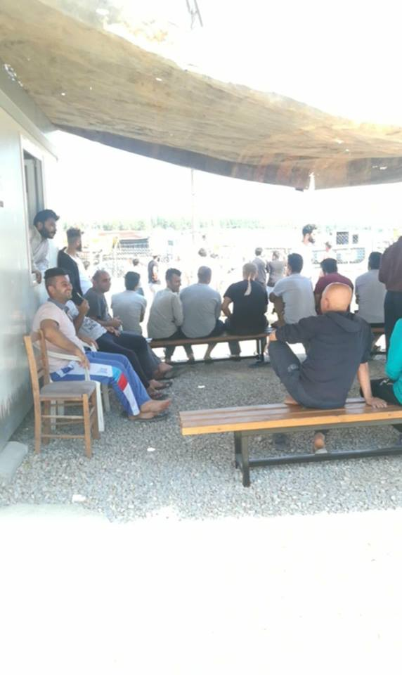

Photo by the resindetns of Thivia\.

About 800 persons, most people who recently arrived in Greece, are living in this camp\. AYS spoke with some of them who told about the absence of services and support, including medical care\.

According to their testimonites, residents are forced to go to the hospital in Athens, which is about 70 kilometres away and pay \(60 Euro\) by themselves for the transportation\.

“When people go to the hospital, they ask them to bring a translator and the organization here \(IOM\) doesn’t send translator with people,” AYS was told by the residents\.

Additionally, people in the camp get cash cards from the UN, which is a very modest monthly allowance that can hardly cover basics\. \(Couple without children gets 280 per month\) \. With this money, people have to buy food for themselves\. Nevertheless, authorities from the camp put restrictions on where from they can buy food from, limiting it to the place where food is sometimes more than double priced than in the other shops\.

These are just some of the issues residents of Thivia camp have to deal with\. Most of them arrived about six months ago, some from the islands and some are came to Greece recnelty via the land border\.

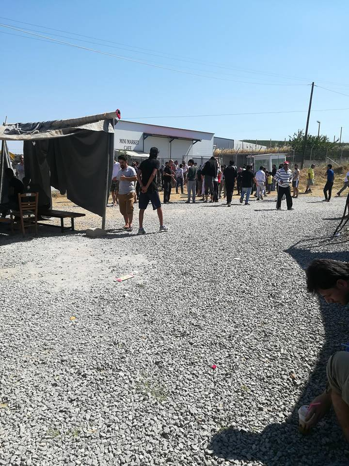

Photo by the resindetns of the Thivia

Thivia camp is former clothing factory, turned into camp in 2017\. It has possibility to accommodate about 750 people\. IOM is in charge of running this place\.

The centre has 65 apartments for eight people, and roughly the same number of housing units in huts set up within the grounds\.

When the centre was open, former migration policy minister Ioannis Mouzalas promised that people who are accommodated here will be able “to live in conditions of dignity”\. However, it does not look like that promise came true\. Like many others\.

We will follow the situation in this and other camps, and report about it in our digests\.
### Sea

[Watch The Med — Alarm phone](https://www.facebook.com/watchthemed.alarmphone/posts/2121879338086298) condemns the devastation that has taken place in all three regions of the Mediterranean Sea over the last three days\.

After the shipwreck near Tunisia, according to the lates available info, 48 corpses were recovered, while 64 people are still missing, and the death toll will likely to go over 100\.

In the Aegean, some of the names of the 9 people who died have been revealed\. **Five children from a single Kurdish family drowned: Derin Rashid \(13 years\), Dldar Rashid \(10\), Shihar Rashid \(8\), Dzhwar Rashid \(8\), and Amina Rashid \(3\)** \.

Also in the Western Mediterranean, on Saturday, a boat carrying 9 people i disappeared\. Days after, the body of one woman was discovered\.

_“They died because of Europe’s borders, and the lives of their relatives and friends, their loved ones, will never be the same\. We want to voice our deepest condolences and apologise to them that we were not able to help them\.”_

**_We join Alarm Phone in their call — Freedom of movement for all, and now\!_**
### Greece
#### Arrivals:

One boat at Lesvos with 57 people, and another one with 31\.

Another boat arrived on Ikaria Island with 46 people who were transferred to the overcrowded camp in Samos\.

Sixty refugees and migrants, mostly of a young age and including several women and nine children, were located on the coast of Zakros, Crete and taken to Sitia, where authorities started processing them on Monday\.

[The Mobile Info Team](https://www.facebook.com/mobileinfoteam/)

In the first months of 2018, a lot of Dublin family reunification from Greece to Germany got rejected, German media are reporting\. Apparently, the German authorities have rejected more than two\-thirds of nearly 900 requests from Greece\.

In many cases, requests for family reunification were rejected because documents proving family ties \(like marriage certificates or family books\) weren’t translated to English or German, even though, according to the law, this is not a requirement to get an approval for family reunification\.

“In 2017 the situation was quite different\. At that time, Germany accepted nearly all incoming family reunification requests\. A reason for the switch in practice might be the change of government in Germany\. The new interior minister in Germany Horst Seehofer, is known for wanting to restrict family reunification\. Because of this, it is very good idea that if you want to apply for family reunification, to bring as much documentation as possible\. That means, for example, an asylum seeker card or residence permit with the current address of your family member in Germany, all documents proving family relationships like birth or marriage certificates, and a letter of consent in which your family member in Germany agrees that they want you to be reunified with them\.

If you need help with this, or you have any questions regarding family reunification, write to the Mobile Info Team on Facebook or send a Whatsapp message to 00306955388283”

The Greek NGO Metadrasi confirmed to the Mobile Info Team that the strike of the translators at the Asylum Service is still continuing\.

The reason for the strike is that the translators didn’t get paid from the Greek state for many months\. How long the strike will continue is still unclear\.

If you have an appointment with the Asylum Service for full registration, your asylum interview, or to renew your white card, please still go\! Is still possible that your appointment will take place\. We will inform you as soon as the strike is over\.

[DocMobile — Medical Help e\.V](https://m.facebook.com/story.php?story_fbid=1991545350918139&id=1112468405492509) \.

After the fighting in Moria last week, many people — over 800 — found the place to stay outside this camp\. Many organizations are working together to provide a safe place for them\. DocMobile works day and night to support all those who need help, but their stock of medicines is running out\.

Find out how to support them on their FB page\.

The PLAZA GIRLS collective of young refugee women has [released issue two of their zine](https://www.facebook.com/noborderschool/posts/921896551318470) , The Plaza Girls Magazine, produced at their temporary home at City Plaza Hotel, a self\-organised alternative to refugee camps now running in Athens\.

ANNOUNCEMENT

Thursday 7th June — strike from 5\.00–8\.00, 13\.00–16\.00, 21\.00–0\.00
Friday 8th June — 24\-hour strike

Tthere will be no airport metro at these times and days\.

A blue line will be stopping at Doukissis Plakentias, red and green lines will be operating normally\.
### Bulgaria

Two days until the second hearing of the trail of Harmali21, a group of people gathered in Sofia to protest and demand the release of the imprisoned\.

They gathered in front of the “Migration directorate” condemning “the extreme police violence used after the riot in Harmanli in 2016, when cops broke into people’s rooms in the “open” reception centre and beat dozens of migrants brutally, among whom a 15 years old boy who went in a coma because of the severe beating”\.

_“The migrants rebelled against being turned into prisoners and as a pawn in a populist xenophobic game by the very same politicians who keep the ordinary Bulgarian people in poverty, whilst pointing a finger at migrants as a “threat”\.”_

**_Free the Harmanli 21\! Free all imprisoned migrants\!_**
### Macedonia

Young men \(29\) from Iraq suffered burns from an electric shock after he boarded a train attempting to enter the Republic of Macedonia from Greece\. He was transferred to the General Hospital Gevgelija where he was diagnosed with second and third\-degree burns and later taken to further treatment to the complex of the hospital in Skopje\.
### Bosnia

An estimated 150 \(or more\) people came to the railway station in Sarajevo for dinner distribution in the evening\. Not everyone is fasting but in order to feed as many people as possible, dinner is served after Iftar since it’s Ramadan\.

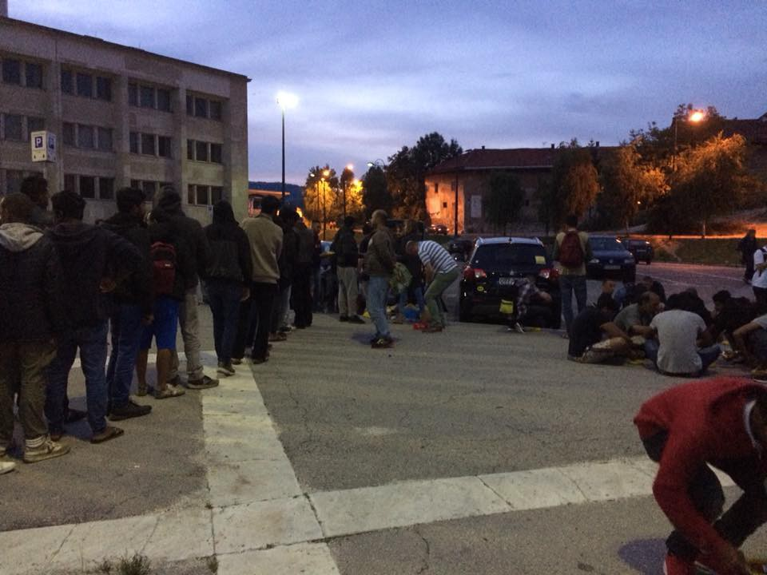

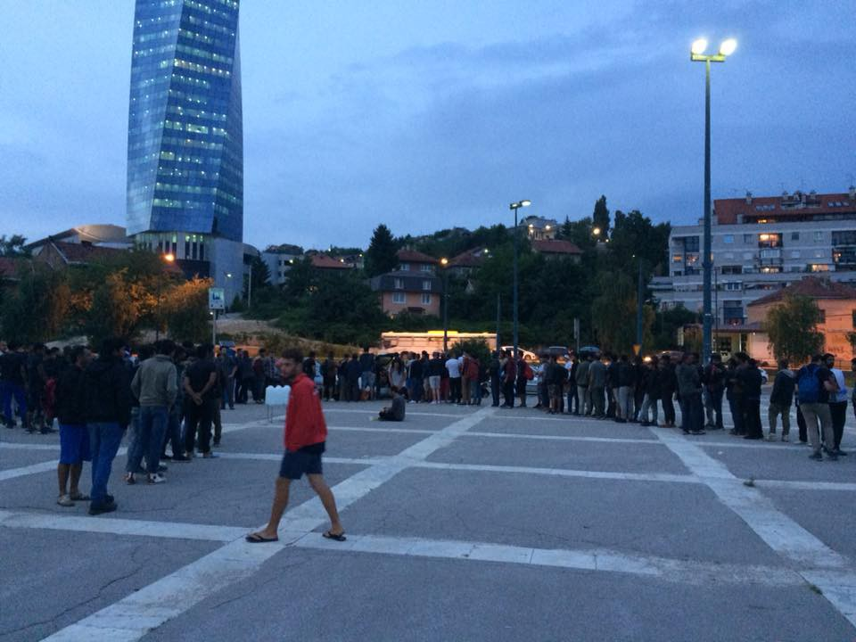

Photo by AYS

After talking to the police who was present on site, they told volunteers on the ground that it still was okay to do distribution on the usual spot, which they earlier today said no to, given the reason that they do not want big groups of people hanging around the railway station and the parking lot outside of it\. For now, the relationship with the local police is still good\. Hopefully, it will stay this way, hence the importance to continue be checking and having a good dialogue\.

There are still newly arrivals every day, and people need blankets, shoes, sleeping bags as well as food\. Volunteers on the ground are cooperating in order to be able to meet the needs as efficiently as possible\. If you can help, see local charity [Pomozi\.ba](https://www.facebook.com/pomozi.ba/) , get in touch or donate\.

As AYS has mentioned before, locals are friendly and many still remember the war in the 90’s\. Dinner, for several days now, is donated by a local restaurant\.

Meanwhile in Velika Kladuša, near the border with Croatia, over 500 people gathered\. Some are staying in the houses with locals, while some are accommodated in a newly build camp where for now 300 to 400 people are living\.

[No Name Kitchen](https://www.facebook.com/NoNameKitchenBelgrade/) team, along with [SOS Team Kladuša](https://www.facebook.com/SOSTeamKladusa/?ref=br_rs) and local volunteers, are building a shelter for families thanks to the donation of two containers, used during the Bosnian war\.

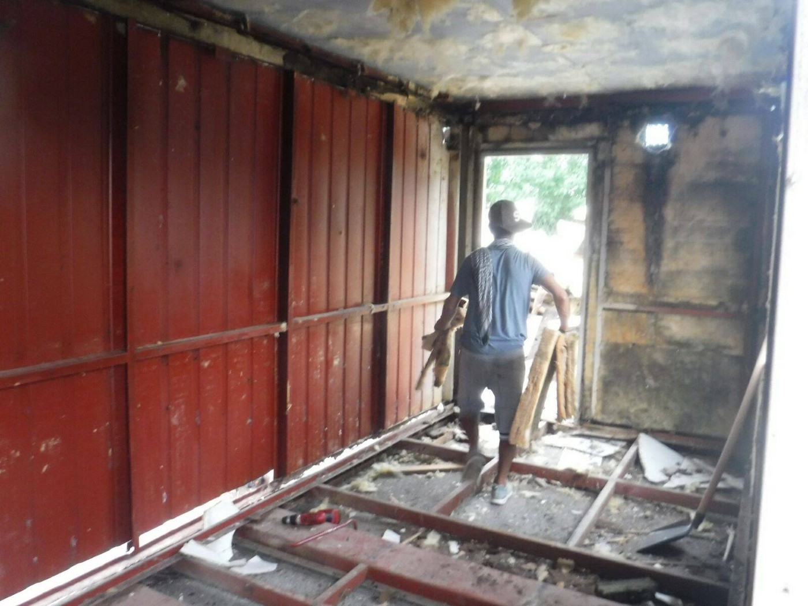

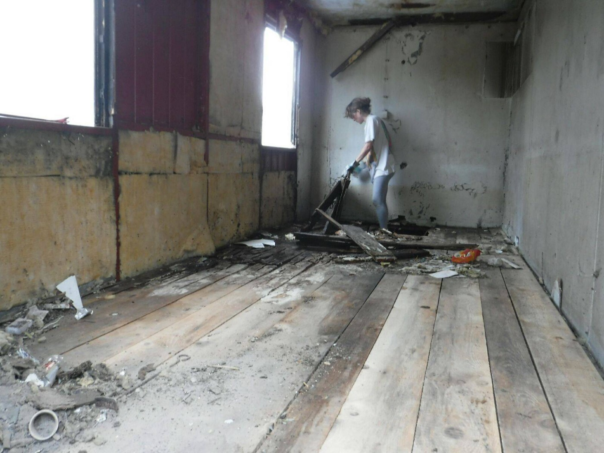

Photo by No Name Kitchen

The job could be finished in two weeks, but they need financial support\. Any donation is a huge help\! \!

The same team started to build a pavilion in the camp because the sun is shining nearly the whole day and temperatures are high\. The pavilions will provide some shade and also protection during the periods of heavy rain\. A floor will be constructed in the upcoming days\.

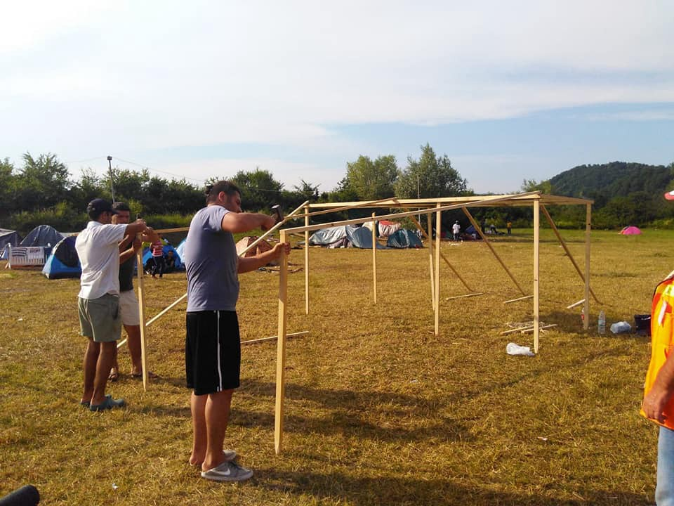

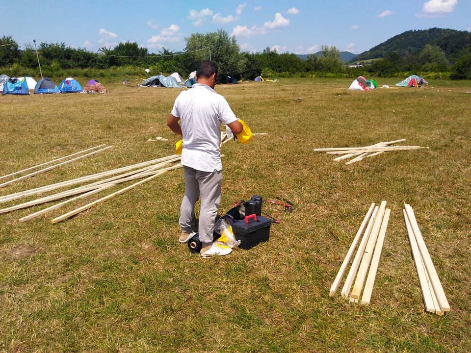

Photo by SOS Team Kladusa

If you want to support them, please donate an amount you can afford to their [crowdfunding campaign](https://social.fund/kfifpt/) or by PayPal: [piksi\.sos@gmail\.com](mailto:piksi.sos@gmail.com)

Be sure to specify what for your donation should be allocated to\.

Also in Kladuša, Sos Team, needs long\-term volunteers, with a car\.

For more info please contact them via email: [ljutakrajina\.sos@gmail\.com](mailto:ljutakrajina.sos@gmail.com)
### Croatia

Watching her little sister explore the surroundings of the reception centre with her unsteady baby steps, Nilab, sister of Madina who hel for 75 days in detention in Croatia, said: “Maryam, she is now free\. We are all free\.”

The family of Madina Hussiny was in detention for week, even though it is not clear why, or how the state will explain that children are held in prison in Croatia\. Unfortunately, this is not the only family and we hope that the other two will be put soon\.

The family of Madina, who was killed in a train incident near the border area aftert police pushed back her family, is now transferred to an open\-type reception centre for vulnerable asylum seekers in Kutina\.

AYS volunteers, together with our colleagues from CMS, waited for them in front of the centre in Kutina, wishing them the warmest welcome to the relative safety of the centre in Kutina\.

We wish to thank everyone who has contributed to this struggle\.
### Austria

Planned deportation this week

[Information](https://www.facebook.com/RefugeeCampVienna/posts/1856602697725648) to all people from the Gambia\. It is suggested that a deportation flight will leave at 7\.6\.2018

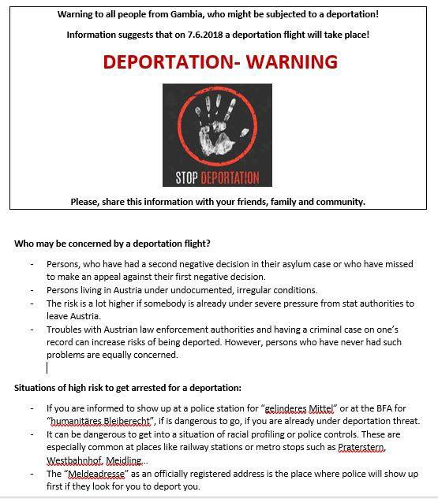

### Belgium

After we read her [post](https://www.facebook.com/plateformerefugiesbxl/posts/627346564270976) , we just have to repost it\. Volunteer [Clara Delacroix](https://www.facebook.com/clara.delacroix.3) :

“Today, once again, I am ashamed to be Belgian\.
Today at the north station I witnessed a police raid to arrest undocumented refugees\.
Today I was threatened by police officers because I didn’t want to go my way and close my eyes\.
Today I heard about a new law that prohibits taking police photos\.
Today when I answered that I knew my rights and kept taking pictures, I was ripped off my phone\.
Today a policeman deleted my photos without my permission\.
Today a policeman searched my phone and looked at my personal photos\. With Police witnesses around me\. Who didn’t say a word\.
Today the same policeman refused to give me his serial number and asked me to leave the station “if I didn’t want any trouble”\.
Today I saw friends clad against the walls and searched mercilessly\.
Today I saw cops handcuffed friends with Colson necklaces far too tight\.
Today I saw some policemen take the bags of my friends who couldn’t keep them with them\.
Today I heard some kids call my name when they were pushed into the vans\.

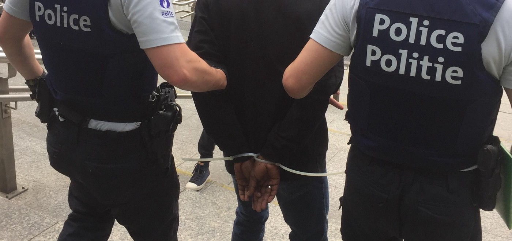

### France

[Refugee Info Bus حافلة المعلومات للاجئين مسیر راهنمای پناهندگا](https://www.facebook.com/RefugeeInfoBus/) ن

Shoe stock is running low in Calais and donations are needed\. Previously, last week, police has stolen single shoes from refugees in a cruel extra judiciary punishment action\.

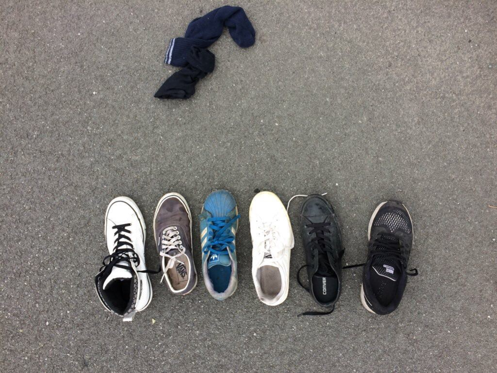

> “Shoes are in constant demand here in Calais, and due to the inhumane conditions the French state forces upon refugees, volunteers are incapable of effectively meeting this demand\. This evening, police in Calais stole a single shoe from each member of a group of young refugee men\. This kind of calculated, extra\-judicial punishment is wholly unacceptable, and we call upon the French state to stamp out these cruel acts of violence and provide refugees with the protection they are legally entitled to\.” 

Police also confiscated water containers\.

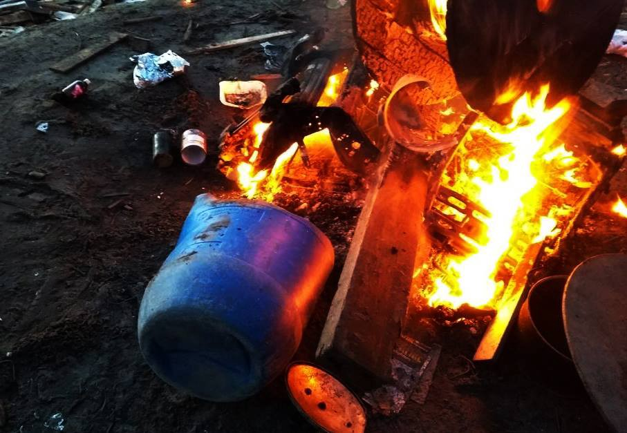

> “Reports from the people we support describe still more heinous events, suggesting the police have destroyed containers with sharp objects, placed them on fires where they burned and, as recently as Saturday 2nd June, water containers were sprayed with CS gas and subsequently taken, with no legal justification, by the CRS\.” 

[Mobile Refugee Support](https://www.facebook.com/MobileRefugeeSupport/) reports about new police action when, over a hundred officers swarmed the new site, allegedly checking papers and identification before making several arrests\.

_“After several hours of being denied access to the site, we opted to set up just outside the police’s blockade, forcing people to leave their tents and belongings in order to access power or Wi\-Fi\. This increased interference is poised to continue to cause problems for us, but we shall always adapt to whatever situation is presented to us in order to continue to provide our services to those who are in need\.”_

> **We strive to echo correct news from the ground through collaboration and fairness\.** 

> **Every effort has been made to credit organizations and individuals with regard to the supply of information, video, and photo material \(in cases where the source wanted to be accredited\) \. Please notify us regarding corrections\.** 

> **If there’s anything you want to share or comment, contact us through Facebook or write to: areyousyrious@gmail\.com** 

_Converted [Medium Post](https://medium.com/are-you-syrious/ays-daily-digest-4-6-2018-occupation-of-the-camp-in-greece-6afb4e9981bf) by [ZMediumToMarkdown](https://github.com/ZhgChgLi/ZMediumToMarkdown)._
