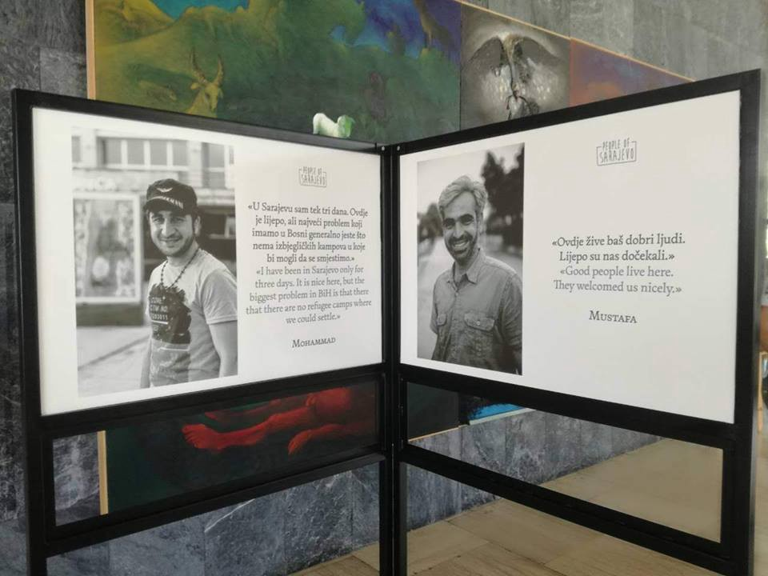

### AYS Daily Digest 5/6/2018 Refugees Welcome

New rescues in the Med /// Protests and strikes in Italy /// Deportations planned in Austria and Finland /// Updates from Turkish camps /// Updates from the Bosnian\-Croatian border /// New reports on Amygdaleza camp /// More info, news and updates from Greece, Italy, Hungary and the UK

Refugees Welcome event in Sarajevo \(Photo by AYS\)
#### FEATURE: REFUGEES WELCOME

Following months of brutal behaviour and total impunity of Balkan border authorities Are You Syrious published a statement reminding everyone that Refugees Are Welcome\.

> It is the obligation of the governments of our countries, the UN and other responsible organizations to ensure safe and legal passage for every person who is driven to leave their home for reasons of war, instability, environmental degradation, or economic oppression; to ensure every person’s right to legally seek asylum; and for those who today find themselves on the dangerous route, to be provided with adequate, humane and efficient aid\. 

> We call upon our fellow citizens to join us in our efforts to demand that these obligations be respected\. 

> Let us remind ourselves that it is the involvement of European elites in colonisation, imperialism and waging today’s wars across the world that has brought on the destruction of lives, homes, livelihoods and entire societal structures for the benefits of the few\. It is by the decision of political elites today’s borders are shutting down\. They build fences, put on razor wires, they bring heavy weapons and arms to our borders, they dehumanize the refugees and they co\-opt us into fascism and racism\. They sign shameful agreements with Turkey, Libya and Niger, putting millions of people in great danger, pushing them into slavery and robbing them of their right to life — and they claim it is on our behalf\. What they are doing is stripping our societies of solidarity with our fellow human beings\! 

> People, children, are dying — at sea, in rivers, in woods, on streets and borders, due to cold, police brutality, untreated diseases, or simply from exhaustion\. Often their deaths are direct consequences of illegal and violent push\-backs that are happening along our borders every day and every night — and still no one has been held responsible for them\. 

> This is unacceptable\! This is inhumane\! 

> The countries along the route, and further, cannot use lack of resources as an excuse for this disgraceful and inhumane treatment of people in need\. They cannot trade the lives of refugees entering the EU or Schengen border zone, for simply accessing more European funds\. The EU is waging a war against refugees through the militarization and fortification of its borders\. Countries in the Balkans, who are not yet part of the EU, are now the new frontline of this EU war against refugees, which can be clearly read in the new EU Strategy for the countries of the Balkans\. 

> These governments together with the EU are now accomplices with and participants in police brutality, and they stand responsible for thousands of refugees’ death at sea and at land\. 

> A significant portion of this region suffered immensely during the wars in the nineties\. It continues to suffer from the consequences of those wars, and, as such, those from here know first\-hand what it means to be forced to leave one’s home, to seek shelter in foreign countries, and how difficult and painful that experience is\. When the political elites strip our societies of solidarity, they attempt to strip us of our own experiences of forced displacement and seeking refuge, effectively whitewashing their participation and erasing the pain of millions of us\. 

> Along the Balkan route, activists from around the world, along with the local population, have been providing the aid that is absent from governments and the UN\. It is the local population that have fed, kept warm and sheltered these people in need\. They have provided them with information and acted as a referral mechanism\. They have raised funds\. But most importantly, they have showed the refugees going through some of the most difficult periods in their lives, warmth and solidarity\! 

> Thus, we stand united, across borders: 

> Opposing the militarization and fortification of our borders — we demand safe passage and the right for every person to seek asylum and protection\! 

> Opposing ruthlessness, brutality and inhumanity of repressive state apparatuses — we demand respect and protection of human dignity and we stand united in our belief that no human is illegal and everybody has the right to a decent life\! 

> Opposing the dehumanizing propaganda of fear — we welcome our fellow human beings from across the world; we cherish the experiences they bring with them, and we look forward to sharing our communities with them\. 

> Opposing the antagonism and racism shown towards people in need, we stand united in our belief that it is only through solidarity and decency that we can build societies that are free and equal\. 

> Refugees Welcome\! 

You can find translations in Bosnian/Serbian/Croatian/Montenegrin and Italian and can sign the statement [here](refugees-welcome-582caf5985ad) \.

Please help us sharing it\!

TURKEY
#### **Updates from Turkey**

[Marine Rescue Team/خلية الإنقاذ البحري](https://www.facebook.com/cell122/) [report](https://www.facebook.com/cell122/photos/a.1880669272155485.1073741828.1880551342167278/1947748202114258/?type=3&hc_location=ufi) that they were contacted by a group of 35 people who were smuggled and left on one tiny island in the middle of the Evros river, that separates Turkey and Greece\. Among them, there were several children and they were left without food or water for several hours\. Greek authorities intervened and they are now in a camp on Greece mainland\.

Also, they [report](https://www.facebook.com/cell122/posts/1947763878779357) that 4 buses arrived into Orfa/Urfa camp in South\-eastern Turkey carrying at least 150 people, most of whom had been arrested whilst trying to cross into Greece on both the land and the sea routes\.

> This appears to be a new measure by the Turkish authority and we do not know why they have been transferred into this camp, which seems prison\-like, and closed — people cannot leave\. 

Another 50 people who were caught while trying to reach Greece were [deported](https://www.facebook.com/cell122/posts/1948021325420279) to Syria, through the crossing of Bab Al\-Hawa\. These people were transported on Turkish buses and left in Syrian territory\.

According to [media sources](https://www.aa.com.tr/en/todays-headlines/50-undocumented-migrants-held-in-western-turkey-/1165872) , a boat carrying 50 people was intercepted by the Turkish coast guard and brought back to the area of Izmir, where people were transferred to the provincial migration office\. The group of migrants included 49 Syrian nationals and one Iranian\.

SEA
#### Death toll for Saturday’s shipwreck reaches 112

According to [Safe Passage](https://www.facebook.com/SafePassageInt/) , the death toll for the shipwreck that took place off the Tunisian coasts on Saturday has reached 112 people\. On Sunday it was reported to be 50\.

> The ship was packed with ‘migrants’ each having paid €600–1,000 for the journey\. Tunisia has become an important new transit hub for those trying to reach the safety of Europe following enslavement and human rights abuses in Libya\. 

According to the [Missing Migrants Project](https://missingmigrants.iom.int/region/mediterranean) 785 people died in the Mediterranean in 2018\.
#### Updates from SAR operations

Salvamento Maritimo [report](https://twitter.com/salvamentogob/status/1003906831092199425) that 11 people were rescued on their way to Spain\. They were disembarked safely in Tarifa last night\.ù

 \)](assets/fe2801bc4206/1*Vfae1fo4v6wp_V_eYAOHug.jpeg)

Rescue in the Central Mediterranean \(photo by [Sea Watch](https://www.facebook.com/seawatchprojekt) \)

[Sea Watch 3](https://www.facebook.com/seawatchprojekt) rescued 115 people in the central Mediterranean on Tuesday morning and was going to embark 117 more people rescued from a supply ship\.

The rescued people reported that another boat left the coast\. So far, however, the boat hasn’t been found\. Search operation were carried out by the Sea Watch 3, the reconnaissance aircraft Colibrì and by a Spanish military plane\.

> Many of our guests have scars and report torture and slavery — some have injuries that are treated by our medical team\. 

GREECE
#### Arrivals

[Aegean Boat Report](https://www.facebook.com/AegeanBoatReport/photos/a.285312485325196.1073741828.285298881993223/359720064551104/?type=3&theater) report that one boat was picked up outside Tsonia, Lesvos north east, by British Frontex at 6\.00 am\. The boat was transported to Mytelini and it carried 51 people \(no breakdown\) \.

A [2nd Boat](http://www.ekathimerini.com/229288/article/ekathimerini/news/dozens-of-kurds-face-deportation-if-they-dont-return-to-moria-camp) arrived on Ikaria Island this morning\. It was transferred to port of Samos during the day\. 40 people\. No breakdown\.

GREEK ISLANDS

According to [UNHCR](https://www.facebook.com/AegeanBoatReport/photos/pcb.359938284529282/359938241195953/?type=3&theater) arrivals to the islands in 2018 are at 11,278 so far with a slight decrease from April to May\. Arrivals for the first 5 months or this year are 55% more than they were in 2017\. Over a third of all arrivals are children\. In their [weekly snapshot](https://www.facebook.com/AegeanBoatReport/photos/a.285312485325196.1073741828.285298881993223/359935377862906/?type=3&theater) , they put the current number of refugees trapped on the islands at 14,500\. However, [Government figures](https://www.facebook.com/AegeanBoatReport/photos/a.285312485325196.1073741828.285298881993223/359928897863554/?type=3&theater) suggest far higher figures and put the number at 16,660\.

LESVOS

Local media [report](http://www.ekathimerini.com/229288/article/ekathimerini/news/dozens-of-kurds-face-deportation-if-they-dont-return-to-moria-camp) that the Kurdish families who left Moria after fighting broke out last week are now being threatened with deportation\. The Migration Ministry has announced that they will not be able to continue with their asylum claims if they do not return to Moria\. This would mean they could be deported to Turkey\.

We have to ask, what sane person would want to bring their family up in Moria? How can the state force these people to risk the lives of their children in an unsafe, overcapacity space with inadequate facilities and the constant fear of violence? We suggest that the migration minister takes his own family there for a week, and then decides\.

[PIKPA](https://www.facebook.com/pikpalesvos/posts/2093630157579071?hc_location=ufi) , who are currently housing 400 people, including some of those who escaped from Moria, are in need of support in order to continue\.
#### [ERCI](https://www.facebook.com/ercintl/photos/a.417332345133189.1073741828.415073442025746/819122151620871/?type=3&theater) are doing a call for donations

_Our medical team sees 70 to 90 patients per day in the overcrowded camp of Moria\. Every day, with minimal resources, volunteers from all over world commit their time to practice medicine, translate for patients in Arabic, French or Farsi, and help coordinate this mission\. Every day our 15\-member medical team strives to provide as good primary care as possible in this context\._
#### Returns to Turkey are continuing to drop

MAINLAND GREECE

[Refugees Biryani and Bananas](https://www.facebook.com/RefugeeBiriyaniAndBananas/posts/1049903558501043?hc_location=ufi) report on the situation in Thessaloniki\. They will there this weekend to support people\.

> Due to a new surge of a large number of displaced people arriving via Evros river into mainland Greece, Thessaloniki is in EMERGENCY MODE again\. 

> 1200 Kurdish people mainly from Afrin, Syria due to the recent conflict, trying to seek asylum in Greece are waiting unregistered without shelter and little support in Diavata camp\. Some have sleeping bags and a makeshift shelter some don’t\. 

> There is once again hundreds fleeing war and oppression out on the streets and hiding in abandoned buildings\. 

#### Tents return to Malakasa

#### Updates from Amygdaleza

[Reports](https://www.facebook.com/kayra.martinez/posts/10155223764106829) from the ground regarding Amygdaleza, a pre removal detention center near Athens, that was once closed down due to its “horrendous living conditions” are very concerning\.

> We were shocked to find that people did not have soap, toothpaste and other basic hygiene products; many just had the clothes on their backs and makeshift shoes\. These people are human beings and deserve to have some basic dignity\. 

> People are there mostly for two reasons; 1\) They did not have legal papers to be in Greece as a result of a faulty system that is unable to register new arrivals and allow them to begin asylum applications\. Or, 2\) They are going to be deported, many to countries where they face legitimate danger\. 

> Although the majority of the 600 people living in the detention centre are men, there is also a unit that includes families, many with small kids and minors\. 

> Let us not forget those voiceless that are hidden from sight in detention centres\. Seeking asylum is not a crime\! 

They are raising money and asking for donations of:
- Shampoo, Soap, Toothpaste, Toothbrushes and Shaving Kits
- Clothes \(Shirts, Pants, Underwear\) and Flip Flops
- Entertainment \(Football, Cards, Board Games, Puzzles, Toys for Kids\)

You can support them [here](http://paypal.me/lovewithoutborders4) \.
#### Free English Classes at the British Council, Athens

In the frame of the CELTA course of English language, our Teaching Center is looking for adults of B2 or A1/2 level who would like free English classes\.

If you know anyone \(friends/family/neighbour, refugee population that you are working with\) at either B2 or A1/2 level who would like free English classes, please get them to join…as soon as possible\! We’ll chat to them and place them in the right class\.

Days: Monday to Friday — Times: 10\.30–12\.30 — Dates: 4–29 June

Venue: British Council, Kolonaki

More info [here](https://www.britishcouncil.gr/) \.

ITALY
#### They killed one of us

As we reported in the last digests, Soumaila Sacko was killed on Saturday night in the Vibo Valentia county in the South of Italy\. He was 29 years old and arrived from Mali in 2010\.

An unknown shooter fired 4 times against him and the two friends he was with\. Soumaila Sacko was shot in the head, one of his friends in the leg\.

This is the place where they were attacked: the abandoned ex\-furnace “Tranquilla”\. “ _134 tons of toxic waste from an electric power plant are hosted there\._ ” Some media outlets still report that the shots were fired to prevent a theft, but as the Collettivo Mamadou noted, that was not exactly “ _the Renaissance villa where to plan a theft_ ”\.

Many organisations refused this report, insisting on the systematic bias and racism of many mainstream media\. The three migrant workers were there to recover metal sheets to use in the San Ferdinando makeshift camp, where they lived\.

> “Soumaila is dead because someone around here decided he should be\. Here it’s not only the mafia, cancer or lack of health care that kills you, racism does too” \( [Father Francesco Meduri](http://www.rainews.it/dl/rainews/articoli/Migrante-ucciso-nel-Vibonese-braccianti-in-sciopero-45111ba5-e7c1-4e01-8524-6b1757caa0ca.html?refresh_ce) \) 

Soumaila Sacko was a grass\-roots union activist, involved in the defence of migrant workers’ rights in the farming industry in the south of the country\.

Conditions in this sector were highlighted several times in the last years by inquiry and reports, but nothing has so far changed\. While still today the newly nominated Interior Minister Matteo Salvini says that the “good times for illegals are over”, thousands of people are forced to work in slave\-like conditions in tomato plantations, paid 2€/hour, without any security, and are living in ghettoes like the one in San Ferdinando\.

On Monday a strike was organised by the USB, organisation of which Sumaila Sacko was member and by other grass\-roots unions, with several protests and sit\-ins throughout the country\.

More protests were launched for the next days and weeks:

\(A migrant\. A farm worker\. An oppressed\. A union activist\. A brother\. A man\. Soumaila Sacko, one of us\! \#neverslaves\)

Protests outside the local police headquarters have been launched for Thursday June 6\. Friends and comrades invited everyone to join the national demonstration that will be held in Rome on June 16\.
#### Updates from Ventimiglia

The [Caritas Intemelia](https://www.facebook.com/caritasventimiglia/) group, working in Ventimiglia, published an updates on the numbers of people they served in May\.

#### Services for LGBT migrants

[Il Grande Colibrì](https://www.ilgrandecolibri.com/) published a map and a contact list of groups and organisations that offer services for LGBT asylum seekers and migrants\. Find it [HERE](https://www.ilgrandecolibri.com/en/migrants/) \.

BOSNIA
#### Refugees Welcome in Sarajevo

More than 1000 people gathered in Sarajevo for the Refugees Welcome event organized by a group of citizens and volunteers\. Two photo exhibitions were part of the event, as well as a concert\. One of the exhibitions is called People of Sarajevo and it shows series of photos of people on the move who are currently in Sarajevo\. This is another way to show they are welcome in Sarajevo and Bosnia\.

Photo by AYS
#### A few thoughts after Bosnia: activist’s report from the Bosnian/Croatian border

[Enough is Enough](https://enoughisenough14.org/) published a personal reflection on the situation in Bosnia and Europe by Riot Turtle:

> Yesterday I came back from Velika Kladuša, a small town at the Bosnian side of the Bosnian/Croatian border\. While many local people are in need of about anything \(locals and refugees\), they do everything they can to ease the suffering of new arrivals\. People are bringing food, clothes, blankets and other things people need for their daily life to the makeshift refugee camp in Velika Kladuša\. 

> What a difference with many of the racist governments and parts of society in many EU states\. 

> \[…\]While EU states like Germany, France, UK, Italy and others are exporting more and more weapons to war\-zones, and are therefore one of the reasons people are forced to leave their homes, the very same EU states are pretending that refugees and migrants are the problem\. 

> \[…\] Yes the problem is capitalism and racist European policies by governments that seem to think that the planet belongs to white suprematists from Europe, North\-America and Australia\. 

> \[…\] I just returned from Bosnia and I was pretty surprised\. In Bosnia things were different\. The Bosnian state is not doing a lot for refugees, but I didn’t see one cop at the makeshift camp in Velika Kladuša\. I also had not one control by cops in the Bosnian border town\. On Lesvos I was checked by cops again and again\. People that are living in the makeshift camp told me a lot about the police violence by Croatian cops but also said that the cops in Velika Kladuša normally did not even check them\. Local people told me a lot about their own “refugee” history and why they are supporting the many new arrivals in the small town\. Many residents of Velika Kladuša were refugees themselves during the Balkan wars in the 1990’s and remember too well how it feels to be a refugee, to be treated like a refugee\. 

> Because the Bosnian state is not really willing to support refugees \(They say they can’t but I would say they have other priorities, but at least the Bosnian state did not close the border\) \. Local people are organizing mutual aid and they are doing a great and important job\. Sometimes I think they are more anarchist than many north\-europeans that call themselves anarchists, although most people in Velika Kladuša probably don’t see themselves as anarchists\. The way they organized themselves is impressive\. People bring themselves in with the skills they have and it works really well\. One of the self\-organized groups in Velika Kladuša is SOS Team Kladuša and they work on many levels\. From food, to tents, blankets, shoes, clothes etc etc\. 

> A few international activists are working together with the new arrivals and local people\. When I was there people organized mobile showers, food, clothes, shoes, blankets, tents and many more things\. I was part of a group that also started to reconstruct old containers\. These containers will be used as emergency shelters for so\-called vulnerable people\. Families, elderly and injured people\. But there is an enormous shortage of money to buy more tents, shoes and food\. The economic situation is pretty bad in Bosnia and the locals who are supporting refugees are running out of money\. 

> There are still people sleeping in the open air, because there is not enough money for tents and soon there won’t even be enough money to buy food for all people\. The reconstruction of the containers is also financed by crowdfunding campaigns of collectives like Team Kladusa and Cars of Hope\. Next week I will return to Velika Kladuša to join the team again and continue my work there\. 

If you want to support the work of Cars of Hope and SOS Team Kladuša, you can support the crowdfunding campaign of Cars of Hope and SOS Team Kladuša [here](https://social.fund/kfifpt/) or donate directly by PayPal, bank transfer, or bitcoins\.

Read the full article [here](https://enoughisenough14.org/2018/06/05/a-few-thoughts-after-bosnia-eu-states-escalate-war-against-refugees-and-migrants/) \.
#### Updates from Bihac

One Bridge to Idomeni [published](https://www.facebook.com/1Bridge2Idomeni/posts/1125699897572538) an update from their mission in Bihac\.

 domeni\)](assets/fe2801bc4206/1*bnJJKxrkOIKC30wTuClwFg.jpeg)

Bihac \(Photo by [One Bridge To I](https://www.facebook.com/1Bridge2Idomeni/) domeni\)

They report that in Bihac, a small town on the Bosnian/Croatian border, the number of refugees and migrants is between 700 and 1500, mainly coming from Pakistan, Afghanistan, Iran, India, Iraq, Algeria, Libya\. Among them there are at least 10 families with around 20 children under 10 years old\.

> Around 600 people live in an old building, that is a sort of makeshift camp\. It was given by the local administration, but its construction was never finished: there are no windows, doors or toilets, and stairways are incomplete\. IOM brought in showers and portable toilets but their conditions are bad due to the lack of maintenance\. 

> The Crveni križ grada Bihaća \(Bihac’s Red Cross\) distributes clothes and one hot meal per day\. The Bosnian government is not funding any of this, which make the situation unsustainable\. 

HUNGARY
#### **Constitutional court suspends review on the law against NGO approved last year**

■■■■■■■■■■■■■■ 
> **[HunHelsinkiCommittee](https://twitter.com/hhc_helsinki) @ Twitter Says:** 

> > Constitutional Court suspends review of #LexNGO2017 on foreign-funded NGOs to wait for CJEU ruling in Luxembourg  [alkotmanybirosag.hu/kozlemeny/az-a…](https://alkotmanybirosag.hu/kozlemeny/az-alkotmanybirosag-az-europai-alkotmanyos-parbeszed-jegyeben-felfuggesztette-eljarasat-a-nemzeti-felsooktatasi-torvenyt-es-a-civil-torvenyt-erinto-ugyekben/) 

> **Tweeted at [2018-06-05 13:44:50](https://twitter.com/hhc_helsinki/status/1003996068386824193).** 

■■■■■■■■■■■■■■ 

AUSTRIA
#### Deported because he is too well integrated

Diakronie, a charity working in Linz, [published](http://blog.diakonie.at/vorbildliche-integration-als-abschiebegrund) the paradoxical story of a well integrated young man from Afghanistan who is about to be deported because he turned 18\.

He had subsidiary protection until 2019 and found an Ausbildung \(apprenticeship\) \.

The asylum service argued that he proved to be able to build a life without his family — proofs are his journey to Austria and his integration in the society\. Therefore they assume that with his newly learned skills he will be able to start a new life in Afghanistan and care for himself\. In other words he is so well integrated in Austrian society, that he can now be deported\.

In general, 1/3 of the 351 minors with an Ausbildung face deportation\. Considrering that the costs for deportations are assumed to be 100\.000€ per person, it is also a waste of public money\.

FRANCE
#### **Increase in allowance for asylum seekers awaiting accommodation**

[Asylum Information Database](http://www.asylumineurope.org/news/01-06-2018/france-increase-allowance-asylum-seekers-without-accommodation) report the level of the financial allowance granted to asylum seekers who have accepted to be accommodated but who are not yet given a place under the national reception scheme has increased starting from June\. This is granted in addition to the allowance for asylum seekers \(ADA\) available to all applicants\.

According to the new decree, asylum seekers who are waiting to be provided accommodation by the state are entitled to an extra 7\.40 € per day in order to be able to secure private accommodation until a reception place is made available\.
#### **ECRE’s report highlights lack of access to asylum procedures**

A report published on Tuesday [presents](http://www.asylumineurope.org/news/05-06-2018/access-asylum-and-detention-france%E2%80%99s-borders-ecre-publishes-mission-report) the findings of a fact\-finding visit to France conducted by ECRE between 23 and 27 April 2018, with a focus on deprivation of liberty and access to asylum at the border\.

It states that since the beginning of 2018, there has been an emerging trend in certain regions whereby, after a person has been released from the waiting zone and has subsequently been held in police custody, he or she is admitted into the territory and issued an obligation to leave together with an administrative detention order for the purposes of removal\.

> The border procedure, consisting of a preliminary examination of claims for the purpose of allowing people entry into the territory to seek asylum, takes places under reduced procedural safeguards: remote interviews in all waiting zones except Roissy, scarce legal assistance due to capacity constraints of lawyers and NGOs, and a controversial assessment of the credibility and pertinence of the facts put forward by the asylum seeker\. These barriers are liable to render access to asylum difficult, if not ineffective in practice\. 

The rate of positive response to requests to access the territory was around 26\.6% in 2017 and 21\.7% in the first quarter of 2018\. “ _In the case of waiting zones such as Beauvais or La Réunion, all opinions issued by OFPRA in this period were negative\._ ”

> At the same time, persons arriving at the French\-Italian land borders face arbitrary detention in temporary facilities and are barred from accessing the asylum procedure in France, in clear violation of safeguards under the Dublin III Regulation and the right to asylum\. Recent monitoring from the General Controller on Places of Detention \(CGLPL\) confirms a persisting practice of detention in substandard conditions and refusal to receive asylum applications from those seeking protection\. 

Read the full report [here](http://bit.ly/2JjUpzY)
#### Refugee Community Kitchen needs voulnteers

[RCK](https://www.facebook.com/refugeeCkitchen/?fref=mentions) are in need of new volunteers\. The kitchen provides hot meals to the huge number of people surviving in the Calais and Dunkirk area\.

Please email refugeecommunitykitchen@gmail\.com if you are able to help\.
#### Donations needed in Calais

FINLAND
#### **Immigration Sevices reprimended after deporting mother with child to Iraq**

Parliamentary Ombudsman [criticised](https://yle.fi/uutiset/osasto/news/migri_reprimanded_over_splitting_iraqi_family_deporting_mother_and_child/10239071) the decistion of MIGRI, Finnish immigration centre, to deport to Afghanistan a mother and her minor child, even though her husband was granted asylum and their second child was allowed to stay because he was born in Finland\. In particular the decision of separating the family and the lack of concern for children’s wellbeing were highly criticised\. Nonethless, lacking any decency, MIGRI reportedly backed their own decision claiming that the deportation of the child was decided to keep him together with his mum and to safeguard the child’s wellbeing\.

Media sources report also of a planned deportation of an Afghani minor, who has been declared an adult after a contested age test, despite his whole family being granted asylum and the fact that he is currently employed\.

Read the full story [here](https://yle.fi/uutiset/osasto/news/finland_to_deport_afghan_migrant_with_full-time_job__other_family_members_granted_residence_permits/10237198) \.

UK
#### Dubs’ Amendment

Ii is now only a few days until MPs will vote on an Amendment that could keep open a vital family reunion route for refugees, including unaccompanied children, after Britain leaves the EU\.

Help Refugees are campaigning to ensure this happens and they can help you to [write to your MP](https://act.helprefugees.org/help-refugees/Dubs-II/writetoyourMP/) and ask them to vote for Lord Dubs’ Amendment when it comes to the Commons\.

[Local media report](http://www.heraldscotland.com/news/16266059.Home_Office_forcing_people_into_homelessness__say_refugee_charities/) that a change in policy by the Home Office has directly lead to increased homelessness in the area surrounding Dungavel detention centre in South Lanarkshire, where around 200 people are currently held while their immigration claims are decided\. It is thought asylum seekers and foreign and EU nationals have so far been affected as they can no longer apply for an emergency bail address, which means that when someone is finally able to leave the detention facility, they can be put onto the street with no accommodation or financial support\. Local charities and volunteers are doing their best to support people\.

There will be a Solidarity Walk to raise awareness of the experiences of people held in detention centres like Larne House because of UK immigration policy\. It will cover two days, the 30th of June and 1st of July, and go from Larne House to Belfast\.

> Larne House Short\-term Holding Centre holds detainees for up to a week before they are removed, transferred, or released\. A large number of detainees suffer extreme isolation as they know no\-one in the UK and know little of the law or their rights and entitlements\. Because of their experiences at home, many are already traumatised and now find themselves detained, with no release date and with the prospect of being forcibly returned\. 

For more info and to take part, look [here](https://www.eventbrite.ie/e/solidarity-walk-for-refugees-and-migrants-in-detention-tickets-46230201778) \.

> **We strive to echo correct news from the ground through collaboration and fairness\.** 

> **Every effort has been made to credit organizations and individuals with regard to the supply of information, video, and photo material \(in cases where the source wanted to be accredited\) \. Please notify us regarding corrections\.** 

> **If there’s anything you want to share or comment, contact us through Facebook or write to: areyousyrious@gmail\.com** 

_Converted [Medium Post](https://medium.com/are-you-syrious/ays-daily-digest-5-6-2018-refugees-welcome-fe2801bc4206) by [ZMediumToMarkdown](https://github.com/ZhgChgLi/ZMediumToMarkdown)._
