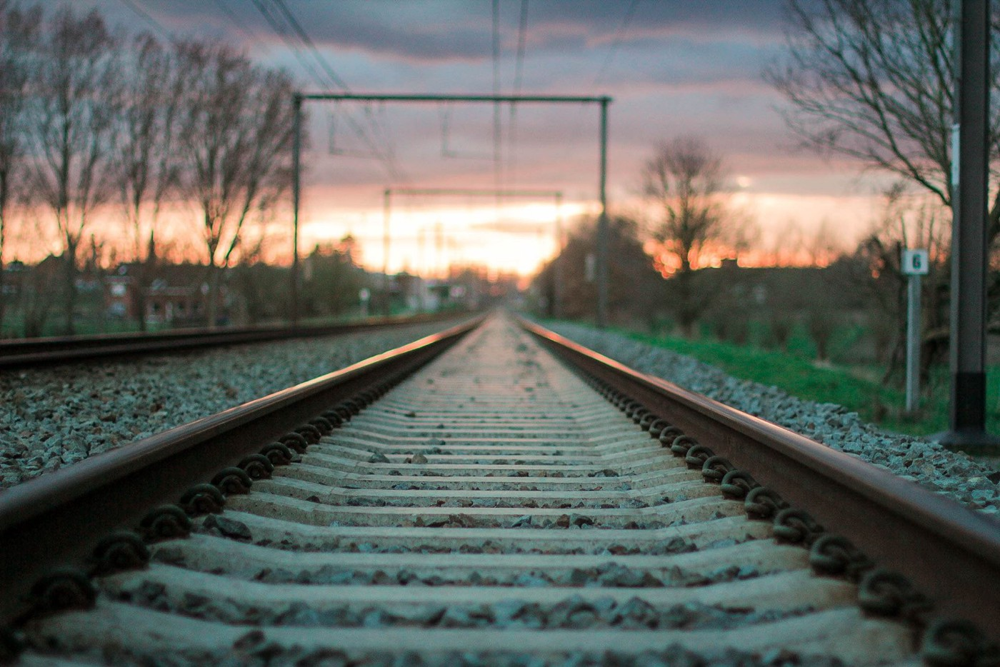

### Refugees Welcome\!

_We, the front\-line volunteers and activists, who for years now have been stepping in and picking up the slack in lieu of governments, the UN and other international organizations when it comes to the alleviation of the situation in which hundreds and thousands of people along the Balkan route find themselves in, are decisively and unequivocally raising our voices against the inhuman treatment of our fellow human beings that is taking place along the Balkan route — and beyond\._

Photo by Abdulazez Dukhan\. “Sometimes you choose a way without knowing where it drives you\. You choose it because it is the only way you have\.”

It is the obligation of the governments of our countries, the UN and other responsible organizations to ensure safe and legal passage for every person who is driven to leave their home for reasons of war, instability, environmental degradation, or economic oppression; to ensure every person’s right to legally seek asylum; and for those who today find themselves on the dangerous route, to be provided with adequate, humane and efficient aid\.

**We call upon our fellow citizens to join us in our efforts to demand that these obligations be respected\.**

Let us remind ourselves that it is the involvement of European elites in colonisation, imperialism and waging today’s wars across the world that has brought on the destruction of lives, homes, livelihoods and entire societal structures for the benefits of the few\. It is by the decision of political elites today’s borders are shutting down\. They build fences, put on razor wires, they bring heavy weapons and arms to our borders, they dehumanize the refugees and they co\-opt us into fascism and racism\. They sign shameful agreements with Turkey, Libya and Niger, putting millions of people in great danger, pushing them into slavery and robbing them of their right to life — and they claim it is on our behalf\. What they are doing is stripping our societies of solidarity with our fellow human beings\!

People, children, are dying — at sea, in rivers, in woods, on streets and borders, due to cold, police brutality, untreated diseases, or simply from exhaustion\. Often their deaths are direct consequences of illegal and violent push\-backs that are happening along our borders every day and every night — and still no one has been held responsible for them\.

**This is unacceptable\! This is inhumane\!**

The countries along the route, and further, cannot use lack of resources as an excuse for this disgraceful and inhumane treatment of people in need\. They cannot trade the lives of refugees entering the EU or Schengen border zone, for simply accessing more European funds\. The EU is waging a war against refugees through the militarization and fortification of its borders\. Countries in the Balkans, who are not yet part of the EU, are now the new frontline of this EU war against refugees, which can be clearly read in the new EU Strategy for the countries of the Balkans\.

These governments together with the EU are now accomplices with and participants in police brutality, and they stand responsible for thousands of refugees’ death at sea and at land\.

A significant portion of this region suffered immensely during the wars in the nineties\. It continues to suffer from the consequences of those wars, and, as such, those from here know first\-hand what it means to be forced to leave one’s home, to seek shelter in foreign countries, and how difficult and painful that experience is\. When the political elites strip our societies of solidarity, they attempt to strip us of our own experiences of forced displacement and seeking refuge, effectively whitewashing their participation and erasing the pain of millions of us\.

Along the Balkan route, activists from around the world, along with the local population, have been providing the aid that is absent from governments and the UN\. It is the local population that have fed, kept warm and sheltered these people in need\. They have provided them with information and acted as a referral mechanism\. They have raised funds\. But most importantly, they have showed the refugees going through some of the most difficult periods in their lives, warmth and solidarity\!

**Thus, we stand united, across borders:**

**Opposing the militarization and fortification of our borders** — we demand safe passage and the right for every person to seek asylum and protection\!

**Opposing ruthlessness, brutality and inhumanity of repressive state apparatuses** — we demand respect and protection of human dignity and we stand united in our belief that no human is illegal and everybody has the right to a decent life\!

**Opposing the dehumanizing propaganda of fear** — we welcome our fellow human beings from across the world; we cherish the experiences they bring with them, and we look forward to sharing our communities with them\.

**Opposing the antagonism and racism** shown towards people in need, we stand united in our belief that it is only through solidarity and decency that we can build societies that are free and equal\.

**Refugees Welcome\!**

_\(You can find translation into Bosnian/Serbian/Croatian/Montenegrin and Italian translation after the list of signatories\)_

**_Signed_**
1. Are You Syrious?
2. Center for Peace Studies \(CMS\)
3. Action from Switzerland
4. Sarajevski otvoreni centar SOC
5. Souls of Sarajevo
6. Souls of Sarajevo Team Kladuša
7. Border Crossing Spielfeld Austria
8. Studenti za izbjeglice, Zagreb
9. Catch a Smile, Luxembourg
10. No Name Kitchen, Serbia
11. Hope Café, Kipseli, Athens
12. Centar za kulturnu i medijsku dekontaminaciju Sarajevo
13. EFM RADIO Sarajevo
14. Centar za mlade “KVART” Prijedor
15. Glocal Roots, Switzerland
16. Athens Legal Support Team
17. Khora Support Denmark
18. Ospiti in Arrivo
19. Refugee Info Bus
20. Inicijativa Dobrošli
21. YIHR
22. Info Park Belgrade
23. Univerza v Ljubljani, Fakulteta za socialno delo, učiteljice in učitelji Katedre za duševno zdravje v skupnosti in Katedre8 za proučevanje družbene pravičnosti in vključevanja
24. Inicijativa “Jer me se tiče”
25. Feministički antimilitaristički kolektiv FAK
26. Front slobode
27. Radnički univerzitet Tuzla
28. Škola udruženog rada \(Bihać\-Kulen Vakuf — Tuzla\)
29. _Documenta_ — Centar za suočavanje s prošlošću
30. Delovna skupina za azil
31. Ambasada Rog
32. Društvo za nenasilno komunikacijo
33. Association for promotion of women’s action — Tiiiit\! Inc\. Skopje
34. HOLDS Foundation, UK
35. Jedan grad, jedna borba
36. Tuzlanski otvoreni centar
37. Omladinska pokret Revolt
38. Ženska mreža BiH
39. NVO “Centar za ženska prava”
40. Intersos
41. Khora Community Center, Athens
42. Oštra nula
43. NoBorders Athens
44. Društvo Humanitas
45. Black Lives Matter, Denmark
46. Lezbično\-feministična univerza, Ljubljana
47. Lungo la Rotta Balcanica — Along the balkan Route, Venice
48. Udruženje Okvir
49. Udruženje Centar za promociju mentalnog zdravlja “Smisao”, Tuzla
50. Удружење грађана “Срце на длану” Бања Лука
51. CET platforma Tuzla
52. CEH\-Sarajevo
53. Međunarodni centar za djecu i omladinu “Fortis”
54. Savez za povratak izbjeglih i raseljenih Bosanske Posavine
55. Centar za edukaciju i istraživanje Nahla
56. Međunarodni centar za mir
57. Građansko udruženje žena “Duvanjke”
58. Centar za demokratiju i tranzicionu pravdu
59. TPO Fondacija
60. Žene ženama
61. Udruženje ZGRADE
62. Udruženje za istraživanje i društvene inovacije “ADT”
63. Udruženje “Žene sa Une”
64. Centar za istraživanje u politici Argument
65. Udruženje Orhideja Stolac
66. Udruženje “Alternative” Kakanj
67. Planinarsko društvo Glasinac
68. Centar za sigurnosne studije
69. Organizacija Glas žene
70. Odisej Bratunac
71. Društvo za pomoč in samopomoč brezdomcev Kralji ulice, Slovenija
72. No border craft, delovna skupina za ženske, Ljubljana
73. Afkors, anarho\-kvir feministični kolektiv, Ljubljana
74. Let’s Help Together Association \(Segítsünk Együtt Egyesület\)
75. Pomozi\.ba
76. Refugee Hotel City Plaza, Athens
77. Network for migrants and refugees, Greece
78. Kontrapress, Beograd
79. Udruženje GREEN ART
80. Fondacija CURE
81. Forum građana Zenica
82. Enough is Enough Collective
83. Pravo na grad, Zagreb
84. Der Frankenkonvoi e\.V\.
85. Grupo de Ayuda a Refugiados de Zaragoza
86. Ruhama, Zenica
87. The Defense of Refugee & Migrant Rights

**_\(If you would like to sign as a group or organizations, please get in touch with [Are You Syrious?](https://www.facebook.com/areyousyrious/) If you want to sign this statement go to [https://chn\.ge/2JfiBYr](https://chn.ge/2JfiBYr) and send it to your government and the EU leaders\)_**

**Izbjeglice dobrodošli\!**

Mi, volonterke i volonteri, akivistkinje i aktivisti koji već godinama radimo direktno na terenu umjesto vlada, UN\-a i drugih međunarodnih organizacija koje ne rade ono što trebaju, a kako bi ublažili situacijue u kojoj se nalaze na stotine hiljada ljudi na “balkanskoj ruti”, odlučno i jasno podižemo glasove protiv nečovječnog postupanja prema ljudima koji su kao i mi, dok prolaze ovom rutom\.

Obaveza vlada naših zemalja, UN\-a i drugih odgovornih organizacija, je osigurati siguran i legalan prolaz svakoj osobi koja je primorana da napusti svoj dom zbog rata, nestabilnosti, degradacije životne okoline ili ekonomskog ugnjetavanja; osigurati pravo svake osobe da zakonski traži azil; i da se onima koji se nalaze na opasnoj ruti pruži odgovarajuća, humana i efikasna pomoć\.

Podsjetimo se da su upravo zbog uloge evropskih elita u kolonijalizaciji i imperijalizmu, i njihovom učešću u današnjim ratovima širom svijeta, uništeni mnogi životi, domovi, sredstva za život i cijele društvene strukture, a sve zbog dobrobiti nekolicine\. Sadašnja zatvaranja granica su upravo posljedica odluka političkih elita\. Oni podižu ograde, donose teško naoružanje na naše granice, dehumaniziraju izbjeglice i povlače nas u fašizam i rasizam\. Potpisuju sramotne sporazume sa Turskom, Libijom i Nigerijom, dovodeći time ljude u veliku opasnost, gurajući ih u ropstvo i oduzimajući im pravo na život — i sve to tvrdeći da to rade zbog nas\. Ono što ustvari rade jeste da u našim društvima uništavaju solidarnost\!

Pozivamo sugrađanke i sugrađane da nam se pridruže u zahtjevima da se poštuju međunarodne obaveze\.

Ljudi umiru — na moru, u rijekama, u šumama, na ulicama i granicama, zbog hladnoće, policijske brutalnosti, bolesti koji se ne liječe ili jednostavno od iscrpljenosti\. Često su njihove smrti izravne posljedice ilegalnih i nasilnih sprječavanja prelaska granica koji se svakog dana i svake noći događaju duž naših granica — i još uvijek nitko nije odgovarao za to\.

**Ovo je neprihvatljivo\! Ovo je nečovječno\!**

Zemlje na tom putu, ali i one koje nisu direktno na tom putu, ne mogu se pravdati nedostatkom resursa za ovaj sramotan i nečovječni odnos prema ljudima kojima je pomoć potrebna\. Ne mogu trgovati životima izbjeglica za ulazak u EU ili Schengensku graničnu zonu ili kao izgovor da bi pristupili fondovima EU\. EU vodi rat protiv izbjeglica tako što militarizira i utvrđuje granice\. Zemlje na Balkanu, koje još uvijek nisu članice EU, sada su postale prva linija fronte ovog rata koji se vodi protiv izbjeglica, što se jasno vidi i iz nove strategije za zemlje Balkana\.

Vlade regiona su sada saučesnici sa EU i sudionici policijske brutalnosti, te odgovorni za smrt hiljada izbjeglica na moru i na kopnu\.

Značajan dio ove regije je strašno patio tokom ratova devedesetih godina\. Regija i dalje osjeti posljedice tih ratova, i zbog toga ljudi na ovim prostorima iz prve ruke znaju šta znači biti prisiljen napustiti dom, tražiti sklonište u stranim zemljama i koliko je teško i bolno to iskustvo\. Istovremeno, političke elite rade na tome da iz našeg društva uklone solidarnost, pokušavaju izbaciti naše vlastito iskustvo prisilnog raseljavanja i traženja utočišta, efikasno zataškavujući svoje učešće i brišući bol miliona ljudi\.

Na balkanskoj ruti, aktivistkinje i aktivisti iz cijelog svijeta, zajedno sa lokalnim stanovništvom, pružaju pomoć koja ne dolazi od vlada i UN\-a\. Lokalno stanovništvo hrani, utopljava i štiti ove ljude kojima treba pomoć\. Oni pružaju informacije i usmjeravaju izbjeglice ka adekvatnim servisima\. Oni prikupljaju sredstva\. No što je najvažnije, oni izbjeglicama, ljudima koji prolaze kroz najteže razdoblje života, pružaju toplinu i solidarnost\!

**Ujedinjeni preko granica stojimo zajedno da bismo se:**

**Suprostavili militarizaciji i utvrđivanju naših granica** — tražimo siguran prolaz i pravo da svaka osoba traži azil i zaštitu\!

**Suprostavili okrutnosti, brutalnosti i nečovječnosti represivnih državnih aparata** — zahtijevamo poštivanje i zaštitu ljudskog dostojanstva, čvrsto uvjereni da nijedno ljudsko biće nije ilegalno i da svako ima pravo na pristojan život\!

**Suprostavili se dehumanizirajućoj propagandi straha** — izražavamo dobrodošlicu svima, cijeneći iskustva koja donose sa sobom, i radujemo se suživotu\.

**Suprostavili se antagonizmu i rasizmu** prema ljudima kojima je pomoć potrebna, stojimo ujedinjeni u našem uvjerenju da samo solidarno i dostojanstveno možemo izgraditi društva koja su slobodna i jednaka\.

Izbjeglice, dobrodošli\!

**Benvenuti rifugiati\!**

Con questo comunicato, noi — volontari e attivisti in prima linea, che da anni si sostituiscono ai governi, alle Nazioni Unite e alle altre organizzazioni internazionali quando si tratta di alleviare la situazione in cui centinaia e migliaia di persone lungo la rotta balcanica si trovano — stiamo in maniera ferma e inequivocabe sollevando le nostre voci contro il trattamento inumano messo in atto verso ogni Essere Umano lungo la rotta balcanica e oltre\.

È obbligo dei governi dei nostri Paesi, delle Nazioni Unite e di altre organizzazioni responsabili, assicurare un passaggio sicuro e legale per ogni persona che è spinta a lasciare la propria casa per motivi di guerra, instabilità, degrado ambientale o oppressione economica; assicurare il diritto di ogni persona di richiedere legalmente l’asilo; e per coloro che oggi si trovano sulla strada pericolosa, per ricevere un aiuto adeguato, umano ed efficace\.

Invitiamo i nostri concittadini ad unirsi a noi nei nostri sforzi per chiedere che tali obblighi siano rispettati\.

Ricordiamoci che è il coinvolgimento delle élite europee nella colonizzazione, l’imperialismo e le guerre di oggi in tutto il mondo che hanno portato alla distruzione di vite, case, mezzi di sostentamento e intere strutture sociali per i benefici di pochi\. È per la decisione delle élite politiche che i confini di oggi si stanno chiudendo\. Vengono costruiti recinti, fili spinati con rasoi, portate armi pesanti ai nostri confini, disumanizzati i rifugiati e noi come società veniamo co\-optati per il fascismo e il razzismo\. Vengono firmati accordi vergognosi con Turchia, Libia e Niger, mettendo in pericolo milioni di persone, spingendole in schiavitù e derubandole del loro diritto alla vita — anche a nostro nome\. Ciò che stanno facendo è spogliare le nostre società di solidarietà verso i nostri simili esseri umani\!

Le persone, i bambini, muoiono — in mare, nei fiumi, nei boschi, nelle strade e ai confini, a causa del freddo, della brutalità della polizia, delle malattie non curate o semplicemente perchè ridotte all’esaurimento delle loro forze\. Spesso le loro morti sono conseguenze dirette di respingimenti illegali e violenti che stanno accadendo lungo i nostri confini ogni giorno e ogni notte — e ancora nessuno è stato ritenuto responsabile per loro\.

**Questo è inaccettabile\! Questo è inumano\!**

I paesi coinvolti lungo tutto questo percorso non possono permettersi di invocare la “”mancanza di risorse” come scusa per il trattamento vergognoso e disumano verso persone bisognose\. Non possono scambiare la vita dei rifugiati che entrano nell’UE o nella zona di confine Schengen, semplicemente per accedere a più fondi europei\. L’UE sta conducendo una guerra contro i rifugiati attraverso la militarizzazione e la fortificazione dei suoi confini\. I paesi dei Balcani, che non fanno ancora parte dell’UE, sono ora la nuova frontiera di questa guerra europea contro i rifugiati, che può essere chiaramente letta nella nuova strategia dell’UE per i paesi dei Balcani\.

Questi governi insieme all’UE sono ora complici e partecipi della brutalità della polizia, e sono responsabili di migliaia di morti di profughi in mare e sui territori\.

Una parte significativa di questa regione ha sofferto immensamente durante le guerre negli anni ’90\. Continua a soffrire per le conseguenze di quelle guerre e, per questa ragione, comprende in prima persona cosa possa significare essere costretti a lasciare la propria casa, a cercare rifugio in Paesi stranieri e quanto sia difficile e dolorosa questa esperienza\. Quando le élite politiche privano le nostre società di solidarietà, tentano di privarci delle nostre esperienze di sfollamento forzato e di cercare rifugio, nascondendo in maniera efficace la loro partecipazione e cancellando la sofferenza di milioni di noi\.

Lungo la rotta balcanica, gli attivisti di tutto il mondo, insieme alla popolazione locale, hanno fornito gli aiuti che mancano da parte dei governi e delle Nazioni Unite\. È la popolazione locale ha nutrito, tenuto al caldo e protetto queste persone bisognose\. Ha fornito loro informazioni e ha agito come punto di riferimento\. Ha raccolto fondi\. Ma soprattutto, è stata al fianco dei rifugiati in alcuni dei periodi più difficili della loro vita, con il loro calore e la loro solidarietà\!

**Opponendosi alla militarizzazione e alla fortificazione dei nostri confini** , chiediamo il passaggio sicuro e il diritto per ogni persona di chiedere asilo e protezione\!

**Opponendosi alla spietatezza, brutalità e disumanità degli apparati statali repressivi** — chiediamo rispetto e tutela della dignità umana e siamo uniti nella nostra convinzione che nessun essere umano sia illegale e tutti abbiano diritto a una vita dignitosa\!

**Opponendosi alla propaganda disumanizzante della paura** , accogliamo i nostri simili umani da ogni parte del mondo; abbiamo a cuore le esperienze che portano con loro e non vediamo l’ora di condividere le nostre comunità con loro\.

**Opponendosi all’antagonismo e al razzismo** mostrato verso le persone bisognose, siamo uniti nella nostra convinzione che è solo attraverso la solidarietà e la dignità che possiamo costruire società libere e uguali\.

Benvenuti rifugiati\!

\( **Izbjeglice dobrodošli\!**

Mi, volonterke i volonteri, akivistkinje i aktivisti koji već godinama radimo direktno na terenu umjesto vlada, UN\-a i drugih međunarodnih organizacija koje ne rade ono što trebaju, a kako bi ublažili situacijue u kojoj se nalaze na stotine hiljada ljudi na “balkanskoj ruti”, odlučno i jasno podižemo glasove protiv nečovječnog postupanja prema ljudima koji su kao i mi, dok prolaze ovom rutom\.

Obaveza vlada naših zemalja, UN\-a i drugih odgovornih organizacija, je osigurati siguran i legalan prolaz svakoj osobi koja je primorana da napusti svoj dom zbog rata, nestabilnosti, degradacije životne okoline ili ekonomskog ugnjetavanja; osigurati pravo svake osobe da zakonski traži azil; i da se onima koji se nalaze na opasnoj ruti pruži odgovarajuća, humana i efikasna pomoć\.

Podsjetimo se da su upravo zbog uloge evropskih elita u kolonijalizaciji i imperijalizmu, i njihovom učešću u današnjim ratovima širom svijeta, uništeni mnogi životi, domovi, sredstva za život i cijele društvene strukture, a sve zbog dobrobiti nekolicine\. Sadašnja zatvaranja granica su upravo posljedica odluka političkih elita\. Oni podižu ograde, donose teško naoružanje na naše granice, dehumaniziraju izbjeglice i povlače nas u fašizam i rasizam\. Potpisuju sramotne sporazume sa Turskom, Libijom i Nigerijom, dovodeći time ljude u veliku opasnost, gurajući ih u ropstvo i oduzimajući im pravo na život — i sve to tvrdeći da to rade zbog nas\. Ono što ustvari rade jeste da u našim društvima uništavaju solidarnost\!

Pozivamo sugrađanke i sugrađane da nam se pridruže u zahtjevima da se poštuju međunarodne obaveze\.

Ljudi umiru — na moru, u rijekama, u šumama, na ulicama i granicama, zbog hladnoće, policijske brutalnosti, bolesti koji se ne liječe ili jednostavno od iscrpljenosti\. Često su njihove smrti izravne posljedice ilegalnih i nasilnih sprječavanja prelaska granica koji se svakog dana i svake noći događaju duž naših granica — i još uvijek nitko nije odgovarao za to\.

**Ovo je neprihvatljivo\! Ovo je nečovječno\!**

Zemlje na tom putu, ali i one koje nisu direktno na tom putu, ne mogu se pravdati nedostatkom resursa za ovaj sramotan i nečovječni odnos prema ljudima kojima je pomoć potrebna\. Ne mogu trgovati životima izbjeglica za ulazak u EU ili Schengensku graničnu zonu ili kao izgovor da bi pristupili fondovima EU\. EU vodi rat protiv izbjeglica tako što militarizira i utvrđuje granice\. Zemlje na Balkanu, koje još uvijek nisu članice EU, sada su postale prva linija fronte ovog rata koji se vodi protiv izbjeglica, što se jasno vidi i iz nove strategije za zemlje Balkana\.

Vlade regiona su sada saučesnici sa EU i sudionici policijske brutalnosti, te odgovorni za smrt hiljada izbjeglica na moru i na kopnu\.

Značajan dio ove regije je strašno patio tokom ratova devedesetih godina\. Regija i dalje osjeti posljedice tih ratova, i zbog toga ljudi na ovim prostorima iz prve ruke znaju šta znači biti prisiljen napustiti dom, tražiti sklonište u stranim zemljama i koliko je teško i bolno to iskustvo\. Istovremeno, političke elite rade na tome da iz našeg društva uklone solidarnost, pokušavaju izbaciti naše vlastito iskustvo prisilnog raseljavanja i traženja utočišta, efikasno zataškavujući svoje učešće i brišući bol miliona ljudi\.

Na balkanskoj ruti, aktivistkinje i aktivisti iz cijelog svijeta, zajedno sa lokalnim stanovništvom, pružaju pomoć koja ne dolazi od vlada i UN\-a\. Lokalno stanovništvo hrani, utopljava i štiti ove ljude kojima treba pomoć\. Oni pružaju informacije i usmjeravaju izbjeglice ka adekvatnim servisima\. Oni prikupljaju sredstva\. No što je najvažnije, oni izbjeglicama, ljudima koji prolaze kroz najteže razdoblje života, pružaju toplinu i solidarnost\!

**Ujedinjeni preko granica stojimo zajedno da bismo se:**

**Suprostavili militarizaciji i utvrđivanju naših granica** — tražimo siguran prolaz i pravo da svaka osoba traži azil i zaštitu\!

**Suprostavili okrutnosti, brutalnosti i nečovječnosti represivnih državnih aparata** — zahtijevamo poštivanje i zaštitu ljudskog dostojanstva, čvrsto uvjereni da nijedno ljudsko biće nije ilegalno i da svako ima pravo na pristojan život\!

**Suprostavili se dehumanizirajućoj propagandi straha** — izražavamo dobrodošlicu svima, cijeneći iskustva koja donose sa sobom, i radujemo se suživotu\.

**Suprostavili se antagonizmu i rasizmu** prema ljudima kojima je pomoć potrebna, stojimo ujedinjeni u našem uvjerenju da samo solidarno i dostojanstveno možemo izgraditi društva koja su slobodna i jednaka\.

Izbjeglice, dobrodošli\!

**Benvenuti rifugiati\!**

Con questo comunicato, noi — volontari e attivisti in prima linea, che da anni si sostituiscono ai governi, alle Nazioni Unite e alle altre organizzazioni internazionali quando si tratta di alleviare la situazione in cui centinaia e migliaia di persone lungo la rotta balcanica si trovano — stiamo in maniera ferma e inequivocabe sollevando le nostre voci contro il trattamento inumano messo in atto verso ogni Essere Umano lungo la rotta balcanica e oltre\.

È obbligo dei governi dei nostri Paesi, delle Nazioni Unite e di altre organizzazioni responsabili, assicurare un passaggio sicuro e legale per ogni persona che è spinta a lasciare la propria casa per motivi di guerra, instabilità, degrado ambientale o oppressione economica; assicurare il diritto di ogni persona di richiedere legalmente l’asilo; e per coloro che oggi si trovano sulla strada pericolosa, per ricevere un aiuto adeguato, umano ed efficace\.

Invitiamo i nostri concittadini ad unirsi a noi nei nostri sforzi per chiedere che tali obblighi siano rispettati\.

Ricordiamoci che è il coinvolgimento delle élite europee nella colonizzazione, l’imperialismo e le guerre di oggi in tutto il mondo che hanno portato alla distruzione di vite, case, mezzi di sostentamento e intere strutture sociali per i benefici di pochi\. È per la decisione delle élite politiche che i confini di oggi si stanno chiudendo\. Vengono costruiti recinti, fili spinati con rasoi, portate armi pesanti ai nostri confini, disumanizzati i rifugiati e noi come società veniamo co\-optati per il fascismo e il razzismo\. Vengono firmati accordi vergognosi con Turchia, Libia e Niger, mettendo in pericolo milioni di persone, spingendole in schiavitù e derubandole del loro diritto alla vita — anche a nostro nome\. Ciò che stanno facendo è spogliare le nostre società di solidarietà verso i nostri simili esseri umani\!

Le persone, i bambini, muoiono — in mare, nei fiumi, nei boschi, nelle strade e ai confini, a causa del freddo, della brutalità della polizia, delle malattie non curate o semplicemente perchè ridotte all’esaurimento delle loro forze\. Spesso le loro morti sono conseguenze dirette di respingimenti illegali e violenti che stanno accadendo lungo i nostri confini ogni giorno e ogni notte — e ancora nessuno è stato ritenuto responsabile per loro\.

**Questo è inaccettabile\! Questo è inumano\!**

I paesi coinvolti lungo tutto questo percorso non possono permettersi di invocare la “”mancanza di risorse” come scusa per il trattamento vergognoso e disumano verso persone bisognose\. Non possono scambiare la vita dei rifugiati che entrano nell’UE o nella zona di confine Schengen, semplicemente per accedere a più fondi europei\. L’UE sta conducendo una guerra contro i rifugiati attraverso la militarizzazione e la fortificazione dei suoi confini\. I paesi dei Balcani, che non fanno ancora parte dell’UE, sono ora la nuova frontiera di questa guerra europea contro i rifugiati, che può essere chiaramente letta nella nuova strategia dell’UE per i paesi dei Balcani\.

Questi governi insieme all’UE sono ora complici e partecipi della brutalità della polizia, e sono responsabili di migliaia di morti di profughi in mare e sui territori\.

Una parte significativa di questa regione ha sofferto immensamente durante le guerre negli anni ’90\. Continua a soffrire per le conseguenze di quelle guerre e, per questa ragione, comprende in prima persona cosa possa significare essere costretti a lasciare la propria casa, a cercare rifugio in Paesi stranieri e quanto sia difficile e dolorosa questa esperienza\. Quando le élite politiche privano le nostre società di solidarietà, tentano di privarci delle nostre esperienze di sfollamento forzato e di cercare rifugio, nascondendo in maniera efficace la loro partecipazione e cancellando la sofferenza di milioni di noi\.

Lungo la rotta balcanica, gli attivisti di tutto il mondo, insieme alla popolazione locale, hanno fornito gli aiuti che mancano da parte dei governi e delle Nazioni Unite\. È la popolazione locale ha nutrito, tenuto al caldo e protetto queste persone bisognose\. Ha fornito loro informazioni e ha agito come punto di riferimento\. Ha raccolto fondi\. Ma soprattutto, è stata al fianco dei rifugiati in alcuni dei periodi più difficili della loro vita, con il loro calore e la loro solidarietà\!

**Opponendosi alla militarizzazione e alla fortificazione dei nostri confini** , chiediamo il passaggio sicuro e il diritto per ogni persona di chiedere asilo e protezione\!

**Opponendosi alla spietatezza, brutalità e disumanità degli apparati statali repressivi** — chiediamo rispetto e tutela della dignità umana e siamo uniti nella nostra convinzione che nessun essere umano sia illegale e tutti abbiano diritto a una vita dignitosa\!

**Opponendosi alla propaganda disumanizzante della paura** , accogliamo i nostri simili umani da ogni parte del mondo; abbiamo a cuore le esperienze che portano con loro e non vediamo l’ora di condividere le nostre comunità con loro\.

**Opponendosi all’antagonismo e al razzismo** mostrato verso le persone bisognose, siamo uniti nella nostra convinzione che è solo attraverso la solidarietà e la dignità che possiamo costruire società libere e uguali\.

Benvenuti rifugiati\!

**Izbjeglice dobrodošli\!**

Mi, volonterke i volonteri, akivistkinje i aktivisti koji već godinama radimo direktno na terenu umjesto vlada, UN\-a i drugih međunarodnih organizacija koje ne rade ono što trebaju, a kako bi ublažili situacijue u kojoj se nalaze na stotine hiljada ljudi na “balkanskoj ruti”, odlučno i jasno podižemo glasove protiv nečovječnog postupanja prema ljudima koji su kao i mi, dok prolaze ovom rutom\.

Obaveza vlada naših zemalja, UN\-a i drugih odgovornih organizacija, je osigurati siguran i legalan prolaz svakoj osobi koja je primorana da napusti svoj dom zbog rata, nestabilnosti, degradacije životne okoline ili ekonomskog ugnjetavanja; osigurati pravo svake osobe da zakonski traži azil; i da se onima koji se nalaze na opasnoj ruti pruži odgovarajuća, humana i efikasna pomoć\.

Podsjetimo se da su upravo zbog uloge evropskih elita u kolonijalizaciji i imperijalizmu, i njihovom učešću u današnjim ratovima širom svijeta, uništeni mnogi životi, domovi, sredstva za život i cijele društvene strukture, a sve zbog dobrobiti nekolicine\. Sadašnja zatvaranja granica su upravo posljedica odluka političkih elita\. Oni podižu ograde, donose teško naoružanje na naše granice, dehumaniziraju izbjeglice i povlače nas u fašizam i rasizam\. Potpisuju sramotne sporazume sa Turskom, Libijom i Nigerijom, dovodeći time ljude u veliku opasnost, gurajući ih u ropstvo i oduzimajući im pravo na život — i sve to tvrdeći da to rade zbog nas\. Ono što ustvari rade jeste da u našim društvima uništavaju solidarnost\!

Pozivamo sugrađanke i sugrađane da nam se pridruže u zahtjevima da se poštuju međunarodne obaveze\.

Ljudi umiru — na moru, u rijekama, u šumama, na ulicama i granicama, zbog hladnoće, policijske brutalnosti, bolesti koji se ne liječe ili jednostavno od iscrpljenosti\. Često su njihove smrti izravne posljedice ilegalnih i nasilnih sprječavanja prelaska granica koji se svakog dana i svake noći događaju duž naših granica — i još uvijek nitko nije odgovarao za to\.

**Ovo je neprihvatljivo\! Ovo je nečovječno\!**

Zemlje na tom putu, ali i one koje nisu direktno na tom putu, ne mogu se pravdati nedostatkom resursa za ovaj sramotan i nečovječni odnos prema ljudima kojima je pomoć potrebna\. Ne mogu trgovati životima izbjeglica za ulazak u EU ili Schengensku graničnu zonu ili kao izgovor da bi pristupili fondovima EU\. EU vodi rat protiv izbjeglica tako što militarizira i utvrđuje granice\. Zemlje na Balkanu, koje još uvijek nisu članice EU, sada su postale prva linija fronte ovog rata koji se vodi protiv izbjeglica, što se jasno vidi i iz nove strategije za zemlje Balkana\.

Vlade regiona su sada saučesnici sa EU i sudionici policijske brutalnosti, te odgovorni za smrt hiljada izbjeglica na moru i na kopnu\.

Značajan dio ove regije je strašno patio tokom ratova devedesetih godina\. Regija i dalje osjeti posljedice tih ratova, i zbog toga ljudi na ovim prostorima iz prve ruke znaju šta znači biti prisiljen napustiti dom, tražiti sklonište u stranim zemljama i koliko je teško i bolno to iskustvo\. Istovremeno, političke elite rade na tome da iz našeg društva uklone solidarnost, pokušavaju izbaciti naše vlastito iskustvo prisilnog raseljavanja i traženja utočišta, efikasno zataškavujući svoje učešće i brišući bol miliona ljudi\.

Na balkanskoj ruti, aktivistkinje i aktivisti iz cijelog svijeta, zajedno sa lokalnim stanovništvom, pružaju pomoć koja ne dolazi od vlada i UN\-a\. Lokalno stanovništvo hrani, utopljava i štiti ove ljude kojima treba pomoć\. Oni pružaju informacije i usmjeravaju izbjeglice ka adekvatnim servisima\. Oni prikupljaju sredstva\. No što je najvažnije, oni izbjeglicama, ljudima koji prolaze kroz najteže razdoblje života, pružaju toplinu i solidarnost\!

**Ujedinjeni preko granica stojimo zajedno da bismo se:**

**Suprostavili militarizaciji i utvrđivanju naših granica** — tražimo siguran prolaz i pravo da svaka osoba traži azil i zaštitu\!

**Suprostavili okrutnosti, brutalnosti i nečovječnosti represivnih državnih aparata** — zahtijevamo poštivanje i zaštitu ljudskog dostojanstva, čvrsto uvjereni da nijedno ljudsko biće nije ilegalno i da svako ima pravo na pristojan život\!

**Suprostavili se dehumanizirajućoj propagandi straha** — izražavamo dobrodošlicu svima, cijeneći iskustva koja donose sa sobom, i radujemo se suživotu\.

**Suprostavili se antagonizmu i rasizmu** prema ljudima kojima je pomoć potrebna, stojimo ujedinjeni u našem uvjerenju da samo solidarno i dostojanstveno možemo izgraditi društva koja su slobodna i jednaka\.

Izbjeglice, dobrodošli\!

\(Ako želite da potpišete — [https://www\.change\.org/p/governments\-of\-balkans\-refugee\-welcome\-balkans](https://www.change.org/p/governments-of-balkans-refugee-welcome-balkans) \)

**Benvenuti rifugiati\!**

Con questo comunicato, noi — volontari e attivisti in prima linea, che da anni si sostituiscono ai governi, alle Nazioni Unite e alle altre organizzazioni internazionali quando si tratta di alleviare la situazione in cui centinaia e migliaia di persone lungo la rotta balcanica si trovano — stiamo in maniera ferma e inequivocabe sollevando le nostre voci contro il trattamento inumano messo in atto verso ogni Essere Umano lungo la rotta balcanica e oltre\.

È obbligo dei governi dei nostri Paesi, delle Nazioni Unite e di altre organizzazioni responsabili, assicurare un passaggio sicuro e legale per ogni persona che è spinta a lasciare la propria casa per motivi di guerra, instabilità, degrado ambientale o oppressione economica; assicurare il diritto di ogni persona di richiedere legalmente l’asilo; e per coloro che oggi si trovano sulla strada pericolosa, per ricevere un aiuto adeguato, umano ed efficace\.

Invitiamo i nostri concittadini ad unirsi a noi nei nostri sforzi per chiedere che tali obblighi siano rispettati\.

Ricordiamoci che è il coinvolgimento delle élite europee nella colonizzazione, l’imperialismo e le guerre di oggi in tutto il mondo che hanno portato alla distruzione di vite, case, mezzi di sostentamento e intere strutture sociali per i benefici di pochi\. È per la decisione delle élite politiche che i confini di oggi si stanno chiudendo\. Vengono costruiti recinti, fili spinati con rasoi, portate armi pesanti ai nostri confini, disumanizzati i rifugiati e noi come società veniamo co\-optati per il fascismo e il razzismo\. Vengono firmati accordi vergognosi con Turchia, Libia e Niger, mettendo in pericolo milioni di persone, spingendole in schiavitù e derubandole del loro diritto alla vita — anche a nostro nome\. Ciò che stanno facendo è spogliare le nostre società di solidarietà verso i nostri simili esseri umani\!

Le persone, i bambini, muoiono — in mare, nei fiumi, nei boschi, nelle strade e ai confini, a causa del freddo, della brutalità della polizia, delle malattie non curate o semplicemente perchè ridotte all’esaurimento delle loro forze\. Spesso le loro morti sono conseguenze dirette di respingimenti illegali e violenti che stanno accadendo lungo i nostri confini ogni giorno e ogni notte — e ancora nessuno è stato ritenuto responsabile per loro\.

**Questo è inaccettabile\! Questo è inumano\!**

I paesi coinvolti lungo tutto questo percorso non possono permettersi di invocare la “”mancanza di risorse” come scusa per il trattamento vergognoso e disumano verso persone bisognose\. Non possono scambiare la vita dei rifugiati che entrano nell’UE o nella zona di confine Schengen, semplicemente per accedere a più fondi europei\. L’UE sta conducendo una guerra contro i rifugiati attraverso la militarizzazione e la fortificazione dei suoi confini\. I paesi dei Balcani, che non fanno ancora parte dell’UE, sono ora la nuova frontiera di questa guerra europea contro i rifugiati, che può essere chiaramente letta nella nuova strategia dell’UE per i paesi dei Balcani\.

Questi governi insieme all’UE sono ora complici e partecipi della brutalità della polizia, e sono responsabili di migliaia di morti di profughi in mare e sui territori\.

Una parte significativa di questa regione ha sofferto immensamente durante le guerre negli anni ’90\. Continua a soffrire per le conseguenze di quelle guerre e, per questa ragione, comprende in prima persona cosa possa significare essere costretti a lasciare la propria casa, a cercare rifugio in Paesi stranieri e quanto sia difficile e dolorosa questa esperienza\. Quando le élite politiche privano le nostre società di solidarietà, tentano di privarci delle nostre esperienze di sfollamento forzato e di cercare rifugio, nascondendo in maniera efficace la loro partecipazione e cancellando la sofferenza di milioni di noi\.

Lungo la rotta balcanica, gli attivisti di tutto il mondo, insieme alla popolazione locale, hanno fornito gli aiuti che mancano da parte dei governi e delle Nazioni Unite\. È la popolazione locale ha nutrito, tenuto al caldo e protetto queste persone bisognose\. Ha fornito loro informazioni e ha agito come punto di riferimento\. Ha raccolto fondi\. Ma soprattutto, è stata al fianco dei rifugiati in alcuni dei periodi più difficili della loro vita, con il loro calore e la loro solidarietà\!

**Opponendosi alla militarizzazione e alla fortificazione dei nostri confini** , chiediamo il passaggio sicuro e il diritto per ogni persona di chiedere asilo e protezione\!

**Opponendosi alla spietatezza, brutalità e disumanità degli apparati statali repressivi** — chiediamo rispetto e tutela della dignità umana e siamo uniti nella nostra convinzione che nessun essere umano sia illegale e tutti abbiano diritto a una vita dignitosa\!

**Opponendosi alla propaganda disumanizzante della paura** , accogliamo i nostri simili umani da ogni parte del mondo; abbiamo a cuore le esperienze che portano con loro e non vediamo l’ora di condividere le nostre comunità con loro\.

**Opponendosi all’antagonismo e al razzismo** mostrato verso le persone bisognose, siamo uniti nella nostra convinzione che è solo attraverso la solidarietà e la dignità che possiamo costruire società libere e uguali\.

Benvenuti rifugiati\!

\( [https://www\.change\.org/p/governments\-of\-balkans\-refugee\-welcome\-balkans](https://www.change.org/p/governments-of-balkans-refugee-welcome-balkans) \)

_Converted [Medium Post](https://medium.com/are-you-syrious/refugees-welcome-582caf5985ad) by [ZMediumToMarkdown](https://github.com/ZhgChgLi/ZMediumToMarkdown)._
