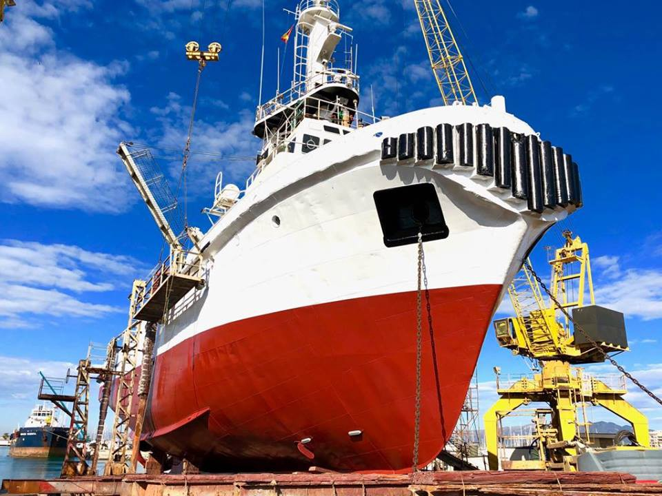
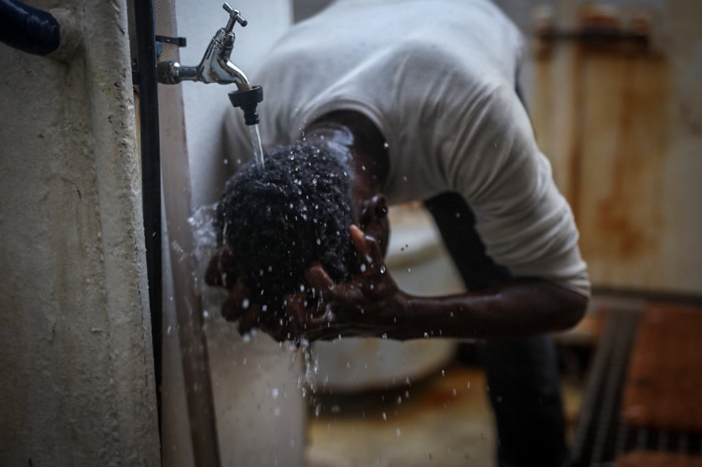
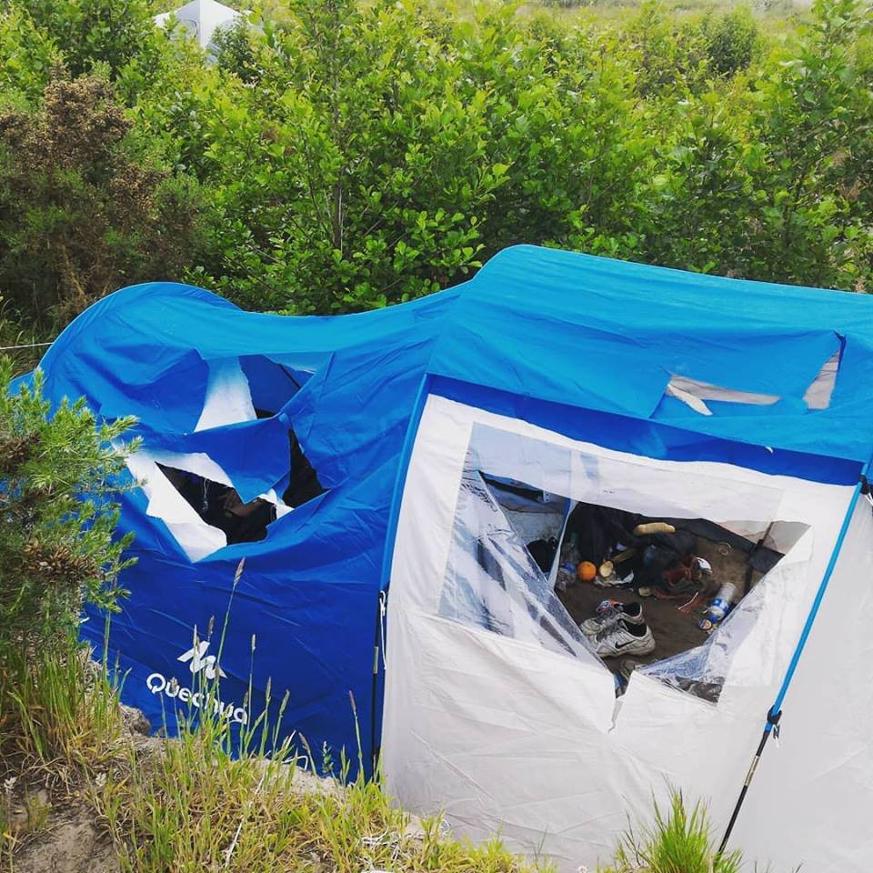

### AYS DAILY DIGEST 07/06/2018: Italy closes its case against Proactiva Open Arms

_Greek authorities routinely confine asylum\-seeking women with unrelated men//140 forced evictions took place in Calais over the last seven months//Turkey suspends migrant readmission deal with Greece_

Photo by Proactiva Open Arms
#### Feature

The Italian judiciary has definitely dimissed the case against Proactiva Open Arms, which led to the seizure of their boat\. It confirms Proactiva acted in accordance with international law\. The investigation started after Proactiva rescuers refused to hand over people they had rescued to a Libyan coast guard unit in international waters, despite instructions from the Italian maritime rescue coordination center to do so\. Despite these good news, the future of rescue organisations remains uncertain, as Italian Interior Minister Salvini recently called rescue organisations “smugglers” and said no rescue boat should be able to dock in Italian ports\.

This comes as [Reuters](https://www.reuters.com/article/us-libya-migrants-un/u-n-sanctions-six-people-on-libya-human-trafficking-idUSKCN1J32V1) reports the UN Security Council sanctioned six people for involvement in human trafficking and smuggling of refugees in Libya\. The six men allegedly made fortunes from buying and selling vulnerable migrants\. Christiaan Tribert of Bellingcat, however, notes that one of the six men, Abd al\-Rahman al\-Milad, heads a regional unit of the Libyan Coast Guard\. He argues he is taking resources from the EU to intercept migrants, while taking money from smugglers to protect their trafficking operations\.

Seawatch meanwhile says it has been navigating with 232 people on board for more than 80 hours\. It has still not been told in which Italian port it will be allowed to dock\. Many people are suffering from sea sickness\.

Photo by Erik Marquardt

Luckily, new projects are starting that will hopefully improve the situation in the Mediterrenean somewhat\. Maydayterraneo, a project intiated by Proemaid and Salvamento Maritimo Humanitario, has presented its new boat “Aita Mari” which will sail towards the Central Mediterrenean this summer\.

Meanwhile, Salvamento Maritimo has rescued one boat with eight people off the coast of Tarifa\. Two boats, one with 47 people and another with 43, were rescued off the coast of the island of Alboran\.
#### Greece
### 46 people arrive on Samos

According to the Aegean Boat Report, 20 people have arrived on Kos and 46 people have arrived on Samos\. A total of 398 people arrived on Samos in May, down from 418 the previous month\. Only 221 asylum\-seekers left for the mainland\.
### Greek authorities routinely confine asylum\-seeking women with unrelated men

A new [Human Rights Watch](https://www.hrw.org/news/2018/06/07/greece-asylum-seeking-women-detained-men) report says Greek authorities are routinely confining asylum\-seeking women with unrelated men in the northern Evros region, putting them at grave risk of sexual violence and harassment\. Twelve women and two girls interviewed said they had been locked in cells or enclosures for weeks, and in one case for nearly five months\. Five women said they had severe psychological distress as a result, including two who had suicidal thoughts\. One woman said “I haven’t moved my legs for 23 days”, demonstrating how she cowered with her knees hugged to her chest all day\. “If I had a way to kill myself, I would have\.”
### Turkey suspends migrant readmission deal with Greece

[Reuters](https://www.reuters.com/article/us-turkey-security-greece/turkey-suspends-migrant-readmission-deal-with-greece-hurriyet-idUSKCN1J31OO) reports Turkey has suspended a migrant readmission deal it had signed with Greece in response to a Greek court ruling that refused to extradite the eight Turkish soldiers who fled to the country after the failed coup in 2016\. Turkish Foreign Minister Mevlut Cavusoglu said, “We have a refugee deal with the EU and we have a readmission agreement with Greece\. We have suspended the deal with Greece”\.
### Drop in the Ocean needs volunteers

Drop in the Ocean has been approached by IOM who wants them to start doing children’s activities in the Elefsina camp\. Their secretary general, Trude, visited the camp today\. They need volunteers with experience working with young children\. The volunteers need to be able to stay at least 1 month, and must be above the age of 25\. People with knowledge of Arabic, Kurdish or Greek languages are highly needed\. Please e\-mail [frivillig@drapenihavet\.no](mailto:frivillig@drapenihavet.no) if you are interested\. Other volunteer needs can be found on [Greecevol](https://greecevol.info/) as always\.
#### France
### 140 forced evictions in Calais over the last seven months

Photo by L’Auberge des Migrants

L’Auberge des Migrants says 140 forced evictions have taken place between October and April\. Since the end of March, expulsions have accelerated\. The refugees’ tents and personal belongings have been destroyed in the process\. The association has published a new report on the [issue](http://www.laubergedesmigrants.fr/wp-content/uploads/2018/06/Rapport-expulsion-forc%C3%A9es-mai-2018.pdf) and has launched a [petition](https://www.change.org/p/minist%C3%A8re-de-l-int%C3%A9rieur-plus-de-140-expulsions-forc%C3%A9es-%C3%A0-calais-cela-doit-cesser-shelternow?recruiter=477616338&utm_source=share_petition&utm_medium=copylink&utm_campaign=share_petition) calling on the Ministry of the Interior to stop these evictions\.
#### Sweden
### Sweden votes on law for new unaccompanied minors

[Dagens Nyheter](https://www.dn.se/nyheter/politik/riksdagen-rostar-ja-till-ny-chans-till-uppehallstillstand-for-ensamkommande/) reports the Swedish Parliament has voted in favor of a new law that allows thousands of refugees, mostly Afghan minors who have already been rejected, to get a new chance of staying in Sweden\. The law gives the opportunity for those who meet very specific criteria and study at high school level to finish their education and get a job, and then apply for permanent recidency\. Not everyone will be able to apply\. Hundreds of activists in Sweden have been holding demonstrations, meetings with lawmakers and raising their voice to give the young boys a new chance\.
#### Germany
### Protest for rights of young refugees in Bremen

The alliance “ [Shut Down Gottlieb Daimler Straße](https://www.facebook.com/events/618875775142548/) ” announced its next demonstration at the main station in Bremen on Saturday\. The group hopes to allow young refugees to live a ‘good and safe life in Bremen’ as local authorities are increasingly transfering these teenagers to other states since protests started to force the closure of the Gottlieb Daimler Straße camp\. AYS discussed the living conditions in this camp in a recent [Special](ays-special-from-germany-young-people-in-bremen-pushed-out-of-the-system-87c1fca35dc4) \.
#### Balkans

[Balkan Insight](http://www.balkaninsight.com/en/article/countries-of-the-region-to-work-jointly-on-migrant-crisis-06-07-2018) reports the Balkan countries have agreed to create a joint database and develop cooperation in a bid to track migrants\. Bosnian security minister Dragan Mektic said “we must be able to see if those people previously stayed in Europe”, adding “we will see if it is possible for us from the Western Balkans to become part of Frontex”\.

This comes at a moment when the EU is increasingly focusing on the protection of its external borders\. [_Politico_](https://www.politico.eu/newsletter/brussels-playbook/politico-brussels-playbook-presented-by-banco-santander-g6-us-polish-carrots-and-sticks-brexit-breakthrough/) _,_ for example, sees President Juncker and Chancellor Merkel falling into Chancellor Kurz’s more radical line on migration, but reports Kurz began to go further at a recent meeting\. Kurz is quoted calling for a stronger, ‘proper political mandate’ for Frontex\. Kurz believes Frontex must engage with third countries, adding it ‘must be possible to prevent boats from leaving\. It must be possible to take care of people at the external border’\. [_Le Monde_](https://www.lemonde.fr/europe/article/2018/06/08/l-autriche-et-le-danemark-veulent-ouvrir-des-camps-d-expulses-aux-portes-de-l-ue_5311452_3214.html) _,_ meanwhile, reports Austria and Denmark want to open camps at the EU borders\. According to the PM Rasmussen, Copenhagen is in discussion with Vienna and ‘other countries’ of the EU for the establishment of a ‘new European asylum system’\. The central point of the mechanism is the creation of ‘common reception and expulsion centres in Europe’, but outside the EU\. Several sources argue the camps could be located in Albania or Kosovo\. However, many countries including Germany and France have expressed their scepticism over the idea\.

**We strive to echo correct news from the ground through collaboration and fairness\.**

**Every effort has been made to credit organizations and individuals with regard to the supply of information, video, and photo material \(in cases where the source wanted to be accredited\) \. Please notify us regarding corrections\.**

**If there’s anything you want to share or comment, contact us through Facebook or write to: [areyousyrious@gmail\.com](mailto:areyousyrious@gmail.com)**

_Converted [Medium Post](https://medium.com/are-you-syrious/ays-daily-digest-07-06-2018-italy-closes-its-case-against-proactiva-open-arms-bf099fff554b) by [ZMediumToMarkdown](https://github.com/ZhgChgLi/ZMediumToMarkdown)._
