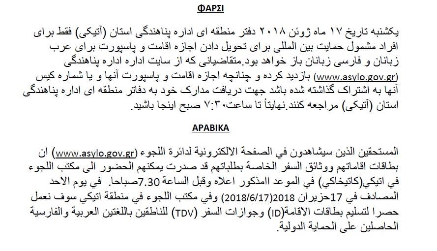
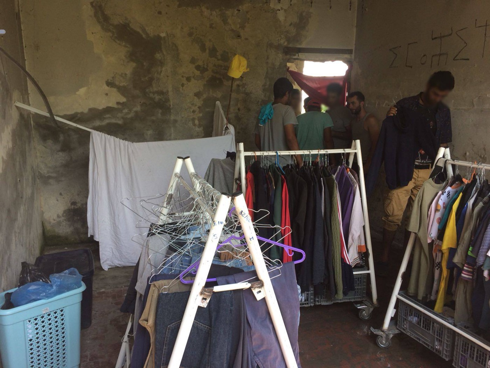
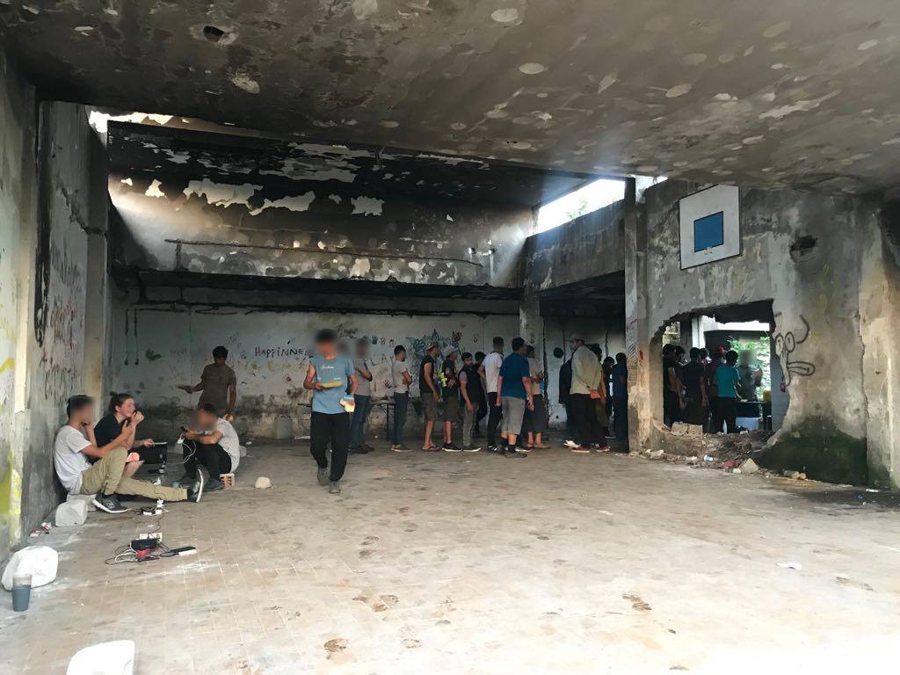
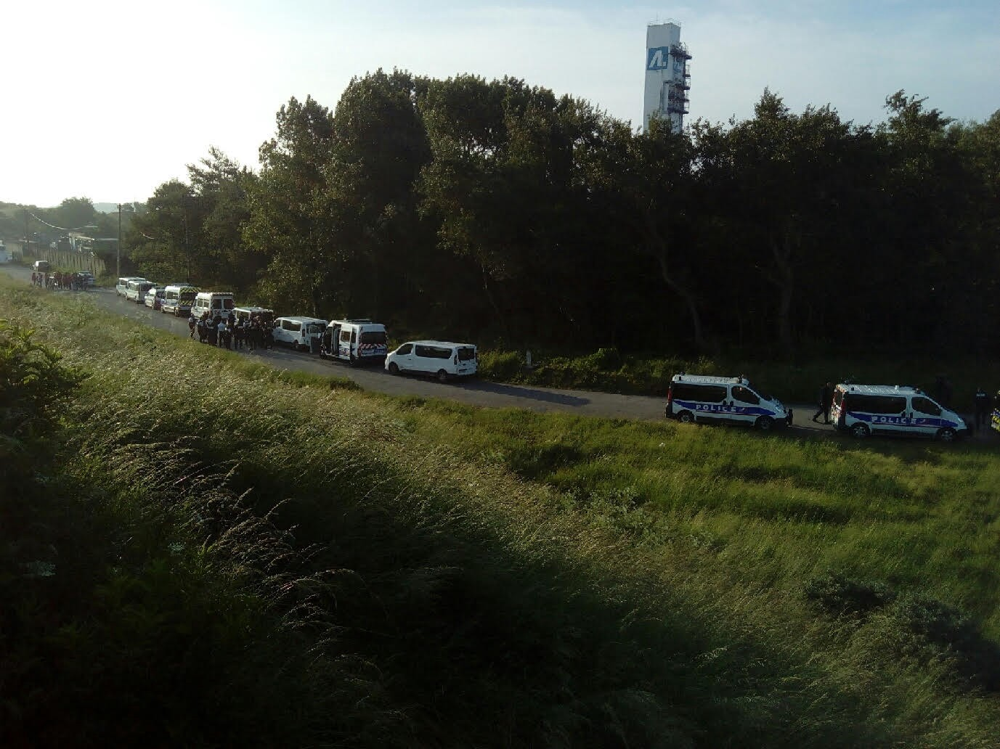
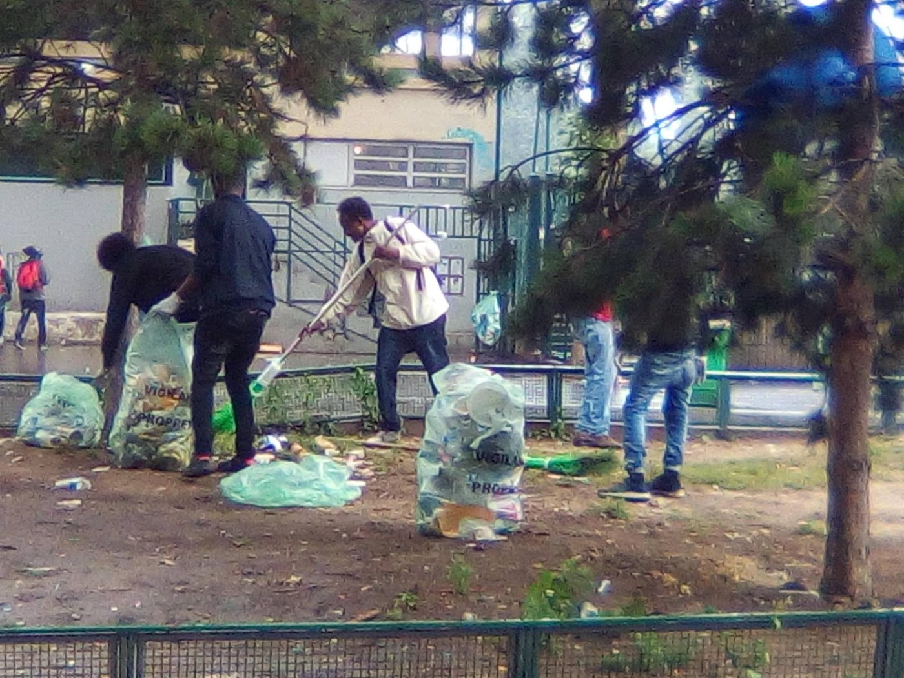
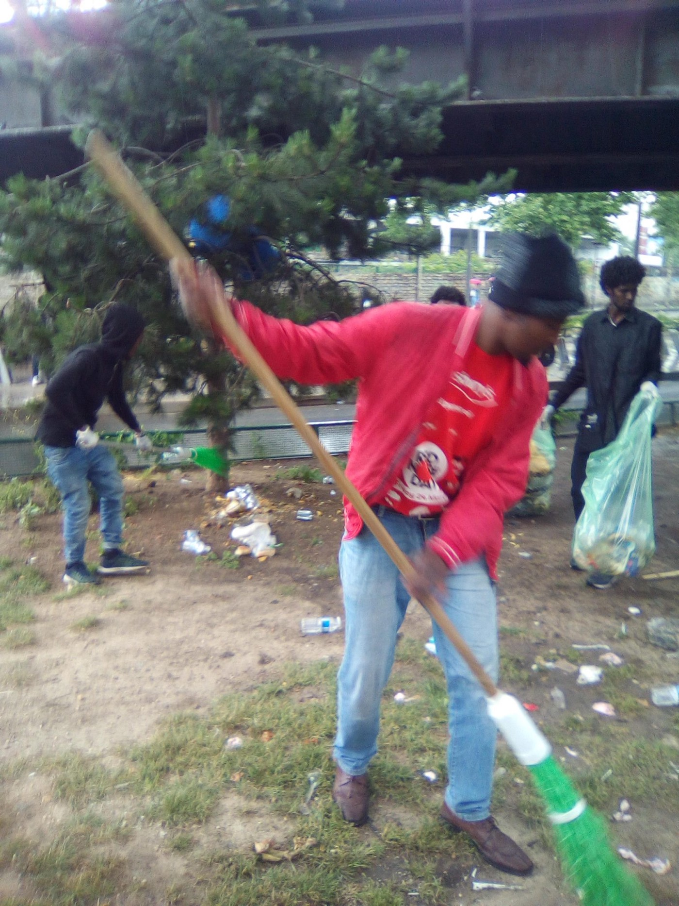

### AYS Daily News Digest 12/6/18: Vocal Response to Italy’s refusal to accept rescued people to dock\.

_People take to the streets of Palermo // Belgian representative highlights shared responsibility\. Austria’s Kurz developing plan for non\-EU refugee centers // Updates from Greece // Opportunities for Language exchange in Bulgaria // Police randomly displacing people using racial and economic profiling in Sarajevo // Life carries on in France after forced evictions previous week // Deportation imminent for at risk person in UK\!_

1000 people protest in Palermo Photo Credit: Richard Brodie
### FEATURE

Over 1000 people took to the streets of Palermo on Monday night to protest the Italian government’s refusal to allow a SAR ship with 600\+ people onboard to land in Italy\. This action models the action that must be constantly taken by citizens in order to show their disavowal of decisions that not only contravene migration law but first and foremost jeopardize the lives of human beings\.

However, [Italy still faces possible penalties](http://www.ansa.it/english/news/general_news/2018/06/12/italy-risks-penal-responsibilities-3_6c18483b-e664-411e-b38e-cdacb1badbe8.html) for their refusal to allow the ship to dock, which precipitated an absurd crisis and ended with the ship docking in Spain after first being directed to Malta\. Spanish Justice Minister stated: “It’s not a question of being a bleeding\-heart liberal or of generosity, but of humanitarian law\.”

Paradoxically, and perhaps in light of this possible penalization, Italy allowed a ship with more than 900 people to dock later\. Frederico Soda of IOM highlights that technically these decisions cannot be made by the Minister of the Interior \(who ostensibly forbade the ship with 600\+ people\) \.

■■■■■■■■■■■■■■ 
> **[Federico Soda](https://twitter.com/fedsoda) @ Twitter Says:** 

> > It's not up to the Ministry of Interior to close the ports. They are under the jurisdiction of the Ministry of Infrastructure and Transport. The Ministry of Interior controls the border posts at the ports which is where those that disembarked are screened and checked. [twitter.com/MKWilliamsRome…](https://twitter.com/MKWilliamsRome/status/1006502838288207877) 

> **Tweeted at [2018-06-12 14:22:28](https://twitter.com/fedsoda/status/1006542253983195137).** 

■■■■■■■■■■■■■■ 

Regardless of whose responsibility it is, it is telling how flippantly governments will risk contravening international law in order to serve their interests whilst invoking it at will in order to persecute and crack down on people in need as well as those helping them\.
### LIBYA

■■■■■■■■■■■■■■ 
> **[migrace.org](https://twitter.com/Migrace_Organiz) @ Twitter Says:** 

> > Yesterday 11/06/2018 , Security agencies discovered a place (a House managed by smugglers ) containing 62 #migrants ( 24 Women and 38 Men) in #Zuwarah getting ready to go to #Europe https://t.co/p3RZsWFFxl 

> **Tweeted at [2018-06-12 01:18:03](https://twitter.com/migrace_organiz/status/1006344848373436416).** 

■■■■■■■■■■■■■■ 

It is expected that probably the people themselves will be treated poorly in detention, criminalized simply for wishing to not suffer\.
### EU

Belgian representative Guy Verhofstadt had strong words to criticize the failure of the European Union to share responsibility and support people seeking safety and a better life\. Watch below:

Conversely, Sebastian Kurz of Austria is forming a plan to have a refugee reception centers where people wishing to come can ask for asylum\. Sounds like a change coming from the conservative and strongly anti\-migrant politician until the full plan is revealed — the centers will be outside the EU\. Furthermore it is designed to “provide protection rather than a chance at a better life\.” When asked, he noted that he is working with a “very small group of other countries very confidentially” in order to bring the plan to fruition\. Radio Free Europe also reports that Austrian media speculates that Albania may be the location of this planned project, but when asked it was said, “We’ll see\.” For more information \(Available in BCS\) as well as IOM’s numbers of people on the move in Albania, Bosnia, and Montenegro, go [here](https://www.slobodnaevropa.org/a/29288174.html) \.
### GREECE

Two boats landed on Samos east this morning between 06\.00–07\.00\.
First boat 23 people, second boat 19 people, [Aegean Boat Report](https://www.facebook.com/AegeanBoatReport/?hc_ref=ARTpJAUAjqy7fKrpvGl8aLx2puCO9lEJIvG0mULGpsHGQnCJwSolf2teuO7lIPpunJQ&fref=nf) team reports\.

The UNHCR has published a document that provides detailed information on Temporary Accommodation Sites and Reception & Identification Centers \(RICs\) in Greece in order to allow for better planning and to address gaps where highlighted\. You can find it [here](https://data2.unhcr.org/en/documents/download/63930) \.
### Moria, Lesvos

After it had managed to ease down to 6,872 late last week, the camp is close to reaching the maximum of 7,500 people capacity after this week’s arrivals\. Responding to these and other similar concerns, sources at the Migration Ministry have suggested that the camp should expect some relief over the next few weeks, as 2,000 to 3,000 asylum seekers will be transferred from Lesvos to facilities on the Greek mainland, the media [report\.](http://www.ekathimerini.com/229521/article/ekathimerini/news/moria-close-to-7500-mark-as-ministry-vows-transfers) The local volunteers on Lesvos report that, apart from the constant issue with scabies, many children staying in Moria are struggling with a number of insect bites\.
### Vial Chios

Vial is full\.The people there live even under the trees \. There is an information that the newly arrived people are not allowed to have tents, so camp does not seem full to the public\.

■■■■■■■■■■■■■■ 
> **[Եհҽմɾցíɑ_ցօҽԵíɑ ⛧](https://twitter.com/Theurgia_Goetia) @ Twitter Says:** 

> > VIAL  detention center,  #Chios #Greece 
Video 2/2
#refugeesGr #Refugees https://t.co/r5KoSbkEIt 

> **Tweeted at [2018-06-12 20:02:03](https://twitter.com/theurgia_goetia/status/1006627712226811904).** 

■■■■■■■■■■■■■■ 

### Diavata

> Unfortunately tensions in this camp are heightened and there has been increased conflict between the different communities inside\. Only a few weeks ago the Yazidi people were thrown out of Diavata camp and there has been some fighting with the Kurdish community\. Once we were half way through our distribution there was a fight and we decided to stop and leave as I felt it was no longer safe for that day\. No one was hurt, [_Refugee Biriyani & Bananas_](https://www.facebook.com/RefugeeBiriyaniAndBananas/?hc_ref=ART2Rgmd1u_yf8viHZE8oYnwHiz9OF7BJZRM9kJb-RXT1CrLvJSq2xnpAJAY5X7xzkk) _team reports\._ 

### Athens

The Khora legal team will be operating out of Jafra until they are able to open our new building\. If you have a legal question about your asylum process or want any information, please come to Jafra on Tuesdays and Thursdays from 12–5pm\. The address is Kallidromiou 49, Exarcheia\.

From this week until the rest of the summer the Pampiraiki Warehouse at Elliniko will be open ONLY Tues to Thu from 11:00 to 17:00\.

On Sunday, June 17 2018, the Regional Asylum Office of Attica will operate exclusively for the delivery of Residence Permit \(ID\) and Passports \(TDV\) licenses to Arab\-speaking and Farsi speaking beneficiaries of international protection\. Those interested, who will see on the Asylum Service website \( [www\.asylo\.gov\.gr](https://l.facebook.com/l.php?u=http%3A%2F%2Fwww.asylo.gov.gr%2F&h=ATO8bDq-INPiVrHaZ0ZGWFEhWF3Yo8AVLcJKPvwvb36R8UQNts0rkEj77esORfzN-F5inxRmt53B9d-Va0DAN-xxV36x9xAgl-8k6-inwz8TqNxpWmQH) \( that the IDs and the travel documents of their case have been posted can present themselves to the Asylum Regional Office of Attica no later than 7\.30\.

### BULGARIA

Refugee Info is posting a call for interested participants to engage in a Bulgarian\-Arabic language exchange program being supported by the UN\. For more information \(in Arabic\), go [here](https://www.facebook.com/refugee.info/posts/1787288557997950) \.
### SERBIA

Although numbers in and around Šid have certainly decreased, No Name Kitchen remains there and supporting the people who remain\.

Photo Credit: No Name Kitchen

“We carry on in Šid, with less people compared to last year, that’s common trend in the whole Serbia, where there are approximately half of the refugees as one year ago, but we continue distributing dinner \+ Ramadan packs on a daily basis, along with showers and clothes twice a week\.”

Photo Credit: No Name Kitchen

For more information, go [here](https://www.facebook.com/groups/1652972374920129/permalink/2009325752618121/) \.
### BOSNIA

Volunteers in Sarajevo report that police are now using racial and economic profiling to randomly force people off of green areas\. Visibly wealthy tourists are left alone, but in areas where refugees often gather, police occasionally show up and state that they are dirtying the area and are upsetting the public order, citing regulations against groups gathering in public without a permit\. People will return later, but this kind of familiar game can only escalate and push people into more dangerous locations\.
### FRANCE

> Last night, a displaced person was hit by a car and killed on the motorway in Calais\. This morning, the French state has made over 200 people shelter\-less\. Tents, tarpaulin and bedding were stolen from 3 living places across Calais, with no documentation to justify these operations shown to witnesses present at these evictions\. At least 6 people were arrested, with no justification given\. 

> Here, the Prefecture is seen ignoring the request of a volunteer asking to see the requisition for one of these forced evictions\.
 

> The deputy commissaire, RIO number 1144880, was present however ignored volunteers requests as to why arrests were being made at one of the evictions\.
 

> With no adequate solutions provided to accommodate the people further displaced by these evictions, the French state is consciously and deliberately destabilising people who, by law, they are obligated to help\. — [Refugee Info Bus](https://www.facebook.com/RefugeeInfoBus/?hc_ref=ARSmrqKtO2NKtXVWvwhivMMdcgEPqoFWPG_IUMK-_gaQ8A8DPDqRLyAmiwJadlFmADQ&fref=nf&hc_location=group) 

Yesterday morning the most recent camp at Dunkirk was once again cleared by the French authorities and 336 people, including many families, were transferred by buses to French accommodation centres, [Care4Calais](https://www.facebook.com/care4calais/?hc_ref=ARRLRLGmC8NtQHUl9-qAZHFgYZprI7HNVRkVRhR1ZaaTLAYvgrmQpjgsyLk1q2C0Y0M&fref=nf) reports\.

](assets/e93f4d761081/1*T33A5xfZypIjGv_VULfvNw.jpeg)

eviction photos by: [SALAM Nord/Pas\-de\-Calais](https://www.facebook.com/salamnordpasdecalais/)

[Refugee Community Kitchen](https://www.facebook.com/refugeeCkitchen/?hc_ref=ARQXjpqR-Js0-87nDTePvJ6l5kCJ2J_GwibQqUGFpgMzmD5vUSysf3was4qKWmu3vJ8&fref=nf) needs help to keep working:

> Serving over 1000 meals a day PLUS hundreds of dates, fruit, flapjacks and eggs going out for Ramadan means that we’re putting out epic amounts of food \(here’s our team and Steve Bedlam moving some of it\) \. Supporting hundreds of displaced people is an enormous & expensive operation, we REALLY need your help to keep going so please donate what you can \-> [bit\.ly/rckdonate](https://l.facebook.com/l.php?u=https%3A%2F%2Fbit.ly%2Frckdonate&h=ATNqjEyHo5qG3kdhScCUt8ihInF53_bd57cGQ-8muTadr4zRH3xUkbc6_2TmCycqJJdykSXXnqv6Q2moHMINDrDMKbFqO13Tohe5CqUNnHC6LLfYOi2RJ17nGm8Zs6dkfgtrqDmK) 

“For many displaced people, contacting loved ones at home can be just as important as food and shelter\. Imagine living in a refugee camp, having had your support network pulled from your feet, yet unable to contact home\.

We want to respond by providing mobile phones, charge cables and powerbanks to those that need them most\.

If you have charge cables or mobiles sitting in your drawers at home, please drop us an email at supportus@refugeewomenscentre\.com and give someone the much needed safety net a phone provides, as well as the tools to speak to their loved ones\!

Since our partnership with [Roots](https://www.facebook.com/charitableroots/?fref=mentions) , we have given out 30 powerbanks to families, minors and women in Calais\. This sustainable charity focuses on innovative ways to develop technology surrounding communications, using recycled laptop batteries\.

If you have old laptop batteries, please follow this page and send them a message, supporting refugees and the environment simultaneously\!” — [Dunkirk / Dunkerque Refugee Women’s Centre](https://www.facebook.com/refugeewomenscentre/?hc_ref=ARRAL-NRlrAy-mNUX3S6gcpf_J8es80aCVE17jNwNMRTEu-4xclWIiMILLjHh_XyJqs&fref=nf)
### Paris

After the evacuations of the last weeks Port de la Chapelle area is again back to the usual routine\. No answers for people in the streets, no answer for the lasts\. Police presence has been intensified in the area, making more difficult to support people in needs of information and in dramatic hygienic and sanitary conditions, [Solidarithé](https://www.facebook.com/solidarithe/?hc_ref=ARRbpgrPOxAkrDLT7P8wGJYXOjEMc7DAYvdiQ8r1DlbhKsaIg6jqKvEvpsJnql4C6c0&fref=nf) team reports\.

As we reported earlier, the people sleeping on Wilson Avenue of the Saint Denis plain where they had been refugee since the evacuation of the millennium camp were hunted by the police\. They moved under the bridge\. Three times the police woke them up asking them to leave, [Solidarité migrants Wilson](https://www.facebook.com/Solidarit%C3%A9-migrants-Wilson-598228360377940/?hc_ref=ARRBiNjdRcp0Eeuht4ubNAssNRJpLWOi-3S4pvHjk3EXA4Q6onxwtZTiKtdzDA6QtYk&fref=nf) say\. In the morning some of them still had red and watery eyes with tear gas\.

### UK

URGENT ACTION REQUIRED:

_“Act now to prevent the removal of Duc who faces imminent removal from the UK\!_

_Duc was trafficked to the UK from Vietnam and forced to work on a cannabis farm\. He was arrested in a raid and subsequently imprisoned, and now faces deportation for crimes he was forced to commit\. He is terrified of gang violence and persecution should he be returned to Vietnam, and is a valued member of his current community and church in Glasgow\. He is due to be deported from Heathrow TOMORROW at 4pm on Qatar Airlines flight QR8\._

_Deporting victims of human trafficking and modern slavery is not the way forward\._

_To contact Qatar Airways, Heathrow Airport and the Home Secretary, follow this link:_ 
_[https://unitycentreglasgow\.org/urgent\-action\-appeal\-dont\-r…/](https://unitycentreglasgow.org/urgent-action-appeal-dont-remove-duc/) ”_

[Via Refugee Info Bus\!](https://www.facebook.com/RefugeeInfoBus/posts/2157727894462627)

**We strive to echo correct news from the ground through collaboration and fairness\.**

**Every effort has been made to credit organizations and individuals with regard to the supply of information, video, and photo material \(in cases where the source wanted to be accredited\) \. Please notify us regarding corrections\.**

**If there’s anything you want to share or comment, contact us through Facebook or write to: [areyousyrious@gmail\.com](mailto:areyousyrious@gmail.com)**

_Converted [Medium Post](https://medium.com/are-you-syrious/ays-daily-news-digest-12-6-18-e93f4d761081) by [ZMediumToMarkdown](https://github.com/ZhgChgLi/ZMediumToMarkdown)._
