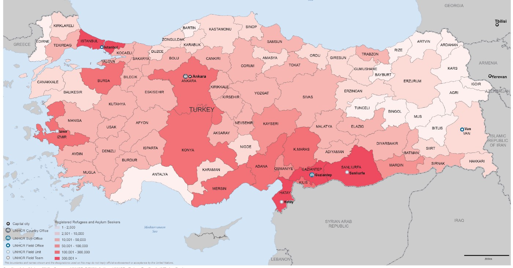

### AYS Daily Digest 13/06/2018 EU’s disturbing priorities

Updates from SAR operations /// Demonstration launched in Paris /// New evictions in Calais /// 2 of the Moria35 deported to Turkey /// Updates from Bihac and Sarajevo /// Education projects in Sofia

 \(photo by [Sea\-Watch](https://twitter.com/seawatchcrew/status/1006839584775434240) \)](assets/3539327eaa96/1*GucaSnI8J9YcqKbIJT5pnA.jpeg)

Ever saw your friends drowning next to you and being stuck on a ship, waiting for a solution and an assigned port of safety? That’s happening to 41 survivors of yesterday’s rescue, which left 12 dead\. They need a decision now\! [\#apriteiporti](https://twitter.com/hashtag/apriteiporti?src=hash) \(photo by [Sea\-Watch](https://twitter.com/seawatchcrew/status/1006839584775434240) \)
#### FEATURE \- EU’s disturbing priorities: Border Defence Budget

For the next long\-term EU budget 2021–2027, the Commission [proposes](http://europa.eu/rapid/press-release_IP-18-4106_en.htm?utm_source=ECRE+Newsletters&utm_campaign=5672765e50-EMAIL_CAMPAIGN_2018_06_13_11_22&utm_medium=email&utm_term=0_3ec9497afd-5672765e50-422318649) to almost triple funding for migration and border management to €34\.9 billion, as compared to €13 billion in the previous period\. 
The European Border and Coast Guard Agency will be further strengthened with a new standing corps of around 10,000 border guards\. 
A 51% increase is proposed for the budget for migration policy from the current €6\.9 billion to €10\.4 billion, compared to a 241% increase proposed for border management funding under the new Integrated Border Management Fund \(IBMF\) from the current €2\.7 billion \(2014–2020\) to €9\.3 billion\.
The budget appears to be geared towards fortifying the EU’s external borders and curbing migration as well as making it easier and faster to expel unsuccessful asylum seekers from the EU\. The budget will offer support to all member states by providing extra funding to member states facing high migratory pressure, including Greece and Italy\.
For a full breakdown of proposed budgets and activities please visit the [EU commission website](http://europa.eu/rapid/press-release_IP-18-4106_en.htm?utm_source=ECRE+Newsletters&utm_campaign=5672765e50-EMAIL_CAMPAIGN_2018_06_13_11_22&utm_medium=email&utm_term=0_3ec9497afd-5672765e50-422318649) \.

At a moment when several EU authorities are condemning the actions of the Italian government as inhumane and criminal, it is important to remember that the EU is complicit and supportive of aggressive border policies which will only continue to militarise border zones but will also endanger life by trapping people in unstable countries with dubious human rights records\.

SEA
#### **Updates from Aquarius**

After the decision of the Italian Interior Minister, far\-righter Matteo Salvini, to close Italian ports to the Aquarius, the vessel is currently on its way towards Valencia, Spain\.

On board are 51 Women, 41 men and 10 children\. The rest of the 629 rescued were transferred on Tuesday to two vessels belonging to the Italian Navy and Coast Guard, that will follow the Aquarius to Spain\. Their ETA is Saturday evening, but that depends on the weather conditions, which worsened throughout the night, with waves up to 4 metres & winds up to 35 knots\.

During the day the Aquarius received rather inadequate food supplies:

■■■■■■■■■■■■■■ 
> **[MSF Sea](https://twitter.com/MSF_Sea) @ Twitter Says:** 

> > Oranges, cereal bars and bread - this is what the #Aquarius has just received from the Italian coastguard as a food resupply. It’s a welcome delivery but the #MSF medical team are still concerned about nutritional needs being met over the 3 day journey. https://t.co/TeYDOVjbxU 

> **Tweeted at [2018-06-13 15:27:34](https://twitter.com/msf_sea/status/1006921023319674880).** 

■■■■■■■■■■■■■■ 

■■■■■■■■■■■■■■ 
> **[Óscar Corral](https://twitter.com/corralfoto) @ Twitter Says:** 

> > Foto. Las autoridades Italianas suministraron fruta entre otros víveres a #Los629delAquarius. De tres cajas de nectarinas, una acabó en el fondo del mar. https://t.co/1zuceiohJi 

> **Tweeted at [2018-06-13 17:03:01](https://twitter.com/corralfoto/status/1006945042953572354).** 

■■■■■■■■■■■■■■ 

> Italy has been toying with the lives of 629 people by denying them disembarkation at the closest safe port\. 

> This should not be a precedent, and cannot be considered a victory\. 

#### **937 people arrived in Catania**

 \)](assets/3539327eaa96/1*oyVHlNu8M_5fvcomQlBDvQ.jpeg)

Catania port \(photo by [Flavio di Giacomo](https://twitter.com/fladig) \)

People rescued from Italian coast guard vessel Diciotti arrived Wednesday in Catania\. As the boat is part of the Italian fleet, it was impossible for the new far\-right minister Salvini to deny access to the port\. Two dead bodies were disembarked as well\.

■■■■■■■■■■■■■■ 
> **[Marco Rotunno](https://twitter.com/MarcoRotunno) @ Twitter Says:** 

> > We’re in Catania where first families are landing from Italian coast guard vessel. Their stories of abuses and desperation show once again that saving lives at sea and providing smoothly port of safety where they can ask for protection are necessary and unquestionable. [twitter.com/unhcritalia/st…](https://twitter.com/unhcritalia/status/1006857011160641536) 

> **Tweeted at [2018-06-13 11:25:52](https://twitter.com/marcorotunno/status/1006860197254586368).** 

■■■■■■■■■■■■■■ 

#### **41 rescued waiting for a port to be assigned \[Updated\]**

At the time of writing 41 people and 12 dead bodies rescued by an US navy ship are still waiting to be assigned a safe port to disembark\.

■■■■■■■■■■■■■■ 
> **[Sea-Watch](https://twitter.com/seawatchcrew) @ Twitter Says:** 

> > 12 bodies &amp; 41 survivors of yesterday's rescue still on US Navy vessel, and yet no assigned port of safety. Since US Navy isn't part of civil rescue fleet, we hope, for the sake of the people, double standards will apply once more and the nearest port of safety can be entered. https://t.co/iZi55xdYQ5 

> **Tweeted at [2018-06-13 17:39:38](https://twitter.com/seawatchcrew/status/1006954257759825920).** 

■■■■■■■■■■■■■■ 

\[Update\] Media [report](http://www.repubblica.it/cronaca/2018/06/14/news/la_nave_usa_senza_celle_frigoriferi_alla_deriva_12_corpi-198956762/?ref=RHPPLF-BH-I0-C8-P1-S1.8-T1) that the USNS Trenton, the Navy ship involved in the rescue, had to jettison the 12 dead bodies, as the vessel has no storage facilities\. MRCC in Rome is still denying access to any Italian port, refusing to take responsibility for the rescue operation\.
#### **SAR updates from Western Mediterranean**

66 people were disembarked safely in Algeciras on Wednesday, while another 22 were being rescued off the coast of Tarifa\.

■■■■■■■■■■■■■■ 
> **[SALVAMENTO MARÍTIMO](https://twitter.com/salvamentogob) @ Twitter Says:** 

> > Finalmente, desembarcarán en la dársena de El Saladillo (Algeciras) las 66 personas rescatadas hoy de 4 pateras por la Guardamar Concepción Arenal.

Por otra parte, a las 11.30h el buque Luz de Mar rescató a 22 hombres y 1 mujer magrebíes, de una patera localizada 23mn W Tarifa https://t.co/OIr2HdIjHL 

> **Tweeted at [2018-06-13 09:42:51](https://twitter.com/salvamentogob/status/1006834271749857280).** 

■■■■■■■■■■■■■■ 

**3 years of rescue operations for Sea Watch**

 \)](assets/3539327eaa96/1*A37OZ657Zcmz3Vr9UGy64g.jpeg)

[3 years of Sea\-Watch \(photo by Sea\-Watch](https://twitter.com/seawatchcrew) \)

What was lost entirely in the rush of yesterday’s events:

> Three years and one day ago, Sea\-Watch reached Lampedusa to start its very first mission\. 

> \[…\] We never thought that three years later, instead of exchanging stories about the old days of missions in the Mediterranean, we would still have to be here\. And now with a political public sphere that leaves the people in need and isolates us or even tries to make our work more difficult by making us a pawn in the power struggles of governments\. 

> From day one we were convinced that every human life is priceless and protection of life is a duty for each and every one of us\. We still are\. 

> Help us move on: [https://sea\-watch\.org/spenden/](https://sea-watch.org/spenden/) 

Read the full statement [here](https://www.facebook.com/seawatchprojekt/) \.

**Donation needed for Sea\-Eye new Lifeboat**

From [Sea Eye](https://www.facebook.com/seaeyeorg/) :

> \#donationsSprint for “ Charlotti 4 ‘\. 

> in the 6th mission of Sea\-Eye in 2018, the lifeboat \(RIB\) ‘Charlotti 3’ was badly damaged\. 

> Today we ask you to donate for a very specific thing\. We want to launch ‘Charlotti 4’\. The more determined you act and donate, the better our SEEFUCHS can be supplemented by a strong lifeboat\. Please act now, donate and find out why our lifeboats are named CHARLOTTI\. 

> → [https://www\.betterplace\.org/de/fundraising\-events/31158](https://www.betterplace.org/de/fundraising-events/31158) 

TURKEY

UNHCR has published the [numbers](https://data2.unhcr.org/en/documents/download/64013) of registered refuges and asylum seekers in Turkey\.

The [Turkish coast guard report](https://www.facebook.com/cell122/posts/1951994981689580) s that they picked up one boat outside Altinova at 3:32 a\.m\., on its way towards east Lesvos carrying 43 people and another outside Kadirga Burnu, Ayvacik distrikt, at 5:30 a\.m\., on its way towards north Lesvos also carrying 43 people including one Turkish national\.

GREECE
#### Arrivals

Aegean Boat Report [inform](https://www.facebook.com/pg/AegeanBoatReport/posts/?ref=page_internal) s us that one more boat landed on Tuesday on Kastellorizo island\. The number of people is approximately 24, but this has not been confirmed\.
#### **Samos**

According to the [latest data published](https://www.facebook.com/AegeanBoatReport/photos/a.285312485325196.1073741828.285298881993223/365255780664199/?type=3&theater) on Samos, 143 people have arrived in the last week—mainly from Cameroon \(36%\), Iraq \(15%\) and Palestine \(13%\) \. Last year there were no arrivals in this time period\. There are currently approximately 2435 people on the move who are being held on Samos, mainly from Syria, Iraq and Afghanistan\. 22% of the people are women and 29% are children\.
#### Lesvos

2 of the Moria35 were deported to Turkey on Wednesday\.

■■■■■■■■■■■■■■ 
> **[FreetheMoria35](https://twitter.com/Freethemoria35) @ Twitter Says:** 

> > 2 from the #Moria35 were deported today to Turkey.
The lawyers had informed the authorities that the one was going to submit today an appeal for the rejection on his asylum claim, but this didnt prevent them from deporting him
#freethemoria35, #lesvos, #antireport 

> **Tweeted at [2018-06-13 12:15:02](https://twitter.com/freethemoria35/status/1006872573198635008).** 

■■■■■■■■■■■■■■ 

[Musaferat](http://musaferat.espivblogs.net/en) , a collective against the detention centres based in Lesvos, published an interesting analysis of the \#Moria35 campaign so far\. Read it [here](http://musaferat.espivblogs.net/en/2018/06/13/political_assessment_freethemoria35/) \.

[The petition](https://www.change.org/p/11788348/u/22870299) to free Amir Hampay, who is the brother of Arash Hampay—an activist and AYS contributor—is ongoing\. Two years in prison\-like conditions is too long, one day is too long, give him his freedom and let him join his brother\! Please act now\!
#### Athens

Refugee\.info has [published details](https://www.facebook.com/refugee.info/posts/1788392551220884) for the times the Athens Regional Asylum office is open this Sunday to issue the residence permits and travel documents which are ready\.
#### Athens Refugee Food Festival

The [event](https://www.facebook.com/events/2044984412425387/) will be held from June 19th to June 24th:

> Local restaurants in Athens open their kitchens to refugee chefs for a unique culinary experience\. Through set menus or carte blanche, the guest chefs will prepare their best culinary creations from their country of origin\. Discover a wide range of different global cuisines\! 

#### Northern Greece needs more volunteers

[Drop in the Ocean](https://www.facebook.com/drapenihavet/posts/2115002105183894?hc_location=ufi) is calling for more people to join them at the Nea Kavala camp as they try to accommodate new arrivals\. 7200 people have crossed the Evros river border this year \(January–May 2018\) \. The Nea Kavala camp has about 630 registered residents while over 200 people live in a nearby village and come to the camp for food and other necessary items\. Many refugees from other camps in the area are also coming to escape the poor living conditions\. As a result, four large tents have been set up to house 70 people each, these tents all have a shared toilet, showers and the possibility of cooking\.

[Refucomm](https://www.facebook.com/refucomm/posts/621545111530628?hc_location=ufi) has also reported on the situation and state that the new arrivals came primarily from Syria, Iraq and Afghanistan and included many families with children\.

> Faced with the unexpected influx, the overwhelmed police held hundreds in substandard police facilities until the people could be moved to the Fylakio RIC for the obligatory registration and identification\. People in need of protection must be able to undergo reception procedures, receive information and be ensured access to the asylum at the Fylakio RIC, a closed facility with a capacity of 240, with unaccompanied children accounting for almost half\. The RIC struggles to conduct the procedures in a timely manner because it lacks core services such as interpretation, medical and pyscho\-social assistance\. 

BULGARIA

Refugee\.info have [published information](https://www.facebook.com/refugee.info/posts/1788538247872981) on the new pre\-school programme in Sofia\.

> Apply now: Educational program for preschool\-aged children in Sofia — Scroll down for English \-> [https://goo\.gl/6eBQq1](https://goo.gl/6eBQq1) 

> Help your child prepare and integrate into Bulgarian kindergartens and schools through music and arts\. Learn more about how to apply and what is expected of you here \-> [https://goo\.gl/dAV4kg](https://goo.gl/dAV4kg) 

BOSNIA AND HERZEGOVINA
#### Updates from Bihać

600 people are currently being fed by the Red Cross of the city of Bihać

Police in Sarajevo are continuing to remove people from parks\. Asked by citizens and volunteers why, they still have not offered a clear answer\. From a conversation with the head of police, AYS volunteers were told that he considers that the people who are in parks are violating public law and order, that they are making the parks look dirty and messy\. None of this is true or in compliance with the existing laws\. Several hundreds of people are currently sleeping on the streets, including families, due to lack of accommodation in Bosnia\. Food and help is provided by volunteers and the local population, while the state and big NGOs are ignoring their obligations\. Over 6,200 people have come to Bosnia from January\. UNHCR does not consider this situation an emergency and is still not providing adequate support\.

FRANCE
#### Police brutality during Calais evictions

After three forced evictions in Calais on Tuesday, a further three took place at other locations on Wednesday\. Another 200\+ people have been left without shelter, and their belongings have been confiscated\. 
One volunteer, acting as a legal observer, was physically assaulted, as a CRS officer grabbed her by the throat from behind and threw her to the ground, and another, moments later threw her phone to the ground and kicked it\.

Here is a video of the attack\.

#### Open the Ports\!

A peaceful [demonstration](https://www.facebook.com/events/293274594545623/) will be held at Place Garibaldi in Nice at 6 p\.m\. on Friday 15 June, to support the Aquarius and all the NGOs involved in sea rescue over the past years, who have saved thousands of lives\. As well as solidarity with the rescue efforts, the plan is to protest the political decisions which have resulted in sending the ship to Valencia even though French ports are closer\.

SWEDEN

FARR has produced a [questions and answers](https://farr.se/sv/lag-a-praxis/aktuellt/1588-vanliga-fragor-om-den-nya-gymnasielagen) sheet to help young people understand how the [new law](https://www.thelocal.se/20180608/swedish-parliament-bill-minor-asylum-seekers-school) for high school students will affect them\. From 1 July, young people who initially applied for asylum no later than 24 November 2015 can be considered for temporary residence, in order to complete high school\.

> **We strive to echo correct news from the ground through collaboration and fairness\.** 

> **Every effort has been made to credit organizations and individuals with regard to the supply of information, video, and photo material \(in cases where the source wanted to be accredited\) \. Please notify us regarding corrections\.** 

> **If there’s anything you want to share or comment, contact us through Facebook or write to: areyousyrious@gmail\.com** 

_Converted [Medium Post](https://medium.com/are-you-syrious/ays-daily-digest-13-06-2018-eus-disturbing-priorities-3539327eaa96) by [ZMediumToMarkdown](https://github.com/ZhgChgLi/ZMediumToMarkdown)._
