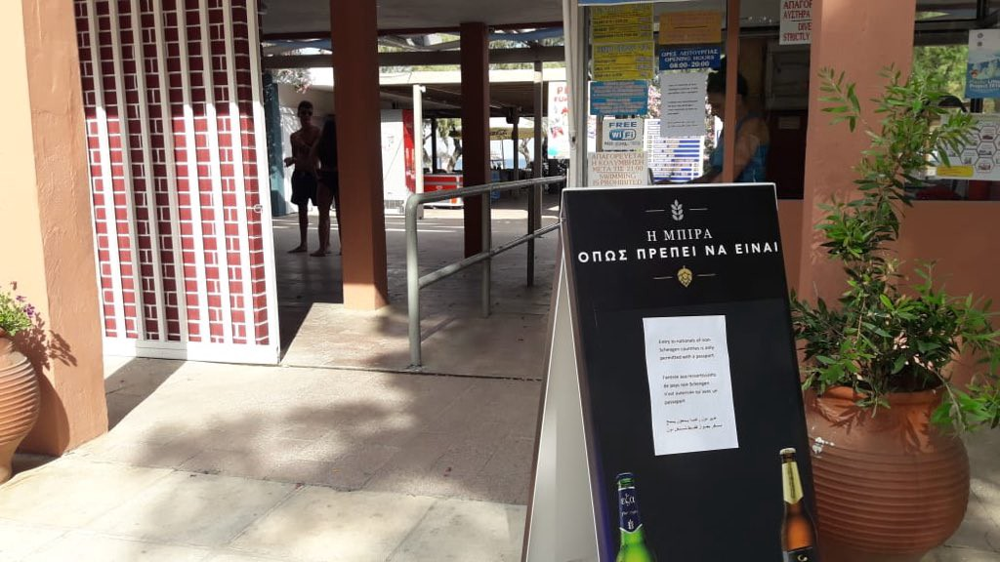
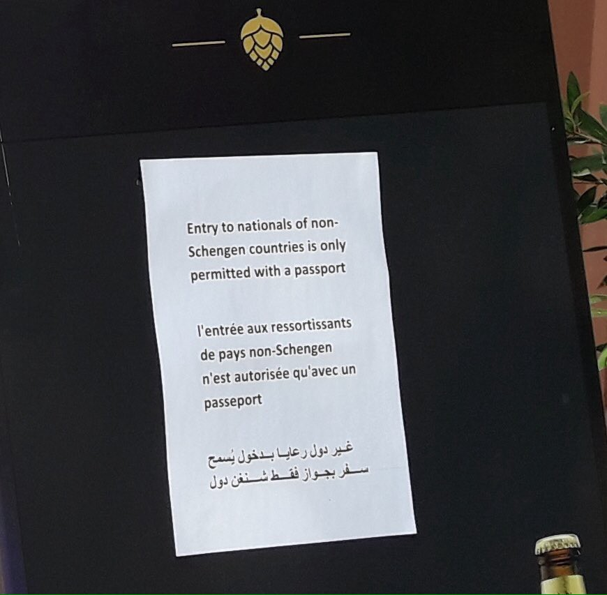
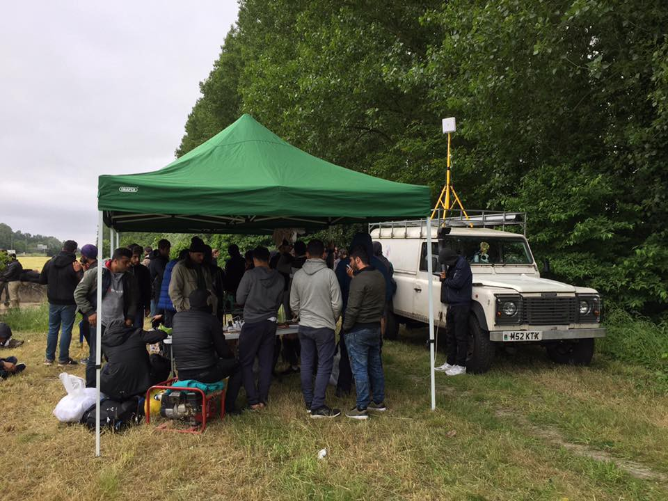
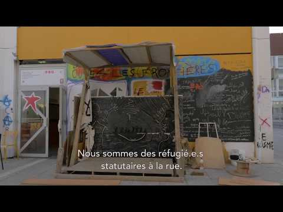

### AYS Daily Digest 14/06/18: Aquarius changes course due to bad weather

_US Navy ship seeks to disembark refugees / Legal Centre Lesbos reports on rights violations / Paris University 8 occupation could end this Sunday / And more news…_

### FEATURE: Aquarius’ troubles signals larger problem for rescue boats in Mediterranean

Photo by Fotomovimiento

SOS Méditerranée says its _Aquarius_ ship has had to change course due to bad weather, adding “people on board are exhausted, shocked, and sea sick\.” Italian government sources, however, told [_Ansa_](http://www.ansa.it/english/news/2018/06/14/aquarius-route-changed-sos-mediterranee-4_e7c1e382-3d5a-4d6f-a4fc-2f860178646d.html) that the ship will dock in Spain as planned, ruling out suggestions that it would land in Italy\. [_La Repubblica_](http://www.repubblica.it/politica/2018/06/14/news/aquarius_telefonata_tra_conte_e_macron_parigi_toni_cordiali_speriamo_confermi_visita_-198966110/?ref=RHPPLF-BH-I0-C8-P4-S1.8-T1) quotes Interior Minister Salvini saying the ship “cannot decide where to start and finish its cruise\.” [_Le Point_](http://www.lepoint.fr/societe/aquarius-la-france-prete-a-accueillir-des-migrants-repondant-aux-criteres-du-droit-d-asile-14-06-2018-2227290_23.php) meanwhile reports that the French Ministry of Foreign Affairs has suggested it would be willing to accept some people from the _Aquarius_ after their demand for asylum is examined in Spain\. Sea\-Watch says the German government has urged Italy to fulfill its humanitarian responsibility, but remained silent over the question of how it would supports NGOs\. It argues that current events reflect the failure of European migration policy: “We finally need a pan\-European solution, safe entry routes and a humane approach on how to deal with refugees\.”

MSF is providing medical care to over 20 patients with serious chemical burns, caused by prolonged exposure to diesel and sea water\. Journalist Sara Alonso Esparza, currently onboard the ship, says two people died in last Saturday’s shipwreck\. This was noticed after personal interviews and a new recount and despite an intense search operation conducted with the support of Italian helicopters\.

A US navy ship that rescued 40 people is still at sea with them as Italy refuses to let them dock\. The ship had previously asked Sea\-Watch to transfer them to their boat\. The rescue organization, however, said it would accept them only if Italy guarantees that it will be allowed to disembark them\. The US boat _Trenton_ has asked Italy to assign a port, but the country has so far refused to do so, leaving the Trenton and the 40 refugees in limbo\.

This sends the terrible signal to all boats in the Mediterranean: that they won’t be able to count on swift disembarkation if they rescue people at sea\. It is also terrible for the refugees onboard, traumatized by what they have gone through in Libya as well as during their shipwreck and who are in need of medical and psychological assistance\.
### GREECE
#### Arrivals

One boat with around 41 people arrived on Samos and one boat with 36 people arrived on Chios on Wednesday\.

37 refugees, mainly women and children, arrived at Maroneia beach in the Rodopi area on Thursday morning, according to [ANMA](https://www.amna.gr/macedonia/article/266911/Trianta-epta-prosfuges-egkateleipse-diakinitis-se-paralia-tis-Maroneias) \. Since there is no port authority in Maroneia, the refugees were transported to the port of Alexandroupolis to be registered\. They will be transferred to the reception and identification center at Evros for identification\.

[Aegean Boat Report](https://www.facebook.com/AegeanBoatReport/) says two boats were stopped by the Turkish Coast Guard: one with 33 people on its way to Farmakonisi and another with 41 people going to Chios\. One boat with 43 people was picked up by the Greek coastguard off the coast of northern Lesvos on Thursday night\.
#### Rights violations on Lesvos

[**The Legal Centre Lesbos’ latest report**](http://www.legalcentrelesbos.org/2018/06/14/report-on-rights-violations-and-resistance/) **says Moria Camp is now at three times its capacity, holding approximately 7000 individuals:**

> “Procedures are now so delayed that even individuals who are recognized as vulnerable \(…\) are being scheduled for their interviews nearly a year after their arrival\. This means that they are prohibited from leaving the island of Lesvos, and are denied freedom of movement during this entire time” 

The containment of asylum seekers on Greek islands has very serious consequences\. An eleven year old child with a serious, undiagnosed digestive condition for example was referred for testing and treatment in Athens\. The Regional Asylum Office however has denied the request to travel to the mainland without an appointment in the Athens hospital

> “Her family is now in a constant state of fear that given her critical condition, their daughter will be unable to receive emergency medical care when needed, given the lack of testing and treatment for her on the island” 

Regarding the Moria 35, the Legal Centre Lesbos says that **“there has been a rampant violation of their rights at every step of their procedures\.”** Two of the Moria 35 were deported to Turkey on the morning of June 13th\. One of them was deported despite his expressed desire to appeal the rejection of his asylum claim\. Other individuals were unable to appeal because of their detention\.

**The Boat Refugee Foundation says the problem of overcrowding in Moria also leads to psychological trauma, panic attacks and depression** \. It says its teams are doing their best to treat the most acute cases\. Many other patients, however, continue to wait for months until they can be helped by a psychologist\.
#### Discrimination at the beach

Non\-Schengen Zone countries’ nationals are being denied access to Mytilini beach according to this flyer, effectively discriminating against refugees\.

Photos by Legal Centre Lesbos
#### Asylum office in Athens opened on Sunday to issue residence permits and travel documents

[The Mobile Info Team for refugees in Greece](https://www.facebook.com/mobileinfoteam/) says that on June 17th, the Regional Asylum Office of Athens will be opened to issue residence permits and travel documents that are ready for delivery to Arabic and Farsi speaking beneficiaries of international protection\. Please only go there if your case number is on the lists for ready residence permits and travel documents and if the Regional Asylum Office of Athens is responsible for your application\. More information is available on the Mobile Info Team’s Facebook page [here](http://www.facebook.com/mobileinfoteam/) \.
### FRANCE
#### News from Dunkirk

Photo by Mobile Refugee Support

After the eviction of 336 refugees from a camp in Dunkirk on Monday, a new location has been agreed with the Mayor’s office according to [Mobile Refugee Support](https://www.facebook.com/MobileRefugeeSupport/) \. 259 single adults were oriented towards accommodation centres while 77 families were brought to “adapted structures” according to French media\. Refugees started to converge towards this camp after the eviction of the Dunkirk gym on May 24th\.
#### University 8 occupation could end this Sunday

The occupation of Building A of the University of Paris 8 is under threat\. 150 refugees were able to escape the bitter Paris cold and the occupation also continued as a protest against the racist and stringent refugee and migration policies of France and Europe as a whole\. Negotiations between the university’s presidency and the French government have stopped\. The presidency has now said that the people have until June 17th to leave the university or be forcibly evicted\. The refugees [ask](https://lundi.am/Depuis-plus-de-4-mois-l-Universite-Paris-8-Saint-Denis-est-occupee-par-des) for papers, decent housing, French classes and the ability to continue their studies, an improvement of the situation for unaccompanied minors, and the end of deportations\.

### ITALY
#### Another case of exploitation of field workers

Another case of exploitation of field workers has been discovered in Sicily\. [Rai News](http://www.rainews.it/dl/rainews/articoli/Caporalato-immigrati-a-pane-e-acqua-due-arresti-in-Sicilia-sequestrati-tre-terreni-agricoli-55be8d84-3ad3-436d-94ef-3cdd26e9f420.html) says people were kept to survive on water and bread for €3 an hour\. Migrants started their shifts at 5am and often worked for 12 hours a day\. They had to call the field owners “padrone” which means “master, boss” and were given names which diminished their dignity, for example “giovedì” \(Thursday\), echoing Robinson Crusoe’s “Friday”\.

**We strive to echo correct news from the ground through collaboration and fairness\.**

**Every effort has been made to credit organizations and individuals with regard to the supply of information, video, and photo material \(in cases where the source wanted to be accredited\) \. Please notify us regarding corrections\.**

**If there’s anything you want to share or comment, contact us through Facebook or write to: [areyousyrious@gmail\.com](mailto:areyousyrious@gmail.com)**

_Converted [Medium Post](https://medium.com/are-you-syrious/ays-daily-digest-14-06-18-aquarius-changes-course-due-to-bad-weather-a03b80c644db) by [ZMediumToMarkdown](https://github.com/ZhgChgLi/ZMediumToMarkdown)._
