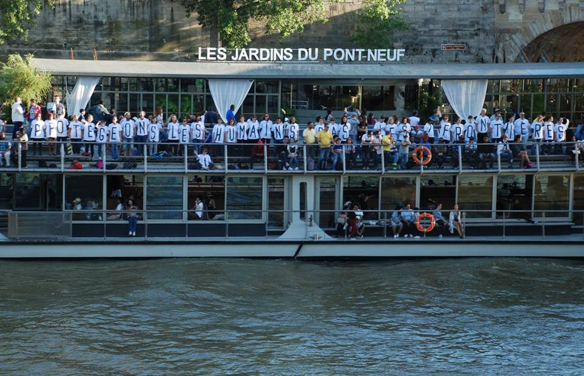
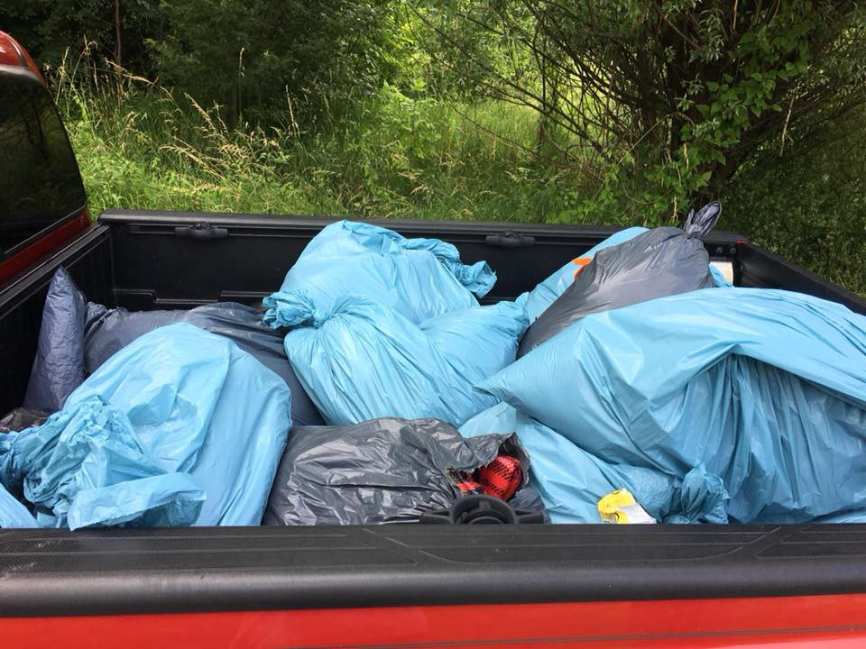

### AYS DAILY DIGEST 16/06/2018: Protect People, Not Borders

_Another day of struggle for Aquarius who is due to dock on Sunday morning in Valencia//New arrivals from sea to Spain//NGOs criminalised and threatened by fascist Italian Interior Ministry//The Kempsons must leave their house of 17 years//New arrivals in Chios//TCG prevents boats to reach Europe//Montenegro to stop putting up barbed wire at its borders//Blankets needed in Sarajevo//Horrible intimidatory act in Sacile, Italy, in front of refugee shelter//Oxfam’s report to describe details of illegal push backs of minors at the French\-Italian border//Solidarity actions in Paris//News from the UK, Belgium, Austria\. \._

Paris\. Credit: Solidaritè Migrants Wilson

**SEA**

_Alborán_

SM rescued [53 people](https://twitter.com/salvamentogob/status/1008021970410266625) off the coast of Alboran, making the total number of people rescued between today and yesterday to 986 people \(Alboran: 479 of 10 boats; channel: 507 people of 59 boats, 4 deaths\)

■■■■■■■■■■■■■■ 
> **[SALVAMENTO MARÍTIMO](https://twitter.com/salvamentogob) @ Twitter Says:** 

> > #Pateras Estrecho y Mar de Alborán. TOTAL de  rescatados entre el día de ayer y hoy: 986 personas.   
Estrecho: 507 rescatados de 59 pateras, 4 fallecidos  
Alborán: 479 rescatados de 10 pateras 

> **Tweeted at [2018-06-16 17:48:31](https://twitter.com/salvamentogob/status/1008043657608552449).** 

■■■■■■■■■■■■■■ 

_\#Aquarius_

Testimony from a person on board of the vessel which will land in the morning of Sunday in Valencia, escorted and supported by Open Arms as well — “ _I wonder why Italy rejected us, there must be a reason_ ”\.

“ _I’ve been in [\#Libya](https://www.facebook.com/hashtag/libya?hc_location=ufi) since 2016\. It took me 2 weeks to cross desert from Sierra Leone to Agadez to Sabha\. It was not an easy journey I saw many men fall down, people died in front of me everyday\. \[…\] “In \#Libya they catch people and ask for money, beat you, torture you\. I was sold in Bani Walid and cried for death but death did not come\. I saw people shot in front of me\. I had to carry bodies to the desert\. \[…\] Anywhere they see blacks together in \#Libya they catch you\. They tell us to work\. They use blacks like donkeys, like slaves…” “The Italian Coastguard rescued us\. We were all crying as we had spent 20 hrs at sea and they calmed us down\. I wonder why Italy rejected us, there must be a reason\. Whatever happened is happening for a reason\. God has a better plan for us\. Italy rejected us but God never will\. \._ ”

■■■■■■■■■■■■■■ 
> **[MSF Sea](https://twitter.com/MSF_Sea) @ Twitter Says:** 

> > "I've been in #Libya since 2016. It took me 2 weeks to cross desert from Sierra Leone to Agadez to Sabha. It was not an easy journey I saw many men fall down, people died in front of me everyday. To pass through you need strength to survive, if you don't you die" Moses #Aquarius https://t.co/P6B56YMTO6 

> **Tweeted at [2018-06-16 12:51:53](https://twitter.com/msf_sea/status/1007969008040271872).** 

■■■■■■■■■■■■■■ 

Mission Lifeline and Seefuchs, two Dutch flagged vessels operating in the Mediterranean, [have been threatened by the Italian Interior Ministry](https://www.timesofmalta.com/mobile/articles/view/20180616/world/italy-demands-netherlands-recall-ngo-migrant-rescue-ships.681929?utm_source=tom&utm_campaign=top5&utm_medium=widget) , together with all NGOs carrying on SAR operations, to stop their docking at Italian ports “in order to halt the business of illegal migration”\. Salvini also said that just Italian ships \(Navy\) could have the right to disembark in Italian territory\.

**TURKEY**

Three boats, carrying a total of 111 people, were stopped by the TCG yesterday and [prevented from reaching Europe](https://www.facebook.com/AegeanBoatReport/posts/367993030390474) \.

**GREECE**

_Arrivals_

_Islands_

In support of and in solidarity with the work and efforts the Kempsons have been provided for years in Lesvos\.

_Mainland_

[Strikes of transport workers](http://www.ekathimerini.com/229736/article/ekathimerini/news/bus-services-to-be-disrupted-on-tuesday-and-thursday) are planned for Tuesday and Thursday\.

Buses will run on a restricted service from 9 AM to 9 PM on Tuesday, the same will happen from 11 AM to 5 PM on Thursday\.

**MONTENEGRO**

Governmental sources stated that the country’s authorities refused to put up barbed wire at the border, stating, moreover, that they are ready to accept more people and to build reception centres, if needed\.

The same sources claim that police agents will be equipped with what they need to safe guard the border properly\.

The number of people who entered the country increased from 96 in February to reach over 590 in May\.

**BOSNIA**

BIG NEED OF BLANKETS IN SARAJEVO\!

AYS is collaborating on the ground with local and international volunteers in Sarajevo \(the situation is well described in [yesterday’s digest](ays-daily-digest-15-06-2018-bosnia-the-end-of-the-road-df98297b4594) \) \.

“ _After distributing more than 120 blankets the other night when it was cold, rainy and a lot of new arrivals, people yesterday had to share blankets\. We’re basically running out of blankets as we speak and have very limited funding for buying new ones\. It is not pleasant to have to tell people that they have to spend the evening outdoors, without something to keep them warm during the night\. As one of the small and independent team of volunteers working in Sarajevo, help is urgently needed to buy more blankets but also pay for dry cleaning those used and left behind\! Today we went searching for old blankets in the areas people are sleeping in order to clean them and re\-distribute, but it is not nearly enough and also an expense that needs to be covered\._

_Please help us and people on the streets by donating, even the smallest amount makes big difference\. Every penny goes straight to blankets:_

_PayPal_ : [https://www\.paypal\.me/isabelduich](https://l.facebook.com/l.php?u=https%3A%2F%2Fwww.paypal.me%2Fisabelduich&h=AT24Hk8cqP30i6K3aRHqcPTTdX_IPH8ppRSgjGnAehsf476cEJeigzWgWkxXQeV98w5t-TdqZxxRpF36MbaNg6-TtVJZ8nUS0KjSHY3NDjh4XAs8qyEhydlB3eocmGC4_xZxYW3JP2LwUVRvEaOkRiALkNo) ”

Several bags filled with dirty blankets for washing and redistributing\. Credit: AYS

**AUSTRIA**

16 women and men, all torture survivors, from Syria, filed in a [criminal complaint](https://www.ecchr.eu/en/case/the-path-to-justice-leads-through-europe-eg-austria/) with the prosecutor of Vienna to start investigations into the systematic torture system under the regime of Assad\.

“ _The allegations of the criminal complaint include torture as a crime against humanity and as a war crime committed by military intelligence, air force intelligence and general intelligence\. The torture and other crimes described in the complaint — including murder, extermination, serious bodily harm and deprivation of liberty — were committed between February 2011 and January 2017 in 13 detention centers in Damascus, Daraa, Hama and Aleppo_ ”\.

**ITALY**

_Sacile_ , Pordenone, a small town in Northeastern Italy: 19000 inhabitants, 1 reception centre hosting 8 asylum seekers\.

In the midst of Eid celebrations, this morning a pig’s head was found outside the centre’s door\.

Still no clue about the perpetrators\.

What is sure is that in Friuli Venezia Giulia \(the region where Sacile is\), regional government headed by Fedriga \(Northern League, same right wing party lead by Salvini\) cut 1 milion of funding for refugee reception and destined 50,000€ for repatriations\.

_Gorizia_

The [new dorm Faidutti](http://m.ilpiccolo.gelocal.it/trieste/cronaca/2018/06/15/news/nuovi-posti-al-dormitorio-faidutti-1.16967740) , managed by the local Caritas, will open its doors to host “a certain number” of asylum seekers who, otherwise, will sleep rough\. Since the closure of the Caritas office after the end of the so called “emergenza freddo” \(cold emergency\), new arrivals have been sleeping outside the Cappuccini Church where they usually get lunch and also dinner thanks to the work of volunteers\.

_Rome_

Demo to remember Soumaila Sacko, the union officer shot dead near Rosarno \(Calabria\) at the beginning of the month\.

The protestors demanded equal social and labour rights\.

**FRANCE**

More and more testimonies from border police violence and disturbance actions are coming from France daily\.

Not only they [destroyed tents, sleeping bags and other personal belongings](https://www.facebook.com/care4calais/photos/a.1047087828657507.1073741832.1046117708754519/1955897611109853/?type=3&theater) \(deliberately choosing to do it on Eid\), financed by the British government, but they also exercise such violent powers on minors\.

A recent report by Oxfam, operating in Ventimiglia since August 2017, has described not only the illegal push backs of minors happening at the border, with border police falsifying birth dates of unaccompanied minors, but also the unbelievable details under which this operations happen: migrants as young as 12 were detained in small cells without food nor water, their shoes’ soles were cut and mobile SIM cards stolen, making it impossible not only to contact their families, but also to reach out for help of volunteers and trusted people\.

Monitoring actions have been carried out by Italian NGOs \(Intersos, Oxfam, ASGI etc\. \) and French ones \(Anafè\) in two main actions in February and March 2018, as [AYS reported 2 months ago](ays-special-the-sea-is-raging-today-23b571d918f0) , leading to the opening of court cases at the Court of Nice, where the judge ruled that the authorities had illegally detained and sent back 20 minors\.

It is illegal to send back minors if they requested asylum and/or if they are eligible for family reunification \(Italian bureaucracy in this sense is super slow and leaves the children in dangerous situations\) \.

‘ _This morning I have tried to cross the border\. There were two of us\. The police pushed us off the train; they shoved us and yelled at us; then they pushed us in a van in the railway station car park\. We were given a document \[refus d’entrée, refusal of entry\] in the van and we were put on another train going back to Italy, without any explanation,_ ’ said Michael, who is 15 years old and from Darfur, Sudan\.

Sometimes, authorities are not even that “kind” and force minors to walk all the way back to Italy\.

Read the full report [here](https://reliefweb.int/sites/reliefweb.int/files/resources/bp-nowhere-but-out-refugees-migrants-ventimiglia-150618-en.pdf) \.

_Paris_

Police intimidating volunteers and refugees during breakfast distribution this morning, when about 200 people gathered to share a tea and a smile\.

[Solidarity action with Aquarius](https://www.facebook.com/events/631729380517457/) happening on Sunday at 3 PM in Paris

[Solidarity action with Paris 8](https://www.facebook.com/ExileesOccupP8/photos/a.1943636545954741.1073741828.1943620965956299/2020042401647488/?type=3&notif_id=1529182551745686&notif_t=notify_me_page&ref=notif&hc_location=ufi) : all the people wishing to act in solidarity with the occupied building of the university, can go and sleep there on Sunday night in order to be present at the evacuation, call the media, mobilise people\.

At 6 PM on Sunday there will be an organisational meeting\.

**BELGIUM**

The Secretary of State for Asylum and Migration, Theo Francken, [has declared](http://www.lesoir.be/163027/article/2018-06-16/theo-francken-souhaite-un-arret-total-de-la-migration-illegale-video) that people who try to enter illegally \(by sea or land\) to Belgium should automatically lose the right to apply for asylum — his idea is to transfer to the country only “real refugees” to be able to come to Europe through the UNHCR relocation program, where people are identified in camps in their countries of origin \(or neighbouring country\) and then transferred\. He claims that “ _we can’t turn our eyes, and our hearts to human misery_ ” but says “ _the important thing is to have more real refugees coming, not Nigerians_ ”\.

**UK**

**We strive to echo correct news from the ground through collaboration and fairness\.**

**Every effort has been made to credit organizations and individuals with regard to the supply of information, video, and photo material \(in cases where the source wanted to be accredited\) \. Please notify us regarding corrections\.**

**If there’s anything you want to share or comment, contact us through Facebook or write to: [areyousyrious@gmail\.com](mailto:areyousyrious@gmail.com)**

_Converted [Medium Post](https://medium.com/are-you-syrious/ays-daily-digest-16-06-2018-protect-people-not-borders-1b8162f8c2d) by [ZMediumToMarkdown](https://github.com/ZhgChgLi/ZMediumToMarkdown)._
