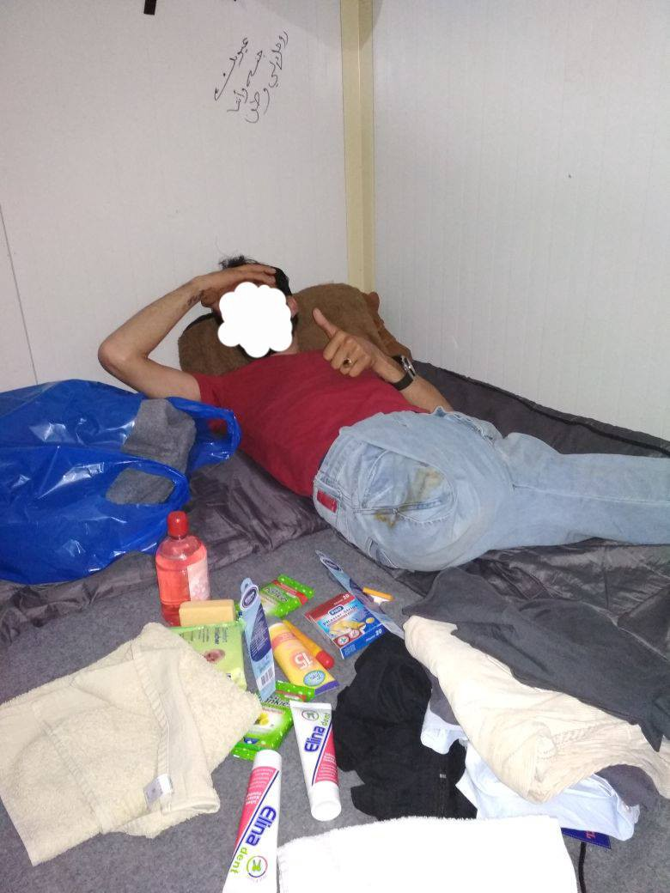
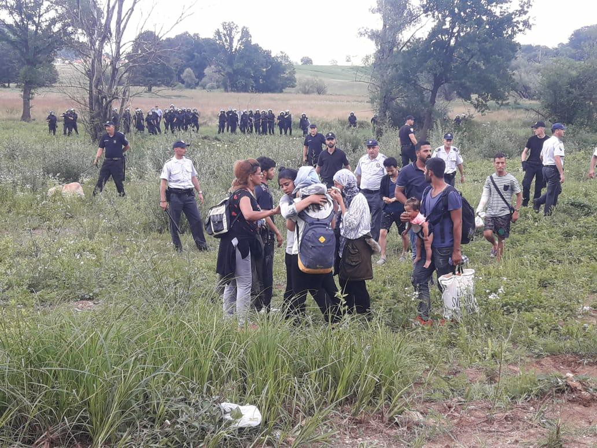
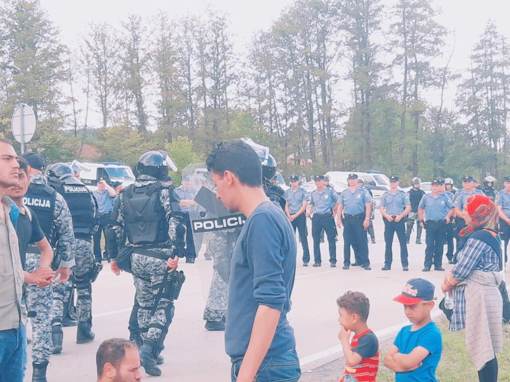

### AYS Daily Digest 18/6/18: Children will always pay the price
#### A 4\-year old dies in a camp in Greece / US — Families separated, worrying trend / Refugee protest at the Bosnian\-Croatian border, situation worsens / Croatia to build new facilities in rural isolated area for accommodating families arriving from Turkey, MoI says / France — 15 organisations call for senators to put a definitive end to the administration detention of minors / more news

Border crossing between Bosnia and Herzegovina on the one hand and Croatia on the other: People have been forcibly “discouraged” from crossing the border for months now and on Monday they protested by gathering at the border area with the intention of crossing it, as well as pointing to the dreadful conditions and no perspective for obtaining international protection in Bosnia and Herzegovina \(Featured photo: No Name Kitchen Velika Kladuša\)
#### FEATURE
### Families Separated, Establishing Troubling Trend

As is being covered extensively in the US media, due to a recent “closing” of so\-called “loopholes” in US immigration law, families are being torn apart, and people being kept in glorified dog pens at the US border\.

Although the US has long had a hostile approach towards asylum seekers, particularly at their southern border, the enforcement of the so\-called “zero tolerance policy” has effectively criminalized those attempting to apply for asylum\. Previously, individuals entered at a port of entry and subsequently applied for asylum\. Now, under the new policy, these applicants are being charged with illegal entry to the United States, which is treated as a serious offence, thus enabling the person to be taken to detention\.

> The separation of minors from their parents \(who are being taken to criminal detention facilities\) is the most abhorrent and heart\-rending face of this\. 

Many news outlets have rightfully termed the chain\-link pens that minors are being detained in \(with no knowledge of where their parents are or of any reassurance that they will be reunited\) as cages\.

US Border Security was quoted with using the term “cages” by one news outlet, stating that the detention facilities are “uncomfortable”: “even though they are cages, they are not being treated like animals\.”

The Trump Administration has shifted the blame to the Democrats \(who are a minority in both the house and the senate of the US and therefore do not have significant blocking power\) for not “closing the loopholes in the law” — namely the process of requesting asylum without having prior clearance to enter into a country\. In addition to the horrifying conditions, this pressure to bar individuals from claiming asylum as they would be barred entry is in contravention to basic common sense on the right to claim asylum\.

Although the precedent for keeping people in inhumane facilities and the enforcement of US immigration law is not novel behaviour from the Trump administration, this new “zero tolerance policy” could provide a model that would be eagerly endorsed by many xenophobic governments around the world, emboldening them to enforce similar acts that threaten the respect of non\-refoulement and the right to claim asylum\. There is \(albeit irregularly upheld\) a precedent in many countries that so long as a person claims asylum, even if they are found in a territory after having crossed a border irregularly, their request must be procesed and they are not to be instantly treated as a criminal\.

> However, this move further legitimizes attempts to criminalize a person for simply existing in the wrong place\. 

#### GREECE
### A child death in Greece

A 4\-year\-old girl from Iraq tragically died in the refugee camp of Thiva in Greece\.
Under unclear conditions, the girl fell inside the waste water collector and died\. [Reportedly](http://www.efsyn.gr/arthro/tragikos-thanatos-4hronis-ston-kataylismo-tis-thivas) , her parents and other residents in the camp have been looking for the girl since Monday night\. During the search, the body was found in the cesspool, in a fenced area inside the camp\. Her parents refused to deliver the child’s body to the authorities for an autopsy to determine the exact cause of death\.
### Chios

### Lesvos
### Around 50 arrests planned for those involved in the April attacks

On the night of April 23, groups of extreme right, Golden Dawn members and hooligans attacked Afghan refugees who protested in Sapphous Square — over nine arrests were initially announced — the investigations have continued, with the result that the ground has now been prepared for arrests that may approach or exceed the number of fifty\.
However, up to now there are 37 people accused of a number of offenses, most characteristic of gang membership\. Find more information on the case [here](http://www.efsyn.gr/arthro/erhontai-syllipseis-gia-fasistiko-pogkrom-sti-mytilini) \.

[The Hope Project](https://www.facebook.com/HopeProjectKempsons/) raises awareness and funds for those in particular need in the midst of the difficult situation for those stuck on Lesvos:

> This is Mohamed from Syria 
 

> He is here in moria for one month now in an isobox with his family\. As you can see he has lost his leg and finds it extremely hard to get around\.
 

> His story is not unique sadly, so many people arrive here bearing the scars of conflict both physical and mental\.
 

> What awaits these people in the future?
 

> We were able to help the family with supplies and one of our volunteers kindly helped them back to the camp\. We also managed to supply a set of crutches so he is able to get around inside his isobox 
 

> We cannot do this alone
 

> [\#TogetherWeAreStronger](https://www.facebook.com/hashtag/togetherwearestronger?source=feed_text) 

> Donations;
 

> [https://mydonate\.bt\.com/fundraisers/thehopeproject](https://l.facebook.com/l.php?u=https%3A%2F%2Fmydonate.bt.com%2Ffundraisers%2Fthehopeproject&h=AT0l-gNEeAbr6NvojMZMGRgUtkio8dIqFjqlKFkNzs5uAM3j2bQ0zLaSdf0y_qwEWTFYUHPtEqyKr_awkQ0e8s7gCLvHwFc-nmhuXtd-qRM4w5YJkw-VPFxBWZcPu_LovaJnQ4C9-TxGqppo1xkM_OY) 

See their page for more info and the list of current needs\.

 for Muhamed](assets/1bdc30efe126/1*qvZ0J2dllb_OMCfCmgQqqg.jpeg)

[The Hope Project](https://www.facebook.com/HopeProjectKempsons/) for Muhamed
### Athens

Public transport information:

On Tuesday, June 19th 2018, buses will operate only between 9:00 a\.m\. and 9:00 p\.m
During the second work stoppage on Thursday, June 21st, no buses will operate between 11:00 a\.m\. and 5:00 p\.m\.
The work stoppages will affect also the Express Bus to/from Athens Airport\. Workers will stage a protest rally on Thursday\.
The other public transport means are expected to operate as usually\.
#### BULGARIA

[Refugee\.Info](https://www.facebook.com/refugee.info/?hc_ref=ARQWoeGLc_bg9xa5-dCWHR4dee5Kgn9FdxjHzXWJNKRr0tTlBJ6b-csVDsOdbBT7i4w&fref=nf&hc_location=group) team shares the news on what to expect if you are returned to Bulgaria from another EU member state: [goo\.gl/6FJT1n](https://goo.gl/6FJT1n) 
شما می‌توانید در هر یک از این موقعیت‌ها قرار بگیرید\.

در مورد حقوق‌تان و اینکه در مرحله بعد چه کاری می‌توانید انجام دهید از اینجا بیشتر بخوانید
#### SERBIA

Volunteers’ Centre of Vojvodina is organizing an event aimed at gathering local community of Novi Sad with young refugees and activists working for them on the 23rd June\.

#### BOSNIA AND HERZEGOVINA
### If it looks like Idomeni, it’s being treated like Idomeni, it’s developing like Idomeni,…\. ?

This is what many working or living in the area worry and wonder about — is this “bottleneck situation” developing to become another complicated issue like Idomeni was at the time?

The people staying in makeshift camps and the so called centre Trnovi in Velika Kladuša walked towards the border on Monday, protested and stayed there during the day, but were returned to the camp afterwards and, reportedly, the camp is now being guarded by the police forces\.

Photo credit: Paulo, independent volunteer

The representatives of different institutions and citizens initiatives of the city of Velika Kladuša will have a special meeting on Tuesday at 11h, dedicated to finding a solution to the situation that escalated in their area\. The state authorities are still ignoring the need for a sustainable solution in terms of accommodation, sufficient food and medical care, and ultimately, an international protection system\.

Photo credit: Paulo, independent volunteer

Several media teams have in past days filmed stories and testimonies from the people in the area, but the media were reportedly not allowed to be in the very spot of the protest due to the fact that the border area is not supposed to be filmed, so the selective law obeying criteria still works, here too\.

See our previous stories on Bosnia and Herzegovina and read the upcoming special on the situation in Bihać\.
#### CROATIA

On the occasion of the 25th anniversary of the Jesuit Refugee Service in Croatia, a conference was held in Zagreb, with Croatian JRS host welcoming the head of the [Migrants & Refugees Section](https://www.facebook.com/MandRSection/) Michael Czerny, head of the Croatian UNHCR Giuseppe DiCaro and Terezija Gras, State Secretary of the Croatian Ministry of Interior\.

Answering the question that demanded a reaction to the recent happenings at the Croatian border \(you can read about the police violence, unfortunately, in many of our specials and news digests\), Ms\. Gras said: “We have the right to protect ourselves from those who try to ‘play out’ our institutions”\.

It seems that Croatia has called for its neighbor countries to become eligible for accommodating and providing international protection more than happens to be the case now\. In response to this, there will be a meeting held in Bruxelles on June 19, where the European Commission will talk about the funds they will allocate for that purpose\.

3 years after the start of the so called Refugee crisis, the high representative of the Ministry of Interior states that they want to “develop an efficient system of integration of those who have entered Croatia legally”\.

Saying **that** after all this time \- after not having completed the obligations taken upon Croatia in the “quota deal” made on the EU level; after many families who had been waiting since the closure of the first Balkan route for an answer \(squeezed into a room of the reception centre lacking some of the basic amenities\) had left the country; after a very unsuccessful relocation of families to Zadar county and while so many of those relocated still live in the Porin centre for months because the MoI did not find housing for them… the Minister’s statement seems rather hollow\.

Mrs\. Gras kept talking about the legal migrants and the illegal migrants, to which father Czerny commented that the rhetoric that enhances the talk of “global crisis” and “illegal migrants” is wrong because “It’s not crisis, it’s migration; it’s not migration, it’s migrants; not migrants, but people with their own unique situations, needs and gifts that we need to care about”\.

Ms\. Gras also stated that bringing families \(from Turkey, which was stressed many times\) rather than individuals raises our \(Croatia’s\) chances for a more successful integration, through which we statistically bring more people, thus adding another discriminatory element to the story\.

In response to a question from a journalist, who wanted to know how could a family, then stuck in poor conditions in Velika Kladuša\(BiH\), and without a chance for receiving international protection there, ask for asylum in Croatia, Ms\. Gras bizzarely stated:

> Everyone who comes to the Croatian border office and demands asylum, that is provided for them\. 

No comment is needed to that, especially following the recent development in which the families who asked for international protection by contacting police officers, ended up in detention for several weeks\. This is not to mention the people who had also been beaten up, robbed of their possessions and dignity by those whom they asked about applying for international protection at the border\.

Announcing the opening of a new accommodation facility that is to be open in Mala Gorica, next to Petrinja, Ms\. Gras said that **30 contained houses would be set up very soon and the plan is to build 70 small houses like that\.**

Father Czerny spoke about the fact that many people are willing to be involved, but they are kept aside and said in his final word:

> It’s not about building new facilities that end up being prisons, but about involving the society\. 

In the end, he called everyone gathered to push those in charge to find and create safe paths, saying: “If there were more doors, there would be more solutions\.”

We are disappointed to say that our expectations were met \- and exceeded \- when it comes to **how and what** Ms\. Gras said at the conference\. Not ceasing to mention that she works with this issue on a daily basis \(as almost everyone else in the room does, only for little or no pay\) and yet boasts about the intention to reinforce the weakening deal with Turkey, a deal that to any informed individual is certainly not a boasting point\.
#### ITALY

The Italian interior minister Salvini [has announced](http://ffm-online.org/2018/06/18/salvini-kuendigt-abzug-der-kuestenwache-aus-internationalen-gewaessern-an/) the retreat of the Italian rescue forces from the international waters of the Central Mediterranean Sea\. Instead, others should take on the job, [Watch The Med — Alarmphone](https://www.facebook.com/watchthemed.alarmphone/?hc_ref=ARQwdsTboQu0uKmWIFTBMQQaABenkAFQbj2LrkAK_mzPWAgj1wjlo4mXrGkZzOY7GNQ&fref=nf&hc_location=group) shares the information\. Salvini’s plans are directed against those who want to ‘turn Italy into a refugee camp’ as he says\. If implemented, this retreat would mean that the deadliest zone in the Central Mediterranean will be abandoned even further, and more people will die as a direct consequence\.
#### FRANCE
### Calais

The team of [Care4Calais](https://www.facebook.com/care4calais/?hc_ref=ARTYsmTJUpAIJbC1xcgeOFJBvNXHNisKgpBm5J447RmbqRd-viDc5wgDHyElLWw134U) shared one of the many shockingly sad stories of young people and children who await for help and safety:

> This weekend on distribution the volunteers found a young refugee who was alone and away from the others\. They brought him to me as in truth the boy looked terrified and beyond tired\. They wanted to know what we could do\. The sad reality is very little\. There is nowhere safe to take them and nowhere warm they can sleep\. \( […](https://www.facebook.com/care4calais/posts/1958862894146658?hc_location=ufi) \) 

> He said he was scared to eat with us the night before because he didn’t understand what we wanted from him\. He said whenever he had met strange people before they had treated him badly and he had forgotten that there were good people in the world\. He now thought that we were good and he wanted to apologise for misjudging us\. 

> This boy is 16 years old\. He comes from Darfur in Sudan\. I don’t need to ask to know he will have faced great horror there\. He has travelled across Libya alone\. One of the most hellish places in earth\. No one escapes there unharmed\. He had forgotten there were good people in the world\. And now no one wants him\. 

### End to adminstrative detention for children

The eve before the plenary debate in the Senate on the Asylum and Immigration law, **15 organisations call for senators to put a definitive end to the administration detention of minors** , and for this to be inscribed in law\. Several amendments have been presented to the same effect\.
While the president did not respond, the prime Minister Édouard Philippe recently responded to our correspondence saying that the confinement of these children is a “last resort”\.

**France has been condemned six times by the European Court of Human Rights \(ECHR\) for “inhuman and degrading” practices against children locked up in detention\.**

The state pretends to ignore these convictions: as of May 15 2018, 37 families including 77 children have already been placed in administrative detention centers by the police of the prefectures of Paris, La Cimade [reports](https://www.lacimade.org/presse/senatrices-et-senateurs-agissez-pour-mettre-fin-a-lenfermement-des-enfants/) \.

[**A petition**](http://agir.lacimade.org/retention) has already collected over 100,000 signatures calling for an end to the detention of children in detention centers\. This practice, contrary to France’s international commitments, has been denounced several times by the ECHR, but also by the United Nations Committee on the Rights of the Child, the Defender of Rights or the [Contrôleur général des lieux de privation de liberté](http://www.cglpl.fr/en/) in their notice published on June 14 2018\.

> Our organizations remark that this request is based on the imperative to prioritize the best interests of the child, now neglected by the French government in favour of its policy of expelling migrants\. 

### France takes half of the people from the Aquarius

Madrid on Saturday said it had accepted an offer from France — who had angered Rome by branding it irresponsible — to welcome Aquarius migrants who “meet the criteria for asylum”, it is [reported](https://l.facebook.com/l.php?u=https%3A%2F%2Fwww.sbs.com.au%2Fnews%2Fhalf-of-aquarius-migrants-reportedly-want-to-seek-asylum-in-france&h=AT1FgbEtgv5ZBX74FSZO7VSXmsEeAIY8QXKx95E0ARp15hm44O8MESB4EZVJ0oUsrls8rWahURA-RVXk3bX9F6NKn_YZ7-2qzJrBxxfYRDYazCEU1B8ekDI4wt9RskCo) \.

France will examine asylum requests from Aquarius migrants who want to come over from Spain on a “case\-by\-case basis”, government spokesman Benjamin Griveaux said Sunday, adding it was “impossible” to know how many will arrive\.

**We strive to echo correct news from the ground through collaboration and fairness\.**

**Every effort has been made to credit organizations and individuals with regard to the supply of information, video, and photo material \(in cases where the source wanted to be accredited\) \. Please notify us regarding corrections\.**

**If there’s anything you want to share or comment, contact us through Facebook or write to: [areyousyrious@gmail\.com](mailto:areyousyrious@gmail.com)**

_Converted [Medium Post](https://medium.com/are-you-syrious/ays-daily-digest-children-will-always-pay-the-price-1bdc30efe126) by [ZMediumToMarkdown](https://github.com/ZhgChgLi/ZMediumToMarkdown)._
