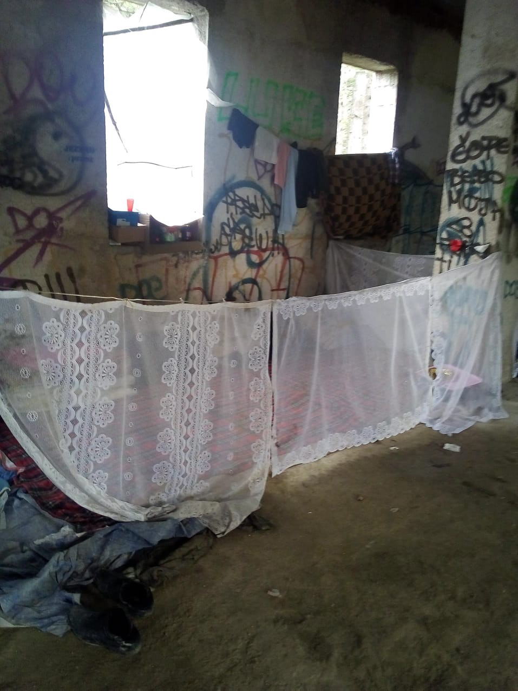
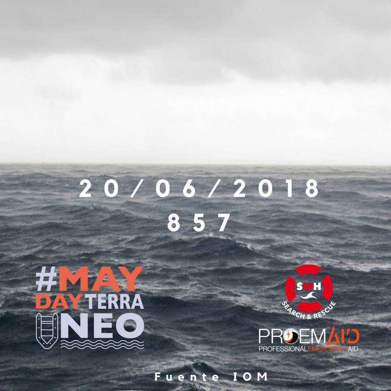
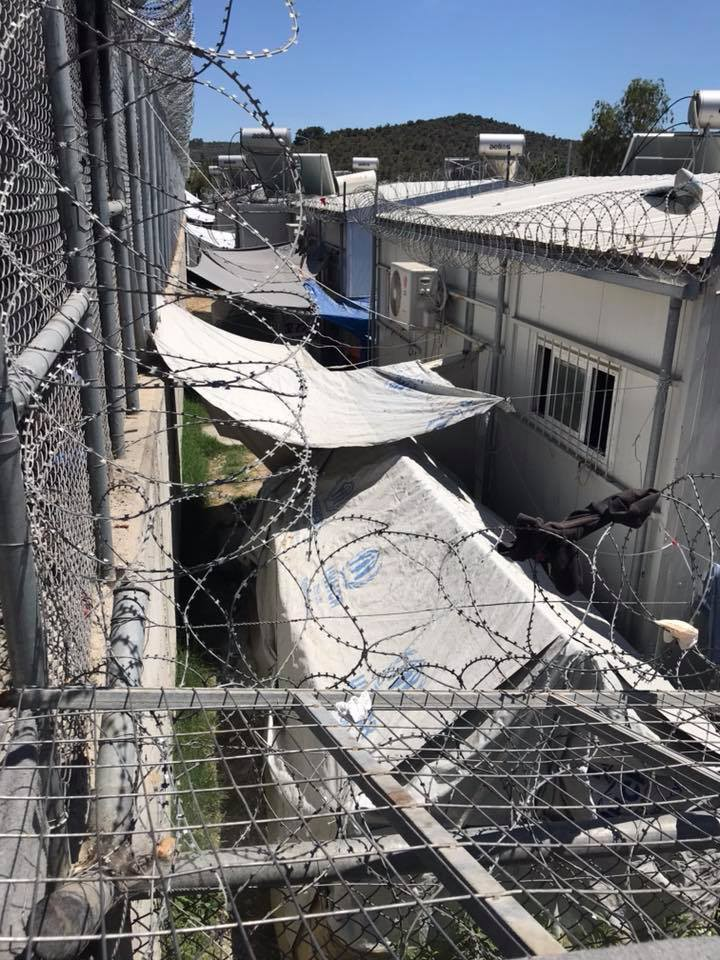
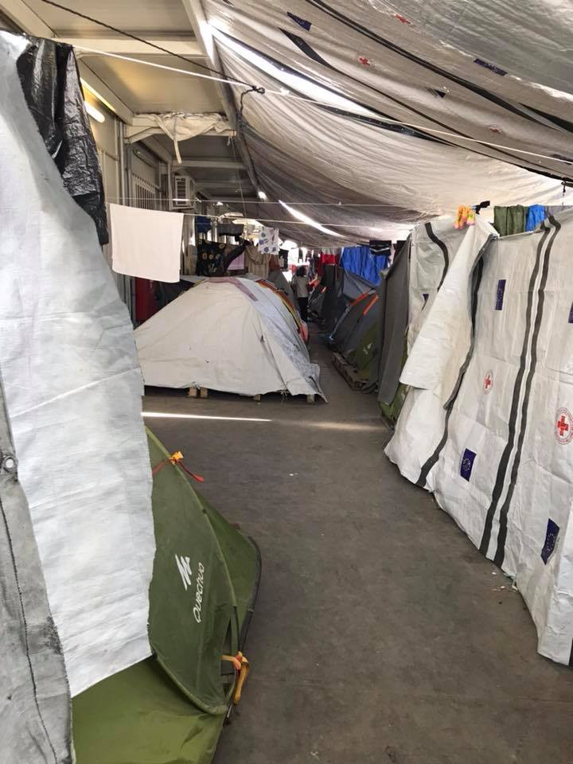
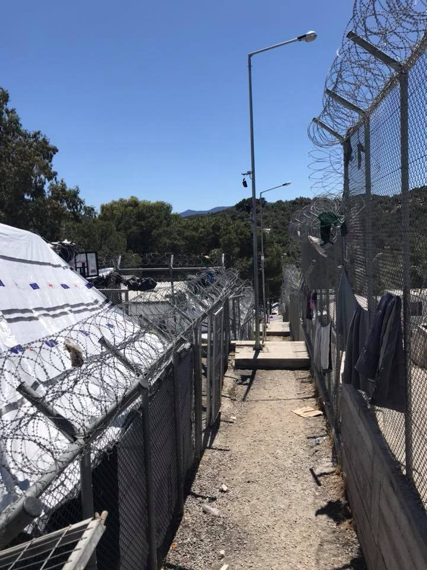
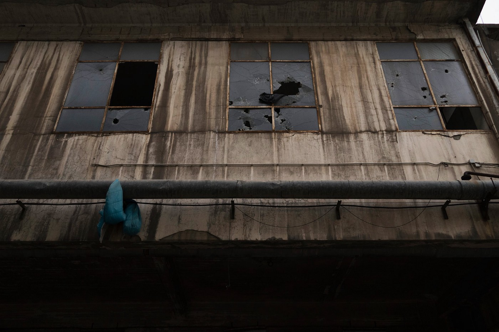
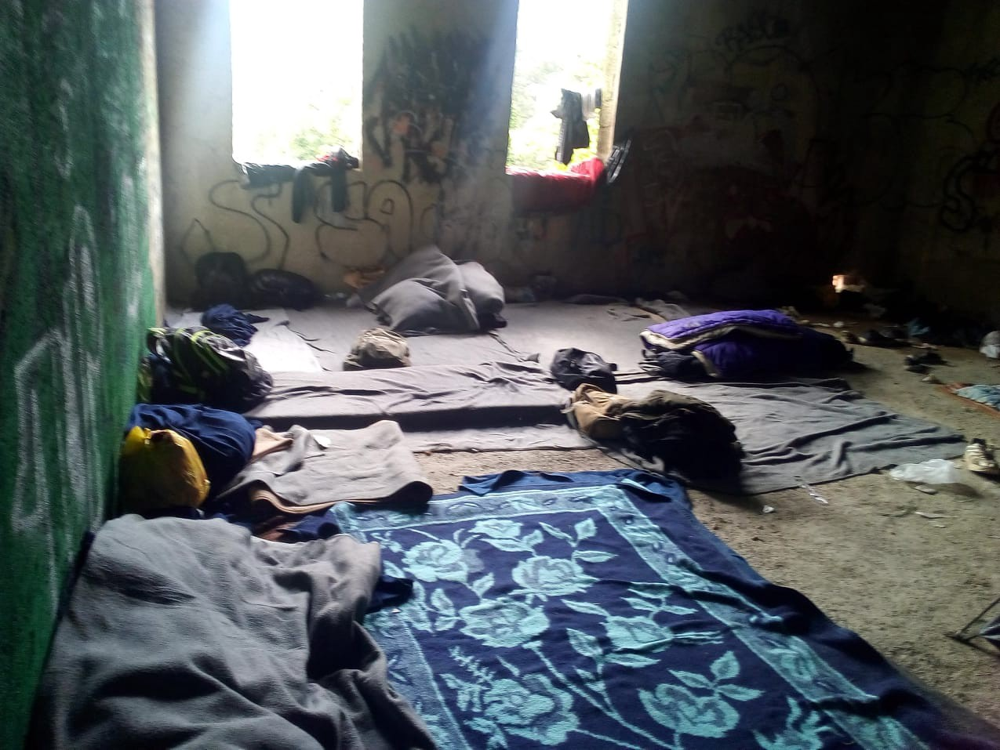
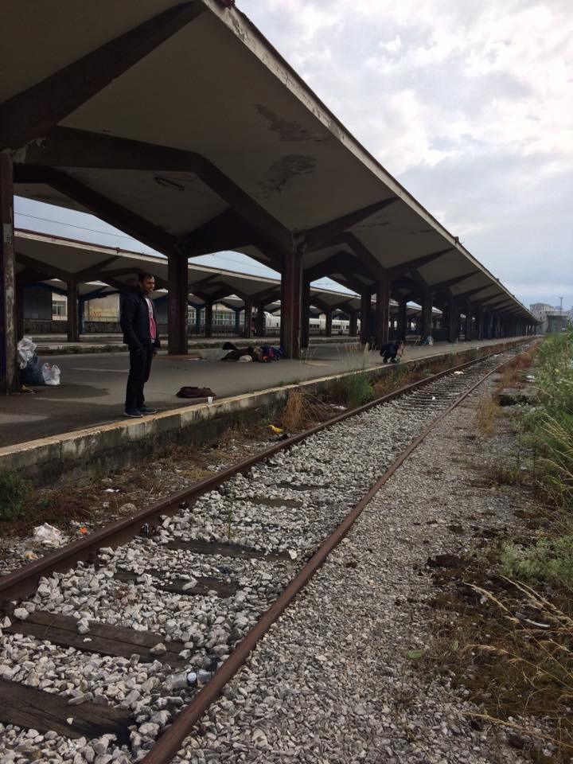
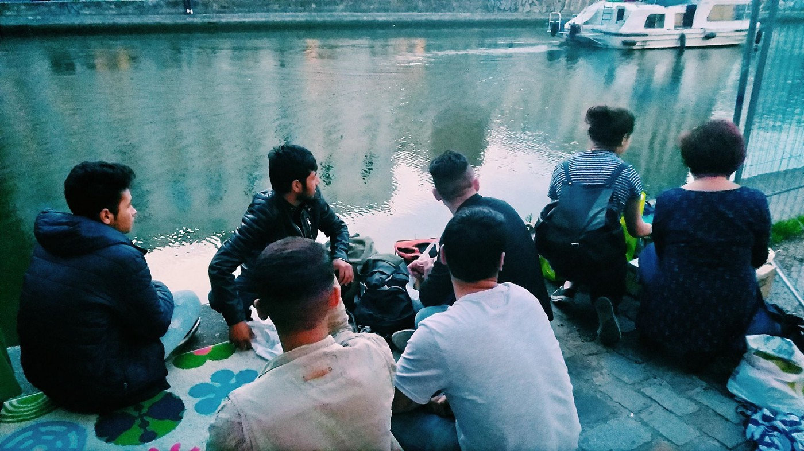

### AYS DAILY DIGEST 20/06/2018: International Day of Hypocrisy

Yesterday was World Refugee Day and a family of six from Kurdistan, including four children and a pregnant woman, was pushed back from Croatia to Bosnia\. They asked for asylum\. After they were pushed back, the police left them in a field with one phone to call for help\. They called volunteers who picked them up and took to the city, where a local family is taking care of them\. Yesterday was World Refugee Day\.

Bihać, north Bosnia and Herzegovina, close to the border with Croatia\. Over 1\.500 refugees are estimated to be in this area\. There are no camps or any decent accommodation\. Photo: AYS
### Sea

### Greece

Last week 33 boats have attempted the crossing to Greece, of which 16 have made it\.

#### Moria, Lesvos

#### Patras

Photo AYS
### Italy

](assets/966c0b922c33/1*3nMoolcFwWrhLcr4H0wQQw.jpeg)

Photo by [Fight/Right — Diritti senza confini](https://www.facebook.com/Roma16Dicembre/?hc_ref=ARRY7goEe4YoG7wIc3ZmOjqsDI9Cjvthj1w6kuIrAQawHeQ8Rf4UqOUHmuu14BDsUNM&fref=nf)
### Bosnia
#### Bihać

Photo AYS
#### Sarajevo

Sarajevo train station, where a number of young men currently are sleeping rough\. Photo AYS\.
### Hungary

“TODAY, on World Refugee Day the Hungarian Government adopted Bill T/333, a new version of the 2018 Anti\-NGO package, and the Seventh Amendment to the Fundamental Law of Hungary\. Although the adopted version of the attack on civil society organizations differs significantly from its two previous versions, the threat it poses is even more severe and unacceptable\. The primary aim of this legislation is to intimidate, by means of criminal law, those who fully legitimately assist asylum seekers or foreigners, protecting humanitarian values and the right to a fair procedure\. It threatens jail those who support vulnerable people\. This runs counter to all we consider as the rule of law, European and Christian values\.” — [Helsinki Committee](https://www.helsinki.hu/.../hungarian-government-marks.../) \.
### France

In a new report titled “The psychic suffering of exiles: a public health emergency,” Doctors of the World \(MDM\) and the Primo Levi Centre highlight the frequency and severity of mental disorders faced by migrants, as well as the lack of care for this problem\.
Of the 580 cases of serious disorders diagnosed by MDM, 60 percent displayed psychological trauma, 22 percent had depressive symptoms, 8 percent had anxiety disorders, and 8 percent were cases of complex trauma\.

](assets/966c0b922c33/1*rmZ--dLhyisw97wxNWSdxQ.jpeg)

Photo by [Faces before numbers](https://www.facebook.com/FacesBeforeNumbers/photos/a.370049416799720.1073741829.368064216998240/443399666131361/?type=3&theater&ifg=1)

[Faces before numbers](https://www.facebook.com/FacesBeforeNumbers/photos/a.370049416799720.1073741829.368064216998240/443399666131361/?type=3&theater&ifg=1)

> This is where a group of 6/7 people — men and women — sleep\. On the ground, with no tent, and along a main road — with lots of noise, cars and pollution\. 

> Since the evacuation of the camps in Paris, people living in the streets are spread across the north of Paris and sleep on the concrete\. 

> These people are newcomers who haven’t started their procedure yet, people in transit and people who have been put back in the streets since the evacuation\. 

> What we’re seeing now is that a lot of people who took part in the evacuation — mostly under the Dublin procedure — are being put on the streets with no option or solution whatsoever\. 

> Those not back in the streets yet are still being transferred from place to place, in often isolated or filthy places, in gymnasiums or huts, with no privacy and very little support\. 

> Those in the streets have no camp to go to anymore and so are made to sleep on the ground\. 

> I fear Paris will become more and more like Calais\. 

> Police wake the men & women up very early in the morning and ask them to move\. 

> They do not allow any tent to be put, which means that when rain pours people are made to sleep in the mud\. 

> If blankets are left unwatched, they are taken and put in the bin by the police\. 

> People are exhausted\. 

> Because people are spread and police is chasing everyone, people have to make themselves more and more invisible, meaning more and more difficult to access help and information\. 

> One Ethiopian friend, talking about the police, asked me: “I don’t understand why they chase us every morning, they don’t have a job?” 

> Felt very discouraged when I had to answer that, apparently, this is their job\. \. 

#### Solidarity, Paris

Photo by Danika Jurisic
### Portugal

64 percent of asylum claims were denied by Portugal last year\.

Ahead of Portugal: only Poland, France, Hungary, Croatia, the United Kingdom and Bulgaria\.

In 2017, Portugal refused most applications for asylum, under which refugee status is granted to those fleeing war or human rights abuses\.
### Sweden

Six Afghan asylum seekers were deported to Afghanistan yesterday morning — [Afghanistan Migrants Advice & Support Org](https://www.facebook.com/Afghanistan-Migrants-Advice-Support-Org-195295217167437/?hc_ref=ARTighHHONphgwfKap0dZmYuws7IKlBNvMDH3HSqD_pHsCcgHH16_pCxkgJLmss0sAc&fref=nf&hc_location=group) \.
### US

**We strive to echo correct news from the ground through collaboration and fairness\.**

**Every effort has been made to credit organizations and individuals with regard to the supply of information, video, and photo material \(in cases where the source wanted to be accredited\) \. Please notify us regarding corrections\.**

**If there’s anything you want to share or comment, contact us through Facebook or write to: [areyousyrious@gmail\.com](mailto:areyousyrious@gmail.com)**

_Converted [Medium Post](https://medium.com/are-you-syrious/ays-daily-digest-20-06-2018-the-international-day-of-hypocrisies-966c0b922c33) by [ZMediumToMarkdown](https://github.com/ZhgChgLi/ZMediumToMarkdown)._
