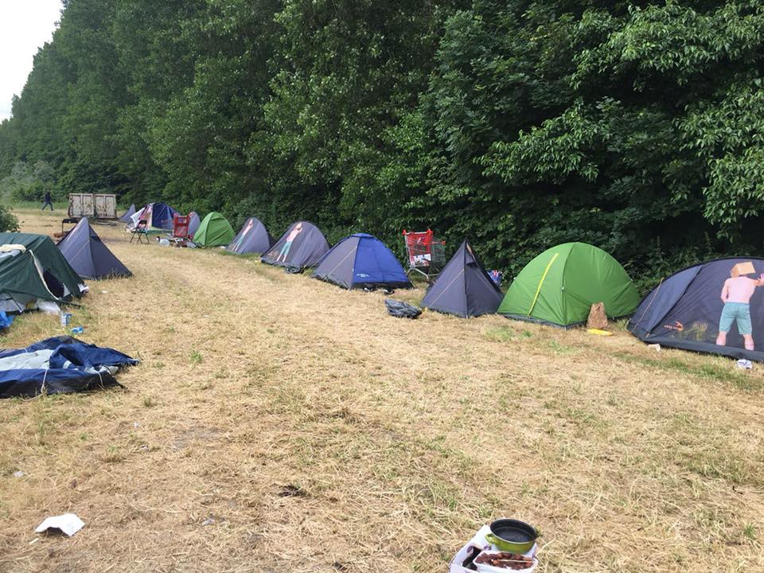

### AYS Daily Digest 21/06/2018: Italy to seize two rescue ships

_220 people have drowned at sea off the coast of Libya over the past two days / Rescues continue off the coast of Spain / Mini EU summit on migration takes place on Sunday / Solidarity march moves on in France / And more news…_

Photo by Danilo Campailla
### FEATURE

After rescuing 224 people, the Lifeline boat is urging for a port of safety to disembark them\. It has not been assigned a port so far\.

The _BBC_ reports that Italy said it will seize the Lifeline and Seefuchs boats to determine their legal status\. Transport Minister Toninelli said the Lifeline boat would be impounded and refugees transferred to Italian Coast Guard ships\. Italian news agency _Ansa_ describes how Interior Minister Salvini said the NGO ship Lifeline should not expect to have access to Italy’s ports\. He said it can take refugees rescued the “long route \[back\] to Holland” as it is sailing under the Dutch flag and failed to listen to Libyan and Italian coast guard communications\. Salvini threatened to arrest the crew and seize the ship if it enters an Italian port\.

The Netherlands’ representation at the EU said the ship is owned by German NGOs and was not entered into their ships’ register, thereby denying responsibility for the ship\.

While Transport Minister Toninelli has said that the Libyan Coast Guard was already intervening in the rescue operations, Lifeline argues that they themselves were the “best equipped asset on scene, due to a situation in need of immediate response\.” It notes that the Libyan Coast Guard is not equipped with adequate life\-saving equipment and has no medical personnel on board, while refugees are not safe if taken back to Libya\. Lifeline adds that they were rescued in international waters, in line with international law\. Mission Lifeline now fears that a similar situation to the Aquarius one week ago could be on the horizon for them\.

Photo by Danilo Campailla

Both Sea\-Eye, owner of the Seefuchs, and Lifeline have also shown registration papers on social media, which allegedly prove that they are allowed to travel under the Dutch flag\. Sea\-Eye adds, “Nevertheless, the Netherlands says that we are not allowed to carry their flag\. We do not know why they do that\. We sent our ship back to Malta to ensure crew safety\. We take the statements of Dutch and Italian ministries very serious\.”

220 persons have drowned at sea off the coast of Libya over the past two days, according to UNHCR\. A wooden boat capsized off the coast of Libya on Tuesday and out of the estimated 100 passengers, only five survived\. The same day, a rubber dinghy with some 130 people on board sunk at a different location\. Sixty survivors were rescued by local fishermen\. On June 20th, the Libyan Coast Guard conducted a rescue operation — the survivors reported that over 50 people travelling with them had perished\. The Libyan Red Cross continues to recover bodies that are being washed up on Libyan beaches\.

IOM Chief of Mission Othman Belbeisi says 363 people, including 49 children, were returned to Libya by the coast guard in the past 24 hours\.
### SPAIN
#### Around 312 people rescued off the coast of Spain

Rescues have also continued all day off the coast of Spain\. In total, 312 people from a number of boats were rescued by Salvamento Marítimo Humanitario\. Many were rescued near the island of Alboran\. Almost 300 people have died this year trying to reach Spain by boat, according to _Publico\._ This is 68 more than all of last year\.
### GREECE
#### Arrivals on Greek islands

36 people from Iraq, Palestine, Cameroon, and Somalia arrived on Chios on Thursday according to Salvamento Marítimo Humanitario\. Aegean Boat Report also says around 37 people arrived on Samos\.

Refugee Rights Europe is on Lesvos to document the human rights situation on the island\. Not much has changed according to their findings, as refugees and displaced people are still trapped in unsanitary and unsuitable conditions\. Refugees continue to complain about the lack of running water, overcrowded tents, and an infestation of rats\. They add that the food is often inedible and makes them sick\.
#### Volunteer needs on Lesvos

The Health\-Point Foundation is urgently looking for dentists to help cover the clinic from July 2nd–7th\. There is massive need of dentists for refugees based on the island of Lesvos\.

If there are other dates you are interested in, please still get in touch: [dental@healthpointfoundation\.org](mailto:dental@healthpointfoundation.org) \.

Other volunteer needs can be found on [Greecevol](https://www.greecevol.info/) , as always\.
### FRANCE
#### People return to Dunkirk

Photo by Care4Calais

Care4Calais says around 150 people have come back to a makeshift camp in the Dunkirk area, adding that people continue arriving\. The group says that people are coming back from accommodation centres they were brought to after the evacuation of previous camps and shelters around Dunkirk\. There is a huge need for tents and blankets and you can help Care4Calais [here](https://mydonate.bt.com/donation/v4/chooseAmount.html?charity=164447&currentMonth=5) \.
#### Police ubiquitous in Calais

Refugee Info Bus continues to highlight the prominent police presence in Calais\. After calling the ambulance service for a severely ill person at one of the distribution points in Calais, two CRS vans and three police vehicles arrived on the scene\. Officers armed with guns got out of their vehicles and proceeded to spend 15 minutes “securing the perimeter\.” This is despite only volunteers and the person in need of an ambulance being present, and the authorities’ actions delaying the arrival of emergency services\. Police eventually called the ambulance service, although they never arrived\.
#### Solidarity march continues north after leg in Paris

On Thursday, 170 people left Porte de la Chapelle in Paris as part of the solidarity march for migrants, stopping in Saint\-Denis, and continuing on until Sarcelles\. Undocumented migrants from Paris have now joined the march and will continue the route with the others\. The march, which started in Ventimiglia at the end of April, will continue on until London, passing through Calais\.
### EU
#### Mini\-summit on migration takes places on Sunday

A range of outlets report President Juncker announced an informal meeting of “interested member states” that will convene on Sunday to work on “European solutions” for asylum policy ahead of the European Council summit\. Germany, Austria, Italy, France, Greece, Bulgaria, Spain, Belgium, the Netherlands, and Malta will participate\.

The meeting is widely seen as an opportunity for Chancellor Merkel to persuade other EU leaders to agree to steps to restrict movement of migrants within the EU, a move to strengthen her hand in an internal dispute within her coalition\. _Die Süddeutsche_ notes Juncker indicated that the summit will focus on preventing secondary migration flows\. A draft declaration proposes the creation of “flexible joint readmission mechanisms close to internal borders\.” Controls would be implemented at train stations, bus stations, and airports, and asylum\-seekers would have to pay a fine if they do not stay in the country where they were first registered, the paper adds\.

However, the draft statement for Sunday’s meeting on migration was withdrawn after objections from Italian Prime Minister Giuseppe Conte\. _Ansa_ reports Conte said Italy will propose the creation of European protection centres in migrants’ countries of origin and transit in order to assess asylum requests outside of Europe\.

The proposal by countries including Austria and Denmark to create “platforms” or camps at the EU’s borders will be another subject of dispute\. The European Commission and several member states worry about the legality of such a solution while countries that could host such camps like Tunisia and Albania have not even been consulted\.

_Politico_ and _La Stampa_ highlight comments from Commissioner Avramopoulos, who said in response to questions over EU plans for “disembarkation platforms” that the EU won’t create a “Guantanamo Bay for migrants\.” “This is not what we are discussing, or what has been proposed,” Avramopoulos continued, adding “the Geneva Convention is there, it is alive, and it is guiding us\.” _The Guardian_ says Avramopoulos admitted that no North African country has yet agreed to host migrant screening centres to process refugee claims\. The paper suggests that the idea for offshore migrant processing centres remains sketchy, with numerous political, practical, and legal questions unanswered\. The head of the UNHCR office in Belgrade, Hans Friedrich Schodder, also said the idea to build a reception camp for migrants in the Balkans is now “off the table,” according to [B92](https://www.b92.net/eng/news/politics.php?yyyy=2018&mm=06&dd=20&nav_id=104437) \.

**We strive to echo correct news from the ground through collaboration and fairness\.**

**Every effort has been made to credit organizations and individuals with regard to the supply of information, video, and photo material \(in cases where the source wanted to be accredited\) \. Please notify us regarding corrections\.**

**If there’s anything you want to share or comment, contact us through Facebook or write to: areyousyrious@gmail\.com**

_Converted [Medium Post](https://medium.com/are-you-syrious/ays-daily-digest-21-06-2018-italy-to-seize-two-rescue-ships-f13ad5abca47) by [ZMediumToMarkdown](https://github.com/ZhgChgLi/ZMediumToMarkdown)._
