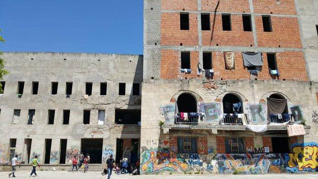
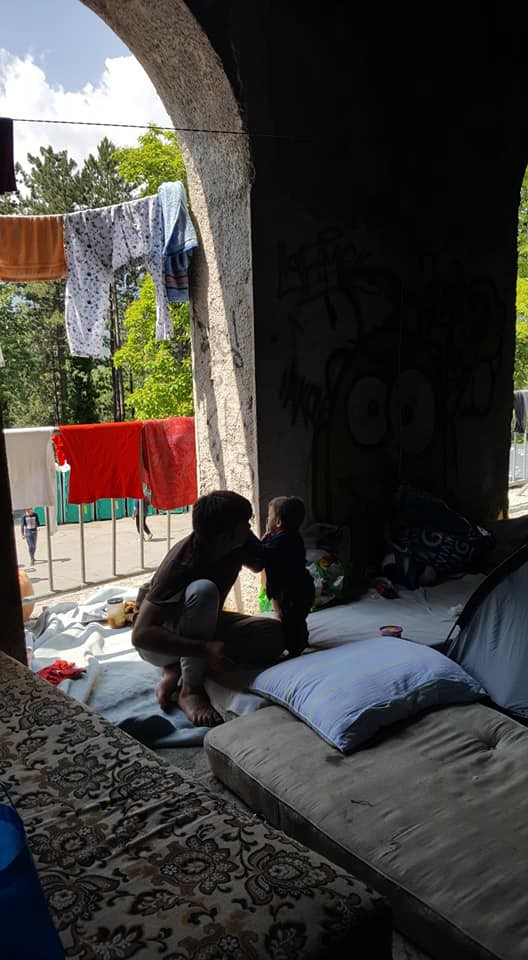
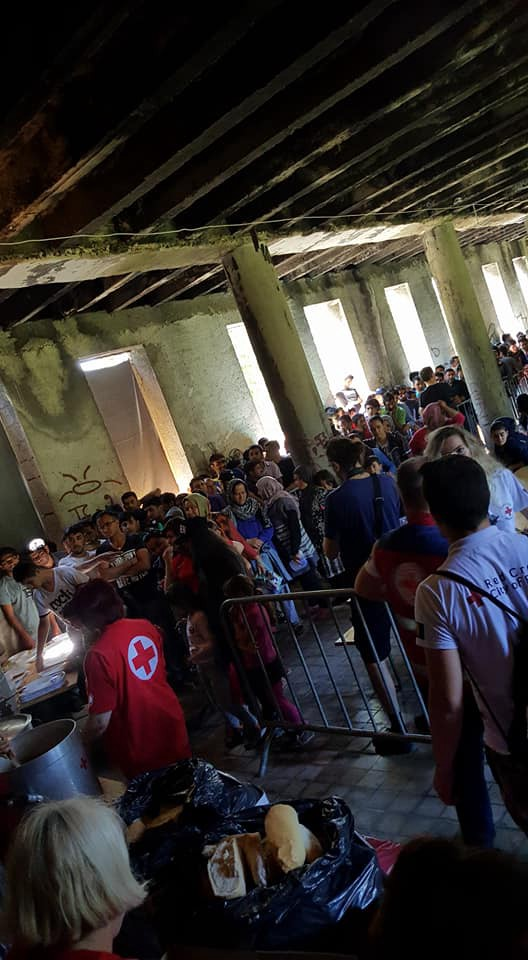
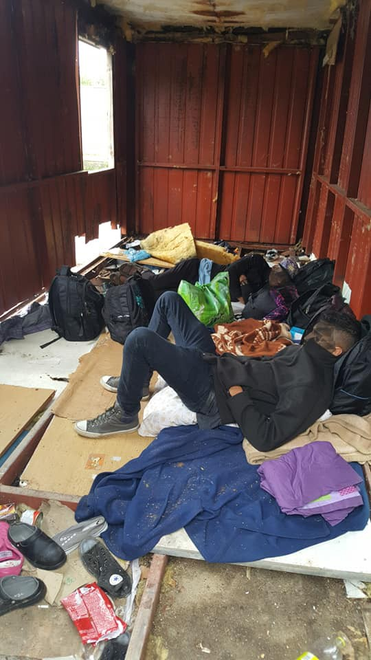
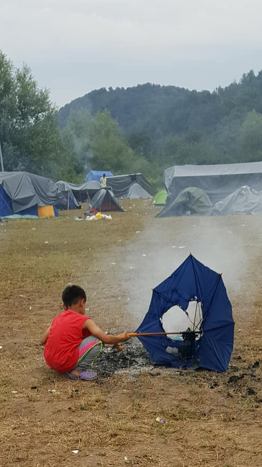
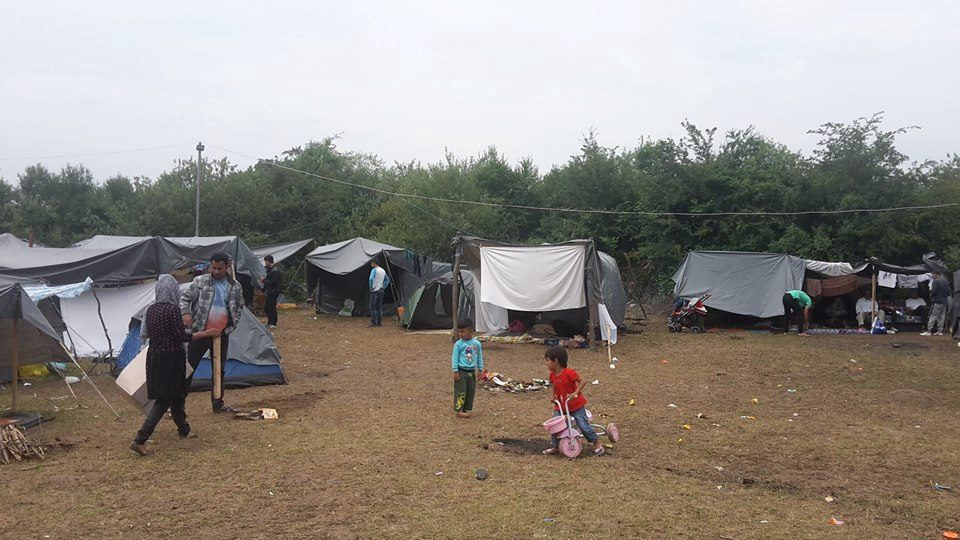

### AYS SPECIAL from Bosnia: Can this be real life?

_Bihać, a city on the banks of the beautiful river Una, has about 61,000 inhabitants\. The city is about 16 kilometers from the border with Croatia, and today it still shows many traces of the war\. According to official sources in this city there is around 1,500 refugees\. About the same number of people are also in the nearby town of Velika Kladuša\. A story about these two cities and refugees by two Italian independent volunteers_

On Sunday 17 June, we visited a big building called Đački dom in Bihać, where about 600 people reside\. The building is left unfinished because of the war in this country \(from 1992 to 1996\) \. Today the building is totally ruined and very dangerous due to stairs and the balconies without railings as well as big holes in the floors\.

Our group of volunteers have been to this place before, during our first trip, and visited the building during a bright day that made the dilapidation less apparent\. At this time, however, the sky was dark and full of rain: from the ceilings the rain dripped inside penetrating the floors below where the peole are piled up, with or without tents\. There are 500 to 600 people staying in this building\.

The municipality has installed electricity and placed toilets, toilets and showers, in totally inadequate numbers — there is only one tap for water \-, monitoring everything with the police, who are rather easy going at the moment\.

In this place, but also in the main city park, Afghans, Pakistanis, Syrians, Iranians, Kurds, Iraqis are surviving together\. Whole families with many children and even infants\. All point towards Europe, many towards Italy\.

Continuous are the attempts to cross the increasingly difficult borders, something we have also been direct witnesses to\. The relationships between people of different origins have appeared rather calm and composed, in the common condition of survival, cordial and affective welcome for visitors\.

Attempts to cross the border by groups, families and individuals are very frequent, but they almost always fail\. Border surveillance is increasing continuously\. The Bosnian authorities have failed to provide for the basic needs of refugees, yet they have found plenty of money to police them\.

When the “illegal immigrants” are found, the Croatian or Slovenian police ensure their punctual deportation to Bosnia or Serbia, even if they ask for asylum in these EU member states\. The arrest, however, is accompanied by the deprivation of all goods \(including money and personal effects\) and the systematic shattering of mobile phones\.

During our first visit, we met an exhausted Afghan family who tried to cross but were returned back\. Now we found them in Bihać, father, mother and daughter were camping on the first floor of the Đački dom in an igloo tent, next to a large group of Iranians\. The girl told us, with shining eyes, her dreams of a normal life; the father, with extreme dignity, asked us to tell the world all the injustice they were suffering\.

The nearby group of the other refugees, made up of families including a pregnant girl, had tried three nights before to cross to Croatia\. Among the eight were children, including a newborn\. The men were professionals: students, firefighters, teachers, carpenters\. Unfortunately they were discovered and sent back\. A young couple was in the grip of a crisis of discouragement: he could not understand why there was so much hatred towards those who, like them, had fled because of political persecution\.

About ten kilometers from the border with Croatia, we met another couple who came back after yet another failed attempt to pass\. The previous times, after being punctually discovered, they had been held by the Croatian police, robbed of everything, of the watch, of the wedding ring, of the money and subjected to humiliation\. Their cell phones were shattered specifically under the armored wheels\. They had lost all their contacts and now, without a cell phone, they had no other chance to orient themselves in the woods\.

> They told us: “we are in this hell but I cannot believe that this is real life, it cannot be real life\. It’s just a terrible nightmare”\. 

The attempts will not cease … it is only the hope that keeps this mass of desperate people alive\.

We have collaborated with the Red Cross volunteer team, who are working to provide for people in this area\. From what we saw, the Red Cross is working working very hard and trying to be consistent in a terrible situation\. The Red Cross provides a daily meal — a soup with pieces of meat and bread and a little breakfast — inside the building, on tables that are then dismounted\. The Red Cross’s resources come mostly from local aid, but have been recently doubled by international aid\.

One striking thing is the tolerant, non\-hostile attitude of the population, and also of the police, towards refugees, who walk smoothly in the city, in bars and even in restaurants \(obviously in the measure of their meagre resources, but a pizza or a rice there cost very little\) \. This attitude is palpable\. This makes a difference\. If not, if it were like in Pordenone or Gorizia, for example, the situation would quickly turn to the tragic\.

On the morning of Sunday 17 June, we left Bihać for Velika Kladuša\. This town has about 40,000 inhabitants and is only a few kilometers from the Croatian border\. We visited, with our friend as a guide, a small refugee centre, in the place of the disused municipal slaughterhouse\.

With two other volunteers, we tried to make the building livable\. There are dozens of people living in two dilapidated containers there\. A few hundred meters away, really close to the border that passes around the hills covered by woods, there is a camp of about three hundred refugees, with tents and makeshift shelters: numerous families with children\. The camp is guarded at the entrance by an employee of the Municipality who, however, does not prevent anyone from entering\. The border police instead fly over the area with two helicopters commuting from Velika Kladuša to Bihać\.

On this Sunday in June when we arrived at the camp it had rained a lot\. The ground was muddy, the humidity went up wrapping everything in a damp cloack, leaving an unpleasant sticky feeling\.

Everywhere small fires for cooking unlikely soups produced a thick smoke from the branches and wet wood\. A young girl was trying to cut a huge log with a saw that she could not even hold in her thin hands\. A child ran with an umbrella playing to burn it with the flames of an abandoned fire\. He did not have shoes and the mud had created scabs on his feet\.

Another boy took us by the hand and carried around the tents, eager to play and be touched and held\. The women, coming out of their shells of tents, invited us to drink tea and listen to their stories of despair\. Almost always the only question was: why do not they want us? When don’t they open the border? Then, holding back the tears, they recomposed themselves in mute pain\. They showed us their newborns, offered their smiles and their friendliness\. We found a huge dignity in that mud, in that slime of the field\.

**_This special was written by two indpeendent volunteers from Italy, Lorena Fornasir and Gian Andrea Franchi\. “_** We made two trips to the border between Bosnia and Croatia, from 1st to 3rd June in Bihać, and from 15 to 17 June Bihać and Velika Kladuša, the two locations where there are stranded groups of refugees by the borders between the two countries\. We accompanied as independent volunteers the group [One bridge to Idomeni](https://www.facebook.com/1Bridge2Idomeni/) , who have started a regular operation in Bihać\. Our first visit was for informational purposes, and the second time we came with material aid and money that we delivered to the Red Cross of Bihać \( [Crveni križ Grada Bihaća](https://www.facebook.com/CrveniKrizBihac/) \) \.”

**We strive to echo correct news from the ground through collaboration and fairness\.**

**Every effort has been made to credit organizations and individuals with regard to the supply of information, video, and photo material \(in cases where the source wanted to be accredited\) \. Please notify us regarding corrections\.**

**If there’s anything you want to share or comment, contact us through Facebook or write to: [areyousyrious@gmail\.com](mailto:areyousyrious@gmail.com)**

_Converted [Medium Post](https://medium.com/are-you-syrious/ays-special-from-bosnia-can-this-be-real-life-8208bb3002bc) by [ZMediumToMarkdown](https://github.com/ZhgChgLi/ZMediumToMarkdown)._
