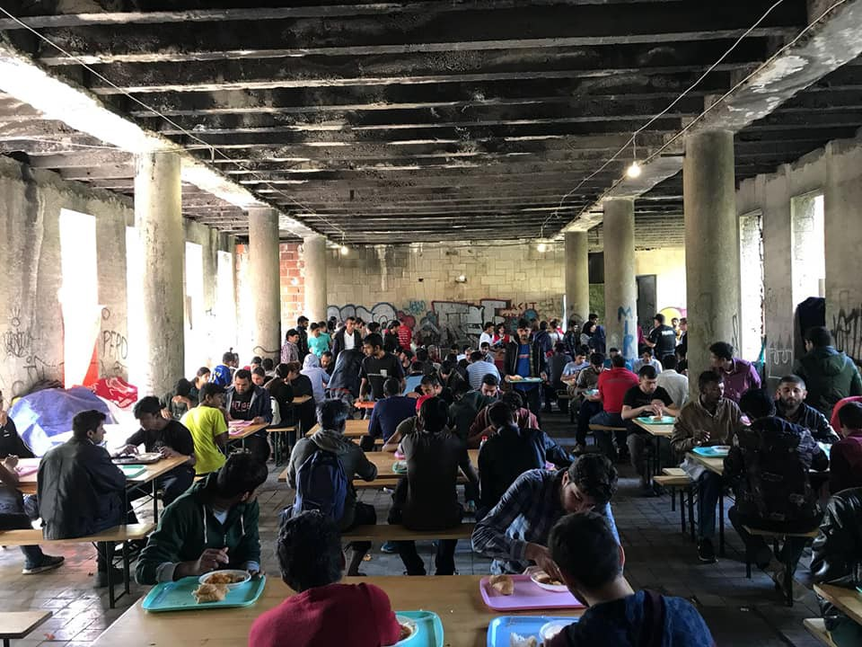

### AYS Daily Digest 24/06/18: Stranded on the “ _Lifeline”_
#### Italian Authorities continue to deny rescue ships entry to its ports as EU and member states turn a blind eye

_Malta blocks ships from landing // Rescues at Sea // 1,000 people in distress in the Central Mediterranean // Italian Coast Guard breaks maritime law // Migration Summit in Brussels // Support needed for most vulnerable on Lesvos // New Arrivals in Bosnia and Calais // And more…_

 \. “Dear [Matteo Salvini](https://www.facebook.com/salviniofficial/) , we have no meat on board, but humans\. We cordially invite you to convince yourself that it is people we have saved from drowning\. Come here, you are welcome\!”](assets/50e63bf240de/1*SWYSFAVnchgNN--s0wnKTQ.jpeg)

Photo Credit: [Mission Lifeline](https://twitter.com/SEENOTRETTUNG) \. “Dear [Matteo Salvini](https://www.facebook.com/salviniofficial/) , we have no meat on board, but humans\. We cordially invite you to convince yourself that it is people we have saved from drowning\. Come here, you are welcome\!”
### Feature

There are currently over 300 refugees stranded on two ships in the Mediterranean\. The German operated [Mission Lifeline](https://twitter.com/SEENOTRETTUNG) ship is still carrying 224 people and has been denied entry to any port as of yet\. Approximately 80 people have been transported onto the cargo ship Alexander Maersk, and they are also being denied disembarkation\.

The rescue workers aboard the [Lifeline](https://twitter.com/SEENOTRETTUNG) wrote today, “That now even merchant vessels are kept hostage in this responsibility vacuum is a new level for the incomprehensible and intolerable situation regarding sea rescue\. As a civil fleet we are about to send supplies for support\.”

■■■■■■■■■■■■■■ 
> **[SOS MEDITERRANEE](https://twitter.com/SOSMedIntl) @ Twitter Says:** 

> > We’re concerned about people not allowed to a port of safety on #Lifeline &amp; #Maersk ships. Administrative, policy or political considerations cannot be prioritised over maritime regulations, and fast and safe disembarkation of people rescued at sea must always be provided. 

> **Tweeted at [2018-06-24 11:25:48](https://twitter.com/sosmedintl/status/1010846448722857984).** 

■■■■■■■■■■■■■■ 

As of writing, the Lifeline and Alexander Maersk ships are still stranded at sea\. The Lifeline has received food and water provisions from Malta, and medical supplies and blankets that were provided by two other rescue ships\. According to the Lifeline, they are hoping to rendezvous with the Maersk so they can get supplies from the larger ship, and provide medical aid to those onboard\.

Every day the Lifeline is stranded at sea it is not out completing search and rescue missions\. The continued Italian attacks on rescue ships are already having fatal consequences: while 11 people drowned in the Central Mediterranean last month, over [230 have died](http://missingmigrants.iom.int/region/mediterranean) since Salvini began turning the ships away\.
### Sea

Will another two hundred people die in the sea today because of European inaction? AlarmPhone reported two very worrying incidents today, one from last night and one from today, which Italian authorities seem to have ignored distress calls\. From Alarm Phone:

> Tonight, the Alarm Phone received a distress case from the Central Mediterranean Sea\. A boat with 96 people on board, many from Eritrea, had left from Libya\. When we spoke to the travellers, they confirmed that they were in an urgent distress situation and required immediate help\. We are also in contact with some of their relatives who are fearing for their lives\. 

> We passed the information on the distress case, including the GPS coordinates of the boat to the Maritime Rescue Coordination Centre \(MRCC\) in Rome\. They told us shortly after that Malta would coordinate the rescue of the boat\. When we spoke to the coordination centre in Malta, however, they seemed unaware about the distress case\. Later, they told us that the ‘Libyan’ authorities would take on the case\. This directly contradicts the information we had received from Rome, following which Malta had taken on the case and therewith the duty to coordinate the rescue operation\. 

> We are still trying to force both Rome and Malta to follow their duty and engage in the rescue\. The battery of the satellite phone on the boat has run out, so that they do not have any possibility to reach out for help anymore\. 

> The cynical games European politicians are playing at the moment have these catastrophic consequences\. 

> This is a matter of life and death, and we urge the authorities to immediately take on the responsibility to coordinate a rescue operation\. 

Today, AlarmPhone reported Italian authorities brushed off yet another distress call\. The organization alerted the Italian MRCC to a vessel in distress outside of Libyan waters\. According to the group; “We informed the Italian authorities 10 hours ago, and nothing has happened since\! Responsibility is rejected or assigned to the so\-called Libyan coastguards… We demand that these people be rescued and brought to a safe harbour, which cannot be a harbour in Libya\.”

The rescue ship Aquarius reported that there were over 1,000 people in distress in the central Mediterranean \(including the numbers reported by AlarmPhone\) \. Despite the huge number of people in danger, MRCC Rome told the rescue ship to turn away, and that “ [we don’t need your help”](https://twitter.com/campsoscar/status/1010837703804510209?s=21) \.

Despite the authorities pushing the rescuers away, the Aquarius headed towards the distress calls, knowing that people were at risk of drowning or being deported back to Libya by the notorious Libyan “Coast Guard”\. Last reported, the Aquarius was heading towards waters north of Al Khums to assist 550 people in distress\.

The Open Arms sea rescue NGO reported that a private plane that was helping them to spot stray boats in distress was blocked from refueling in Lampedusa\. [According to the founder](https://twitter.com/campsoscar/status/1010839653275103233) of the group, “This is the same thing they did to us \[Open Arms\] yesterday in Malta\. They don’t want witnesses\.”

320 people were transferred on Saturday to the port of Malaga after being rescued from several boats in the [Alborán](https://www.facebook.com/hashtag/albor%C3%A1n?hc_location=ufi) Sea, including seven children and 50 women\.

Today the Spanish SMH rescue organization saved 141 people from 13 dinghies between Morocco and Spain\. Yesterday, the organization rescued over 800 people\.
### Malta

The Maltese government has not allowed any of the rescue ships which were denied entry in Italy to dock in its ports\. Now MSF rescue ship Aquarius is saying that Malta has issued a blanket rejection to the ship and will not allow it in any of its ports in the future\.

Malta is currently denying it has issued a blanket rejection, but a BBC reporter aboard the Aquarius confirmed the crew’s account, and explained that the ban applies in all cases, whether or not there are refugees aboard\. This issue came to a head [this weekend](https://twitter.com/scandura/status/1010604665946411008) when Maltese authorities called the Aquarius to rescue people on a boat ten miles off Tunisia, but did not allow the ship to refuel at its port\.
### Italy

This week, the Italian Coast Guard published a message to vessels in the central Mediterranean near Libyan water to “contact Tripoli or the Libyan Coast Guard to request rescue”\. In other words, if you want to be rescued you need to call the people you are risking your life to escape from\.

In response to this, sea rescue organizations have been encouraging their supporters to contact the Italian Coast Guard with this message:

> “Request of immediate restoration of the sea rescuing operations in regards to the NGO ships… the Italian coast guard has always deployed — in these years — important rescuing operations in the sea saving thousands of people, operating also beyond the limit of the Libyan waters\. We are wondering why you are delegating this obligation today to Libya — a country with an unstable government, unable to guarantee the human fundamental rights, and still lacking a national operational hub for the coordination of the sea rescue operation\. Your entity, executing a command anyway, intends to nullify the important action conducted so far and to contradict the SAR \(Search and Rescue\) Convention signed in Hamburg in 1979 and at the UN Convention on the Rights of the Sea \(UNCLOS\) of 1982\. We remind that, based on the data provided by UNHCR, more than a thousand people have died in the Mediterranean Sea this year, 220 of them only between 19 and 20 June”\. 

### EU

Civil society and rescue organizations are appealing to EU leaders today as they are convening in Brussels for a summit on migration policy\. The official agenda for the meeting features proposals to increase the use of closed camps across Europe to detain refugees\. Sea Rescue group MayDay Terraneo wrote, “The only positive response that can emerge from this meeting is a commitment to the defence of life and solidarity among peoples\. Instead, the proposal for closed centres will only bring more pain to migrants\.”

Sea Rescue groups in particular are calling for an immediate solution to the stranding of rescue ships, and an end to the policy of border externalization, which has given millions of dollars to brutal rulers and militias in Libya\. As the EU comes up with more inhumane policies to “fight illegal immigration” hundreds of people are drowning in the sea\.

Rescue groups _Sea\-Watch_ and _Jugend Rettet_ released a [joint statement today](https://twitter.com/seawatchcrew/status/1010870434177388544) calling on the Brussels meeting to address these deaths and respond to Italy’s barring of rescue ships\. “As the civil fleet, doing their job for years now on the Mediterranean, we urge them to agree on a policy respecting the principle of non\-refoulement, based on solidarity, safe passage and access to the right to asylum\.”

In stark contrast to minister Salvini, who has denied the humanity of African refugees, calling them “cargo” and “human flesh”, the rescue NGOs are still fighting to do their jobs and protect human life at sea\. As the [founder](https://twitter.com/campsoscar?lang=en) of the rescue NGO _Open Arms_ said today, “While we wait for a summit, the sea is spitting “human flesh” on the shores of Libya\. Bodies and more bodies appear out of nowhere, lives that sink senselessly\. Despite everything, we are still at sea and will continue to denounce this inhumanity\.”

■■■■■■■■■■■■■■ 
> **[(((lost Vasya))](https://twitter.com/xandra_photo) @ Twitter Says:** 

> > #Brussels while the #EU heads of governments were talking about #refugees.
As a matter of fact, EU politicians seem to be addicted to #barbed_wire https://t.co/wGsAfbIJYx 

> **Tweeted at [2018-06-24 21:41:05](https://twitter.com/xandra_photo/status/1011001290992865280).** 

■■■■■■■■■■■■■■ 

### Greece
#### Islands
#### New Arrivals

56 people arrived on Lesvos early this morning\.

■■■■■■■■■■■■■■ 
> **[Lighthouse Relief](https://twitter.com/LighthouseRR) @ Twitter Says:** 

> > Our team assisted the new arrival at Skala with @RefugeeRescueUK. Everyone has been shuttled to Stage 2 transit facility. The majority of the 56 people came from Afghanistan and Iraq. One urgent medical case. [twitter.com/boataegean/sta…](https://twitter.com/boataegean/status/1010834408247525376) 

> **Tweeted at [2018-06-24 10:48:24](https://twitter.com/lighthouserr/status/1010837035496587264).** 

■■■■■■■■■■■■■■ 

Three boats have arrived on Samos this morning\. The first boat was carrying 54 people \(5 children, 28 women, and 21 men\) \. The second boat had 24 people \(10 children, 6 women, and 8 men\) \. We do not yet have information on the third boat, as authorities on the island are more and more often refusing to share even this most basic information\. [Aegean Boat Report](https://www.facebook.com/AegeanBoatReport/?hc_ref=ARRg7srXKhQQHyB-JHN3ZWHsp1RPeyjtgaeICkOqFVC5Bii00g0gijecMWIHC-hnI0E&fref=nf) has promised updated numbers when they come in\.

The solidarity collective which was behind much of the organizing around the trial of the Moria 35 published an lengthy statement on the case today\. The Moria 35 are a group of African refugees on Lesvos who were arrested in July of 2017 when police violently raided the camp after a peaceful protest took place on the island\. Many have called the case an attempt to silence refugees who try to exercise their right to protest\. Furthermore, the people who are being tried were not even involved with the protest on Lesvos, which was led by people from Afghanistan\. As the solidarity collective wrote, “The message is re\-enforced that migrants must remain invisible, and significant obstacles are placed to prevent the development of struggles against detention centres and against the modern totalitarianism within which these detention centres are being developed\.”

Today’s report discussed the many problems with the way this case is being conducted\. Firstly, the trial is being held on Chios rather than Moria, where the defendants have people and organizations to support them\. The people on trial have also not been provided with any accommodation on Chios, making everything more difficult for them\.

The court on Chios has failed to uphold many of its obligations during the trial\. Most glaringly, it is not providing the defendants with translation for the vast majority of proceedings\. As the collective wrote, “The 35 accused became the audience in a foreign language play that was not dubbed or subtitled\. This was a production, however, in which their future was determined\.”

Serious allegations have been made against Jeremy Holloman, the head of the Christian Evangelical NGO “EuroRelief” in connection with this trial\. AYS was first to raise concerns about the NGO last year, after we received multiple reports of volunteers and workers there collaborating with authorities to deport people and giving preferential treatment to Christian refugees or those who “converted”\. Allegedly, Holloman identified four additional people to the police, and took photos and film off volunteers’ phones to hand over to authorities\. Because of this, four additional people were charged in connection with the trial\.

Volunteers at House 4 Humanity are asking their supporters to sign a [petition](https://www.change.org/p/united-nations-demand-the-protection-of-vulnerable-refugees-that-were-victims-of-radical-violence?recruiter=885416979&utm_source=share_petition&utm_medium=copylink&utm_campaign=share_petition&utm_term=share_for_starters_page) demanding accommodation for some of the most vulnerable refugees on Moria\. House 4 Humanity explained the background behind their difficult current position:

> On the morning of May 25th a fight broke out between a small group of Arab & Kurdish men… The conflict quickly escalated and the events that followed can only be described as horrific\. Families were attacked in their tents and caravans by masked men wielding metal pipes, knives, and other makeshift weapons\. They did not discriminate — old men, women and children were all attacked\. 

> On the morning of May 26th, ALL Kurdish \(Yazidi, Christian, and other persecuted minorities\) families left Moria en masse as they no longer felt safe remaining in the camp after they were threatened to be “finished off” by the very people that attacked them and **NO ARRESTS** were made\. \(Rather, arrests were made but the criminals were later released although the victims had identified them\) 

> **Vulnerable refugees who’ve seen unimaginable events in their home land, were left displaced and homeless once again\. \(Many of them are recent arrivals\) \.** 

> Authorities asked the \#HouseOfHumanity to temporarily house 368 souls out of the approximate 1200 that fled\. Within 3 days this number had increased to 660\. 

The organization is currently hosting 138 of the remaining people\. Now the authorities are pressuring H4H to evict them and send them back to Moria\. The people at H4H say they are so afraid to go back to the camp where they were attacked that they would rather be deported to their home countries\. H4H is demanding that UNHCR provide these people with help and accommodation away from their attackers, and for the authorities to investigate the assaults, and to prosecute the people who have been identified by many witnesses and also captured on [video](https://www.facebook.com/neda.kadri/videos/10156372122599192/) \.

A Turkish man has been jailed in Kos after he was shot by the Greek Coast Guard, according to [Turkish outlets](http://www.hurriyetdailynews.com/greek-coast-guard-shoots-turkish-human-smuggler-on-sea-reports-133678) \. The man was allegedly smuggling seven Syrian refugees to the island when the boat was intercepted by the Greek Coast Guard\. After he ignored their warning, the Coast Guard shot at him and hit him\. Details are still coming in on this story, but shooting at someone on a moving boat, especially when there are seven other people on it, does not seem exactly like what the Coast Guard should be doing\. Coast Guards across Europe seem more and more concerned with protecting their own coasts rather than the people in the water\.

Attika Human Support continues to deliver van loads of needed supplies to groups on Chios and Lesvos\. In the past month, they have provided hygiene items, clothing, food, and baby formula for thousands of people in cooperation with their partners\. To support their efforts or learn more, [click here](https://www.facebook.com/AttikaHumanSupport/?hc_ref=ARRJcUMd-FHM8fTdopM2tgIhfzb-JJ4l5Gd8ajEq85ICXDBrPpqBklgdLydJFmgUccM&fref=nf) \.
### France

](assets/50e63bf240de/1*M--PrLePH33KE-u00K4f-g.jpeg)

Photo Credit: [Mobile Refugee Support](https://www.facebook.com/MobileRefugeeSupport/photos/pcb.774081489464131/774084916130455/?type=3&theater)

Organizations working in the Dunkirk and Calais area are reporting an increasing number of people arriving there\. The volunteers who work there anticipated that this would happen earlier this month, when many people in the area where bused to “accommodation centers” across France\. These centers are often very isolated and ill\-equipped to meet people’s basic needs, and it has happened in the past that people sent to them leave very quckly\. This seems to have happened once again\. From Mobile Refugee Support:

](assets/50e63bf240de/1*atps5zjHUgsFKzgJFScH_A.jpeg)

Photo Credit: [Mobile Refugee Support](https://www.facebook.com/MobileRefugeeSupport/photos/pcb.774081489464131/774084916130455/?type=3&theater)

> “For the first time since last year, the population of the Dunkirk camp has reached over 400 people, with almost 200 tents serving as temporary homes to hundreds of individuals and dozens of families & children\. The current total population in the Dunkirk area is now thought to be even higher than that of Calais, with numbers still increasing daily\. 

> The reduced police presence has helped ease tension in the camp, as well as pressure on the organisations, despite a higher than ever demand for basic items\. We are currently distributing tents and hardware at a rate that we have never before, leaving the Land Rover empty at the end of each day\. 

> We desperately need donations in order to help us buy these essential items\. Every £10 donated can provide a tent for two people, a further £10 can provide them both with sleeping bags\. If you are able to [donate, please do so](https://www.mobilerefugeesupport.org/monetary-donations) \.” 

### Bosnia

](assets/50e63bf240de/1*zbZMuus_kbrBx2sdlIGe5Q.jpeg)

Photo Credit: [Red Cross Bihac](https://www.facebook.com/CrveniKrizBihac/photos/pcb.1946772298687888/1946770255354759/?type=3&theater&ifg=1)

Many new arrivals have been reported this week in Bihać, near the Bosnian\-Croatian border\. According to Red Cross volunteers, they are now distributing meals to over 900 people\. AYS published a special today on the situation in Bihać\. The people who are trapped there and in another nearby town are constantly trying to cross the Croatian border, and are frequently abused by the Croatian police when they are pushed back\. You can read the full story [here](ays-special-from-bosnia-can-this-be-real-life-8208bb3002bc) \.
### Sweden

[Solidarity groups](https://www.facebook.com/ecada2017/photos/a.1881636765385654.1073741827.1880874508795213/2082758268606835/?type=3&theater&ifg=1) are reporting that three deportation flights are taking place in the [next few days](https://www.facebook.com/ecada2017/photos/a.1881636765385654.1073741827.1880874508795213/2082758268606835/?type=3&theater&ifg=1) from Sweden and Austria to Afghanistan:

“June 26th, from Sweden \(22:30\) flight time about 2 hours
June 27th, from Austria \(01:30\) 
June 27th, from Austria \(07:00\) Via [\#TitanAirways](https://www.facebook.com/hashtag/titanairways?source=feed_text) \!”

**We strive to echo correct news from the ground through collaboration and fairness\.**

**Every effort has been made to credit organizations and individuals with regard to the supply of information, video, and photo material \(in cases where the source wanted to be accredited\) \. Please notify us regarding corrections\.**

**If there’s anything you want to share or comment, contact us through Facebook or write to: areyousyrious@gmail\.com**

_Converted [Medium Post](https://medium.com/are-you-syrious/ays-daily-digest-24-06-18-stranded-on-the-lifeline-50e63bf240de) by [ZMediumToMarkdown](https://github.com/ZhgChgLi/ZMediumToMarkdown)._
