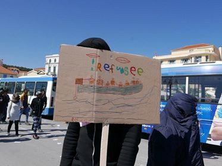

### AYS Daily Digest 25/06/2018: Salvini Refutes Torture in Libya
#### Italian Interior Minister meets Libyan Premier // ‘Watch the Med’ statement // Ports still closed to Lifeline // Fascist attack in Athens // Body washed up in Ventimiglia // Statement against evictions in Paris // Updates from the sea, Bosnia, projects in Greece and France and more…\.

](assets/d5fe1efaa50a/1*nIICN3Qo_cyJSYBq-i7JDg.jpeg)

Photo credit: Vincent Cochetel [https://twitter\.com/cochetel/status/1011212749613957120](https://twitter.com/cochetel/status/1011212749613957120)
#### Feature: Salvini Refutes Torture in Libya

Italian Interior Minister Matteo Salvini and Libyan deputy premier Ahmed Maiteeq met on Monday in Tripoli\.

Before, during and after the meeting the Italian Minister used social media to make its ideas on migration even clearer\. “As a man and as a dad” he thanked the Libyan coast guard for saving and returning to Libya 948 people\. He condemned as false the “rhetoric of torture” in the country, and praised the local government for the safety of the country\.

[MEDU](https://www.facebook.com/MEDUonlus) reminds the Minister of the [testimonies](http://esodi.mediciperidirittiumani.org/news/) gathered in the last few months from people who survived the journey across the Mediterranean\.

A\.K\., 23 years, Mali \(testimony collected in the CARA of Mineo, March 2018\):

> My brother, my brother Salif is here\. I see him, He is here\. His leg is wounded because the men in uniform shot him\. Why did they shoot him? Why did they hit me, lock me up for so many months? Save my brother, he is here, I see him\. He has blood on his leg\. Libyans hurt me a lot\. They beat me and locked me up \[during the second half of 2017\] \. I don’t know the name of the place, we were not close to the sea but not far from Tripoli\. Doctor, save my brother\. He is here\. 

A\.T\.F\., 30 years old, Ghana \(testimony collected in the CARA of Mineo, March 2018\):

> I can’t hear very well and I feel a bit spaced\. I was hit with plastic pipes on the head and I became a bit deaf\. We were in the Sabah area and I was kidnapped for 4 months \[in the second half of the 2017\] \. I still have the scars from what they did to me on my legs and on my head\. They wanted money and I was forced to call my family and friends while they were beating me\. They hurt me with a blazing knife, I almost passed out while they were using electric shocks\. Water tasted badly and the food was not enough\. They humiliated me and I was treated worse than an animal\. I was scared, a lot\. 

While the rhetoric of the Italian minister reaches a new low with each new day, the policies of the government don’t differ from those of its predecessor\. Before the meeting Salvini was pushing for “processing” centres to be set up in South Libya, a proposal that was categorically rejected by Maiteeq during the meeting\. After the meeting the plan was replaced with the idea of setting up centres south of the Libyan border, in Niger, Mali, Chad and Sudan\. This is in line with international agreements and the stances of Marco Minniti, previous Italian interior minister, who started the process of criminalising the rescue ships as well\.
### SEA

Day of the Seafarer

■■■■■■■■■■■■■■ 
> **[SOS MEDITERRANEE](https://twitter.com/SOSMedIntl) @ Twitter Says:** 

> > ⚓️Today is #dayoftheseafarer. From the #Aquarius of @[SOSMedIntl](https://twitter.com/SOSMedIntl) we wish to thank fellow seamen and women for their support. We are more determined than ever to have maritime conventions respected to protect our long tradition of solidarity at sea. Safety at sea for all. https://t.co/KlIoH0mQ74 

> **Tweeted at [2018-06-25 10:47:11](https://twitter.com/sosmedintl/status/1011199118469984257).** 

■■■■■■■■■■■■■■ 

948 people returned to Libya

■■■■■■■■■■■■■■ 
> **[SOS MEDITERRANEE](https://twitter.com/SOSMedIntl) @ Twitter Says:** 

> > 2/2 Coordination was unclear and some boats might still be at sea. From the #Aquarius, we saw a dangerously overcrowded Libyan coastguard vessel heading back to #Libya, the hell those people were desperately trying to flee. Libya can in no way be considered a port of safety. https://t.co/KSRXM3jTLJ 

> **Tweeted at [2018-06-24 20:26:37](https://twitter.com/sosmedintl/status/1010982550783905799).** 

■■■■■■■■■■■■■■ 

The Libyan coast guard rescued 948 immigrants and refugees in several operations on Sunday and has recovered the bodies of ten other people\. 
With these operations, the number of people brought back to Libya since last week reached 2,000\.

■■■■■■■■■■■■■■ 
> **[Jeff Crisp](https://twitter.com/JFCrisp) @ Twitter Says:** 

> > If aid agencies are going to publicize the assistance they provide to refugees &amp; migrants who are pulled back to Libya by the EU-supported coastguard, don't they also have a responsibility to inform the public that these people will then be thrown into abusive detention centres? https://t.co/o61P2bw8RZ 

> **Tweeted at [2018-06-25 06:31:54](https://twitter.com/jfcrisp/status/1011134871622864902).** 

■■■■■■■■■■■■■■ 

#### An official Libyan SAR zone doesn’t exist

While the Italian government is pushing for Libya to take control of the rescue operation in the Central Mediterranean, the International Maritime Organisation reportedly stated that a Libyan SAR zone is far from being officially operative\. This is a consequence of, among other factors, the difficulty of defining Libya as a safe country\.
#### Safe Harbour

Watch the Med — Alarm Phone published a [statement](https://www.facebook.com/watchthemed.alarmphone/?hc_ref=ARQuplngoNkyDDwapUhdy2UrhALt1dg_POxe6y9r4e3Hkc_SH2TIIH707bnedOC5txQ&fref=nf&hc_location=group) :

> We know all too well that rescue at sea is not the solution to migrants dying on their journeys to Europe\. Nobody should have to risk their lives to travel somewhere\. But we also know that, in the current situation, we need search and rescue missions, and we know that they depend on ‘safe harbours’, whether these are physical docklands on the coast or just inland communities offering refuge\. This is why we want our cities to become safe harbours, which we define as follows, beyond the framework of existing legal definitions and arrangements\. 

Image credit: Marily Stroux

> 1\. A Safe Harbour is an open space, where people are welcomed and assisted regardless of their origins, race, gender and class\. It is a place that is open to the city, where civil society actors can enter and monitor the situation\. 

> 2\. A Safe Harbour is a disobedient space, where voices are heard that denounce racist agitation, any attempt to block arrivals, and any policy of deterrence\. 

> 3\. A Safe Harbour is a space where human rights are respected, where people are not exposed to the risk of torture, persecution, or inhuman and degrading treatment\. 

> 4\. A Safe Harbour is a space where the right to mobility is enacted, where people are granted the possibility to stay but also to move on\. 

> 5\. A Safe Harbour is a place where neither migrants nor those who stand in solidarity with them are criminalised — not for driving the boat on which they travelled nor for rescuing people in distress at sea, not for giving migrants independent information nor for helping them to continue their journey\. 

#### Updates from the Lifeline

At the time of writing, the Lifeline—with its cargo of ‘human flesh’, as horribly described by Italian Minister Matteo Salvini—is still waiting for a safe harbour to disembark the 234 people on board\.
One person was evacuated for a medical emergency during the night\. The Italian and Maltese governments are still playing the blame game with each other over these people’s lives\. On Monday, the Spanish government also refused to take in the ship\.

A delegation of four European MPs \(from the German, Spanish and European Parliament\) [spent the night hours](https://www.facebook.com/JPimentaLopes/?hc_ref=ARQk8dklSef9UrzBB5pBsN0u6fhVxJRBTkKU4nVAkFlQPvDxzSTttzErk_BM0UPJnwo&fref=nf) between Sunday and Monday onboard the Lifeline:

> Those who can, sleep against each other, 234 people wrapped in blankets, occupying all the useful surfaces of the vessel\. Their only crime, seeking a better life and escaping misery, hunger, persecution, war\.
 

> There is an urgent need for a safe landing order, whether Italy or Malta\. These 234 refugees \(plus 100 on the Alexander Maersk\) can wait no longer or be subjected to the violence of turbulence which is expected from 3 AM\. If there is any respect for international law, the rescue of human beings in international waters requires landing at the nearest safe harbour\. 
 

> Let us put an end to the pushing games, for which the EU has responsibilities, and allow the landing of these human beings, who are people like us\. 

#### The “Alexander Maersk” allowed to disembark in Italy

The “Alexander Maersk” Danish container ship was [allowed](https://www.tagesschau.de/ausland/alexander-maersk-101.html) to disembark in Pozzallo, Sicily\. The vessel, owned by the “Maersk Oil” corporation, was able to use its influence and the Danish government lobbied for it to be given a port to disembark the 108 people on board since Friday\.
Five people had already been allowed to disembark for medical emergencies, and the boat is heading towards Sicily\.
#### Rescue Operation in the Western Med

Salvamento Maritimo rescued 337 people from 18 boats in the Western Mediterranean:

■■■■■■■■■■■■■■ 
> **[SALVAMENTO MARÍTIMO](https://twitter.com/salvamentogob) @ Twitter Says:** 

> > Hoy hemos rescatado en El Estrecho a 377 personas de 18 pateras. Las unidades marítimas que han auxiliado a las personas son el Luz de Mar,  Guardamar Concepción Arenal, Salvamar Atria, Salvamar Denébola y  Salvamar Arcturus. También ha participado el helicóptero Helimer 202 https://t.co/MSDAxEao7C 

> **Tweeted at [2018-06-25 12:42:15](https://twitter.com/salvamentogob/status/1011228074913009664).** 

■■■■■■■■■■■■■■ 

### GREECE
#### Lesvos

A new project, Showers for Sisters, has started to provide hot showers for women and children living in Moria, Lesvos\. They need more volunteers and continued support to keep running now that they’ve opened\. Their video provides a good reminder of the impact this ongoing situation is having on the mental health and well\-being of individuals trapped on the islands\. [https://vimeo\.com/276081646](https://vimeo.com/276081646)
#### Chios

FEOX Rescue cannot afford to keep their warehouse open\. They need the space to continue storing and distributing clothes, food and hygiene products to refugees on Chios\. More info [here](https://www.facebook.com/FEOX-rescue-team-1584119558539350/?hc_ref=ART4avcg64KKY9-wxfKaSNKN45fM2QROWsO2-mMq9lsBZbL2WtILzQEPxqrAi2cy1lA&fref=nf) \.
#### Mainland
#### Fascist Attack

[Activists report](https://www.facebook.com/nobordersnetwork/posts/1795196800548204?hc_location=ufi) that a fascist attack took place on Sunday night against a squatted social health centre, PIKPA, at Petralona, Athens\. Twenty men attacked the building with molotovs during an assembly of the neighbourhood\. One antifascist was injured in the head, while police arrested the antifascists instead of the attackers\. A spontaneous demonstration happened after the incident\. 
On Monday, Krypteia, a neonazi group responsible for many other attacks, claimed responsibility, also mentioning Manolada \(the immigrant worker’s area\) and an arson attack which took place there a few weeks ago\.

■■■■■■■■■■■■■■ 
> **[NoBorders](https://twitter.com/Refugees_Gr) @ Twitter Says:** 

> > Spontaneous #antifa demo at Petralona area, #Athens, now, after fascist attack against PIKPA squat (social health centre). 
#antireport #antinazigr #Greece [twitter.com/Souidos/status…](https://twitter.com/Souidos/status/1010978478651510785) 

> **Tweeted at [2018-06-24 20:14:46](https://twitter.com/refugees_gr/status/1010979568675680257).** 

■■■■■■■■■■■■■■ 

[Amurtel](https://www.facebook.com/AmurtelHellasforRefugeeMothersandBabies/) are struggling to keep up with demand and want to be able to work with even more mothers and pregnant women\.

> 80% of our refugee and migrant beneficiaries believe that their breastmilk is not sufficient in quality or quantity due to stress and traumatic migration\-related factors\. 

For info on how to support them, go to their [FB page](https://www.facebook.com/AmurtelHellasforRefugeeMothersandBabies/) \.
### ITALY

> 10 years ago today, the CartaDiRoma was approved\. The Italian government states that only 7% of asylum requests are approved\. It takes 10 seconds to go on the Interior Ministry website to discover that official data say that more than 40% of the requests are accepted, as there are three types of protection: refugee status, subsidiary protection and protection for humanitarian reason\. The sum is 40%\. 

On the June 21st, a drowned body was found close to the shore in Ventimiglia\. The news of the discovery didn’t go beyond local newspapers, described as another tragedy, just one more migrant\.
From [Parole sul Confine](https://www.facebook.com/parolesulconfine/posts/1681423585287213?hc_location=ufi) \.

> For this man, for now and maybe forever without name or face\. For John and all the brothers and sisters killed by the borders used to defend the privilege of the few and the right to exploit far too many: it’s time to put an end to this\.
 

> The lives of our sisters and brothers count as much as ours\. We must start to defend them as we defend ours and those of the people we love\. We must all together defend ourselves\. 

The “ [Comitato per gli Immigrati e contro ogni forma di discriminazione](https://www.facebook.com/permalink.php?story_fbid=2045463775527864&id=372863286121263) ” submitted an appeal to the mayor of Ventimiglia to honor Cheikh Samba Beye with an official decoration for civic valour \(medaglia d’oro al valor civile\) for saving two children from drowning on June 19th\.
### BOSNIA

A fine summary of the current situation of refugees in Velika Kladuša at the gates of the EU\.

### FRANCE
#### Guide For Asylum Seekers need your help\!

For the last year the group has been coordinating a volunteer team working on and distributing a practical guide with information for asylum seekers; the guide has been translated into multiple languages\.

There is no need to have special skills or live in Paris, most of the tasks are simple to do on a computer \(communicate about team needs, update drive files, proofreading\) or by telephone \(check schedule changes, changes to be made\) \.

An hour of your time can make a real difference to the monthly updates of their guide\.

With any questions contact guideasile@gmail\.comor, full details [here](https://www.facebook.com/cpse75/photos/a.1373972485985387.1073741829.887517644630876/1639583052757661/?type=3&theater)

[Statement](https://www.facebook.com/598228360377940/photos/a.598229180377858.1073741827.598228360377940/916246145242825/?type=3&theater) issued by groups and organisations working in Paris, against the continued police harassment of migrants, including the relentless destruction of any kind of camp habitation\.

> We, collective associations engaged in the field, find ourselves once again alongside lost, exhausted, extremely weakened people, who face daily and nightly harassment by the forces of order\. Among them, we meet more and more new arrivals, including single women, families and minors\. 

Within the statement, are also the voices of those on the move\.

> I sleep outside, in the Porte de La Chapelle neighbourhood\. The police come and wake us up at night and ask us to leave every morning\. A friend who did not move fast enough was gassed\. We are in the dirt all day, there is no toilet and no water, and it has been 2 weeks since I could shower\. — Seydou, 20: passed through Libya, shipwrecked in the Mediterranean, today on the street\. 

All groups strongly criticise the actions of the French state and demand action\!

> While the government is working to harden the immigration bill, police forces are engaged in a real hunt for migrants\. To the harshness of the French policy of violent practices is added the effects of the Dublin Regulation that keeps people wandering, increases fear of expulsion and pushes people already exiled into greater precariousness\. How long will the French state avoid its obligations by leaving just citizens, collectives, associations to assist vulnerable people? 

### IRELAND

The Jesuit Refugee Service of Ireland has [published a report](https://drive.google.com/file/d/1--Z13p6xG0pZC7fBYOiRvk7vdL3EwSba/view) on Ireland’s effectiveness in dealing with the ‘refugee crisis’, including an analysis of the last two years of this situation, during which time 1\.5 million people have come to Europe and over 12,000 have died at sea in the attempt\. Their recommendations include extending the right to work to all, fulfilling quota promises for relocation and resettlement, and working towards peace and stability in refugees’ countries of origin\. Unfortunately, as Theresa May showed earlier this year, the UK often thinks that bombing raids are the most effective steps to peace\.
### GENERAL

[‘ _Responsibility drifting in the sea — Search and rescue operations and the Dublin Regulation’_](http://www.asylumlawdatabase.eu/en/journalhttp://www.asylumlawdatabase.eu/en/journal/responsibility-drifting-sea-%E2%80%93-search-and-rescue-operations-and-dublin-regulation/responsibility-drifting-sea-%E2%80%93-search-and-rescue-operations-and-dublin-regulation) , published on Monday on the European Database of Asylum Law, explores the complexities and frequent misuse of the Dublin Regulation, especially in light of the recent situation with the Aquarius rescue boat\. If the 629 rescued migrants on board the Aquarius were explicitly invited by the Spanish Prime Minister to land on Spanish soil, they cannot then be counted as having entered Spain ‘irregularly’, and so, pursuant to the law, the limitations of the Dublin Regulation can hardly be applied to them\.

> The question of whether or not there is an “irregular crossing of the external borders” in the context of search and rescue operations on the high seas has wider implications that extend beyond the scope of the Dublin Regulation\. For instance, if there is no “irregular” entry, it could be assumed that there is therefore no “irregular” stay \(at least for a short stay of 90 days or less within a 180\-day period under the Schengen rules\), so does that mean that any relevant expulsion or return order lacks legal basis? 

**We strive to echo correct news from the ground through collaboration and fairness\.**

**Every effort has been made to credit organizations and individuals with regard to the supply of information, video, and photo material \(in cases where the source wanted to be accredited\) \. Please notify us regarding corrections\.**

**If there’s anything you want to share or comment, contact us through Facebook or write to: areyousyrious@gmail\.com**

_Converted [Medium Post](https://medium.com/are-you-syrious/ays-daily-digest-25-06-2018-salvini-refutes-torture-in-libya-d5fe1efaa50a) by [ZMediumToMarkdown](https://github.com/ZhgChgLi/ZMediumToMarkdown)._
