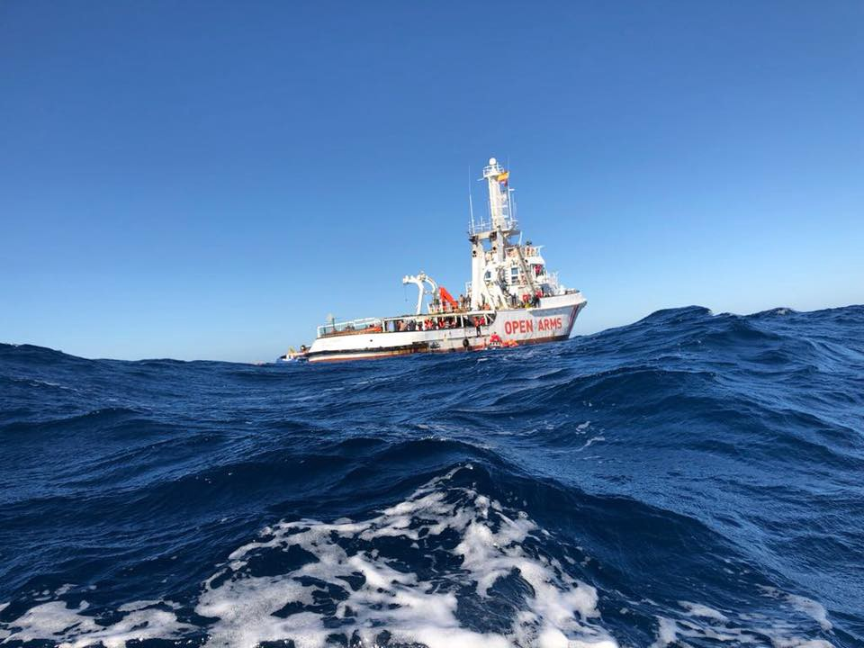
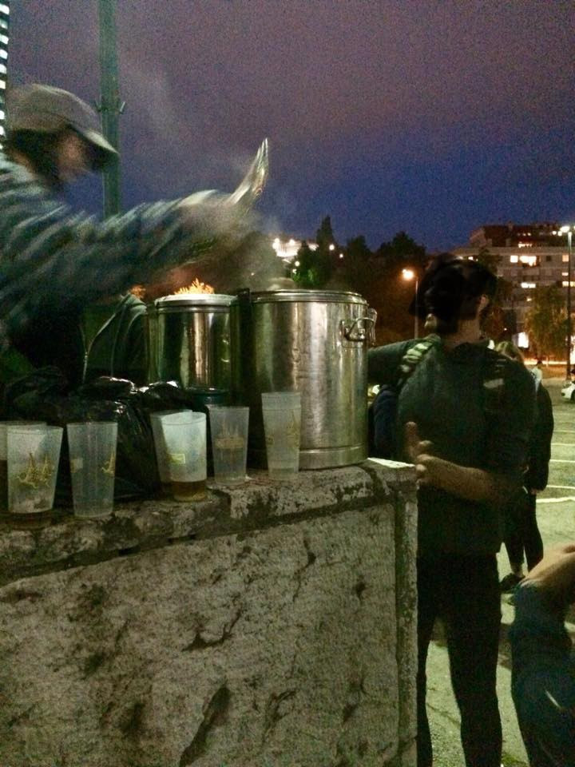
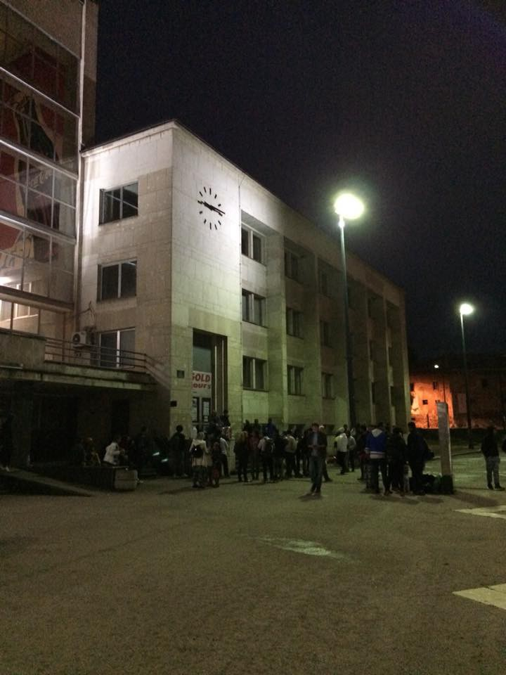

### AYS Daily Digest 28/06/2018: Is this the Europe that we want?

_First day of EU summit ends with no results / Libya creates its own SAR area / Malta to impede navigation to Lifeline / Proactiva impeded docking in Italy and Malta / Salvamento Maritímo carrying on Search and Rescue activities in the Western Mediterranean / Threat of Pikpa closure / Updates from Bosnia, Italy, and France / And more news…_

Photo by Proactiva Open Arms
### **EU**
#### **Italy’s new face and the European summit**

■■■■■■■■■■■■■■ 
> **[MSF Sea](https://twitter.com/MSF_Sea) @ Twitter Says:** 

> > As they meet in #Brussels, #EUCO leaders should not forget that they are talking about human lives. Leaving people to die at sea, denying a safe port to disembark or sending them back to arbitrary detention and violence in #Libya is not humane. 

> **Tweeted at [2018-06-28 14:29:53](https://twitter.com/msf_sea/status/1012342324591038465).** 

■■■■■■■■■■■■■■ 

The first day of the European summit has passed without any clear gains made\. Italy has been de facto reserving its position on the final statement, as the issue of migration could not be handled appropriately, and it has been difficult to make any positive prediction until now, as the [Italian position hardens](http://www.adnkronos.com/fatti/esteri/2018/06/28/linea-rossa-dell-italia-sui-migranti_PK8dxQZGoIZ5hOGZuZ6XqM.html) over the issue of “burden sharing” of migration quotas\. With no clear statement, Italy will not vote in the final decision and the meeting will fail\. The Italian government is set to oppose the decision even without the support of other EU members\.

Moreover, Italy is blocking a second tranche of funding to Turkey worth some three billion Euro, stating that at least 500 million of that needs to be directed to an existing trust fund for Africa\.

Italy has also been invigorated by its wish to reach an agreement for the creation of hotspots in Third Countries, a solution that has found the support of other EU members, particularly in the Visegrad countries and Austria\.

They call for more recognition of the issue of overcrowded centres and shroud their demands to share the number of centres created in language invoking “respect of international laws and human rights\.” This is coming just a few days after [news emerged](https://www.hrw.org/news/2018/06/28/algeria-inhumane-treatment-migrants) of Algeria inhumanely deporting thousands of migrants\. After being arrested randomly — without any checks on their legal status or vulnerabilities —and without food and water, they were forced to march in the desert for kilometres on end\.

> On EU territory, those who are saved, according to international law, should be taken charge of, on the basis of a shared effort, through the transfer in controlled centres set up in Member States, only on a voluntary basis, where rapid and secure processing would allow, with full EU support, to distinguish between irregular migrants, who will be returned, and those in need of international protection, for whom the principle of solidarity would apply\. All the measures in the context of these controlled centres, including relocation and resettlement, will be on a voluntary basis, without prejudice to the Dublin reform\. 

Finally, the reform of the Dublin Regulation has emerged as another hot issue\. EU authorities have found it difficult to reach agreement, even while recognizing the need to establish external borders and avoid having countries of entry carry the “burden” of arrivals alone\.

> “ _\[…\] secondary movements of asylum seekers between Member States risk jeopardising the integrity of the Common European Asylum System and the Schengen acquis\. Member States should take all necessary internal legislative and administrative measures to counter such movements and to closely cooperate amongst each other to that end\._ ” 

The full daily report can be found at this [link](http://www.consilium.europa.eu/media/35936/28-euco-final-conclusions-en.pdf) \.
### **LIBYA**

Libya has declared and defined its SAR area in the Mediterranean, according to [media reports](http://www.vita.it/it/article/2018/06/28/la-libia-ha-dichiarato-la-sua-zona-sar-lo-conferma-limo/147392/) and the International Maritime Organization \(IMO\), making it even more difficult for NGOs to operate at sea and, most importantly, increasing the risks for those who are trapped in the country\.

Libya has communicated not only the relevant information to the Global Integrated Shipping Information System, or GISIS, a global SAR plan, meaning that the country has registered a national Libyan authority, but also that the country has indicated a national MRCC based at the international airport in Tripoli to conduct and manage SAR operations\. The centre is in reality a joint rescue co\-ordination centre \(JRCC\), managed by armed forces and other civil authorities\.

Major concerns are raised by the fact that Libya still cannot be considered a “place of safety,” with recent testimonies of people on board Proactiva and Lifeline who refused to send back those rescued to a future of torture, rape and exploitation\. Moreover, the competence and humanity of the LCG are clearly absent given the long list of attacks to NGOs staff and to people in distress \(the most well known, sadly, is the one of the 6th November 2017, when 50 people died during a “rescue” operation\) \.

On the 8th June, UN Security Council sanctioned 6 people belonging to networks of human trafficking in Libya, among them is Abd al Rahman al Milad, head of the LCG in Zawiyah, financed by the EU\.

This news can only go along with the decision of the Italian government to donate 12 patrol vessels to Libyan authorities, together with offering to train the personnel on board \(not mentioning the absurd unilateral decision taken by Salvini to create hotspots in the territory\) \.
### **MALTA**

[Mission Lifeline’s captain will be heard in court](https://www.timesofmalta.com/mobile/articles/view/20180628/local/migrant-rescue-boat-captain-interviewed-to-be-released-on-bail.683046?ext=html&utm_source=tom&utm_campaign=top5&utm_medium=widget) on Monday morning and, apparently, mainly charged with problems related to the registration of the vessel\. While the boat has been seized and impeded navigation, it seems strange to believe that it is just a problem of registration\.

As Maltese authorities have stated that investigations must be carried out to assess whether entities using their port act in compliance with international law \(including the issue of the registration\), “Malta cannot allow entities, whose structure might be similar to that being subject to investigations, to make use of Malta as their port of operations, and to enter or leave the port,” de facto shutting down their port\.

Forced to stay on the island is also the Seawatch vessel, whose documentation is being checked after docking at the port of the island for a change in personnel\.

Proactiva Open Arms was denied docking in Italy and Malta\. The NGO has saved more than 5000 lives in one year, in collaboration with the Italian Coast Guard\. It has been freed by the same Italian authorities who, together with the European ones, don’t want witnesses of their cruel policy\.

Astral, in support of Proactiva, has left Malta today to sail towards the SAR, [carrying four members of the EU Parliament](https://twitter.com/openarms_fund/status/1012341035786297344) on board\.
### **SEA**

■■■■■■■■■■■■■■ 
> **[Flavio Di Giacomo](https://twitter.com/fladig) @ Twitter Says:** 

> > Arrivals by sea to EU:

2014: 247.263
2015: 1.070.625
2016: 360.329
2017: 172.362
2018 (until 24/06): 42.845

Total EU population: 500 million.

This is not a migration crisis, but rather a humanitarian one: more than 16.000 migrants have died or gone missing at sea since 2014. 

> **Tweeted at [2018-06-28 10:30:53](https://twitter.com/fladig/status/1012282178745651201).** 

■■■■■■■■■■■■■■ 

[705 people were saved](https://twitter.com/HelenaMaleno/status/1012244766824771584) by Salvamento in the Gibraltar Strait, 430 people rescued in the Alborán, and more than 600 people saved by the Moroccan navy, just in the last 3 days\.

A total of [82 people](https://twitter.com/salvamentogob/status/1012336049626984449) were rescued by Salvamento today in the Alborán\.

■■■■■■■■■■■■■■ 
> **[SALVAMENTO MARÍTIMO](https://twitter.com/salvamentogob) @ Twitter Says:** 

> > Salvamar Mimosa ha rescatado a 12 hombres de origen argelino de una patera localizada por un pesquero 42' al sureste de Cabo de Palos. Los están trasladando a #Cartagena donde llegarán alrededor de las 18. 45 horas. https://t.co/uLjZhpFYLL 

> **Tweeted at [2018-06-28 13:50:56](https://twitter.com/salvamentogob/status/1012332525438537729).** 

■■■■■■■■■■■■■■ 

■■■■■■■■■■■■■■ 
> **[SALVAMENTO MARÍTIMO](https://twitter.com/salvamentogob) @ Twitter Says:** 

> > Patera con 12 personas rescatada en el Estrecho por Guardamar Concepción Arenal (8h+4m) subsaharianos en buen estado. Van a ser trasladados a Barbate https://t.co/Cwwx9f47Ip 

> **Tweeted at [2018-06-28 10:57:51](https://twitter.com/salvamentogob/status/1012288964890423296).** 

■■■■■■■■■■■■■■ 

### **TURKEY**

### **GREECE**
#### Arrivals

86 people arrived on Lesvos in two different boats\.

#### _Lesvos_

[Pikpa is under threat of closure](https://twitter.com/rspaegean/status/1012355817310507008) \!
#### Islands

[See her a snapshot](https://mdmgreece.gr/app/uploads/2018/06/SnapShot_EN.pdf) on the health conditions on the islands, where, at the moment, 16,628 people are living \(nearly 60% of arrivals are women and children\), according to MDM\. The most common health issues refer to respiratory infections, mental health conditions, sexual and gender based violence, and cardiological diseases\.

Tsipras and Merkel [reached an agreement](http://www.ekathimerini.com/230137/article/ekathimerini/news/greece-reaches-deal-with-germanys-merkel-to-take-back-asylum-seekers-ft) to shorten the “secondary movement” of refugees who arrive to Greece but then proceed further North, basically making it “easier” for Germany to send asylum seekers back to other European countries — even though the agreement itself won’t have a major impact on Greece, it could represent a positive step to alleviate Merkel’s political burden, represented by the conservative CSU who will fight to impose stricter border controls if the Chancellor fails to find an agreement with other EU countries on the number of migrants to share\.
### **BOSNIA & HERZEGOVINA**
#### Updates from Velika Kladusa

#### Update from Sarajevo

It has been rainy, cold and grey for over a week now\. Volunteers are serving hot tea twice a day at the train station, after lunch and dinner distribution\. It’s unusually cold for this time of year and hopefully the sun will be back soon\. People, as well young men as families, are sleeping rough\. Newly arrived people are given blankets every evening, but considering the wet and cold weather that’s not nearly enough\.

Due to the conditions tensions are increasing among as well refugees but also from the police\. The resources are low and the needs big\. A new camp close to Sarajevo will open within a couple of weeks or less depending on different sources, but for now the work on the ground will continue as usual\. Even if a camp opens, it doesn’t necessarily mean that people are willing to go there given their previous experiences from camps in Greece and Serbia\.

Tomorrow a meeting will be held between UNHCR and other relevant parties, so, after that, more information about future developments \(or empty promises\) might be available\.

Photo by AYS
### **ITALY**

Exploitation in fields is no news for Italy, but, this time, field workers \(migrants\) in the northern area of Saluzzo are asking the mayor for help\.

368 places were set up in a former barracks in town, but the number of those who need assistance is way over that limit\. [200 people are, in fact, sleeping in makeshift tents](http://torino.repubblica.it/cronaca/2018/06/27/news/saluzzo_il_grido_di_dolore_dei_braccianti_africani_in_200_accampati_all_aperto_non_si_puo_vivere_cosi_il_sindaco_ci_aiu-200216788/) , with no running water, toilets, and sometimes even without a tent, and are crying for help as they are there “to work and not to create problems\.”
#### Pordenone

Some good news has come in [the Court of Trieste accepting lawyers’ appeal against the Questura of Pordenone](https://www.facebook.com/retesolidalepn/photos/a.1652837388330414.1073741829.1651933545087465/2099458633668285/?type=3&theater) \. They are now forced to stop asking asylum applicants for the declaration of hospitality and stay \(ospitalità e dimora\): a document that is unnecessary and could never be produced\. For lawyers, this represents a positive pilot case\.
### **FRANCE**
#### Calais police force

[CRS officers avoiding comments](https://www.facebook.com/RefugeeInfoBus/videos/vb.1756144974620923/2172522246316525/?type=2&theater) and answers when questioned about the absence of their identification number
#### People left without belongings after clearance in Dunkirk

A clearance action this morning left more than 200 people with no personal belongings at all\.

Please considering donating — you can find a list of items urgently needed in the Facebook post below\.

A similar violent action happened in Calais earlier this week too\.

#### Food donations needed in Paris

[Food is needed in Paris](https://www.facebook.com/permalink.php?story_fbid=919175558283217&id=598228360377940&hc_location=ufi) , particularly at La Chapelle, where today volunteers had difficulty feeding the 600–700 people who came for breakfast\. In one hour the food was all gone, as some of the migrants hadn’t eaten since the morning before\. They are also struggling to drink potable water as the administration had cut off access to water\. Please, help if you can\!
#### Menton\-Garavan \(French\-Italian border\)

A third monitoring action \(after two in February and March\) was carried out by French and Italian associations from June 24th to 26th in the area around Menton and Ventimiglia\.

The findings \(related to the behaviour of border police agents\) are:
- selective checks \(for example, according to the colour of the skin\) carried out regularly on trains coming from Ventimiglia, even if this type of check is prohibited;
- pushback of 157 people to Italy, without giving them the possibility to apply for asylum and without having examined their individual situations \(these practices were judged illegal by the Administrative Court of Nice, on May 2nd, 2018\);
- deprivation of the freedom of movement of 76 people at the police premises in Menton, in appalling conditions, depriving them of any right\. This deprivation of liberty lasted up to 14 hours, largely exceeding the duration of four hours considered admissible by the Council of State in July 2017;
- the police did not take into consideration the minor age of 11 young migrants, who were illegally returned to Italy and were subsequently brought back by the Italian police force to France\.

### **AFGHANISTAN**

The European Asylum Support Office \(EASO\) has published a “country\-guideline” document for Afghanistan, which can be useful to understand what factors should be taken into account for asylum decisions\.

The report includes a list of potential actors of persecution or serious harm as well as a list of potential acts that could be connected to the very same subjects\. It also includes lists of other non\-state actors that could cause serious harm, exploitation, or persecution, together with tables of risk assessment, depending on vulnerable groups, region of origin, and more\. See the guide below:

**We strive to echo correct news from the ground through collaboration and fairness\.**

**Every effort has been made to credit organizations and individuals with regard to the supply of information, video, and photo material \(in cases where the source wanted to be accredited\) \. Please notify us regarding corrections\.**

**If there’s anything you want to share or comment, contact us through Facebook or write to: areyousyrious@gmail\.com**

_Converted [Medium Post](https://medium.com/are-you-syrious/ays-daily-digest-28-06-2018-is-this-the-europe-that-we-want-9423bb214dfe) by [ZMediumToMarkdown](https://github.com/ZhgChgLi/ZMediumToMarkdown)._
