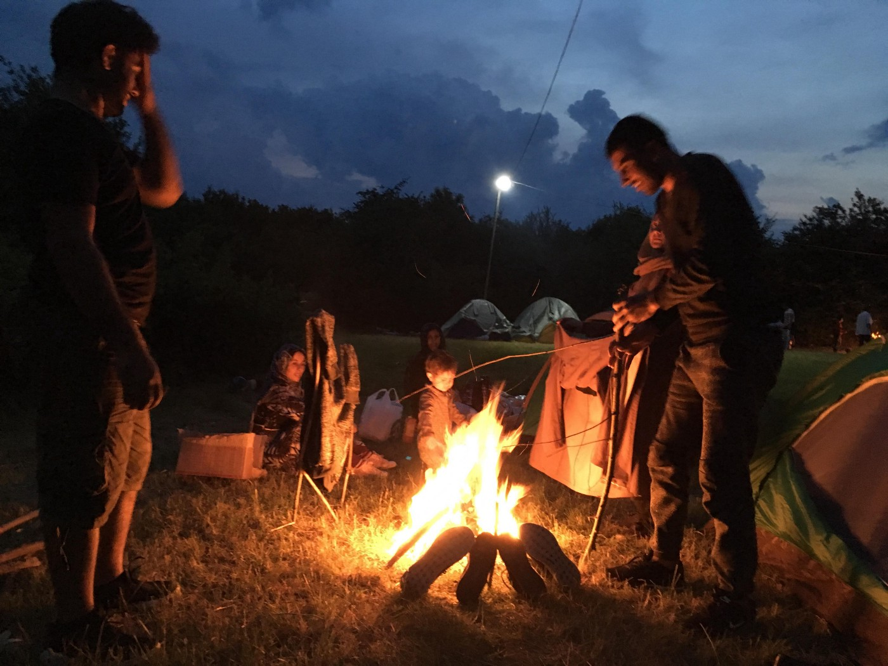

### DAILY DIGEST 29/06/2018: Fear over compassion — the EU choice

The EU have chosen fear over compassion, AI says // 100 people have died in a shipwreck // Over the last two weeks 320 human beings drowned at sea // Political move against solidarity on Lesvos // Call to rapid action by the Greek authorities to improve reception conditions, especially in the hotspots

Camp in Velika Kladuša where several hundred people sleeps in tents in the field\. Photo by AYS\.
### Feature

On Friday afternoon, A\., a young migrant from Pakistan who arrived in Bosnia several months ago, contacted one of the AYS volunteers in Sarajevo asking for help\. For the last two weeks he had been staying in the Delijaš Asylum Center, about 20 kilometres from Sarajevo city centre, where he was waiting to get his asylum papers and to start the procedure\.

He has been travelling, alone, for over two years\. Now he is 18 years old\. He is a very nice kid, polite, speaks good English, funny and always eager to help volunteers\. After he arrived in Bosnia, he lived on the streets because the government of this small country has done little or nothing to find a place for all the people who have arrived this year, numbering over 7,200 according to the official data\. Probably less than 200 have a place to stay\.

The State Ministry of Security is in charge of asylum seekers, even though the country has a Ministry for Refugees and Human Rights\. The Ministry in charge claims that nobody wants to stay in Bosnia\. At the same time, the barely functioning state apparatus is preventing those who want to apply for asylum from doing so\. So far, about 610 people have managed to apply for asylum\. The procedure is not clear to anybody involved, but even when it is clear it is not implemented in practice as regulated by law\.

Nevertheless, A\. wants asylum\. He is tired of travelling alone, he likes the people in Bosnia and he is ready to try to stay\. That is why he went to the asylum centre two weeks ago\. Before he left, he hurt his leg and he was hoping to get medical help in the centre\.

The centre is of the open type, but not accessible for anybody but state employees\. There is no cell connection or WiFi, and it is situated in a very remote area\. It is not very clear what life inside the centre is like, but from what asylum seekers told AYS volunteers, it is not good\. Food is scarce, it is very cold, far away, and the people who are working inside do not always treat residents in a professional manner\.

That is why some, even though desperate to stay inside, leave the place and the only option that is left for them is living in the streets\.

A\. was living in Delijaš, determined to get asylum, but on Friday the manager accused him of stealing something \(he claims he did not do it\) and kicked him out, leaving A\. on the streets in the middle of a cold and rainy day\.

It was almost 4 pm when A\. spoke with the AYS volunteer\. He was at the UNHCR office, where they told him that working hours were over\. When volunteers found him in the evening, his legs were in a very bad condition\. He could not walk any more and he was immediately taken to the emergency room, and later on, accommodated in a safe house run by volunteers, where he will have to stay for several days before being able to stand on his feet\. He will need the doctor all the time\. The doctor is a volunteer, too\.

He is just another victim of total negligence by the Bosnian government, but also the big NGOs that are working with the government, such as the UNHCR and IOM, and the small ones who are working with them\. Unfortunately, the situation is similar in many other European countries\.

The governments of small countries like Bosnia, which is not an EU member state, are forced to listen to what member states are telling them to do\. At the same time, the government in Bosnia is not functional, is well known for its corruption and the incompetence of the bureaucratic system deeply marked by nepotism and politicized to a level that is hard to describe\. But Bosnia now is the last stop before the EU for many people\.

On Friday, the EU leaders sent a clear message to all those stranded on the road, but also to countries that are not part of the Union, that the borders will stay closed\. As [Amnesty International put it](http://www.amnesty.eu/en/news/press-releases/all/eu-new-migration-plans-dangerous-and-miss-the-point-1126/#.WzdKXi17GqD) , the EU leaders have chosen “fear over compassion”\.

As the EU summit ended, another boat sank off Libya, leading to the drowning of at least 100 people, including children\.

> “The only thing European states appear to have agreed on is to block people at the doorstep of Europe regardless of how vulnerable they are, or what horrors they are escaping,” said Karline Kleijer, MSF’s emergencies chief\. 

For all the people stranded in Bosnia, but also Serbia, Montenegro and Albania, this plan means they will be forced to use dangerous routes in order to reach the countries they dream about, where in some cases members of their families are living, or to stay in non\-functional states where their basic rights are violated in every possible way\.

Volunteers are there to help\. If you can join them, please write to AYS or the Souls of Sarajevo group\. People stranded in Bosnia need your help\. It is time for solidarity\.
### Sea

Today **100 people died in a shipwreck in the Mediterranean** after Italy did not notify the rescue ship Open Arms\. They waited in the water for an hour, swimming as best they could, waiting for help that didn’t arrive\.

Over the last two weeks, **320 human beings drowned** because of the closed borders\.

Meanwhile, criminalization of rescue efforts continues\. The captain of the rescue ship MV Lifeline will be charged in court, the [Times of Malta](https://www.timesofmalta.com/mobile/articles/view/20180628/local/migrant-rescue-boat-captain-interviewed-to-be-released-on-bail.683046?ext=html) has learnt\.

The captain will be charged mainly with issues related to the vessel’s registration, Aditus director and human rights lawyer Neil Falzon told the Times of Malta\.

IOM, the UN Migration Agency, reports that **44,957 migrants and refugees entered Europe by the sea in 2018** through 27 June, with just around 38 per cent arriving in Italy and the remainder divided between Greece \(29%\) and Spain \(33%\) \.
### Greece

In the past two weeks, there have been 490 new arrivals on Samos\.

The camp, which has a total capacity of 648 people according to the Hellenic Republic Ministry of Interior, is currently responsible for 2,516 human beings, according to [Samos volunteers](https://www.facebook.com/samosvolunteers/posts/1007102189467941) , who are the greatest help for most of them\.

[Lesvos Solidarity — Pikpa](https://www.facebook.com/.../a.18000.../2203327689895948/...) reacted to the announcement that Pikpa camp will be closed\. The closing down of the camp was decided on the basis of a report by the health inspection which found shortcomings in the common kitchen handled by the residents, a broken net in the food distribution area and a leakage to a water tank for washing machines\.

However, Lesvos Solidarity considers this decision rather a political move “by certain actors who are opposing the model of solidarity that Pikpa camp represents”\.

> “It is the conditions in Moria camp that really require an intervention by the regional governor for public health and environmental reasons\. We consider this decision profoundly unfounded and unfair and a major blow to all solidarity actions on the island\. We call on the regional governor to reconsider the decision\. In any case, we remain as determined as ever to continue our support for the symbol of solidarity that is Pikpa camp and to continue our actions in support of refugees and locals\. 

> According to the agreement, asylum seekers who have already applied for asylum in Greece and are smuggling onwards to Germany can be returned more easily to Greece if they are caught by the German police at the border\. The details are unclear so far\. This will be resolved in the next 4 weeks\. In return, Germany has agreed to accept more Dublin family reunification requests\. In recent months Germany has rejected a lot of them” 

Dunja Mijatović, the Council of Europe Human Rights Commissioner, visited Greece last week [stating](https://www.coe.int/.../greece-immediate-action-needed-to...) that “rapid action by the Greek authorities is required to improve migrants’ reception conditions, especially in the hotspots”\.

> “I am very concerned by the substandard living conditions prevailing in the Reception and Identification Centre of Moria, which is running at well over three times its capacity and has already expanded informally into the surrounding area, putting the human rights of its residents at risk\. 

> The combination of overcrowding, insecurity, poor hygienic conditions, the approaching high summer temperatures, and residents’ uncertainty regarding their future may lead to very serious problems if not addressed immediately\.” 

Mijatović called the Greek authorities to transfer more people to the mainland and to speed up the processing of asylum applications, “whilst ensuring all necessary safeguards for fair procedures are in place, increase the capacities of reception facilities across the country, and improve their quality”\.

GAS Dublin Unit announced on Friday that they plan to relaunch free Family Reunification flights and in fact have already started prebooking them\.

They will share an announcement about this, with more details, on their website soon\.

People will be contacted by phone about when their flights will depart, so no need for them to go to travel agencies on their own\.

Refugee Rescue is hiring [volunteer interpreters](https://www.facebook.com/.../a.12094.../1763673657033410/...) to join our crew aboard Mo Chara this summer\!
### France

The results of a poll for FranceInfo on the reception of migrants in France show “a decline in values of solidarity”\.

Six out of ten French people believe that France has too many migrants, according to an Odoxa\-Dentsu Consulting poll for FranceInfo and Le Figaro\.

[The Locker](https://www.facebook.com/groups/177642579245883/permalink/645048365838633/) needs help

> “We continue to receive our migrants who are in an emergency situation\. Donations from you, week to week, are necessary and vital\. The Locker room is a breathing space thanks to you\!
 

> We are zero hygiene products: Shampoo, Shower Gel, soap, toothpaste, toothbrushes, razors, shaving cream, Deodorant, body cream\.
 

> For Children: diapers and milk\.
 

> Also: Pants \(jeans\) Size 38 to 42, shoes 40 to 45, T\-shirts and shirts s, sweatpants, boxers \(boxers\), belts, caps, socks\.
 

> To participate as a volunteer, note on the list by SMS at 06 03 02 83 72\.
 

> Thank you to associations, groups and people for your donations and support\.
 

> Read the following, you will find all the information and complete list of the locker room emergencies\.
 

> Thank you all for your solidarity\!” 

### The Netherlands

Two [positive court rulings](https://www.facebook.com/…/a.65725690430…/1944715518895335/…) were handed down yesterday by the court in Rotterdam as well as the Administrative Court\.

Refugees who submit a second asylum application \(HASA\) have the right to accommodation in an asylum seekers centre \(AZC\) \. Up until now refugees had to live in the streets after filing a HASA without being eligible to work or to any money\.
### Belgium

Since May, recipients of humanitarian visas and those who received regularization can now work as soon as they have received the annually renewable residence permit\.

Previously, individuals had to wait for several years before being granted work permits\. According to the media, 2,125 humanitarian visas were issued in Belgium in 2017 \(compared to 277 in 2016\), mainly to Syrians\.

**We strive to echo correct news from the ground through collaboration and fairness\.**

**Every effort has been made to credit organizations and individuals with regard to the supply of information, video, and photo material \(in cases where the source wanted to be accredited\) \. Please notify us regarding corrections\.**

**If there’s anything you want to share or comment, contact us through Facebook or write to: areyousyrious@gmail\.com**

_Converted [Medium Post](https://medium.com/are-you-syrious/daily-digest-29-06-2018-fear-over-compassion-the-eu-choice-59f04ce16940) by [ZMediumToMarkdown](https://github.com/ZhgChgLi/ZMediumToMarkdown)._
