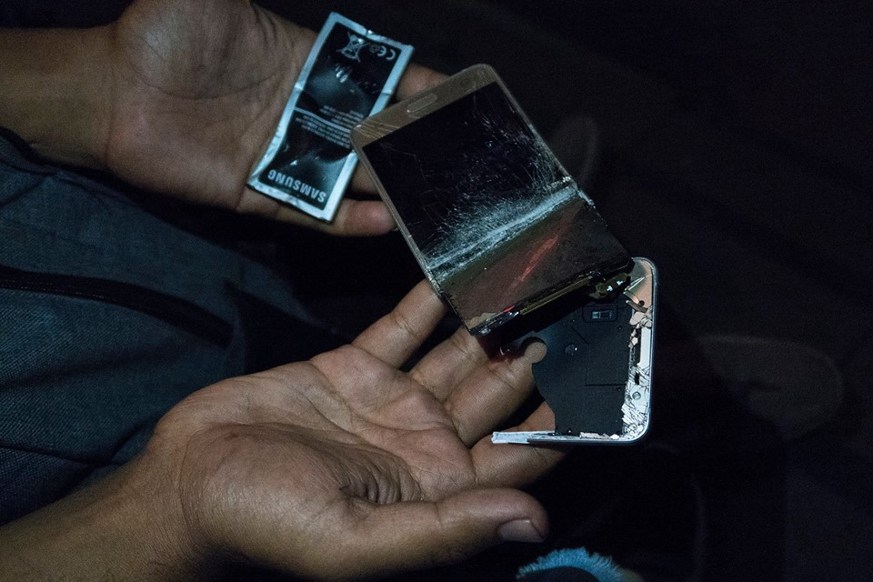
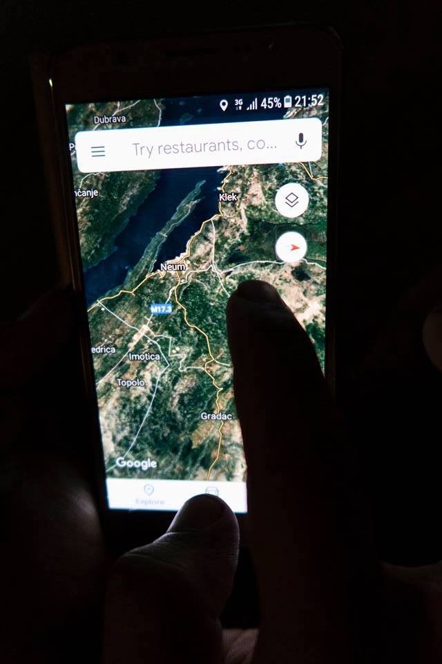
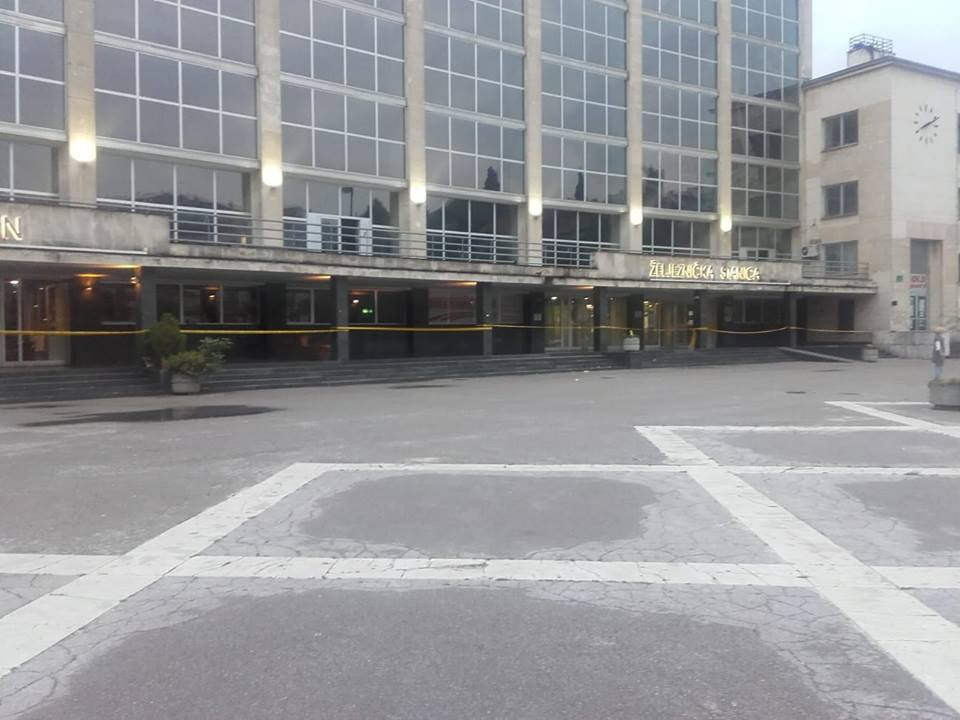
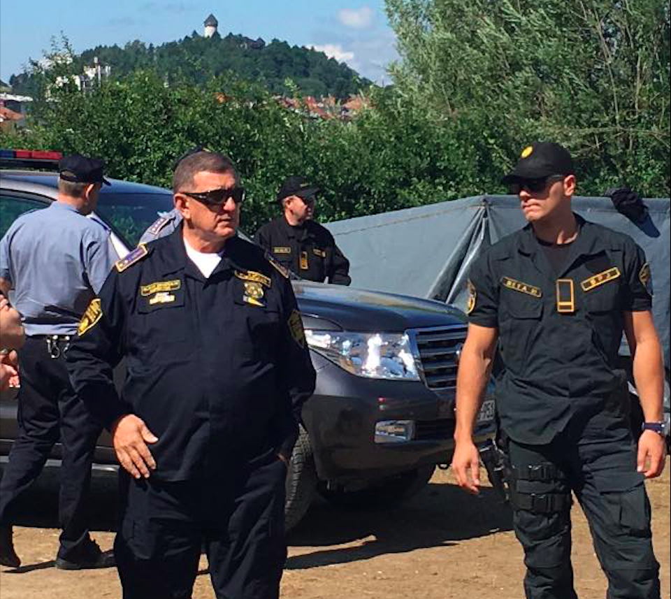
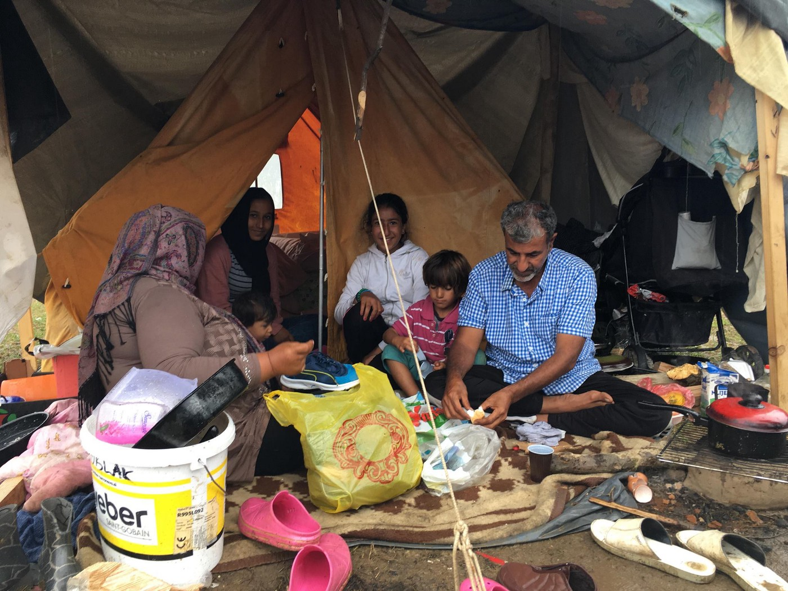
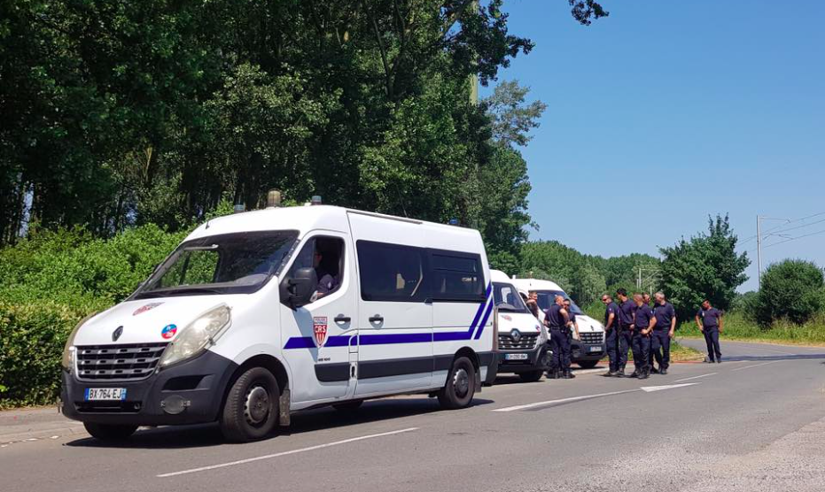
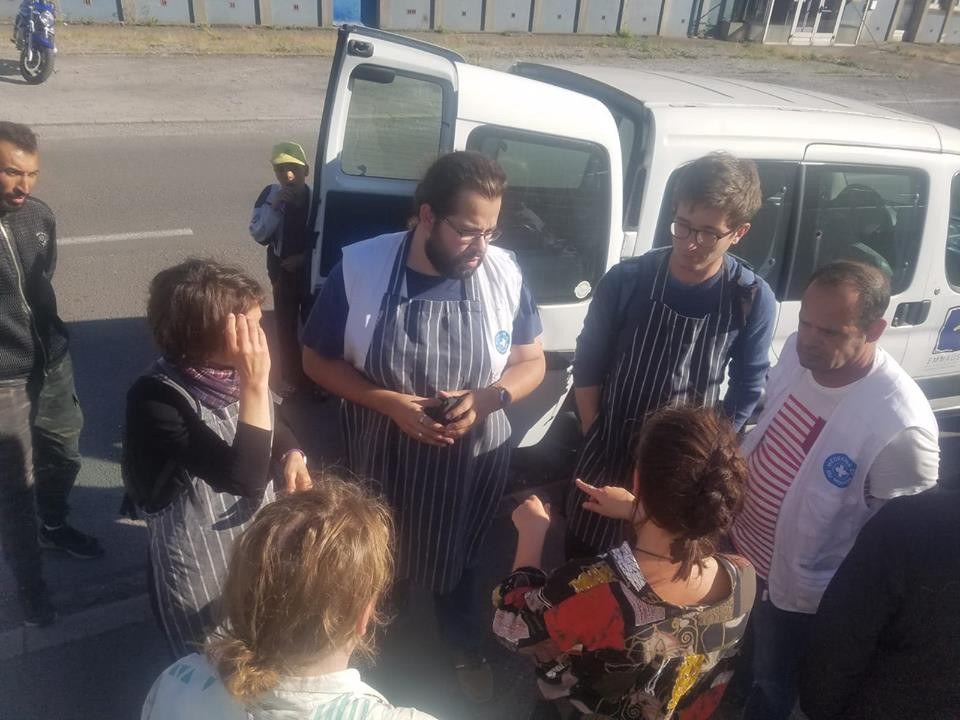
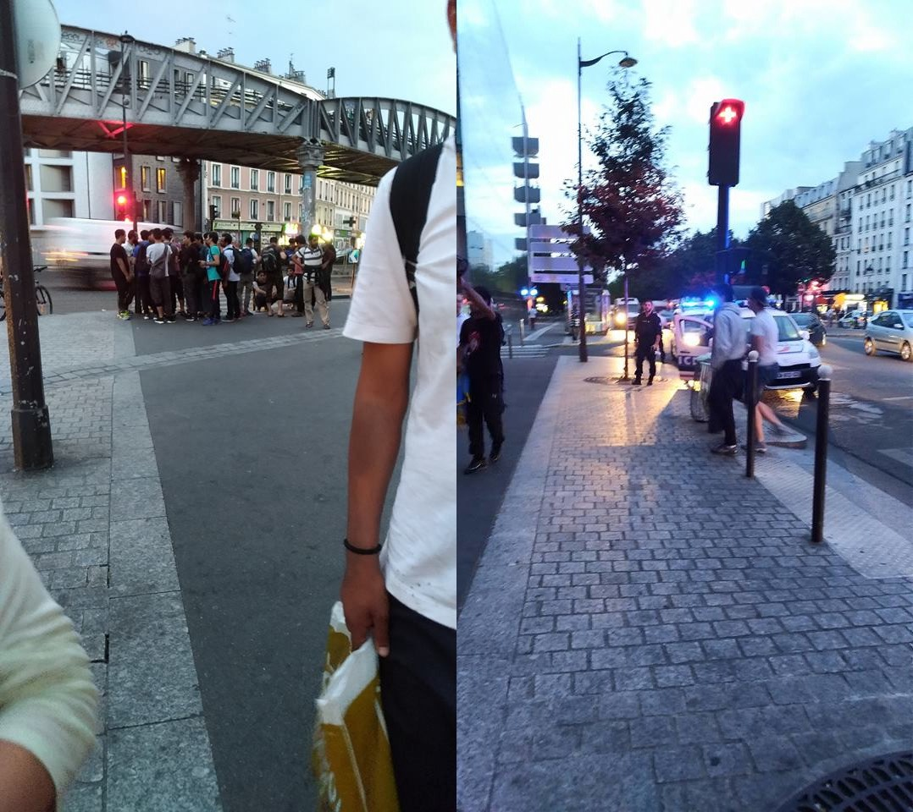

### AYS daily digest 1/7/2018: Norway deports a journalist to Kabul, he comes back only to be beaten by Croatian police

_Minister Salvini calls European nationalists to unite against refugees // Lifeline captain to appear in court, could be facing imprisonment // Refugees evicted from Sarajevo train station area // Afghans complain to the European Commission against Dublin deportations to Bulgaria // Food distribution denied in Dunkirk // Refugee children held in detention in Switzerland_

He paid 200 euros for this phone in Greece\. Police in Croatia destroyed it mercilessly\. Photo: AYS
#### Feature: Croatian police find new ways to torture refugees

J\. and his friend have been back in Sarajevo for a few days now, after being pushed back from Croatia\. They went from the Bosnian town of Čapljina to the Croatian town of Metković, only to find themselves with broken phones, no money and abused in the back of a car\. Back in the border area of Neum, no help was to be found from Bosnian police\.

> The 21\-year\-old J\. is not only back in Sarajevo for the second time, but also back in Europe, after being deported from Norway to Kabul in early 2017\. 

> — They \(Norway/EU\) have taken everything from me, I have nothing in Afghanistan — he says\. 

It is J\.’s second day back in Sarajevo\. He did not expect to find himself in Bosnia’s capital this soon, if ever, again\. He is sitting on the stairs outside of the railway station, where volunteers are handing out food and blankets every day\. He is holding a broken telephone in his hands\. Croatian police broke it into pieces when they found J\. and his friend in the border city of Metković in Croatia\. The phone he bought in Greece for more than 200 euros is useless now\. All of his photos and personal data is gone\.

J\. and his friend walked “in the jungle” to Metković from Čapljina, another city in the area of Neum, but on the Bosnian side of the border\. When the police found them it was around noon on 27th, and they did not offer them a chance to claim asylum or go to a camp in Croatia\.

> They put us in a big, closed car and drove one hour\. After that, we reached the forest and he was going fast in the car and then he braked several times\. They think we are animals — J\. says about Croatian police\. 

J\. and his friend fell down in the back of the car every time the policemen braked\. This went on for more than an hour, J\. estimates\. After more than an hour they stopped the car and J\. and his friend waited in the back of the car for about ten minutes\. The policemen beat the car from the outside\.

J\. gesticulates with his fists in the air in front of him\. “Boom, boom” it sounded like\. They were terrified and his friend started crying, as he was asking J\. what would happen next\.

After ten minutes or a bit more, the policemen opened the car\. They had changed clothes, from the uniforms they had when they forced them into the car in Metković\. Now they were dressed in black clothes and had put on glasses covering their eyes\.

> It was so scary\. One of the policemen broke the phone and the other one was laughing\. We asked for water, but they did not give us anything\. Then they said that we have to walk back to Bosnia\. 

The Croatian police treated them roughly, but instead of using their fists, they used the car to beat J\. and his friend up\. In this way, J\. says, he cannot say that he was abused by some specific person\.

> The policemen were smart\. He beat me inside the car, with the car, instead of with his hands\. The police were thinking that in this way I could not report them\. 

J\. and his friend were so dirty after this incident that they were swimming in the river when they walked towards the city of Neum\. They met a local person, who said that the distance was too long to walk\. The local who stopped wanted 50 euros to give them a lift to Nuem city\.

> We were lucky\. We only had 30 euros\. The local person was kind but he wanted too much money — he says\. 

The police in both Neum and Chapljina checked J\.’s and his friend’s papers, but they did not help them at all\. J\. told them what had happened in Croatia but despite that, they did not do anything\. They slept outdoors one night in Chapljina and early in the morning after they went to the station and asked local people for money for train tickets back to Sarajevo, where AYS met J\.

J\. shows AYS volunteers where he was before being caught by Croatian police\. Photo: AYS

Just as everyone fleeing, the now 21\-years old J\. has his own reasons\. He was a journalist, at the beginning of his career, in Afghanistan\. He studied English and had finished university\. When he left Afghanistan, it was due to persecution because of his job as a journalist, as well as his older brother’s work witch connections to the US\. No one of his family members are still living in Afghanistan\. Despite that, it is not only J\.’s second time in Sarajevo now but also his second time in Europe\.

> I was in Norway for almost two years but then I was deported back to Kabul, just after turning 18, he explains and continues, they put me in a detention center for two months\. 

When he was in the deportation center, he tried to burn down the room and kill himself\. The police stopped him\. J\. has no money, and he does not know what to do next\. He cannot go back to Afghanistan, the country he already fled twice\. At the same time, he cannot go back to Norway or any other Schengen country within five years he was told when he was deported\. He doesn’t think he can stay in Bosnia either since he has never heard of anyone staying here\.

> I have lost everything, I have started drinking and smoking, otherwise, I’ll go crazy\. They \(Norway\) have broken my life\. 

It happened on the night between the 27th and 28th of June\. Between 28th and 29th they slept in Chapljina and then came back to Sarajevo\.
### SEA

**Another 63 lives have been lost at sea today** \(41 people were rescued\) when a boat capsized, off the Libyan coast, as reported by UNHCR\. The news came after IOM posted a summary of first 6 months of 2018, when almost 1000 people died, 204 just this week\! With this new tragedy, the death toll in the Mediterranean has crossed 1,000 for the 4th consecutive year\. A total of 170 people drowned in the Mediterranean in the last 48 hours\. Therefore we support the statement of Proactiva’s Oscar Camps: someone needs to be held responsible for all these lives lost at sea\.

At the same time, their boat Astral is sailing towards Barcelona, passing by Lampedusa, whose coast are patrolled by around 600 police officers\. A clear commitment to militarise borders, according to Miguel Urban Crespo of Podemos party, a member of European Parliament on board\.

■■■■■■■■■■■■■■ 
> **[Miguel Urbán Crespo](https://twitter.com/MiguelUrban) @ Twitter Says:** 

> > 🎥🔴 DIRECTO
Desde el Astral, rumbo al puerto de Barcelona.
Vemos Lampedusa, isla italiana de algo mas de 5.000 habitantes con unos 600 militares y policías encargados de 'controlar' la llegada de migrantes  en una clara apuesta por la militarización en la gestión de fronteras. https://t.co/eDfAgZPAb2 

> **Tweeted at [2018-07-01 10:59:54](https://twitter.com/miguelurban/status/1013376646626381825).** 

■■■■■■■■■■■■■■ 

Tomorrow morning, Lifeline’s captain will be heard in court in Malta, on charges relating to improper ship registration\. According to local news sources, could be facing imprisonment\.

Lifeline was allowed to enter Malta on Wednesday evening with 234 refugees onboard after eight European Union member states, later joined by Norway, agreed to “share” the people onboard\. The vessel had been stranded between Malta and Libya for six days; one person had to be airlifted by Armed Forces of Malta personnel for medical reasons some days ago\.

The NGO’s co\-founder Axel Steier stated on Wednesday that they “always respect international law” and that they have documents, both on the ship and at their offices in Germany, to prove that the claims of the Dutch government in relation to their registration are false\.

■■■■■■■■■■■■■■ 
> **[MISSION LIFELINE](https://twitter.com/SEENOTRETTUNG) @ Twitter Says:** 

> > Since September 2017 we sail with the knowledge of the Dutch authorities under the Dutch flag. Since then we have saved over 900 people. We are not afraid, we have an attitude! [mission-lifeline.de](http://www.mission-lifeline.de) https://t.co/dEW3L86NPV 

> **Tweeted at [2018-07-01 16:50:38](https://twitter.com/seenotrettung/status/1013464908384612352).** 

■■■■■■■■■■■■■■ 

### BULGARIA
#### Complaint against Bulgaria presented to the European Commission
by 14 Afghan asylum seekers

French lawyers at the Paris Bar, Mrs Olfa Ouled and Mr Clément Père presented yesterday to the European Commission and the Committee on Petitions of the European Parliament a complaint against the Bulgarian State under Article 258 of the Treaty on the Functioning of the European Union\. In the name of 14 Afghan citizens, the lawyers will request the Commission to start infringement proceedings against Bulgaria for violating the prohibition of inhuman or degrading treatment or punishment under article 3 of the European Convention on Human Rights and article 4 of the EU Charter of Fundamental Rights, and being in breach of the European common minimum standards for the treatment of asylum seekers and applications\.

The 14 plaintiffs are currently asylum seekers in France\. They have in common that they entered the European Union territory through Bulgaria, where they suffered inhuman and degrading treatment, including physical and psychological violence, undignified living conditions and isolation, at the hands of Bulgarian authorities — while they were trying to exercise their claim to asylum in Europe\. After managing to escape Bulgaria and the ignominious refugee centers where they were held, the 14 plaintiffs arrived in France to seek refuge, only to be placed by the French authorities under the procedure of the Dublin Regulation and ordered to go back to Bulgaria\.

Five days ago, in the presence of the Green/EFA group co\-chair Ska Keller, the lawyers presented a [20\-page report](https://www.euractiv.com/wp-content/uploads/sites/2/2018/06/Report-inhumane-treatment-of-asylum-seekers-in-Bulgaria.pdf) based on testimonies by Afghan asylum\-seekers who have been mistreated in Greece\. In the last months, some French administrative courts have annulled Dublin transfers to Bulgaria\. A Dublin transfer to Bulgaria was also previously annulled by Croatian court, in the case where the lawyer managed to prove inhumane treatment in Bulgarian reception facilities\.
### BOSNIA
#### Refugees evicted from Sarajevo train station area

Today everyone staying at and hanging out in the area surrounding the train station in Sarajevo was evicted by the police\. It was peaceful, but still caused stress among people who now had to find another place for sleeping and also just existing\. It started in the morning, with police telling people to leave and taking their blankets away\. Volunteers quickly went there and brought all blankets they could with them instead, so that they could be washed and re\-used\. After the lunch distribution which took place at the station, volunteers spent the afternoon informing people about that they cannot be at the station for at least three days ahead and that the food will be distributed elsewhere\. A new ad hoc place for distribution was found right away, but a more sustainable solution is needed for the upcoming days\.

Empty train station awaits the opening ceremony for the new train track towards Bihać\. Photo: AYS

The reason behind the eviction is that a new railway line will be opened tomorrow, between Sarajevo and Bihać\. Some sort of opening ceremony or gathering is planned at the station\. Ironically, it is very likely that especially refugees will be taking this line on their way to the Croatian border\.
#### Head of Federal police visits Bihać and Velika Kladuša: “Security is not a problem, humanitarian situation is a problem”

Dragan Lukać \(left\) ensured local people that they won’t be left alone in this crisis\. Photo: volunteers

Dragan Lukać, Director of the Federal Police Administration of Bosnia and Hercegovina paid a visit to the border area, with a special focus on the places where refugees reside\. The visit happened after months of appeals by local people and their representatives, who are calling for more engagement of federal bodies in order to keep the situation in control\.

> Security is under control, police officers are doing their best, but the humanitarian aspect is far our of control\. The images from camps are horrible, these are no conditions to accommodate animals, let alone people\. Federal and international institutions mustn’t allow this — Lukać said after visiting Velika Kladuša and Bihać\. 

There are currently more than 7000 people in Bosnia, most of them gravitating towards makeshift camps in Velika Kladuša and Bihać in order to enter Croatia\. There is no legal way to enter Croatia, whose police officers are acting extremely violently against unarmed people who want to seek safety in European Union\. Many people, including families with small children and other vulnerable groups, are expelled from Croatia and forced to sleep in the dirt while waiting for another opportunity to reach their final destination\. Volunteers are doing their best to provide as much as they can in order to make their everyday life bearable\.

Many families are forced to sleep in makeshift camps at Bosnian side of the Border\. Photo: volunteers
### ITALY
#### Minister Salvini calls European nationalists to unite against refugees

Interior Minister Salvini hold a rally in Pontida, just outside Bergamo \(Lombardia\), the home town of Northern League earlier today\. The magnificent plan he gave birth to is the creation of a “League of Leagues” party in Europe that will put together all nationalist parties, keen to defend “their people” and “their borders”\. Moreover, he added that League would govern for the next 30 years \(we’ll see for how long he will be able to “govern” once the “invasion” is over and the borders militarised\) \.

> “Each one of you is my brother and my sister, the children of each of you are my children,” Salvini told the crowd before closing his speech with an oath, clutching a string of rosary beads\. “Will you swear not to give up until we have liberated the peoples of Europe?” he asked, receiving a unanimous “yes”, in response\.” 

We could add many things here, but we decided to remain polite\. :\)
### FRANCE
#### Food distribution denied in Dunkirk

Police officers denying access to volunteers in Grand Synth \(Dunkirk\) \. Photo: Refugee Community Kitchen

Distribution of food and all essential services have been very difficult in 
Grand Synth \(Dunkirk\) over the last 3 days according to reports of almost all organisations in the field\. Refugee Community Kitchen say they’ve not been allowed access to their normal distribution points where they serve about 300 many families everyday, without notice or any clear reason given\. This is their chronology of the situation:

> FRIDAY
 

> We arrived for our evening food distribution in Grand Synth \(Dunkirk\) and our team and vehicles were completely denied access, as only French nationals were permitted to provide support\. Thankfully a few amazing French volunteers from L’Auberge des Migrants and Médecins du Monde France stepped up, put on aprons and served up our food, otherwise up to 300 people\- including many families\- would have been deprived of hot food\! 

> SATURDAY
 

> After a full day of phone calls, emails and negotiating with the local mayor’s office, we were given security clearance and promised that if we supplied full names and IDs, we would again be allowed to distribute food\. After all that, we were completely denied access again\! The police eventually conceded and allowed us to distribute in a car park outside of the camp entrance and a fantastic inter\-association international team from [Refugee Community Kitchen](https://www.facebook.com/groups/RefugeeCommunityKitchen/?fref=mentions) , L’Auberge des migrants MRS and Help Refugees managed to serve hot food\. 

> SUNDAY
 

> Today we have again been denied access to the site and had to serve in the nearby car park, keeping hundreds of people, including many families with children, nourished with hot food and much needed salad, water and tea in this incredibly hot weather\. 

> Tomorrow, we will no doubt be on the phone, emailing and having meetings in order to get to the bottom of this \(legal?\) new stance, which is so hard to understand after almost THREE years of unbroken food service to the displaced people living in Grand Synth \(Dunkirk\), always with the full support of local government and police\. 

L’Auberge des Migrants and Médecins du Monde France stepped up and served food on Friday\. Photo: Refugee Community Kitchen

Almost all groups and NGO’s on site report similar problems: [L’Auberge des Migrants](https://www.facebook.com/AubergeMigrants/?fref=mentions) have also been forbidden entry, but they say they’re trying to find ways to continue normal work together, despite new circumstances\.
#### What it takes for French police to intervene?

A nasty fight happened in the streets of Paris tonight, after a group of Afghani refugees decided to react against a small group that was stealing and intimidating all other refugees for weeks\. Volunteers intervened in order to prevent escalation of the conflict\. Police arrived and arrested the original perpetrators \(those who were causing trouble for weeks\), while warning all others against taking matters in their own hands\. This escalation, however, was a symptom of a bigger issue: the fact that French police officers rarely intervene in matters among refugees, even when it would make sense for them to step in and make things safer for everyone\.

Only after 30 people decided to take matter in their own hands, French police decided to appear\. Photo: D\.H\.

> I saw a police women screaming at refugees for not calling the police sooner\. And them talking back, telling her that there is no use of them, that they never come\. And this is true\. And this us wrong\. It takes a lynch and a bunch of volunteers, translators and witnesses for French police to act\. Regardless of what they claim, there is only one truth: if you speak French, if you are French, or western European, American, they will react rather quickly in case you are a victim\. If you are not in those categories, then fuck you — a volunteer who was present described the situation bluntly\. 

### SWITZERLAND
#### Children of failed asylum seekers being locked up illegally

We don’t have to look as far as USA to see refugee children being locked up like criminals: Swiss branch of The Local published a [report](https://www.thelocal.ch/20180629/children-of-failed-asylum-seekers-being-locked-up-illegally-report) indicating that that one in five asylum seekers whose request is denied ends up in custody pending extradition\. Sometimes children are detained as well\. Speaking up about this practice, The Control Committee of the National Council said some Swiss cantons had gone against the law by allowing the practice\.

> The lack of reliable data and the lack of awareness of how many children are affected by these illegal detentions in Switzerland is a major source of worry for us,” said Velentina Darbellay\. “We recommend, like the Commission, the outright ban on the imprisonment of families\. The Confederation has the opportunity to comply with its international commitments made at the signing of the Convention on the Rights of the Child in 1997\. — said Valentina Darbellay, head of advocacy for Swiss\-based NGO Terre des hommes\. 

Their reaction to the findings of The Control Committee can be found [here](https://www.tdh.ch/en/node/25987) \.

**We strive to echo correct news from the ground through collaboration and fairness\.**

**Every effort has been made to credit organizations and individuals with regard to the supply of information, video, and photo material \(in cases where the source wanted to be accredited\) \. Please notify us regarding corrections\.**

**If there’s anything you want to share or comment, contact us through Facebook or write to: areyousyrious@gmail\.com**

_Converted [Medium Post](https://medium.com/are-you-syrious/ays-daily-digest-1-7-2018-norway-deports-a-journalist-to-kabul-he-comes-back-only-to-be-beaten-by-fed531716303) by [ZMediumToMarkdown](https://github.com/ZhgChgLi/ZMediumToMarkdown)._
