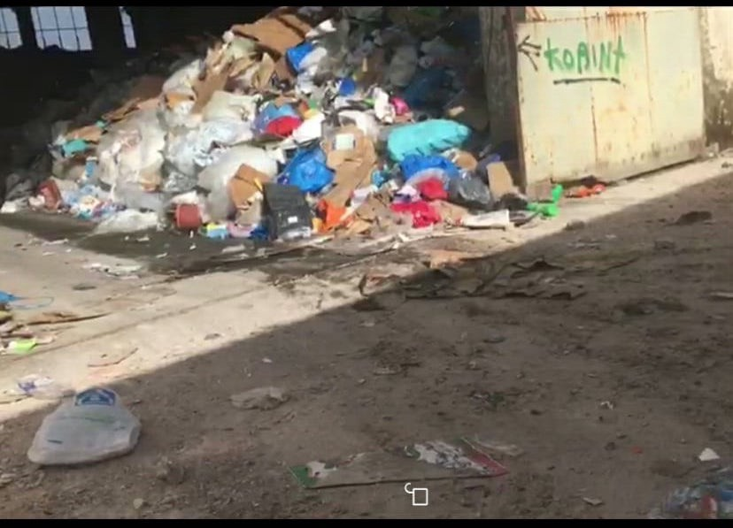
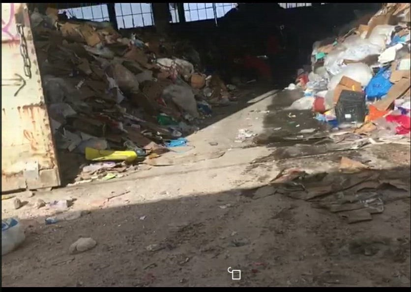

### AYS SPECIAL from Chios: Truth about hotspot Vial

_We received an letter from resident of Vial camp who describes it as “the long term holding facilities”\. This is everday life in one of the overcrowded camps in Greece_

Vial, Chios\.

When refugees arrive on Chios — to so\-called Vial ‘hot spot,’ where asylum seekers are meant to be quickly processed and then transferred onto the mainland — they are often left to wait between six months to one year while their case is processed\.

Soon after they arrive, they discover the truth about the hotspot: this is not a camp, but rather long term holding facilities\.

Despite the abundance of trees around Vial, you can detect the stench of dirt from a distance\. And you wonder, “what is this strange smell”? When you enter the camp you will find that there is a warehouse containing garbage, just by the place where food is distributed\.

It appears that the waste comes from outside the camp, to get processed for recycling in Vial and then shipped to another place\.

How sad this is; the waste has a building, while asylum seekers are sleeping in tents\.

To the refugees’ misfortune, they arrive to Greece to find a widespread disregard for their lives, their health, and their general well\-being\. But particularly shocking is the lack of awareness regarding the irresponsibility of allowing refugees to live alongside mass amounts of refuse\.

Considering these spaces contain massive garbage dumps, how can we choose to put refugees there?

We all know what the risks of waste accumulation in one place are\. These include a heightened risk of disease contraction and harmful microbes infection\. Even certain types of cancer\. Waste sites are also known to draw in bugs, rodents, and other unwanted animals\. These pests and rodents are then living throughout the camp coming in and out of tents and caravans, adding to the transmission of diseases from infected to non\-infected individuals\.

Furthermore, these waste sites are known to leak toxins and chemicals into the air, which can quickly transmit diseases through inhalation\.

These places where waste is collected leave behind a scar of pollution and damage, making life — whether agricultural or human — unviable\.

Are the decision makers aware of this great danger?

This placement of the refugees next to garbage is a deliberate act, and we cannot say that it is a coincidence\.

What is the purpose of putting the refugees beside garbage? Everyone knows very well that the European Union is paying large sums for the medical treatment of refugees in Greece, but unfortunately the refugees have not received adequate medical care\. Even refugees with serious illnesses are told to wait for up to three months to see a doctor\.

In the end, how can we say the European Union has upheld it’s pledge to protect the basic health and safety of the refugee if it cannot even choose an adequate place free of such detrimental waste?

**_\(Taha Salim, Iraq, asylum seeker in Greece, Chios\)_**

_Converted [Medium Post](https://medium.com/are-you-syrious/ays-special-from-chios-truth-about-hotspot-vial-616a5e852a80) by [ZMediumToMarkdown](https://github.com/ZhgChgLi/ZMediumToMarkdown)._
