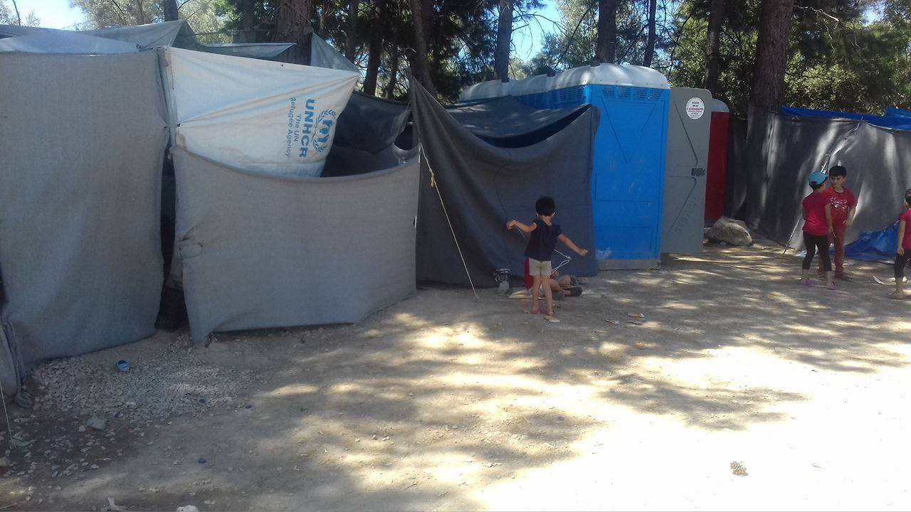

### DAILY DIGEST 2/7/2018: Germany to establish closed centers near its border with Austria

_For the sake of election victory, politicians are ready to do everything\. The best example is what is happening now in Germany\. Unfortunately, it will have domino effect and soon the European Union will start making its final steps toward building barricades to stop people\. For people on the move who are stuck in the Balkans this could turn into real nightmare, with no the end_

Photo by Gabriel Tizon, from the EU border in Velika Kladusa, Bosnia and Herzegovina, where thousands are stack at the moment\.
### Feature

The government in Germany made an agreement to set up transit centers at the border with Austria and to start sending back Dublin cases — immediately\.

If the third countries don’t cooperate, people will be pushed back to Austria before entering German soil\.

As reaction, Austria announced to prepare measures to protect its southern border, depending on what Germany will finally do\.

This move will have domino effect and soon, one after the other, country will make the same or similar decision\. Like we witnessed already in 2016 after the EU — Turkey deal which signified beginning of the process of fortification of Europe\.

After decision was made, Angela Merkel justified it saying that this move will “preserves the spirit of partnership in the European Union while at the same time taking a decisive step toward organizing and managing secondary emigration”\.

It was explained in the media that the government will establish closed centers near its borders where asylum applications would be reviewed quickly\. The deal would require additional agreements with other EU countries for them to accept asylum seekers being sent back to where they first registered claims\. If such agreement are not reached, German authorities would still deny entry to asylum seekers who turn up at the German\-Austrian border, according to the agreement\.

Almost at the same time comes news from Sweden saying that internal border controls will be extended from this week and onwards at several airports and harbors, but also in other locations\.

Since 2015 Sweden have had this kind of so called internal border controls on its borders with other Schengen countries\.

The decision came after the government said that there could be a threat to public order\. In a press release the police said that due to the different situation they see a need to do checks in other locations than just the border areas\. The controls will happen spontaneously without further notice\.

The purpose, as stated in the press release from the police, is to be able to “differentiate among travelers and distinguish between asylum seekers, economic migrants and potential terrorists and other criminals”\.

Meanwhile, people from Germany announced a massive [demo against fortress EU](https://www.facebook.com/events/335710633627340/?active_tab=about) and recent developments, asking for more rescues at sea and not less\. They call everybody to join on Saturday, July 7th\. So far people in Berlin, Bremen, Hanover, Düsseldorf, Frankfurt … joined this initiative\.

Organizers are calling all to come wearing a orange cloth or garment as a sign of your solidarity With Refugees and distress\!

If you want to start your own demos — no matter where — or already in planning, write to [support@seebruecke\.org](mailto:support@seebruecke.org) \.
### Jordan

People of Daraa and the [Amnesty International](https://www.amnesty.org.uk/press-releases/syria-horror-daraa-civilians-and-hospitals-targeted) are warning about “horror in Daraa as civilians and hospitals targeted”\.

They plea to Jordan to open tits border, as it is the only way for people in Daraa to the safety\.

_“Daraa residents are effectively trapped — many of those who are displaced are living in makeshift tents in the searing heat with insufficient food, water or medical care, and with the constant fear of being exposed to attacks at any given point\. Jordan’s border is their only gateway to safety,”_ Lynn Maalouf, Amnesty International’s Middle East Research Director, said:
### Turkey

For the past several days, Turkish residents of Izmir’s Bornova Çamdibi neighborhood have been staging organized attacks on Syrian refugees settled there, [media reports](https://www.evrensel.net/haber/355962/bornova-camdibide-suriyeli-multecilere-saldiri) \.

This is an area dense with immigrants from Balkan countries, as well as Syrians from various ethnicities\. The attacks have specifically targeted Arab Syrians, and have not been reported by the media\.

The last events ostensibly started as a result of local anger against Syrians “being loud” and smoking in a park\. Groups [armed with sticks](https://www.facebook.com/izmirdecevirme/videos/999586076871292/) have been roaming the streets, beating up Syrians that they come across and damaging Syrian stores\. Police have only been attempting to deescalate verbally, but not intervening otherwise; no arrests have been made\.

Locals have been trying to evict Syrians from their homes in the area\. This has been billed in social media as the “Çamdibi cleansing\.”

The Syrian question has recently become hotly debated again, as a result of the recent election\. Anger against Syrian refugees has been stoked by \(the opposition’s\) talk of “sending them back” the fact that after 7 years the government has failed to initiate integration proceedings; and the false news spread by both media and social media\. This leads to the smallest issue becoming explosive, and to neighborhood residents immediately ganging up against and attacking Syrians\.
### EU

The European Commission decided to give [an additional](http://europa.eu/rapid/press-release_IP-18-4342_en.htm) €45\.6 million to Greece and Spain to improve living conditions in hotspots\. Spain will receive €25\.6 million to improve the reception capacity in Ceuta and Melilla, while another €20 million will go to the UNHCR “to improve reception conditions in Greece, notably on the island of Lesvos\.”
### Malta

Captain Claus\-Peter Reisch, from the MV Lifeline rescue ship, is still in Malta where his lawyers are arguing that he suspects the Maltese government “ _is picking on the Lifeline incident to make a political statement at Brussels level, that borders need to be closed and that Europe will not tolerate NGOs rescuing refugees out at sea,_ ” lawyer Cedric Mifsud said\.

Reisch was in command of the Lifeline when it saved 234 people near the Libyan coast on June 21\. The boat, operated by the German charity Mission Lifeline, was able to dock in Malta on June 27 [after the Maltese government initially refused to grant it entry](https://www.dw.com/en/lifeline-migrant-rescue-ship-not-allowed-to-dock-in-malta/a-44404290) , after other countries refused to take the ship in\.
### Sea

[Sea\-Watch](https://sea-watch.org/en/321/) learned today that its vessel is detained in Malta, without any legal grounds provided by authorities\.

Photo by Sea Watch

> “While rescue assets are blocked in port, recent days have become the deadliest this year\. Yesterday, the UNHCR reported another 63 people missing, while on Friday more than 100 people had drowned, among them babies and children\. At the moment there is no suitable rescue asset left in the area of operation, despite the fact that the Sea\-Watch 3 is well equipped and ready to sail\. Sea\-Watch strongly urges the Maltese government to stop hindering rescue workers, as human lives are at acute risk\.” 

Sea Watch crew warns that the recent surge in deaths in the Central Mediterranean _“can be traced directly to the crackdown on the only remaining and reliable rescue capacity, along with European policies of non\-assistance”\._
### Greece

Total of 229 new arrivals were [registered](https://www.facebook.com/AegeanBoatReport/posts/383919242131186) on Monday\.

It the morning, six boats arrived on different islands\. Two boats were picked up outside Agios Dimitris, Lesvos north\. One boat arrived on Samos carrying 46 people\. Three boats arrived on Chios with 129 people\. Also, one boat arrived on Kos with nine people\.

By Aegean Boat Report\.
#### Urgent call from Chios\!

[Jenny Zinovia Kali](https://www.facebook.com/jenny.kali.1?hc_ref=ARQnYlHrU8JS4a0AykomnZXMvDfZ_zi3X4cueqqliglmgn3IYpM2agGZvin8rmiTomc) , a volunteer at Chios, calls Greek government to ack urgently in Vial camp\.

> “ACT NOW to stop this disgrace of human dignity\! 

> This is the situation inside Vial, registration and identification centre in Chios\. This is the real picture the authorities try to hide painstakingly the last few months\. 

> The photos were taken by a refugee today\. He and his family stay in Vial for months and the situation despite the promises by the European Commission is getting worse every single day\. 

> All the new families stay either in summer tents or in sheds or in the fields with just sleeping bags\. Vial has exceeded by far the number of the people it was supposed to host\. People with serious health problems, pregnant women, women with newborn babies, families with young children, psychologically disturbed children are trapped in the prison of Europe which does not even ensures the basic requirements of a camp\. 

> Children’s’ rights concerning food, accommodation and health — not to mention — education are violated\. The authorities of Vial make decisions trying not to infuriate the villagers nearby Vial and do not take into consideration the real needs of the refugees\. 

> The government needs to take action NOW\! Before the situation gets even worse\. 

> Move the people to the mainland if you cannot host them in Chios\. 

> Stop the long term entrapment in a place that is not suitable for people\.” 

Doc Mobile is present in the Oinofyta Camp, the one [we priviously wrote](ays-special-oinofyta-camp-the-overwhelming-sense-of-nothingness-c37d4037a65) about as the place with minimum living conditions, but [this report](https://www.facebook.com/docmobile.org/posts/2040118896060784) adds over that\.

Most of the residents in this camp are Syrian Kurds who arrived from the Greece from Afrin\. Also there are people from different nationalities who got a quick transfer from the hot spots on the island because they are deemed vulnerable\.

> “As we are not allowed in the camp, we set up a clinic in the community centre of Do Your Part\. People were brought in by car, as the centre is half an hour away from the camp\. The clinic started to get really busy\. 
 

>  We saw a lot of children with infections; the parents lack the basics to even treat a fever\. 

> They are concerned about the kids; especially the toddlers don’t eat anymore since they arrived at the camp and even start loosing weight\. 
 

>  They tell us the food distributed to the camps is something we could compare to airplane food, every day the same\. 

> Chronic patients that haven’t had access to medical care in up to a year finally got a chance to talk to a doctor\. 

> One girl did not get her vitamin supplement that she requires after abdominal surgery for one year and a half, which caused her serious health issues\.” 

### France

City of Paris removes water points for refugees, [Solidarité migrants Wilson](https://www.facebook.com/Solidarit%C3%A9-migrants-Wilson-598228360377940/?hc_ref=ARQ7Fge2wjNreez6ZEqO-0S6oAglx8X9-wjo8bJCJfUcUvxibq7NJgkvs7HgWz3xYqs) reports\.

Additionally, French police continues kicking people while they are sleeping in the parks\.

Volunteer Lola Siran [witnessed](https://www.facebook.com/.../a.370049.../462042954267032/...) this type of treatment her self and asked police officers why?

> “The answer I got was: ‘We don’t have the choice, thats the ordered we receive\. We have to make every single person up every morning and prevent them from settling here\. It’s not great, really, but I try to do it as humanely as possible\.’ 

> To the question of whether they were also receiving orders to wake these people up with their foot, the answer was that it was ‘safety reasons’ as they were scared to get hit as a reflex from people being woken up\.” 

#### Switzerland

Switzerland has rejected a second asylum seeker relocation program proposed by the European Union\. According to the SonntagsBlick paper, a spokesperson from the State Secretariat for Migration \(SEM\) has confirmed that currently Switzerland has no plans to renew its commitment to accept asylum seekers from southern European countries\.

**We strive to echo correct news from the ground through collaboration and fairness\.**

**Every effort has been made to credit organizations and individuals with regard to the supply of information, video, and photo material \(in cases where the source wanted to be accredited\) \. Please notify us regarding corrections\.**

**If there’s anything you want to share or comment, contact us through Facebook or write to: areyousyrious@gmail\.com**

_Converted [Medium Post](https://medium.com/are-you-syrious/daily-digest-2-7-2018-germany-to-establish-closed-centers-near-its-border-with-austria-8b9e0a0f7f68) by [ZMediumToMarkdown](https://github.com/ZhgChgLi/ZMediumToMarkdown)._
