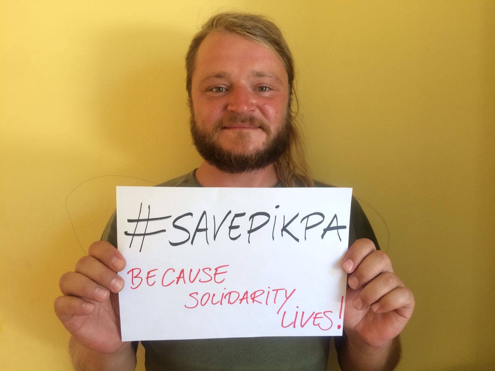
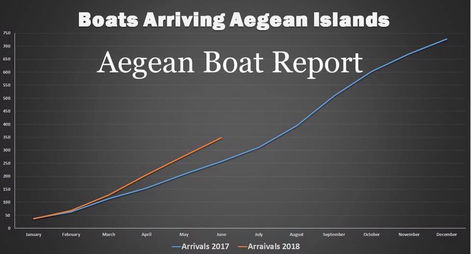
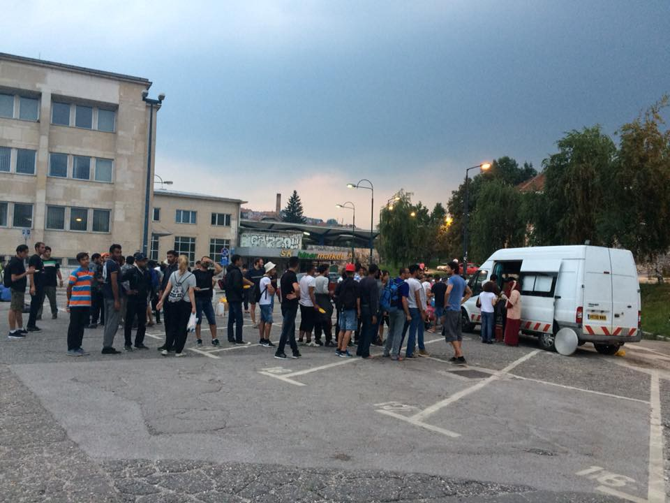
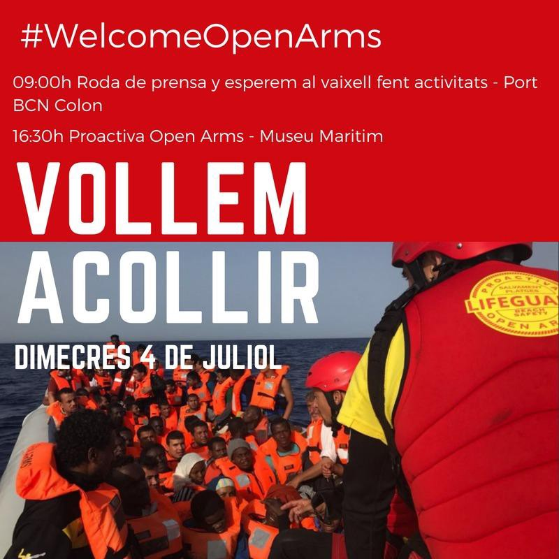
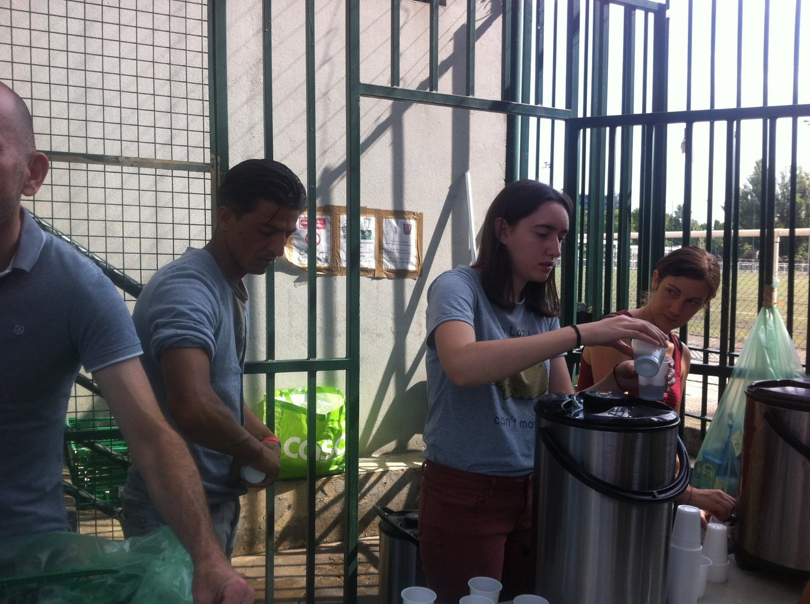

### AYS Daily Digest: 03\.06\.2018: “For their own good\.” Double standards reveal the true agenda in Closure of Pikpa

_Familiar “concerns” around the closure of independent spaces in Greece // More people arriving in Greece in 2018 than in 2017 // Volunteer opportunities in Greece // More Croatian police violence reported from people in Bosnia // Boat from Turkey docks in Italy // Solidarity protests in Italy // A call for review of rejections of Afghan asylum seekers // Paris in need of water…and more_

](assets/46b70c888099/1*58UEXNVtbEt8PzwEW4-zQg.jpeg)

Photo Credit: [Refugee Accommodation and Solidarity Space City Plaza](https://www.facebook.com/sol2refugeesen/)

Organizations across Greece are speaking out in order to rally against the decision to close the PIKPA solidarity space\. The Greek Hygiene Service has ordered the closure of the space, citing violations of health and safety and arguing that the presence of refugees \(which increased dramatically in the aftermath of the exodus of around 1000 Kurds from Moria over the course of a large\-scale conflict on May 31st\) is affecting the health and hygiene of the environment\. The organisers highlight that the health and safety concerns specifically mentioned have been addressed independently and that the Hygiene Service is noticeably silent on the vocal outcry against the unhygenic conditions within Moria camp, which have been repeatedly called out\. Overcrowding, security concerns, and cleanliness and hygiene are no new story to Moria camp, yet officials only seem interested in the “safety and health of refugees” when they are in spaces that are not under the administration of officials\.

City Plaza released a detailed breakdown of the hypcritical and arbitrary “concerns” of the authorities, which should be read [here](https://www.facebook.com/sol2refugeesen/posts/1891274571164877) \.

Other organizations have participated in a social media campaign called “Save pikpa\.”

Lesvos Solidarity — Pikpa posted a way for people to get involved:

“Join the “Save Pikpa community” and help [\#savepikpa](https://www.facebook.com/hashtag/savepikpa) — a small, independent, community\-based refugee camp in Lesvos under threat of closure\. Share your message/photo/video of support\! Why does Pikpa matter to you? Why is Pikpa important? Let us know\.
 
 And please help us grow the “Save Pikpa community” by inviting your friends to join and show their support
 
 Join the Save Pikpa Facebook group and share your message/photo/video of support:
 
 [https://www\.facebook\.com/groups/633160610380429/](https://www.facebook.com/groups/633160610380429/) ”

As many of us know, the common “concern” for the health and wellbeing for refugees only shows up selectively\. Time and time again, health, safety, and security concerns are either denied or ignored when it comes to conditions in the camp, in spite of international human rights organizations meticulous documentation of the violation of numerous human rights\. One would think that for the billions of euros invested into these official camps, that the reactions would be slower, yet often the will to change these circumstances is crushed in the name of “not wishing to create a pull factor” or some other embarrassingly transparent excuse\. Stand together and call out this hypocrisy for what it is\.
### GREECE

The Aegean Boat Report published a monthly breakdown highlighting the general trend in arrivals as well as transports from the islands\. A staggering nearly 18,000 people are trapped on the Greek islands, with more arriving every day\.

Photo Credit: Aegean Boat Report

_“ So far this year, the increase in boats arriving on the Greek islands is up 35,4%, people arriving is up a staggering 49,8%, compared to same period in 2017\._

_In June 71 boats have arrived on the Greek islands, with a total of 2557 people\. This is a marginal decrease from May, when 72 boats arrived in total, with 2720 people\. Boats arriving is down 1,4%, people arriving is down 6%\.”_

Read the full detailed breakdown [here](https://www.facebook.com/AegeanBoatReport/posts/385224672000643) \. The majority of those arriving remain as being from Iraq, Syria, and Afghanistan\. Over 50% of the arrivals are women and children\. It is clear that push factors and not the oft\-cited “pull factors” are the real contributor here\.

> Additionally, one boat with 35 people arrived to Lesvos today\. 

The organization RESPOND is raising money to provide for a van to transport women and children from Moria to their center for safe showers\! The lack of security around toilets and showers is an open secret across all camps, with particularly vulnerable groups such as women and children being targeted\. Please consider donating to their campaign [here](https://www.facebook.com/RESPOND.GLOBAL/posts/1615825111819050) \. They need to reach 10,000 euros to purchase and insure a new van\.

Action for Education is calling for volunteer teachers, youth workers, and social workers for their project in Chios\!

> “We are looking for qualified individuals to come join our volunteer team from August onwards\. You would be joining a diverse and international team delivering non\-formal education programme on Chios Island, Greece for children and young adults from the local refugee community\.” 

Find out how to get involved [here](https://www.facebook.com/ActionforEdu/videos/684599545219431/?hc_location=ufi) \.

Organizations call for Greek authorities to launch an investigation into criminal neglect of a search and rescue operation in March which resulted in the death of at least sixteen refugees, with three remaining missing, but presumed perished\. This case, commonly referred to as the Agathonisi Tragedy, highlights an obvious case of criminal neglect\. In a press release by PRO\-ASYL and Refugee Support Aegean, the details of the case become clear:

> “In their harrowing testimonies, the survivors say that they remained from early morning until before it got dark into the sea and no one came to rescue them\. Meanwhile, one of the deceased refugee’s relatives had notified the Greek authorities about the boat in distress in the morning of 16 March\. The young refugee who was in Samos hotspot had called the authorities immediately after he received a message with the coordinates of the boat from his sister who was in the boat\. Still, the Greek coastguard denies that the day of the incident was 16 March, and claims that it happened one day later \(17 March\) \.” 

The organizations are calling on Greek authorities to formally investigate the circumstances around this tragedy in order to bring some kind of justice to the victims and the survivors \(three individuals\) \. Read more [here](http://rsaegean.org/agathonisipressrelease/) \.
### BOSNIA

Photo Credit: AYS Volunteer

For three days in a row people have came back to Sarajevo with broken phones, telling stories about how Croatian police destroyed them, stole money and in some cases used violence\. Volunteers are counting to two Afghan nationals, one Pakistani, one group of four Algerian nationals and a second group of six people \(mainly Algerians\) of whom three came back to Sarajevo and three still are in Bihać\.

If anyone have a phone to donate, or money for buying new ones, please get in touch with either AYS or Souls of Sarajevo\.
### ITALY

A boat with 71 people, Kurdish and Iraqi, which most likely left Turkey, disembarked in Crotone on July 3rd\. Women and children were aboard, and the smugglers have been intercepted\. [Source](http://www.ansamed.info/ansamed/it/notizie/rubriche/cronaca/2018/07/03/migranti-sbarcati-in-71-a-crotone-erano-a-bordo-veliero_fcf84e07-90a1-4661-a434-d6ed040b3109.html) \.

The humanitarian corridor flight [Corridoiumanitari](https://www.facebook.com/hashtag/corridoiumanitari?hc_location=ufi) arrived this morning with a line flight from Beirut, 33 people originating in Syria and Iraq\. In Rome as soon as they landed, they asked for asylum\. [Source](https://www.facebook.com/252231521632595/photos/a.254305491425198.1073741828.252231521632595/867151230140618/?type=3&theater) \.

A great event happening on July 14th\! Translation from the original is below\.

14 JULY INTERNATIONAL EVENT IN [\#VENTIMIGLIA](https://www.facebook.com/hashtag/ventimiglia?source=feed_text) : for the right to human mobility

This event in Ventimiglia is becoming increasingly important in the face of the general anti\-migrants climate in Europe and Italy\.
 On 14 July, it may be an opportunity to show that there are many and many who want to break a narrative that indicates in the migrant the main problem of the European Union\.
 The problem — if anything — is to be identified in the repressive and prohibitionist policies of migration, which prevent the right to human mobility and to enter Europe regularly, which do not provide for the possibility of adjusting and obtaining a European residence permit\.
 Thinking of closing a migration course, whatever it is, and hitting solidarity, in whatever form it expresses, are actions that will only lead to more deaths at sea and on borders, at most to divert migration flows, making more rich and powerful the criminal organizations that are dealing with traffic through closed borders\.

Now as you never need to take sides and go to the square: protect people not borders\!

For more information \(in Italian\) go [here](https://www.facebook.com/meltingpoteuropa/?hc_ref=ARSzviYup-8YjSeG5wtVwETFrslfIWoVf-6yDbpZWTXJ3N_VavcI0Lcsgc0XzIYuxlE&fref=nf&hc_location=group) \!

Spain:

Supporters and solidaritans are awaiting the new arrivals being dispatched to Barcelona on July 4th with a hot breakfast\! Read more here\!

Photo Credit: SOS Refugiados

FRANCE:

A man who was found dead in a ravine on May 25th has finally been identified as Mohamad Fofana from Conakry, Guinea\. His body had been hidden by large snowfall which receded only in late spring\. Mohamad had suffered from Polio, which undoubtedly complicated his arduous and complicated journey\. It is likely that he died on the same day he was turned back by French military police on January 26th\. The cause of death was determined to be hypothermia\.

People in Paris are in severe need of water, note local groups\. The waterpoints promised have not yet been delivered and the only sanitary port\-a\-loo contained a urinal, which means women cannot use it\. [Solidarité migrants Wilson](https://www.facebook.com/Solidarité-migrants-Wilson-598228360377940/?hc_ref=ARRpS0nHa7pmZq4svGXa-__7WX8D_7fMDwzZjA_-dI6ZskJcdbRbize1kzIaQIjsINM) is asking for [donations](https://www.lepotcommun.fr/pot/tusyjrwc) and support and people who are interested in volunteering can go [here](https://docs.google.com/spreadsheets/d/1CDTu2aZcuhldwhfPfrch75FxfsIFTbe97SN17bq2MQc/edit?ts=5849bb00#gid=0) \.

Photo Credit: Solidarithe Migrants Wilson
### GERMANY

PROASYL published a comprehensive report calling on an extensive review of all rejections of Afghan asylum seekers in the previous two years, specifically those cases of deportations from Ba\. New findings show the lack of security in Afghanistan with large bodies acknowledging that the Taliban remains in control of many highways and thoroughfares\. As such, although there are potentially safe areas in Afghanistan, their existence cannot be used to make a blanket justification as there exist serious barriers\.

_“In contrast to the previous assessment, the AA recognizes the enormous importance of social and family networks for the protection, perspective and survival conditions of those affected\. Whether a so\-called “domestic alternative” exists depends crucially on the social roots, the ethnicity and the financial possibilities and must be examined on a case\-by\-case basis\. The assumption that deportations of persons without any social contacts or family groups in Afghanistan are generally possible or harmless can not be found in the situation report\._ 
_NO ANONYMITY IN GREAT CITIES_ 
_For young, healthy men, there may also be threats in Kabul or other big cities\. In particular, in the case of people who have already suffered a persecution in certain regions, the Federal Office has often referred to the refugee alternative in Kabul and other large cities and the supposedly given anonymity there\. In the current report, the Federal Foreign Office recognizes for the first time that these cities also do not offer anonymity\. Returnees can be located there by their pursuers and are therefore threatened…\. More than 60 percent of Afghans who sued in court against the denials were granted justice in 2017\. \[The Authorities\] must finally pursue a decision\-making practice that will meet the ever\-worsening situation in Afghanistan\. all ho sued in court against the denials were granted justice in 2017\.”_

Read more, in German, [here](https://www.proasyl.de/news/meinungsstark-aber-faktenarm-abschiebepolitik-zu-afghanistan/) \.

German Prime Minister Angela Merkel has reached an agreement with her minister of the interior, a right\-wing hardliner with a strongly anti\-migration policy\. What was agreed upon was the following: 
“\- set up three closed transit centers for asylum seekers on the border with Austria, confining them there as their cases are quickly processed\.
 — asylum seekers will be returned to whichever EU country they first registered, provided Germany has a bilateral agreement with that country to return asylum seekers\.
 — if that country does not have an arrangement with Germany, Austria has agreed to take them back\. This will need an agreement with Austria\.”

[Source](http://www.keeptalkinggreece.com/2018/07/03/merkel-seehofer-migration-deal-transit-centers/) \.

It has yet to be seen how Austria will respond…what if they reject?
### UK

It’s not just in America\! Horrific situation as families separated as parents are put in detention facilities for charges related to migration\.

“A migrants’ rights charity has condemned the UK government for “routinely” separating families by placing parents in immigration detention\.

Bail for Immigration Detainees \(BID\) says it deals with around 170 cases of families who are split up because of immigration enforcement each year\.

Because the Home Office does not release statistics on the number of parents in immigration detention, however, the actual number is unknown\.”

Read more [here](https://news.sky.com/story/children-and-parents-are-separated-by-immigration-in-the-uk-11418129) \.

_Converted [Medium Post](https://medium.com/are-you-syrious/ays-daily-digest-03-06-2018-46b70c888099) by [ZMediumToMarkdown](https://github.com/ZhgChgLi/ZMediumToMarkdown)._
