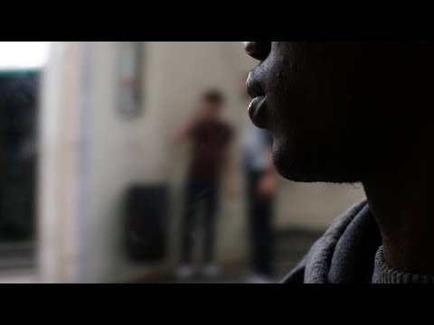

### DAILY DIGEST 4/7/2018: No NGO left in the Mediterranean
#### All rescue teams have been forced to stay in harbors, as the EU uses drowning people to scare others from attempting to cross the sea / Numbers in Nea Kavala camp expected to double / 14\-year old missing in Koutsochero / Trouble for minors in Paris

](assets/1fdf662681b5/1*F9K5eN5lU5_H5TCty1EBYg.jpeg)

Credits: [Gegen das Sterben im Mittelmeer](https://www.facebook.com/StopTheDying/photos/a.193862057798050.1073741828.190323768151879/418094922041428/?type=3&theater)
### Feature

As sea rescue organizations are being blocked from doing their jobs, the number of people dying in the Mediterranean has risen sharply in June\.

**629 people are known to have drowned** , which makes the month the deadliest so far this year\.

Since the beginning of July, no civil rescue NGO has been able to operate: Sea\-Watch 3 and Lifeline have been seized on Malta, the Iuventa in Italy\. Additionally, the Moonbird \(Sea\-Watch’s and HPI’s airplane\) is also being prevented to conduct search flights from Malta\. The Seefuchs is also in the harbor at the moment, facing accusations of not being properly registered\. The Aquarius is not allowed to enter Italian or Maltese ports\. The Open Arms arrived in Barcelona\.

Besides criminalizing helpers, Europe is obviously using drowning people to discourage others from trying to cross the sea\.

■■■■■■■■■■■■■■ 
> **[Matteo Villa](https://twitter.com/emmevilla) @ Twitter Says:** 

> > 🤔🚢📈🧐📉. Some people claim that #migrant deaths along the Central Med route increased because NGOs' #SAR activity raised migrants' propensity to attempt a risky journey.

Is there any evidence whatsoever for this?

Uh, NOPE. 👇 https://t.co/RJyl24oq3h 

> **Tweeted at [2018-07-04 09:51:10](https://twitter.com/emmevilla/status/1014446510233317377).** 

■■■■■■■■■■■■■■ 

[Sea\-Watch](https://www.facebook.com/seawatchprojekt/?hc_ref=ARRMarhDUvRYIWP8_mV7NKRK13Lg4rQUuB1NiOmeBrlSDB8D9oSFXX4we1JUz23d9EE&fref=nf) is calling everybody to join in solidarity demonstrations on Saturday, July 7th, in Berlin:

For an Europe of Open Arms, solidarity cities and safe havens\.
### Turkey

One boat with 49 people was in distress yesterday, Aegean Boat Report writes\. According to information and footage released by the page, the Turkish Coast Guard had to be called to rescue them\.
### Greece

Volunteers reported the arrival of 37 people on Chios\.

The situation in Vial camp, Chios, remains desperate\. E [idomeni Refugee Support](https://www.facebook.com/groups/eidomeni.refugee.support/permalink/1838653379775600/) groups writes:

> “All the new families stay either in summer tents or in sheds or in the fields with just sleeping bags\. Vial has exceeded by far the number of the people it was supposed to host\. People with serious health problems, pregnant women, women with newborn babies, families with young children, psychologically disturbed children are trapped in the prison of Europe which does not even ensure the basic requirements of a camp\. Children’s’ rights concerning food, accommodation and health — not to mention — education are being violated\. “ 

People from [Pikpa camp](https://www.facebook.com/groups/633160610380429/) are calling, again, for a decision on whether this camp should be closed\.

> “When you approach Moria camp by car these days, you can’t even stand the smell from a distance\. Sewage, urine, are flowing everywhere\. Up to 8000 men, women, children are forced to live, survive there in degrading, unacceptable conditions\. Overcrowded containers, makeshift tents, foodlines for hours on end, no basic sanitation\. 

> But the problem is Pikpa? The different actions aimed at closing Pikpa are a political move by certain actors who are opposing the model of solidarity that Pikpa camp represents\. For years, many groups and volunteers have been offering support in Pikpa which functions as a small, community\-based camp for the most vulnerable refugees on the island\. By now, Pikpa camp has hosted over 30,000 refugees without any financial support from the state, the European Union or UNHCR\. 

> Pikpa is an international symbol of solidarity\. And that is threatening for some… In our world today, places like Pikpa are more important than ever\. We will keep fighting to keep Pikpa open\. Please stand with us\!”

On the mainland, [A Drop in the Ocean](https://www.facebook.com/drapenihavet/posts/2149189195098518) expects the number of residents at Nea Kavala camp to double in the next days when Diavata closes\. “The residents who are already there have been moved closer together to create space for more people in the containers,” they said\. Just today, more than 100 people arrived, and 300 more may follow\. The volunteers started preparing to double the portions of vegetables\.

](assets/1fdf662681b5/1*icRCbkvI9Hp6LmkMo3alYg.jpeg)

Tents at the camp in Nea Kavala\. Credits: [Dråpen i Havet](https://www.facebook.com/drapenihavet/)

In the camp of Koutsotchero, a 14\-year\-old boy went missing after playing in the fields, reports Ert\. Residents of the camp started a protest in the morning by the national road between Larissa and Trikala, criticizing the delay of investigations\.

■■■■■■■■■■■■■■ 
> **[Marianna Karakoulaki](https://twitter.com/Faloulah) @ Twitter Says:** 

> > Ενα παιδί πρόσφυγας εξαφανίστηκε από τη δομή στο Κουτσόχερο. Αν κάποιος γνωρίζει κάτι ας επικοινωνήσει με τις αρχές. #refugeesGR #RT https://t.co/gpXigH46wD 

> **Tweeted at [2018-07-04 19:42:05](https://twitter.com/faloulah/status/1014595221739528192).** 

■■■■■■■■■■■■■■ 

Amurtel Greece still needss your help\. Their [\#mama2mama](https://www.facebook.com/hashtag/mama2mama?source=feed_text) campaign is on and they still have a long way to go\. Their goal is to raise 8500 euros to support the work we do with the mothers and babies in Athens, Greece\!

Support here: [https://bit\.ly/2MNcQ1r](https://bit.ly/2MNcQ1r)
### France

Despite all repression by the authorities and the police, more than 1000 people are currently living rough in Calais and Dunkirk, Care4Calais states: “The world has forgotten them but we cannot\. But our warehouse shelves are empty\.”

Urgently they need jeans and jogging pants, boxer shorts, sleeping bags, shoes, mobile phones, backpacks\.

Further more, Human Rights Watch [highlights](https://www.hrw.org/report/2018/07/04/lottery/arbitrary-treatment-unaccompanied-migrant-children-paris) the situation for unaccompanied minors in Paris\. The organization speaks about “ arbitrary procedures and inordinate delays in determining” their age as well as the violation of international standards and French law\.

The French Red Cross handling the assessment is accused of often doing only short interviews ending with a verbal denial\. Many were “turned away at the door by security guards”\. Other reasons for a rejection were missing documents, optionally too detailed or imprecise accounts, traveling unaccompanied or working\. Their treatment was “arbitrary, denies children a fair hearing, and fails to uphold the obligation to prioritize the best interest of the child\.”

After water was turned off for migrants in Paris, [Solidarité migrants Wilson](https://www.facebook.com/Solidarit%C3%A9-migrants-Wilson-598228360377940/?fref=mentions) issued an call for help\. They need water and volunteers in Paris\! They are one of the main sources of food for hundreds of people who are living on the streets\!

“Lots of kids and babies this morning\. We avoid photos of migrants unless there is explicit agreement and if not always back\. Sometimes we really want to take a picture of them to testify, these bits of cabbage, but most often we don’t even want to ask for permission because parents on the ground are so burdened with heat, fatigue and despair we don’t want to add to it\.”

Sign up [on schedule](https://docs.google.com/spreadsheets/d/1CDTu2aZcuhldwhfPfrch75FxfsIFTbe97SN17bq2MQc/edit?ts=5849bb00#gid=0) \.

The Solidarity March from Ventimiglia to London arrives in Calais on Saturday and ends in London on Sunday\.

### Germany

In an interview with ARD, Germany’s chancellor Angela Merkel [explained](https://www.tagesschau.de/inland/merkel-farbe-bekennen-103.html) that Dublin or other expelling procedures in the detention camps at the border to Austria need to be processed within 48 hours\. Otherwise the people should be transferred to a camp within the country and officially enter it\. She said it should be much like an airport procedure\. It would be under police control as well\.

Meanwhile, 69 people have been deported to Afghanistan from Germany\. 51 of them came from Bavaria, European Citizens Against Deportation to Afghanistan [reports](https://www.facebook.com/ecada2017/photos/a.1881636765385654.1073741827.1880874508795213/2091565051059490/?type=3&theater) \. All were male\.

> **We strive to echo correct news from the ground through collaboration and fairness\.** 

> **Every effort has been made to credit organizations and individuals with regard to the supply of information, video, and photo material \(in cases where the source wanted to be accredited\) \. Please notify us regarding corrections\.** 

> **If there’s anything you want to share or comment, contact us through Facebook or write to: areyousyrious@gmail\.com** 

_Converted [Medium Post](https://medium.com/are-you-syrious/daily-digest-4-7-2018-no-ngo-left-in-the-mediterranean-1fdf662681b5) by [ZMediumToMarkdown](https://github.com/ZhgChgLi/ZMediumToMarkdown)._
