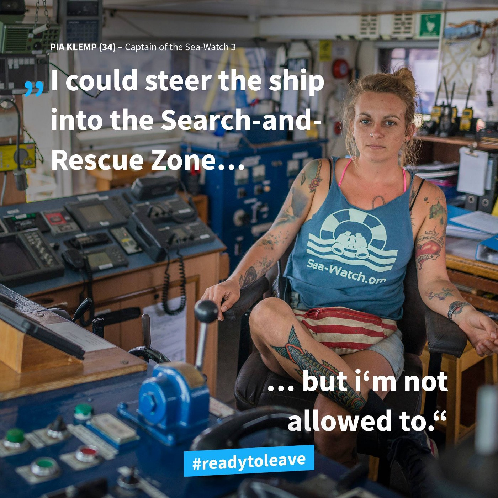

### AYS Daily Digest 05/07/18: Aegean Island detention camps grow more overcrowded

Survivor’s testimony from Libya / Rescue ships blocked / Lifeline captain tried on Malta / New arrivals in Greece / Evictions in Rome / Extremist policies in Austria / Police stop distributions in Dunkirk / ICE endangers infant lives in Texas / And more news…

 \)](assets/ca0d03c3274d/1*j9AANm0R3_DAcEDJ8lzDAA.jpeg)

Photo by Tasos Anastasiou \(Photo credit to [Art Against](https://www.facebook.com/artagainstproject/photos/a.639651369417634.1073741828.639605726088865/1766195986763161/?type=3&theater) \)
### LIBYA

[Gabriela Sánchez](https://www.msn.com/es-es/noticias/internacional/en-libia-cada-noche-violaban-delante-de-nosotros-a-quien-iban-a-matar/ar-AAzyvXM?ocid=st) from MSN interviewed people rescued by the Spanish ship Open Arms about the conditions they survived in kidnapping and Libyan camps:

“Everyday one had to die,” said Tagnabou Elvis onboard Open Arms\. “If they called you \(at night\), it was a bad sign\. They said ‘come, come’ and they would shoot… Before they were killed, they were raped in front of us, they took their pants down and then killed them\.” He cannot recall how many murders he had seen\.

These are the camps that the EU and Italy are funding to prevent refugees from reaching their shores\.

[The Head of the UN’s migration agency](https://twitter.com/sarwatchmed/status/1014940461876772864?s=21) called on Libyan authorities to no longer detain people taken by the Libyan coastguard\. Whether this can happen with the current political alliance between the EU and Libya is yet to be seen\.
### SEA

In the last week, one in 12 people who crossed the central Mediterranean died\. The sea crossing is more dangerous than ever because of rescue ships recently being stopped and impounded\.

Rescue ships are being blocked from entering rescue zones on a near daily basis \(Photo by Sea\-Watch\)
### GREECE
#### Amber alert in central Greece

[AMBER ALERT](http://www.keeptalkinggreece.com/2018/07/05/amber-alert-12-year-old-migrant-boy-missing-central-greece/) : A 14 year old boy named Yousef Osso has been missing from Larissa, central Greece, since the afternoon of 03/07\. If you have any information about him, please immediately call the Children’s Charity to Xamogelo at phone line 116000 or the Greek Police at 100\. Both lines are 24/7\.
#### Greek islands and data on new arrivals

[Aegan Boat Report](https://www.facebook.com/AegeanBoatReport/photos/a.285312485325196.1073741828.285298881993223/385873435269100/?type=3&theater) has concluded that UNHCR’s figures on the new arrivals on the islands for the month of June are not correct, stating this week that “Arrivals on Lesvos was 257, not 316 \[as UNHCR stated\] \. The week before was 153, not 96\. How hard can it be to put out correct information?”

It is somewhat shocking that UNHCR is not even able to put together reliable statistics for the number of people arriving on the Aegean Islands\. The UNHCR has long failed to provide for the basic needs and rights of refugees on the islands, yet they have always prioritized putting out their glossy data sheets\. Now it seems they cannot even do this properly\.

Incorrect information that was put out by the UNHCR this week \(Factsheet by UNHCR\)

From Are You Syrious’ data keeping and analysis, the total new arrivals for the month of June was 2,383, a bit less than in previous months\. In the graphs below, it is still important to note that the arrivals on Samos remains high, and that compared to June 2017, the numbers of people arriving was 45\.7% higher\. The yearly total of new arrivals as of 30/06 was 13,469, while there have been 10,214 transfers to the mainland\. The number of new arrivals continues to remain higher than the transfers to mainland \(plus deportations and voluntary returns\) \.

There were 20 deportations under the EU\-Turkey deal, among them six Syrians and, for the first time being deported, a person from the Comores\. 166 people have been deported in 2018, 62 of them from Syria\.

Infographic by AYS, 05/07/18

Infographic by AYS, 05/07/18

[The Greek Ministry of Interior](http://greece.greekreporter.com/2018/07/04/number-of-migrants-refugees-trapped-on-greek-islands-reaches-new-high/) is reporting that 17,771 migrants and refugees are in reception, registration, and other structures on the five Greek island hot spots\. There are [9,472 people](https://twitter.com/ohflesvos/status/1014978855617036289?s=21) on Lesvos alone\. However, it has long been documented that the Interior Ministry inflates the number of asylum seekers on the islands to justify a larger budget\.

As for asylum grantees, on Thursday, July 5th [Greece granted asylum to Ugur Ucan](http://www.keeptalkinggreece.com/2018/07/05/greece-asylum-3-turkish-officer/) , the third Turkish officer out of eight to flee to Greece after a failed coup in July of 2016\. This could have a serious impact in Turkish\-Greek relations\. In the past, Turkey allowed more people to cross over to Greece as a strong arm tactic during disputes, resulting in more overcrowding and increasingly horrendous conditions on the islands\.
#### PIKPA facing eviction this week

The PIPKA solidarity village, which has provided accommodation to hundred of refugees whose lives were threatened in Moria is facing eviction this week\.

As more people around the continent show support for Save Pipka, they are still looking for signatures to save their camp on Lesvos: “We call on the government of Greece and the municipality of Lesvos to allow the Lesvos Solidarity Collective to continue meeting the needs of vulnerable refugees at PIKPA camp\.”

Sign and show your support [here\.](https://secure.avaaz.org/en/petition/Mr_Galinos_Mayor_of_Mytilini_SAVE_LESVOS_SOLIDARITY_CAMP_PIKPA/?fYAaVdb&fbogname=Michael+S.&utm_source=sharetools&utm_medium=facebook&utm_campaign=petition-362814-Mr_Galinos_Mayor_of_Mytilini_SAVE_LESVOS_SOLIDARITY_CAMP_PIKPA&utm_term=YAaVdb%2Ben)

 ‎](assets/ca0d03c3274d/1*_dWAZKyRuHqhSYa9ha8zpA.jpeg)

Photo by [Milena Los](https://www.facebook.com/MilenaLosinger) ‎
#### Call for volunteers in Athens

Please see this call for for volunteers for a new women’s Centre in Athens\. They are looking for qualified teachers and can provide free accommodation\.

Find more information and check out the application [here\.](https://www.actionforeducation.co.uk/volunteer)
### MALTA

](assets/ca0d03c3274d/1*tRAO7K5ly1c2G9QRQI4GFw.jpeg)

Photo credit to Erik Marquardt/ [Sea\-Eye](https://www.facebook.com/groups/1652972374920129/)

Today was the second day of trial for the captain of the Lifeline rescue ship, Claus\-Peter Reisch\. He was charged and the boat impounded when it landed in Malta to disembark people who had been rescued\. Reisch is being tried for the crime of saving lives and refusing to hand refugees over to the criminal Libyan “coast guard\.”

Rescue organization [Sea\-Eye](https://www.facebook.com/groups/1652972374920129/) wrote:

> While EU member states break international law without being held accountable, while every day people die, the captain must explain to the court why he flew the Dutch flag on his ship\.
 

> Europe has let its bureaucrats off the leash, and they are stopping NGO’s from saving human lives\. It is certain that this policy costs human lives, because our ships cannot leave port\. 

Malta and Italy have both closed their ports to rescue ships, and the Lifeline was only let into Malta last week because of dangerous weather conditions\. Maltese PM Muscat continues his policy of turning away refugees, and not even allowing sea\-spotting planes to land or refuel in the country\.

■■■■■■■■■■■■■■ 
> **[MISSION LIFELINE](https://twitter.com/SEENOTRETTUNG) @ Twitter Says:** 

> > Today we are back in court. We are charged with saving people who were fleeing poverty and war. We're in court because we did not hand people over to Libyan torturers. We are in court because humanitarian principles are our top priority. https://t.co/uUBKaQmzBr 

> **Tweeted at [2018-07-05 03:36:46](https://twitter.com/seenotrettung/status/1014714678981857281).** 

■■■■■■■■■■■■■■ 

### ITALY

[This morning](https://www.facebook.com/637713737/posts/10156690469198738/) in Rome via Scorticabove, 120 people were evicted from a building they were occupying legally\. The local municipality gave no other solutions: another scandal from Italy with no explanations\.

 \)](assets/ca0d03c3274d/1*4c-4Vu5mA0GH3l_T3NK7xw.jpeg)

People being evicted in Rome\. \(Photo credit to [Federazione del Sociale USB](https://www.facebook.com/FederazionedelSociale/?hc_ref=ARRvFUq7opTlBbAEJyYZsV_u4sn6w0Nj1AedahvupiM1Bxvdev5Sb7z93FESTUwYGM0&fref=nf) \)

](assets/ca0d03c3274d/1*jPmbWGgNsSwh8bBxFdHKSw.jpeg)

Photo credit to [Federazione del Sociale USB](https://www.facebook.com/FederazionedelSociale/?hc_ref=ARRvFUq7opTlBbAEJyYZsV_u4sn6w0Nj1AedahvupiM1Bxvdev5Sb7z93FESTUwYGM0&fref=nf)

On July 4th, [a fascist attack](https://www.facebook.com/362786637540072/photos/a.362811254204277.1073741829.362786637540072/407728466379222/?type=3&theater) happened in Claviere, Italy after flags expressing “no borders” were put up at Chez Jesus\. The attackers verbally assaulted community members with violent and sexual insults\. Many of the attackers have been identified by the police\.
### SPAIN

[So far in 2018](http://www.europapress.es/epsocial/) , almost 14,500 migrants have arrived in Spain\. This is more than double compared to the first six months of 2017\.
### BOSNIA & HERZEGOVINA

[Conditions in Sarajevo](https://www.facebook.com/soulsofsarajevo/posts/1296985103738032) remain grim with volunteers trying to bring back decent humanity by providing showering facilities\.

 \)](assets/ca0d03c3274d/1*7OwqOohpDpeCCRD6pRj_Hw.jpeg)

Make shift showers built by volunteers\. \(Photo credit to [Diskriminacija](http://www.diskriminacija.ba/teme/kuć-putujuć-velika-kladuša) \)
### AUSTRIA

Today the Austrian parliament is voting on a bill that proposes to steal money from refugees when they enter the country and to allow police to search through their phones\.

The full draft to the bill can be seen [here](https://www.parlament.gv.at/PAKT/VHG/XXVI/I/I_00189/fnameorig_698462.html) \.

The far\-right Austrian government announced this week that it would take drastic measures to keep refugees out of the country as German pursues the recently announced policy of setting up deportation camps on its borders\. The demagogue chancellor Sebastian Kurz said that, “the Austrian government is … ready to take action, especially to protect our southern border\.” Austria has already taken many measures to militarize its borders, including a series of large\-scale military exercises which were held on the southern border earlier this month\.
### FRANCE

The Calais police continue their policy of robbing the poorest\. There have been three forced evictions in Calais this week, where the police took people’s tents and possessions\. [Refugee Info Bus posted a short video](https://www.facebook.com/RefugeeInfoBus/videos/2179810708921012/) today showing the police standing next to a truck they had filled with refugees’ belongings\.

In Dunkirk, [volunteers reported](https://www.facebook.com/HelpRefugeesUK/videos/644439032583440/) that over 400 refugees were forcibly evicted from their encampments last week\. Since the eviction, authorities have prevented many aid deliveries from coming through and have also detained volunteers on two separate occasions\.

The Refugee Community Kitchen, working in Dunkirk is facing incredible pressure from the authorities to stop their food distribution\. Many times in the past week authorities have forced them to move their distribution site or kicked them out saying they do not have “clearance\.”

“Distribution of food and all essential services have been very difficult in Grand Synth \(Dunkirk\) over the last 3 days\. Without notice or any clear reason we have not been allowed access to our normal distribution points where we serve about 300 many families everyday\.” \(Photo by Refugee Community Kitchen\)
#### Solidarity march arriving in Dunkirk and Calais

[The Solidarity March](https://www.facebook.com/groups/CalaisMigrantSolidarityActionFromUK/permalink/2027672857307451/) from Italy to London is arriving in Dunkirk on June 5th and Calais on June 7th\. The marchers are fighting for a more welcoming Europe, and against the criminalization of people in need\.

 \)](assets/ca0d03c3274d/1*04w6OvsiQ1_k3ea4iWvCtA.jpeg)

The solidarity march arrives in Flanders\. \(Photo by [L’ Auberge des Migrants](https://www.facebook.com/AubergeMigrants/photos/a.10152514841565339.1073741825.358496450338/10156162065260339/?type=3&theater) \)
#### Paris d’Exile looking for translators

Paris d’Exil is looking for translators in Urdu, Oromo, Pashto, Tigrinya, Somali, and Amharic\.

If interested, please contact: guideasile@gmail\.com
### EU

[Council of Europe Commissioner for Human Rights Dunja Mijatović](https://www.coe.int/en/web/commissioner/-/european-states-must-put-human-rights-at-the-centre-of-their-migration-policies) , in her press release on July 5th, made it very clear: Europe needs to put human rights at the center of their migration policy\.

> First of all, any approach to migration in the Mediterranean should ensure a sufficiently resourced and fully operational system for saving human lives at sea\. Recent tragedies resulting in hundreds of lost lives should remind us of the urgency to act\. In this context, non\-governmental organisations \(NGOs\) play a crucial role and should be free to use ports and other facilities for rescue operations and for helping migrants\. Regrettably, a number of Council of Europe member states are hindering the work of NGOs, which imperils the lives of many people\. When member states coordinate rescue operations they should make full use of the available search and rescue capacities, including that of NGO vessels\. 

### US

We have generally refrained from writing about the US in the digest, as our focus is on Europe\. But sometimes, we receive reports that are just too outrageous not to include\.

This week, two infants were taken from a detention center in McAllen Texas to a hospital\. One of the babies has chronic asthma and was having an attack because ICE had taken the inhalers away from the parents\. [Alice Alveraz](https://www.facebook.com/alice.alveraz) ‎, a volunteer medic and and attorney working with detained immigrants, explained what happened to the second child:

> The second child was also in severe respiratory distress due to flu type A caused most likely by days locked in CBP detention\. The people call it the “ice box”\. It is kept at maybe 60 degrees, lights on 24/7, no windows, constant air conditioning, families sleep on the floor in cages and are normally given nothing but a reflective paper emergency blanket\. They are not allowed to wash or bathe\. I have talked to people who said they were kept in this “ice box” for 20 days\. 

> If the child is under 10, they are kept with their mother\. If the child is under 10 and accompanied by the father, they are separated \(I am not sure if this is only when the dad has a female child\) \. Over 10, they are in separate cages\. \(Did I really just type that\!?\!?\) I have heard it is so crowded, there is hardly room for everyone to lie down at once\. Almost all the parents we talk to say their children barely ate while in the “ice box\. ” 

> Most of what we see in the clinic are children with cough/colds who complain of flu\-like symptoms\. This is a recipe for disaster\. The flu can be fatal for young children, especially those with taxed immune systems caused by these conditions\.
 

> I have heard these very cold conditions are “to kill germs\.” This sounds like how you would treat rats in a lab\. I’m furious that this is how we treat children in America\. 

 ‎\)](assets/ca0d03c3274d/1*x3K4ISEZgnORjLLWyG60mw.jpeg)

A photo of one of the infants nearly killed by confinement in an ICE facility\. \(Photo by [Alice Alveraz](https://www.facebook.com/alice.alveraz) ‎\)

**We strive to echo correct news from the ground through collaboration and fairness\.**

**Every effort has been made to credit organizations and individuals with regard to the supply of information, video, and photo material \(in cases where the source wanted to be accredited\) \. Please notify us regarding corrections\.**

**If there’s anything you want to share or comment, contact us through Facebook or write to: areyousyrious@gmail\.com**

_Converted [Medium Post](https://medium.com/are-you-syrious/ays-daily-digest-05-07-18-aegean-island-detention-camps-grow-more-overcrowded-ca0d03c3274d) by [ZMediumToMarkdown](https://github.com/ZhgChgLi/ZMediumToMarkdown)._
