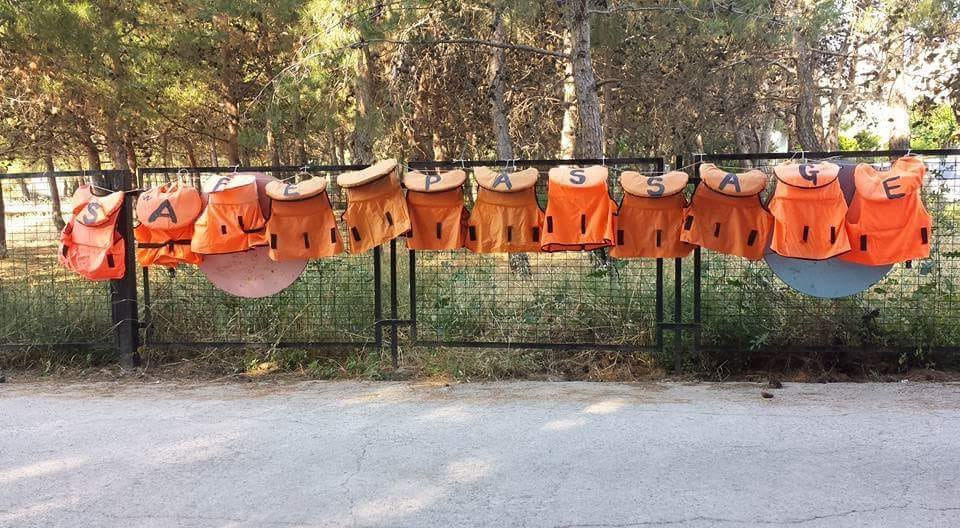

### AYS DAILY DIGEST 6/07/2018: Solidarity is not a crime\! But Fortress Europe keeps strengthening its border regime

_Two\-faced Europe: €90\.5 million given to the EU Trust Fund for Africa to implement border controls, while releasing a resolution that will make it illegal to prosecute acts of solidarity//New data on deaths and rescues in the Mediterranean//New report on conditions of LGBTIQ migrant community in Hungary//\#savepikpa campaign needs supporters//Neo\-nazi demo approved in Italy//Discrimination against foreign volunteers in France//Demos in solidarity happening in Europe\. \._

Credit: Joanne Coutts, \#savepikpa

**EU**

A controversial day for Europe has unfolded today\.

The President of the European Commission, Jean\-Claude Juncker, announced that [a set of “concrete actions”](https://www.euractiv.com/section/politics/news/commission-to-table-eu-external-border-proposal-by-september/) in order to improve border controls will be created to implement the decisions taken during last week’s summit in Brussels\. By September, a proposal will be drafted, including an increase in the number of units provided to EU coastguards, 10,000 by 2020, and extending Frontex’s mandate\.

Even though the European border patrol agency will be working in the Mediterranean, it is still not clear what will happen to people who manage to cross the sea and reach Europe\.

“ _Europe will never do pushbacks\. It is illegal_ ” EU sources have stated\.

It seems that working on transfer centres at borders and creating disembarkation platforms in third countries that are not safe is still totally in line with international and EU regulations\.

Yet, Juncker is not willing to admit that this is becoming a “fortress Europe”\. “ _Solidarity and protection of the external border are two things that go together_ ”, he added\.

So, on the one hand, we have the European Commission [approving a budget of €90\.5 million](http://europa.eu/rapid/press-release_IP-18-4366_en.htm) to the EU Trust Fund for Africa to finance three programmes which will be implemented to tackle “illegal” migration and “ _save and protect lives of refugees and migrants, providing them with assistance and fighting against traffickers and smugglers”_ says Federica Mogherini, Vice\-President of the Commission\.

The three\-point programme will include:
- €55 million to the Maghreb region \(Tunisia and Morocco\) to strengthen its border control management and fight against smugglers;
- €29 million to Libyan authorities to create disembarkation centres/detention centres “ _in remote southern desert areas and urban settings_ ”\. This programme will be followed by IOM and UNHCR as well;
- €6\.5 million will be deployed to reinforce assistance to vulnerable migrants by supporting the Moroccan National Strategy program on migration\. Civil organisations will be the main actors and receivers of fundings\.

On the other hand, we have the decisions of the French Constitutional Court, which ruled that solidarity is not a crime\.

“ _The principle of fraternity confers the freedom to help others, for humanitarian purposes, regardless of the legality of their presence on national territory_ ” [the court](http://www.france24.com/en/20180706-france-constitutional-court-sides-farmer-herrou-who-aided-migrants-fraternity) ruled\.

Organisations and individuals who assist people in need while they are trying to seek refuge will no longer be criminalised and prosecuted, also according to a [resolution adopted by the European Parliament](http://www.europarl.europa.eu/sides/getDoc.do?type=MOTION&reference=B8-2018-0314&format=XML&language=EN) on Thursday\. Notorious examples of activists and citizens who have been prosecuted include Cédric Herrou and Martine Landry, both facing prosecution since 2017, not to mention the recent criminalisation of NGOs in the Mediterranean and the recent law adopted by the Hungarian parliament allowing authorities to bring charges against people and associations working in solidarity\. Even though citizens can still be prosecuted if they offer help to “irregular” migrants, they are exempted from the charge if they provide support for humanitarian purposes\.

The [EU Commission approved the release of €45\.6 million](https://mailchi.mp/ecre/ecre-weekly-bulletin-06072018#euro) in emergency assistance to Spain and Greece in order to allow the two countries to deal with constant overcrowding conditions in their reception facilities\. The breakdown of the funding is as follows: €24\.8 million have been given to Spain to reinforce reception capacities at the Ceuta y Melilla, while €720,000 have been donated to improve expulsion centres\. €20 million were lavished on UNHCR to manage reception facilities on Lesvos, “ _support local projects and increase emergency accommodation on the island_ ”\.

This sounds pretty jarring, considering that Pikpa, an independent camp, is at risk of being closed down after a report by the Hygiene Service which does not take into consideration the incredible work volunteers and staff have been doing for years, hosting and supporting the most vulnerable, including almost 1000 Kurdish refugees who had left Moria the past month\.

**\#SavePikpa**

**SEA**

1,412 died while crossing the Mediterranean since the beginning of 2018, 489 from mid\-June, while 45,700 have reached European shores in the same period of time\.

Even though, a significant drop in the number of arrivals has been registered, the mortality rate is the highest ever reported: 1 out of 7\.

“ _UNHCR is especially concerned about the impact of a more limited search and rescue capacity if boats are discouraged from responding to distress calls through fear of being denied permission to disembark people rescued\. \[…\]_ ”

[The agency also added](http://www.unhcr.org/news/briefing/2018/7/5b3f270a4/mediterranean-sea-arrivals-decline-death-rates-rise-unhcr-calls-strengthening.html?utm_medium=social&utm_source=twitter&utm_campaign=HQ_EN_post_Global_Core%2520Social%2520Media%2520Outreach) that any vessel with the capacity should be allowed to respond to distress calls and assist those in need, knowing that support and a safe port will be found on the shores\.

_Western Mediterranean_

A boat that left Morocco three days ago did not manage to reach the Spanish coast\. A 19\-year\-old man from Senegal has lost his life, reported [Watch The Med](https://www.facebook.com/watchthemed.alarmphone/photos/a.1526182797655958.1073741828.1525906057683632/2150181395256092/?type=3&theater) \.

Salvamento Marítimo rescued 167 people from three boats in the Alboran Sea,

■■■■■■■■■■■■■■ 
> **[SALVAMENTO MARÍTIMO](https://twitter.com/salvamentogob) @ Twitter Says:** 

> > El buque Sar Mastelero ha rescatado a 167 personas (56+56+55) de 3 #pateras localizadas por el avión Cuco 502 de la @[guardiacivil](https://twitter.com/guardiacivil). La patrullera Río Miño también participó en las emergencias. El Sar Mastelero de dirige a #Almería. La hora prevista de llegada es sobre las 17.00 h https://t.co/4jIzJTAGn4 

> **Tweeted at [2018-07-06 09:25:12](https://twitter.com/salvamentogob/status/1015164751201136641).** 

■■■■■■■■■■■■■■ 

while another 150 people in total were localised and rescued off the Spanish coast\.

■■■■■■■■■■■■■■ 
> **[SALVAMENTO MARÍTIMO](https://twitter.com/salvamentogob) @ Twitter Says:** 

> > Salvamar Arcturus ha localizado y rescatado patera con 70 personas magrebíes a 6 millas al SW de Punta Caraminal. Proceden hacia Tarifa. Continúan búsqueda Guardamar Concepción Arenal y Helimer 202 https://t.co/ZOq4iYGBY7 

> **Tweeted at [2018-07-06 11:36:51](https://twitter.com/salvamentogob/status/1015197881945509888).** 

■■■■■■■■■■■■■■ 

■■■■■■■■■■■■■■ 
> **[SALVAMENTO MARÍTIMO](https://twitter.com/salvamentogob) @ Twitter Says:** 

> > El buque Luz de Mar ha rescatado en El Estrecho a 80 personas (41+39) de dos pateras. Continúa movilizado y también el helicóptero Helimer 202 y la embarcación Salvamar Arcturus. Las operaciones las coordinan nuestros controladores del Centro de @[salvamentogob](https://twitter.com/salvamentogob) de #Tarifa https://t.co/yin7NTZoNI 

> **Tweeted at [2018-07-06 10:55:10](https://twitter.com/salvamentogob/status/1015187392368693249).** 

■■■■■■■■■■■■■■ 

**HUNGARY**

In a very interesting and [detailed report](https://www.helsinki.hu/wp-content/uploads/SAFETY_NET.pdf) about the conditions of LGBTIQ asylum seekers in Hungary, the Hungarian Helsinki Committee describes, among others, the story of Azim, who fled Afghanistan after becoming a victim of violent attacks and persecutions because of his sexual orientation\. He waited in Serbia for 9 months before being able to enter Hungary and lodge his asylum application in the country\.

He was granted protection in 2017, one of the only 3,397 asylum applications submitted in the national territory throughout the year\.

_In 2017, 94% of all asylum\-seekers were detained in one of the transit zones in Hungary without any protocol in place to assess their vulnerability and address the possible safety and security concerns that, for example, a gay man or a single woman could have\. Despite the fact that vulnerable asylum\-seekers like women and LGBTI people are now detained during the entire asylum procedure in Hungary, there are no specific services that take their special needs into consideration\. As an asylum\-seeker was told when he voiced his complaint in one of the transit zones, “You must be silent in this camp”_ \.

In the report also highlights the fact that staff members in transit areas are not equipped to identify specific vulnerable cases and therefore cannot guarantee adequate support\.

In addition to this, the recent legislation passed last week will no longer guarantee funding for NGOs and non\-state actors, which provided the only support asylum seekers received\.

“ _While the state is unwilling to cater for asylum\-seekers and provide integration assistance to refugees, NGOs who are willing and capable of undertaking these tasks are threatened with criminalization for their assistance as of 1 July 2018\. The circle of destruction is complete\. For Azim and his fellow asylum\-seekers and beneficiaries of international protection there is no safety net of support left in Hungary_ \.”

**GREECE**

_Lesvos_

■■■■■■■■■■■■■■ 
> **[Lesvos Solidarity](https://twitter.com/Lesvosolidarity) @ Twitter Says:** 

> > Court case against pikpa now by hotel owners and some individuals from the neighbourhood. Lawyer of municipality #lesvos joins, against pikpa. So does representative of hotel association. #savepikpa 

> **Tweeted at [2018-07-06 08:27:37](https://twitter.com/lesvosolidarity/status/1015150260094726144).** 

■■■■■■■■■■■■■■ 

The court case against Pikpa was held today, which gifted some [idiotic reasons](https://twitter.com/Lesvosolidarity/status/1015158334419296256) presented by local neighbours\. Updates to follow\.

[**Solidarity demo**](https://www.facebook.com/groups/informationpointforlesvosvolunteers/permalink/904337606440354/?hc_location=ufi) **in Sappho Square tomorrow\!**

_Mainland_

As reported in [yesterday’s digest](ays-daily-digest-05-07-18-aegean-island-detention-camps-grow-more-overcrowded-ca0d03c3274d) , UNHCR has published data regarding returns from Greece to Turkey\.

From April 2016 until June 2018, 1,650 people were returned to Turkish territories\. Of these, 40% were from Pakistan and 18% from Syria\. Of those returned, 91% were men\.

The same source has also published statistics regarding sea arrivals so far this year: 13,717 people were brought to the Greek coast\. The majority of arrivals were from Syria, Iraq and Afghanistan\. Of the people who arrived, 60% are women and children, hosted mainly in Lesvos, Samos and the Dodecanese islands\.

“Similar to last year, over one\-third of arrivals in 2018 are children\. Of those, 7 out of 10 are below the age of 12\. Additionally, 11% of all children were registered upon arrival as unaccompanied or seperated, mainly from Syria and Afghanistan”\.

[Illegal pushback](https://www.facebook.com/watchthemed.alarmphone/posts/2149537105320521:0?hc_location=ufi) s are happening along the land border between Greece and Turkey, where a group of Syrian, Iraqi, Yemeni and Sudanese migrants were intercepted by local authorities, beaten up and sent back to Turkey, despite any international agreement\. This is the second case in five days\.

**ITALY**

_Abbiategrasso, Milan_

“Festa del Sole” is [a nazi rally that is being held just outside Milan](http://milano.repubblica.it/cronaca/2018/07/05/news/interrogazione_liliana_segre_contro_raduno_neonazista_abbiategrasso-200964850/?ref=fbpr) on Friday and Saturday and has received approval by the local authorities\.

While certain authorities give space and, more or less silently, support these facist factions, others, like the member of Senate, Liliana Segre, survivor of Auschwitz, openly denounced the event and sent an urgent message to Interior Minister Salvini, demanding the cancellation of the rally\.

“ _The Democratic Republic raised after the Resistance cannot accept such forms of openly racist, xenophobic, fascist messages delivered through such rallies_ ”\.

On Saturday at 15 h at Piazza Castello in Abbiategrasso, there will be a counter demo to oppose the nazi gathering\.

Needless to say, Salvini has not responded yet to Segre’s message\.

Probably because he is too busy drafting inappropriate and totally wrong internal documents, like the one he shared with the Territorial Commissions \(responsible for accepting/declining somebody’s asylum request\) on Wednesday, pushing Administrative bodies to adopt his political lines, by accelerating the times for defining asylum requests, not considering the normal, legal times the procedure demands\. Among others illegal requests, Salvini also pushed the Territorial Commissions to refrain from adopting humanitarian protection\. See more on the legal aspect [here](https://www.asgi.it/documenti-asgi/protezione-umanitaria-circolare/) \.

_Rome_

After the eviction that took place yesterday in Rome, Baobab is now organising a [collection of donations](https://www.facebook.com/BaobabExperience/posts/1736327539777324) for those living both in Piazzale Maslax \(more than 300 asylum seekers\) and those evicted from via Scorticabove \(120 people with protection\) \. The collection will take place on **Saturday 7th July from 18\.30 until 20\.30 in Via di Portonaccio 23/B, in the Tiburtina area** \. These goods are particularly needed:
- Tea
- Vegetable stock cubes
- Instant coffee
- Sugar
- Cous cous
- Tomato souce
- Beans in cans
- Tuna
- Freeze\-dried mashed potatoes
- Olive oil
- Salt
- Water bottles/water boxes \(still\)
- Plastic plates, cutlery, glasses
- Gazebos to protect from the sun
- Mats to sleep on
- Bed sheets

**FRANCE**

_Paris_

[**Protest**](https://www.facebook.com/cpse75/photos/a.935644256484881.1073741828.887517644630876/1658394297543203/?type=3&theater) **to demand the** **closure of all detention centres** **on Saturday 14th July\!**

_Dunkirk_

Refugee Women’s Centre volunteers were taken to the police station and detained for four hours after the evacuation of the camp on Thursday 28th June, when police continued to block the entrance to the camp even after the operation was over\.

“ _\[…\] the police present outside the camp explicitly blocked the work of “all foreign volunteers”, with some exceptions made for Belgian organisations\. It may be worth mentioning that the Refugee Women’s Centre is a French registered charity\. When volunteers mentioned that to the police, they responded that it didn’t matter, because the volunteers themselves weren’t French — an explicit instance of discrimination\._ ”

[Volunteers were heavily questioned](https://www.dunkirkrefugeewomenscentre.com/single-post/2018/07/06/Voices-14-Refugee-Womens-Centre-taken-to-the-Police-Station) by authorities on their identity, family and activities\. They were also fingerprinted\. They were prevented from seeing lawyers and no real reason was given by the French authorities on the procedure once they were released\.

As legal support is needed to carry out actions to investigate further the legality of the action, local lawyers and/or help in covering legal expenses is needed\. Please, get in touch with RWC for further details\.

**GERMANY**

Demos in solidarity happening on Saturday all over the country and in Malta in solidarity with NGOs at sea\.

In this turbulent political moment for Merkel’s coalition, [SPD and CDU have apparently reached an agreement](https://www.reuters.com/article/us-europe-migrants-germany-deal/germany-agrees-steps-on-migration-no-camps-of-any-kind-spd-leader-idUSKBN1JV2WT) , stating that there will be no transit centres of any kind in the territory, media reports

Still, asylum seekers who were registered in other EU countries will see their pushback procedures speeded up\.

**THE NETHERLANDS**

More [careful screening for homosexual asylum seekers](https://www.volkskrant.nl/nieuws-achtergrond/ind-past-ondervragingsmethoden-homoseksuele-asielzoekers-aan~b64c41ae/?utm_campaign=shared%20content&utm_medium=app&utm_source=link&utm_content=free) will be established:

The Immigration and Naturalization Service \(IND\) has adjusted the interrogation methods for asylum seekers who fled their country of origin because of their sexual preferences\. This interrogation used to be done in a way that made sense to Dutch authorities and policies, living in a country where homosexuality is not punishable\. Questions that were asked were intimidating to people coming from countries where homosexuality is a taboo\. From now on, specific, open and less complicated questions will be asked\.

**UK**

A Sudanese refugee, 23 years old, died during a [raid in Newport](http://www.southwalesargus.co.uk/news/16336360.investigation-into-needless-death-of-man-during-immigration-raid-in-newport/) on Thursday\. The raid was carried out by Home Office officers during his work shift at a car wash\. The young man was fatally injured when falling from the roof of a factory nearby and died in hospital\.

**We strive to echo correct news from the ground through collaboration and fairness\.**

**Every effort has been made to credit organizations and individuals with regard to the supply of information, video, and photo material \(in cases where the source wanted to be accredited\) \. Please notify us regarding corrections\.**

**If there’s anything you want to share or comment, contact us through Facebook or write to: areyousyrious@gmail\.com**

_Converted [Medium Post](https://medium.com/are-you-syrious/ays-daily-digest-6-07-2018-solidarity-is-not-a-crime-b22bf179695a) by [ZMediumToMarkdown](https://github.com/ZhgChgLi/ZMediumToMarkdown)._
