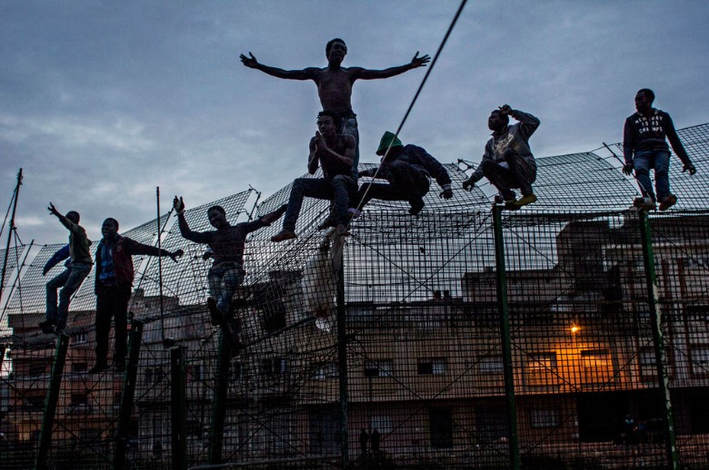
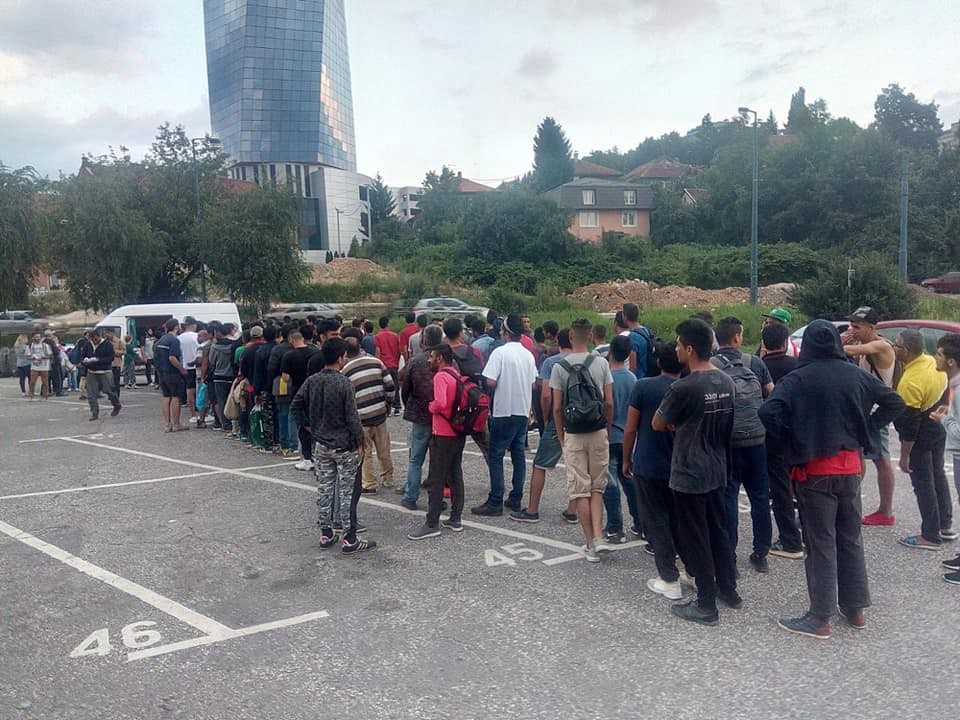
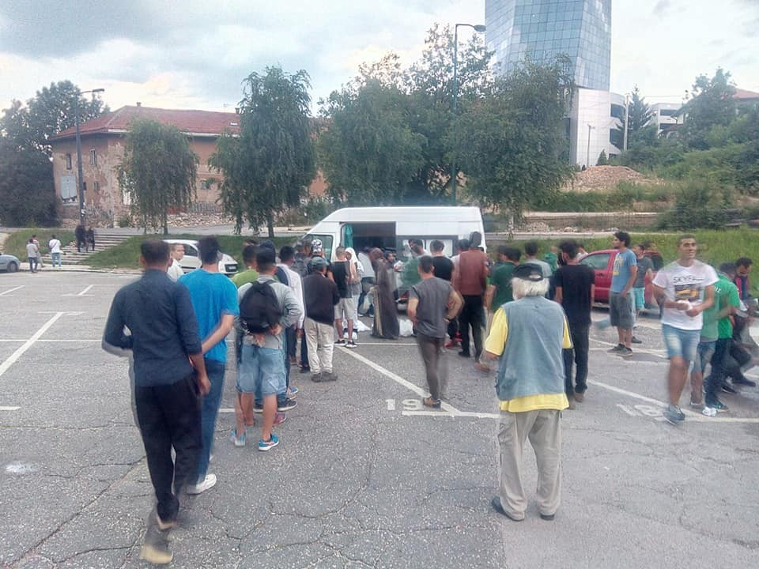
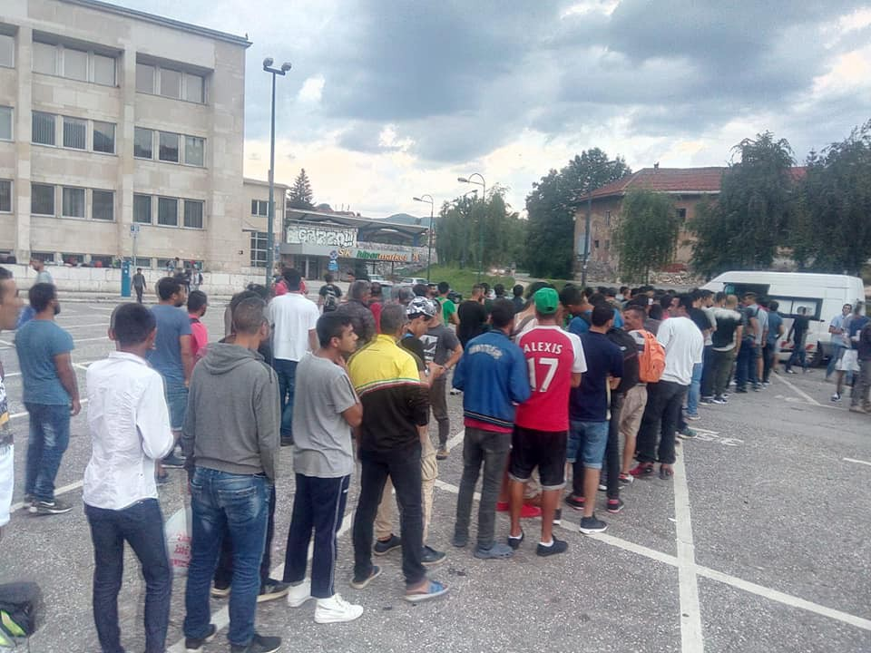

### AYS Daily Digest 8/7/2018 Morocco: a dangerous precedent

Italy vows to close port to international missions and to lift arms embargo to Libya /// Women’s collective We Are Here squat a building in Amsterdam /// Push\-backs in the Sea /// Member of Solidarity march detained in Calais /// and much more

Migrants stand on the border fence near the Spanish enclave of Melilla \(Photo: Sergi Camara / Somos Migrantes\) \.
#### Feature — Morocco: A dangerous precedent

Reports from the ground state that there has been an attack on a sub\-Saharan refugee camp near the train station in Fez\. During the attack people’s tents were set on fire as well as a building\. The video below shows the explosion when a gas canister blew up\. The police at this point had not intervened and the woman speaking is concerned that there are people at risk\.

Morocco is considered a safe third country under the Spanish\-Moroccan readmission agreement signed in 1992\. As a forerunner to the EU\-Turkey deal and an example of what could result from Italy’s proposed relationship with Libya, it sets several concerning precedents\.

[An article published](https://www.ecre.org/oped-cooperation-with-morocco-in-the-eus-african-border-a-laboratory-of-externalization/) on the website of the European Council on Refugees and Exiles \(ECRE\) earlier this year clearly states the dangers\. Moroccan forces strategically detain Sub\-Saharan Africans before they can reach the Spanish Border Asylum Office, and then release higher numbers when the Moroccan authorities want to bring political pressure to bear on Spain\. These are the same tactics that have been used by Erdogan against the EU\.

> Extrajudicial push\-backs still take place on a regular basis despite the recent European Court of Human Rights sentence against Spain condemning these\. Spanish authorities use the ambiguity of the No man’s land on which the fence is built as a justification\. \[…\] As Morocco does not officially recognise Spanish sovereignty \[of Ceuta and Melilla\], they consider all the sea surrounding both cities as Moroccan\. This is considered acceptable by Spanish authorities as it facilitates the extremely dangerous push\-backs at sea, now increasingly common\. 

Other common practices include the continuous destruction of camps, sometimes several times a week, in line with the behaviour of the French police in Calais \(violent tactics which the French police force first employed while oppressing the people of Northern Africa during colonial rule and the Algerian war of independence\) \.

Although they do offer renewable residency cards to people seeking protection, of the over 300 requests Morocco has received for naturalization by migrants, all have been turned down\.

> The main goal of \[the Moroccan\-Spanish agreement\] is to fund the repressive instruments of the Moroccan State to keep migrants and potential asylum seekers out of European territory\. This is producing an enormous amount of profit for private companies, like European Security Fencing, a Spanish company producing the state\-of\-the\-art barbed wire used at this border that cuts into the flesh and can trap the person trying to cross at the fence for hours until the forces of either side decide to let them down\. It is also pushing people towards increasingly dangerous routes, for example hidden inside cars, where they spend several days without food or drink until their body functions decrease to the point that they cannot be detected when crossing by the European funded thermal cameras used at the border\. 

The situation is now largely ignored by mainstream media and even by NGOs who previously [denounced the policy](http://www.meltingpot.org/Gestire-la-frontiera-euro-africana.html#.W0McjrMnbIW) and the extreme dangers it provokes\. Is this a model we want to reproduce — an invisible population in pain at our borders while the EU continues on as if nothing is happening?

TURKEY
#### Support Urgently Needed

Support is urgently needed for a family in extremely dire circumstances\. Please read below and consider making a small contribution\.

This is for a Syrian father and his children, 3 and 7 years old, who for a month now have been sleeping in a public park in İskenderun, southeastern Turkey\. The mother, the 3\-year old’s twin and the 6\-month old sister are due to join them from Syria soon\. The family made the trip to seek medical care for the twins, who both have Thalassemia\.

They are now completely penniless, with no food or shelter\. Mahmood, the volunteer reporting \(trusted by and well known to AYS\) writes: “The father sent me a voice message today and cried\. He swears they have had no breakfast and have no money to buy any food\.”

The father’s intention is to work and support his family, but for that he needs the mother to come and care for the children\. This fundraiser seeks to raise 500 GBP towards rent, food, and travel costs, for the initial period until he is able to find a job and start earning\. The fundraiser is hosted by the HOPE group led by Rehana Mulla, and funds will be distributed locally by volunteer Mahmood\.

Paypal: rehana\.mulla@ymail\.com \(Note: not gmail\)

Please reference “for Abu Samir”

For UK bank account, please email or PM [Rehana](https://www.facebook.com/Flowerinjannah)

SEA
#### **Updates from the Western Mediterranean**

[Salvamento Marìtimo](https://twitter.com/salvamentogob/) report that the vessel SAR Mastelero rescued 5 boats on Sunday in the Alboran Sea\. All 231 rescued people arrived at the port of Malaga at 02\.30 on Monday morning\.

■■■■■■■■■■■■■■ 
> **[SALVAMENTO MARÍTIMO](https://twitter.com/salvamentogob) @ Twitter Says:** 

> > Muchos estamos de guardia por las noches... otros que están sin dormir; pero después de todo un día en la mar... son la tripulación del SAR Mastelero. Tras 5 rescates consecutivos llegarán a puerto hoy lunes, bien entrada la madrugada, con sus rescatados (En las fotos). https://t.co/rgPnUvciJd 

> **Tweeted at [2018-07-08 22:11:21](https://twitter.com/salvamentogob/status/1016082337019330560).** 

■■■■■■■■■■■■■■ 

[Alarm Phone](https://twitter.com/alarm_phone) report that one boat with 40 people that was missing in the Alboran Sea was returned to Morocco\.

#### **Boats returned to Turkey in the Aegean Sea**

[Aegean Boat Report](https://www.facebook.com/AegeanBoatReport) informed that one boat on its way towards Samos was stopped by the Turkish Coast Guard outside Kusadasi, at 04\.55 on Saturday \(61 people: 28 children, 11 women, 22 men\) \.

A second boat, headed towards Lesvos, tried to outrun the Turkish Coast Guard outside Bademli at 04\.55 on Saturday\. After some dangerous manoeuvring they were stopped\. It carried 46 people: 18 children, 10 women, 18 men\) \.

#### **8 days without NGOs in the Central Mediterranean**

■■■■■■■■■■■■■■ 
> **[Oscar Camps](https://twitter.com/campsoscar) @ Twitter Says:** 

> > 8 días sin ONGs en el Mediterráneo y 8 días sin noticias de lo que allí ocurre. ¿No hay ahogados? Solo hay silencio y la impunidad necesaria para dejar morir. Sin noticias no hay problemas. Mientras eso sucede, nos estamos preparando para volver allí cuanto antes. https://t.co/0UGJPiiEee 

> **Tweeted at [2018-07-08 11:22:33](https://twitter.com/campsoscar/status/1015919059739791360).** 

■■■■■■■■■■■■■■ 

■■■■■■■■■■■■■■ 
> **[Matteo Villa](https://twitter.com/emmevilla) @ Twitter Says:** 

> > (🔴BREAKING) DEAD AND MISSING AT SEA: Since June 1st, #migrant attempted crossings from #Libya have become THE RISKIEST since accurate public recordings started in 2016.

ALMOST 1 IN 10 died or went missing upon departure from the Libyan coast bettween June 1st and July 2nd. 👇 https://t.co/r6SdQqkFqr 

> **Tweeted at [2018-07-03 08:49:03](https://twitter.com/emmevilla/status/1014068490213445633).** 

■■■■■■■■■■■■■■ 

#### **Sea Watch need support**

While hundreds of people are drowning in the Mediterranean, ready\-to\-use civilian rescue ships are being deterred from leaving Malta and rescuers are being criminalized\.

Help Sea\-Watch save lives and become a supporting member now:

[https://sea\-watch\.org/en/donate/supporting\-member/](https://sea-watch.org/en/donate/supporting-member/)

GREECE
#### **\#SAVEPIKPA**

 \)](assets/bc43bab13265/1*IU8ZeJjuhV9TGWlFnJi3yw.jpeg)

From Catalunya to Lesvos \#SAVEPIKPA\! \! \! \! \! \! \! Thank you for standing in solidarity with hundreds of Kurdish people fleeing Moria when they had nowhere else to go in the past months\. SOLIDARITY IS OUR GREATEST WEAPON AND SOLIDARITY WILL WIN\! \(Photo by [La Vall Amb Les Rifugiades](https://www.facebook.com/lavall.ambelsrefugiats.73) \)
#### **Arrivals**

Two boats [arrived](https://www.facebook.com/AegeanBoatReport/posts/389089878280789?hc_location=ufi) on Lesvos on Saturday night, carrying 99 people\.

One boat landed outside Aphrodite Hotel, Lesvos north, at 22\.50\. It carried 62 people: 23 children, 11 women and 28 men\.

One boat picked up outside Agrilia Kratigou, Lesvos south, at 00\.30\. It carried 37 people \(no breakdown\) \.

**Updates from Koutsochero and Volos**

[InterVolve](https://www.facebook.com/InterVolve/) report on the worsening situation in Northern Greece, as arrivals are increasing in numbers and resources are dwindling\.

Currently, there are 1100 men, women and children residing in Koutsochero refugee camp alone\. The organisation works also in the camp in Volos, set up three months ago, where an additional 150 people live: all families, all with small children\.

Last week 70 new containers arrived in Koutsochero, which are planned to house a further 350 people bringing the grand total of residents to 1650 across the two camps\.

At the same time as this other actors are withdrawing putting further responsibilities into the hands of InterVolve and needs are getting higher and higher\. There are already around 200 unregistered people with no access to cash or any services at all, other than InterVolve’s\. This includes medical attention\.

You can support Intervolve donating, organising fundraisings or volunteering, please check it out [HERE](https://www.gofundme.com/urgent-refugee-relief?member=408340) \.
#### **Homeless refugees in Thessaloniki**

[https://www\.facebook\.com/mahyaralami7911/posts/2104103953247172?hc\_location=ufi](https://www.facebook.com/mahyaralami7911/posts/2104103953247172?hc_location=ufi)

**Hard drugs and refugees**

From an [activist](https://www.facebook.com/behzad.yaghmaian?hc_ref=ARQxyRY-ctbIS8d0EwItWlW4HR8y0m-k8uj9v-jljWdtl8BhIXGMIhPzdDXc_uIvp18&fref=nf) visiting Victoria Square, Athens:

> I visited Victoria Square in Athens last night\. I said hello to a man speaking Farsi\. A crowd gathered around me till past midnight\. They told stories of their lives\. “Thank you for listening\. I feel a heavy weight has been lifted from my chest,” said a young man\. 

> For years now, Victoria Square has been an Afghan and Iranian colony\. Except for those entering or leaving the metro, hardly any Greeks can be seen in the square\. 

> The regulars of Victoria Square have been in Athens for two or more years\. Unable to move forward to other countries \(everyone’s dream at the square\), and ashamed to return home, some take refuge in hard drugs\. Heroin mixed with painkillers and other deadly pills is common\. The new strand causes decay in bones and flesh\. “Young men are dying from drugs,” a thirty\-year\-old Iranian told me\. Staying clean is one of the biggest challenges of protracted transit\. Many fail the challenge\. I heard some of their stories last night\. 

#### **2800 refugee kids attended school in 2018**

IOM published a [press release](https://greece.iom.int/en/news/un-migration-agency-eu-and-greece-help-2800-migrant-and-refugee-children-go-back-school-2018) stating that 2800 refugee children living in open facilities throughout the country attended schools in 2018\.

> According to IOM’s latest figures, 88 school buses with 117 bus escorts carried 2,800 children from 26 accommodation centres to 123 nearby schools daily\. \[…\] 

> The vast majority \(91%\) of migrant and refugee students come from one of three countries: Syria \(35%\), Iraq \(31%\) and Afghanistan \(25%\) \. These are all places where their education often was severely interrupted, or their schools bombed or destroyed\. 

We are glad for these children, but perplexed by the press release that while remarking the successes of the IOM and UNHCR education program, fails to acknowledge that **this program is available only to the 12% of refugee children in the country** \. What is happening to the rest of the 22,500 \( [UNICEF figure](https://reliefweb.int/report/greece/refugee-and-migrant-children-greece-31-may-2018) \) refugee minors in Greece?
#### CALLS FOR DONATIONS AND SUPPORT

**DocMobile needs doctors in Athens**

> Medical family around the world, [DocMobile](https://www.facebook.com/docmobile.org/) in Athens has a Doctor shortage\! \! We need your help immediately for the next 3 weeks\! If anyone has anytime to spare to combine a holiday and helping refugees we can offer a great experience, supportive team and loads of fun in Europe’s summer\! \! 

If you can help, contact them [HERE](https://www.facebook.com/docmobile.org/) \.

**FEOX rescue team in Chios need tents**

> WE NEED TENTS\! Lots of new people have arrived at Vial camp recently and are being made to sleep rough on the streets and under trees around the camp, many of these people are families with young children\. We currently have 10 tents kindly donated but know that there are at least 15 families in need of shelter, please [message us](https://www.facebook.com/FEOX-rescue-team-1584119558539350/) if you are on Chios and able to help us deliver these or alternatively donate via [our PayPal](http://www.paypal.me/feoxrescueteam) so that we can purchase more tents for these families\! 

**Support needed for European Lawyers in Lesvos**

As reported by [Refugee Rights Europe](https://www.facebook.com/RefugeeRightsEurope/posts/1841509696155867?hc_location=ufi) , the situation on Lesvos is “an alarming shortage of advice regarding legal rights and a lack of sufficient information about European asylum and immigration laws”\.

> In this context, the [European Lawyers in Lesvos](https://www.facebook.com/EuropeanLawyersInLesvos/) are doing invaluable work, providing free, independent legal assistance to asylum seekers on Lesvos\. In the last two years, their team of expert asylum lawyers has provided legal assistance to over 5,750 people\. To respond to an increasing need on the island, the organisation is urgently seeking additional financial support to ensure their work can continue and as many asylum seekers as possible can receive free legal assistance\. The group is a volunteer\-based organisation and all of their services are entirely free\. 

> Please consider making a donation today\. Find out more here: [https://www\.europeanlawyersinlesvos\.eu/fundingappeal/](https://www.europeanlawyersinlesvos.eu/fundingappeal/) 

ITALY
#### **More money and arms to be given to the Libyan government**

Italy insists on turning a blind eye to the well documented tortures and inhumane conditions that refugees suffer in Libyan camps\. Media [report](http://www.euronews.com/2018/07/08/italy-promises-billions-of-euros-to-libya-if-it-accepts-the-return-of-migrants?utm_source=feedburner&utm_medium=feed&utm_campaign=Feed%3A+euronews%2Fen%2Fnews+%28euronews+-+news+-+en%29) that the Italian government, after a meeting between Foreign Ministers Mohamad Siala and Enzo Moavero, vowed to re\-activate a friendship treaty signed 10 years ago and suspended at the beginning of the uprising against Gadhafi\.

The original treaty envisaged unlocking 4\.2 billion Euros of Italian investment in Libya as compensation for colonisation by Rome\. In exchange, Libya would work to stop illegal migrants embarking from its shores — and receive those sent back to it\. During the meeting the two ministers did not say if the text of the reactivated treaty had been amended\.

A different media source [reported](https://uk.reuters.com/article/uk-europe-migrants-italy-libya/italy-wants-end-to-libyan-embargo-to-help-it-tackle-migrants-idUKKBN1JV2GL) that Italy vowed also to lift the arms embargo against the North African country\.
#### **106 people disembarked in Sicily**

The Irish patrol vessel “Samuel Beckett” rescued 106 people on Saturday and disembarked them in Messina last night\. Interior minister Salvini declared he intends to close Italian ports to international missions’ vessels as well\. He vowed to bring the matter to the meeting in Innsbruck next Thursday\.

Sadly for him the Irish vessel is part of EUNAVFOR MED mission, actually lead by Italy\. In the schizofrenia of Italian politics, his words prompted a reply from the Italian defence minister, who reminded him that the matter is not within his remit and that Italy is “proudly” a leading member of the mission, media outlets [report](https://www.nextquotidiano.it/eunavfor-med-trenta-salvini/) \.

**Updates from via Scorticabove, Rome**

From [Melting Pot Europa](https://www.facebook.com/meltingpoteuropa/photos/a.165487516816317.35542.137210956310640/1965049636860087/?type=3&theater) :

 \)](assets/bc43bab13265/1*dVgkwp6yE_0R_KdsIwlNzA.jpeg)

via Scorticabove, Rome \(photo by [Melting Pot Europa](https://www.facebook.com/meltingpoteuropa/photos/a.165487516816317.35542.137210956310640/1965049636860087/?type=3&theater) \)

After the [eviction](ays-daily-digest-05-07-18-aegean-island-detention-camps-grow-more-overcrowded-ca0d03c3274d) on Thursday, a number of the ex\-inhabitants of the building are camped outside, protesting against the absence of any alternative housing solution\. Since Sunday, private guards \(on orders of the City Council\) denied access to the restrooms of the buildings\. The council also denied permits to install chemical toilets outside\. Theses acts intend to discourage the protesters who decided to stay outside the building to press for answers from the Administration and the Church\.

A first answer from the local bishop should arrive on Thursday\.

BOSNIA AND HERZEGOVINA
#### Updates from Sarajevo

Sarajevo train station \(photo by AYS\)

AYS volunteers report that the number of refugees coming to the train station in Sarajevo for food and blankets has increased again in the last few days\. Between 150–200 are currently coming every day\. We continue to see victims of violent push backs from the borders and today we saw a young man who came back to Sarajevo after some time in hospital because the Croatian police had beaten him so badly that he had been in a coma\. Volunteers were also contacted by a group that was caught by the police last night while trying to cross the border and severely beaten up and robbed\. Some of them are also now in hospital\.

NETHERLANDS
#### **Women’s collective We Are Here squat a new building**

The collective of women of [Wij Zijn Hier \(We are Here\)](http://facebook.com/wijzijnhier) squatted a new building in Amsterdam on Sunday and released a [press statement](https://www.facebook.com/WijZijnHier/posts/1959403290759891) :

 \)](assets/bc43bab13265/1*xQ5TbeM0ztpnajuJVtmqaQ.jpeg)

“No one choose to be refugee” \(photo by [Wij Zijn Hier](http://facebook.com/wijzijnhier) \)

> Amsterdam, 8 July 2018 

> The women of the refugee collective We Are Here say: ‘the problem lies in the IND \(Immigration and Naturalisation service\) system in which honesty and justice are missing’\. 

> \[We\] cracked the building in Reinier Engelmanstraat 1–1\. We have carried out this action out of pure need to survive in Dutch society\. We have been forced into this situation by the lack of fairness and justice in the IND system\. A bureaucratic system that does not work and focuses on restrictive policies and anti\-migration sentiments\. We stress that this is the main reason that our application for asylum has been rejected, without our story being taken seriously\. In recent years, many people have been put on the streets, unprotected and without access to care\. 

> \[…\] 

> As a group, we continue our fight against this fear\-based political system that dehumanises all refugees, in order to preserve our dignity and human rights\. 

BELGIUM
#### Racist attack in Anderlues

A racist attack occurred a week ago \(2nd of July\) in Belgium’s Anderlues area according to [media](https://www.trtworld.com/europe/muslim-woman-assaulted-in-belgium-her-hijab-and-shirt-pulled-off-18667) \. A 19 year old Muslim woman with Belgium citizenship was attacked by two men who tore off her shirt and hijab\. She was then pushed to the ground and cut with a knife on her torso in the shape of a cross while they hurled racist abuse at her\. The local mayor has condemned the attack and an investigation is underway\. The young woman’s health condition is not known\. The [2017 report on Islamophobia in Europe](https://www.setav.org/en/european-islamophobia-report-2017/) shows a rise in such attacks throughout Europe with the highest numbers occurring in the UK \(1678\) and Germany \(908\) \. As EU member states become increasingly right wing, this is where their anti Muslim and migrant rhetoric leads us\. Government actors must be held to account\.

FRANCE
#### Police brutality continues unchecked

For the first time ever, Dunkirk / Dunkerque Refugee [Women’s Centre volunteers](https://www.facebook.com/refugeewomenscentre/posts/455358928223076) were taken by the police and detained for four hours\. Since last week, the police presence around and inside the camp has forbidden access to “foreign volunteers”\.

> Over the course of several days and many attempts to gather explanations, we remain confused and angry about the blatant discrimination and attempts at intimidation\. 

This has been done in conjunction with the disruption to food distribution\.

#### Members of the Solidarity March questioned and detained at Calais Port

When the members of the Solidarity March Ventimiglia — London who arrived in Calais yesterday wanted to embark the ferry to London, they were controlled by the police\. Those without papers were taken to the police station for interrogation\.

[L’Auberge des Migrants reports](https://www.facebook.com/AubergeMigrants/posts/10156167763430339?hc_location=ufi) that of the 17 people detained four of them \(applying for asylum or residence\) have been released since\. Another individual was released with no obligation to leave French territory and a refugee, who already has protection in France, and was able to pass the French border, was then held by the English police all morning and later released\.

A demonstration for the liberation of those still in custody took place at 4pm today \(08\.07\.18\) in front of the ministry of interior in Paris\. A further [demonstration is called](https://www.facebook.com/coordination75sanspapiers/posts/2152421734989091?hc_location=ufi) for Monday \(09\.07\.18\) \.

 ‎](assets/bc43bab13265/1*rnLyz3uTechPx5IYicjHPQ.jpeg)

photo by [La CSP75 — Coordination 75 des Sans Papiers](https://www.facebook.com/coordination75sanspapiers/) ‎

> ‘My name is Cissé\. I am not here with you today, because freedom of movement only applies to a few and I am not one of them\.’ 

> Live at Marble Arch with our partners L’Auberge des Migrants\. 3,000 people have joined this march across France\. 1,000 Miles have been walked\. We stand in solidarity with refugees and protest the inhumane treatment of refugees across France\. 

> \#Solidarityisnotacrime 

#### Party for Migrants to be held in Paris

[The Ball](https://www.facebook.com/CuisineDesMigrants/posts/2493714527309242?hc_location=ufi) will take place at Place de la Bataille de Stalingrad on the 13th July and starts at 6pm\.
#### French language courses in Paris

**We strive to echo correct news from the ground through collaboration and fairness\.**

**Every effort has been made to credit organizations and individuals with regard to the supply of information, video, and photo material \(in cases where the source wanted to be accredited\) \. Please notify us regarding corrections\.**

**If there’s anything you want to share or comment, contact us through Facebook or write to: areyousyrious@gmail\.com**

_Converted [Medium Post](https://medium.com/are-you-syrious/ays-daily-digest-8-7-2018-morocco-a-dangerous-precedent-bc43bab13265) by [ZMediumToMarkdown](https://github.com/ZhgChgLi/ZMediumToMarkdown)._
