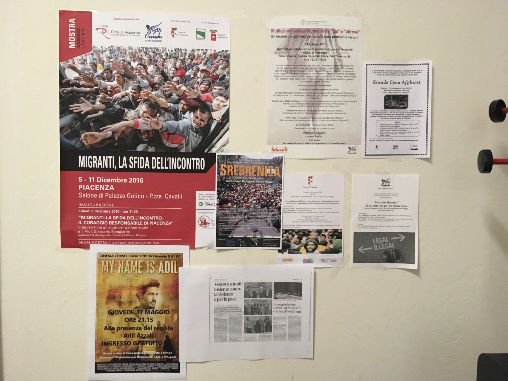
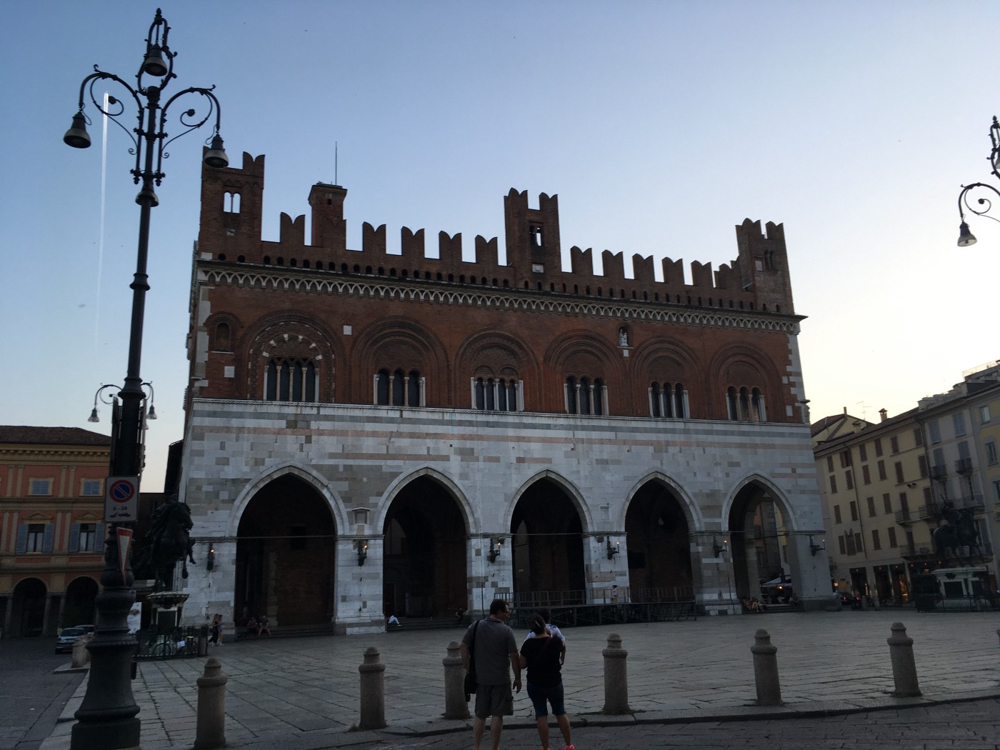
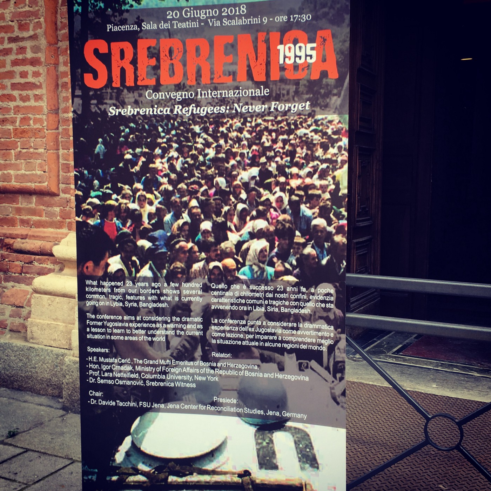

### AYS SPECIAL: Lessons to be learned from Italy

_Italians work hard to welcome recently arrived refugees, despite a new government that doesn’t want them\. Lara J Nettelfield went to Piacenza, Italy to participate in an event for World Refugee Day and learned about the city’s efforts to welcome forced migrants\._

](assets/95bf199b8bd5/1*m7pIhCBkAkDlKFAA5SVczg.jpeg)

By [Mustafa Jacoub](https://www.facebook.com/abo.jacoub/)

**_Getting to Italy_**

Ghulam Raza Ramazani remembers what it was like to be a newcomer to Italy\. He made the journey from his home city of Bamiyan, Afghanistan to Italy in 2010, joining thousands of people who have fled death threats from the Taliban\.That year he lost his father to Taliban forces and found himself as the family’s caretaker\. He took a job in local bank to help make ends meet\.

One day Ramazani got a call from the Bamiyan Provincial Reconstruction Team \(PRT\) of the International Security Assistance Forces \(ISAF\) stationed there and was soon hired as a translator\. Then the Taliban came calling\. They wanted him to inform them of the exact locations of foreign forces at specific times\.

“They consider all of the international groups as infidels and not true Muslims, Ramazani says\. “Your salary is haram \[a sin\] to them\.” When he refused, the Taliban escalated their threats\. “They said that if I didn’t work for them, they’d kill me,” he remembers\. “Killing someone in Afghanistan is not hard\.”

Ramazani worked with ISAF forces for almost a year but his mother insisted that he leave the country\. “If you are far away I can at least hear your voice; if they kill you I can’t even hear your voice,” she pleaded\.

He left for Iran where he met Afghans who had been there for a long time but were treated “like third class citizens\.” It wasn’t the life for him\. His agent took him to Turkey\. They spent 20 hours walking through the hills, travelling only at night\. He ended up in Istanbul\. There he saw the same problems\. The local agent told him of the Afghans who were unable to get official residency for decades and therefore couldn’t travel back to Afghanistan\. He saw people from Iraq, Bangladesh, and all over the world, saying: “Let’s go to Europe, let’s go to paradise,” Ramazani recalls\.

“Go and get your documents, the documents are the fundamental things,” the agent told him\.

He left for Greece on a boat meant for 10 people into which 35 were crowed\. What was promised to be a half\-hour journey took seven hours\. He arrived on a Greek island\. The names of the arrival islands are well\-known today to anyone who reads the papers — Lesvos, Samos, Chios — but he doesn’t remember where he landed, a testament to the mercy of a memory that fades past hardships\. Some elderly residents called the police when they saw the boat land\. He was taken to a camp\.

He soon left for the capital and found it was no better than Istanbul\. “In Athens I saw people like me sleeping in public parks with children and the elderly\. I said to myself that this is not what I wanted,” Ramazani says\.

His ultimate destination at the time was Sweden\. He decided to go via Italy\.

Getting to Italy was the most expensive leg of his journey: 3000 euros\. He left from Patras, the port town on the Peloponnese\. After 50 hours on a ship with 80 people, they arrived on the shores of Calabria\. People partying on the beach called the police\. They were transferred to a crowded camp where the wait for services was interminable\.

He fled the camp\. He made his way north\. He went to Rome\. He went by train from Rome to Ventimiglia to Cannes to Paris\. He was running out of money\.

In Paris, he called his mother to get the funds to pay the agents yet again\. This time, she had to sell some of the family’s land\. She managed to get it together in a few days\. Sweden was not in the cards\. He got stopped by the police in Dortmund, Germany on his way to Denmark, the last stop before his desired destination\. When they asked for his passport, he showed them his ticket instead\. They took him off the train\.

In Germany, he applied for asylum but after a year was returned to Italy, the first EU country to register his arrival, as required by the Dublin Agreement\. He had spent six months in a camp in Gorizia near the Slovenia border when he received asylum in Italy\. He was given the opportunity to join the nationwide SPRAR project and was resettled in Piacenza, a stunning town 95 kilometers south of Milan\.

The Protection System for Asylum Seekers and Refugees or [SPRAR](http://www.sprar.it/) program \( _Sistema di Protezione per Richiedenti Asilo e Rifugiati_ \) was created in 2002\. Piacenza launched its program in 2011\. It’s the Italian government’s most structured reception program for forced migrants\. Local municipalities work with local civil society organizations and private firms to provide extensive reception services that include housing, language classes, and vocational training\.

SPRAR program office in Piacenza, Italy\. Photo by LN

Ramazani spent 12 months in the program in total, the longest term usually available\. He even completed possibly the most Italian training of all: an apprenticeship course in pizza\-making\. He quickly added Italian to the other four languages he speaks\. The SPRAR project coordinators kept calling him to help with new arrivals\. In 2015, they hired him to work as an interpreter and social worker\. Now he is responsible for helping new arrivals\. A perfect circle\.

Ramazani calmly recounts his journey to me over an espresso\. We have been sitting in a small room in the program’s offices\. It’s a Friday afternoon and the office is quiet\. He had a busy schedule, however, starting with an early morning appointment with a project participant at the hospital\. At the end of our discussion, he tells me that his mother passed away last fall\. I couldn’t help but thinking that she saw him complete the journey to safety\. He’ll be a citizen soon\.

**_The Team_**

New arrivals have three priorities: work, documents, and language, Ramazani says\. And not always in that order\.

I’m sitting in on the Piacenza SPRAR team’s weekly meeting\. Everyone has generously switched to English\. All of the project employees are crowded around a table that doubles as a classroom for Italian lessons\. Everyone has a sandwich from the small café across the street\. It’s a warm Thursday afternoon\. Introductions are made: there are Italian teachers, a psychologist, the office staff, case workers, and the representative from the municipality\.

They start the meeting with a review of the minutes from the previous week\. They then proceed to discuss each participant’s progress in the program\. In the center of the table is a large spreadsheet that lists each one: their name, country of origin, date of birth, status, whether they possess an Italian health card, workplace, and their level in Italian lessons\.

There are 21 people in Piacenza’s SPRAR program\. They hail from Afghanistan, Gambia, Senegal, Guinea, Somalia, Nigeria, Mali, and Ethiopia\. They include people with humanitarian status, subsidiary protection, asylum seekers, and recipients of asylum\. The program provides housing, food, pocket money, a welcome box of linens, a coupon for a bike, legal and psychological assistance, subsidized driving lessons, and a 250 euro cash gift as extra help when the program is completed\. \(This usually goes toward a deposit on an apartment as they will often lose their project\-funded one\. \) Project participants spend six months in the program, which can be extended for another six\.

There are rules\. Violence is forbidden \(physical and verbal\), as are drugs, alcohol and smoking in SPRAR housing\. No guests in the apartment\. No animals\. Participants must show up on time to receive their money cards and pocket money\. Participants can’t miss Italians classes \(usually 8–10 hours per week\) without a valid excuse\. They are expected to accept most job offers\. All in all, it’s a reasonable set of requirements\. The project architects have extensive weekly discussions about how to both customize the program for each person and still ensure equality for everyone\. “Should we pay for his driver’s license fees?” someone asks the group\.

The program will pay for a portion of a participant’s driver’s license fee only if they are working and have the resources to pay the rest\. The person in question wasn’t working but his father had sent the funds from abroad to cover the cost\. In the end, the group decided it was best, and in keeping with the program norms, if he waited until he found a job\. \(SPRAR covers the full cost of a motorcycle license which is much less\. \)

Program coordinators regularly meet with participant’s and take them to their appointments, such as the meetings with the Territorial Commission for International Protection \(Commissioni territoriali per il riconoscimento della protezione internazionale, CTRPI\) in Bologna, where asylum interviews are held\. SPRAR architects in Rome acknowledge that some may leave the project with no house and no job\. “They said that doesn’t mean it’s a failure because you gave them the tools to survive in Italian society,” says Davide Tacchini, president of L’Ippogrifo, the local firm which manages the contract for SPRAR with the municipality\.

Tacchini and his colleagues would like to do more\. Piacenza has fewer SPRAR slots than other Italian cities of its size\. A city like Piacenza with a population of 100,000 would normally have around 100, Tacchini says\.

**_New Government, New Fears_**

The new anti\-immigrant climate that has emerged in the country since the March elections complicates their work\. The outspoken and overbearing Interior Minister, Matteo Salvini, has proposed a census for the Roma population and refused to welcome Search and Rescue \(SAR\) vessels to Italian ports, as required by international law\. \( [Fatalities](http://allafrica.com/stories/201807030002.html) have increased dramatically in the last few weeks\. \)

The Italian novelist Elena Ferrante recently described Salvini in _The Guardian_ : “\[He\]…is in line with the worst of the Italian political traditions\. Widely underestimated, used by television producers to enliven debates and generate publicity, he has become increasingly persuasive, giving the appearance of a good\-natured common man who thoroughly understands the problems of the common people and at the right moment bangs his xenophobic and racist fists on the table\.” This has ripple effects throughout the country\.

“It’s a hard time for Piacenza\. It’s a hard time for Italy with the new government\. Salvini is a populist\. He speaks to the stomach of the people not the head, ” says Paola Ghisoni, director of administration for Ippogrifo\.

Many see parallels with darker eras before\.

“My mother said it’s like something she saw in World War II, over 70 years ago\. Not all of the Italians were against fascism\. A small group arrived in favor of democracy but not everyone changed their ideas about fascism,” says Ghisoni\. “It’s difficult to say what you do for a living\. If you say you work with immigrants, they say ‘very well you are stealing money from our country,’ A lot of people think immigrants are eating our money, food, services, and jobs\.”

“It’s simplistic to speak against someone who’s poorer than you,” she adds\.

Ferrante reminds us of the fragility of our societies\. “Sometimes I imagine, anxiously, that the consensus around the bad feelings Salvini embodies \(and stimulates\) may spread beyond his intentions and slide into the mass brutality that in times of crisis is always lying in wait…”

Piacenza city center\. Photo by LN

Even little things can belie deeper attitudes\. One comment from the meeting stayed with me\. The classroom is located inside the archway of an old building\. Piacenza’s city center is filled with historic buildings that hide secret courtyards and gardens and that entice and enchant you\. These buildings, unsurprisingly, are home to many of the city’s well\-heeled residents\. One of the neighbors mentioned they didn’t like the project’s students waiting with their bicycles near the classroom doors\. Would it be a problem if they weren’t dark\-skinned? And in the 30 degree heat, it’s hard to imagine people standing in the sun for long\. Casual racism is often couched as a lack of neighborly consideration\.

The project’s architects are also trying to broaden the city’s currents of influence and demonstrate the benefits of diversity\. They hosted an event for World Refugee Day titled _Srebrenica’s Refugees: Never Forget_ \. The keynote speaker was the Mufti Emeritus of Bosnia and Herzegovina, Mustafa Cerić\. \(I was also invited to take part because of my research in this area\. \) The hall was filled with all 164 seats taken\. Many of the town’s refugees and asylum seekers joined\.

World Refugee Day conference in Piacenza\. Photo by LN

Šemso Osmanović, a survivor of the [Srebrenica genocide](https://www.potocarimc.org) , spoke at the end, describing his harrowing journey out of the UN enclave in 1995\. He was just a child\. Now he works on the SPRAR project, informed by his experience as a refugee in Italy over two decades ago\. Osmanović was resettled in Italy, learned the language, completed school and university, and received a Ph\.D\. from the University of Trieste after a stint at Harvard\. He advocates for awareness about the genocide while he works with new arrivals\.

“I think the Bosnian case can help the new refugees now,” Osmanović says\.

The scholarship supports this idea\. One hopeful example shows that those Bosnian refugees who arrived in European countries at a young age had similar employment rates as their native\-born cohorts, according to a recent study published on the European Politics and Policy [blog](http://blogs.lse.ac.uk/europpblog/2017/02/20/integration-bosnian-refugees/) of the London School of Economics\. People like Osmanović\.

Besides the formal program activities, the city’s activists organize other events to foster understanding, such as a recent culinary exchange among members of the Bosnian and Afghan diasporas\.

**_The CAS Project_**

The SPRAR meeting ended and another one was starting\. It was the weekly meeting of the CAS \(Emergency reception center or Centro di accoglienza straordinaria\) project\. CAS provides housing and services while people are waiting for asylum decisions\. \(SPRAR is usually for after an initial status determination has been made and has a considerably lower project participant to staff ratio\. \)

There are 191 recent arrivals in this project\. They were expecting a new baby any day to make 192\. “Piacenza differs from other hosting cities as people are housed in the city and not kept in jails outside of the city center like in \[cities in\] Belgium or in Maastricht,” says Fabrizio Statello, CAS project supervisor\. “It’s not a big town and there are more opportunities to meet citizens\.”

There are always issues to manage\. One of the participants recently had an operation which included radioactive treatment\. The doctors advised that he not be near his newborn for at least a week\. The team worked on finding a temporary housing solution\. Other topics emerged\.

“One of the biggest challenges is working with women from Africa and dealing with cultural differences and getting them to open up \[to us\] \. Women are the center of their families,” says Isotta Bruschini, a field worker and political scientist by training\. They discussed a tailoring class which some of the women were taking\. It was successful in part because childcare was provided\. The meeting ended\. They invited me to me join them at a bar and restaurant outside the center, [Coopertiva](https://www.cooperativainfrangibile.com/) \. It’s a cavernous locale filled with pictures\. It hosts events and has a library with over 6000 volumes, the kind of place you might find in Exarcheia, Athens\. Last year they fought off an effort to close it\.

We sat outside in the courtyard \(but kept tabs on the Argentina\-Croatia game on inside\) \. We talked politics\. We talked travel\. We continued on to a garden party, with pizzas in tow\. I didn’t want to catch my flight the next day, having met so many committed people quietly working on their mission\. I returned to Athens not having slaked my thirst for all things Italian\.

To fill the void, I rented [Roberto Rossellini’s _Rome Open City_](https://www.imdb.com/title/tt0038890/) , perhaps the most famous film of the Italian neorealist movement\. It was shot in the immediate aftermath of the Nazi occupation with only a handful of professional actors\.

At the end of the film, the Nazis are preparing to execute Don Pietro Pellegrini, the local priest who has been helping the resistance\. He’s tied to a chair in a field\. His parish altar boys, who also worked for the cause, crowd around a nearby fence\. They start whistling his song in solidarity\. It was the tune he used to identify fellow resistance members\. If you listen closely, you can hear it in the streets of Piacenza today\.

**_\(By [Lara J\. Nettelfield](http://www.humanrightscolumbia.org/profile/faculty/lara-nettelfield) , a Senior Lecturer at the Institute for the Study of Human Rights and Department of Political Science at Columbia University\. She is co\-author of Srebrenica in the Aftermath of Genocide and author of Courting Democracy in Bosnia and Herzegovina \(Cambridge University Press\) \) \._**

**We strive to echo correct news from the ground through collaboration and fairness\.**

**Every effort has been made to credit organizations and individuals with regard to the supply of information, video, and photo material \(in cases where the source wanted to be accredited\) \. Please notify us regarding corrections\.**

**If there’s anything you want to share or comment, contact us through Facebook or write to: areyousyrious@gmail\.com**

_Converted [Medium Post](https://medium.com/are-you-syrious/ays-special-lessons-to-be-learned-from-italy-95bf199b8bd5) by [ZMediumToMarkdown](https://github.com/ZhgChgLi/ZMediumToMarkdown)._
