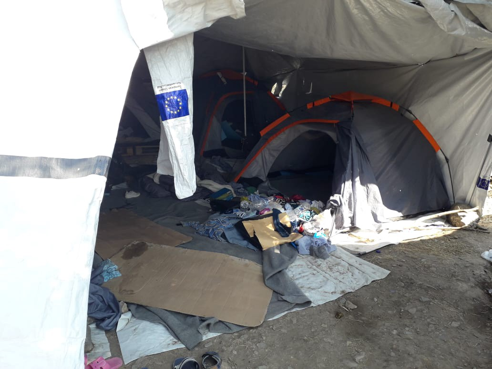
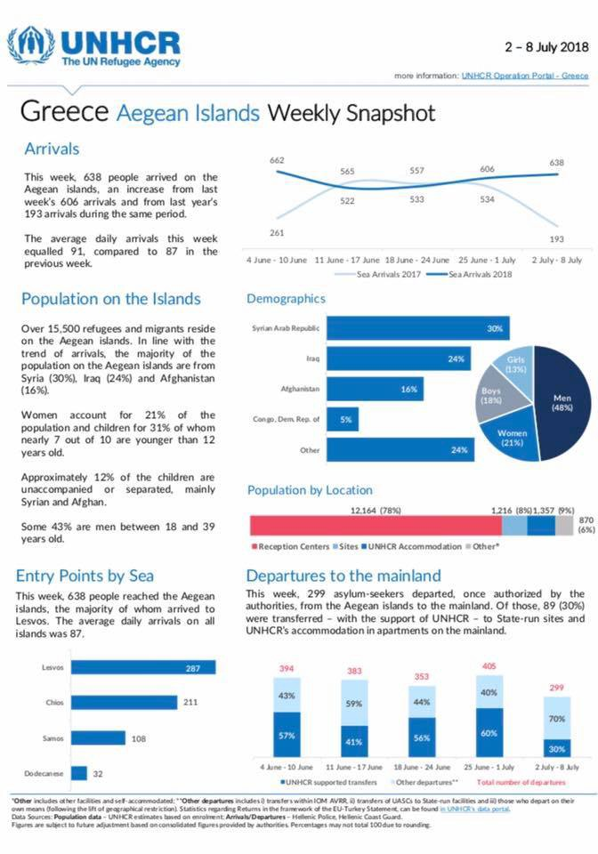
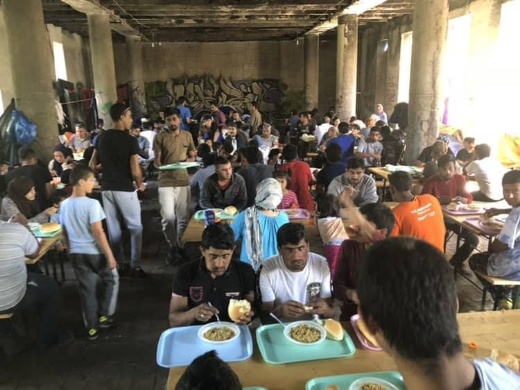
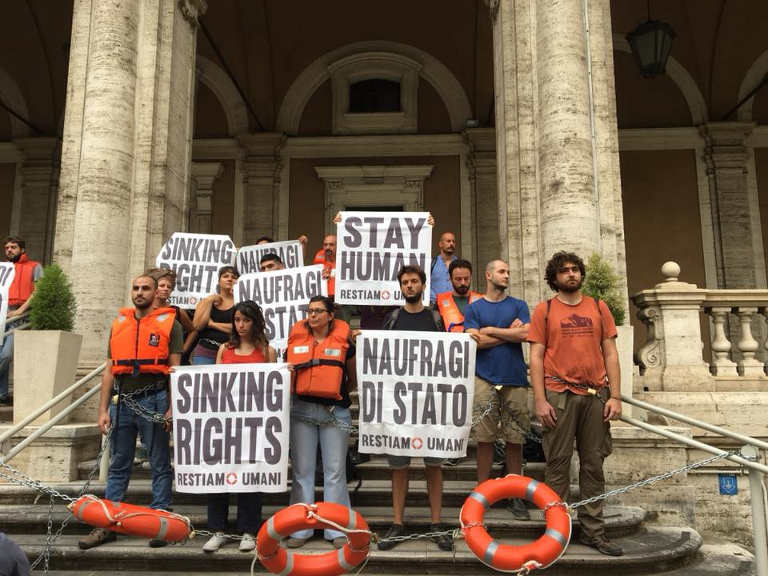
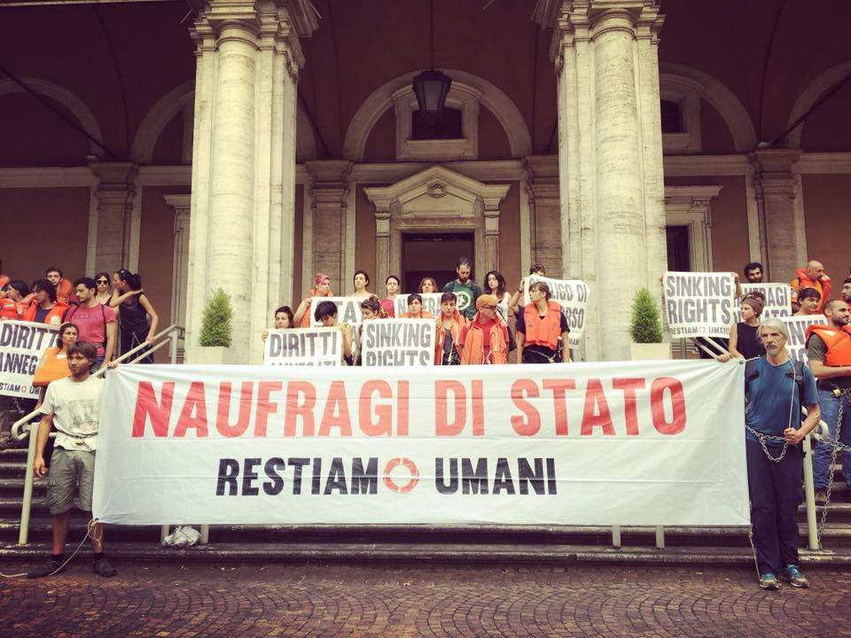

### AYS DAILY DIGEST 10/07/2018: More and more violence on Lesvos left eight people injured and one teenager shot at the head and legs

_Salvamento Maritimo rescuing hundreds of lives at sea//Indecent living conditions in reception centres in Romania//New arrivals to Greece//Clashes in Moria//Salvini denying docking to an Italian vessel which responded to a distress call//Protest in France to impede deportation of a Sudanese man//New initiative for disabled refugees in Sweden//More news from Bosnia, Italy, Germany…_

Credit: MSF
### Feature

Another [violent fight](http://www.ekathimerini.com/230526/article/ekathimerini/news/violent-brawl-leaves-eight-hurt-at-moria-migrant-camp-on-lesvos) broke out in Moria last night, leaving **eight** **people hurt and leading to 19 arrests** \. Damage to tents and personal belongings was also a direct consequence\.

The reasons why the fight began are still unclear to the authorities\. They managed to crush the clashes several hours after the initial spark\.

The fact that fights like this seem to erupt on a regular basis and are mostly due to exacerbated living conditions does not seem to worry the police and relevant authorities\.

According to AYS sources, the fight broke out between Arabs and Afghans and around 200 residents from Afghanistan are now sleeping rough in the park, while another 15 people are sleeping in front of Kara Tepe\. Others are camping just outside the entrance to Moria\.

The MSF team, with other NGOs, were there to offer medical support to at least 24 people involved in the clashes\.

■■■■■■■■■■■■■■ 
> **[MSF Sea](https://twitter.com/MSF_Sea) @ Twitter Says:** 

> > Last night our team in #Lesvos helped treat 24 people after more clashes broke out in #Moria camp. Cramming +7000 people in a space for ~2500 is inhumane and a recipe for disaster. #opentheislands #emptyMoria 

> **Tweeted at [2018-07-10 16:54:07](https://twitter.com/msf_sea/status/1016727276543774721).** 

■■■■■■■■■■■■■■ 

[More reports of violence](http://www.amna.gr/en/article/275286/Moria-farmer-shoots--injures-Syrian-teenager-near-hotspot-on-Lesvos) , unfortunately, are coming from Lesvos\. On Tuesday, a farmer shot a 16\-year\-old Syrian refugee in the head and legs\. The reasons for the incident are still unclear, but the teenager’s parents and brother are known to have witnessed the attack\. The family had arrived just just two days before and had left the camp because of the ongoing clashes\. According to medical sources, the teenager is not in critical condition\.

The farmer is a former convict, sentenced for the murder of his wife, who has tried to shoot refugees in the past as well, with the excuse that “he was afraid they were going to rob him”\.

The fact is that people in Moria are living in dire conditions and this is the main cause for the conflicts that occur almost daily\. People should not and cannot live in places like Moria\! \! \! \!

**SEA**

A breakdown of the number of people who drowned in the Mediterranean in 2018 \(also keeping in mind the 121 who died up to 10 July as well\) \.

[Jugend Rettet’s case](https://twitter.com/seawatchcrew/status/1016805432864792580?s=21) \. The Italian prosecutor’s office of Trapani is expanding investigations against INDIVIDUAL crew members as well, charged with retaining contacts with Libyan smugglers\. What about the EU commitment to stop criminalizing solidarity?

_Western Mediterranean_

134 people rescued by Salvamento Marítimo in the Alborán…

■■■■■■■■■■■■■■ 
> **[SALVAMENTO MARÍTIMO](https://twitter.com/salvamentogob) @ Twitter Says:** 

> > SAR Mastelero está trasladando a #Almería a 98 personas de 3 pateras rescatadas esta tarde (3ª patera: 2 personas rescatadas por @[guardiacivil](https://twitter.com/guardiacivil)).   4ª patera con 36 personas ha llegado a isla de Alborán. Allí auxiliadas por @[Armada_esp](https://twitter.com/Armada_esp). Guardamar Polimnia las trasladará a #Almería 

> **Tweeted at [2018-07-10 17:40:47](https://twitter.com/salvamentogob/status/1016739019579953153).** 

■■■■■■■■■■■■■■ 

…to add to the 82 people \(five women and a little girl among them\) rescued earlier by another vessel

■■■■■■■■■■■■■■ 
> **[SALVAMENTO MARÍTIMO](https://twitter.com/salvamentogob) @ Twitter Says:** 

> > Buque Luz de Mar ha rescatado 45 personas de origen subsahariano (entre ellas 5 mujeres y una niña). Se dirige a #Algeciras con un total de 82 personas procedentes de 2 pateras. Llegarán a puerto a las 19.30 horas. https://t.co/tJ3pyH8sFF 

> **Tweeted at [2018-07-10 15:57:16](https://twitter.com/salvamentogob/status/1016712968866877440).** 

■■■■■■■■■■■■■■ 

…and to the 44 saved by a third vessel\.

■■■■■■■■■■■■■■ 
> **[SALVAMENTO MARÍTIMO](https://twitter.com/salvamentogob) @ Twitter Says:** 

> > Guardamar Concepción Arenal ha rescatado 44 personas (entre ellas 6 mujeres) de una patera localizada en el Estrecho y los está trasladando a #Tarifa. Buque Luz de Mar ha rescatado 37 personas (31 hombres, 5 mujeres y una niña). Son todos de origen magrebí. 

> **Tweeted at [2018-07-10 14:11:28](https://twitter.com/salvamentogob/status/1016686343399919616).** 

■■■■■■■■■■■■■■ 

**ROMANIA**

A [recent update on living conditions](http://www.asylumineurope.org/news/02-07-2018/romania-living-conditions-reception-centres-persisting-concern) in the regional centres for asylum seekers of Bucharest and Giurgiu\. Basic needs are still not being met; the sanitary facilities and showers are in unmentionable conditions\.

“ _\[…\] the outdoor playground was found to be in poor condition, with toys near the playground thrown across the floor and old steel bed frames with grass growing through them left near the playground, thereby posing a safety risk for the children_ ”\.

“ _While no child living in Giurgiu has enrolled at school for the past three years, according to NGO representatives, the new\-born baby of a family of protection\-status holders in Bucharest was not granted the financial assistance of 700 RON / 150 € provided to beneficiaries of international protection by the International Organisation for Migration \(IOM\), among other forms of support available to status holders_ ”\.

**CYPRUS**

More and more refugees, including families with children as young as one\-year old, are forced to sleep on the streets due to a lack of shelters and coverage of basic needs\.

Rent allowances are too few, delayed and insubstantial to guarantee asylum seekers a shelter\. Moreover, access to paid jobs is limited for the first six months and mainly is for low\-wage positions\. Care services for families and education for children are absent\.

Read more [here](https://www.facebook.com/notes/cyprus-refugee-council/αυξάνονται-οι-αριθμοί-άστεγων-προσφύγων-increasing-numbers-of-refugees-homeless-/279496189281911/?fref=gs&dti=1652972374920129&hc_location=group) \.

**GREECE**

Greek Migration Policy Minister, Vitsas, sent a [letter](http://www.ekathimerini.com/230497/article/ekathimerini/news/islanders-told-they-will-not-receive-migrant-returns) to the majors of Lesvos, Chios, Kos, Leros, and Samos to promise them that no migrants will be sent from Germany to the hotspots on the islands, where almost 18,000 refugees currently are stuck\.

Some 3,300 refugees who are registered in Eurodac in Greece, but managed to make their way to Germany, will be sent back\. Discussions between the German Interior Ministry and Athens will start today\. Additionally, they will talk about the reunification process between some 3,500 families living in Greece and their relatives in Germany\.

_Arrivals_

■■■■■■■■■■■■■■ 
> **[Aegean Boat Report](https://twitter.com/ABoatReport) @ Twitter Says:** 

> > One boat landed in Eftalou, Lesvos north, 00.43.
51 people.
No breakdown at this time. 

> **Tweeted at [2018-07-10 22:45:01](https://twitter.com/boataegean/status/1016815582682009600).** 

■■■■■■■■■■■■■■ 

_Islands_

UNHCR has published the weekly update on arrivals in the Greek islands, where 638 people landed this week, adding to the 15,500 plus migrants living on the Aegean islands already\. The majority of arrivals are from Syria, Iraq, Afghanistan\. 52% of them are women and children, 12% circa unaccompanied\.

**\#savepikpa**

**BOSNIA**

750 meals were distributed yesterday at the “official camp” run by the Red Cross in Bihać, where even basic living conditions are not being met, while the building itself is unsafe, has no roof or windows\. The Red Cross is distributing one meal a day\.

Credit: Red Cross

**ITALY**

Salvini is so willing to close Italian ports that [he refused disembarkation](https://www.thelocal.it/20180710/italy-turns-away-private-italian-ship-vos-thalassa-rescued-migrants-libya) to an Italian\-flagged vessel as well, carrying 66 migrants on board\.

The Vos Thalassa, a civilian vessel operating as supply delivery boat in the Mediterranean, responded on Monday to a distress call off the Libyan coast\. It reached the people in distress before the LCG, requesting permission to dock at an Italian ports; permission was denied\.

In addition to the Minister’s intent to close the ports to every NGO ship “all summer”, he is now denying landing to an Italian\-owned, Italian\-flagged vessel, doing its duty to rescue boats in distress because of its proximity to the event\.

However, the migrants were all subsequently moved to an ICG ship, the Diciotti, due to the “riots” and tension on Monday night on board the vessel, as the migrants feared they would be brought back to Libya\.

UNHCR also intervened to [express](https://www.unhcr.it/news/unhcr-prioritario-salvare-vite-individuare-urgentemente-un-porto-sbarco.html) concern about the denial to permit the docking of an Italian boat, stressing the necessity if complying with humanitarian principles and international law\.

Latest updates are that the boat, the Diciotti, will be allowed to disembark in Italy, but a safe port has not yet been identified\.

Salvini today was also busy visiting the makeshift camp at San Ferdinando, Calabria, where people with orderly papers are being forced to live, exploited by the agricultural mafia\.

The Minister was obviously confronted, escorted by a disproportionate number of police agents, pretending not to know what was going on there when a spokesperson decided to talk to him about the exploitation\. Much respect and solidarity to all those who were there, confronting a racist, propaganda lover\.

[Here is an open letter from SOS Rosarno to Salvini](https://www.facebook.com/permalink.php?story_fbid=2062881313964988&id=1711634685756321&hc_location=ufi) \(in Italian\) \. SOS Rosarno is a local NGO, which was created by migrants and locals and aims at introducing fair trade rates for those employed in the seasonal picking jobs\.

Meanwhile, in Rome, the 120 people evicted last week are still sleeping rough, with no alternative shelter, with no water, with no sanitation present on the ground\.

With the increasing heat, the Questura has denied women, men and children access to running water inside the structure, while the local municipality is indifferent to all that is going on\.

Present on the field to support the migrants are the union, USB Federazione del Sociale, and MEDU, doctors for human rights\.

Credit: Eleonora Camilli

Happening now in Rome\. Activists chained themselves in front of the Ministry for Transport\.

**FRANCE**

Anafè has launched an [appeal](http://www.anafe.org/spip.php?article480) to the government to stop the detention of children\. A new asylum law is currently being discussed in parliament, and they take this as an opportunity to appeal to the government to stop this practice\. Since the beginning of the year, 124 children have been in detention centres, and as of 8 July, eight children \(among them a five\-month old baby\) were in detention\.

Of the 56 detained families in Paris, 54 were released before 48 hours passed and and two stayed for nine days, in all cases because the higher courts \(the EU Court for Human Rights\) ordered them to be released\. A joint initiative of NGOs has already collected 135,000 signatures protesting the detention of children\.

One hundred fifty protesters gathered on Monday 9th July 2018 to impede the departure of Nordeen Essak\. This young Sudanese man has been living with an expulsion order since December 2017\. He was transferred near Paris to await his transferral to Italy\.

Noordeen Essak, a 21\-year old man from the Sudan who arrived in France a little more than a year ago and has lived since December 2017 at Faux\-la\-Montagne, has been arrested by the Gendarmerie and sent to Paris to await his expulsion to Italy\.

With barricades en route and roadblocks in front of the Gendarmerie, Felletin, the support committee for Noordeen Essak, has done everything to hinder the departure of someone they consider to be one of their own\. One hundred fifty protesters, just as for the protest of 25 June of this year, came to demonstrate against a ruling they judged to be inappropriate\.

Noordeen Essak speaks French and has been well integrated into local life\. Despite all this, the Prefect, Magali Abatte, has not changed his position on the matter\.

Fifty gendarmes had been deployed from three regions, and everything was arranged to move the young Sudanese man\. Feelings were running high after five hours of confrontation\. The gendarmes even used tear gas as a diversion\.

Noordeen Essak was taken away discretely\. He was immediately placed in an administrative detention centre at Le Mesnil\-Amelot en Seine\-et\-Marne near Paris, the largest in France, located a few kilometres from Charles de Gaulle airport\. His days in France are numbered and he is supposed to be expelled on Wednesday\.

The Prefecture has declared that two gendarmes have been injured\. It criticized the violence and hailed the calmness of the police under pressure\. On the side of the demonstrators, Michel Lulek, the spokesman for the support committee, was detained for violence against a person in charge of public order and released in the evening\.

See the original source [here](https://france3-regions.francetvinfo.fr/nouvelle-aquitaine/correze/jeune-soudanais-envoye-paris-malgre-manifestants-1510205.html) \.

**GERMANY**

Refugee Law Clinics Abroad has published a commentary on the presention of the “Master plan for migration” today by Interior Ministry, Seehofer\. The plan is mainly targeted at the creation of deportation centres \(“Hotspot approach”\) and at avoiding the creation of new shelters, seen as a threat\. Moreover, it states that Germany wants to contribute to the creation of better reception conditions in Greece, basically admitting that the actual conditions are horrendous\. The aim will be to avoid people moving to the mainland and to promote a full implementation of the EU\-Turkey deal\.

“ _Moreover, the Ministry of Interior is obviously of the opinion that people who have used Turkey solely as a transit country could be sent back there\. This is — to put it mildly — quite controversial, because the safe third\-country concept requires the applicant to be linked to the third country\. The decision\-making practice is ambiguous; [the appeals authority in Greece does not even consider a temporal dimension alone to be sufficient, but demands a real link](https://www.juwiss.de/135-2017/) \. For the Federal Republic — that much is now clear — the passage should be enough\._ ”

Read the more on this and the full statement [here](https://refugeelawclinicsabroad.org/2018/07/10/master-plan-migration/) \.

**SWEDEN**

Disabled Refugees Welcome is a quite new initiative, financially supported by a foundation, for newly arrived refugees with disabilities, located in Farsta, 20 minutes outside of Stockholm\. Everyone is welcome, and the aim is to provide help, social services and a place to meet others in similar situations\. The next meeting will be on 20 September, after the summer break\.

In 2016, 27,400 people were informed that they would have to leave Sweden\. According to DN’s research, 59 percent of them have left by now\. Meanwhile, the status for the additionally 41 percent is unknown\. It is likely that many of them remain in Sweden, living hidden somewhere\. 13,510 people left the country without force, and 2373 people left after the border police took over\. Another 512 people has left for other reasons, according to the Migration Agency’s [data](https://l.facebook.com/l.php?u=https%3A%2F%2Fwww.dn.se%2Fnyheter%2Fsverige%2Ffakta-i-fragan-hur-manga-asylsokande-som-fatt-avslag-stannar-anda-i-landet%2F&h=AT13hmyVAS-vWr9pkjPRyEAqlLbE7Vn-KYfrLNa5htIXaZE2nBhs__2MSfevSQm875clNuwBJGs973qHyJ12lR7-Rt63Vb2ZD6PBbPzQ3SDPv_su6YIsAfAyPMjVcGrcMfAI0nVs_g) \.

**We strive to echo correct news from the ground through collaboration and fairness\.**

**Every effort has been made to credit organizations and individuals with regard to the supply of information, video, and photo material \(in cases where the source wanted to be accredited\) \. Please notify us regarding corrections\.**

**If there’s anything you want to share or comment, contact us through Facebook or write to: areyousyrious@gmail\.com**

_Converted [Medium Post](https://medium.com/are-you-syrious/ays-daily-digest-10-07-2018-more-and-more-violence-in-lesvos-left-8-people-injured-and-one-c5e7b27d7c77) by [ZMediumToMarkdown](https://github.com/ZhgChgLi/ZMediumToMarkdown)._
