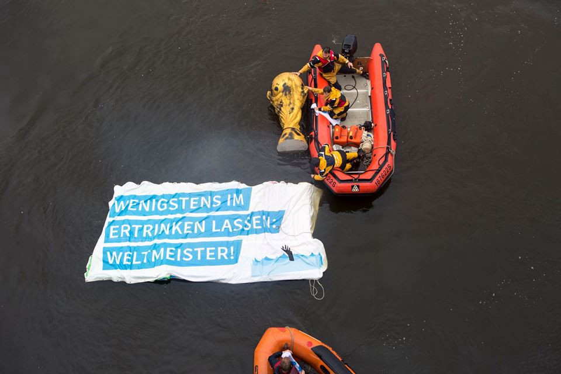
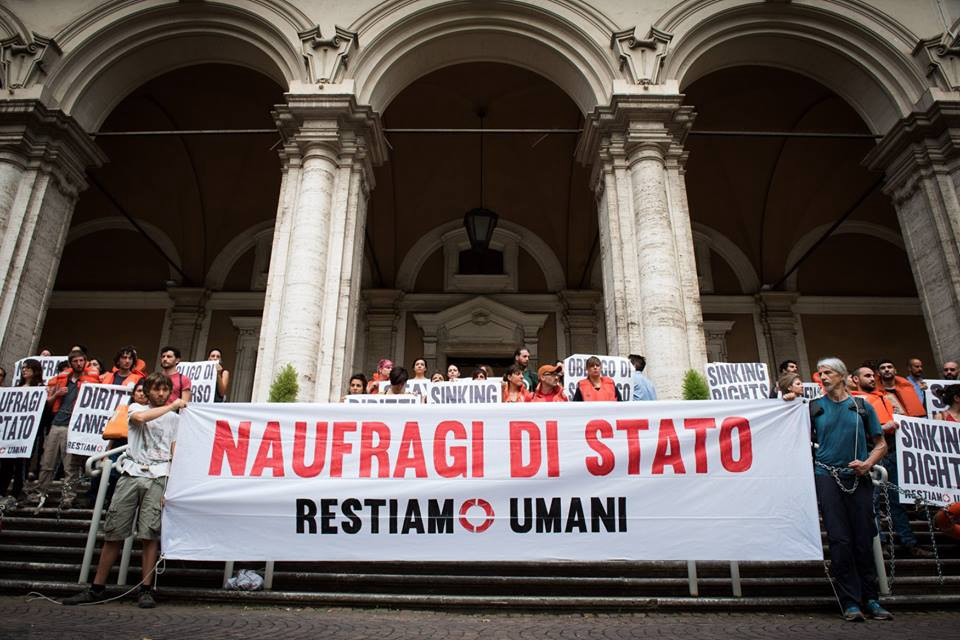
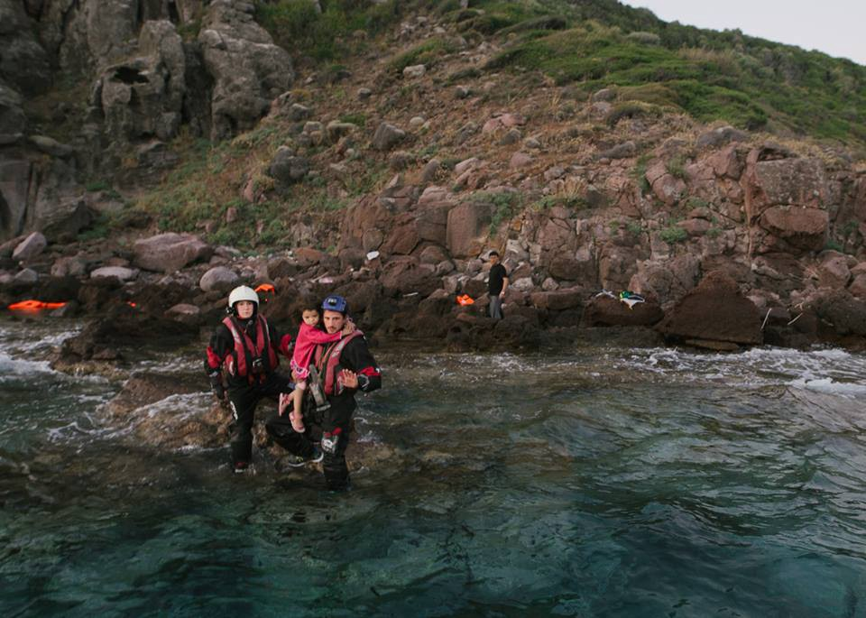
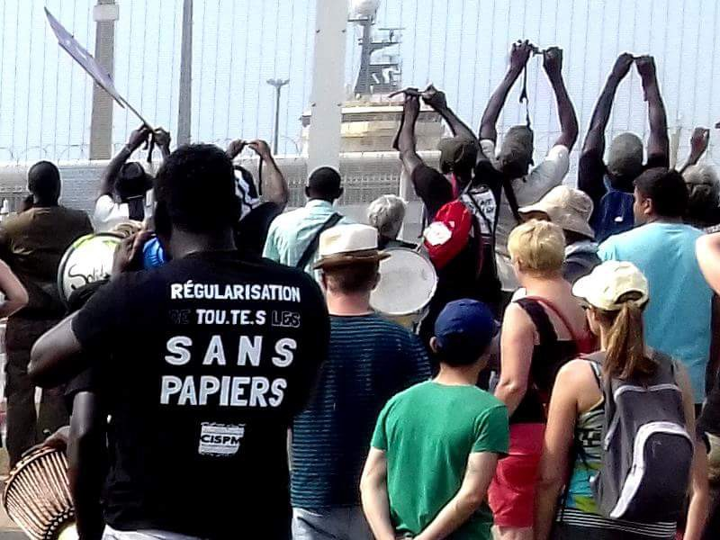

### AYS DAILY DIGEST 11/07/2018: “World Champions in letting people drown”

_Protests take place in Germany and Italy over EU and state inaction in the Mediterranean//Donations needed in Calais//Protests continue against arrests during solidarity march in support of refugees//Information on illegal pushbacks in Greece//_

Photo by Sea\-Watch
#### Feature

[Sea\-Watch](https://www.facebook.com/seawatchprojekt/) crew protested on Wednesday morning on the Elbe River in Hamburg against the inaction of the German government over the deaths in the Mediterranean\.

At the same time, activists of the [Restiamo Umani](https://www.facebook.com/RESTIAMO-UMANI-167044623348856/) alliance blocked the Italian Ministry of Transport in Rome to protest against the port blockade for rescue ships in Italy\. According to [Baobab Experience](https://www.facebook.com/BaobabExperience/) , the activists are asking the EU to assume its responsibility and provide for a clear search\-and\-rescue mandate\. They are also demanding an end to the Italian government’s policy of preventing rescue operations and of blocking access to its ports\. Police eventually arrived to dislodge the protesters\.

■■■■■■■■■■■■■■ 
> **[Baobab Experience](https://twitter.com/BaobabExp) @ Twitter Says:** 

> > Dopo il muro di gomma di @[DaniloToninelli](https://twitter.com/DaniloToninelli) al @[mitgov](https://twitter.com/mitgov) polizia taglia catene e procede a portare via di peso attivist* del presidio #restiamoumani. 
Anche oggi si dialoga domani #NaufragiDiStato https://t.co/bmgHzhl4BU 

> **Tweeted at [2018-07-11 13:21:50](https://twitter.com/baobabexp/status/1017036240468799488).** 

■■■■■■■■■■■■■■ 

The [Seebrücke](https://www.facebook.com/SeebrueckeSchafftsichereHaefen/) alliance is also calling for further demonstrations throughout Europe\. In The Hague for example, a [protest](https://www.facebook.com/events/1964688123588888/) will take place next Wednesday against the EU policies on the Mediterranean Sea\.

**_Do not hesitate to inform us of more events taking place on this issue in the near future\._**

Meanwhile, most Italian papers, including [_La Repubblica_](http://www.repubblica.it/cronaca/2018/07/11/news/migranti_vos_thalassa_salvini-201454105/?ref=RHPPLF-BH-I0-C8-P1-S2.4-T1) , report Interior Minister Salvini saying he won’t allow the Coast Guard ship Diciotti to dock in Trapani unless the refugees on board who were allegedly involved in violence against the Italian vessel Vos Thalassa, which initially rescued them off Libya, are arrested and spend time in jail before being sent back to their country\. [_La Repubblica_](https://rep.repubblica.it/pwa/generale/2018/07/11/news/m5s_migranti_lega-201519789/?ref=RHPPLF-BH-I0-C8-P1-S1.8-T2) , however, reports Deputy PM Di Maio said it’s unthinkable to close the port to an Italian ship, and called for “realism instead of slogans”\.

**Despite this dispiriting news, rescue ship organisations are not losing hope\.**

Sea\-Eye is looking at a new “Sea\-Eye 2” project, saying it is “determined to strenghten the civilian fleet” of sea rescue boats\. In the meantime, the organisation is raising [funds](https://sea-eye.org/en/english-donations/?donate) \. It also needs a skipper for the mission of its Seefuchs boat from August 14–29\.

Lifeline meanwhile is raising [funds](https://mission-lifeline.de/de/spenden) for a replacement ship as its current one is still stranded in Malta\. The captain of their boat, Claus\-Peter Reisch, has been allowed to leave Malta from 16–29 July to visit his 93\-year old mother, after which he will have to return to the island for a court hearing\.

Photo by Sea\-Watch
#### Greece
### Refugees arrive to Greece

Photo by Mo’Chara

One boat with 15 people arrived in northern Lesvos on Tuesday night, helped by Mo’Chara and another boat with 51 people arrived in northern Lesvos according to Lighthouse Relief\. Both boats landed on a difficult part of the coast\. The boat with 15 people in particular arrived at the foot of a rocky cliff that was impossible to climb\. One boat with 30 people arrived on Kos according to the [Aegean Boat Report](https://www.facebook.com/AegeanBoatReport/?hc_ref=ARRwNaM69cF6r-J2tvjx-MBxUGzccbvzMw2FSvKUTsHTFX1YX51aggSxgB77Br2pc0M&fref=nf) \. On Wednesday night, 36 people arrived on Chios according to [Salvamento Marítimo Humanitario](https://www.facebook.com/smhumanitario/?hc_ref=ARTIeI84oYu1DHzlayp8ZLybrgkk1QWZICrVyNEy4-FQRY7BHnVkMAvn-IBWNomtz5M&fref=nf) \.
### Information on illegal pushbacks

Refugee Info Bus has put out a video on what to do when being illegally pushed back across Greece’s land border with Turkey across the Evros river\. It offers recommendations on how to act when apprehended by police in order to reduce the risk of an illegal pushback\.

#### France
### Care4Calais needs donations

Care4Calais urgently needs jeans and jogging bottoms, boxer shorts, sleeping bags, shoes, mobile phones and backpacks for its Calais warehouse\. You can drop them off at one of the places on this [map](https://www.google.com/maps/d/u/0/viewer?ll=47.63592467028903%2C2.3729749750000337&z=4&mid=1bqc9Lc5uOE0o8lXPYmLc2RwGn7zNSxdh) or donate funds [directly](https://mydonate.bt.com/donation/v4/chooseAmount.html?charity=164447&currentMonth=6) \.

Care4Calais has also started a petition to change UK laws on family reunification:

> They deny child refugees the right to bring their parents to the UK; this means that parents have to leave behind their children even if they have only just turned 18; and this means that elderly parents are left behind in war\-torn countries to fend for themselves\. 

The petition calls on changes to the current rules that would allow child refugees in the UK the right to sponsor their close family, expand who qualifies as family, so that young people who have turned 18 and elderly parents can join their family in the UK, and reintroduce legal aid for refugee family reunion cases\. You can sign the petition [here](http://petitions.care4calais.org/) \.
### Protests against arrests of undocumented people during solidarity march

Photo by La CSP75 — Coordination 75 des Sans Papiers

Protests continue over the arrest of four people who participated in the solidarity march from Ventmilgia to London\. On July 8, 54 walkers arrived at the border control in Calais\. Border police stopped 22 of them, all members of associations of undocumented people of the Paris region, as they didn’t have the documents to board the ferry to Dover\. Five of them were brought to a retention centre\. Two of them are still detained and their appeal will take place today\. [A protest against their detention will take place today at 6PM](https://www.facebook.com/events/196228124385149/) in front of the Ministry of Interior in Paris\.
#### Germany
### Man commits suicide after deportation to Afghanistan

[_Tagesspiegel_](https://www.tagesspiegel.de/politik/asylpolitik-abgeschobener-afghane-erhaengt-sich-seehofer-in-der-kritik/22789716.html) reports on the suicide of an Afghan man who took his own life after being deported from Germany\. This has led politicians from the SPD and opposition to call for the resignation of IM Seehofer, as he had welcomed an increase in deportations and noted on Tuesday that 69 Afghans had been deported on his 69th birthday\.
#### Italy
### Kesha Niya needs support

Kesha Niya, which has been providing warm meals and other aid in Ventimiglia thanks to their van for more than a year now, needs support\. In particular, funds are needed to repair the van and continue to provide food to people in the Ventimiglia area\. You can send funds to the bank account below and see more of their work [here](https://www.facebook.com/KeshaNiyaProject/) \.

GLS BANK
Frederik Bösing:
IBAN: DE32 4306 0967 2072 1059 00
BIC: GEN0DEM1GLS
#### Spain
### Spanish government condemned for failing to relocate refugees

ECRE says the Spanish Supreme Court criticized the Spanish government for partially failing to meet its obligation to relocate a total of 19,449 asylum seekers from Greece and Italy between 2015 and 2017\. Spain only processed 12\.65 % of the 19,449 refugee applications from Greece and Italy established by the EU\.

**We strive to echo correct news from the ground through collaboration and fairness\.**

**Every effort has been made to credit organizations and individuals with regard to the supply of information, video, and photo material \(in cases where the source wanted to be accredited\) \. Please notify us regarding corrections\.**

**If there’s anything you want to share or comment, contact us through Facebook or write to: areyousyrious@gmail\.com**

_Converted [Medium Post](https://areyousyrious.medium.com/ays-daily-digest-11-07-2018-world-champions-in-letting-people-drown-90950ad45a3c) by [ZMediumToMarkdown](https://github.com/ZhgChgLi/ZMediumToMarkdown)._
