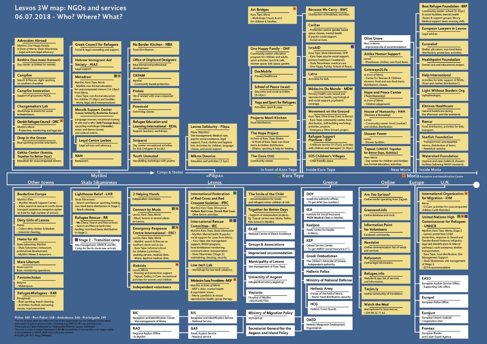
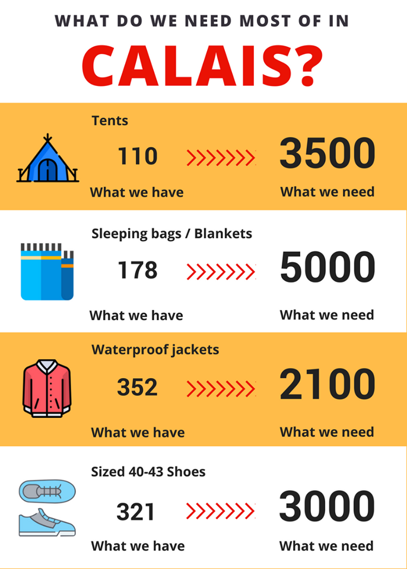
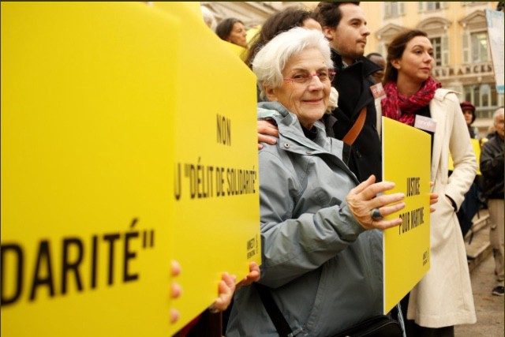

### AYS Daily Digest 12/07/2018: Universal obligations ignored to instead criminalize victims

_Italian camps evicted / Accounts of Libyan and Turkish coast guards / 73 year old supportive woman in France criminalized / Trump protests in the UK / Right to work established in Ireland / And more news…_

 \)](assets/4d56889115e1/1*uudpUWfFqpoKMmWc3Y5M3Q.jpeg)

Peaceful protest against Minister Salvini’s actions \(or inaction\), letting people drown at sea\. \(Photo by [Giorgia Linardi](https://twitter.com/giorgialinardi) \)
### **FEATURE: Italy continues to ignore international obligations, criminalize victims**

After a tug of war battle between human rights activists and the Italian authorities, [the 67 people](https://twitter.com/localteamtv/status/1017531445546450947?s=21) who were stranded at sea for four days have disembarked at the Trapani port in Sicily\. [The Italian Interior Minister, Matteo Salvini,](https://www.agi.it/cronaca/migranti_diciotti_trapani_vos_thalassa-4145515/news/2018-07-12/) had accused two of the refugees on board of hijacking their rescue ship\. This is contrary to [a statement](https://twitter.com/scandura/status/1017340403983450113) by the owner of the ship confirming that there was no mutiny or violence on board whatsoever\.

Salvini still refused to let them off the boat until a full investigation into the identities of the people was completed\. [The two men](https://twitter.com/localteamtv/status/1017531445546450947?s=21) , one from Ghana and the other from Sudan, left the port in police cars — sirens blaring — around 9pm local time\.

UNHCR Italia, OIM Italia, UNICEF Italia, Inter SOS, Save the Children, and MSF released [a joint press release](https://twitter.com/MSF_ITALIA/status/1017458517119324160) earlier in the day urging the government to reverse its decision and provide these people with medical and other forms of assistance\. Saving people drowning at sea is a [universal obligation](https://twitter.com/RefugeesChief/status/1017485466516500481) but it would appear that the new normal for Europe is to either ignore this moral imperative or lay blame on the people fleeing themselves\.

[Aegean Boat Report](https://www.facebook.com/AegeanBoatReport/videos/393239741199136/) shared a video capturing a boat headed towards Chios being stopped the Turkish Coast Guard\. Those on board, some 57 people \(25 children, 15 women, and 17 men\), join countless others in being delayed in seeking asylum\.
### LIBYA

A quote from a Libyan Coast Guard \(LCB\) from an [IRIN special report](https://www.irinnews.org/special-report/2018/07/11/destination-europe-demoralised) :

> “It’s true that sometimes our Navy guys use a rope or stick to threaten the migrants, but this is just to scare them into being quiet while we try to complete the rescue\.” 

He says this on account of them not being allowed to carry guns, and the people being terrified to go back to Libya, to suggest that guards need to defend themselves in case people fight back\. The reports from the LCB try to show professionalism and transparency, but continue to be a cover for the seemingly lawless force who have been repeatedly implicated in people smuggling and horrific abuse\. This is the force Europe has chosen as an ally\.
### SEA

[Salvamento Maritimo](https://twitter.com/salvamentogob/status/1017484410751455232) reports that four rescue missions saved people today\. [Marina Gadir](https://twitter.com/salvamentogob/status/1017437194124918784) rescued 30 people\. [Marina Arcturus](https://twitter.com/salvamentogob/status/1017335807236083713) rescued 62 people from six boats\. [Guardamar Concepción Arenal](https://twitter.com/salvamentogob/status/1017335807236083713) rescued 13 people from one boat\. Lastly, [Marina Hamal](https://twitter.com/salvamentogob/status/1017484410751455232) rescued 52 men from one boat and 55 people \(35 men, 14 women and 6 children\) from a second vessel in Mar de Albor\.

We cannot forget that [600 people have died](https://www.facebook.com/sosmeditalia/photos/a.1628168157433172.1073741828.1627633387486649/2071208053129178/?type=3&theater&ifg=1) in the Mediterranean since European governments began blocking sea rescuers — 600 deaths on Europe’s conscience\. [MSF](https://twitter.com/MSF_Sea/status/1017346709662392320) is calling on Europe to set up a proactive rescue capacity to stop these unnecessary deaths\. In some related good news, the [Aquarius will be back](https://www.facebook.com/sosmeditalia/photos/a.1628168157433172.1073741828.1627633387486649/2071208053129178/?type=3&theater&ifg=1) at sea by the end of the month\.
### GREECE: ISLANDS
#### Crisis in Moria persists

The tension from Moria is far from over\. [A volunteer clarifies](https://www.facebook.com/stichtingbootvluchteling/photos/a.1380423092287734.1073741828.1380397158956994/2025726607757376/?type=3&theater&ifg=1) , “The camp looks like a humanitarian crisis within a humanitarian crisis\. Everywhere you see complete families dragging all their belongings to a safer place\.” When will these families finally be provided safety?
#### NGOs working on Lesvos \(with descriptions\)

Here is a [comprehensive list](https://www.facebook.com/photo.php?fbid=10216872841357773&set=gm.908061676067947&type=3&theater) of descriptions of NGOs working on Lesvos\. Please share to people looking to volunteer so they can be well informed\.

#### \#SavePikpa petition

The petition to \#SavePipka, a small, community based camp in Lesvos for the most vulnerable families, from closing still needs signatures\. Find it [here](https://secure.avaaz.org/en/petition/Region_of_North_Aegean_SAVE_PIKPA_open_refugee_camp_in_Lesvos_1/) \.
#### Situation for new arrivals dire on Chios

[According to dedicated volunteers](https://twitter.com/ahampay/status/1017536871948279813?s=21) the situation for new arrivals on Chios is dire\. Women who are eight months pregnant are sleeping in sleeping bags in the open air and children are exposed to all sort of bugs and snakes\. Tents are needed ASAP\.
### GREECE: MAINLAND

On Wednesday the Greek Dublin Unit published a list of the people who will be informed on their travel date and ticket information\. You can find the list [here](http://asylo.gov.gr/en/wp-content/uploads/2018/07/Asylum-cases-which-have-been-informed-on-ticket-issue-and-departure-day.pdf) \.

Here is a useful snapshot of the health problems in Greece by the Greek NGO [Medecins du Monde](https://mdmgreece.gr/app/uploads/2018/07/SnapShot_EN-1.pdf) \.

](assets/4d56889115e1/1*n4fIZBM7SXVsiwh3QLP-Lg.jpeg)

Photo by [Medecins du Monde](https://mdmgreece.gr/app/uploads/2018/07/SnapShot_EN-1.pdf)
#### Call for donations

[NGO SOS Refugiados](https://twitter.com/sosrefugiados/status/1017326206407118849) is asking for donations to buy food to continue their services\. For just one euro a month you could help feed the 3,000 refugees they serve a day\.
#### Call for supplies

We Are Here community center in northern Greece desperately need supplies for the new arrivals in the summer months\. [Found out how you can help here](https://www.gofundme.com/we-are-still-here-and-it039s-hot) \.
### ITALY

In Rome, [a volunteer organization](https://www.facebook.com/BaobabExperience/photos/a.840628946013859.1073741828.840615826015171/1744710572272354/?type=3&theater&ifg=1) reports that people are being evicted for failing to submit three files for a “census,” after which they are then taken to the Immigration Office\. [On Thursday, 35 boys](https://twitter.com/BaobabExp/status/1017305920118894592?s=19) were taken and the only means of shelter available to them now are tents on the street [donated by citizens](https://www.facebook.com/BaobabExperience/posts/1745342005542544) \.

The political pressure close to the Italian\-French border continues since the autonomous refugee accommodation, [Chez Jesus](https://www.facebook.com/362786637540072/photos/a.362811254204277.1073741829.362786637540072/414167022402033/?type=3&theater) , is now under clearance\. Both the church and state have agreed to close the shelter which has provided hundreds of people a safe space to stay when on the road\. They are considering offering an alternative shelter 15 kilometres from the border, but it would have only 15 beds\.
### BULGARIA

[In an interview](https://www.facebook.com/BulgarianHelsinkiCommittee/posts/1844974278917948) with DW, Foreign Minister Ekaterina Zaharieva says she will not build controlled asylum centers for refugees\. Integration in the hardline anti\-immigrant border country is nearly impossible, states the Bulgarian Helsinki Committee\.
### BOSNIA & HERZEGOVINA

The official figure of registered new arrivals to the country from January 1st to June 30th 2018 is 7,652 people\. At the same time, there have been only 684 asylum applications, indicating that access to asylum remains a problem for people in Bosnia\.
### AUSTRIA

A petition against the deportation of two community members, who are due to be sent back to Pakistan, needs signatures\. Find more information and sign it [here](https://www.facebook.com/plattform.refugees.welcome/posts/2036163969980019) \.
### GERMANY

Many demonstrations are planned across the country against sea drownings\. Find out more information [here](https://twitter.com/revomage/status/1017013681446703106?s=21) \.
### FRANCE
#### Call for donations in Calais

Calais is in desperate need of the items listed below\. Find out more and how to help [here](https://helprefugees.org/donate-goods/) \.

Also in Calais, three organizations are refusing continue to attend the meetings of the prefect of Pas\-de\-Calais, since the state is not addressing their many concerns regarding administration and human rights conditions in the camp\. Find out more about their dire concerns [here](https://www.facebook.com/AubergeMigrants/photos/a.10152514841565339.1073741825.358496450338/10156178088775339/?type=3&theater) \.

After assisting two unaccompanied 15 year olds to a police station, [a 73 year old French woman](https://twitter.com/StefSimanowitz/status/1017421281032134656) is awaiting her judgement trial set for Friday\. She faces up to five years in prison and a 30,000 euro fine just for seeing that the children could be registered under the law\. Activists are applauding her compassion, which should have never been criminalized\.

Martine Landry is not a criminal\. \(Photo by Amnesty International\)

[The Marche des Solidarités](https://www.facebook.com/cpse75/posts/1666026090113357) will happen in Paris on Saturday, July 14th\. Organizers and demonstrators are calling for detention centers to be closed\. In a Facebook post, organizers state, “The number of children in detention has been multiplied by 7 from 2013 to 2017\. We no longer count on auto mutilations, suicide attempts, beatings, detention and deportation\.”

Early in the morning [on Tuesday](https://enoughisenough14.org/2018/07/12/dijon-large-refugee-squat-evicted/) , the French police evicted an XXL Squat in Dijon, where approximately 100 asylum seekers had been living\. The forced eviction happened despite reassurance otherwise from the property owner\. 20 people were detained by the border police and the rest are at risk of homelessness if another permanent residence is not found\.
### SWEDEN

In the run up to the [September election](http://www.infomigrants.net/en/post/10575/swedish-anti-migrant-party-gains-ground) , the far\-right, anti\-immigrant Swedish Democrats Party is gaining ground\. The country, championed for its value of human rights, is increasingly being taken by the tide of political upheaval that is taking Europe by storm\. Polls are putting the party at 20% of Parliament seats, which would be a significant increase from their current 12\.9% of seats\.
### UK

[A protest](https://www.facebook.com/SafePassageInt/photos/a.161524404302318.1073741828.159240661197359/489723281482427/?type=3&theater&ifg=1) will be held on Friday at 11:30am on Parliament Square against Trump’s arrival to the UK\. Join to show the American President and May that refugees deserve safe passage\. Find more information and sign up [here](http://bit.ly/2KuVmq0) \.

 \)](assets/4d56889115e1/0*NVR-dc2GFS5TObCg)

From Thursday’s rallies\. \(Photo by [Anne\-Marie Oostveen](https://www.facebook.com/annemarie.oostveen.7) \)
### IRELAND

[Ireland](http://www.righttoremain.org.uk/blog/ireland-right-to-work-asylum/) has granted people seeking asylum the right to work after a long battle in the courts\. With many of the restrictions lifted, practically all jobs are open and people will have the same employment rights and benefits as Irish citizens\. Concerns remain that people will have an additional nine month wait for their asylum interviews, will have to pay a housing fee benefiting the private companies that run the centers, and that will be made difficult to apply for jobs\.

**We strive to echo correct news from the ground through collaboration and fairness\.**

**Every effort has been made to credit organizations and individuals with regard to the supply of information, video, and photo material \(in cases where the source wanted to be accredited\) \. Please notify us regarding corrections\.**

**If there’s anything you want to share or comment, contact us through Facebook or write to: areyousyrious@gmail\.com**

_Converted [Medium Post](https://medium.com/are-you-syrious/ays-daily-digest-12-7-2018-universal-obligations-ignored-to-instead-criminalize-victims-4d56889115e1) by [ZMediumToMarkdown](https://github.com/ZhgChgLi/ZMediumToMarkdown)._
