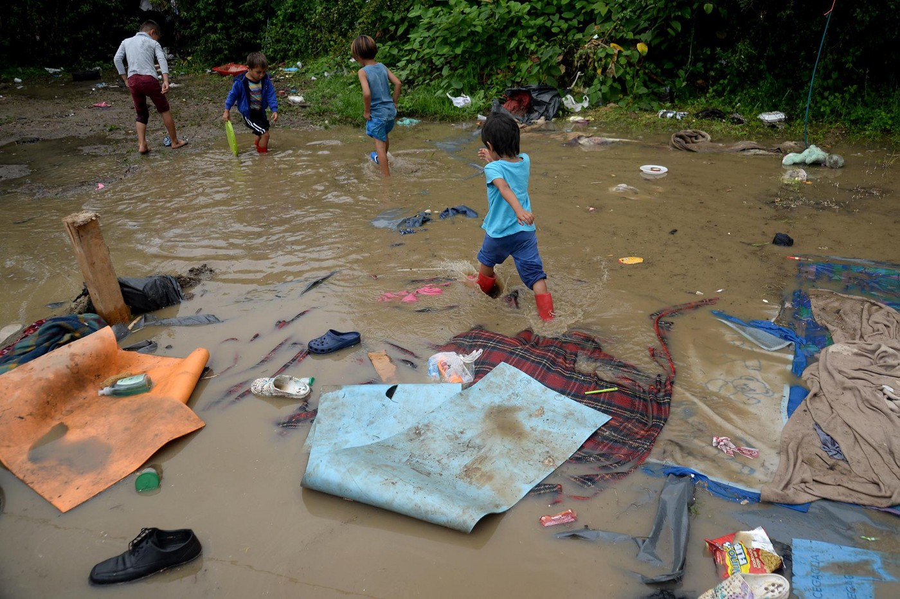

### AYS Daily Digest 13/7/2018: European failure in numbers

_Failed relocation program condemned by the court in Spain // 1,422 people lost their lives while trying to cross the sea // 59,700 in Greece, including 15,200 on the islands // 32 Syrians landed in Lampedusa // Call to demonstrations in Ventimiglia and Paris // Children from Syria sleep, live and play in the mud in Bosnia_

London, July 13th\. Photo by Calais Action
### Feature

The Spanish Supreme Court [condemned](http://www.poderjudicial.es/cgpj/es/Poder-Judicial/Tribunal-Supremo/Noticias-Judiciales/El-Tribunal-Supremo-condena-al-Estado-por-incumplir-su-obligacion-de-tramitar-las-solicitudes-de-asilo-de-19-449-refugiados) the Spanish Government for “partially failing to meet its obligation” to relocate a total of 19,449 asylum seekers from Greece and Italy between 2015 and 2017\.

Spain met only 13 per cent of the goal\.

But the other EU countries have not done much better\. **Only 12,692 people from Italy and 21,999 from Greece, were relocated** , even though the goal set by the Relocation Decisions was 160,000 people initially\. It was later revised to fall under 100,000\.

So far the European Commission have decided to take measures only against Hungary, Poland and the Czech Republic\. The Spanish court referred to this fact in its decision, too\.

The relocation scheme was launched by the EU in 2015, and it ended in September 2017\.
### Sea

This year so far, **48,629 people arrived in Europe by sea** \. Forced to take this perilous journey due to closed borders, **1,422 people have lost their lives** \.

Only **in the last four weeks, more than 600 people died** while attempting to cross the Central Mediterranean\.
### Turkey

The rescue team **saved 34 people who were on a boat** on its way towards Chios, Greece\. The boat ended up at Bogaz Adasi, a small island outside Cesme\. One person is still missing\.

### Greece

[Samos Volunteers](https://www.facebook.com/samosvolunteers/posts/1020977994747027) recorded **822 arrivals in June** , which is more than double the number of people that arrived in May\. On Friday, [one boat landed](https://www.facebook.com/285298881993223/posts/394284167761360/) on Tsipouri Beach, Eftalou, Lesvos, with 43 people, including 31 children\.

At the moment there are **2,570 people living in the camp Vathy where the capacity is approximately 700 people** \.

The situation is similar, or even worse, on other islands\.

In Greece, **2,400 people arrived by sea and 1,100 by land this month** \. This increase left many people without accommodation, and again, as in 2016, people are sleeping in the streets of Thessaloniki, Athens and on the islands\. This situation leaves all the people, but especially women, children and unaccompanied minors, in a very precarious situation\.

According to the latest official figures, **59,700 people are now in Greece,** including 15,200 on the islands and 44,500 in the mainland\.

Out of this number, 49,649 are receiving cash assistance, which is symbolic — from 90 euros per month for single people to a maximum of 550 for families of seven or more\. Out of this number, 40 per cent are children, 23 women and 37 per cent men\. Most of them are from Syria, Iraq, Afghanistan and Iran\.

Who is eligible for this type of help is decided on the basis of one’s date of entry in the country, legal status and current location\.

Additionally, under the EU — Turkey deal, **20 people were returned in June from Greece to Turkey** \.

Since 20 March 2016, 1,650 people have been returned to Turkey\.

> The Mobile Info Team reminds everybody that if the police find people without a document that allows them to stay in Greece, they will most likely be arrested and put in detention\. For more info, please [see their post](http://www.mobileinfoteam.org/police-note) \. 

### Italy

On Friday, **32 Syrians landed in Lampedusa** \. Between them were one eight months pregnant woman and 17 children, of which 10 wore a red shirt — used to make them immediately visible in case of shipwreck\.

The small boat was spotted by patrol boats from the Italian Coast Guard and the Guardia di Finanza, about ten miles from Lampedusa\.

For the first six months this year, [**Italy granted**](https://www.csm.it/documents/21768/121438/REPORT+MINISTERO+INTERNO+FINO+AL+29.06.2018/45ddce54-b745-4c71-70e4-cf047dffbada?version=1.1&utm_source=ECRE+Newsletters&utm_campaign=806567270c-EMAIL_CAMPAIGN_2018_07_13_12_04&utm_medium=email&utm_term=0_3ec9497afd-806567270c-422320969) **humanitarian protection to 13,511 asylum seekers** , which is only 30\.6 per cent of decisions\.

Refugee status was granted to 3,244 persons and subsidiary protection to 1,968 people\. Most of the people who applied for asylum are from Nigeria, Bangladesh, Pakistan, and Senegal\. The highest number of people who requested status are from 18 to 34 years old\.

Groups of [activists and volunteers are organizing](http://www.meltingpot.org/No-Borders-Iniziativa-al...) a demo for Saturday in Ventigmillia to call for the European residence permit and the right to human mobility\.

The number of activists are already in Ventimiglia, where the high presence of police is visible\.

> “Despite this, the procession has advanced compactly up to a few meters from the blockade put in place by law enforcement\. Tents, life jackets and a gigantic “no border” inscription made just a few steps from one of the most militarized borders in Europe are a signal not only for the Italian government and the French government, but for the entire European Union, an accomplice of the carnage that is taking place in the Mediterranean Sea and the inhumane treatment received by migrants in the Libyan concentration camps\.” 

### Bosnia

 \.](assets/97f6194f80cf/1*8CChM_G4_TkqhXeZC_QqNw.jpeg)

A Syrian refugee boy playing this morning after heavy rains\. This used to be his family’s store… \(Velika Kladuša, Bosnia\) \. Photo by [Gabriel Tizon](https://www.facebook.com/.../a.21376.../1805582269487587/...) \.

Volunteers in Velika Kladuša are doing their best to meet all the needs for the growing number of people on the move who are arriving to this town every day, with the hope to continue their journeys toward western Europe\.

Recently, months after people started arriving in this city, MSF established its mobile clinic there and now people are provided with basic medical assistance\.

In the last few weeks in Bosnia the weather has been very bad and almost every day it rains\. Volunteers from [No Name Kitchen](https://www.facebook.com/pages/No-Name/303744056447569) , who are providing, among other things, showers, noted that on Friday the rain that fell in the morning shattered several of the shelters\. Nobody but volunteers came to help\.

Photo by Gabril Tizon

In the northern part of Bosnia, close to the EU border there are over 4,000 people\. Local government called for help asking the state authorities to finally establish a “temporary reception centre,” but also to limit the number of people\. So far, there are plans for the camp, but little has been done\.
### France

[L’Auberge des Migrants](https://www.facebook.com/.../a.1015.../10156179227450339/...) needs help to provide tents for people\.

> You have small tents that can contain 2 TO 3 people you don’t use anymore? Free space and offer shelter to our beneficiaries — more info [here](http://bit.ly/don-pour-calais) \. 

On Saturday, people will gather in Paris to protests against detention centres\.

A walk will leave at 2pm from the ministry of the interior, 18 rue des Pyrénées — metro port de Vincennes towards the Vincennes Detention Centre\.

To find more info, and join the march, visit the organizer [FB page](https://www.facebook.com/ptitdejaflandre/posts/2237940272899269) \.
### Germany

Great turn out at protests in Hamburg in Friday\. At least 4500 people joined to demand safe passage\.

](assets/97f6194f80cf/1*0tzN7EuTDXh4MFJBeSFqbA.jpeg)

Photo by [Watch The Med — Alarmphone](https://www.facebook.com/watchthemed.alarmphone/?hc_ref=ARQVYCHKtUTIY8KcaYM5lh0KNOuGDlWV-NtP9Kde9wCzK_IiWB1aaJ564Q5JPS8-D7s&fref=nf)

**We strive to echo correct news from the ground through collaboration and fairness\.**

**Every effort has been made to credit organizations and individuals with regard to the supply of information, video, and photo material \(in cases where the source wanted to be accredited\) \. Please notify us regarding corrections\.**

**If there’s anything you want to share or comment, contact us through Facebook or write to: areyousyrious@gmail\.com**

_Converted [Medium Post](https://medium.com/are-you-syrious/daily-digest-13-7-2018-european-failure-in-numbers-97f6194f80cf) by [ZMediumToMarkdown](https://github.com/ZhgChgLi/ZMediumToMarkdown)._
