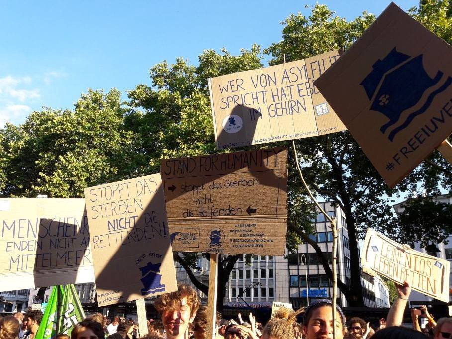

### AYS Daily Digest 14/7/18: The silent majority rises while Europe plans another anti\-people project

_Out of sight, out of mind\- Austria’s proposal for sending people back, in ‘Return Centres’, with new dubious collaborations / Protests in support of the sea rescue across Germany / Protests against the fascist policies in Italy / Greece\-Important reminder for those without documents / FR constitutional court hopes its decision reverberates across the EU during rising xenophobia, hostile anti\-immigration policies and closed borders / more news_

](assets/2e8613ffb39e/1*pi6blou-Uvb8ZGeEu77CXg.jpeg)

Protests in support of the sea rescue happening across Germany, Cologne protest photo by: Jugend Rettet e\.V\. Nordrhein\-Westfalen / Protest in Ventimiglia, Italy; photo by: [Progetto20k](https://www.facebook.com/progetto20k/?hc_location=group_dialog)
#### FEATURE — EU finding new ways to send people back to lands of danger and no perspective

The Austrian Council Presidency is prioritizing quick deportation of asylum seekers whose claims have been rejected\. Because “it is important to ensure the return of irregular migrants _”_ and in order to “reinforce the current system”, in [Presidency discussion paper on Return Centers](http://statewatch.org/news/2018/jul/eu-council-migration-return-centers-ST-10829-18.pdf) — the document they sent to the EU member states, they propose the establishment of _Return Centers_ in third countries\.

> Return Centers should be established within, as well as operated by, a third country, meet European standards and be compliant with applicable international and European human rights law\. 
 

> The principle of Non\-Refoulement has to be safeguarded in all cases\. 

Loosely described potentially problematic and dangerous collaboration that would evolve between the countries people had fled from \(and would be returned to\) and the EU is so far described this way:

> The local authorities of a chosen third country operating a Return Center would be supported through the exchange of know\-how and technical equipment; in addition further cooperation on migration management should be offered, e\.g\. deployment of border guards\. 

So far not much more is available about this proposal or the member states feedback to it\. 
However, we have reported about the behavior and actions of quite a number of the European border guards and have also witnessed results of the EU’s previous collaboration and “the exchange of know\-how” with Libya, and semantics here offer no abolition\.
#### GREECE

52 people have reportedly arrived by boats to Lesvos in the Saturday morning, [Aegean Boat Report](https://www.facebook.com/AegeanBoatReport/?hc_ref=ARSd35Cf53aV2Et8UW2nxCDxNn_r_G5ZBMhogMzDGHULDfm3_Xmak7NcqaR2xv8jMa4&fref=nf&hc_location=group) team reports\.

[**InterVolve**](https://www.facebook.com/InterVolve/?fref=mentions) is one of the small grass roots organizations working in Greece\. They are currently specifically looking out for supporters who can help donate funds to buy baby formula for the 10\+ **families at [Koutsochero](https://intervolvegr.com/our-projects/koutsechero/)** who have infants under 5 months old\. Each family requires on average 3 units of formula per week and at €9 per unit the price is hindering their ability to consistently provide for these families\. If you can and would like to support this effort, please find more info on their site\.

We would once again like to remind everyone of the **important notice** by the Mobile Info Team:

> _If the police find people without a document that allows them to stay in Greece, they will most likely be arrested and put in detention\. For more info, please [see their post](http://www.mobileinfoteam.org/police-note) \._ 

#### SERBIA

The [Rigardu team is leaving](https://rigardu.de/2018/07/14/wir-uebergeben-unser-projekt-in-serbien/) Serbian territory as their voluntary workplace\.

> For now, we are leaving Subotica and Serbia to gather our strength and to tackle a new project when summer is over\. The shower project was handed over to Escuela Con Alma and the van is now back in Germany undergoing maintenance and repair\. 
 

> Martin writes about the project and our time in Serbia on the blog and how it’s going to continue since this is just a break\. Soon enough we’ll be back with lots of motivation and new ideas to be realized\. 

#### LIBYA
### Criminal coastguard intercepts 104 people, and forcibly return them to hellish conditions

Of the 104 people, 74 men and 13 women were from Eritrea, and the operation took place north of the Khoms city\. As usual, the people were later transferred to the so called Illegal Immigration Centre at Tareeq Sikka\.
#### SEA

](assets/2e8613ffb39e/1*xy5ceLidHjdrNre6nNCJng.jpeg)

Infographics by [Watch The Med — Alarmphone](https://www.facebook.com/watchthemed.alarmphone/?hc_location=group_dialog)

[Watch The Med — Alarmphone](https://www.facebook.com/watchthemed.alarmphone/?hc_location=group_dialog) reports that in the night between Malta and Italy there was a discussion about who is responsible for a refugee boat with 450 people in immediate danger and distress:

> None of the supposedly ‘responsible authorities’ took action for hours\. 
 

> Finally, in the morning, the Guardia di Finanza and FRONTEX rescued the people between Lampedusa and Linosa\.
 

> By that time 9 people had to be medically evacuated\. The last was a 20 year old woman weighing only 40kg\. 
 

> Italy now wants to push the people back to Libya, which would be a breach of international law\. It says that it would only let the survivors enter a Port of Safety in Italy if other states accept to then take the people\. 
 

> We demand that the people are immediately allowed to enter Italy as it is the closest Port of Safety\. 
 

> We demand **active search and rescue capabilities** to resume rescuing people in distress rather than shifting responsibility to others\. 

> We demand that discussions about **EU migration policy** is not bargained on the back of those vulnerable at sea\. 

> We demand that **civil rescue assets are immediately released** in order to conduct SAR activities\. 

■■■■■■■■■■■■■■ 
> **[Alarm Phone](https://twitter.com/alarm_phone) @ Twitter Says:** 

> > Italy now wants to push the people back to #Libya, which would be a breach of international law. It says that it would only let the survivors enter a Port of Safety in Italy if other states accept to then take the people. 

> **Tweeted at [2018-07-14 17:48:59](https://twitter.com/alarm_phone/status/1018190637873684481).** 

■■■■■■■■■■■■■■ 

■■■■■■■■■■■■■■ 
> **[SALVAMENTO MARÍTIMO](https://twitter.com/salvamentogob) @ Twitter Says:** 

> > Hoy Sábado nuestros centros y unidades han rescatado 240 #personas de 12 pateras, a las que hay que sumar + de 100 vidas salvadas más de varias pateras rescatadas por patrulleras @[guardiacivil](https://twitter.com/guardiacivil) https://t.co/Tlpn4VjNM1 

> **Tweeted at [2018-07-14 19:37:48](https://twitter.com/salvamentogob/status/1018218022425841664).** 

■■■■■■■■■■■■■■ 

#### ITALY
### No free labor — no refuge

22 asylum seekers in the province of Brescia were expelled from the hostel Trentapassi, used as a reception center \(with no hot water, internet, or other basic services\), where they lived\. This punitive measure was taken at the request of the mayor of Zone after the group of had refused to work for free to clean the path of the pyramids, a tourist attraction near the country, it is [reported](https://hurriya.noblogs.org/post/2018/07/14/brescia-migranti-cacciati-lavoro-gratuito/) \. 
With the argument that they “also have duties, including that of repaying for the hospitality received,” the officials are once again sharpening the distinction between good migrants and bad, between deserving to be welcomed and those who are destined for expulsion\.
As for the expelled people, up to now, we have not received any further information where they would be placed\.
### Protesting the hypocrisy of the mainstream public discourse

Between 5 and 10 thousand people from Italy, Spain, France and different African countries gathered in Ventimiglia, symbolic location in between the two countries that are in a strong defensive dialogue on the responsibilities regarding the reception and welcome of the refugees\. Fighting the dysfunctional public information system, misguided mainstream media and the symptomatic policies of the current government, rather prone to fascist discourse, a number of activists, volunteers, citizens and people willing to step up for others [gathered to once again speak up against the politics](https://www.dinamopress.it/news/ventimiglia-citta-aperta-10mila-corteo-frontiere/) that go in direction against freedom of human beings in general\.

> Siamo tutt\* a casa nostra\! 

#### FRANCE
### French constitutional court ruled that activist Cédric Herrou should not have been put on trial and prosecuted last year

](assets/2e8613ffb39e/1*gBYUqwB3_2RUaj8UyLcyrA.jpeg)

Photo: [Landworkers’ Alliance](https://www.facebook.com/LandWorkersAlliance/?hc_location=group_dialog)

Herrou believed ‘he had a duty to provide food and shelter to desperate migrants fleeing war, poverty and oppression\.’

> The court said France’s parliament should adapt the law that people who act in solidarity and ‘fraternity’ the way the french farmer Cédric Herrou did should be granted immunity if offering such help to a non\-French national without receiving anything, such as money, in return\. 

> The court said the words “unlawful stay” should be removed to ensure that the principle of fraternity extends to those in France both legally and illegally\. 

It also suggested, and we hope, that its ruling could reverberate across the Europe and the European Union at a time of deep divisions of it’s member states with rising xenophobia, hostile anti\-immigration policies and closed borders\.

](assets/2e8613ffb39e/1*eL2twJpN7GiqvCPpeyCqew.jpeg)

Photo: [Landworkers’ Alliance](https://www.facebook.com/LandWorkersAlliance/?hc_location=group_dialog)
#### GERMANY
### Thousands took the streets across Germany to protest against drownings, border closures & criminalization of life savers

While Germany [continues with deportations to Afghanistan](http://www.sueddeutsche.de/bayern/fluechtlinge-aus-der-psychiatrie-direkt-nach-afghanistan-abgeschoben-1.4054059) — which is selectively considered a ‘safe country’ only for those whose lives were actually threaten there, while the others are warned not to go there due to insecurities and dangerous circumstances — Germans are taking action against the growingly strong policies in Europe that are further endangering people’s lives upon their perilous journey to the Old continent\.

■■■■■■■■■■■■■■ 
> **[infozentrale](https://twitter.com/infozentrale) @ Twitter Says:** 

> > 19.58 So grüsst nun #Köln von der Kundgebung #Seebrücke die Crew der #Seawatch @[seawatchcrew](https://twitter.com/seawatchcrew) #Seebrückecgn #koeln1307 https://t.co/Gh0bLmK6m2 

> **Tweeted at [2018-07-13 18:01:08](https://twitter.com/infozentrale/status/1017831305822785536).** 

■■■■■■■■■■■■■■ 

Enough is Enough [reports](https://enoughisenough14.org/2018/07/14/reportback-seebruecke-thousands-took-the-streets-across-germany-to-protest-against-drownings-border-closures-criminalization-of-life-savers/) the demonstration in Cologne was one of many demonstrations across Germany\. In Hamburg 4500 people took the streets, in Essen around 1500\. In total about 14\.000 people took the streets last night, with [many demonstrations in other cities already announced for the coming days](https://seebruecke.org/wp/#aktionen) \. Next actions in support of the sea rescue have also been announced by the Seebrücke: [https://seebruecke\.org/wp/](https://seebruecke.org/wp/)

](assets/2e8613ffb39e/1*Msqie7Rf_C36YbC0SlYE3w.jpeg)

Photo: [Jugend Rettet e\.V\. Nordrhein\-Westfalen](https://www.facebook.com/JugendRettetNRW/)

**We strive to echo correct news from the ground through collaboration and fairness\.**

**Every effort has been made to credit organizations and individuals with regard to the supply of information, video, and photo material \(in cases where the source wanted to be accredited\) \. Please notify us regarding corrections\.**

**If there’s anything you want to share or comment, contact us through Facebook or write to: areyousyrious@gmail\.com**

_Converted [Medium Post](https://medium.com/are-you-syrious/ays-daily-digest-14-7-18-the-silent-majority-rises-while-europe-plans-another-anti-people-project-2e8613ffb39e) by [ZMediumToMarkdown](https://github.com/ZhgChgLi/ZMediumToMarkdown)._
