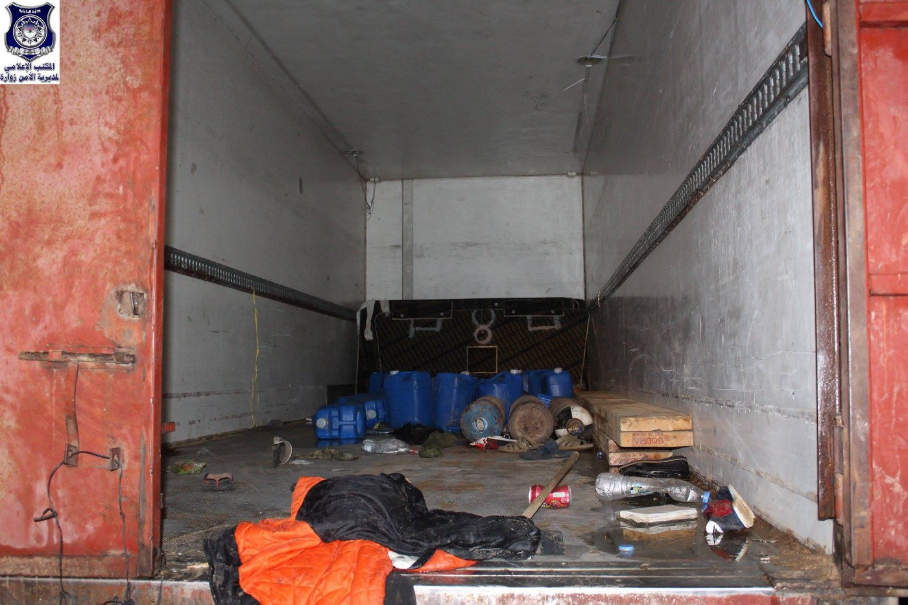
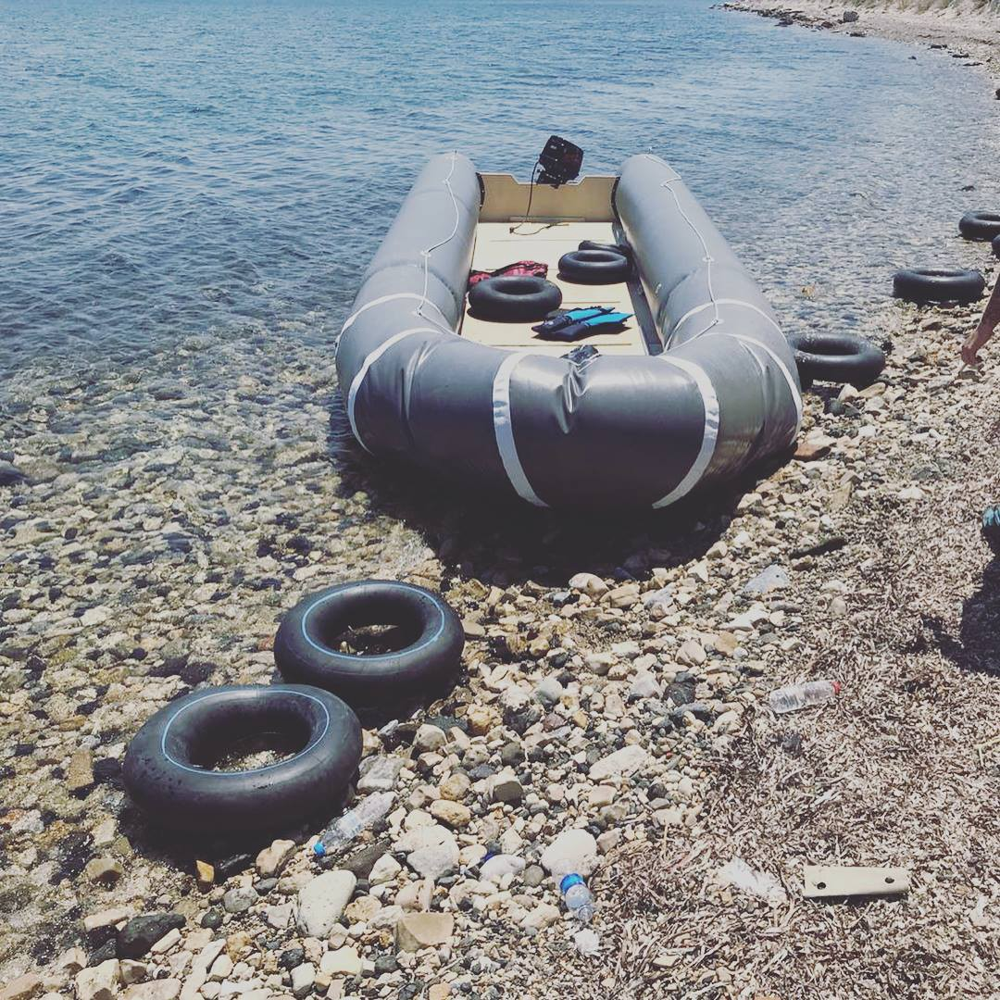
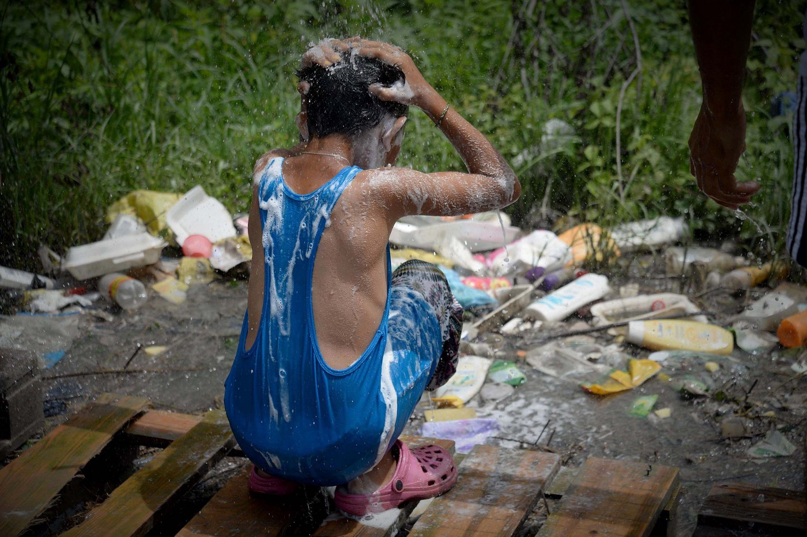
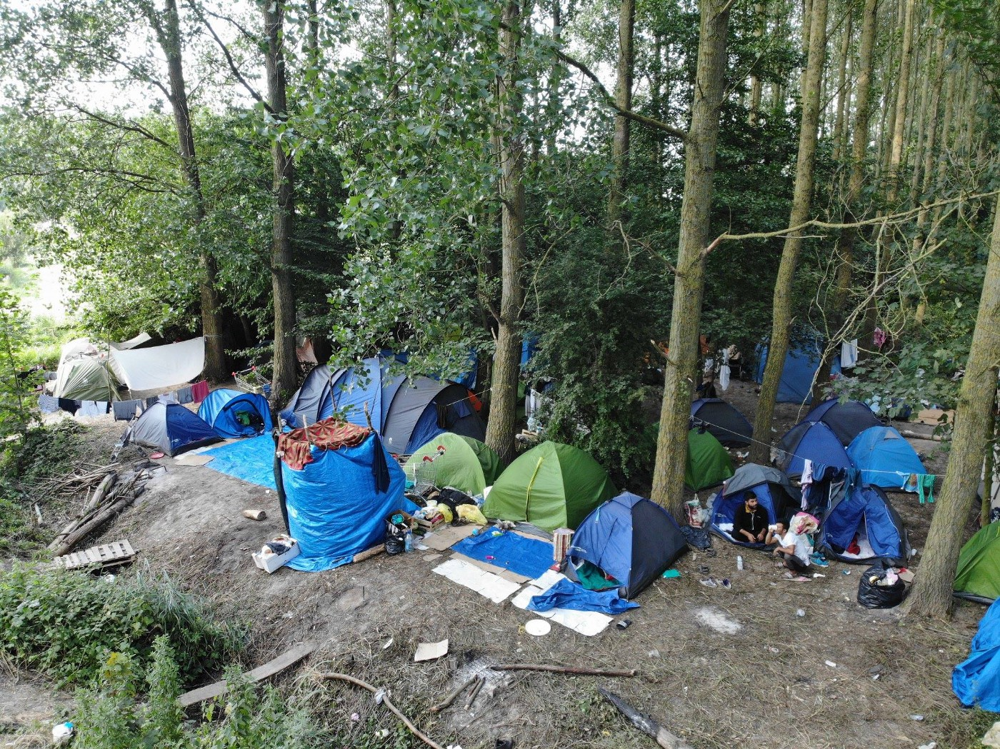

### AYS DAILY DIGEST 16/7/2018: Six children suffocated while dreaming to reach Europe

_More than 100 people found in a truck in Libya // Finally, some good news from Greece about Pikpa // More pushbacks at the border between Greece and Turkey // Alarming situation in Bosnia and help needed // Push backs from Slovenia // Protests against deportation to Afghanistan in Sweden_

Picture by the local security forces Pictures of the local security forces in this area are showing the interior of the cooling truck, which also had life jackets and several tanks with fuel, which were apparently intended for use in a boat trip\.
### Feature

Six children and two adults, one woman and one young man, suffocated in a refrigerated truck in Zuwara on the west Lybian cost\. They suffocated from petrol fumes while packed in a truck together with a group of about 100 people\. All of them were found in a critical condition and had been taken to a local hospitals for treatment\.

The truck that people were squeezed in was used for transporting frozen food\.

The city of Zuwara is one of the points where people leave for Europe, via smuggler and traffickers route\.

This tragedy happened at the same time while some EU member states are finding different ways to cooperate with Libya and to send people back or to create centres where people will be sent back after deportations, or prevented from going to Europe\.

According to a report by [Human Rights Watch](https://www.facebook.com/HumanRightsWatch/) from 2018, ships full of migrants and asylum seekers trying to cross the sea were returned to Libya by the Libyan coast guard who has been trained by the EU and Italy\. After people return, many were beaten and sexually abused and were extradited, extortion, hard prison conditions and forced labour\.

This would not be necessary if there were safe and legal access routes to Europe for people on the move\.
### Morocco

On Sunday, the Moroccan authorities conducted a vast operation of the arrest of unaccompanied minors, and more than 120 were arrested, according to the [Association Marocaine des Droits Humains — Section Nador](https://www.facebook.com/AmdhNador/posts/2130488100496787) \. They were trying to reach Spain\. Apparently, this operation was conducted in accordance with the requirements from the Spanish government\.
### Greece

Good news from Greece — [Lesvos Solidarity — Pikpa](https://www.facebook.com/pikpalesvos/?hc_ref=ARQLzg53CzYPHjOty3UYbkH9OO1in30xBmhqkkeMC_LGch2viJKcy79mHzTgjGTU1v0&fref=nf) \.

The judge delivered a decision in favour of Pikpa in the court case initiated by some hotel owners from the neighbourhood and some individuals\. This is an important step to save Pikpa\!

The fight against the Region’s decision to close Pikpa continues: the appeal was filed last week\. The Region must reconsider their decision\.

On Monday, 42 people arrived at Chios by boat, among them 12 minors\.

Photo by Refugee 4 Refugee from Lesvos

Additionally, one boat with 34 people on board arrived at Lesvos, Kratigou\.

More reports about pushbacks from Turkey\. [Alarm Phone witnessed](https://www.facebook.com/.../a.15261.../2159320621008836/...) two more push\-backs in the Evros region\.

Unfortunately, we witnessed two other push\-backs in the days following these events\.

_“The first group of 12 people from Syria and Iraq, who had an elderly woman and two children among them, reported to us that they had been apprehended on Greek soil and forced to return to Turkey\. It occurred on the 5th\-6th of July\._

_The second group of 19 people from Syria and Iraq, including a one\-year\-old child, a pregnant woman and a man with a broken leg informed us about being pushed\-back on the 9th of July\._

_According to one testimony, the men of the group were beaten by Greek authorities\. Their belongings such as phones, money, passports and the food for the infant were taken away\. They were then forced back across the Evros river to the Turkish side and threatened not to come back to Greece again\.”_

We join Alarm Phone in demand for the respect of the people’s human rights and of international law clearly forbidding such push\-back operations\.

**Protect people, not borders\!**
### Italy

Alterego — Fabbrica dei diritti issued a video showing the life of about 120 people who are sleeping in Via Scorticabove, Rome\. Most of them were evicted from other places about 10 days ago, and are mostly coming from Sudan\. As they report, the situation is dramatic with not enough food or clean water\.

### Bosnia

Police found [two persons hiding](https://www.klix.ba/.../u-carinskoj-ispostavi-u.../180716076) in a truck in the customs area in Sarajevo\. Both were arrested\. Video surveillance camera shows two persons jumping over the fence in this area, looking for trucks and entering one of them, according to the police\.

Mayor if Bihać, city closed to the Croatian border, announced eviction of the squat in the city where over 150 people found refugee due to the lack of the accommodation provided by the state\. One Bridge to Idomeni informed us that the eviction was conducted in the morning on Tuesday, and all the people were taken to the official camp run by the Red Cross Bihać\.

The official camp is in one abandoned building with no roof, windows, electricity or any kind of conditions for normal life\.

The mayor claims that the situation in Bihać is getting more difficult with the increase of people who are arriving daily\.

At the same time, one of the three members of the Bosnian Presidency [spoke for the media](https://www.klix.ba/vijesti/bih/ivanic-bih-ce-se-suprotstaviti-svakom-pokusaju-smjestaja-migranata/180717018) saying that the government will resist any attempt by anybody to create the migrant hub in the country\. “It would create political instability,” he said\.

He also said that according to the law in this country, the army cannot be engaged in anything that is related to migrants\.

In the meantime, volunteers in the field continue to help in the best possible way, which is not easy\.

By Gabriel Tizon\. An 11\-Year\-old refugee girl will be in this morning at the only possible place of temporary settlement at the border of Velika Kladuša\.

SOS Team Kladuša and No Name Kitchen team are working in Velika Kladuša where several hundreds of people are staying in an open field, in tents built by volunteers\. Video by Ania Do

### Serbia

The European Union has donated to Serbian border police new equipment and the necessary technical support to help it fight illegal immigration, Italian news agency Ansa reports\. The equipment includes, among others, powerful binoculars, special cameras, helmets and shields\.

The EU representative in Serbia said that this assistance is the part of the European Union’s “efforts to help Serbia and make the fight against illegal immigration more effective\. We have satisfied with the results we have reached\.’’

Recently, he added, 50 additional police officers from several EU countries were deployed at the border with Bulgaria to tighten security\.

Official data are showing that the number of people who have crossed into the country from Bulgaria has doubled since mid\-May\.
### Slovenia

Slovenian organizations Amnesty International Slovenia and Legal Information Center for NGOs \(PIC\) recently visited Bosnia and Herzegovina, after Slovenian newspaper Dnevnik reported that refugees entering Slovenia are being involuntarily returned back to Bosnia and Herzegovina, making it impossible to ask for asylum\.

Organisations which have conducted numerous interviews in Velika Kladuša and Bihać confirm these claims\. The majority of the interviewees describe how after reaching Slovenia they could not ask for asylum and have been forcefully returned to Croatia and then further to Bosnia and Herzegovina\. Such pushbacks are illegal under international law\. UNHCR in Budapest which is responsible for Slovenia says to be aware of these claims and is, therefore, looking into the matter\.

Slovenian ministry and police deny the allegations although in June the number of asylum claims dropped for one third\.
### France

Update from Dunkirk by the [Mobile Refugee Support](https://www.facebook.com/MobileRefugeeSupport/posts/793803654158581)

The situation in the Dunkirk area has finally stabilized once again\. Following persistent pressure from various organizations, in\-particular L’Auberge des Migrants, French authorities have backed off and allowed humanitarian aid workers to operate once again\.

There are currently over 200 tents in the woodland, housing the growing population of over 400\.

Volunteers in the area need help to continue working\. They need help with charging cables or torches to sleeping bags and backpacks\.

](assets/557b70b2e4f8/1*pQZrBDsk-0hJv9lY9UhZMQ.jpeg)

Photos by the [Mobile Refugee Support](https://www.facebook.com/MobileRefugeeSupport/posts/793803654158581)

If you are able to donate, please do\. [Find out how or see specific needs list](http://www.mobilerefugeesupport.org) \.
### Sweden

Protest against deportations in Åstorp are [announced for Tuesday\.](https://www.facebook.com/events/462111624202696/?ti=icl)

Regardless of the increasingly destabilizing situation in Afghanistan the deportations from Sweden continues, people will continue to protest against this and the organization Föreningen Sverige för flyktingamnesti has a list of demands they wish to be met\.

If you need a ride to Åstorp from Malmö in order to participate in the protest, [get in touch](https://www.facebook.com/events/462111624202696?name=Stoppa+tv%C3%A5ngsutvisningen+17+juli&event_id=462111624202696&view=permalink&id=462734307473761&acontext=%7B%22ref%22%3A%2229%22%2C%22ref_notif_type%22%3A%22admin_plan_mall_activity%22%2C%22action_history%22%3A%22null%22%7D&notif_id=1531738784979970&notif_t=admin_plan_mall_activity&ref=notif) with organizers\.

**We strive to echo correct news from the ground through collaboration and fairness\.**

**Every effort has been made to credit organizations and individuals with regard to the supply of information, video, and photo material \(in cases where the source wanted to be accredited\) \. Please notify us regarding corrections\.**

**If there’s anything you want to share or comment, contact us through Facebook or write to: areyousyrious@gmail\.com**

_Converted [Medium Post](https://medium.com/are-you-syrious/ays-daily-digest-16-7-2018-six-children-suffocated-while-dreaming-to-reach-europe-557b70b2e4f8) by [ZMediumToMarkdown](https://github.com/ZhgChgLi/ZMediumToMarkdown)._
