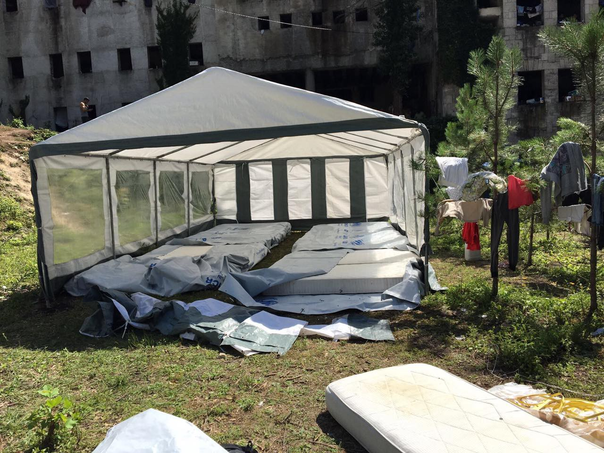
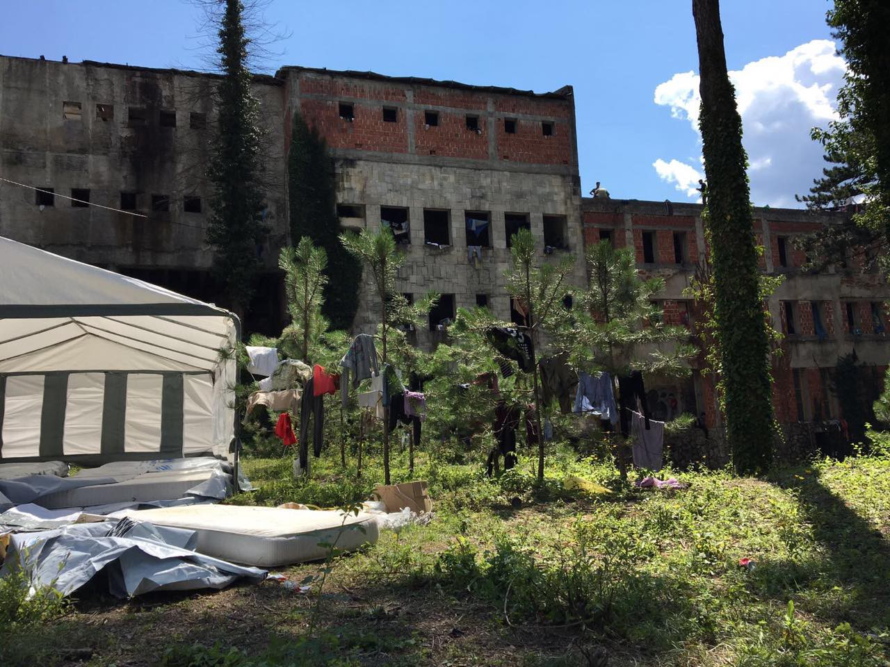
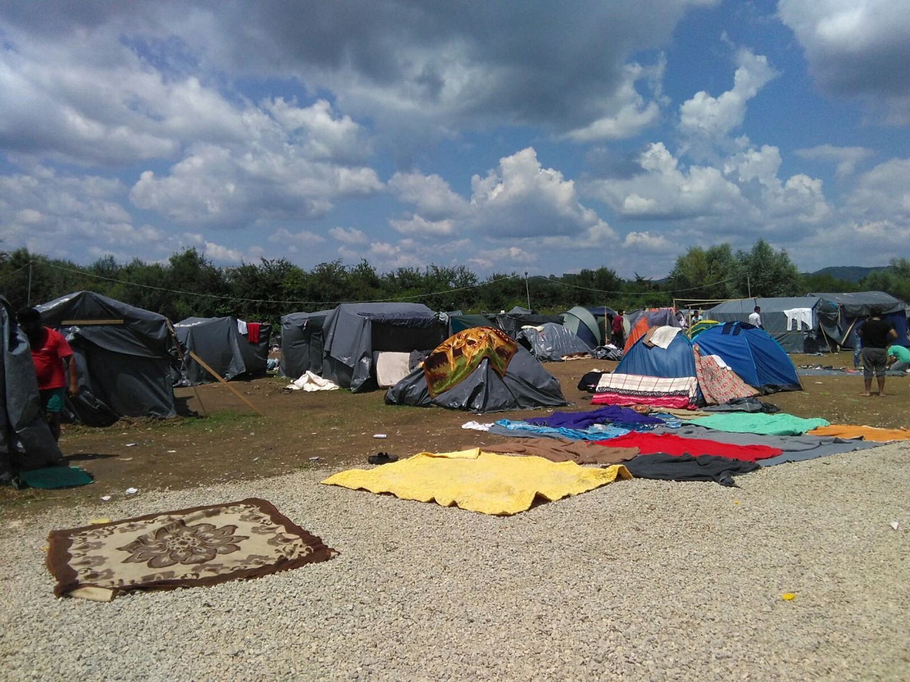
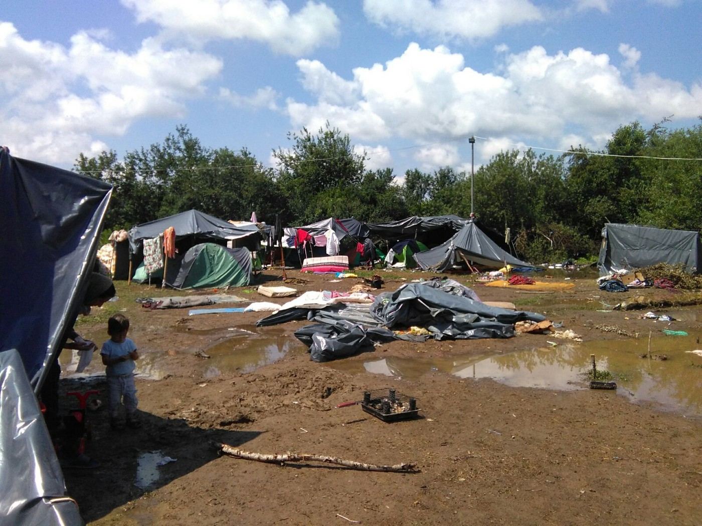
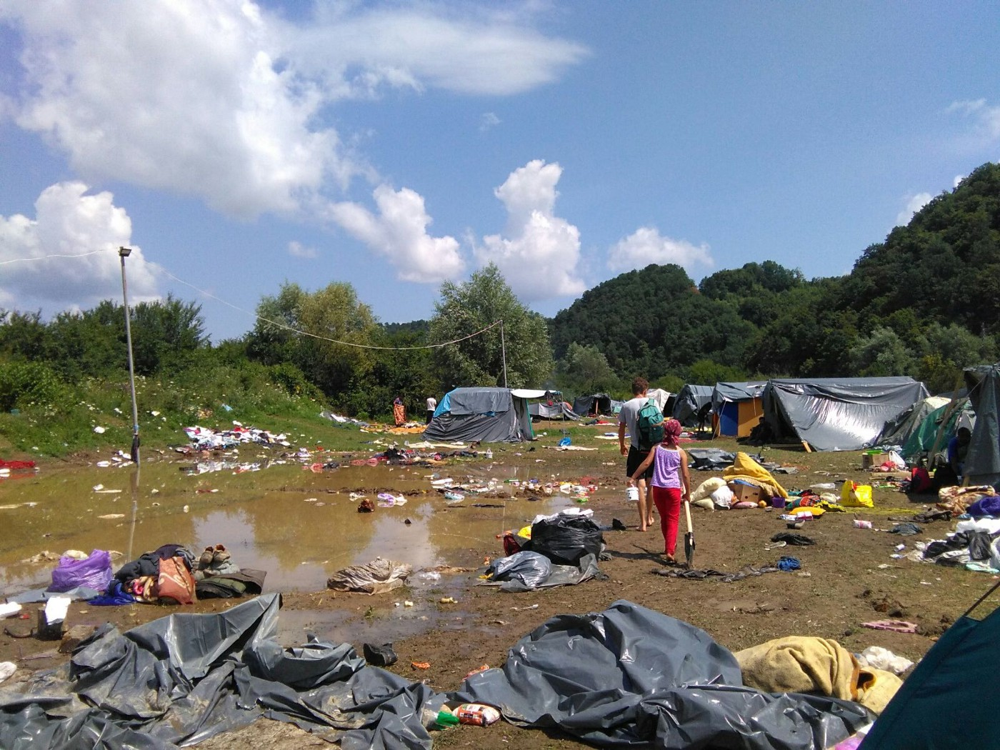
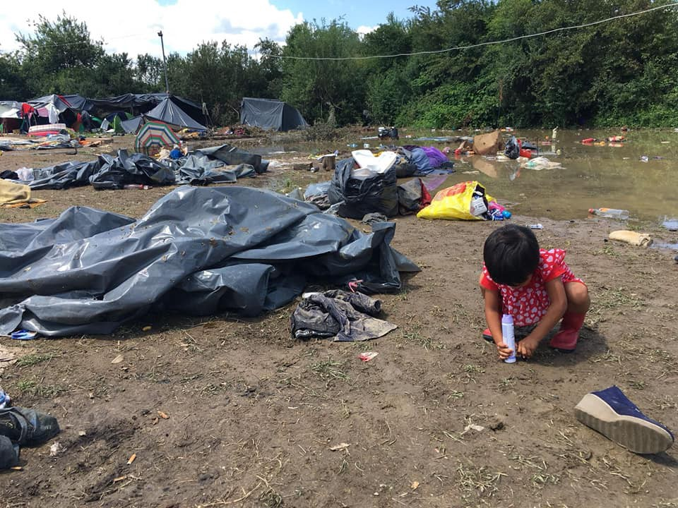

### AYS DAILY DIGEST 17/7/2018: The situation in Bosnia — from bad to worse

_Thousands of people left in inhumane living conditions in Bosnia and Herzegovina // Over 200 illegal push\-backs from Bosnia to Serbia in one week // “Almost emergency” situation in Greece with close to 65\.000 asylum seekers registered at the moment // Appeals from Austria and Bosnia_

](assets/ac9ec889a649/1*kZ0P55Sk5_Am5Lppz63ahQ.jpeg)

After the storm\. Velika Kladuša\. Photo by [Gabriel Tizon](https://www.facebook.com/gabrieltizonfotografo/?hc_ref=ARTrlGlOKvb_JwxQe_UfzN56mex3C3AkUMOk_Lq1zDa7uyHdHctbE4gyfVxeiKd5Yoc&fref=nf)
### Feature

One more time we focus on the situation in Bosnia and Herzegovina where thousands of people are stranded at the moment, receiving limited help from the local authorities, as well as from the big INGOs\.

Out of over 8\.000 people on the move who are currently in Bosnia, less than 500 lives in a state\-provided accommodation that can be described as decent\. Those who are lucky, are living in hostels and hotels, sometimes paid by the local NGOs or Bosnian citizens, and sometimes by people on the move themselves\. Others are forced to stay out in the open, to live in the train station — like in Sarajevo — in parks, abandoned buildings, under the bridges…

In Bihać, since yesterday around 800 people are crowded in a building that is not safe, has no windows, roof, doors or anything\. Many are sleeping in the surrounding forest area\.

Photo by One Bridge to Idomeni

On Monday, state authorities, with no prior agreement with any of the existing organizations, evicted squat where about 200 people lived\. No alternative accommodation is provided for them, but many of them also moved to the Đački dom and forest around\. The UNHCR provided plastic tents, and the Red Cross put mattresses on the ground where people are supposed to sleep now creating the place for about 40 people altogether\.

Photos by One Bridge to Idomeni

The local media are reporting that there is a possibility that families, about 40, will be moved on Tuesday to one old hotel in the city of Bihać that will be knocked down in the next four to six months\.

The others will be simply left out in the open\.

The situation is even more precarious in Velika Kladuša, the second city close to the border with Croatia, where about 1000 people are staying, and about 400 of them are living in a field area\.

Photos by No Name Kitchen in Velika Kladuša\.

The tents they use are made by volunteers, while help is mostly coming from the locals and volunteers in the area\. Over the last couple of days, the weather in this area of Bosnia is very bad, with constant rain\. On Monday, a storm left the catastrophic situation in this camp\.

Photo by SOS Team Kladuša

Almost everything was ruined, including clothes and blankets people had in tents\. Most of the tents disappeared in the storm, and they needed to be fixed\.

This is is the wetland and there are hardly basic living conditions even where there is no rain\.

After the storm, the group of activists and local NGOs from all over Bosnia issued [an appeal](https://www.facebook.com/notes/souls-of-sarajevo/povodom-katastrofalne-situacije-po-živote-izbjeglica-i-migranata-u-bihaću-i-veli/1313814575388418/) toward the government and big INGOs, demanding the immediate solution to the current situation:

> **“We no longer want to listen to endless delays, transferring responsibility, or finding excuses \(there is both money and capacity\) \. All of you are responsible\! Human lives are at stake\! If you cannot provide adequate support, then at least step down from the functions that you are unable to perform\. We cannot allow people to sleep and reside in mud, dirt, and totally inadequate hygienic conditions\. In front of us is winter that can be terribly raw in these areas\. All of you jointly are responsible for people’s lives\!** 

> **We demand an immediate response, without delay and politicizing\!** 

> **We demand the inclusion of all levels of government, especially state and entity, as the situation overwhelms the capacities and possibilities of Bihać and Velika Kladuša\!** 

> **Given the special legal obligation of the Ministry of Security of BiH, we demand urgent provision of logistical and other support to resolve the issue of accommodation and allow for asylum applications \(because of being in a field without an address, that right has been denied\) \!** 

> **We urge the international community to make all of its capacities and resources available and provide concrete assistance to address this humanitarian disaster\.** 

> **We appeal to other municipalities and cities in BiH to assist primarily Bihać and Velika Kladuša, as well as other cities, to find an adequate and dignified solution for people\!”** 

#### Afghanistan

According to the latest figures from the UN Assistance Mission in Afghanistan \(UNAMA\), the civilian casualties were at an all\-time high the first six months of 2018\. Up until the 30th of June, 1692 people were killed\. Additionally, 3430 people were injured, bringing the total number up to 5122 dead and injured people\.

From the 15th to the 17th of June, there was an agreed ceasefire between the Taliban and the government, which temporarily brought the number of deaths down\.

For more details, follow [this link\.](https://reliefweb.int/report/afghanistan/midyear-update-protection-civilians-armed-conflict-1-january-30-june-2018)

Amnesty International acknowledged the situation, saying that the death toll that is rising make it an unjustifiable action to send people back to Afghanistan\.

_“Given the numbers of people who continue to be killed and injured in Afghanistan, it is unconscionable to claim that the country is safe enough to send people back to\. Callously diverting their eyes from the bloodshed, states that once pledged their support for the Afghan people are now putting their lives in immediate danger, in brazen violation of international law\. The international community cannot abandon Afghans fleeing conflict and violence at this time,”_ said Omar Waraich, Deputy Director for South Asia at Amnesty International\.

Read the whole press release [here\.](https://www.amnesty.org/en/latest/news/2018/07/afghanistan-record-civilian-casualties-returns-unjustifiable/?utm_source=facebook&utm_medium=article&utm_term&utm_campaign=social)
### Sea

So far this year, 1443 people dead or went missing while trying to reach Europe\.
### Greece

Over 100 people arrived at islands on Monday, according to the data collected by the [Aegean Boat Report](https://www.facebook.com/285298881993223/posts/397244544131989/) \. On Lesvos, two boats arrived, one carrying 14 people and the other with 38; 42 people arrived at Chios; five people came to Samos\. This week, 508 people arrived in the Aegean islands\.

At the moment, according to the Minister for Migration, 62,000 people are in Greece and if the number reaches 65,000 — which is very possible soon — the government will consider declaring emergency situation again\.

The same concern is shared by the UNHCR in Greece\.

To accommodate all the people, some of the camps on the mainland are being reopened, but some are already over their capacity like Katsikas where the capacity could be more than doubled in September of this year\. At the moment, 500 new persons are expected in the camp in a couple of weeks, summing up to more than 900 people in total\.

Over 16,000 people reside on the islands, and most of them are coming from the war\-torn areas like Syria \(30 percent\), Iraq \(24 percent\) and Afghanistan \(16 percent\) \.

Approximately 13 percent of the children are unaccompanied or separated, mainly Syrian and Afghan\.

Many people are trying to leave Greece, due to slow asylum procedures, lack of decent living conditions, or an attempt to reunite with their families in Europe\. Due to the EU policy of closed borders, they are forced to use smugglers route\.

According to the [local media](http://www.keeptalkinggreece.com/…/police-crete-forgeigner…/) , Greek police has arrested a total of 59 people who tried to leave Greek airports with fake documents 9–15 July at the airports of Herakleio and Sitia on the island of Crete\.

IMPORTANT ANNOUNCEMENT FROM [THE MOBILE INFO TEAM](https://www.facebook.com/mobileinfoteam/photos/a.1800063030222418.1073741830.1796286800600041/2221356561426394/?type=3&theater)

If you are in Greece and you have lost contact with family members due to armed conflict, migration or natural or man\-made disasters, you can contact the Hellenic Red Cross\.

It doesn’t matter if your family member was lost in Greece or in another country, they will assist you in looking for your family member\. To help, you should bring recent photos of the missing family member and also the details of any ID documents that you have for them\. The Red Cross will also want to know where and when they were last seen\.

In Athens and Thessaloniki, you can go to the Multifunctional Centers of the Red Cross\. In Athens it is best to go to the Multifunctional Center from Monday to Friday between 8:00 and 15:30, as there will be interpreters available at that time\. Here is a pin for its location: [https://goo\.gl/maps/Hq7uMC3HKmo](https://goo.gl/maps/Hq7uMC3HKmo) \(Kapodistriou 2, Athens 106 77\) \.

The Multifunctional Center in Thessaloniki will be able to serve you between 10:00 and 14:00 from Monday to Friday\. You can find its location under the following link: [https://goo\.gl/maps/5Xx2GQgwkn62](https://goo.gl/maps/5Xx2GQgwkn62) \(Ionos Dragoumi and Vamvaka 1, Thessaloniki 546 31\) \.

If you don’t have the possibility to go to one of the Multifunctional Centers, you can call the hotline of the Red Cross: \+30 210 514 0440\. They will be able to tell you if the Red Cross also offers the service to restore family links close to your location\.
#### HELP NEEDED
- Do Your Part is looking for three volunteers from August 15 through September\.

The volunteer will be working in the women’s and children’s space in their Community Center in Dilesi \(about 60 km north of Athens\) \.

Please email [DYPLisa@gmail\.com](mailto:DYPLisa@gmail.com) with a copy of your CV and available dates\.

Driving license and over age 25 are a plus as they need someone to drive the team car\. Housing is available, a small contribution is requested for the housing and transportation costs\.
- [InterVolve](https://www.facebook.com/InterVolve/videos/661143897557335/) team is looking for two shop\-/warehouse managers to join the team in Larissa from August and September onwards\.

Please apply [here](https://docs.google.com/…/1FAIpQLSeGWY9BEeoT48Y3VS…/viewform) \.
- [Action for Education is](https://www.facebook.com/groups/AthensVolunteersInformation/permalink/1431230517009241/) looking for volunteer teachers to start immediately at the new learning centre for women opening up in the centre of the city\.

Please email [halcyondaysproject@gmail\.com](mailto:halcyondaysproject@gmail.com) with your CV\.

### Serbia

According to the latest data, 3,357 people were counted in Serbia on 8 July, which is the significant increase since the week before when 2,997 were registered\.

Out of this number, around 400 are living outside the existing centres, in Belgrade but also an area close to the borders with Hungary, Croatia or Bosnia\.

But, illegal pushback is registered from all of these countries: 296 from BiH, 113 from Croatia, and 11 each from Hungary and Romania\. According to the UNHCR collected data, 60 per cent of reports alleged violence, harassment or robbery \(confiscating of amounts of money or telephones\) by authorities of these neighbouring countries\.

At the same time, Hungarian authorities stopped the admission of asylum\-seekers from Serbia into their so\-called “transit zones”\. The last three persons were admitted on 28 June\.
### Austria

Austria recently became presidents of the EU, and under Kurz, the motto for the EU will be “A Europe that protects,” which means protecting the region against things such as “illegal migration”\. In an interview published by Ekathimerini, he says that this could be done through external processing centers, so\-called “disembarking platforms”, but also with an increased focus on protecting the external borders\. Additionally, Kurz and Austria wanna see great cooperation regarding bigger issues, but national decision making on smaller issues\.

On the question, if migration could be a solution for an aging population in Europe, Kurz answers vaguely, claiming that this merely is one of many challenges\. He says that a sustainable plan for the future can only be made in close cooperation with the rest on the union, which indicates a strong union\.

He is not answering either yes or no on the potential closure of the Brenner pass in case of future migratory flows but says that external border control is a solution\. Kurz wanna strengthen Frontex and the ties to third countries, as in having them as partners while returning and stopping people from arriving in the EU\.

Referring to the last EU summit on migration, Kurz is welcoming an increased number of member states wanting to step up the externalization of borders, Fronted presence and other ways of keeping people far away from safety in Europe\.

**Appeal to the federal government**

[Also in Austria](https://www.facebook.com/.../a.55854.../1137446519747376/...) , several humanitarian organizations have signed a statement demanding more solidarity within the EU, no to more deaths in the Mediterranean and yes to rescuing those in distress\. The call also includes more inclusion and integration in order to stop xenophobic values\. Information is needed to change the public discourse where fear is on the rise, at the expense of refugees well\-being\.

As mentioned above, the Austrian officials have a hard stance on migration\. For more details and to sign the call for solidarity, read more here\.

](assets/ac9ec889a649/1*qfSGqzgYtT-6tB6__GGQ1Q.jpeg)

Photo: [Caritas: Wir helfen\.](https://www.facebook.com/caritas.wir.helfen/?hc_ref=ARR9BoVCljB_wMaCgzLmTcFrxITHP0TpwmlCV4uIRkfJ8JfcEdj9QlLKYDJi6M5h-iY&fref=nf)
#### Sweden

[Around 25 afghan youths](http://www.mvt.se/nyheter/motala/problemet-gar-inte-att-nonchalera-om5377038.aspx) protested outside of the municipality building in the town of Motala all day yesterday, holding signs and posters carrying messages such as “don’t play with us, we belong to Motala”\.

Local media reports that the young people have lost their accommodation and await the answer to their asylum requests\. When someone becomes 18, they no longer are considered as minors and find themselves in a limbo of not being provided with housing, as well as they lack resources to find a place by themselves\.

Previously this year the government gave the municipalities 195 million SEK \(20 million euro\) to deal with this issue so that young people could finish their education before moving elsewhere\.

**Deportation stopped\!**

[A deportation that was going to happen without any further notice was stopped\!](https://www.facebook.com/events/462111624202696?name=Stoppa+tv%C3%A5ngsutvisningen+17+juli&event_id=462111624202696&view=permalink&id=463727947374397&acontext=%7B%22ref%22%3A%2229%22%2C%22ref_notif_type%22%3A%22admin_plan_mall_activity%22%2C%22action_history%22%3A%22null%22%7D&notif_id=1531834911137544&notif_t=admin_plan_mall_activity&ref=notif) It was a gay and Christian asylum seeker from Afghanistan that was supposed to be deported\. The plane, chartered by Turkish Airlines, was leaving in the evening from Kastrup airport in Denmark\. There were protests outside of the accommodation in Åstorp \(south Sweden\) where people are kept awaiting deportations, and about 15 people were present\. [Welcome to Denmark and Swedish activists continued the protest at the airport\.](https://www.facebook.com/welcome2dk/posts/2040333999628782?hc_location=ufi)

We have no further information about what will happen next for the young man who currently remains in Sweden, but will update as soon as, and if, we know more\.

](assets/ac9ec889a649/1*Xcim53wls6BISOpZMOYsCQ.jpeg)

The deportation of a 19\-year old man was stopped\. Photo: [Welcome To Denmark](https://www.facebook.com/welcome2dk/?hc_ref=ARQRycfTc_ogNKRJyMoHNSwRl-exFa7HJZeViMCC9YAZ8ixuwYoOxEX5y5tsEN-TxtI)

**We strive to echo correct news from the ground through collaboration and fairness\.**

**Every effort has been made to credit organizations and individuals with regard to the supply of information, video, and photo material \(in cases where the source wanted to be accredited\) \. Please notify us regarding corrections\.**

**If there’s anything you want to share or comment, contact us through Facebook or write to: areyousyrious@gmail\.com**

_Converted [Medium Post](https://medium.com/are-you-syrious/ays-daily-digest-17-7-2018-the-situation-in-bosnia-from-bad-to-worse-ac9ec889a649) by [ZMediumToMarkdown](https://github.com/ZhgChgLi/ZMediumToMarkdown)._
