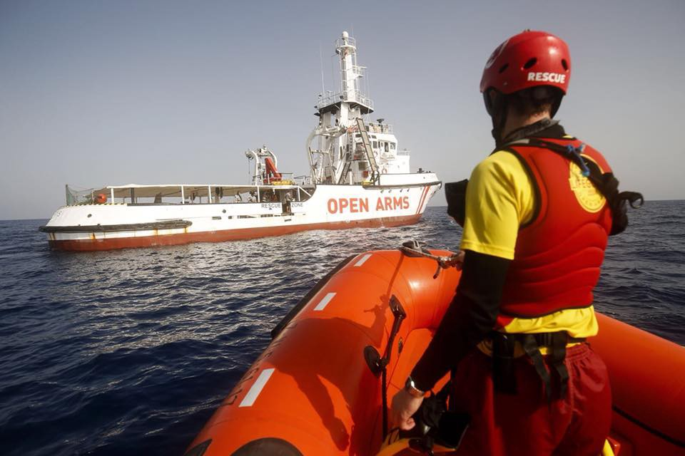
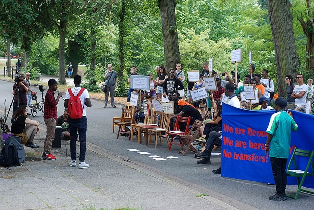

### 19/7/18 Pushbacks from Slovenia: Undeniable Abuse

_Children in Syria are growing up having only known war//a released video of the murder scene by the LBC//a HWR report on children’s denied access to education in Greece//deportations from Germany there and back again//and so much more…_

](assets/fa5186cbb4c2/1*2Llnb9KTXMt2O5xQDY2WqQ.jpeg)

Results of Croatian and Slovenian police abuse\. PC: [Gabriel Tizon](https://www.facebook.com/gabrieltizonfotografo/posts/1814105971968550)
### Feature: Pushbacks from Slovenia

In their recently published reports, Slovenian organizations Amnesty International Slovenia and Legal Information Center for NGOs , confirm that since June 2018 refugees entering Slovenia are being systematically pushed back to Croatia and from there to Bosnia\. People’s right to asylum is being systematically obstructed\.

These organizations conducted almost 100 interviews at the end of June in Bosnian towns of in Velika Kladuša and Bihać\. They found that out of 70 people they interviewed, 51 refugees described how after reaching Slovenia they were returned to Croatia despite asking for asylum\. Some refugees report that police promised to take them to an asylum home but were instead taken back to the Croatia\. There are also accounts and documents of police fining refugees for illegal crossings of the border \(fines can amount up to 500 EUR\), although the International Protection Act stipulates that people who intent to ask for asylum are exempt from the fine\. Despite numerous reports Slovenian police denies these claims\.

The official police statistics, however, show a large increase in returns to Croatia in June 2018\. Between January and May 2018, police reported 2437 irregular crossings and returned 370 people back to Croatia\. In June 2018, out of 899 reported irregular crossing 631 people were returned back to Croatia\. Moreover, the official number of people asking for asylum in June 2018 has dropped significantly\.

Amnesty International Slovenia and Legal Information Center for NGOs are calling for an independent investigation into this concerning evidence\. Slovenia and Croatian authorities are violating international law\. They are denying people the right to seek asylum then further stripping their humanity away with police brutality\. Enough has to be enough\.
### Syria

Meanwhile, 7 years into the Syrian Civil War, Children are growing up having known nothing else\. The Syrian civil defense team is leading a campaign for children to recognize remnants of shelling and how to properly get away from them\. Children are being taught how to just survive another day\.

](assets/fa5186cbb4c2/1*-iulgU71AjbDZsd-V_0UyA.jpeg)

PC: [Syria Civil Defence Idlib The WhiteHelmets](https://www.facebook.com/Syria-Civil-Defence-Idlib-The-WhiteHelmets-1489609321340242/)
### Morocco

[An intense evacuation](https://twitter.com/alzoubeidi/status/1019904258643320832) started at 4 in the morning on Thursday in the Sahara by the Moroccan authorities\. People will be transported on buses to other cities\. This is in an effort to limit people from crossing the Mediterranean to Spain and not the first time Moroccan police have used brutal tactics\.
### Libya

[A video](https://www.facebook.com/BMP007/videos/vb.100002611476783/1740514542712245/?type=2&theater&hc_location=ufi) has been released showing the people murdered on Wednesday by the Libyan Coast Guard\. Please view at your own digression, for it’s graphic content\. Regardless please note: these are the murders the EU has aligned itself with\.
### Sea

Proactiva Arms has announced that their ships will dock in the port of Palma De Mallorca next Saturday morning\.

[A boat with 160 people](http://www.ansa.it/sito/notizie/topnews/2018/07/20/yemensi-rovescia-barca-con-160-migranti_09548393-a6c3-4666-aa79-0c07a0c07422.html) , 100 Somalis and 60 Ethiopians, capsized off the coast of Yemen on Thursday\. We don’t know whether or not a rescue is taking place\. More and more African refugees fleeing their own countries’ violence are coming to Yemen, despite the country also having a humanitarian crisis and war with Saudi Arabia\.

For the 6th day people are still stranded at sea, waiting for Malta’s government to take action, reports [Alarm Phone](https://twitter.com/alarm_phone/status/1019882122717401088) \. [The government](https://twitter.com/MaltaGov/status/1019983139815469056) is refusing the accept that it’s breaking international law by stipulating that the people be redirected to Tunisia\. Read the statement by the Maltese Government [here](https://twitter.com/MaltaGov/status/1019983139815469056) \.

18 people from Tunisia have arrived in good condition to Lampedusa early Friday morning, states [Mediterranean Hope\.](https://twitter.com/Medhope_FCEI/status/1020068173280960512)

[Caminando Fronteras](https://twitter.com/walkingborders/status/1019885851956973569) reports that this Wednesday 150 people were rescued in the Estrecho Sea and 53 people in the Alboran Sea\.

For our German speaking friends, sea rescuers have put together a video showing what you can do to support sea rescue from home\. Find it [here](https://www.facebook.com/seenotrettung/videos/411238542616024/?hc_location=ufi) \.
### Greece
#### _Islands_

On Lesvos, the Greek Government has announced its [take over of Pikpa,](https://www.facebook.com/refucomm/posts/655268714824934) the volunteer run camp for the most vulnerable families on the island\. While, the initial decision to close the camp has been reversed, this serves as a warning to volunteers not to “use” refugees and to leave certain responsibilities to the government\. We have yet to hear about how the Pikpa’s founder and volunteers feel about this turn of events\. Keep reading the digest to stay posted\.

Human Rights Watch \(HRW\) released [a report](https://www.hrw.org/report/2018/07/18/without-education-they-lose-their-future/denial-education-child-asylum-seekers) on Wednesday documenting the denial of education to the children refugees on the Greek Islands\. Under Greek Law, formal education is required for all children ages 5–15, which includes children migrants and asylum seekers, even if they lack proper documentation\. Yet HRW has found zero evidence that children living in any of the government run camps have been enrolled in public primary or secondary schools\. Some children placed in vulnerable family shelters have been able to attend formal Greek school, but only with advocacy from NGOs and Greek volunteers\. Overall, the government still holds the belief that denying basic human rights to families and their children will deter others from smuggling themselves from Turkey\. In reality, children are just being denied a future\.

Mosaic Support Center, an informal educational organization needs your help in funding their initiative\. 30% of the population on Lesvos right now are children who are being denied their human right to an education\. Yet all ages deserve the chance to learn languages to effectively communicate, and feel a part of society\. Found out how you can help [here](https://www.betterplace.org/en/projects/48669-help-mosaik-support-center-for-refugees-and-locals-on-lesvos) \.

[Aegean Boat Report](https://www.facebook.com/AegeanBoatReport/photos/a.285312485325196.1073741828.285298881993223/399638490559261/?type=3&theater) states that a 45 people were picked up off the coast of Lesvos: 10 children, 25 women, and 10 men\.

With the good weather in recent weeks, [new arrivals](http://www.ekathimerini.com/230801/article/ekathimerini/news/arrival-numbers-taxing-island-migrant-centers) to the islands have increased, leading to extreme overcrowding in reception centers\. This week 508 people made it to the islands and the previous week 638 people arrived\. There has been approximately a 12% increase in new arrivals from June 11 to July 15 in 2018 compared to the same dates in 2017\.

[UNHCR’s report](https://www.facebook.com/AegeanBoatReport/photos/a.285312485325196.1073741828.285298881993223/399932193863224/?type=3&theater) on Samos states that a little over 3,000 people are now living on the island\. This is a camp designed for 700 people max\. The largest populations of people are from Syria \(33%\), Iraq, \(22%\), and DRC \(9%\) \.
#### _Mainland_

The governments of [Greece and Germany](https://www.thelocal.de/20180718/greece-to-process-1500-asylum-requests-from-germany) have agreed on a deal to help stem new arrivals coming to Germany and Austria as well as speed up family reunification cases in Greece\. Greece has agreed to process 1,500 asylum cases for Germany while Germany has agreed to accept 2,900 people to reunite them with family already settled in the country\.

Our House, a dedicated organization to helping homeless refugees, is accepting any donations of food, clothes and books you have\. Found out how you can help [here](https://www.facebook.com/groups/446386565554391/permalink/886254941567549/) \.

One woman and three children have gone missing after their boat capsized in the [Evros river](http://www.ekathimerini.com/230864/article/ekathimerini/news/four-missing-after-boat-capsizes-in-evros-river) on the border of Turkey\. A search and rescue in underway\. 3 men, 1 woman, and 1 child have been rescued\.

[Lifting Hands International](https://www.facebook.com/liftinghandsinternational/?ref=gs&fref=gs&dti=289026728095066&hc_location=group) in Serres, Northern Greece is in need of a recruitment volunteer to come and help manage their projects\. The minimum time requirement is 90 days and the position requires good management and organizational skills\. Find our more [here](https://www.facebook.com/groups/greecevolinfopoint/permalink/710919055905829/) \.
### Italy

[The Italian Bishops’ Conference \(CEI\)](http://www.ansa.it/english/news/politics/2018/07/19/cant-look-away-on-migrants-cei-4_a2e8277a-095e-4b6b-b95b-a8f2963cc2e9.html) on Thursday expressed major concern about the Italian Governments decisions to turn their back on rescue ships and people drowning at sea\. The bishops have issued an appeal to “save humanity\.”
### Macedonia

[The Former Yugoslav Republic of Macedonia](http://www.ekathimerini.com/230853/article/ekathimerini/news/eu-border-guards-may-be-deployed-in-fyrom) has agreed to allow EU border control guards to operate on its border with Greece considering the larger amount of people trying to head north recently\. The EU border guards will be able to “fully exercise \(their\) potential, reacting swiftly to migratory challenges\.”
### Bosnia

A source on the ground states that the EU special representative in Bosnia and Herzegovina met with the state government, IOM and UNHCR in Sarajevo appealing for the solution for the accommodation of people in the northern part of the country, mainly BIhac and Velika Kladusa area\. At the meeting, Denis Zvizdic, head of the Council of Ministers, rejected the possibility for Bosnia to be a regional hub for refugees\. He also announced stronger border control and invited FRONTEX to come and help\. EU representative encouraged the local government to strengthen the border control, saying that agreement with Frontex has to be signed soon in order to allow them to start their operation\. IOM announced they are working on the equipment in the old military barracks in Hadzici, suburbs of Sarajevo, to establish the first camp in this part of the country\.
### Germany

A [20 year old Afghani man](https://www.thelocal.de/20180719/wrongfully-deported-afghan-to-return-to-germany-ministry) will be sent back to Germany after the federal migration and refugee agency \(BAMF\) admits to wrongfully deporting him in the first place\. In early July he was deported to Afghanistan even though he had an ongoing legal appeal against his deportation\. This comes at a time when Germany’s Interior Minister Horst Seehofer is under political outrage for mishandling deportation cases and making crude jokes towards deportees\.

Yet more deportations are expected to come with [Merkel’s three\-party coalition’s](https://www.thelocal.de/20180719/wrongfully-deported-afghan-to-return-to-germany-ministry) tougher migration policy\. 148 Afghans have been deported from Germany so far in 2018\.

[The German government](https://www.thelocal.de/20180718/german-bill-to-cut-asylum-seekers-from-nafrica-georgia) has also announced a renewed bill to declare the countries of Morocco, Algeria, Tunisia, and Georgia to be “safe countries of origin\.” The first attempt was rejected in the upper house by Green party states\. Evidence suggests homosexuals, journalists, and others groups are in danger of persecution in these countries\. Interior Minister Horst Seehofer claims these citizens are not likely to get residency status in Germany anyways, so the bill would speed up the process\.

Another [sit in](https://www.flickr.com/photos/julia_daiber/sets/72157697592970091) was held today at the administrative bureau for interior affairs\. The protesters demanded to shut down the camp at Gottlieb Daimler Straße once again\.

PC: Julia Daiber
### France

An account from AYS colleague Lola Siran:

Weldab, 16 — like Emuna, in her 20s and pregnant or Wedurech in his 40s and the dozens & dozens of other people sleeping in this area — all fled torture, dictatorship, persecution\. They were all woken up by the police in the early morning with whistles and/or kicks in the head\. They all got their blankets taken by that very same police who, a couple of weeks ago, told me they were trying to ‘do their job as humanly as possible’\. It is not the first time the police takes their belongings and I’m not sure someone will be able to bring them blankets tonight as it is a vicious circle of giving out things that are confiscated a couple of days later\.

[Paris d’Exil](https://www.facebook.com/cpse75/?hc_ref=ARTss8ibsCdb4Yb9smuIoB0qdAzfy4yNt3lms9rewPuq4JQaMYMgeRUyV9YDtuWLJj4&fref=nf) is demanding immediate release of Tidiane and Seydou, 2 undocumented persons who were arrested during the solidarity March for the Migrants on July 8\. The police decided to arrest undocumented people, limiting the rights to protest discrimination\. 17 people have already been released yet these two are still being held\. You can find the petition to get them out [here](https://www.change.org/p/g%C3%A9rard-collomb-p%C3%A9tition-au-ministre-de-l-int%C3%A9rieur-pour-la-lib%C3%A9ration-imm%C3%A9diate-de-seydou-et-tidiane) \.

Utopia 56 needs volunteers and donated tents to continue their work with helping people living in horrible conditioned Squats\. Find out [more](https://www.facebook.com/asso.utopia56/posts/1984630298235419) \.
### EU

[Premier Giuseppe Conte](http://www.ansa.it/english/news/general_news/2018/07/19/eu-crisis-cell-on-migrants-needed_02bfd77a-3164-4820-8334-1e4f20a3b48b.html) proposed a “crisis cell on migrants” in a letter to EU officials this week in Rome\. “It is essential,” he wrote, “that an EU mechanism of swift and shared management on the various aspects of search and rescue be adopted immediately via “a sort of crisis cell” tasked with “coordinating the action” of member States on finding landing ports and countries willing to take the rescued persons… It is my suggestion that such a mechanism be coordinated by the European Commission \(by the Home DG, for example\) \.” This comes after Italy has refused to accept rescue ships into their ports, feeling like they receive an unfair amount of new arrivals as a border country\.

> **We strive to echo correct news from the ground through collaboration and fairness\.** 

> **Every effort has been made to credit organizations and individuals with regard to the supply of information, video, and photo material \(in cases where the source wanted to be accredited\) \. Please notify us regarding corrections\.** 

> **If there’s anything you want to share or comment, contact us through Facebook or write to: areyousyrious@gmail\.com** 

_Converted [Medium Post](https://medium.com/are-you-syrious/19-7-18-pushbacks-from-slovenia-undeniable-abuse-fa5186cbb4c2) by [ZMediumToMarkdown](https://github.com/ZhgChgLi/ZMediumToMarkdown)._
