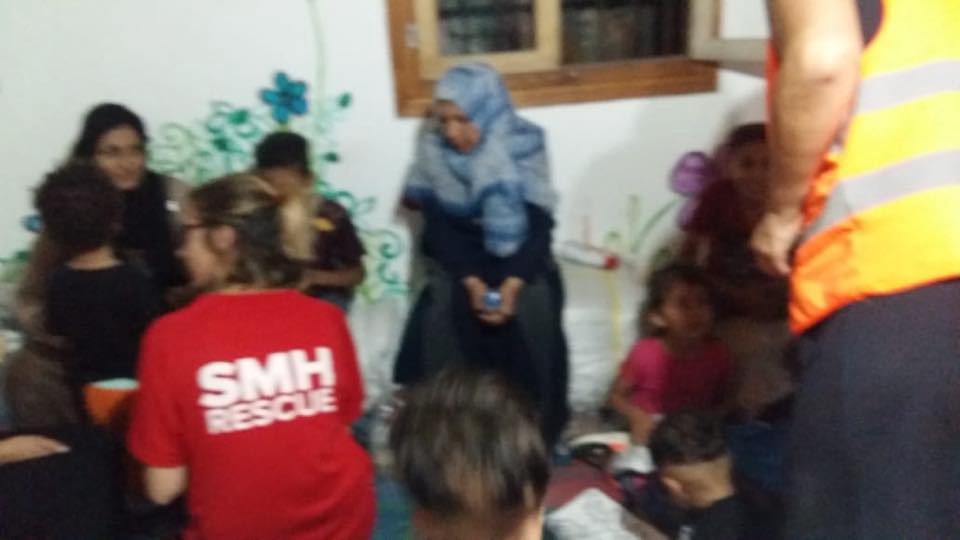
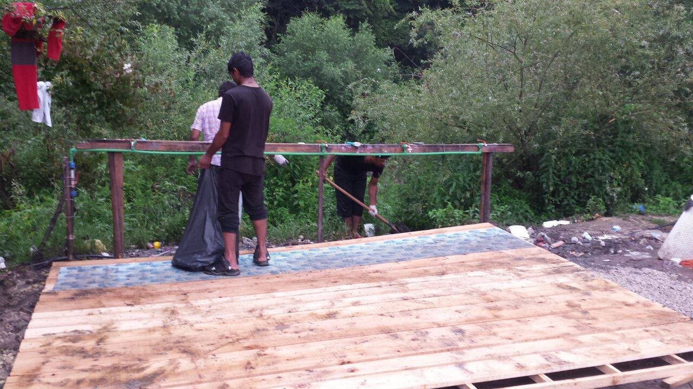

### AYS Daily Digest 22\.07\.18: Asylum Cases Backlogged for Years on Lesvos

_UNHCR complicity in Libya // People smuggling in Nador // Sea rescues // New arrivals in Greece // Violence on the Bosnian\-Croatian border // Protests in Munich // and more…_

](assets/8e41f73b9eb5/1*JLnfAP-eZVhAwFap9RgGIg.jpeg)

Moria camp on Lesvos\. Photo Credit: [Boat Refugee Foundation](https://www.facebook.com/stichtingbootvluchteling/?hc_ref=ARR65KGy2eBdiNzp6KltmQGG0ttKHSXMUiq9SIc4e8Dsr9BJUvtPIo0Nn6Osu-pDHig&fref=nf)

A volunteer medical group working on Lesvos reported today that there are no available asylum interview appointments until 2019 on the island\. This means refugees will have to wait in the infamous Moria camp for at least a year before getting their first interview\. According to BRF:

> The earliest dates for new asylum interviews for the people with a vulnerable status are now scheduled for April 2019\. After that there’s another two months of waiting until the result\. The vulnerable — including the elderly, single parents, unaccompanied minors, victims of sexual abuse and torture — are waiting a long time\. Simply because so many vulnerable people flee their country in search of safer place\. 

This has long been the norm on other islands, and in Athens there have been instances of people not receiving an interview date until 2020\. The Greek Asylum Service is chronically understaffed, and because they often go months without being paid there are frequent stirkes\. This has led to a massive backlog of asylum interviews\.
### Libya

The UNHCR assisted Libyan authorities with the forced return of 158 people today\. Why is the agency for the “protection “ of refugees taking part in the EU and Italy’s policy of returning people to hellish conditions? The UNHCR itself has comissioned many panels and reports describing the kidnapping and slavery markets of Libya\. Ultimately, the UNHCR does not represent refugees, but the people who fund it — for the most part, the US and a number of EU member states\. No matter how flagrantly human rights are violated, the UNHCR co\-operates with EU policy\. They have been notably silent since the EU funded Libyan Coast Guard struck a refugee vessel and left a woman and child [to die earlier this week](ays-daily-digest-20-07-2018-bodies-of-woman-and-child-abandoned-at-sea-by-libyan-coast-guard-to-be-7268f4c84d27) \.

### Morocco

The Moroccan Association for Human Rights \(AMDH\) described the strange situation in the port city of Nador this week\. While people smugglers work with total impunity, migrants in the city are denied almost any rights\. [AMDH stated](https://www.facebook.com/AmdhNador/photos/a.1693125780899690.1073741829.1493677674177836/2137392513139679/?type=3&theater&ifg=1) today:

> While migrants are forbidden to rent houses in Nador, traffickers… live and move freely\.
 

> While requests for travel cards are denied in Nador to all migrants, smugglers and people traffickers have almost all have a residence card\.
 

> How can traffickers get id’s and houses for rent while migrants are hunted by the police? 

AMDH released some photographs taken inside one of the buildings used by smugglers to hold people\. According to the [testimony](https://www.facebook.com/AmdhNador/photos/a.1693125780899690.1073741829.1493677674177836/2136908173188113/?type=3&theater) of some refugees in Nador, some traffickers will hold people prisoner in these buildings and try to extort more money out of them\.

Photo Credit: AMDH\. “This is how traffickers keep sub\-Saharan Migrants hostage in Nador\.
A real prison where migrants are crammed and forbidden to go out\.
It’s really a human trafficking\.”
### Sea

Spanish sea rescue group SMH [saved 110 lives](https://twitter.com/smhumanitario) between Spain and Morocco today\. The Spanish Coast Guard rescued 465 people from 25 dinghies today\. Over this weekend, approximately 1,200 people have been rescued off the Spanish coast\.

The Alarm Phone emergency line reported that yesterday they were supporting 4 boats in distress cases\. 2 of the boats were intercepted, one brought to Spain and the other forcibly returned to Morocco\. 2 of the boats they were in contact with have gone missing, and their fate is still unknown\.

There are still 40 refugees stuck aboard the Sarost, outside of Morcoccan waters\. There are two pregnant women and at least one seriously injured person aboard\. The temperature was nearly 40 degrees today, and there is no air conditioning on the ship\.
### Greece
#### Islands

Three boats have arrived on the Greek islands so far today, two in the day and one tonight according to Aegean Boat Report and SMH\. The first boat was picked up by HCG outside the airport, Lesvos south, 00\.45\. There were 36 people — 3 children, 16 women and 17 men\.

The second boat arrived on Samos this morning, carrying 35 people — 16 children, 7 women, and 12 men\.

On Chios, there was an arrival in the middle of the night of 17 people\. There were 9 minors, 3 women, and 5 men\.

Newly arrived people on Chios\. Photo Credit: SMH

ERCI is looking for volunteers to assist with their projects on Lesvos, especially working with children 6–12\. For more details email aid@ercintl\.org
#### Mainland

A volunteer group working in the Elefsina camp in Western Greece reported a strike led by refugees this week\.

> Due to the poor living conditions in Elefsina Camp, the residents went on strike from Tuesday to Thursday\- not allowing any actors to be present on the site\. 

> We are working as fast as we can to fill in the most crucial gaps in this camp\- starting with diaper distribution soon\. 

> This past week, we secured a second container on site, and we will finish equipping it this coming week\. Presently, we will use it primarily for baby\-care, while we decide which other services we can provide for this space\. 

> [A Drop in the Ocean](https://www.facebook.com/groups/763313107147281/) is the only volunteer organisation working in Elefsina Camp\- so you can imagine the magnitude of the impact we can have in this situation\. We need your [support](https://www.facebook.com/groups/763313107147281/) so that we may continue to work on improving the conditions at this site\. 

Today Arash Hampay shared some photos of a family that is camped outside a refugee camp in Athens\. They are only one of the many who the UNHCR and Greek authorities cannot accommodate\.

](assets/8e41f73b9eb5/1*ureqvTlRd2BK-XhGWFHuPg.jpeg)

A family camps outside the Eleonas camp, Athens\. Photo Credit: [Arash Hampay](https://www.facebook.com/photo.php?fbid=685133505166072&set=pcb.685133541832735&type=3&theater&ifg=1)

There are thousands of homeless refugees living in Thessaloniki, surviving with almost no aid or social support\. This week a volunteer medical group reported on their visit to an abandoned building on the outskirts of the city, where many refugees have been living\.

> Our evening clinic starts at 7pm near the abandoned building in Thessaloniki\.
 

> Inside our ambulance our doctor is checking the people\. The most common problem is scabies, swollen feet, headaches, and chronic pain issues\.
 

> A child, a young boy, only fourteen years old, felt very sick\. 40 degree of fever\.
 

> We call the ambulance\.
 

> He is on his own, living in the abandoned building\. No relatives, no friends\.
 

> Another young man had some bad stomach pain\. The ambulance arrives quickly and both of the men are taken to hospital\. Our nurse accompanies them\. 

This fourteen year old boy is only one of many unaccompanied minors living homeless in Greece\. Where are the responsible authorities? Where is the UNHCR?

Refugee Info published a guide to applying for Greek citizenship today\. [It is available](https://www.refugee.info/greece/greek-citizenship--greece/greek-citizenship?language=en) in Arabic, Farsi, French, Urdu, and other languages\.
### Macedonia

The EU have announced a plan today to place border guards on Macedonia’s borders with non member states\. Similar negotiations are currently taking place with Bosnia and Serbia\.

EU migration minister Dimitris Avramopoulos used his usual strategy of trying to bury the harsh reality of the plan beneath a pile of nonsense bureacracy words:

■■■■■■■■■■■■■■ 
> **[Dimitris Avramopoulos](https://twitter.com/Avramopoulos) @ Twitter Says:** 

> > Pleased to initial status agreement today between EU and former Yugoslav Republic of Macedonia on actions to be carried out by European Border and Coast Guard Agency. Key to strengthen border management and combat irregular migration and smuggling together [europa.eu/rapid/press-re…](http://europa.eu/rapid/press-release_IP-18-4567_en.htm) https://t.co/hJXzI389Vw 

> **Tweeted at [2018-07-18 13:36:18](https://twitter.com/avramopoulos/status/1019576599447064576).** 

■■■■■■■■■■■■■■ 

Phrases like “border management” obscure the reality of equipping countries with poor human rights records with more border police and military equipment\. These negotiations with Macedonia have reportedly been led by Austria’s far\-right government\.
### Bosnia
#### Violence continues on the Croatian border

Update from two groups working on the Bosnian\-Croatian border, [Cars Of Hope Wuppertal](https://www.facebook.com/carsofhopewtal/?hc_ref=ARScqlutaPWbpMlCe60p8NcDGo6_NUJqT-7ZWVV1vOeDe723euHNKSo4K4XAdUGyJgw&fref=nf&hc_location=group) and [SOS Team Kladuša](https://www.facebook.com/SOSTeamKladusa/?hc_location=group) :

> \[We\] treated several people when we arrived at camp\. Some of the injured were beaten up at the border by the croatian police\. Often the cops steal their money, break their phones\. We built a construction with tarp yesterday so that the many children can play in the shadows\. There is also a paddling pool in the corner where you can find some cooling\. After that, we built a shelter for a family with 7 people\. At the end of the day, we still started collecting garbage that was distributed in the entire camp after the flooding last week\. Many refugees have helped us\. The damage was immense, but the refugees have rebuilt the camp in record time with support from the team sos kladuša\. 

> Today we will build shelters again\. We need your support at the work we’re doing here with refugees\. Please help us give these people a place to sleep\. 

Paypal account: carsofhopewtal@gmail\.com

Building a tent platform in Velika Kladusa\. Photo Credit: Cars of Hope
### Germany

](assets/8e41f73b9eb5/1*WsEpfTec-9x0WCRRRdg4Ug.jpeg)

Photo Credit: [Beyond Europe](https://www.facebook.com/groups/1652972374920129/)

An estimated 50,000 people took to the streets in Munich against the politics of racism and fear\. Among the targets of the demonstration was Minister Seehofer, who has proposed a sytem of refugee detention camps along the border\. Even though many European authorities are turning their backs on refugees, the large turnout in Munich indicates that there are still many who believe in solidarity\. This is the third large scale demonstration in the city in the past few weeks\.
### France

Forwarding a message from the [Refugee Community Kitchen](https://www.facebook.com/refugeeCkitchen/posts/2269154633101894) in Calais:

> “WE NEED CHEFS\! Previous experience welcome but not necessary\. Come and be trained to cook 1000’s of fresh meals a day\. If you’ve been thinking of coming down, please do come and see what we do and how you can get involved\. Please share and sign up to volunteer today by emailing us at refugeecommunitykitchen@gmail\.com\!” 

](assets/8e41f73b9eb5/1*vOTTuZ6u35uNkE1Rf0lggQ.jpeg)

Photo Credit: [Refugee Community Kitchen](https://www.facebook.com/refugeeCkitchen/photos/pcb.2269154633101894/2269151623102195/?type=3&theater&ifg=1)

> **We strive to echo correct news from the ground through collaboration and fairness\.** 

> **Every effort has been made to credit organizations and individuals with regard to the supply of information, video, and photo material \(in cases where the source wanted to be accredited\) \. Please notify us regarding corrections\.** 

> **If there’s anything you want to share or comment, contact us through Facebook or write to: areyousyrious@gmail\.com** 

_Converted [Medium Post](https://medium.com/are-you-syrious/ays-daily-digest-22-07-18-asylum-cases-backlogged-for-years-on-lesvos-8e41f73b9eb5) by [ZMediumToMarkdown](https://github.com/ZhgChgLi/ZMediumToMarkdown)._
