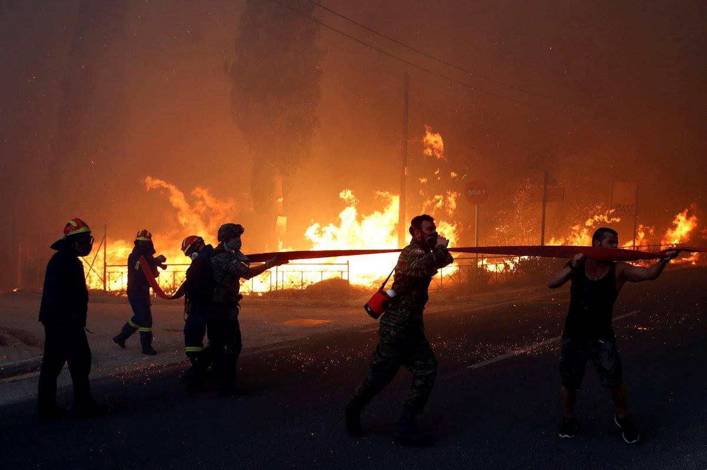
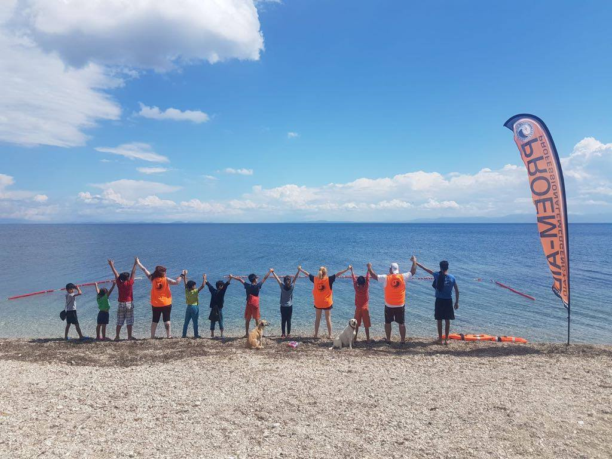
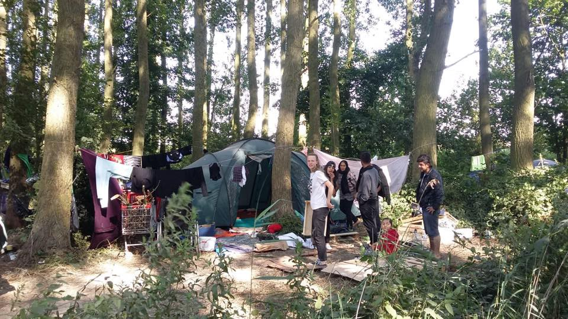

### AYS DAILY DIGEST 23/7/2017: Number of asylum seekers in Bulgaria drastically decreased

Our thoughts today are with the people in struggles against fire in Athen\! Photo by No Border Greece
### Feature: Violations of human rights pushes people away from Bulgaria

Due to very bad living conditions and treatment in Bulgaria, deportations to the country of origin, as well as the measures of draconian control that Turkey introduced at its borders, the number of asylum seekers in this country is decreasing\.

According to the information from the Bulgarian media, some of the centres where asylum seekers were living, are almost empty, while the number of applications for protection is also much lower in comparison to previous years\. At some of the centres, even the security presence is reduced\. The data published by the national TV showing that, at mid\-July 2018, there were 577 people in the centres, which amounts to 11 per cent of capacity\. This year, a total of 1\.439 people have sought protection\. About 400 of them have been refused\. Just four years ago, there had been 11\.080 applications for protection\.

At the same time when these numbers came out, [Bulgaria’s parliament voted](https://www.reuters.com/article/us-global-markets/china-shares-hit-one-month-high-on-stimulus-hopes-bonds-tire-idUSKBN1KE023) to bar the government from signing bilateral agreements with other EU countries on readmitting people\. The Parliament also wants to present to Brussels their proposal by the end of September on reforming the Dublin Regulation\. Their approach is the immediate closure of the EU’s external borders, and the setting up of centres for war refugees outside its territory\.

This year, two very harsh reports on living conditions for refugees and migrants in Bulgaria came from the Council of Europe\. The first one was [published in April](https://rm.coe.int/report-of-the-fact-finding-mission-by-ambassador-tomas-bocek-special-r/16807be041) by the by Ambassador Tomáš Boček, Special Representative of the Secretary\-General on migration and refugees\. This reported focuses on the regular push\-backs along the Bulgarian\-Turkish border, the Bulgarian asylum system, the detention of those seeking protection, the situation of unaccompanied minors and the problems of integrating recognized refugees\.

According to the findings of the CoE Special Representative, asylum\-seekers in Bulgaria are being systematically detained in detention centres in Lyubimets and Busmantsi, while their rights are being neglected\.

[Another report](https://www.ecoi.net/en/file/local/1431740/1226_1525777574_2018-15-inf-eng-docx.pdf) was issued in May by the European Committee for the Prevention of Torture\. Even this report focus is on poor conditions in detention centres, with limited access to medical care such as gynaecological and psychological treatment, while nearly all types of medicine have to be paid by the detainees themselves\.

In both cases, bad treatment by the detention centres staff is noted, ranging from beatings to more subtle forms of disrespectful treatment\.

In these centres, [overall conditions](http://www.asylumineurope.org/reports/country/bulgaria/detention-asylum-seekers/detention-conditions/conditions-detention) with respect to means to maintain personal hygiene as well as a general level of cleanliness, are unsatisfactory\. People who are detained have to clean the premises themselves, and they have to buy detergents and everything at their own cost\. Clothing is provided only if supplied by NGOs\. Bed linen is not washed on a regular basis, but usually once a month\.

Additionally, nutrition is poor, and no special diets are provided to children or pregnant women\. Access to open\-air spaces is provided twice a day for a period of one hour each, the spaces in all detention centres are of adequate size\.

Worrying conditions are also reported in police stations where newly arrived asylum seekers may be held upon entry\.
 
According to the Helsinki Committee in Bulgaria, the state of human rights in this EU member country is derogating in general\. Among other conclusions, in [their yearly report](http://www.bghelsinki.org/en/news/press/single/bulgarian-helsinki-committee-published-its-report-human-rights-bulgaria-2017/) , the Committee concluded that the situation of zero integration of refugees in Bulgaria has been going on for the fourth year in a row\.

“Moreover, throughout 2017 asylum seekers repeatedly reported about incidents of verbal and physical hostility, as well as direct attacks and robberies near their housing centres\. These acts are never investigated\.”

“Overall, 2017 was a year of stagnation in the protection of human rights\. In several major areas, we observe significant deterioration\. The authorities and the official institutions in Bulgaria have been deaf to human rights\. Bulgarian civil society and the groups that protect the rights of vulnerable people have not been able to raise their concerns\. This task is on our agenda for 2018,” said Krasimir Kanev, chairman of the BHC\.
### Italy

The conditions in detention centres in Italy are not very good, too\. On Monday we received [info](https://www.facebook.com/1796935283884966/posts/2158009981110826/) about the hunger strike at the CPR San Gervasio \(Potenza, Basilicata\) against the management\.

People who are on the strike are claiming that the management uses violence against them, that they are beaten up on a regular basis and that psychiatric drugs are used widely\.

Additionally, Italian [media are reporting](http://torino.repubblica.it/.../caporalato_le_vigne.../) about the precarious situation for asylum seekers who are working in the fields in the region around Turin\. They have been paid 5 euros per hour while working for 9 hours a day\.
### Greece

On Monday, 17 people arrived by boat to Chios\. Most of them are from Iraq and Palestine\. For more reports on newly arrived people on the islands, follow [Aegean Boat report](https://www.facebook.com/AegeanBoatReport/?hc_ref=ARThmzv7i-8vneJ--vIp2kqdj04-CHFIMuBSmGkTQ2bIotEBt8pic29QQWz3L4KmyzU&fref=nf) \.

Another suicide was confirmed in camps in Greece\. This time, the young man from Syria, Damascus took his life in the camp Oynofita\. As we were informed by the volunteers in the field, his entire family has been resettled to other European countries, but he has received two rejections from Greek Asylum Service\.

Once again we have to publish info about the food in some of the camps in Greece\. Once and again, people are finding maggots in camp food\.

Here is a recent video of so\-called “food” at camp Moria\.

Living condition in Moria are the cause of the [serious concern](https://www.doctorswithoutborders.org/what-we-do/news-stories/story/refugees-further-traumatized-conditions-greeces-moria-camp) of MSF doctors\. They claim that the conditions of the camp are harming refugees’ mental health\.

“Part of the reason people’s mental health deteriorates so drastically here in Lesbos is that they come from traumatizing experiences\. \[They\] reach Europe hoping for refuge and dignity, but what they find are the opposite — more violence and more inhumane conditions,” says Giovanna Bonvini, mental health activities manager at MSF’s Mytilene clinic\.

At the moment, over 8000 people are crammed into the space made for 3000\.

Universities in Greece are accepting applications [now](https://www.facebook.com/refugee.info/posts/1849060575154081?hc_location=ufi)

[Swimming classes](https://www.facebook.com/1650025878606170/posts/2136836576591762/) at Pikpa are organized every day

Refugee women from Afghanistan and Iran will [participate](http://www.alithia.gr/.../paidia-prosfyges-stin-opera-tis...) on Opera of Masticha \(Chios traditional tree\) performance, at 27/28 of July at Chios at Olympon National school\.

Refugee Law Clinics Abroad needs volunteers \(legal interns, lawyers and practitioners\) in Chios to work for at least 2 months\.

The organisation offers legal information to those seeking protection and who are supposed to be returned to Turkey, working in the preparation for an accompaniment to asylum interviews and supporting family reunion procedures under the Dublin III Regulation\. [Deadline for applications](https://refugeelawclinicabroad.files.wordpress.com/2018/07/call-for-volunteers_schulung-august-18_en3485.pdf) is 13 August 2018\.
### Bosnia

On Tuesday morning, the authorities in Bosnia should have been started with accommodating families and minors travelling alone from Velika Kladusa and Bihac outdoor areas to former hotel Sendra in the city\. The hotel is in a very bad condition for years, and it is supposed to be destroyed in the next 4 to 6 months\. However, due to the lack of the capacity for all the people who are still arriving in Bosnia, the government decided to use this hotel as a temporary solution\.

Authorities in Bosnia are still looking for the solution to the current situation in which several thousand people are left to live out in the open all over the country\. According to some reports, one of the problems to find a proper accommodation is disagreements between local governments\. Additionally, the international organizations and the EU are not willing to help establish any centre close to the border\.
### France

Donations are needed in [Calais](https://www.facebook.com/…/a.10461649754…/2014709575228656/…)

Photo by Care4Calais

[La cuisine des migrants](https://www.facebook.com/CuisineDesMigrants/posts/2525221794158515) need volunteers for food to distort in Paris, sign up in the link
### Sweden

Brave activist Elin Ersson in Sweden trying to prevent deportation from Gothenburg to Afghanistan\. We need more Elin in this world\.

> **We strive to echo correct news from the ground through collaboration and fairness\.** 

> **Every effort has been made to credit organizations and individuals with regard to the supply of information, video, and photo material \(in cases where the source wanted to be accredited\) \. Please notify us regarding corrections\.** 

> **If there’s anything you want to share or comment, contact us through Facebook or write to: areyousyrious@gmail\.com** 

_Converted [Medium Post](https://medium.com/are-you-syrious/ays-daily-digest-23-7-2017-number-of-asylum-seekers-in-bulgaria-drastically-decreased-c5233bb625cb) by [ZMediumToMarkdown](https://github.com/ZhgChgLi/ZMediumToMarkdown)._
