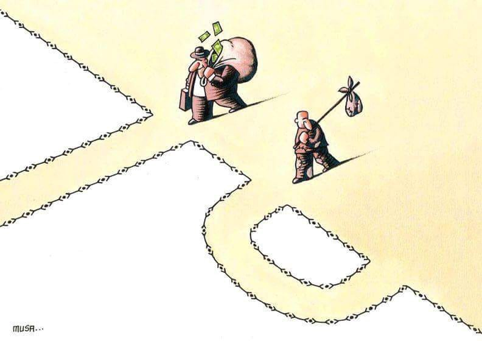

### AYS DAILY DIGEST
### AYS DAILY DIGEST 24/07/18: Wildfires and Solidarity in Greece

_People coming together in Greece, again // Visegrad four refuse to comply with relocation scheme // Danger in Afghanistan // Increased repression in Hungary// Terrifying police brutality in France // Hundreds rescued but at least ten dead off of Spain// and more…_

Photo Credit Musagumus, via Art Against
### FEATURE: Dozens of people killed in terrifying wildfires, new crisis to be faced with solidarity\.

Throughout the last few years, we have seen how structures created by people to help during times of crisis are the most flexible, for handling both natural disasters as well as human\-caused disasters\. We can see this demonstrated once more against the tragic backdrop of the fires that have devastated Mati, Greece — how people\-powered movements carry through\. Although as expected the EU has sent reinforcements that are greatly needed to help battle the wildfires, for 74 people it was too late\. Additionally, EU support comes with the usual strings attached\. Carl Bildt posted a rather insensitive tweet trying to highlight how helpful the EU has been:

■■■■■■■■■■■■■■ 
> **[Carl Bildt](https://twitter.com/carlbildt) @ Twitter Says:** 

> > Horrible death toll in very dangerous wild fires in Greece. EU countries coming to help. Again. [twitter.com/StylianidesEU/…](https://twitter.com/StylianidesEU/status/1021660861436452864) 

> **Tweeted at [2018-07-24 08:48:42](https://twitter.com/carlbildt/status/1021678548740915200).** 

■■■■■■■■■■■■■■ 

Meanwhile, many people who are in camps or assigned housing in Greece, who in many ways have also been left behind by the system, are reaching out, stating that for better or for worse, Greece is their home, and that the local community needs them now…

Intervolve in Thessaloniki is running a donation drive for the people of Athens, collecting donations on Wednesday and Thursday

> “from 09:00–13:00 aid will be collected at Thessaloníki International Fair Helexpo and specifically at pavilion 16\.
 

>  Items needed are dry food packages, bottled water, hygiene items, basic pharmaceuticals \(bandages, saline solution, medical gloves, masks etc\) \. Please try to ensure these items can travel, so try to have them packaged\.” 

Contact Intervolve for more information\.

Additionally, activist Arash Hampay who has been involved in protesting and assisting protestors of unfair deportation and detention has been gathering a group to go assist those in need\. Hampay states that many refugees want to help, and that their group Our House, which currently provides aid to the homeless in addition to refugees, is now registered with the authorities to provide aid to victims of the fire\.

To find out more about how to help, go [here](https://www.facebook.com/100010082855510/posts/686776231668466/) \.

All of these signs point to the power that individuals have in responding to all manners of disaster\. This experience has a dreadful shadow cast over it in regards to why it was even necessary to develop in the first place, but we stand with all of those willing to come together and support in time in need\. We all must stand together to survive\.

Indeed, this show of support stands in contrast to the persistent refusal of other members of the EU, namely the Visegrad Four \(Czech Republic, Hungary, Poland and Slovakia\), to assist with relocation of refugees from Greece\.

The Czech Republic should have relocated 2691 people from Greece and Italy and has relocated only 12\. Poland and Hungary have not accepted anyone through the relocation scheme\. The countries should have taken in 7082 and 1294 people, respectively\. Slovakia accepted 16 out of the 902 people they should have accepted, and has only granted single mothers with children protection, a decision clearly based on xenophobia and discrimination\.

Slovakia is the only country in the Visegrad group that was not referred to the EU Court of Justice last week — a low bar for compliance\. Although Hungary did take in 1300 refugees last year \(with much internal scandal at having done so in the face of hardline rhetoric\), most of these people eventually left for another place\. Poland holds out, stating that its plate is full with the estimated one million Ukrainian refugees it has taken in over the years, although this number is unsubstantiated\.

Although the fairness of the redistribution scheme is hotly debated, and the relative poverty of the Visegrad four in comparison to other participants in the EU relocation scheme is often invoked, it is clear that if displaced people can find it within themselves to mobilize and help their fellow man, perhaps the issue has little to do with economics and more to do with ideology\. Read more [here](https://www.euractiv.com/section/justice-home-affairs/news/visegrad-nations-united-against-mandatory-relocation-quotas/) \.
### GREECE

> The Aegean Boat Report notes that 44 people arrived to Lesvos and 28 people to Kos\. 

Additionally, there are now new rules for unaccompanied minors in Greece that will enable each child to have one legal representative
### AFGHANISTAN

> According to Reuters, five explosions rocked Kabul, injuring at least three\. 

With the recent popularity of Elin Ersson’s refusal to allow a deportation plane to take off, it is important to remind people of why she did it\. Afghanistan is not safe\. This is the moral of the story\.
### TURKEY

It seems that Turkey has been redoubling its efforts to stop people from moving forward\. Additionally, HarekAct via bordermonitoring\.eu notes that 450 undocumented people were registered as being held across Turkey\.

“In the northwestern province of Edirne, 102 migrants were rounded up in Yenikadin, Orhaniye, Bosnakoy and Meric districts, said sources within the coast guard, who asked not to be named due to restrictions on speaking to the media\.

The migrants were from Egypt, Iraq, Libya, Somalia and Pakistan\.

In the northwestern port city of Canakkale, 39 people were rescued by the Turkish coast guards from a sinking rubber boat\.

Separately, 302 undocumented migrants — including Afghan, Pakistani and Bangladeshi nationals — were rounded up in Ipekyolu district of eastern Van province after they attempted to illegally enter Turkey, the sources said\.”

Read more [here](http://harekact.bordermonitoring.eu/2018/07/23/450-undocumented-migrants-held-across-turkey/) \.
### SEA

■■■■■■■■■■■■■■ 
> **[Helena Maleno Garzón](https://twitter.com/HelenaMaleno) @ Twitter Says:** 

> > [#TRAGEDIA] Desaparecen diez vidas en nuestro mar de #Alborán. Desde ayer llamaban desesperadas pidiendo un rescate mientras la patera se hundía. https://t.co/0eFUGEgRPH 

> **Tweeted at [2018-07-24 13:59:23](https://twitter.com/helenamaleno/status/1021756735260946432).** 

■■■■■■■■■■■■■■ 

Ten people lost their lives in the Alboran sea\. Additionally, at least 163 people were saved from 17 boats by Salvamento Marítimo in the waters of Spain\. Read more, in Spanish, [here](https://www.eldiario.es/andalucia/migrantes-rescatados-Estrecho-Salvamento-acogida_0_796170881.html#click=https://t.co/mIqWAyCxYp) \. [Watch The Med — Alarmphone](https://www.facebook.com/watchthemed.alarmphone/?hc_ref=ARSaz2ynEICqUieP0UK49D76Dh0V_fNgKJo-eJHO78mItQBQ0Fe5xFFGIymiECM_Dbo&fref=nf&hc_location=group) reported on some of these boats, stating that five boats were intercepted by the Moroccan authorities, with five more returning to Morocco on their own\. Three remain unaccounted for\.
### HUNGARY

The Hungarian Helsinki committee posted a new law on the “special tax on immigration,” which, in short, levies a 25% tax on any financial assistance provided to an action that was in support of immigration\. As if the imposition of this very high tax weren’t enough, there are complicated and specific laws on how and when to pay it, effectively creating a channel for the Hungarian government to limit activities supporting immigration\. Read the full excerpt [here](https://www.helsinki.hu/wp-content/uploads/Special-immigration-tax-as-adopted-20-July-2018.pdf) \.

The danger of this act is two\-fold: not only in its immediate pressure on groups in Hungary, but also in the precedent it may set for criminalization of solidarity through financial means\.
### ITALY

ECRE posted an update that until the EU has structured a new deal for Italy that will prevent “all people from landing in one country,” the country will be required to accept rescue ships for the next five weeks\.

A boat with 54 people landed close to Crotone \(Calabria\) this morning without being spotted by CG nor any other vessel of operation\.
 11 children, 6 women, and 37 men, all Kurds and Syrians, were onboard\.
 They received first aid from locals and tourists present on the beach\.

Translated from Italian [here](https://www.crotonenews.com/cronaca/crotone-barca-alla-deriva-con-54-migranti-soccorsi-da-bagnini-e-villeggianti-foto/) \.
### FRANCE

Utopia 56 posted a call for volunteers\. The situation in France remains dire\. Please if you have time, get involved\. Read it below\.

[Solidarité migrants Wilson](https://www.facebook.com/Solidarité-migrants-Wilson-598228360377940/?hc_ref=ARR8lJRt3zVsddvwxwqD1D3V7wH07H7D3taGRVQeu2SykwS3GUCX9DJyyHyDbHIuiSs&fref=nf&hc_location=group) posted a disturbing encounter with plainclothes police who were observing an intervention with a man that turned violent\.

_“Monday July 23, 1:50 pm, Porte de la Chapelle\._

_Leaving Bowling for home, 500 meters away\. A man alone on the street under the Pont du Périphérique, next to an electric meter, is being taken aside by a man of 50 or so\. We hear screams, and three men standing nearby motion for us to move\. We ask what’s going on\. A 30\-year\-old man says, “You don’t know what’s going on, move along\.” We insist\. Despite our request and concern, he refuses to give any explanation\. We explain to him that we’re going to call the police and he takes an armband from under his shirt with the word_ police _on it\. He explains that he is responding to the situation, that we cannot stay, that it could be dangerous for us\. He tells us to move along\._ 
_We stay, because we hear a man screaming in agony\. The policeman is hitting the man, hiding himself behind the electric meter\. We see the man on the ground and the policeman punching and kicking him in the chest and face\. The other three men surround us and prevent us from approaching, with threatening eyes\._ 
_In light of this scene, I decide to call 112, but the man’s colleagues indicate that it is not necessary because they belong to the police force\._ 
_We ask them to show us their ID number\. One of the men shows us an armband and the second his plaque for a short moment, but doesn’t give us the time to read it\. They tell us once more to “ move along“ and let them carry out their “operation\.”_ 
_A few seconds later, the man who has been hitting the individual on the ground walks over to his colleagues\.”_

Read more in French, [here](https://www.facebook.com/permalink.php?story_fbid=944742109059895&id=598228360377940) \.

> **We strive to echo correct news from the ground through collaboration and fairness\.** 

> **Every effort has been made to credit organizations and individuals with regard to the supply of information, video, and photo material \(in cases where the source wanted to be accredited\) \. Please notify us regarding corrections\.** 

> **If there’s anything you want to share or comment, contact us through Facebook or write to: areyousyrious@gmail\.com** 

_Converted [Medium Post](https://medium.com/are-you-syrious/ays-daily-digest-997db1c452ea) by [ZMediumToMarkdown](https://github.com/ZhgChgLi/ZMediumToMarkdown)._
