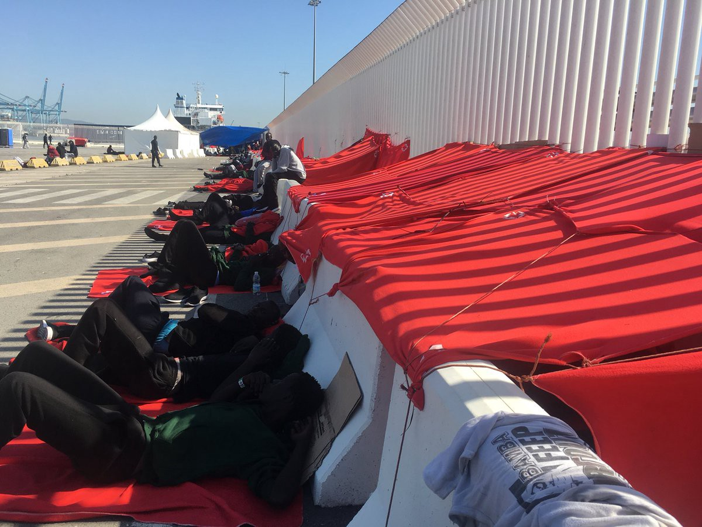
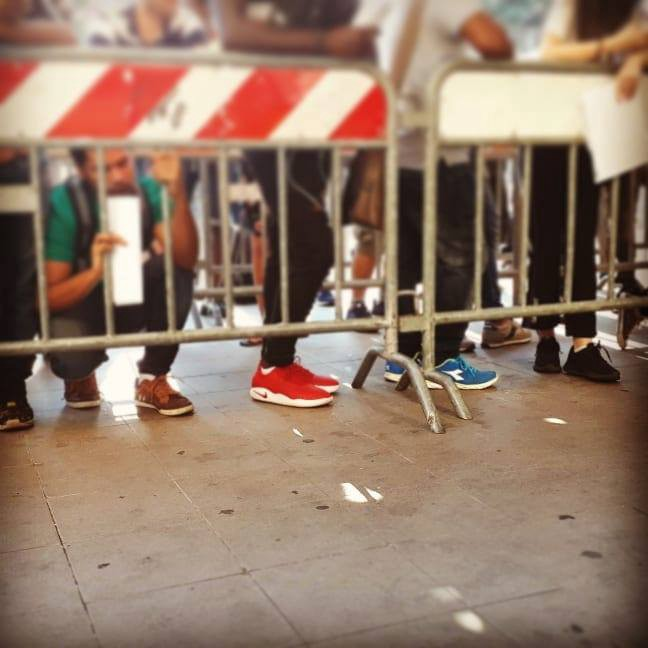
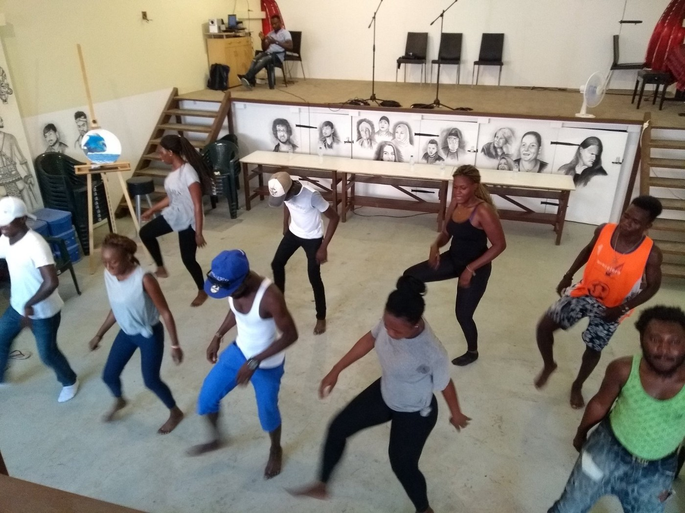
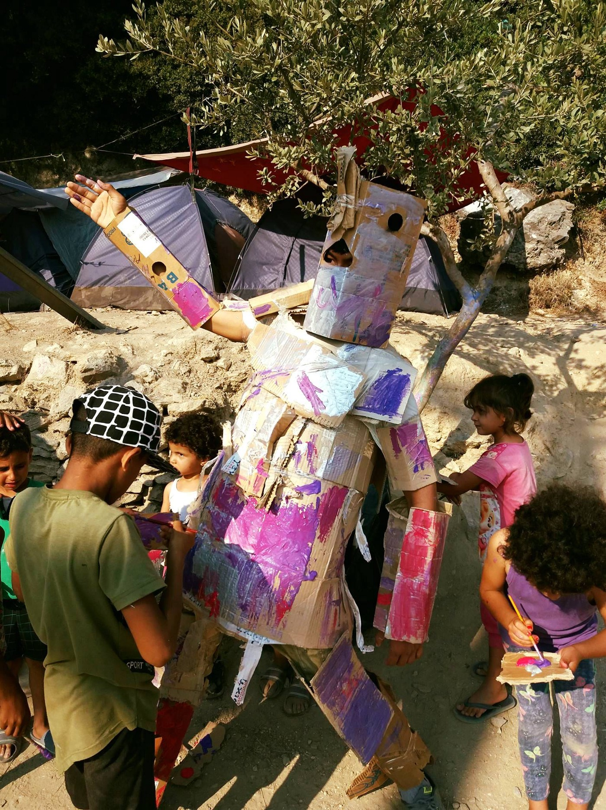
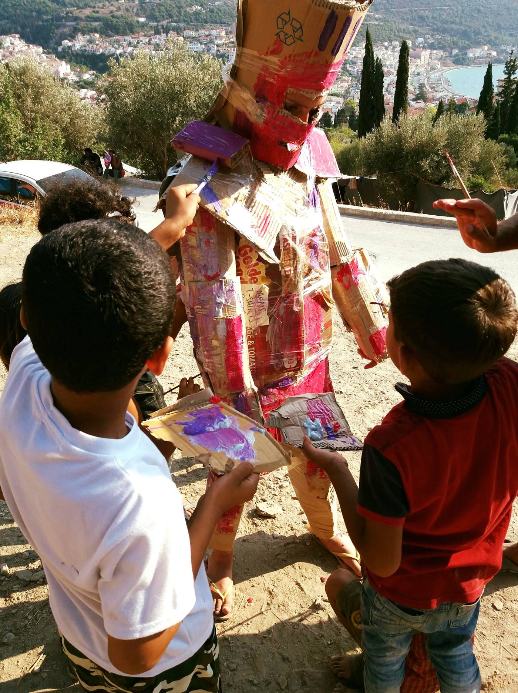
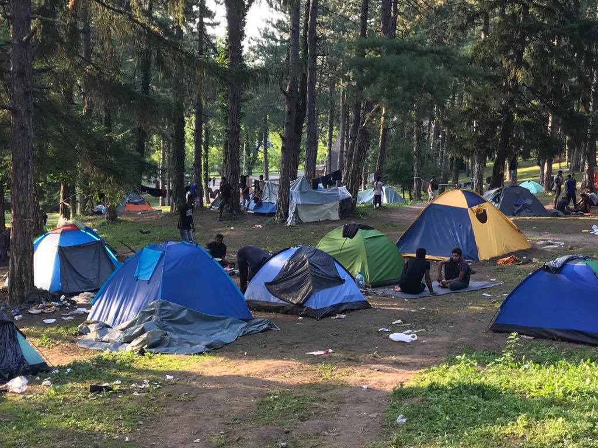
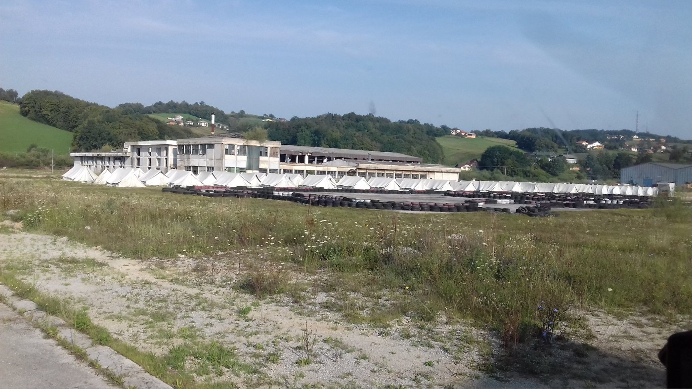
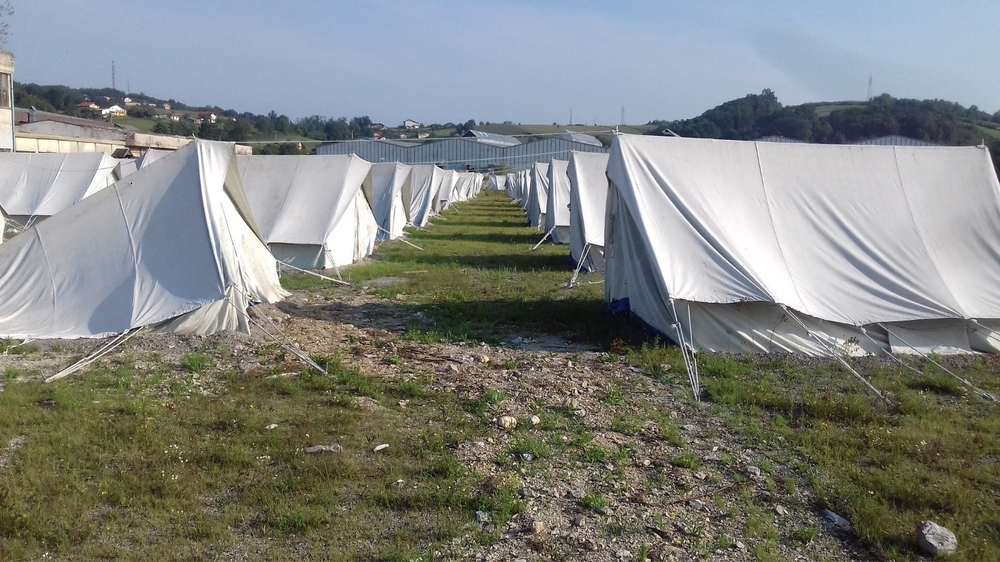

### AYS DAILY DIGEST 31/7/2018: Italy violates the basic human rights of people on the move

_Concerns after Italy pushed back a boat with 108 people to Libya // 9 hours in line to register for asylum in Rome // No solution for people in Bosnia // Sign the petition to allow refugees to be reunited with family members // Eviction of 300 people in Scotland_

 \.](assets/b2ea14bcae3d/1*UTo2bHvOdX5tjljLczJAjg.jpeg)

Bihać, a makeshift camp where about 1000 people live in precarious conditions\. Photo by [One bridge to Idomeni](https://www.facebook.com/onebridgetoidomeni/) \.
### Feature

The Italian branch of UNHCR is looking at the case of forced return of a boat with 108 people to Libya last Thursday\. The operation was conducted by the Italian Coast Guard\.

A member of the leftwing LeU party on Monday expressed concern that the failure to take the migrants rescued from a dinghy to Italy could have amounted to a breach of international law because Libya is not considered as a port of safety\.

[Sea\-Watch crew](https://www.facebook.com/.../a.15795.../2082562138628523/..) expressed their concerns after people were pushed back to Libya, which is in **violation of the Geneva Convention on Refugees and the European Convention on Human Rights** \.

They also reminded the public that in 2012, Italy was convicted of such an offense by the European Court of Human Rights\.

“ _The EU must evacuate the people of Asso Ventotto immediately and must not wait for the European Court of Human Rights to force them to do so_ ,” Sea Watch warned\.

The EU must react to this action, as well as similar actions by the Croatian state, Hungary, Romania, Bulgaria, Greece, Austria… but ultimately, it does not appear that the leaders are willing to do anything concrete for the benefit of people on the move\. It is time for citizens to call on the EU for violation of basic human rights of so many people\.
### Turkey

Turkish [media are reporting](https://m.sondakika.com/.../haber-ege-denizi-nde-can.../) that a boat that was heading to Kos, with 10 people from Syria and Iraq on board, sunk off the coast of Bodrum, Turkey\. All people were rescued by the crew of a Turkish tour boat, who threw life vests and then went into the water to help them\.

Passengers were brought back to Bodrum and all surrendered to the Turkish coast guard\. In addition to a number children, the passengers included a pregnant woman and a man, both very unwell, who were sent to a local hospital\.
### Sea

According to the IOM data, **57,571 people on the run entered Europe by the sea** through 29 July 2018\. At the same time, **2,323 persons died while trying** to reach Europe\.

Mission Lifeline is looking for the new crew member for their new ship\. If you are a ship technician or ship mechanic, sign up for Mission Lifeline: [crew@mission\-lifeline\.de](mailto:crew@mission-lifeline.de)
### Spain

Spain is currently the main arrival\-by\-sea country in the Mediterranean, with **22,858 migrants arriving since the beginning of the year** and **1,866 of them arriving since 25 July alone** \. To respond to the high number of people who keep arriving, the government is planning to invest 30 million euros\. The money will go towards covering the initial costs of managing arrivals on the beaches: from organizing staff to handing out blankets, from providing food to processing asylum claims\.

In the meantime, hundreds of asylum seekers are sleeping on the pavement, as well as inside a rescue boat docked in the port of Algeciras\.
### Italy

The situation in Rome is not getting any better, according to [Baobab team](https://www.facebook.com/BaobabExperience/posts/1774219925988085) \. They claim that with the new government in place, the climate of intolerance and arrogance towards asylum seekers is more than visible\.

“ _Violence not only physical but verbal, institutional\. A daily violence that affects foreigners and affects all of us, foreigners in a country with no more respect and mercy even for his children…”_

This can be seen in attitudes toward people who are trying to register as asylum seekers at the state office\. They are left to wait for days while sleeping out in the open, and then for hours in line to register\. Baobab presents the story of Mahmoud, a Palestinian gentleman with a 17\-year\-old son:

“ _For him, already a month in the tents at the informal field of Piazzale Maslax, access to the procedure had been denied without any plausible reason: for three times the line, the waiting, had not amounted to anything, their request denied\._ ”

Baobab team members joined Mahmoud and his son in line to make sure their application will be processed in accordance with the law\. Previously, he was prevented three times from applying for asylum\.

“ _Once we enter, with about 200 people we wait in a room with a capacity for half that much: crammed into each other, waiting for endless hours to be received\. There were three of us and we took turns to stay inside so we wouldn’t miss the call; the risk is to start all over again\.”_

They were waiting for nine hours, but finally, they made it, and Mahmoud finally received asylum\-seeker status in Italy\.
### Greece

Another [victim at the border](http://www.gazzetta.gr/.../entopistike-nekro-14hrono...) with the EU\. This time, a 14\-year\-old child, a girl, was found dead on the banks of the Evros, in the wider area of Pythios Didymoteichos\.

[Drapen in Havet](https://www.facebook.com/groups/763313107147281/permalink/1518221151656469/) organization is looking for coordinators

We need Coordinators for all our locations in Greece\! Please look up our website for more information about our locations and the various coordinator roles\. If you have the opportunity, the skills and are interested in helping — send your letter of motivation and CV to [birgit@drapenihavet\.no](mailto:birgit@drapenihavet.no)

[Health\-Point Foundation](https://www.facebook.com/healthpointfoundation/) , a healthcare charity providing essential dental treatment to the many thousands of refugees in the camps in Northern Greece needs help\.

_“We need DENTISTS to fill an urgent gap in our rota in Lesvos, Moria, on:_

_\- Monday, Aug 13th till Friday, Aug 17th\._ 
_\- Monday, Aug 20th till Friday, Aug 24th\._

_Dentists need to have been qualified for 2 years to complete registration with the Greek health authorities\.”_

If you may be available for the dates above, please get in touch with us ASAP by email: [dental@healthpointfoundation\.org](mailto:dental@healthpointfoundation.org)

Despite all the hardship, people always find a way to stay together and smile\. That is what was happening yesterday at Lesvos and Samos\.

[The Hope Project](https://mydonate.bt.com/fundraisers/philippakempson2…) organized the very first meeting of TEAM RAD MUSIQUE African, and the place was jumping\.

They hope this will become a regular meeting\. Everyone is welcome to come along and to learn some great dance moves and to have fun with a fantastic group of people\.

On Samos, robots came to visit kids\!

“ _This activity is a prime example of how much we can do here, with so little\. Give a volunteer a piece of cardboard, and they’ll know how to turn it into magi_ c\.”

 \.](assets/b2ea14bcae3d/1*E-62ujAeRHSxZ0VBRz0g9g.jpeg)

Photo by [Samos Volunteers](https://www.facebook.com/samosvolunteers/) \.

Samos volunteers believe that innovation is key to keep going, but they do need your help with this\. Visit their FB page to see how can do it\.
### Bosnia

The situation in Bosnia is not changing, at least not for the better\. People keep coming every day\. According to available data, between 400 and 600 weekly\. Most of them stay in Sarajevo or move on towards the border with Croatia\.

In Bihać and Kladuša, two cities with the biggest concentration of people on the move, despite numerous promises, there are no solutions for accommodation\. Last week, some families were finally taken from the streets and makeshift camps in the area to the improvised camp made in the old hotel Sedra\.

So far, volunteers and the media’s access to the hotel is limited, but from the people who are living there we heard that living conditions and food are very basic\. The hotel does not have running water, so portable toilets and showers were installed, which may be a huge problem due to the fact that the hotel is near to the river Una, which is under protection\. IOM is responsible for the place and will be paying 35\.000 euro in rent starting from September 1st\. Meaning that this month they are using it for free\. Or at least, this is the info that was presented to the public\. The hotel will be on a public bid on August 25, in accordance with the court decision and due to the debts of management from previous years\.

It is not clear who IOM signed the agreement with, nor why they decided to leave people in the hotel where there is no drinkable water or water that can be used at all\.

Bihać, forest around the Đački dom, improvised camp\.

At the same time, the same organization is financing the new camp near Velika Kladuša where, apparently, single men will have a place to stay\. Big tents will be placed in a former Agrokomerc factory area\. Now, people are living in tents in the field close to Kladuša, and it is not clear how this will be a solution to the existing accommodation problem\.

Recently, Dr Karin Tschare\-Fehr visited existing makeshift camp in Kladuša, reporting that the situation is “extremely precarious”\.

“ _Supplies and care are very a basic and do not meet any real nutritional standards\. Baby food and nutrition for infants are generally missing\. It is also very difficult for pregnant women, they should not be there at all\. Chronically ill people do not receive appropriate medical treatment; only absolutely life\-threatening emergencies are being brought to a hospital\. The hygiene conditions are very bad\. Many children currently suffer from diarrhoea\. Dehydration is another meticulous problem under the current heat\. In addition, infectious diseases can now spread quickly to the rest of the people\. Scabies is again a tremendous problem\. These are inconceivably inhuman conditions in which the people and above all so many children are living\. It really needs quick help now\. The Bosnian state is overwhelmed with this situation\. It is indispensable and important to provide additional assistance as fast as possible\._

_We need solid housing for the people, medical help and also help with the care for many of the children\. This help must be prepared quickly\. Autumn is approaching soon and the winter will be hard as we know from experience\.”_

In the meantime, some families were transferred to Sedra Hotel, but more people, including families, are in the field\.

About **9000 people entered the country since February** this year\. Some of them made it and continued their journey toward the EU\. Some are still here in Bosnia, but the number is not that great that no other possibility but tent camps can be found\. With the money that big organizations do have, they can undoubtedly make a greater effort to deal with the current situation\. If there is a will, there is always a way\.

 \.](assets/b2ea14bcae3d/1*c380DDdQEf2ZGb-bMIknLQ.jpeg)

New camp in Agrokomerc, Velika Kladuša\. Photo by [Umino](https://www.facebook.com/umino.org/…) \.
### France

[Locker Room](https://www.facebook.com/groups/P2PParis/permalink/1800949689991897/) in Paris needs supplies:

Hygiene products: shampoo, shower gel, deodorant, razors, shaving cream, body cream, toothpaste, toothbrushes, nail clippers, tissues, toilet water, cream\.

Clothing: pants size 38 to 46, shoes \(sneakers\) from 40 to 45, socks, boxers, belts, shirts and t\-shirts size small, caps, sleeping bags, backpacks\.

For children: diapers and milk\. For women: new underwear\.

Locker Room is also looking for volunteers\.
### Germany

Germany’s migration office has warned that people posing as employees and questioning refugees at their homes\. BAMF officials have said they intend to file criminal charges against at least one of the perpetrators, [DW reports](https://www.dw.com/en/going-undercover-at-germanys-bamf-refugee-agency/a-44103770) \.

BAMF has recorded several of these cases, and they issued a warning stating, among other information, that migration officials never conduct home visits\.

Anyone who might have been the victim of such a fake interview has been urged to report it to the police\.

According to the prosecutor’s office, it remains unclear what exactly the fake employee’s motive was\. Reports suggest that there could have been similar cases in Berlin and Baden\-Württemberg\.
### UK

The UK Government’s restrictive and unfair rules prevent refugees from being reunited with family members — anyone other than their partners or children under 18\. The UK is one of only two countries in the EU that bans child refugees who arrive in the UK alone from bringing any relatives to join them, even their parents\.

Sign the [petition](https://action.refugeecouncil.org.uk/petition/ahdlfmVtYWlsLWNhbXBhaWduLXN5c3RlbXItCxIMT3JnYW5pc2F0aW9uGICAgICAgIAKDAsSCFBldGl0aW9uIgZ0ZXN0LTIMogEmcmVmdWdlZWNvdW5jaWwuYWN0LnNpeGFuZHR3b3RocmVlcy5jb20) asking to:

• Allow child refugees in the UK the right to sponsor their close family, so they can rebuild their lives together and help them integrate in their new community 
• Expand who qualifies as family, so that young people who have turned 18 and elderly parents can join their family in the UK 
• Reintroduce legal aid for refugee family reunion cases, so people who have lost everything have the support they need to afford and navigate the complicated process of being reunited with their families
### Scotland

About 300 asylum seekers are facing eviction from their homes in Glasgow\. Serco, who house them, is privately sub\-contracted by the Home Office and have instructed them to start evictions\. The organization claims that their move to evict people is legal, but activists and human rights organizations are questioning this\.

Many of those affected by the evictions are currently appealing to the Home Office to overturn their asylum decision\. Activists are calling for all people in Glasgow who have a spare sofa [or room](http://www.roomforrefugees.com) , to help\. You can also [donate](https://mydonate.bt.com/eve…/scotlandwelcomesrefugees/472426) to the group to help them find a place for people who will be left out in the streets\.

Most of the people who will be affected by this decision are refugees from war\-torn countries like Syria, Iraq and Afghanistan\.

“ _Glasgow has the highest asylum population in the UK and SERCO houses 5,000 people\. Genuine refugees endure systematic cruelty at the hands of an asylum system that fast\-tracks them into “refused” asylum status, then leaves them destitute\.”_

Positive Action warns people that they should refuse to sign the eviction notice that SERCO people will try to serve them\.

For general advice call Positive Action in Housing on 0141 353 2220\. A support group for SERCO residents takes place weekly on Thursdays in Positive Action’s offices\. To attend please email [lifeline@positiveactionh\.org](mailto:lifeline@positiveactionh.org) \.

> **We strive to echo correct news from the ground through collaboration and fairness\.** 

> **Every effort has been made to credit organisations and individuals with regard to the supply of information, video, and photo material \(in cases where the source wanted to be accredited\) \. Please notify us regarding corrections\.** 

> **If there’s anything you want to share or comment, contact us through Facebook or write to: areyousyrious@gmail\.com** 

_Converted [Medium Post](https://medium.com/are-you-syrious/ays-daily-digest-31-7-2018-italy-violate-the-basic-human-rights-of-people-on-the-move-b2ea14bcae3d) by [ZMediumToMarkdown](https://github.com/ZhgChgLi/ZMediumToMarkdown)._
