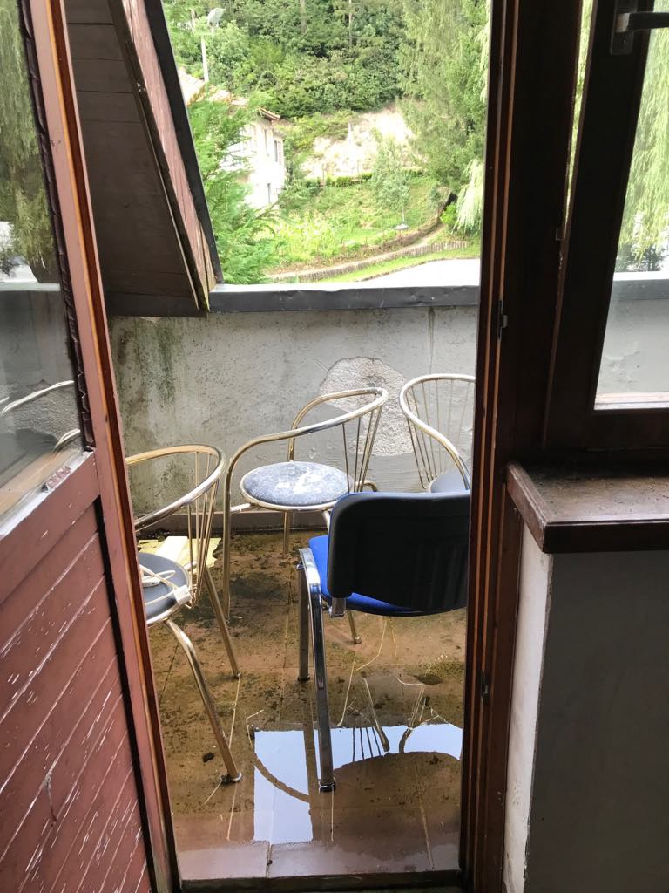
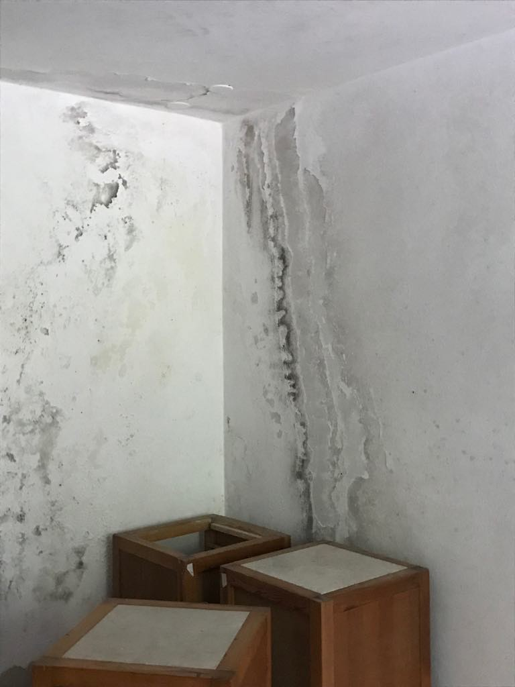
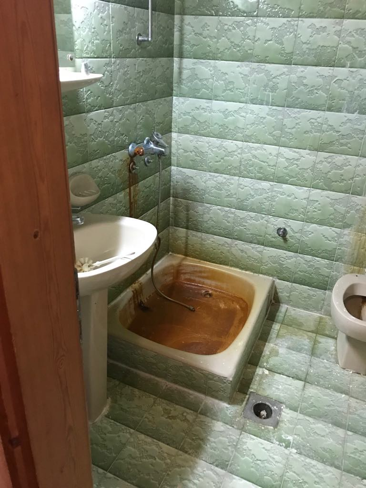
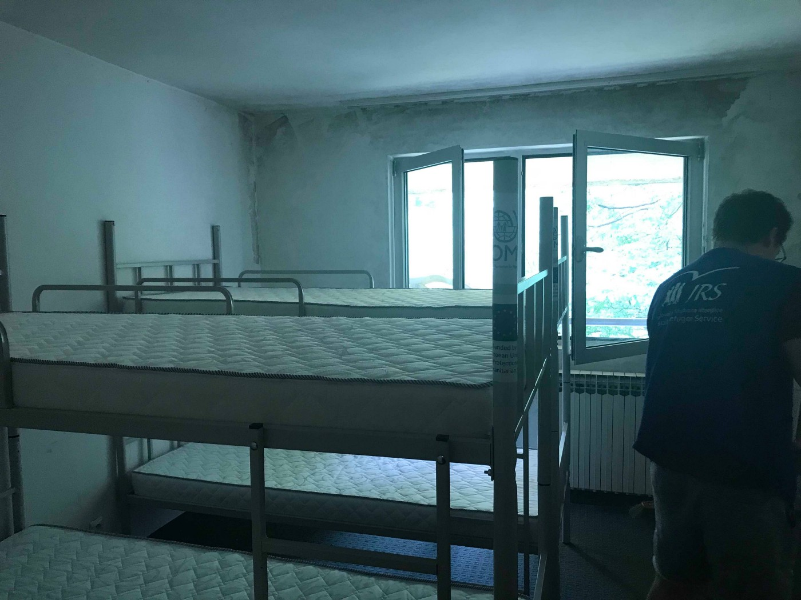
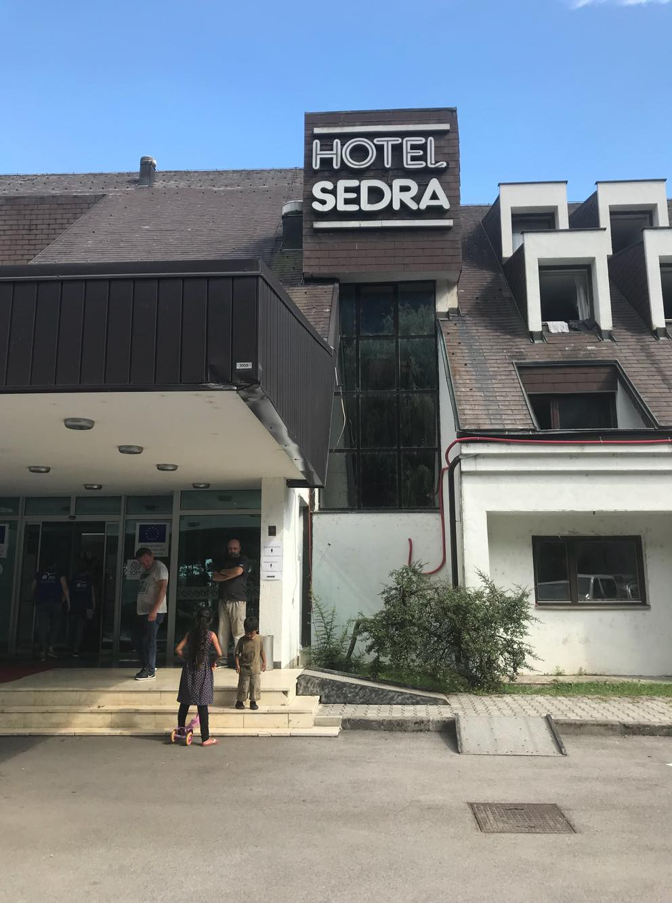
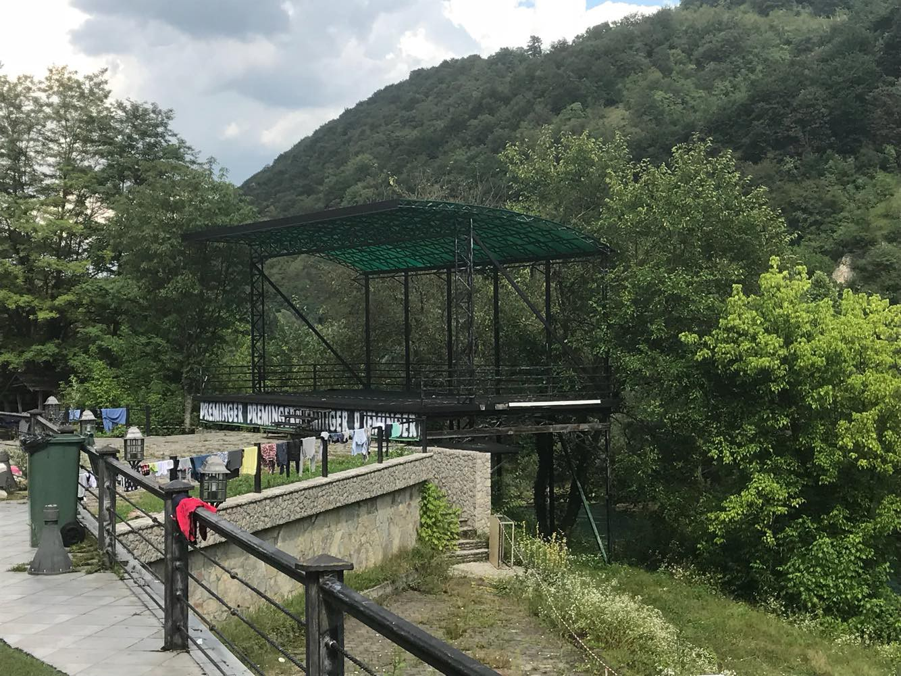

### AYS Daily Digest 02/08/18: 700 people die in Mediterranean in past six weeks alone

_Aid in Iraq slowing / LBC not letting anyone reach Europe since July 16 / Proactiva Open Arms rescues 87 people / More fences in Italy / EU Commission funding Morocco‘s anti\-immigration policies / And more news…_

 from July 12th, in the middle of the last six weeks](assets/71115406db99/1*1z6e_JiTHuG_06FetdqPeg.jpeg)

Photo by [MSF](https://twitter.com/MSF_Sea/status/1017346709662392320) from July 12th, in the middle of the last six weeks
### FEATURE: 700 die in Mediterranean in last six weeks alone

700 people have died on the Central Mediterranean route in the past six weeks, [MSF](https://twitter.com/MSF_Sea/status/1024892160997502976) has reported\.

700 men, women, and children\.

700 people who could have been saved if the EU could create an effective sea rescue mission\.

700 people on Italy’s conscience, Austria’s conscience, Sweden’s conscience, Belgium’s conscience, Greece’s conscience, Croatia’s conscience, Portugal’s conscience, Switzerland’s conscience, Serbia’s conscience, Germany’s conscience, Bulgaria’s conscience, Norway’s conscience, Hungary’s conscience, the UK’s conscience, and all other 36 countries’ consciences on the European continent\.

[**SOS Mediterranée**](https://twitter.com/MSF_Sea/status/1024892160997502976) **had to install a refrigerated shipping container in order to properly store the dead they are finding\.** People should never have to find their way to Europe when it’s too late via refrigerator\. Sea rescue needs to validated, supported, and actively encouraged now, Europe\.
### IRAQ

Important off\-the\-continent news for a minute:

In an [IRIN analysis](http://www.irinnews.org/analysis/2018/08/02/iraq-slips-headlines-humanitarians-worry-aid-donors-are-beginning-lose-interest) on slowing humanitarian aid in Iraq, it has been reported that a year after the liberation of Mosul millions of Iraqis are still dependent upon aid, yet donors are losing interest\. Due the the country’s recent increase in internally displaced persons \(IDPs\) returning home, some predictions about the results of existing aid programs have been too ambitious\. Aid agencies, such as Norwegian Refugee Council, are nervous about an ensuing “donor fatigue\.”

[Wendy Taeuber](http://www.irinnews.org/analysis/2018/08/02/iraq-slips-headlines-humanitarians-worry-aid-donors-are-beginning-lose-interest) , Iraq country director for the International Rescue Committee, states:

> “It is increasingly clear that the number of IDPs expected to return home in 2018 was unrealistic…Many displaced families are unable or unwilling to go back and will need support to integrate or settle elsewhere in the country\. Until a lasting solution to their displacement is possible, they will continue to need humanitarian assistance\.” 

### SYRIA

According to the Russian Foreign Minister, Russia, Jordan, and Turkey are in talks at the moment to discuss and implement the return of Syrian refugees\. As this story continues with more reliable coverage, AYS will be sure to continue in our reporting of the ensuing events\.
### LIBYA

[The Libyan Coast Guard \(LBC\)](https://www.independent.co.uk/news/world/africa/libya-refugee-crisis-europe-coastguard-migrants-a8474006.html) is saying that it intercepted a staggering 547 people on Monday in the Mediterranean\. There were three separate groups with a total of 388 men, 66 women, and 19 children\. It has been reported that they were given aid, but handed over to the anti\-immigration authorities in Tajoura and Tripoli\.

While the LBC is praising this as a rescue mission, Aloys Vimard, MSF project coordinator on board the Aquarius, reiterates that Libya cannot be considered a safe third country due to persistent gross human rights violations\. As AYS has reported before, these include modern slavery and sexual violence\.

Only 23% of people who left Libya made it to Europe in July, according to [a research fellow](https://twitter.com/emmevilla/status/1024930319986839553) for ISP, gathering data from IOM, UNHCR, and ISPI estimates\. That means 72% were caught and brought back to Libya and 5\.2% died or went missing at sea\. Yet since July 16th, 99\.5% of people were captured, no one made it to Europe, and the remaining 0\.5% died or went missing\.

[The LBC](https://twitter.com/emmevilla/status/1024930319986839553) is following through with Italy’s plan of deterrence, but at what cost? It is a very real, human cost — the increase of people in Libya’s detention centers facing horrible abuse and degrading conditions\.
### SEA

[The Aquarius](https://twitter.com/MSF_Sea/status/1024892061705744384) has been equipped to provide emergency care for 500 people\. The extra medical and food supplies are needed with the increased likelihood that the ship will be held from disembarking for several days by European governments\.

On Wednesday night, [Proactiva Open Arms](https://www.facebook.com/proactivaservice/posts/2000305913333583) rescued 87 people, including eight minors, who had been floating at sea for two days\. [The people](https://www.facebook.com/proactivaservice/photos/a.232810050083187.63417.111995985497928/2000693326628175/?type=3&theater) spent “more than 50 hours crammed onto a boat between spilled gasoline and other fluids\.”

](assets/71115406db99/1*J0gYtnskfXV_jbLCGEX6Bw.jpeg)

Photo by [Proactiva Open Arms](https://www.facebook.com/proactivaservice/posts/2000305913333583)

It has been one year since the [German ship Iuventa](https://www.facebook.com/JugendRettet/photos/a.418621685013737.1073741828.409016039307635/896289110580323/?type=3&theater) , was seized by the Italian authorities to prevent rescue missions at sea\. The team has been fighting in recent months to get their ship back to no avail\. They have not giving up as they [stand in solidarity](https://twitter.com/SEENOTRETTUNG/status/1025067890175827969) with the other crews of ships being held in Malta\. We cannot forget about [the Lifeline](https://twitter.com/SEENOTRETTUNG/status/1024874091323576320) , [SEAWATCH3](https://twitter.com/ErikMarquardt/status/1024973789619253248) , as well as too many others being blocked from saving lives\. [“Rescue can never be a crime\!”](https://www.facebook.com/SeebrueckeSchafftsichereHaefen/photos/a.640137809691739.1073741828.638992883139565/673269923045194/?type=3&theater)

Maydayterraneo is in urgent need of naval drivers and engineer officers\. You need to be enrolled for at least two months and can find more information [here](https://www.facebook.com/MAYDAYTERRANEO/photos/a.138427050039725.1073741828.131671990715231/298527404029688/?type=3&theater) \.
### GREECE

Human Rights Watch \(HRW\) has reported that children are being denied crucial medical care by being detained on the islands\. While authorities have the power to transfer sick children to the mainland for adequate care, many families have stated that this doesn’t end up happening\. In their interviews of six families trapped on the islands, HRW found that the Greek Government had repeatedly obstructed treatment\. Read the full report [here\.](https://www.hrw.org/news/2018/08/01/greece-sick-children-blocked-care)
#### Call for volunteers: medical personnel

A volunteer doctor on Samos is asking for more medical personnel to come volunteer alongside her on the island\. Find out more [here\.](https://www.facebook.com/humanaidgreece/posts/563534960708559)
#### Call for volunteer in Athens

“Our House” in Athens is looking for someone to help their volunteer Arash share food and clothes for one day only from 8–10pm\. Find out more information [here](https://www.facebook.com/groups/446386565554391/permalink/901531693373207/) \.
### ITALY

 \. To volunteer, look [here](https://www.facebook.com/KeshaNiyaProject/posts/703252030019667) \.](assets/71115406db99/1*j4h-CUTn3P0vioDLdNjzxg.jpeg)

Photo by [the Kesha Niya Project](https://www.facebook.com/KeshaNiyaProject/posts/703252030019667) \. To volunteer, look [here](https://www.facebook.com/KeshaNiyaProject/posts/703252030019667) \.

In an update on the city of Ventimiglia, [the Kesha Niya Project](https://www.facebook.com/KeshaNiyaProject/posts/703252030019667) reports that a fence has been built with the intention to push everyone living in the unofficial camp outside of the city to the Red Cross camp\. The Red Cross is past capacity and requires figure prints, making it hard to stay unregistered\.

The Project is only allowed to distribute next to the unofficial camp, so now people are having to walk 45 minutes in order to reach them\.

The police presence has increased as well, organizing weekly deportations to the south of Italy\. In the past week, deportations have happened daily\.

Domenico Luciano, mayor of Riace, has gone on a hunger strike against the Italian government’s negligence in funding the town’s efforts to provide for refugees\. Facing extreme debt, the economy of the town is at risk as well as people who will have to start living on the street\. In a statement he contested:

> “I protest against any form of racisim, facism, discrimination and exploitation, to defend the weakest people, the ones who don’t count, \(practically zero\), the category in which I proudly feel I belong\.” 

> Signed Domenico Luciano \(A Rebel Mayor\) 

[On Carso Triestino road](http://m.ilpiccolo.gelocal.it/trieste/cronaca/2018/08/02/news/la-porta-di-trieste-chiusa-ai-migranti-200-fermati-in-20-giorni-1.17116496) in Trieste, people have been rounded up daily since July 9th when the Ministry of Interior ordered intense patrolling measures along the Slovenian border\. 200 migrants have been intercepted so far and four drivers have been arrested\. Of these persons, 30 have been sent back to Slovenia and 13 have been expelled\.

[40 migrants](http://www.ansamed.info/ansamed/it/notizie/rubriche/cronaca/2018/08/02/migranti-nuova-tratta-velieri-da-turchia-in-40-a-siracusa_fd5dd660-751d-490a-9eaf-4d330ae4c5e0.html) were intercepted on Thursday walking on the road between Fontane Bianche and Avola\. They landed the same day and patrol boats are looking for their possible vessel\. A huge increase in sailing boats have been coming from Turkey to the area\. The route has seen an increase in use by smugglers\.

A new report from the Social Change Initiative states that 72% of Italians believe in the principle of asylum and that people should be able to take refuge in other countries and Italy\. The majority of citizens want to be welcoming\. See the full report [here\.](https://www.thesocialchangeinitiative.org/new-research-on-attitudes-towards-migrants-refugees-and-national-identity-in-italy/)
### BULGARIA

When Bordermonitoring\.eu visited Bulgaria in July, they were again denied access to the state\-run open and closed camps\. They report that the refugee center in Pastrogor will probably turn into a closed camp soon\. The “zero integration” policy continues\. Find out more [here](http://bulgaria.bordermonitoring.eu/2018/08/02/status-quo-in-bulgarias-refugee-centers/) \.
### BOSNIA & HERZEGOVINA

The IOM is in charge of the newly formed camps, and one of them is in hotel Sedra, close to Bihac\. A former hotel, it was turned into a camp hosting about 100 people at the moment, only families\. 40 additional people are soon to be brought in and this complex’s capacity will be reached\.

Peter Van der Auweraert, head of the IOM in Bosnia, tweeted about this place:

■■■■■■■■■■■■■■ 
> **[Peter Van der Auweraert](https://twitter.com/PeterAuweraert) @ Twitter Says:** 

> > In #Bihac #Bosnia where @[UNmigration](https://twitter.com/UNmigration) and @[unhcr](https://twitter.com/unhcr) teams are organising transfer of more #migrants #refugees families to safe and dignified accommodation in Cedra #humanitarian #proud https://t.co/A35veZIIb0 

> **Tweeted at [2018-08-02 08:17:29](https://twitter.com/peterauweraert/status/1024932181729333249).** 

■■■■■■■■■■■■■■ 

People who are living inside sent us a bit different picture:

### CROATIA

The Ministry of Interior is looking to make amendments to the Rulebook on Stay at a Reception Center for Aliens which would let authorities decide on the visitor’s “inclination to misbehave,” leaving it up to any interpretation\. This proposal would put heavy limitations on people in detention without concern for legality\. Read more [here](https://www.cms.hr/hr/azil-i-integracijske-politike/izmjene-pravilnika-o-boravku-u-prihvatnim-centrima-za-strance-novo-ogranicavanje-prava-izbjeglica-i-stranaca) \.
### FRANCE

Anyone new to living in Paris would find the Welcome Map very useful\. Please pass [this](http://www.welcomemap.fr/) along\.

On Wednesday, the French senate voted to change the amount of time someone can request asylum from 11 months to six months, while increase the amount of time of one can be detained before deportation\. Learn more [here](https://www.aljazeera.com/news/2018/08/france-cuts-period-refugees-asylum-bid-180801184623901.html) \.

For the first time in 20 months, Solidarité migrants Wilson did not serve breakfast in Paris on Wednesday morning as it was the first of August\. They decided to stop their activities until September to show how little the government is doing to help provide for refugees and because they were overwhelmed\. Read more [here](https://www.facebook.com/permalink.php?story_fbid=954245748109531&id=598228360377940&hc_location=ufi) \.
### UK

[Here](https://petition.parliament.uk/petitions/218729) is a petition calling for amnesty for “illegal migrants” who have been in the UK for 10 years or more\. They need 100,000 signatures and are only about halfway there\.
### EU

[The EU Commission](https://euobserver.com/migration/142504) has come forward to say that Libya is unfit under international law for rescued migrants to be disembarked in their ports\. This comes after a ship from Italy docked 100 people near Tripoli\. An investigation is underway to figure out the circumstances of the Italian ship, first brought to light by Oscar Camps, the founder of Proactiva Open Arms\. The commission is continuing to get countries on the Mediterranean to cooperate on rescue missions\.

Yet at the same time, [the EU Commission](https://euobserver.com/migration/142511) is funding Morocco to curve people trying to reach Spain\. The Commission has taken note that the North African country needs more financial assistance in the matter\.

> **We strive to echo correct news from the ground through collaboration and fairness\.** 

> **Every effort has been made to credit organizations and individuals with regard to the supply of information, video, and photo material \(in cases where the source wanted to be accredited\) \. Please notify us regarding corrections\.** 

> **If there’s anything you want to share or comment, contact us through Facebook or write to: areyousyrious@gmail\.com** 

_Converted [Medium Post](https://medium.com/are-you-syrious/ays-daily-digest-02-08-18-700-people-died-in-the-med-just-in-the-past-6-weeks-71115406db99) by [ZMediumToMarkdown](https://github.com/ZhgChgLi/ZMediumToMarkdown)._
