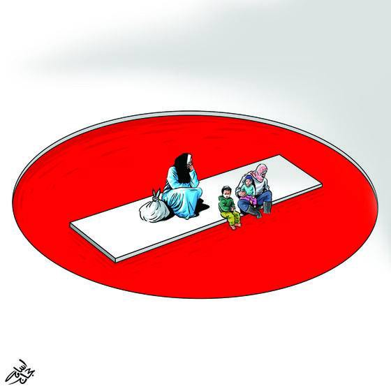
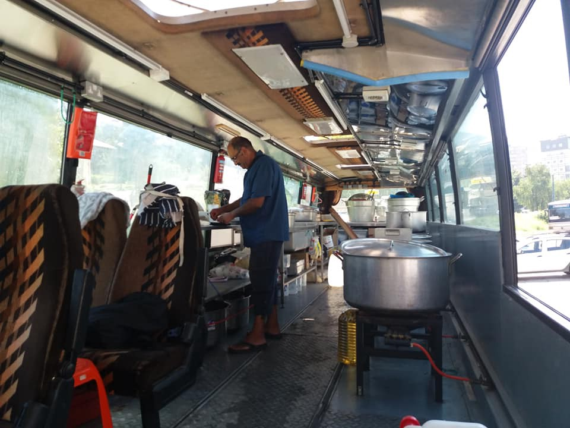
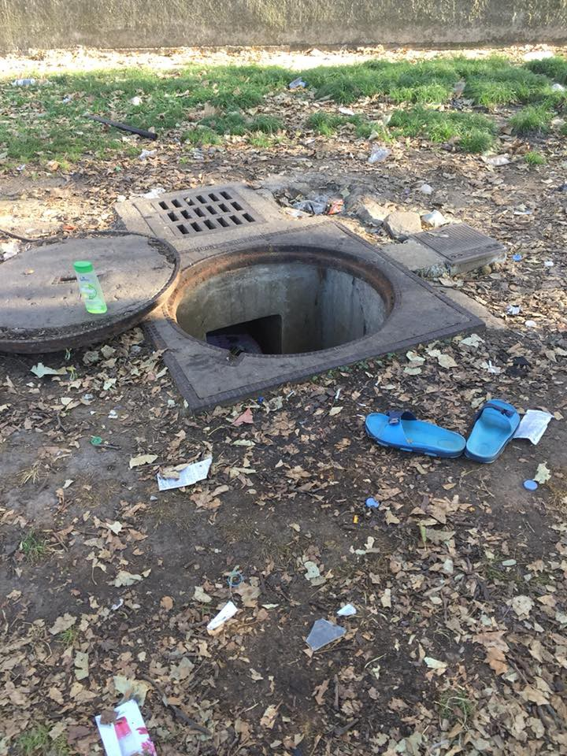
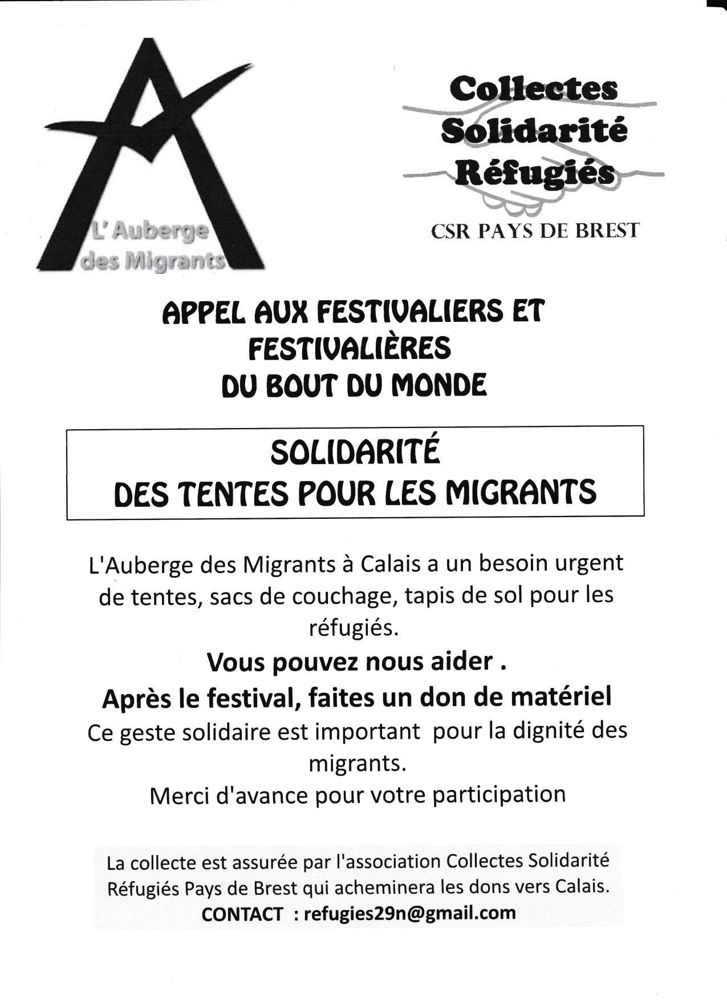

### AYS Daily Digest 05/08/18: Four Migrant Labourers Die in Crash in Italy

_Rescues at sea // Update from Lesvos // Help needed in Belgrade // Border Patrols in Germany // Day of Protest on Malta // Public showers closed in Paris // and more…_

Illustration Credit: Osama Hajjaj
#### Feature — Fatal Crash in Apulia

Italian volunteer Sandra Uselli reported that yesterday at about 3pm, a tomato truck carrying 8 migrant workers crashed on the Provincial Road SP 105 between Ascoli Satriano and Castelluccio dei Sauri \(Apulia region\) \. Four people died in the crash, including two young men from Guinea Bissau\. Another 5 were critically injured\. Some of the injured are in critical condition and currently receiving treatment at the Riunti hospital in Foggia\.

This incident did not happen in a vacuum\. The people in the truck were being taken back from the countryside, where they were working as farmhands\. An estimated 80% of migrant and refugee workers in Italy work manual labor jobs, which typically pay little and often include great physical risks\. With almost no workplace protections, the environment is ripe for exploitation and abuse\. We are left with results like these: more needless deaths, caused by greed and neglect\.
### Sea

The Spanish Coast Guard rescued approximately 400 people this weekend\. On Sunday Spanish rescue group SMH rescued 215 people\.

Spanish journalist and human rights activist Helena Maleno Garzon reported today that there was a boat in the Alboran sea carrying 36 people that is still missing\. Moroccan authorities intercepted and forcibly returned people aboard two boats today, the first carrying 59 people and the second 43\.
### Greece
#### Islands

[Attika Human Support](https://www.facebook.com/AttikaHumanSupport/posts/664179243937734) , an organization that helps to fundraise for volunteer groups posted a list of needs and places to donate to on Lesvos\. You can access it [here\.](https://www.facebook.com/AttikaHumanSupport/posts/664179243937734)

The Moria refugee camp on the island has been declared by various human rights groups, including Human Rights Watch, as among the worst detention centers in Europe\. Currently in Moria there are 8,000 people living in a space built for 3,000\. There is one toilet per 72 people, and one shower per 84\.
#### Mainland

The Mobile Info Team for Refugees in Greece has published an updated list of people who are eligible for family reunification flights, since the official records are very difficult to use and often outdated\. You can access their list [here](https://www.facebook.com/mobileinfoteam/photos/a.1800063030222418.1073741830.1796286800600041/2241644919397558/?type=3&theater) \.

The Pampiraiki Warehouse at Elliniko near Athens will be closed from Friday 10 August to Monday 20 August\. It will re\-open again on Tuesday 21 August\.
### Serbia

[No Name Kitchen](http://www.nonamekitchen.org/en/looking-back/) provided an [update](http://www.nonamekitchen.org/en/looking-back/) today, and a thank you to their supporters\. They are still serving hot meals and doing everything they can to support refugees in Belgrade, as well as continuing their new kitchens in Rome and Velika Kladusa\.

> A long time has gone by since the beginning of the No Name Kitchen in the Barracks in Belgrade, right behind the train station of the Serbian capital, in February 2017\. Almost a thousand young people occupied those abandoned buildings, while waiting for the opportunity to continue their migratory route towards different European countries\. 

> Since that cold February, the No Name Kitchen has worked together with people on the move, trying to be something more than a kitchen that cooked 400 meals a night, distributed wood, a generator to charge phones… We wanted to be an empowerment project with a safe meeting place where we could share experiences, stories, laughs, tears and wishes\. We got rid of the paternalist charity, exercised from above, to try to build a solidarity project among equals\. 

> A year and a half later today, thousands of volunteers and migrants have built the No Name Kitchen as a living organization that adapts to the new realities that show up\. That’s why we are not only in Šid \(Serbia\), but also in the Baobab Camp in Rome and in Velika Kladusa \(Bosnia\) \. Wherever we are, we are always working with the same spirit of solidarity, building the necessary spaces of trust, joy and empowerment with the people who suffer from racist European politics\. 

### Bosnia

](assets/b1829975fe79/1*t80dt1td9YeyECPTVVhF9A.jpeg)

A family attempts a border crossing in Bosnia\. Photo Credit: [Gabriel Tizon](http://gabrieltizon.com)

Ghafoor Hussain, a grandfather from the UK, converted a bus into a mobile kitchen in 2015\. For the past three years he has been traveling across Europe cooking hot meals for thousands of people on the move\. Now Ghafoor has taken his bus to Bosnia, where a team of volunteers are serving food at the Sarajevo train station twice a day\. You can learn more and support the project, called Aid Brigade, [here](https://www.facebook.com/AidBrigade-1782598635182451/?hc_ref=ARRY-lS9c9yYfEcZIsxu-_clorPlGNT513mZEib1vxXjnlaGIdSfhjnXWiok2v9yJrk&hc_location=group) \.

Ghafoor prepping a meal in his kitchen\-bus\. Photo Credit: AidBrigade
### Germany

The German interior ministry has announced that patrols on the borders with France and Switzerland will be increased\. The ministry fears that the people will make their way to the Benelux countries and other regions further north\. People on the move should be aware that random checks and controls could be increased along these borders\.
### Malta

The Sea\-Eye rescue organization held a day of protest on Malta, part of the same “Orange Day” movement that is happening across Germany\. The group released a short video for Orange Day, which you can watch [here](https://www.facebook.com/seaeyeorg/videos/1523066954465863/) \. Sea\-Watch wrote today, “as EU values keep drowning in the Central Mediterranean Sea, its up to us, the civil society, to prevent a total relapse into barbarism and to [\#defendeurope](https://www.facebook.com/hashtag/defendeurope?hc_location=ufi) \. Thanks and solidarity from Malta to all our friends who took the streets yesterday on [\#DayOrange](https://www.facebook.com/hashtag/dayorange?hc_location=ufi) \!”
### France

In yet another act of inhumanity, Parisian municipal authorites closed the municipal shower facilities this week that many refugees in the capital use\. This move comes right on the heels of wide\-spread shutdowns of public drinking fountains last month\. Not only has the government of Macron utterly failed in its promise to “get all refugees off the streets by 2018,” they cannot even provide people with safe drinking water or showers\. An independent volunteer posted a photo of what one young man resorted to doing just to get clean:

Photo Credit: Sarah Fenby\-Dixon\. “Just to clarify the actual picture…\.see the flip flops? and the bottle of shampoo? A young man is down a drain trying to get clean\. YES a drain \! It is unsafe and dangerous but he has no choice\.”

![Photo Credit: Sarah Fenby Dixon\. “At Porte d’Aubervilliers there were maybe 300 people last night, including about 20 young children and pregnant women\. The children were playing amongst the rubbish next to an extremely busy road\. Heartbreaking to see and a tragedy waiting to happen\. 
It is 35C and the showers are closed\. I found refugees showering in a water mains pipe underground\. Others found a water pipe provided by a local group and stood and tried to wash in a side street near the road\. They laughed and joked about this but where is the dignity and the humanity?”](assets/b1829975fe79/1*A6LG96Gcdzsz6TMe9spyyw.jpeg)

Photo Credit: Sarah Fenby Dixon\. “At Porte d’Aubervilliers there were maybe 300 people last night, including about 20 young children and pregnant women\. The children were playing amongst the rubbish next to an extremely busy road\. Heartbreaking to see and a tragedy waiting to happen\. 
It is 35C and the showers are closed\. I found refugees showering in a water mains pipe underground\. Others found a water pipe provided by a local group and stood and tried to wash in a side street near the road\. They laughed and joked about this but where is the dignity and the humanity?”

The group Solidarity Migrants Wilson has put out a call for hygiene donations\. There is a desperate need for them this week following forced evictions at the La Chapelle metro staton\. French police frequently confiscate and destroy all refugees possession’s during these evictions, so sadly the need for donations is continuous\. You can drop off items every Tuesday and Saturday in front of the breakfast room, \(56 Boulevard Ney, Paris 18\), from 10am to 11pm\. Find out more and contact the group [here](https://www.facebook.com/permalink.php?story_fbid=957819277752178&id=598228360377940) \.

 \.](assets/b1829975fe79/1*wO08mhW-Y1RVDOeKcwiaSA.jpeg)

Photo Credit: [Calais Refugee Aid](https://www.facebook.com/CalaisRefugeeAid/?hc_ref=ARQCNM8fe5E2OAAbHq9koXKPlGw_hCPglvttL8amGD2-_9Ke5tHNDMIdlib-447v0q4&fref=nf) \.

The cycle of police brutality and forced evictions continues in Calais\. Volunteers in the region report that authorities continue to cruelly use food distribution times to destroy refugees’ tents while they are away\. Volunteers in Northern France [described](https://www.facebook.com/CalaisRefugeeAid/posts/1815857615146429) the situation:

> “Imagine that every morning, when you’ve walked three miles to get your breakfast, that the riot police stand between you and the food van\. You know if you try to go past the police they will threaten you and if you do not back off, they will spray tear gas in your face and beat you with their batons\. So you walk three miles ‘home’, to your tent, and discover while you’ve been away a different set of riot police have destroyed or taken your home and your sleeping bag\. This is part of the reality faced by refugees every day\.” 

To support volunteers in Calais, or find areas to drop off donations in the UK, click [here](https://www.facebook.com/CalaisRefugeeAid/posts/1815857615146429) \.

**We strive to echo correct news from the ground through collaboration and fairness\.**

**Every effort has been made to credit organizations and individuals with regard to the supply of information, video, and photo material \(in cases where the source wanted to be accredited\) \. Please notify us regarding corrections\.**

**If there’s anything you want to share or comment, contact us through Facebook or write to: areyousyrious@gmail\.com**

_Converted [Medium Post](https://medium.com/are-you-syrious/ays-daily-digest-05-08-18-four-migrant-labourers-die-in-crash-in-italy-b1829975fe79) by [ZMediumToMarkdown](https://github.com/ZhgChgLi/ZMediumToMarkdown)._
