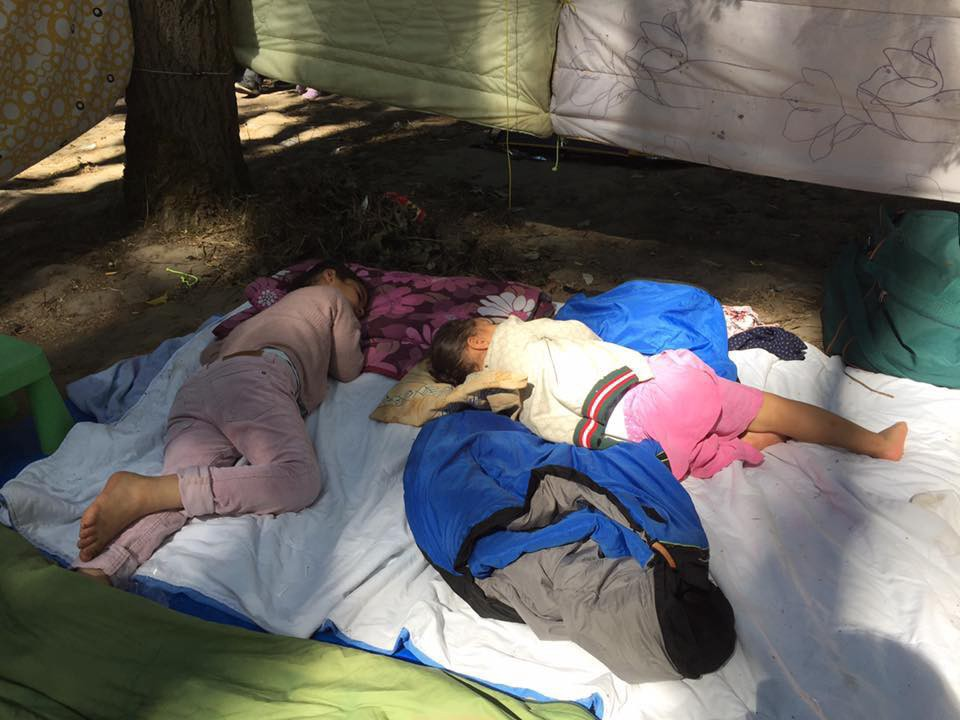

### AYS Daily Digest 06/08/2018 Afghan deportations in Germany: what you need to know

_As well as an Uighur man’s deportation from Germany / Italy gifting the LBC with 12 ships / language resources for refugees in France / protecting volunteers and NGOs in the EU / right to work for asylum seekers in the UK / and more news…_
### Feature

[European Citizens Against Deportation to Afghanistan](https://www.facebook.com/ecada2017/posts/2124733604409301) has sent out a warning that Afghans can be deported no matter the circumstances if their asylum claims have been rejected in Germany\. It does not matter if they have a job, speak German, or have generally integrated well\. The government is trying to deport people to Kubul every month, and it doesn’t matter what their grounds for asylum are\.

They want people to know:

> ⚠️ “If you belong to that group of 16,000 Afghans obliged to leave the country, please seek legal advice immediately\.” 

> ⚠️ “Also remember that police is most likely to pick you up at home or at work\.” 

Afghanistan is still one of the most dangerous places on Earth\. The Taliban has rejected offers of peace and ceasefires while continuing their almost daily attacks\. Germany and all other countries need to take refugees from Afghanistan seriously and provide them asylum\.

](assets/c006f3b20843/1*tllCBikqb6jKgUnzeCWjdg.jpeg)

Destruction from a bomb and gun attack on a Shia mosque where dozens were killed on August 3rd\. An example of weekly headline in Afghanistan\. Photo by [Farid Zahir/AFP](https://www.aljazeera.com/news/2018/08/suicide-bombers-target-shia-mosque-eastern-afghanistan-180803104926634.html)
### **Libya**

[The Italian Parliament](https://www.thetimes.co.uk/article/italy-gifts-migrant-rescue-boats-to-libya-coastguard-jf2vtqqdd) decided yesterday to gift the Libyan Coast guard 12 new patrol boats\. They boats will be run by EU trained personnel from Libya\. [Proactiva Open Arms](https://twitter.com/openarms_it/status/1026359248257736704) , as well as other sea rescue missions and human rights NGOs, have said this is a horrible decision to fund Libya and their modern slavery\.

Libya continues to be the main transit country for people to try and reach Europe, according to [the latest UNHCR figures](https://reliefweb.int/sites/reliefweb.int/files/resources/65050.pdf) \. As of the July 31st 2018, the Libyan Coast Guard intercepted 12,633 people along the Libyan Coast\. They brought back 2,167 persons in July, 3,453 in June, and 1,756 in May\. 97 bodies have been found in all of 2018\.
### **Sea**

[The Aquarius](http://news.trust.org/item/20180805183708-xujib/) has made it clear that moving forward, they will not wait for orders from Libya or any other coastguards; if they see people in distress they won’t let them die at Sea\. They are starting to patrol 25–30 miles from the Libyan coast, which is still in the rescue area but not in Libyan territorial waters\. They also refuse to take people back to Libya, as it cannot be considered a safe country\.

Salvamento Maritimo reported several rescues on Monday\. First the rescue boat [Salvama Alpha](https://twitter.com/salvamentogob/status/1026398064226066433) Persei picked up 7 men outside of Alicante on Monday morning\. They are being transferred to Benidorm\.

](assets/c006f3b20843/1*abywXuy4-PpiUy3y2ZAoLw.jpeg)

Photo By [Salvamento Maritimo](https://twitter.com/salvamentogob/status/1026435854217162752)

The rescue boat [Marina Spica](https://twitter.com/salvamentogob/status/1026437652894150657) rescued 35 people \(including 4 women and 1 baby\) and then 56 people\(including 8 women and 1 baby\) \. They moved the 91 persons the port of Almería\.

The rescue boat [Guardamar Caliope](https://twitter.com/salvamentogob/status/1026505179137548289) rescued 34 people in the Alboran sea, who were located by the plane Semar 101\. They were moved to Malaga\.

Lastly, [Patrol Guardia Civil](https://twitter.com/salvamentogob/status/1026542869203410949) rescued 16 people, taken to Almeria\. Guardamar Polyhymnia has also taken 32 people \(including 6 women and 1 child\) to Alboran Island\.

[Proactivia Open Arms](https://www.facebook.com/proactivaservice/videos/2007299702634204/) reports that the 87 people they rescued on Thursday are still waiting onboard at Sea with no place to port\. They were at sea for over 24 hours before being rescued and fleeing the prisons of Libya\. How much longer will they have to wait?

](assets/c006f3b20843/1*kjx0r2aRIXtdYfGSRgoiwQ.jpeg)

Photo by [Proactiva Open Arms](https://www.facebook.com/proactivaservice/photos/a.232810050083187.63417.111995985497928/2007582789272562/?type=3&theater)
### **Greece**

We have to remember that even though new arrivals to Greece are not in the news anymore, they are still coming in significant numbers\. [In 2018](https://twitter.com/smarta12345/status/1026397359096377344) , there has been a monthly average of 2,300 people arriving by sea and 1,500 arriving by land\. More than 26,000 people have arrived in total so far in 2018\.

Aegean Boat Reports states that a boat landed on [Lesvos](https://twitter.com/BoatAegean/status/1026378890804191232) early on Monday\. Number of persons remains unknown\. They also report that 30 people were transferred to the port on [Samos](https://twitter.com/BoatAegean/status/1026367073327480833) early Monday morning\.

One Happy Family Community Center on Lesvos is working hard trying to clean up their grounds and create a space where everyone can feel welcomed\. Want to learn more about how you can help, look [here](https://www.facebook.com/OHFLesvos/posts/506296973147530) \.

In Athens, about 50 people have been protesting for 8 days outside of UNHCR’s office\. They have not been given any cash cards and have been left with no way to feed themselves and their children\. Our House is asking for journalists to contact them in order to help report on this major issue\. Find out more [here](https://www.facebook.com/groups/446386565554391/permalink/905579612968415/) \.

There is a job open to refugees and asylum seekers as a Web Developer 
which would be remote and part\-time\.

> “This position is open to candidates interested in working with Safe Place International to develop our website and online presence\. Applicants should be able to start immediately, with a focus on developing online fundraising and crowdfunding platforms\.” 

> “Please send your resume or CV, along with a cover letter written in English, to [info@safeplaceinternational\.org](mailto:info@safeplaceinternational.org) ” 

### **Italy**

[Protests](https://www.facebook.com/Assemblea17dicembre/posts/690650697934458) happened Monday morning at Piazza Dante for accommodation for 7 underage boys who were forced out of reception\. They have been forced to live on the streets while being told to be patient again and again\. Protestors sat in a “beach scene” to remind the officials of their view towards all of the drownings at sea\.
### **Spain**

Around [300 Lawyers in Málaga](https://www.eldiario.es/desalambre/Formacion-especifica-mensajes-Whatsapp-malaguenos_0_798271025.html) work in rotations to provide legal services for people arriving by boats and rescue missions\. The system set in place is working better at addressing the needs of Spain’s doubled new arrivals in 2018\. The Cádiz Bar Association intends to replicate their organization, which is based on two pillars: first, de\-institutionalized operation allowing for more flexibility and second, adequately training lawyers to help in identify human trafficking victims\.

In the port of Motril, [the Red Cross](https://twitter.com/FeiGar/status/1026212569617448961) served 291 people who have arrived in the last 24 hours\. 189 of them were rescued by Salvamento Maritimo\.

](assets/c006f3b20843/1*worrrPO4ywFi3lFkoeVtPQ.jpeg)

Photo by [Alba Feixas](https://twitter.com/FeiGar/status/1026212569617448961)
### **Germany**

A man belonging to the [Uighurs minority](https://www.zeit.de/gesellschaft/zeitgeschehen/2018-08/bayern-uiguren-china-abschiebung-auslaenderbehoerde-versehen) in China was deported even though he had an ongoing asylum case\. In fact, he was sent back just a few hours before his appointment to justify his case in person, a continued trend for Germany’s Interior Ministry\. The Federal Immigration Office in Munich claims they did not receive the fax concerning the appointment and regret the deportation\.

The man has not been heard from since arriving in Beijing and there is free that he might have been arrested upon arrival\. Uighurs are a religious minority in China and are often persecuted, even put into labor camps\.

[Germany](http://www.infomigrants.net/en/post/11089/germany-considers-tough-response-to-spain-migration-surge?ref=tw) is looking to attempt tighter border controls for the French and Swiss borders\. This is in scare of the increased arrivals coming to Spain and not wanting a repeat of 2015\. Officials have said that they are ready to supply support to Spain if need be\.
### **France**

Bienvenue chez toi has shared a new refugee vocabulary booklet\! It has over a thousand words and expressions in French, farsi, Arabic, and English\. [Here](https://drive.google.com/file/d/0B9N4FSiSGtHaVU8yemRLQ09XNk82WlQxMEhITFU3X2VWclZV/view) is the PDF version, which is useable on smartphones\.

Bras Not Bombs is having an emergency fundraiser\! In Dunkirk, women are in desperate need of underwear, toiletries, and wipes\. Please find out how you can help [here\.](https://www.facebook.com/groups/1086525351391860/permalink/1990043444373375/)

Pictures of Dunkirk from three years ago and now\. Nothing has really changed, horrible conditions remain a constant\. Please consider helping [Mobile Refugee Support](https://www.facebook.com/calaisaction/posts/2100871366632024) \.

![Photos by [Calais Action](http://Germany A man belonging to the Uighurs minority in China was deported even though he had an ongoing asylum case. In fact, he was sent back just a few hours before his appointment to justify his case in person, a continued trend for Germany’s Interior Ministry.  The Federal Immigration Office in Munich claims they did not receive the fax concerning the appointment and regret the deportation. The man has not been heard from since arriving in Bejing and there is free that he might have been arrested upon arrival. Uighurs are a religious minority in China and are often persecuted, even put into labor camps.    Germany is looking to attempt tighter border controls for the French and Swiss borders. This is in scare of the increased arrivals coming to Spain and not wanting a repeat of 2015. Officials have said that they are ready to supply support to Spain if need be.   France  Bienvenue chez toi has shared a new refugee vocabulary booklet! It has over a thousand words and expressions in French, farsi, Arabic, and English. Here is the PDF version, which is useable on smartphones.   Bras Not Bombs is having an emergency fundraiser! In Dunkirk, women are in desperate need of underwear, toiletries, and wipes. Please find out how you can help here.   Pictures of Dunkirk from three years ago and now. Nothing has really changed, horrible conditions remain a constant. Please consider helping Mobile Refugee Support.   In Paris People to People Solidarity is also in huge need of clothes for their locker room. They do not have enough supplies to cloth the new arrivals every week. Find out what you can do here.   A helpful list of French course below offered in Paris.  https://www.facebook.com/baam.asso/photos/a.447233908801813.1073741832.441512719373932/883714765153723/?type=3&theater  Solidarité migrants Wilson has been busy making hygiene kits for refugees in Paris. They need your help in donating as well as organizing. Find out more here.    EU There is a petition to protect volunteers and aid workers helping refugees from being prosecuted themselves. We cannot criminalize humanitarianism. Sign here.   Asylum applications in the EU have been remaining stable, according to analyses from the European Asylum Support Office (EASO). In the first half of 2018, 301,390 applications were submitted. Yet that is a 15% decrease from the second half of 2017.    UK Asylum seekers in the UK have been prohibited from working. Help Refugees and Refugee Action call for an effective asylum procedure that eliminates this barrier creating poverty. Find out how you can write to your MP today, here.)](assets/c006f3b20843/1*4QK_yqaMkrigkeK1Kgj6Ng.jpeg)

Photos by [Calais Action](http://Germany A man belonging to the Uighurs minority in China was deported even though he had an ongoing asylum case. In fact, he was sent back just a few hours before his appointment to justify his case in person, a continued trend for Germany’s Interior Ministry.  The Federal Immigration Office in Munich claims they did not receive the fax concerning the appointment and regret the deportation. The man has not been heard from since arriving in Bejing and there is free that he might have been arrested upon arrival. Uighurs are a religious minority in China and are often persecuted, even put into labor camps.    Germany is looking to attempt tighter border controls for the French and Swiss borders. This is in scare of the increased arrivals coming to Spain and not wanting a repeat of 2015. Officials have said that they are ready to supply support to Spain if need be.   France  Bienvenue chez toi has shared a new refugee vocabulary booklet! It has over a thousand words and expressions in French, farsi, Arabic, and English. Here is the PDF version, which is useable on smartphones.   Bras Not Bombs is having an emergency fundraiser! In Dunkirk, women are in desperate need of underwear, toiletries, and wipes. Please find out how you can help here.   Pictures of Dunkirk from three years ago and now. Nothing has really changed, horrible conditions remain a constant. Please consider helping Mobile Refugee Support.   In Paris People to People Solidarity is also in huge need of clothes for their locker room. They do not have enough supplies to cloth the new arrivals every week. Find out what you can do here.   A helpful list of French course below offered in Paris.  https://www.facebook.com/baam.asso/photos/a.447233908801813.1073741832.441512719373932/883714765153723/?type=3&theater  Solidarité migrants Wilson has been busy making hygiene kits for refugees in Paris. They need your help in donating as well as organizing. Find out more here.    EU There is a petition to protect volunteers and aid workers helping refugees from being prosecuted themselves. We cannot criminalize humanitarianism. Sign here.   Asylum applications in the EU have been remaining stable, according to analyses from the European Asylum Support Office (EASO). In the first half of 2018, 301,390 applications were submitted. Yet that is a 15% decrease from the second half of 2017.    UK Asylum seekers in the UK have been prohibited from working. Help Refugees and Refugee Action call for an effective asylum procedure that eliminates this barrier creating poverty. Find out how you can write to your MP today, here.)

In Paris People to People Solidarity is also in huge need of clothes for their locker room\. They do not have enough supplies to cloth the new arrivals every week\. Find out what you can do [here](https://www.facebook.com/groups/P2PParis/permalink/1810380839048782/) \.

A helpful list of French course below offered in Paris\.

Solidarité migrants Wilson has been busy making hygiene kits for refugees in Paris\. They need your help in donating as well as organizing\. Find out more [here](https://www.facebook.com/permalink.php?story_fbid=958813714319401&id=598228360377940) \.
### **EU**

There is a petition to protect volunteers and aid workers helping refugees from being prosecuted themselves\. We cannot criminalize humanitarianism\. Sign [here](https://www.weareawelcomingeurope.eu/) \.

Asylum applications in the EU have been remaining stable, according to analyses from the [European Asylum Support Office \(EASO\)](https://www.easo.europa.eu/news-events/number-asylum-applications-lodged-eu-early-summer-remains-stable) \. In the first half of 2018, 301,390 applications were submitted\. Yet that is a 15% decrease from the second half of 2017\.
### **UK**

Asylum seekers in the UK have been prohibited from working\. Help Refugees and Refugee Action call for an effective asylum procedure that eliminates this barrier creating poverty\. Find out how you can write to your MP today, [here](https://helprefugees.org/news/stand-up-for-asylum/) \.

> **We strive to echo correct news from the ground through collaboration and fairness\.** 

> **Every effort has been made to credit organizations and individuals with regard to the supply of information, video, and photo material \(in cases where the source wanted to be accredited\) \. Please notify us regarding corrections\.** 

> **If there’s anything you want to share or comment, contact us through Facebook or write to: areyousyrious@gmail\.com** 

_Converted [Medium Post](https://medium.com/are-you-syrious/ays-daily-digest-06-08-2018-afghan-deportations-in-germany-what-you-need-to-know-c006f3b20843) by [ZMediumToMarkdown](https://github.com/ZhgChgLi/ZMediumToMarkdown)._
