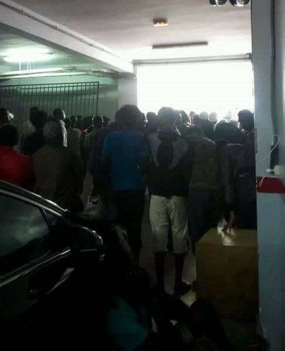
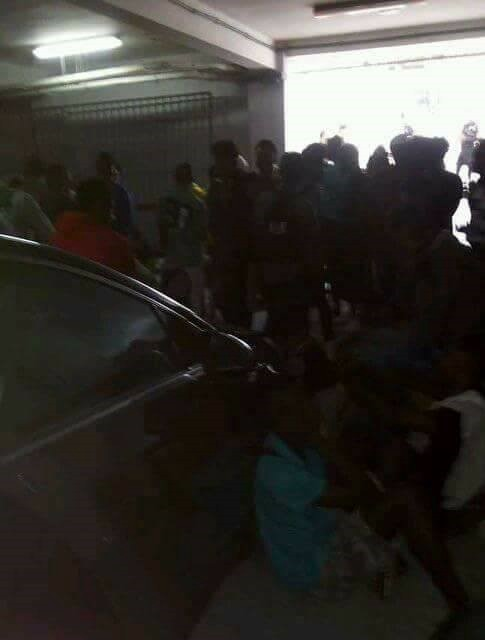
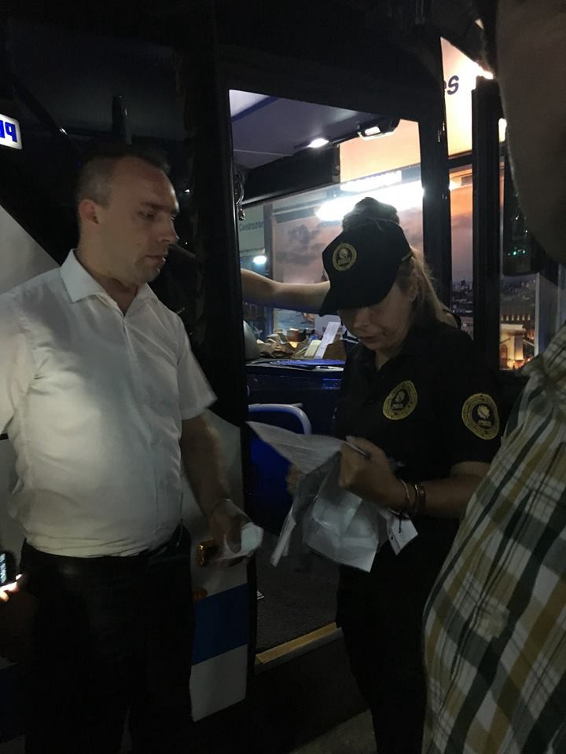
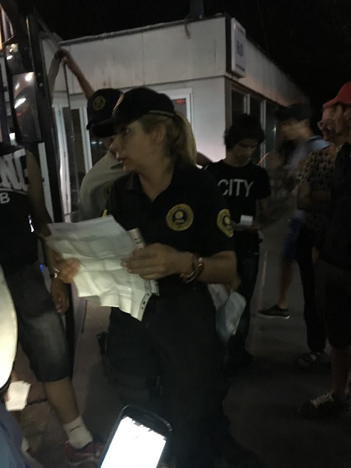

### AYS Daily Digest 09/08/2018 Devastating police raids in Morocco, following in Libya’s EU funding footsteps?

_Russia’s plans to return Syrians / Drowning off Turkish coast / Open Arms allowed to disembark in Spain / Volunteer oppression in Bosnia and France / New legal assistance law in Hungary / And more news…_

 
“Why do you want me to take a picture of you?”
“To exist\.”](assets/afd07d2f35ff/1*foRMWToLK5A61k60Wz-kwQ.jpeg)

Photo by [Gabriel Tizon](https://www.facebook.com/gabrieltizonfotografo/photos/a.213760148669815.51627.213743695338127/1845117385534075/?type=3&theater&ifg=1) 
“Why do you want me to take a picture of you?”
“To exist\.”
### **FEATURE**

We received information of several devastating police raids which happened on Thursday in both Tangier and Nador\.

 \)](assets/afd07d2f35ff/1*ruCVUZzNFJbaM8CfrDMODw.jpeg)

Early morning police raids in Tangier\. \(Photo by [Association Marocaine des Droits Humains \-Section Nador](https://www.facebook.com/AmdhNador/posts/2157626354449628) \)

In Tangier, [over 500 people](https://www.facebook.com/AmdhNador/posts/2157487017796895?hc_location=ufi) were arrested through police raids\. These arrests included people who had residency cards for migrants\. [People describe](https://www.facebook.com/AmdhNador/posts/2157626354449628) the raids as happening at 5am with the police breaking everything\. One account [reports](https://www.facebook.com/AmdhNador/photos/a.1693125780899690.1073741829.1493677674177836/2157508947794702/?type=3&theater) :

> We were sleeping \(when\) the police stoned the door of our house\. They took us in and said it’s routine control\. At the police station they all boarded us on buses\. Currently dozens of buses are on the Tangier\-Rabat Highway\. With us on the bus there are two children who were arrested and repressed without their mothers\. They’re crying\. They don’t know what to do\. 

In Nador, police attacked [people’s houses](https://www.facebook.com/AmdhNador/posts/2157701684442095) , stole money and other personal belongings, and forced them onto buses\. There is no possibility to file a [complaint against this repression](https://www.facebook.com/AmdhNador/posts/2157632841115646?hc_location=ufi) \. They have no way to get their [money back](https://www.facebook.com/AmdhNador/posts/2157632841115646?hc_location=ufi) \.

 \)](assets/afd07d2f35ff/1*XtILV5MGmoQMFV-euXCP1w.jpeg)

In Nador\. \(Photo by [Association Marocaine des Droits Humains — Section Nador](https://www.facebook.com/AmdhNador/posts/2157701684442095) \)

Lastly, [outside of Nador](https://twitter.com/alzoubeidi/status/1027591720031203328) at the beach of [Amejaou](https://www.facebook.com/AmdhNador/posts/2157619457783651?hc_location=ufi) , 40 people were arrested trying to cross to Spain\. The breakdown included many women and children\.

[A Moroccan human rights](https://www.facebook.com/AmdhNador/posts/2157487017796895) NGO is calling this a “War on Migrants\.” Are we already starting to see Morocco follow a similar path as Libya? Is this the destruction that comes with increased attention and funds from the EU?
### **SYRIA**

In their continuing efforts to return Syrian refugees back to the war they fled, Russia’s Defense Ministry has announced that 10 crossings have been established to facilitate returns\.

As AYS reported a week ago, the ongoing talks between Russia, Jordan, and Turkey indicate returns are set to increase\. The Lebanese Prime Minister has also made comments saying countries need to work together to see “a safe return” of Syrians to their homeland\. According to the Russian Ministry, the Centre for Refugee Affairs at several crossing points are ready to operate accordingly\.
### **TURKEY**

[Outside of Kusadasi, Aydin province](https://www.facebook.com/AegeanBoatReport/videos/420897305100046/?hc_location=ufi) , nine people drowned when a boat carrying 13 people capsized on its way to Samos\. Out of the nine who died, seven were children and two were women\. Three men and one child was rescued\. Turkish papers have reported the sinking, but aren’t providing additional information\.

[IOM](https://www.iom.int/news/switzerland-funds-un-migration-agency-expand-migrant-presence-flow-monitoring-turkey) is reporting that Switzerland has agreed to help their Migrant Presence Monitoring \(MPM\) Programme to better understand how Istanbul is becoming “a destination city” and not just a transit point\. According to IOM surveys, in 15 provinces, 42% of refugees and migrants cited Istanbul as being their first destination city\. IOM claims this is because of their belief in opportunities for employment\.
### SEA

[Proactiva Open Arms](https://twitter.com/NikoCastellano/status/1027423738474782721) was finally able to disembark in Algeciras with the 87 people rescued last week from Libyan waters\! \! \! Later during the afternoon, [another](https://twitter.com/NikoCastellano/status/1027583303082229771) 83 people were taken to the port, this time by Salvamento Marítimo’s [vessel‏](https://twitter.com/salvamentogob) \. Of those rescued, many were accompanied minors, [Nicolas Castellano](https://twitter.com/NikoCastellano) wrote on Twitter\.

 \)](assets/afd07d2f35ff/1*_eUl7enalW1MNRd9xfKdiw.jpeg)

“This is Murtada, from Sudan” \(Photo provided by [Proactiva Open Arms](https://twitter.com/openarms_fund/status/1027595328567078917) \)

[Salvamento Marítimo](https://twitter.com/salvamentogob/status/1027518484597694465) reports that the rescue ship Marina Gadir picked up 37 people, including 10 women and two children, and is moving them to Barbate\. They also report that another vessel picked up 47 from a second boat and 36 from a third\. There is the possibility of a fourth\.

[MSF](https://twitter.com/MSF_Sea/status/1027530471150964736) has reported that the Aquarius saw a plane from Pilotes Volontaires searching for distress signals in the Mediterranean\. Searching by plane is a much needed method for sea rescue and these volunteer efforts should be applauded\.

Maydayterraneo is still looking for engineer officers for their rescue vessel, Aita Mari\.

If interested, please find more information [here\.](https://www.facebook.com/MAYDAYTERRANEO/photos/a.138427050039725.1073741828.131671990715231/301773740371721/?type=3&theater)
### **GREECE**
#### _Islands_

[Aegean Boat Report](https://www.facebook.com/AegeanBoatReport/photos/a.285312485325196.1073741828.285298881993223/420480665141710/?type=3&theater) \(ABR\) recently published the total number of people trapped in the island detention camps, and the number of new arrivals so far this month\.

**The total number of refugees** on the islands in August 2018: **17,191** 
**New arrivals in August** : Lesvos: 266; Samos: 117; Chios 69; and other islands: 85
**People stopped by the Turkish Coast Guard** in August: 349 \(total of 12 boats\) \.

[ABR](https://www.facebook.com/AegeanBoatReport/posts/420877951768648) also reported that four boats arrived Wednesday night/Thursday morning with 153 people total\. The first had 36 people \(including 21 children\), the second had 37 people \(no breakdown\), and the third had 46 people \(no breakdown\) \. All three were picked up near Lesvos\. The fourth was picked up near Samos with 34 people \(including 22 children\) \.

The overcrowded conditions in Moria continue to be horrifying:

■■■■■■■■■■■■■■ 
> **[Martha Roussou](https://twitter.com/MarthaRoussou) @ Twitter Says:** 

> > What does overcrowding in Moria mean? It means people sleep on the food line to make sure they get their only 1.5lt bottle of water for the whole day. It means pushing -more vulnerable- others to get food for you and your family before it's finished. It means people go hungry. https://t.co/pqCqGvpTJi 

> **Tweeted at [2018-08-09 05:25:35](https://twitter.com/smarta12345/status/1027425636741197824).** 

■■■■■■■■■■■■■■ 

Doc Mobile on Lesvos needs French translators for their clinic\. Part time help is also appreciated\. Find out more [here](https://www.facebook.com/docmobile.org/posts/2115420135197326) \.

[Parents in Chios](https://astraparis.gr/vrontero-ochi-goneon-stin-gketopoiisi-ton-prosfygopoylon/) are petitioning to get all refugee children in schools\. 83 parents have signed so far\.

> We support the education of refugees without discrimination, providing opportunities for all pupils, with the sole responsibility of the state and not the NGOs\. Schools must be open to all children\. Foreclosure and ghettoisation of individuals or groups is what creates and will create even more problems in the future\. 

Refugee Law Clinic Berlin needs Arabic\-to\-English and Farsi\-to\-English volunteer translators for their operations on Samos\. You would need to stay at a minimum for 2 weeks\.

Find out more and contact them [here](https://www.facebook.com/rlc.berlin/photos/a.732396513447574.1073741828.725262447494314/1948511141836099/?type=3&theater) \.
#### _Mainland_

The Home Project in Athens is looking for a qualified psychologist or psychotherapist to help their work with unaccompanied minors\.

Find out more and contact them [here](https://the-home-project.workable.com/jobs/691470) \.
### **ITALY**

1,095 people are still missing from the Central Mediterranean Route to Italy from 2018 in an update from UNHCR\. That’s huge compared to 317 in the Western Mediterranean Route to Spain and 99 on the Eastern Mediterranean Route to Greece\. Read more [here](https://reliefweb.int/sites/reliefweb.int/files/resources/65106.pdf) \.
### **SPAIN**

[The government](https://elpais.com/elpais/2018/08/08/inenglish/1533712626_061107.html) has made it clear that while they will continue to welcome rescued people at sea, they will not be making any more special concessions for asylum\. This comes with the news that Open Arms was able to disembark with 87 people in Algeciras \(as reported above\), but these passengers won’t receive a fast track to asylum like the 630 people on board the Aquarius in June\. Some are calling this a “change in criteria,” yet the government says they are trying to have a more unified system\.

New, in\-depth reporting reveals that modern slavery and sexual exploitation are regular occurrences for migrant women working in the south of Spain’s farming industry \(as well as Italy’s and Morocco’s\) \. After a two year interviewing process, talking to over a hundred women, journalists were able to see how “harassment, insults and rape are part of the daily life of \(these\) women\.” The fruits many Germans, Italians, and so\-on enjoy are being harvested by women facing the worst forms of modern slavery at the hands of Europe’s need for cheap labor\.

Find the article in full and read more [here](http://www.infomigrants.net/en/post/11169/harassment-and-rape-migrant-women-abused-in-european-fields) \.

 \)](assets/afd07d2f35ff/1*1kPVE4FAtvfLXq6VSyCkng.jpeg)

Women in Foggia, Italy, face similar conditions as those in the south of Spain\. \(Photo retrieved from [Info Migrants](http://www.infomigrants.net/en/post/11169/harassment-and-rape-migrant-women-abused-in-european-fields) \)
### **BOSNIA & HERZEGOVINA**

Volunteers in Sarajevo sent us this update:

> The situation in Sarajevo has become more hostile over the past couple of days\. Both volunteers and refugees have experienced the change\. Both have been asked for documents and told to leave the train station where food distribution is taking place, but also the place where many people live due to the lack of accommodation\. The upcoming Sarajevo Film Festival could be one of the reasons behind this sudden change\. 

> People with expired papers were taken off the busses headin to the north of the country\. At the same time, it is very often close to imposible to get new papers or aoply for asylum since the government is preventing people to do that\. For now, no one is allowed to be at the train station\. 

> Additionally, the police have asked volunteers about their papers and questioned their status in the country\. They have also threatened to deport them if they continue with distributions and activities\. 

If you are going to volunteer in Bosnia, please make sure you know what are the rules and regulations and for how long you can stay legally in the country\.

AYS photos of police checking volunteers\.
### **HUNGARY**

[For those seeking asylum in Hungary](https://blog.refugee.info/hungary-limits-refugees-rights-to-seek-asylum-and-access-protection/) , a new law limiting humanitarian organizations from helping refugees means that it’s almost impossible to seek legal help\. It is also impossible to claim asylum for people coming from places considered to be safe third countries such as Bosnia, Serbia, and Bulgaria\. People also have only three days to appeal, which in itself is basically impossible due to the criminalization of organizations and individuals helping refugees and migrants\.

The Hungarian Helsinki Committee is still helping refugees\. Contact them [here](https://www.helsinki.hu/en/) \.
### **AUSTRIA**

Protests were held on Thursday in Vienna against criminalizing sea rescue\. Over 500 people showed up against racism\.

 \.](assets/afd07d2f35ff/1*7Gc7UlChMVG-OXoK1YKZFA.jpeg)

Photo by [autonome antifa w](https://www.facebook.com/autonome.antifa.w/photos/a.1495436407358379.1073741831.1416326288602725/2195078447394168/?type=3&theater) \.

Spendendepot Zürich is looking for clothes sorting assistants to help in their distributions\.

For more information on how you can help look [here](https://www.facebook.com/SAOassociation/photos/a.1759347490953310.1073741829.1753997264821666/2223756701179051/?type=3) \.
### **FRANCE**

[More news of police brutality](https://helprefugees.org/news/report-reveals-excessive-police-violence-and-intimidation-of-aid-workers-in-northern-france/) and intimidation of aid workers is coming out of Calais\. Help Refugees, L’Auberge des Migrants, Utopia 56, and Refugee InfoBus have released an in\-depth report on how aid workers have been subjected to “645 incidents of police surveillance, repeated ID checks, stop and searches, physical and verbal violence” over the past 8 months of 2018\.

Read the full report [here](https://helprefugees.org/wp-content/uploads/2018/08/Police-Harrassment-of-Volunteers-in-Calais-1.pdf) \.

[Solidarité migrants Wilson](https://www.facebook.com/598228360377940/photos/a.599438026923640.1073741828.598228360377940/961656887368417/?type=3&theater) is in desperate need of clothes suitable for rain in order to distribute\. Many people are getting sick from lack of suitable accommodation in this weather\.

Please find out how you can help [here](https://www.facebook.com/598228360377940/photos/a.599438026923640.1073741828.598228360377940/961656887368417/?type=3&theater) \.
### **EU**

Continuing from today’s feature story, [the EU](https://www.eubulletin.com/8871-fortifying-morocco-eu-offers-money-to-rabat-to-stem-migrant-flows-to-spain.html) is planning to fund Rabat to swerve migration from Spain\. This is despite pressing evidence that funding the Libyan government has put more people in danger\. EU\-trained and EU\-equipped guards will be added to the Moroccan border and funding will start as early as late 2018 and early 2019\.

> **We strive to echo correct news from the ground through collaboration and fairness\.** 

> **Every effort has been made to credit organizations and individuals with regard to the supply of information, video, and photo material \(in cases where the source wanted to be accredited\) \. Please notify us regarding corrections\.** 

> **If there’s anything you want to share or comment, contact us through Facebook or write to: areyousyrious@gmail\.com** 

_Converted [Medium Post](https://medium.com/are-you-syrious/ays-daily-digest-09-08-2018-devastating-police-raids-in-morocco-following-in-libyas-eu-funding-afd07d2f35ff) by [ZMediumToMarkdown](https://github.com/ZhgChgLi/ZMediumToMarkdown)._
