### AYS Daily Digest 11/08/2018: Vial Hotspot: A Shameful and Dangerous Disgrace\.
#### 30 People Arrested in Morocco During Raids//Unrecognised corpses ending up in Nador// Half the People Saved by the Aquarius are Under 18// Arrivals in Greece// News from Bosnia// Croatia// Italy// Austria France and more…

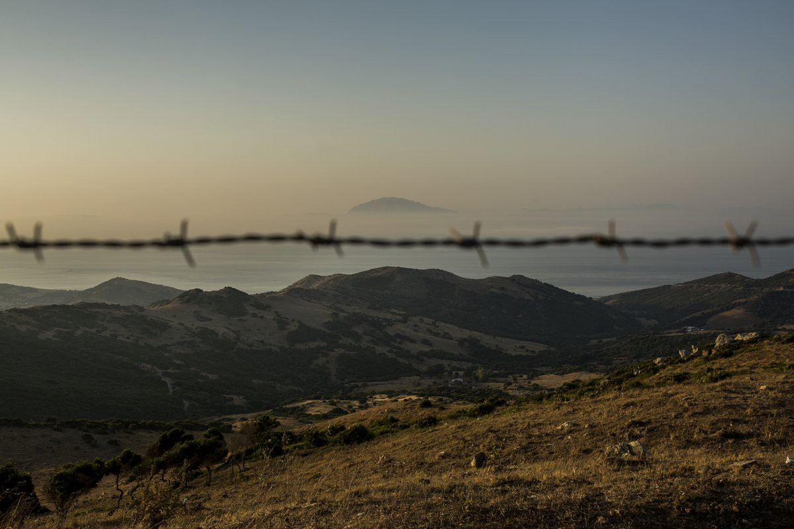

Source: Olmo Calvo
#### FEATURE: This Week an Open Letter was Issued to the EU Commission, Urging it to Take Responsibility for the Despicable and Stagnant Situation on the Island of Chios\.

In April 2017, the Guardian released an article outlining the deplorable situation on Chios titled [‘Europe’s dirty secret\.’](https://www.theguardian.com/world/2017/apr/28/refugees-greece-europe-dirty-secret-chios-detention-centres-bursting-point) Over a year on and the the conditions faced by refugees on Chios and the other Aegean Islands remain completely unimproved\. It’s even arguable that they have further deteriorated\.

This situation can no longer be sugarcoated as ‘a secret’ that the public did not know about\. There is direct harm in doing so\. The situations on Chios, Lesvos, Samos and the other Aegean Islands are not a secret, they are a full blown disgrace that poignantly reveal Europe’s complete lack of humanity\. A secret insinuates a justification and that is unacceptable\. ‘We didn’t know’ is no longer an acceptable excuse\. The time for that is up, Europe\.

> We continue to witness the systematic failure to uphold minimum standards for humanitarian response\. There are people with serious disabilities, pregnant women, newborn babies and children whose protection needs have neither been identified nor addressed\. 

> The conditions for asylum seekers on Chios remain wholly unacceptable and undignified\. 

**The open letter outlines the main problems in Vial, where responsibility must be acknowledged and action must be taken\. To further your understanding please read the full letter [via this link\.](https://www.facebook.com/notes/shoufu-%D8%B4%D9%88%D9%81%D9%88-stories-from-chios/open-letter-eu-commission-must-take-responsibility-for-inhumanity-of-its-hotspot/464455880689542/?hc_location=ufi)**

The main points included in the letter are:
- Limited transfers of persons to the mainland
- There are insufficient toilets and showers for the number of people currently in Vial
- Electricity supply
- Accommodation conditions present health and safety risks
- No access to running drinking water
- Sexual and gender\-based violence
- Insufficient provision of medical care
- Inadequate quality of food
- No provision of food during pre\-registration
- Situation of persons with second rejections
- Insufficient transportation
- Registration and integration of children into local state schools
- Delays in Asylum Procedure
- LACK OF INFORMATION
- Lack of Interpreters
- Traumatising Police Practises
- Arbitrary refusal to access ferries to mainland

### MOROCCO
#### 30 People Arrested in Morocco During Raids

They were taken on this bus\.

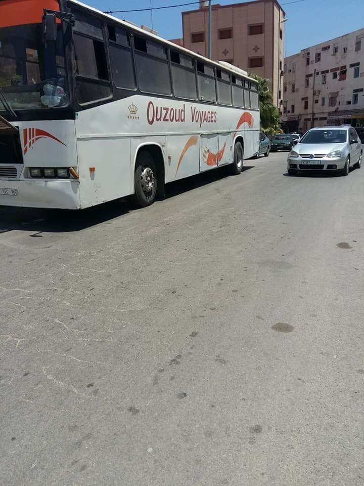

#### Nador Hospital Received 60 Unrecognised Corpses During the First Half of 2018

The procedure for the recognition of these bodies remains without result\. Some are buried at Sidi Salem Cemetary in Nador without a name, while the others remain in the morgue\.

> The embassies of African countries in Morocco and migrant associations must make more effort to ensure that these victims are at least entitled to a grave bearing their name and nationality, and that will remain forever testimony to inhumane migration policies\. 

It must be noted that human traffickers benefit from the non\-recognition of these bodies, as they were never forced to pay compensation to their families\.
#### Attacks and Destruction of Camps in Nador Continues

This Saturday morning, attacks against migrant camps continue in Nador\.
Arrests and destruction of migrant shelters\.

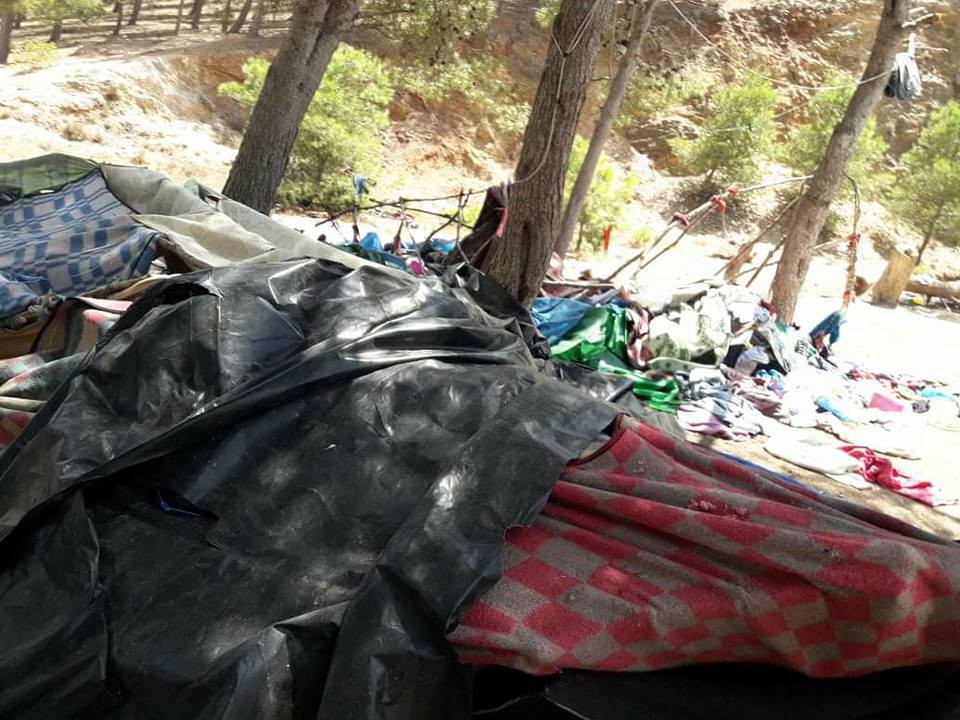

](assets/6b52718043d1/1*fCTXdHpxRwtkrTyVlgTJCQ.jpeg)

Source: [Association Marocaine des Droits Humains — Section Nador](https://www.facebook.com/AmdhNador/)
### SEA
#### Do NGOs’ Search and Rescue Activities Affect How Smugglers in Libya Send Migrants to Sea?

There has been discussion in the media suggesting that NGOs are responsible for smugglers sending people out from Libya towards Europe in unsafe rubber dinghy boats as opposed to safer, sturdier vessels\.

Matteo Villa argues that the statics we have give absolutely no indication to support these claims\.

[In a list put together](https://twitter.com/emmevilla/status/1028190352052760576) , he breaks down the argument against these accusations:

> Using what yearly data we have available, is there any evidence that NGOs affected the prevalence of unseaworthy rubber dinghies, as compared to sturdier vessels? Well, NOPE\. 

He continues to contend that reporting is creating ‘trends’ that don’t actually exist and the public must be wary of this\.
#### Half of the 141 People Saved by the Aquarius are Under 18

> Over half of the 141 people rescued by [\# Aquarius](https://twitter.com/hashtag/Aquarius?src=hash) are under the age of 18\. Being the only NGO search and rescue ship in the area, we are very concerned that there may be other boats in need that need help\. 

■■■■■■■■■■■■■■ 
> **[SOS MEDITERRANEE ITA](https://twitter.com/SOSMedItalia) @ Twitter Says:** 

> > Oltre la metà delle 141 persone salvate da #Aquarius ha meno di 18 anni. Essendo l'unica nave ONG di ricerca e salvataggio nella zona, siamo molto preoccupati che possano esserci altre imbarcazioni in difficoltà che hanno bisogno di aiuto. https://t.co/gGNLrT6sy0 

> **Tweeted at [2018-08-11 13:32:45](https://twitter.com/sosmeditalia/status/1028273013916094464).** 

■■■■■■■■■■■■■■ 

#### MSF Reports that Survivors on Board the Aquarius are Extremely Weak

■■■■■■■■■■■■■■ 
> **[MSF Sea](https://twitter.com/MSF_Sea) @ Twitter Says:** 

> > Today the #MSF medical are doing medical consultations on board the  #Aquarius. Many people are malnourished and weak from their time in #Libya where they were held in inhumane conditions and had limited access to medical care. Dr David Beversluis gives an update. https://t.co/iXafgTmJQ5 

> **Tweeted at [2018-08-11 13:19:02](https://twitter.com/msf_sea/status/1028269563014574086).** 

■■■■■■■■■■■■■■ 

■■■■■■■■■■■■■■ 
> **[MSF Sea](https://twitter.com/MSF_Sea) @ Twitter Says:** 

> > The #MSF medical team attends to one young man who lost consciousness on the deck this morning. As many of the rescued people remain extremely weak, the medical team keeps a close watch and makes sure people stay well  hydrated. Photo: Guglielmo Mangipane https://t.co/u7AIiHcFOY 

> **Tweeted at [2018-08-11 10:19:58](https://twitter.com/msf_sea/status/1028224497525116928).** 

■■■■■■■■■■■■■■ 

### GREECE
#### Multiple Boats Arrived in Greece Today \(Aegean Boat Report\)

**Kos:**

Boat 1: 9 people at 00\.30

Boat 2: 22 people at 07\.00

**Lesvos:**

1 Boat: 34 people at 23\.00

**Two boats were picked up by Turkish Coast Guard:**

Boat 1: 17 people at 08\.00

Boat 2: 37 people at 06\.25
#### Khora to Resume Pot Luck Picnic

> Our Community Pot Luck Picnic is back\! We will meet this Sunday at 6pm at the Freeshop and go to the courts near 5th School\! 

> Bring some food, smiles, plates, games & cutlery\! 

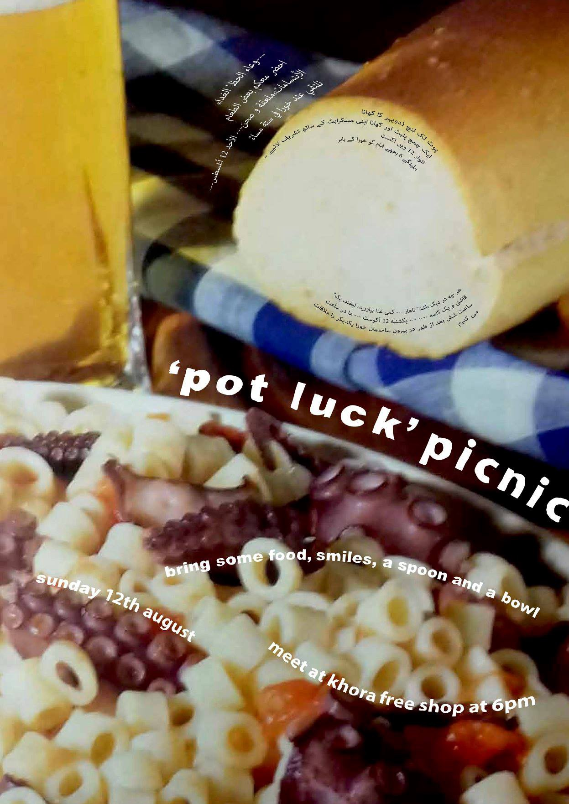

### BOSNIA
#### Rigardu to Begin New Project in Bosnia: Volunteers Needed\!

> We are looking for you to build a project in Bosnia with us from September and accompany this for at least three months\. 

> You expect a motivated team, constantly changing challenges, interesting and enriching encounters and, above all, experience with an exciting field of work at one of the EU external borders\. 

If you want to find out more information please send an email to projekte@rigardu\.de
#### No Name Kitchen Organise Clean Up of Velika Kladusa

A major cleaning took place over the last two days to clean up the temporary settlement\.

> The last two days we brought plastic bags and gloves to the settlement in Kladuša to do a major cleaning\. This is a temporary settlement so not everyone who stays here takes care of it\. On top of this, there are some uncontrolled distributions and some of the donations are left on the floor, dirty\. It might sound weird, but it was fun\. A lot of the residents in the camp joined in, we had a good time and they told us if we could do this often, so that’s exactly what we will do — No Name Kitchen 

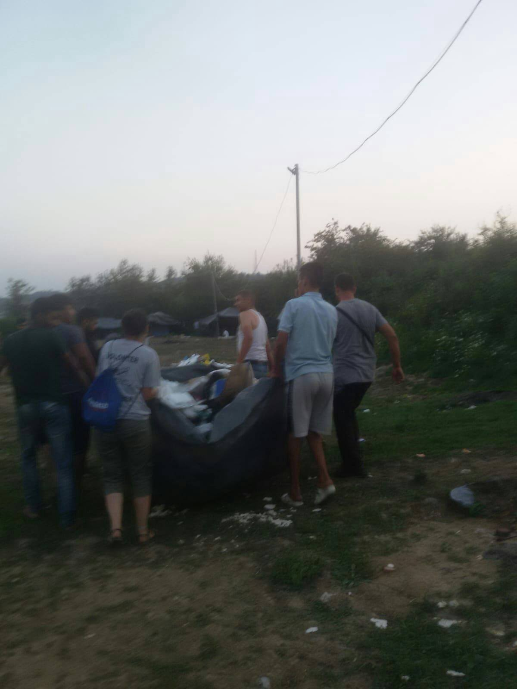

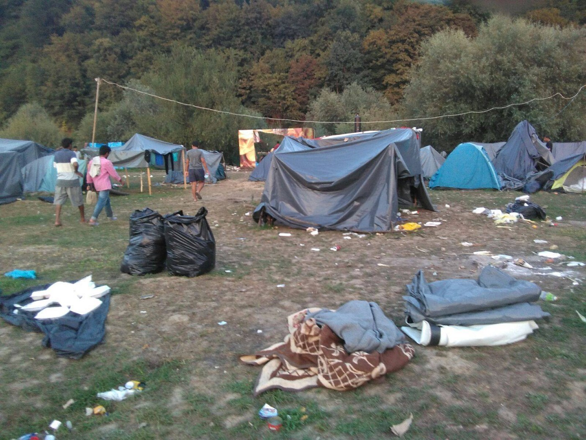

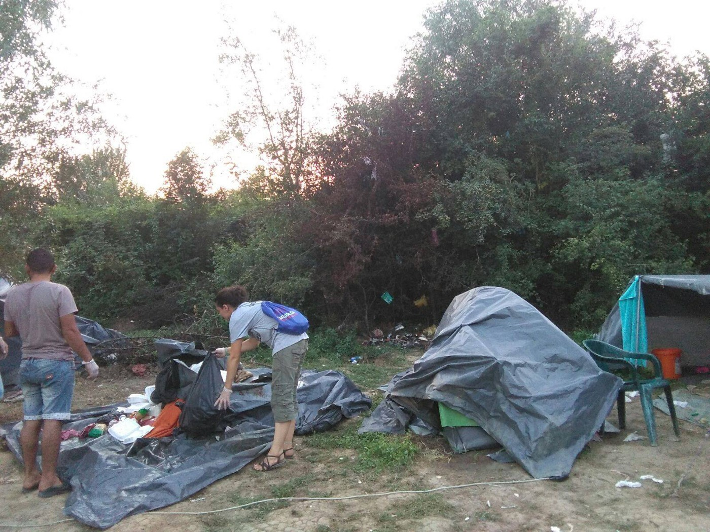

Source: No Name Kitchen
### CROATIA
#### Bikes Needed in Kladuši

Bikes are needed at the camp in Kladuši for transportation of food supplies\. If you have a bike that you would like to donate, send through a message to [Biciklopopravljaona](https://www.facebook.com/Biciklopopravljaona/) on their Facebook Page\.

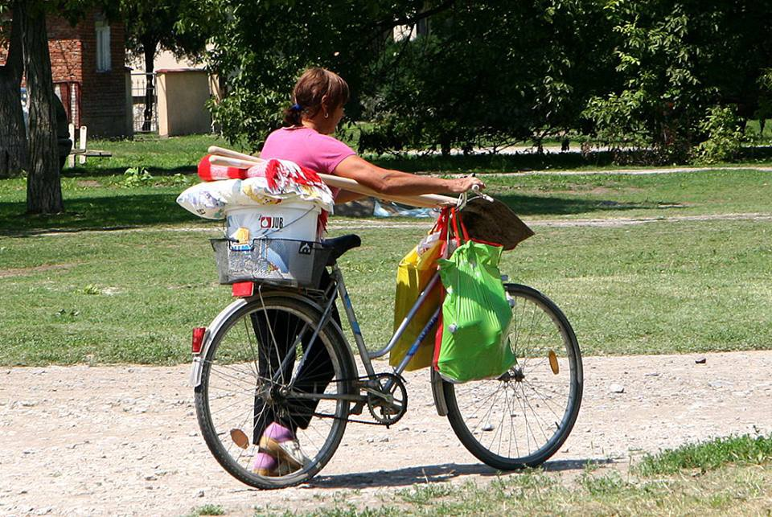

### AUSTRIA
#### A Demonstration to be Held on September 20

> With this demonstration we want to show, what we think about the deadly migration politics of the EU\. We want take a clear stand for a better future for everybody, regardless of their origin or their place of birth\. The European rulers won’t be able to discuss undisturbed, about their plans to destroy and end thousands of human lives\. We want a future, that allows everybody to live without fear, by organising production along our needs and beyond concurrence\. 

To find out more please [follow this link\.](https://www.facebook.com/notes/plattform-radikale-linke/informationen-zur-internationalen-großdemonstration-seebrücke-statt-festung-euro/1829061133798541/)
### ITALY
#### Baobab 4 Jobs is Helping People Acquire New Skills and Jobs in Italy

> Nosa managed to create his own collection of clothes and now works in a tailoring, joy in a few months will start his internship in a hairdresser, Ousmane has acquired new skills as a storekeeper\. Are just some of the guests we follow with Baobab 4 Jobs, whose skills and projects are being realized, thanks to training and writing of the curriculum and above all thanks to your support\. 

In Autumn the group plans to [begin training directly in the informal field](https://www.facebook.com/BaobabExperience/posts/1792009074209170) \. The project will be called “Baobab unique experience on skills acquisition”
#### Melting Pot Europa reports on a Breakfast Distribution in Rome

_‘Today was a good breakfast\. Today law enforcement did not show up,’_ they say in a post\. ‘ _And we like to think that it is also our thanks to the strength to resist any harassment and injustice; to be able to create solidarity and sharing’_

> For Monday 13 August, the community will open a new table at 7:00 in the morning, a table of knowledge and sharing, with metis breakfast and reading of newspapers\. 

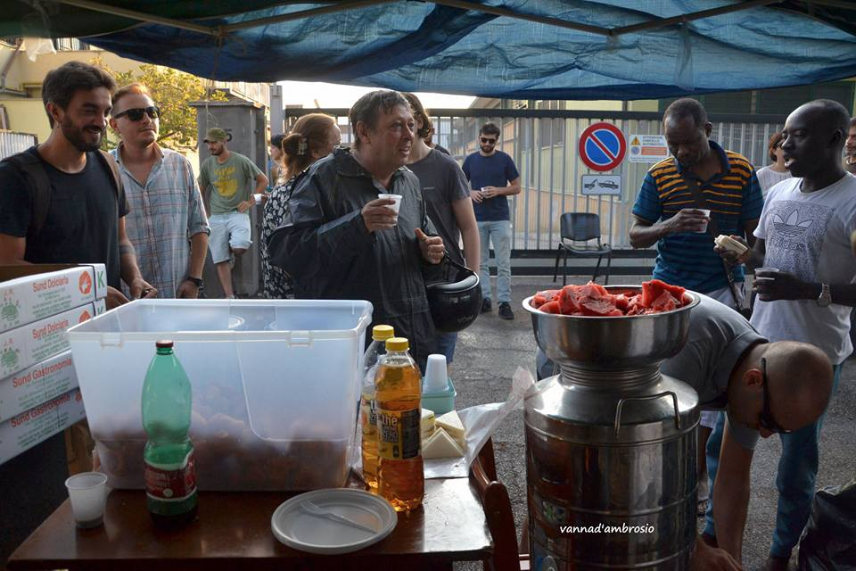

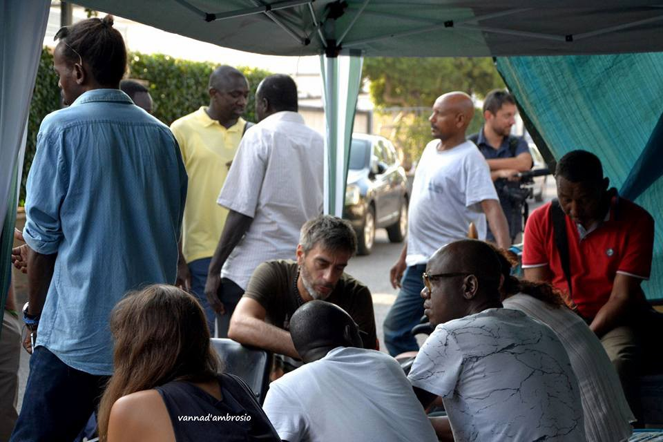

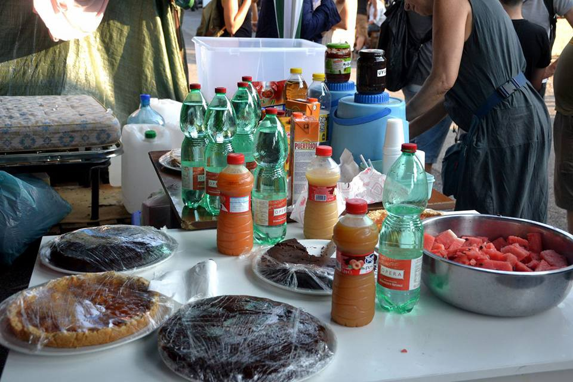

#### 12,688 People intercepted by the Libyan Coast Guard \(LCC\) in 2018

Nearly 13,000 people have been intercepted by the LCG since the start of this year in 90 seperate sea operations\.

> Since June, over 5,500 refugees and migrants were brought back to Libya \(3,453 individuals in June, 2,167 individuals in July and 55 individuals so far in August\) \. The main nationalities of those disembarked in Libya during the past three months are Nigerian \(1,635\), Sudanese \(1,628\) and Eritrean \(1,409\) \. 

Once intercepted UNHCR reports that together with its partner International Medical Corps \(IMC\), the organisations provide relief items at the disembarkation points and the detention centres\.

Despite having distributed 9,299 ‘rescue kits,’ and ‘1,317 primary healthcare consultations’ we cannot help but wonder whether this is really enough…
### FRANCE
#### Care4Calais Reports that Numerous New Arrivals are Reaching Calais and they are in desperate need of Restock Supplies

> It was a good day but we were hampered by desperately low stock\. Donations have dropped over the summer and we don’t have some of the key things the refugees really need right now\. In particular we have no trousers, jeans or joggers\. People are sleeping rough and not getting to wash or change their clothes for weeks\. Some of the trousers I saw people wearing today were simply horrible\. 

> If you can donate small men’s or boy’s jeans or joggers please go to our nearest drop off point as soon as you can 

CARE4CALAIS Drop of Points can be found [via this Link](https://goo.gl/ULD9dG.)

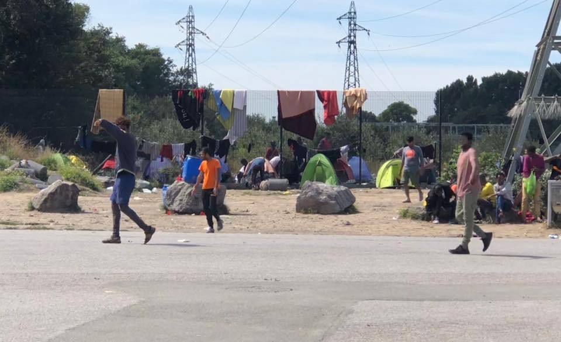

#### [Solidarité migrants Wilson](https://www.facebook.com/Solidarit%C3%A9-migrants-Wilson-598228360377940/) Report on Police Harassing Volunteers

[A joint statement](https://www.facebook.com/598228360377940/photos/p.916246145242825/916246145242825/?type=1&theater) has been released by a number of humanitarian groups working at the Chapel Door\. It outlines the exaggerated and inhumane Police response to groups providing food and assistance to refugees\.

> If the public authorities were to do their duty to accommodate the poor people who are here, it might be possible to understand\.
 

> But it’s not\. Here people are hungry and thirsty\!
 

> The Police should protect the distributions of volunteers who do the job of the Government
 

> 
 

> We support all groups, associations and volunteers who refuse to discourage themselves and continue to go generously to eat and drink, help and all their humanity to refugees… who need it\! 

**We strive to echo correct news from the ground through collaboration and fairness\.**

**Every effort has been made to credit organisations and individuals with regard to the supply of information, video, and photo material \(in cases where the source wanted to be accredited\) \. Please notify us regarding corrections\.**

**If there’s anything you want to share or comment, contact us through Facebook or write to: areyousyrious@gmail\.com**

_Converted [Medium Post](https://medium.com/are-you-syrious/ays-daily-digest-11-08-2018-vial-hotspot-a-shameful-and-dangerous-disgrace-6b52718043d1) by [ZMediumToMarkdown](https://github.com/ZhgChgLi/ZMediumToMarkdown)._
