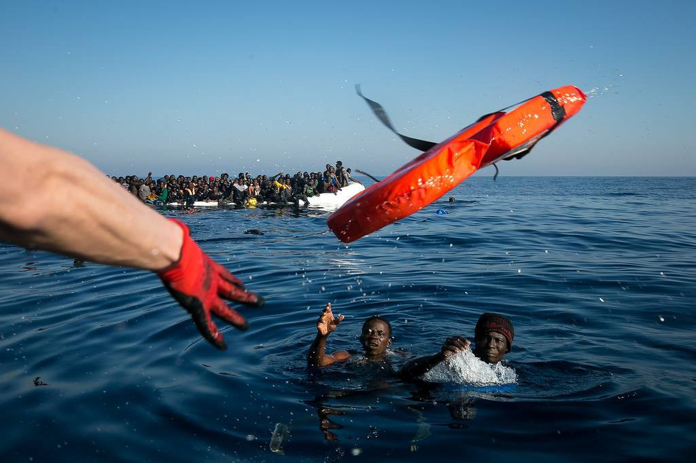
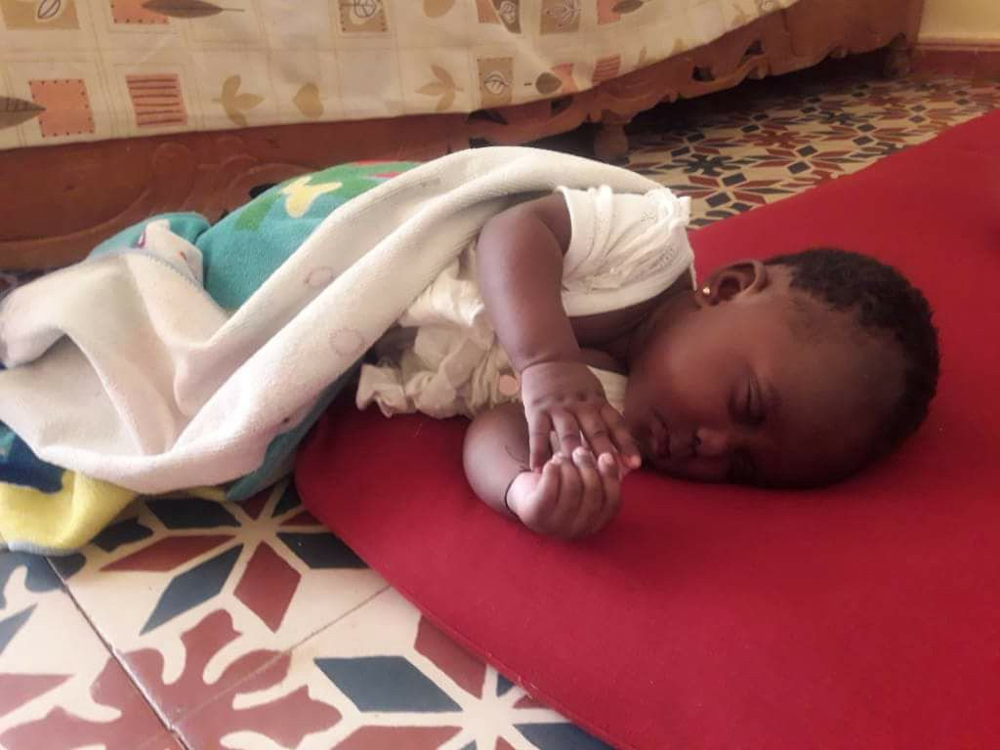

### AYS Daily Digest 12/08/18: Another Week, Another Rescue Ship Stranded

_Rescues at sea // Border police violence in Morocco, EU turns away // New arrivals in Greece // Refugees protest UNHCR in Athens // Unaccompanied minors in Athens // and more…_

Photo by Humanity House
### Feature

MSF and SOS Mediterannee, which jointly operate the Aquarius rescue ship, are urgently calling on European authorities to assign a port of safety to the ship, which is currently carrying 114 refugees\. The people onboard were all rescued on Friday, and have been waiting at sea since then\. During both rescues the [Aquarius](https://www.facebook.com/hashtag/aquarius?hc_location=ufi) informed all relevant authorities of its activities, including Italian, Maltese, and Tunisian Maritime Rescue Coordination Centres, and the Libyan Joint Rescue Coordination Centre \(JRCC\) \. Despite their outreach to all these coordinating centers, no RCC has yet offered a port of landing\.

According to MSF, more than 70% of those rescued originate from Somalia and Eritrea\. Many of the people on board are extremely weak and malnourished, and in need of medical attention\. MSF has interviewed some of those onboard, who describe being held in the infamous Libyan detention camps, where refugees are often ransomed and even sold into slavery\. From their open letter:

> In a disturbing development, rescued people on board told our teams that they encountered five different ships which did not offer them assistance before they were rescued by Aquarius\. “It seems the very principle of rendering assistance to persons in distress at sea is now at stake\. Ships might be unwilling to respond to those in distress due to the high risk of being stranded and denied a place of safety\. Policies designed to prevent people from reaching Europe at all costs are resulting in more suffering and even riskier journeys to safety for people who are already highly vulnerable” said Vimard, MSF coordinator aboard the Aquarius\. 

■■■■■■■■■■■■■■ 
> **[MSF Sea](https://twitter.com/MSF_Sea) @ Twitter Says:** 

> > There are 73 children under 18 years of age onboard. Of those 67 are travelling alone without a parent or legal guardian to care for them. https://t.co/6XYpgf0Dq4 

> **Tweeted at [2018-08-11 23:14:27](https://twitter.com/msf_sea/status/1028419403510099968).** 

■■■■■■■■■■■■■■ 

MSF provided an update today, and said that the Libyan authorities informed the Aquarius about a ship in distress\. The Aquarius launched its small rescue boat and is currently trying to locate the people\. Despite being blocked by EU officials, the crew of the Aquarius is still working hard to save lives\.

■■■■■■■■■■■■■■ 
> **[MSF Prensa](https://twitter.com/MSF_Prensa) @ Twitter Says:** 

> > Composición de las personas a bordo, coordenadas y características de las dos embarcaciones rescatadas el viernes por el #Aquarius en aguas internacionales en el #Mediterráneo central [prez.ly/qwM](http://prez.ly/qwM) https://t.co/Ctlhpg3yyE 

> **Tweeted at [2018-08-12 10:40:04](https://twitter.com/msf_prensa/status/1028591945483018241).** 

■■■■■■■■■■■■■■ 

■■■■■■■■■■■■■■ 
> **[SOS MEDITERRANEE](https://twitter.com/SOSMedIntl) @ Twitter Says:** 

> > One of the rescued persons celebrated his birthday on the #Aquarius today, a joyful moment for everyone on board. Others might be still out at sea desperately looking for help. https://t.co/eig6KB5oLA 

> **Tweeted at [2018-08-11 19:23:44](https://twitter.com/sosmedintl/status/1028361340967104513).** 

■■■■■■■■■■■■■■ 

### Morocco

Earlier this week, AYS reported on the violent attacks and mass evictions of refugee encampments in Nador carried out by auxiliary forces\. The violent evictions are ongoing this week, and the Moroccan Association for Human Rights \(AMDH\) published a story today from an eviction that occurred on Saturday\. The police were destroying shelters in the “Lakhmis Akdim” camp when they were confronted by a woman with a very sick infant\. They refused to give her any assistance, and carried on to destroy her shelter, leaving her alone in an isolated area without any way to reach a hospital\. According to [AMDH](https://www.facebook.com/AmdhNador/?hc_ref=ARSQHPTuFHZ2qolAbRwPaX78nH2wrzz6pvhcl5ujrtdRmHxwUzTEFsE-WpuwRl4CW2c&fref=nf&hc_location=group) :

The infant that auxiliary forces abandoned\. Photo Credit: AMDH

> Fortunately thanks to the help of some, the mom has been received in a house where the baby took some medication before the mom left Nador to Rabat to heal her baby and escape the violence of the auxiliary forces\. This is the real face of European and Moroccan migration policies\. 

As Moroccan forces continue to hunt down refugees like criminals, this Saturday Angela Merkel and Spanish PM Pedro Sanchez met to increase funding and cooperation with “third countries,” that assist the EU in preventing refugees from reaching its shores\. The meeting between Sanchez and Merkel was primarily focused on Morocco\. Neither leader commented at all on the violent evictions taking place in Nador\.

Today 31 refugees were arrested on a bus in Nador, and are currently facing forced deportations\.

AMDH reported today that two refugees are thought to have died in Tangiers this Sunday, around 18h\. They reportedly jumped off a moving bus because they feared being arrested by migration police\. AMDH is still looking into the incident and calling for an investigation\.

In Tangiers today AMDH also reported that Moroccan police encouraged homeless people to assault and rob a group of recently arrived refugees\. The group interviewed those attacked, including one pregnant women, who said her suitcase was stolen\.
### Sea

5 people from Morocco, including one minor, drowned on Friday this week after their ship sunk\. They were heading towards the coast of Spain\.
### Greece
#### Islands

New Arrivals \(From [Aegean Boat Report](https://www.facebook.com/AegeanBoatReport/?hc_ref=ARSAryTLrCR7mLruuwI90mWINUWAJ5XK3zFn1FKo_tt-YLX5kSd3k8L13eepktjHtwM&fref=nf&hc_location=group) \)

Two boats arrived on Lesvos today\. One boat landed in Paralia Thermis, Lesvos south east, 06\.00, carrying 39 people\. There were 16 children, 14 women, and 9 men onboard\.

A smuggler dropped off 23 people on Korakas, Lesvos north, 12\.40\.
In the group were 13 children, 5 women, and 5 men\.

Feox Rescue team needs supporters for their work on Chios, and to help fund their van\. Click here to donate — [www\.paypal\.me/feoxrescueteam](http://www.paypal.me/feoxrescueteam) \.
#### Mainland

Arash Hampay posted an interview with a woman who is part of a group of protestors in Athens\. The group is protesting the failure of the UNHCR to provide people with cash cards, which is a crucial lifeline when so many refugees are not able, or forbidden, to work\. As Hampay wrote,

> The UNHCR protesters are people from many countries with families and even one pregnant woman\. They have no cash card and therefore no money for food, no place to live and no access to all the usual services we would hope for in a functioning society\.
 

> For the last week Our House has looked to support this group of about 50 people and to show solidarity but we are a small project supporting homeless and cannot take on another 50 people to feed each day\.
 

> So we ask, where are you? The media who can give awareness to their plight, the donors who can make sure they are fed, the NGOs willing to prevent these people suffering more\. 

On the 8th of August there was a protest by the residents of the Elefsina refugee camp west of Athens, about its extreme isolation and the lack of adequate facilities there\. According to refugees and solidarity workers in the camp, the police responded with violence\. You can see footage of the incident and a full statement by local volunteers \(in Greek\) [here](https://athens.indymedia.org/post/1590569/) \.

A Swedish advocacy group today raised the alarm on an issue that is too often overlooked — unaccompanied children in Greece\. While the UNHCR and state agencies in Greece are responsible for the protection and shelter of minors, there are still thousands of homeless or near\-homeless children in Athens and on the islands\. As [WE ACT Sweden](https://www.facebook.com/WEACTsweden/?hc_ref=ARRY7GDjQ78gKbXgARfsDL2JkEkOVmq2POWPmSiWaMkG35uhBtEzgGm0ruPhMsKLlio&fref=nf) wrote:

> There are about 3000 unaccompanied children in Greece\. More than 70% are at waiting lists for a safe living\. More than half of the children are committing crimes to survive and even more of them are exposed to child prostitution\. 

> In the district Omonia in Athens, there are minor children from Syria, Afghanistan, and Iraq who are forced to sell their bodies for a meal\. Little Yasin wonders: If my life in Europe has had this terrible start, how will it end? 

> We can no longer close our eyes to the catastrophe happening in Europe\. Who is responsible for letting these people have a voice and attention? It’s you and me\. 

The Zaatar volunteer group needs support with their projects\. They are particularly looking for people who speak French, Greek, German, and Spanish, and also any musicians\. Click [here](https://www.facebook.com/zaatarngo/) to learn more\.
### France

Parisian authorities continue their policy of abusing refugees and harassing the volunteer groups that work with them\. The city has banned all food distribution over the weekend, and today carried out many evictions in the city parks\.

Care 4 Calais is looking for volunteers, contact clare@care4calais\.org if you’re interested\.

> **We strive to echo correct news from the ground through collaboration and fairness\.** 

> **Every effort has been made to credit organizations and individuals with regard to the supply of information, video, and photo material \(in cases where the source wanted to be accredited\) \. Please notify us regarding corrections\.** 

> **If there’s anything you want to share or comment, contact us through Facebook or write to: areyousyrious@gmail\.com** 

_Converted [Medium Post](https://medium.com/are-you-syrious/ays-daily-digest-12-08-18-another-week-another-rescue-ship-stranded-bd812e0da910) by [ZMediumToMarkdown](https://github.com/ZhgChgLi/ZMediumToMarkdown)._
