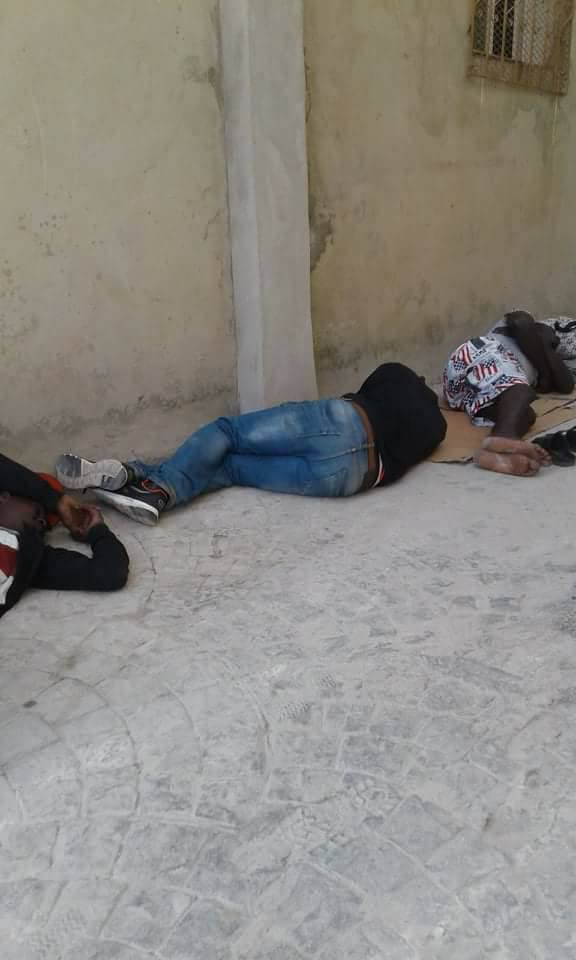
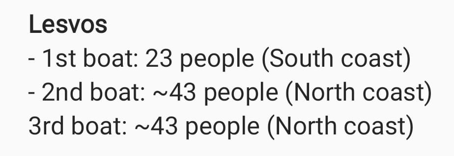
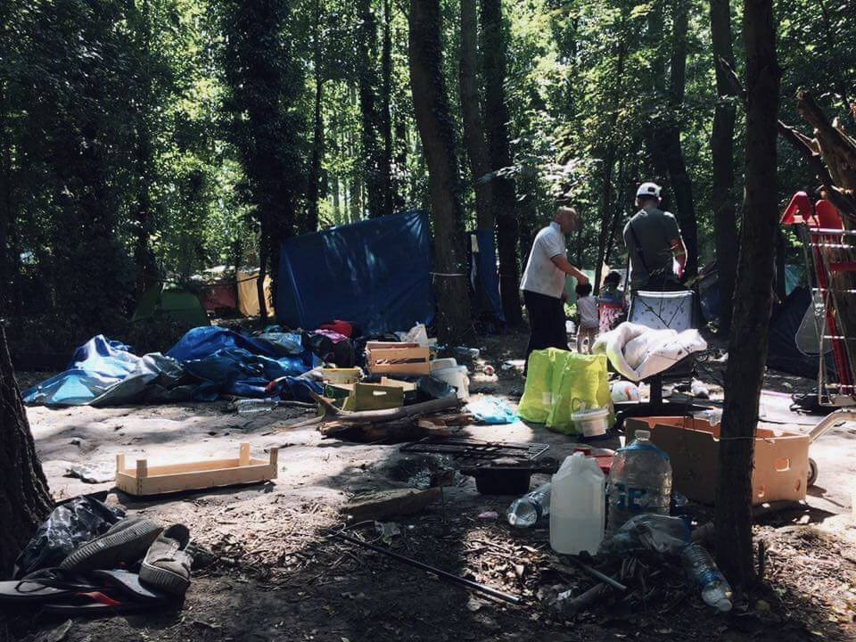

### AYS DAILY DIGEST 14/8/2018: Police continues to harass refugees in France

_Constant pressure over refugees and volunteers in Paris // War on children in Yemen and Syria // The hunt for people on the move continues in Tangier // The number of people who are arriving to Greece increases // For people in Bavaria, conservative politicians are a bigger problem than refugees …_

](assets/5d3b0c001d62/1*hW6dSOHntgCCliKeCXZD_g.jpeg)

Lesvos, Moria\. Photo by [Stichting Bootvluchteling](https://www.facebook.com/stichtingbootvluchteling/)
### Feature

There are over 1000 people who are forced to live in the streets of Paris at the moment\. The large makeshift camps of Jaures, Poissoniere, Porte De La Chapelle and Canal St Denis have all been demolished over the summer, and police are trying to do the same in the places where people still gather\.

Many people who are on the streets of Paris are refugees from war\-torn countries, or places where their lives were in danger\. Some come to Paris dreaming about France as a land of freedom and opportunities\. What they find is not even human\.

Constant pressure, but also lack of state support, creates many tensions on the streets, leading to “a potentially explosive” situation, according to volunteers in the field\.

While many groups have stopped working due to the police pressure and tensions, some are still struggling to provide at least basic help\. [La Cuisine des Migrants](https://www.facebook.com/lacuisinedesmigrants/) reports that people are scattered in the streets with very little help\.

On Tuesday, police came and took away the few things people who are sleeping rough had, and volunteers who are helping them are now asking again for blankets, duvets, sheets, anything that can keep a person warm, but also mattress \(foam, inflatable, camping, floor mats, yoga, etc\), tarpaulins…

If you can help, go and drop the items onsite or get in touch with [volunteers\.](https://www.facebook.com/CuisineDesMigrants/posts/2575197312494296)

The Paris Refugee Ground Support team returns to Paris in September, but they need help to continue their valuable work\.

### Syria

UNICEF, the UN children’s agency, [appeals to all sides](https://news.un.org/en/story/2018/08/1016922) in Syria and Yemen to end the “war on children\.”

UNICEF points out that since Sunday, 28 children were reported killed in Idlib and western Aleppo, Syria\. The death toll included an entire family of seven\. At the same time, 21 children were killed in Yemen when their school bus was hit in an airstrike\. At the same time, UNICEF facilities were under attack\.

**“The war on children in Syria is putting at least one million children at risk in Idlib alone,”** said the statement\.

Additionally, according to this agency, in Libya, Sudan and Palestine, there are about 30 million children who need humanitarian assistance\.

The head of the U\.N\. refugee agency Filippo Grandi believes that it’s premature to promote returns to Syria, saying that the country is still very insecure\. **“There’s still a lot of war going on in Syria,”** Grandi said\.

He announced his visit to Syria soon, in order to assess the situation for displaced people\.

The reaction came after some countries where Syrian refugees settled during the war began promoting return to the war\-torn country\.
### Morocco

The hunt for migrants continues in Tangier\. This morning the police attacked houses in Mesnana quarters, and dozens of people were arrested and taken to the central police station pending their forced displacement\. Many are injured, too and, as [Association Marocaine des Droits Humains — Section Nador](https://www.facebook.com/AmdhNador/?hc_ref=ARQuxdSk5ywNga875HDX40azN18wZNdh4I2c0oClEffIyuB0sAqnFPE-UYNv2DVPVxo&fref=nf) reports, two are dead\.

Over 1,700 people have been forcibly deported from Nador and Tangier since August 7th\. People are forced to stay on the street and in small alleys, where they sleep and hide during the day\.
### Libya

Hundreds of refugees from Eritrea and Somalia are forgotten at the Al Kashir Bi Kaschir centre near Tripoli in Libya\. On Tuesday, they initiated protests demanding to meet the UNHCR representatives or any other international organization that can help them\.

](assets/5d3b0c001d62/1*HXJ8fMre_AdOl7DkhFxYVw.jpeg)

Photo by [Abrham Fa](https://www.facebook.com/abrham.fa)
### Sea

Despite the agreement reached on Tuesday night, Aquarius is still not allowed to dock\. They are waiting in the water between Malta and Italy, with people on board who need help\. According to the agreement, once they are accepted by Malta, those onboard will be distributed between Spain, France, Luxembourg, Portugal, and Germany\.

After three days, a rubber boat carrying 150 people was saved\. Before Tuesday night, no one came to provide help\.

At the same time, over 200 people have been rescued in the western Mediterranean\. They all were accepted at the port of Malaga\. Additionally, Guardamar Concepción Arenal rescued 67 people from a _patera_ and moved them to Barbate\.

**According to the IOM, 61,517 people arrived by sea to Europe in 2018, while 1,524 died while trying to reach safety\.**
### Italy

From the start of this year, **18,944 people arrived in Italy** \. Over the same period last year, 97,241 new arrivals were registered\. As we reported before, the reason for this decrease is mostly tightening of the borders, which has made many people choose another route, putting their lives in even greater danger\.

Desperate living conditions in Italy makes people do desperate things\. Three days ago, in Udine, a 33\-years\-old refugee from Afghanistan hanged himself in the barracks of Cavarzerani where he has been living for several months after being deported from Austria in accordance with the Dublin regulation\. Apparently, he did show signs of a strong depression, but was not provided with the needed help\.

“These guys are left alone with their problems and difficulties… nobody really takes care of them, of their heart and mind,” [volunteers](https://www.facebook.com/permalink.php?story_fbid=1855034257922865&id=1245970425495921) are claiming\.

The place where this happened is run by the local Red Cross and has been often mentioned in the public because of the bad living conditions\.
### Greece

On Tuesday, 109 people arrived by boats to Lesvos alone\.

Over the last few weeks, more and more boats have been arriving on Kos\. Since Friday, 8 boats were registered, carrying a total of 182 people\.

So far this month: 14 boats, 274 people\.

[Aegean Boat Report](https://www.facebook.com/.../a.285312.../426483497874760/...) is looking for a ground contact on Kos, with first\-hand, detailed knowledge regarding arrivals on the island\. A person who can provide information within hours after arrival, day and night\. To be able to provide good reliable information, we need solid sources on the ground who understand the importance of getting information regarding the situation on the islands to the public\.

So far in 2018, **16,262 people arrived in Greece by the sea** \. The majority are from Syria \(35 percent\), Iraq \(21 percent\) and Afghanistan \(15 percent\), according to official sources and the UNHCR\.

](assets/5d3b0c001d62/1*F1CynAYgqTQ35_jhn_QwMQ.jpeg)

[Greek Asylum Service](https://www.facebook.com/.../a.57887.../1098553453632092/...)

At the moment, over **15,500 people are stranded on the Aegean islands** \. Among them, **29 percent are children** , of whom nearly 7 out of 10 are younger than 12 years old\.

Transfers to the mainland are still very slow\. This week, 811 asylum\-seekers departed from the Aegean islands to the mainland, many to the camps that are reopening, and where the situation is very bad\.

A group of Greek parents on Chios is [insisting](https://www.facebook.com/groups/informationpointforlesvosvolunteers/permalink/945004749040306/) that refugee children be allowed to attend the schools their own children attend\.

“We support the education of refugees without discrimination, providing opportunities for all pupils, under the sole responsibility of the State and not the NGOs\. Schools must be open to all children\.”

[Open Cultural Center](https://www.facebook.com/OpenCulturalCenter/posts/2279405955421143) needs laptops for their users\.

[Mo Chara](https://www.facebook.com/RefugeeRescueUK/) ’s needs donations:

“While the media’s focus is elsewhere, we are dealing with serious life and death situations almost daily here… we have now assisted more than 3,700 people since the start of 2018\. When you understand the small scale of the area we are working in these are truly shocking figures — but of course they are not just figures, they are people, most of them women and children\.”

[Beautiful project](https://www.facebook.com/sportforrefu) in Lesvos that helps refugees learn how to swim\. But not only that: “We work to strengthen their relationship with the sea and how to treat it properly\.”

Swimming lessons are everyday at 1 pm\! @ Mytilene, Lesvos, Greece
### Bosnia

Finally, something nice happened in Velika Kladusa, where about 1000 people are staying at the moment, many in degrading condition in a makeshift camp\. Due to the lack of accommodation, but also basic things like food, hygiene and safety, as well as an increase in violence from the Croatian and Slovenian police, more and more people are deciding to go back home \(if possible\), or back to Greece and Serbia\.

 playing with the kids in Kladusa\.](assets/5d3b0c001d62/1*ATWNHFIHVUjb1dBoaW3gfw.jpeg)

Voluteers from [La Carovana Artistica](https://www.facebook.com/lacarovanaartistica/?hc_location=group_dialog) playing with the kids in Kladusa\.

Volunteers in Kladusa initiated a new and interesting project in Bosnia, but they need help to continue\.

“The Balkan Info Van aims to provide free practical information to people on the route through the Dalmatian Corridor \(Bosnia\-Croatia\-Slovenia\) into the European Union\.

We believe that people fleeing violence in their home countries \(whether physical or economic\) should have the right to seek refuge in Europe\. Yet today there are over 3000 people living in squat tenements and informal camps across NW Bosnia who do not have this right\.”

[Help them if you can](https://www.gofundme.com/gn2u2v-balkan-info-van) \.
### Germany

The latest poll analysis done in Bavaria shown that people see conservative politicians as a bigger problem then refugees\.

“While 34 percent of Bavarian respondents said the conservative CSU and its regional Minister\-President Markus Söder are a problem affecting their region, 28 percent said the same about refugees, according to the [survey](https://www.n-tv.de/politik/Bayern-sehen-CSU-und-Soeder-als-Problem-article20569854.html) by Forsa for broadcasters N\-tv and RTL,” the media are reporting\.
### France

The August version of ‘the asylum seeker’s guide in Paris’ [is here](http://www.guideasile.wordpress.com) \!

It is available in French, English, Arabic, and Dari\.

Two weeks after the camp in Dunkirk was destroyed and over 300 people left with no care, [Calais Refugee Aid](https://www.facebook.com/CalaisRefugeeAid/?hc_ref=ARSi7nMsgi_9VfXi9kvO9wxM--JUn0ZCMOMIxPB2TFBhm-hB8Dv9XgKdzxuMKZz9hL0&fref=nf) visited the area only to see that people are coming back\. They also need help\.

Photo by Calais Refugee Aid\.

In Calais, there is an [urgent need](https://www.facebook.com/groups/FASTCalais/permalink/2175520816061090/) for bandages and examination gloves size L\.

[The Locker room](https://www.facebook.com/groups/177642579245883/permalink/692817524395050/) needs volunteers, to sort and receive donations from 15 to 18 pm on Wednesdays, and Saturdays and Sundays from 9 am to 14 pm to receive donations\.
### UK

[Help Refugees](https://www.facebook.com/HelpRefugeesUK/?hc_ref=ARQCoVev86mS2De5gkeGhm9VKE8-fOS2gDNmGtWCYoSuWQWvkgxPhRjUFCJr0yIv4W4&fref=nf) continues campaigning for child refugees\.

“Our friends at [Safe Passage](https://www.facebook.com/SafePassageInt/?fref=mentions) have discovered that the Government has been allocating some of the 480 Dubs Scheme places to child refugees who were already entitled to reunite with family in the UK\. This is leaving some of the most vulnerable children in Europe stranded on the continent, with no other means to reach safety\.

By classifying a child who joins their family as a Dubs transfer, the government is depriving another incredibly vulnerable unaccompanied child the opportunity to gain protection in the UK\. The Dubs Scheme was created to help children who had no other route to safety\. The Home Office must honor this commitment, transferring children with family in the UK under Family Reunification, and vulnerable unaccompanied children without family under the Dubs Scheme\.”

**We strive to echo correct news from the ground through collaboration and fairness\.**

**Every effort has been made to credit organizations and individuals with regard to the supply of information, video, and photo material \(in cases where the source wanted to be accredited\) \. Please notify us regarding corrections\.**

**If there’s anything you want to share or comment, contact us through Facebook or write to: areyousyrious@gmail\.com**

_Converted [Medium Post](https://medium.com/are-you-syrious/ays-daily-digest-14-8-2018-police-continues-to-harass-refugees-in-france-5d3b0c001d62) by [ZMediumToMarkdown](https://github.com/ZhgChgLi/ZMediumToMarkdown)._
