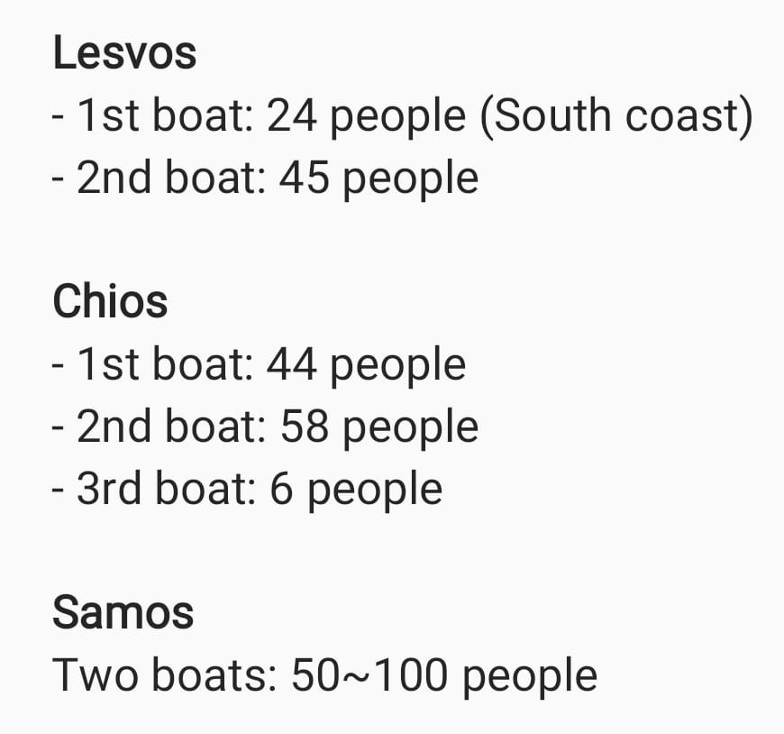
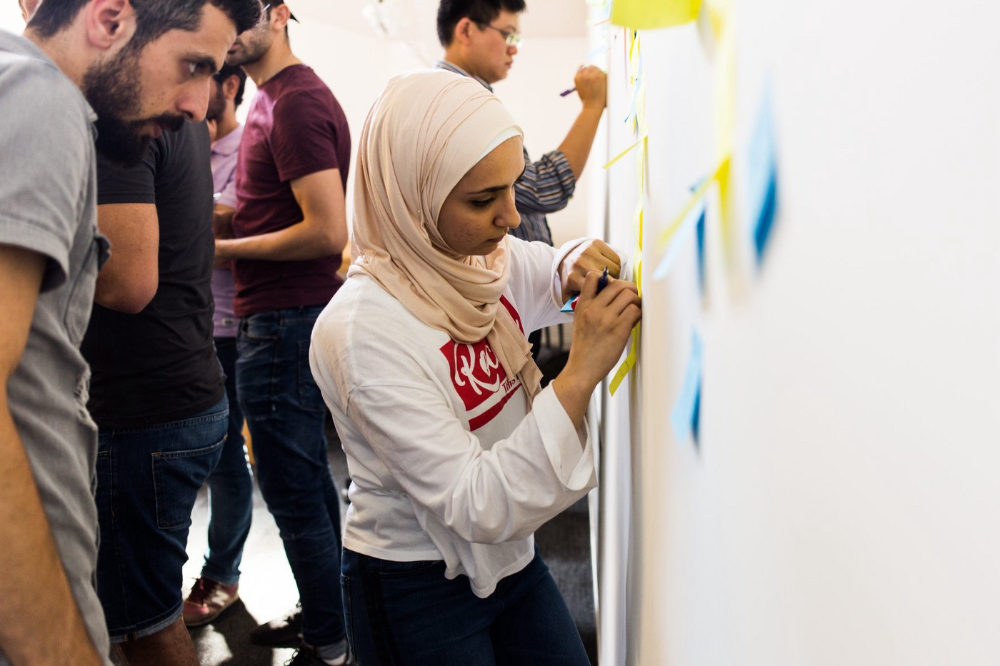

### AYS Daily Digest 16/08/2018: **Discrimination makes people think about going back to Syria**

_We live in times when too often we have to remind ourselves of the basic human rights\. Universal Declarations for Human Rights, Article 1: “All human beings are born free and equal in dignity and rights\. They are endowed with reason and conscience and should act in a spirit of brotherhood\.”_

 \)](assets/498a86fb95e1/1*h9Zg3grjJB1X0Ejh-_3hJg.jpeg)

Málaga, Spain\. August 2018\. A refugee waits to disembark from a rescue boat after arriving at the port of Málaga\. \(Photo by [Jon Nazca](https://twitter.com/JonNazca) \)
### **FEATURE**

Due to economic hardship and discrimination, some people who fled the war in Syria are deciding to return to this war\-torn country\. Even though this is the case more often in Syria’s neighbouring countries, many people who reached Europe are encountering the same problems of racism and discrimination\.

[Research](https://www.nrc.no/resources/reports/dangerous-ground---syrias-refugees-face-an-uncertain-future/) published at the beginning of this year by the Durable Solutions Platform, an NGO\-led research initiative, shows that the returns result from “unsafe and precarious living conditions in asylum,” rather than the improved situation in Syria\.

Some people who left the country because of the war are still on their journey, stuck in the Balkans, forced to cross\-borders in an irregular way, to run and hide, becoming victims of cruel border policies in the EU\. But, to return back to Syria is close to impossible, at the moment\.

Several hundred returned to Syria from Lebanon last month, and the [General Directorate of the Lebanese General Security](http://nedaa-sy.com/en/news/7863) confirmed this week that they are working to deport even more people from the Shab’a area and the Bekaa to the areas controlled by the Syrian regime\.

This move by the Lebanese government, as well as propaganda present in some EU countries, is in compliance with the Assad regime’s policy that is openly calling for refugees to return\. An [analysis](https://www.newsdeeply.com/refugees/community/2018/08/16/assad-needs-the-u-n-s-help-for-refugees-to-return-safely) published by Refugees Deeply points out that al\-Assad’s government “has a political interest in refugees coming back”\.

“The government wants international legitimacy, and significant returns would signal that it has won refugees’ confidence in its ability to protect them and rebuild the country,” the article claims\.

The UNHCR expressed its readiness to begin facilitating large\-scale voluntary repatriations in cooperation with the Syrian government, and experts are warning that it is a premature decision\. At the same time, they say that “the absence of U\.N\. \-Syria cooperation could result in repatriations occurring in a chaotic, unorganized and potentially dangerous manner\.”

Lessons from Iraq and Afghanistan have shown that the time for return has to be carefully planned, and is appropriate only when the country is safe for everybody — which still cannot be said for these countries today\. What is usually missing in international interventions is the international community actually consulting the people whose lives are in question\. That is why Open Democracy insists that the UNHCR should consult Syrians over repatriation strategy, “right from the beginning and throughout the process\.”

“Efforts to return Syrian refugees now are premature\. Yet when refugees eventually return, the strength of UNHCR\-Syrian cooperation will be critical for ensuring a safe, sustainable and voluntary repatriation\. Preparations are rightly beginning now\. They should take care to listen to refugees and build upon the lessons of the past\.”

More than 12 million Syrians have been displaced since 2011, which is over half of Syria’s pre\-war population\.
### AFGHANISTAN

In the country that some EU leaders consider safe, an [attack on the Mawoud](https://theirworld.org/news/many-school-students-dead-suicide-bombing-education-centre-kabul-afghanistan) education centre took 34 lives, including many children\. At the same time, 67 people were injured when a suicide bomber struck in Kabul\.

The bombing is the latest in a series of attacks on education in Afghanistan\. Last month at least 11 people were killed and 10 injured after gunmen stormed an education department compound in Jalalabad city as teachers were delivering exam results\. In June, Jalalabad’s education department was also attacked by gunmen and at least 10 people were wounded\. In the same month, more than 80 girls’ schools were closed and exams cancelled after Islamic State militants warned parents to keep their children at home\.

In the meantime, more deportations to Afghanistan are planned from all over Europe\.
### MOROCCO

Police in Mesnana district continue harassing and arresting people on the move\. The new raid was conducted on Thursday morning\. Police arrested some people while using force\. [Association Marocaine des Droits Humains — Section Nador](https://www.facebook.com/.../a.16931.../2165648206980776/...) reports that dozens were arrested and forced on buses\. “According to some testimonies, migrants who refused to rise were hit by police and auxiliary forces\.” Apparently, one child died in this operation\.
### SEA

[Aquarius](https://twitter.com/SOSMedGermany/status/1030090815719260160) has left port in Malta and is heading to Marseille to address the troubling decision by Gibraltar to issue a “notice of removal” of its flag\.

In the meantime, more and more people need help at sea\. The Italian Coast Guard rescued about 170 people from one ship\.

@ [Salvamente](https://twitter.com/salvamentogob/status/1030066203400777728) rescued 85 people from five pateras\.

The patrol [Segura River](https://twitter.com/salvamentogob/status/1030055377465950208) rescued 45 people from seven pateras\.
### GREECE

200 people arrived on Thursday to the Greek islands\.

**Help is needed\! \! \!**

Camp Serres needs volunteers\. Almost 500 people, all Yazidi from Iraq, are living in this camp\. At the moment they have no lawyers\. [Get in touch](https://www.facebook.com/.../a.272733.../578971252498263/...) if you can help\.

[A Drop in the Ocean](http://www.drapenihavet.no) needs coordinators at all of their locations in Greece\! Please look up their website for more information about their locations and the various coordinator roles\. If you have the opportunity, the skills and are interested in helping — send your letter of motivation and CV to [birgit@drapenihavet\.no](mailto:birgit@drapenihavet.no)

They also need volunteers for Elefsina Camp, outside of Athens, as soon as possible and for throughout the fall\.

[DocMobile — Medical Help e\.V\.](https://www.betterplace.org/…/62948-medical-help-doc-mobile…) is asking for donations\. Please follow the link for more information and consider helping\!
### BOSNIA & HERZEGOVINA

Police in Bosnia add to the pressure on volunteers and people on the move who are in the country\. They continue to stop and search busses heading from Sarajevo to the north of the country, and in many cases, take people off the busses, even if they have regular asylum seeker cards\.

Volunteers, both local and international, are being stopped and asked to show their IDs in Sarajevo\.

Accommodation for people on the move remains a problem, as well as the process of registration\. By the rules in existing centres, where IOM and UNHCR do play significant roles, if people leave and do not show up in the next 24 to 48 hours, they will lose their place and their registration paper is canceled\. Some of them are trying to reregister, but the government is preventing them from doing that, and the UNHCR is doing close to nothing\.

At the moment, many families are left to sleep in the streets with no protection and without papers\. Food and care are provided by volunteers and locals\.

In Bihac area, police continue harassing people on the streets but also in the makeshift shelter Djacki dom where regularly raids are organized\. On Thursday, [over 40 police](https://www.klix.ba/vijesti/bih/vise-od-40-policajaca-pretresa-bihacki-djacki-dom-u-kojem-su-smjesteni-migranti/180816020) officers were in Djacki dom conducting raids and searches\. Apparently, they were looking for a possible weapon\.

At the same time, people continue [entering Bosnia](http://ba.n1info.com/a279575/Vijesti/Vijesti/Kako-migranti-prelaze-granicu-BiH-i-Srbije.html) from all directions, including Serbia where, according to police data, about 3,000 people were waiting to try to cross at the city of Loznica\.

Meanwhile, volunteers continue to provide help\. One group in Austria wants to collect blankets and tents for people in Bosnia\. If you can help, [please get in touch\.](https://m.facebook.com/story.php?story_fbid=2228856770476917&id=630458300316780)
### NETHERLANDS

If you are are asylum seeker or asylum holder in the Netherlands and want to become a developer, [get in touch](https://www.facebook.com/hackyourfuturenow/posts/1675960575846737?__xts__%5B0%5D=68.ARC4cQFnFZtHK4s5Hb34vD0sXQfAHPsVToJLr28n_8UZ5P5OrSF--ckC8PnLRFUtInv_ZFozdrTZPccdrtQ6_QLJR7BndyVcoNW462nDGITJz4jYkj-Fhlg5S_R4bjFrM92oTb9r2qod&__tn__=H-R) \.

If you want to take part in an interesting project, check out this [website](https://bit.ly/2AumeG5) and you will find a call to an event that will take a place on Sunday, September 23rd from 2pm to 5pm on Museumplein in Amsterdam\.

“Stories that have been told and heard by a few, but also stories that have not been told yet because they hurt the victims too much to pronounce\. Only when we mirror ourselves in the other, the courage to move us to the other is the strength to want to help\. Really help so that the other will go better\. It is often ignored but also often fear of the unknown, fear of the possible consequence, as a result of which we often do not have the courage to mirror ourselves to the other person\. As soon as we mirror ourselves to the other, there is no way back\.”

For this event, they are looking for volunteers\. People who want to sit for 1\.5 hours \(start: 2:30pm\) in a rubber boat, together with 51 other people\. A total of seven boats are to be placed within the middle of a chest with lifejackets that are taken from Lesvos\. Boats with which people — who have fled war — are still arriving in Europe\.
### FRANCE

Refugee Community Kitchen [needs help](http://bit.ly/rckdonate) \.

There are up to 700 people, including many families, living rough in Dunkirk\. Among them, there are at least 70 children under the age of 10\.

RCK is feeling a lot of financial pressure as they are currently serving over 1,300 meals a day — and more people are arriving daily\!

> It is incredible that we even have to publish a [call like this](https://www.facebook.com/.../a.230493.../493993227692979/...) \. 

> In a refugee camp, going to the toilet at night time is a threat to a women’s safety\. To protect themselves, they use to pull up diaper pants instead of leaving their tents and putting themselves in danger\. 

### SWEDEN

Refugees and asylum seekers in Sweden are being used by groups involved in financial crimes, one [local radio report shows](https://sverigesradio.se/sida/artikel.aspx?programid=83...) \. It is mainly their identities that are used, for example in money laundering, fraud, or starting companies that later are used only to cover criminal activities\.

Sometimes people are aware of the criminal acts they are exposed to, but other times — and what makes it an issue is that — people are tricked into things they believe are legal or at least not punishable\. Bank accounts, companies, and other things can be started in someone else’s name with their consent — but without the newly arrived and sometimes also vulnerable individual knowing what the causes can be\. There has been an increase since the big influx of refugees in 2015, and the responsible authorities have been warning for this since then\. No one knows how common this is or how far\-reaching this problem is\.
### UK

Six asylum seekers in Glasgow [have so far been issued](https://theferret.scot/refugees-eviction-glasgow-errors/) with lock\-change notices by multinational company Serco, which a has a Home Office contract to provide asylum accommodation\. Following widespread outcry across the city and legal challenges put forward by those served with lock\-change notices, it has suspended eviction plans — which put 330 refugees at risk — for 21 days\.

**We strive to echo correct news from the ground through collaboration and fairness\.**

**Every effort has been made to credit organizations and individuals with regard to the supply of information, video, and photo material \(in cases where the source wanted to be accredited\) \. Please notify us regarding corrections\.**

**If there’s anything you want to share or comment, contact us through Facebook or write to: areyousyrious@gmail\.com**

_Converted [Medium Post](https://medium.com/are-you-syrious/ays-daily-digest-16-8-2018-discrimination-makes-people-think-about-going-back-to-syria-498a86fb95e1) by [ZMediumToMarkdown](https://github.com/ZhgChgLi/ZMediumToMarkdown)._
