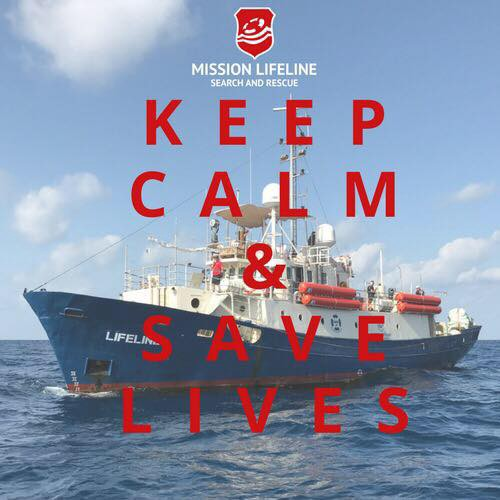

### AYS DAILY DIGEST 17/08/2018: Asylum\-seekers with inadmissibility claims denied food in Hungarian transit zones

_203 people arrive to Lesvos // Mission Lifeline has a new boat // People in Morocco bused away from the coast // Italian Coastguard ship stranded at sea // News from Greece, Bosnia & France…_

Photo by Keegan Nashan
### Feature: Asylum\-seekers denied food in transit zones

The [Hungarian Helsinki Committee](https://www.helsinki.hu/wp-content/uploads/Denial-of-food-for-inadmissible-claims-HHC-info-update-17August2018.pdf) says that the Hungarian Immigration and Asylum Office refuses to provide food to people in “alien policing procedures” in the transit zones, with the aim of dissuading them from pursuing court appeals and to make them abandon their asylum applications by returning to Serbia\.

The inadmissibility decisions are based on a new provision, according to which people are inadmissible if “the applicant arrived through a country where he/she was not exposed to persecution or to serious harm, or if an adequate level of protection was available in the country through which the applicant had arrived to Hungary”\. Since Hungary regards Serbia as a safe third country, the new inadmissibility provision abolishes any remaining access to a fair asylum procedure in practice, according to the Hungarian Helsinksi Committee\.
### Morocco
#### People bused away from the coast

](assets/85df8a72ee7b/0*eYb5yjP9jYJ44AaC)

Photo by [Association Marocaine des Droits Humains — Section Nador](https://www.facebook.com/AmdhNador/)

395 people from ten different boats were rescued today off the coast of Spain\.

As Spain and the EU ask Morocco to prevent people from leaving for Europe, police continue arrests and attacks of migrants’ camps in Nador, near Melilla, one of two Spanish territories inside Morocco\. A [human rights organisation](https://www.facebook.com/AmdhNador/) in the city says that two camps were attacked today, while 37 people were arrested before being brought to buses to move them away from the region\. It says that there were injured people due to police violence among those deported\. [Les Eco](http://leseco.ma/) says that between 1,500 and 1,800 migrants have already been arrested and then displaced towards desert areas since the operation began\. These arrests take place outside of any legal framework and even lead to the arrest and displacement of legal residents\.
### Sea
#### Lifeline has a new boat, needs funds

As of 17 August, the Libyan Coast Guard has intercepted 12,747 refugees at sea during 91 operations\. To prevent the loss of further lives, Mission Lifeline has bought a new ship and is now looking for [donations](https://mission-lifeline.de/) \. It still needs around €175,000 to finance the ship\.
#### Coastguard ship Diciotti stuck between Italy and Malta

](assets/85df8a72ee7b/0*tK_uirOXuvnO79qo)

Photo by [Mediterranean hope](https://www.facebook.com/Mediterranean-hope-252231521632595/?hc_ref=ARSJeWhHx77_Pgo5iwSVy81RYmVkh5Axx-q3mqM0IqwHfh1QmasVnnJn1d9iTAbCA1c&fref=nf&hc_location=group&__xts__%5B0%5D=68.ARDJQ5oxrXbWP45C8qKHGUQv9zFaSFtwl6oT0z2shIx8A_dzDpcOBBtyDoBAZbQ150akbhYAXCb3ylXS5LdE7ZfhXwlt0Zyq51QA5ov6fNG1vv_FlfzClF7R7TqclP8U1AeCscAtw0VM&__tn__=kCH-R)

Italy and the EU continue to disincentivize any kind of rescue, even letting their own coast guard stranded at sea\. The Italian Coastguard ship Diciotti, which rescued refugees in Maltese waters, is now awaiting the assignment of a safe port to disembark, which Malta has thus far refused to do\. Italy has also refused the boat to dock despite it being close to the island of Lampedusa and the boat is now stuck between the two countries\. Thirteen Eritrean refugees who were aboard the ship were transferred yesterday to the port of Lampedusa\. [TGcom](http://www.tgcom24.mediaset.it/cronaca/sicilia/migranti-13-eritrei-sbarcati-nel-porto-di-lampedusa_3158327-201802a.shtml) says the people, including children, were taken to an outpatient clinic because they were severely debilitated after spending almost two years in Libyan detention camps\.
### Greece
#### 203 people arrive to Lesvos

The Aegean Boat Report says that yesterday nine boats with 352 people started their trip towards Greece but only 5 boats with 185 people made it, as the others were stopped by the Turkish Coastguard or police\.

In addition, the Hellenic Coastguard rescued a boat carrying 36 people off the coast of the Greek island Sapientza according to [ANMA](http://www.amna.gr/en/article/284601/Coast-Guard-rescues-36-refugees-and-migrants-off-the-island-of-Sapientza) \.

203 people arrived to Lesvos today according to the [Aegean Boat Report](https://www.facebook.com/AegeanBoatReport/) — 105 in the south of the island and 98 in the north\.

“For the first time in years, Lesvos alone is now holding 10,000 refugees\. So far this week 499 people, 13 boats, have arrived\. The government attempts to reduce numbers have failed, almost 18,000 is trapped on the islands\.” ABR
### Bosnia
#### Fear of deteriorating living conditions for refugees in Bosnia

Photo by Adis Imamovic

MSF has published a new [report](https://reliefweb.int/report/bosnia-and-herzegovina/bosnia-thousands-refugees-and-migrants-trapped-poor-conditions-along) on living conditions in Bosnia and Herzegovina, just across the border from Croatia\. It says that more than 4,000 migrants and refugees are currently gathered in informal squats and tent settlements there and worries conditions will deteriorate as winter approaches\. Juan Matias Gil of MSF says:

_“Facing a protracted situation in Bosnia and Herzegovina, we expect migrants will be faced with the same cycle of healthcare issues that have plagued other spots along the Balkan route: skin and respiratory diseases, deterioration of mental health conditions, and an increase in violence,”says Gil\. “We are also alarmed by the reported pushbacks and violence against refugees and migrants on the Croatian side of the border\.”_

Incidents of such police violence were described most recently in our [Special](ays-special-violent-push-backs-continues-across-the-balkans-c14eab172c52) on pushbacks across the Balkans\.
### France
#### Police violence at the border

A new case of police violence has emerged at the French border with Italy\. In the video, we first see ordinary citizens trying to help police to force the door of a train toilet to dislodge refugees hiding inside\. Then, police start using enormous amounts of pepper spray within the confines the toilet, without regard for who might be inside\. Police continue to send people, including children, illegally back from France to Italy\.

**We strive to echo correct news from the ground through collaboration and fairness\.**

**Every effort has been made to credit organizations and individuals with regard to the supply of information, video, and photo material \(in cases where the source wanted to be accredited\) \. Please notify us regarding corrections\.**

**If there’s anything you want to share or comment, contact us through Facebook or write to: areyousyrious@gmail\.com**

_Converted [Medium Post](https://medium.com/are-you-syrious/ays-daily-digest-17-08-2018-asylum-seekers-with-inadmissibility-claims-denied-food-in-hungarian-85df8a72ee7b) by [ZMediumToMarkdown](https://github.com/ZhgChgLi/ZMediumToMarkdown)._
